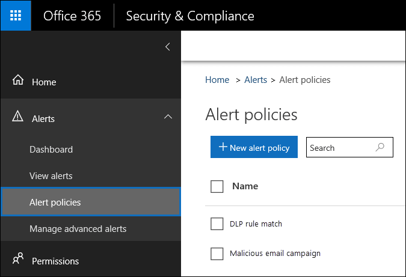
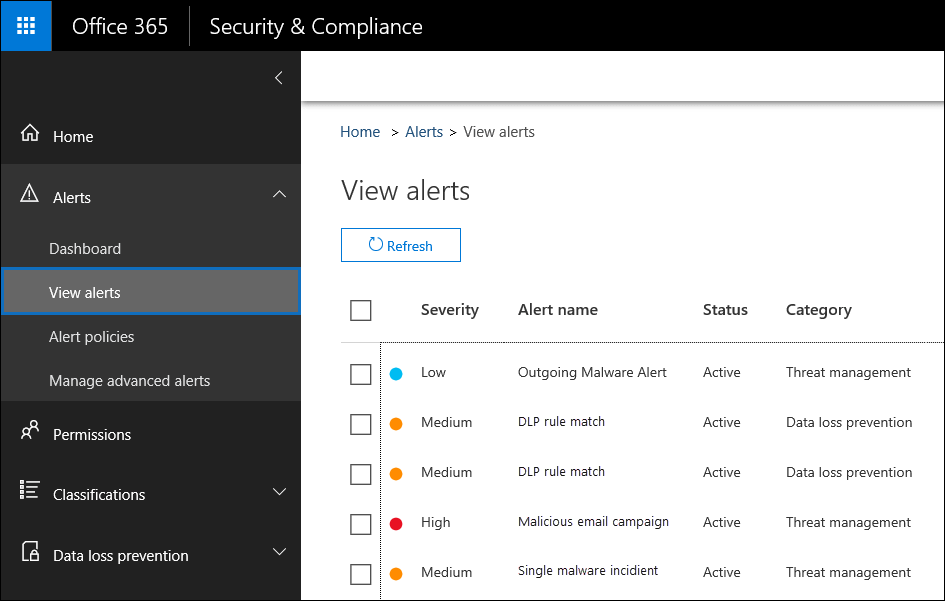
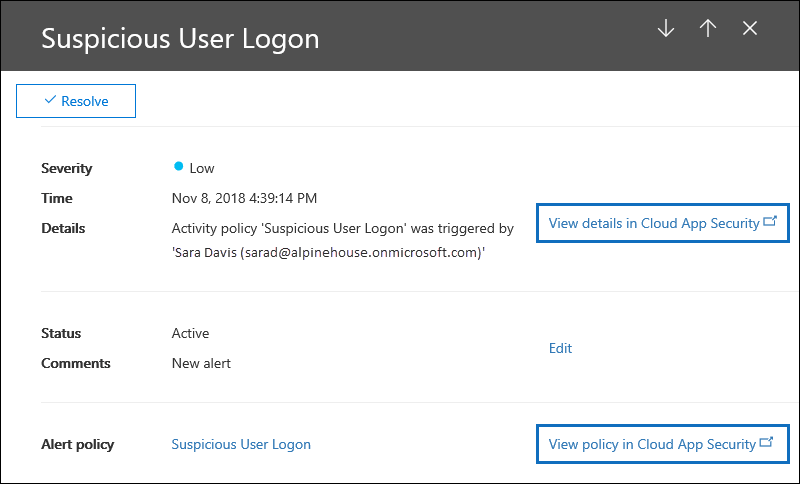

# <a name="alert-policies-in-the-security-and-compliance-center"></a>Warnungsrichtlinien im Security and Compliance Center

Sie können die neuen Warnungsrichtlinien-und Benachrichtigungs-Dashboard-Tools im Office 365-und Microsoft 365 Security and Compliance Center verwenden, um Warnungsrichtlinien zu erstellen und dann die Warnungen anzuzeigen, die generiert werden, wenn Benutzeraktivitäten ausführen, die den Bedingungen einer Warnungs Richtlinie entsprechen. Warnungsrichtlinien erstellen und erweitern die Funktionalität von Aktivitäts Warnungen, indem Sie die Warnungs Richtlinie kategorisieren, die Richtlinie auf alle Benutzer in Ihrer Organisation anwenden, einen Schwellenwert für den Zeitpunkt festlegen, zu dem eine Warnung ausgelöst wird, und entscheiden, ob e-Mails empfangen werden sollen. Benachrichtigungen. Es gibt auch eine Seite **Benachrichtigungen anzeigen** im Security and Compliance Center, in der Sie Warnungen anzeigen und Filtern, einen Warnungsstatus festlegen können, der Ihnen bei der Verwaltung von Warnungen hilft, und dann Warnungen nach dem angesprochenen oder behobenen Vorfall ignorieren. Außerdem haben wir den Typ der Ereignisse erweitert, für die Sie Warnungen erstellen können. Sie können beispielsweise Warnungsrichtlinien erstellen, um Malwareaktivitäten und Datenverlust Vorfälle nachzuverfolgen. Schließlich haben wir auch mehrere standardmäßige Warnungsrichtlinien aufgeführt, mit denen Sie Aktivitäten wie das Zuweisen von Administratorrechten in Exchange Online, Malwareangriffe, Phishing-Kampagnen und ungewöhnliche Ebenen von Dateilöschungen und externer Freigabe überwachen können. 
  
> [!NOTE]
> Benachrichtigungsrichtlinien stehen für Organisationen mit einem Office 365 Enterprise oder Office 365 US Government E1/G1, E3/G3 oder E5/G5-Abonnement zur Verfügung. Erweiterte Funktionen sind nur für Organisationen mit einem E5/G5-Abonnement oder für Organisationen mit einem E1/G1-oder E3/G3-Abonnement und einem Add-on-Abonnement für Office 365 Advanced Threat Protection (ATP) P2 oder Office 365 Advanced Compliance Protection verfügbar. Die Funktionalität, die ein E5/G5-oder Add-on-Abonnement erfordert, ist in diesem Thema hervorgehoben. Beachten Sie außerdem, dass Warnungsrichtlinien in den US-Regierungs Umgebungen Office 365 gcc, gcc High und DoD verfügbar sind.
  
## <a name="how-alert-policies-work"></a>Funktionsweise von Warnungsrichtlinien

Im folgenden finden Sie einen kurzen Überblick über die Funktionsweise von Warnungsrichtlinien und die Warnungen, die ausgelöst werden, wenn Benutzer-oder Administratoraktivitäten mit den Bedingungen einer Warnungs Richtlinie übereinstimmen.
  

  
1. Ein Administrator in Ihrer Organisation erstellt, konfiguriert und aktiviert eine Warnungs Richtlinie mithilfe der Seite " **Warnungsrichtlinien** " im Security and Compliance Center. Sie können auch Warnungsrichtlinien erstellen, indem Sie das **New-protectionalert können-** Cmdlet in Security #a0 Compliance Center PowerShell verwenden. Zum Erstellen von Warnungsrichtlinien müssen Sie im Security and Compliance Center die Rolle "Warnungen verwalten" oder "Organisationskonfiguration" zugewiesen haben.  
    
2. Ein Benutzer führt eine Aktivität aus, die mit den Bedingungen einer Warnungs Richtlinie übereinstimmt. Im Fall von Malwareangriffen löst infizierte e-Mail-Nachrichten, die an Benutzer in Ihrer Organisation gesendet werden, eine Warnung aus.
    
3. Office 365 generiert eine Warnung, die auf der Seite **Benachrichtigungen anzeigen** im Security and Compliance Center angezeigt wird. Wenn e-Mail-Benachrichtigungen für die Warnungs Richtlinie aktiviert sind, sendet Office 365 eine Benachrichtigung an eine Liste der Empfänger weiter. Die Warnungen, die ein Administrator oder andere Benutzer sehen können, werden auf der Seite Benachrichtigungen anzeigen durch die dem Benutzer zugewiesenen Rollen bestimmt. Weitere Informationen finden Sie im Abschnitt [RBAC Permissions Required to View Alerts](#rbac-permissions-required-to-view-alerts) .
    
4. Ein Administrator verwaltet Warnungen im Security and Compliance Center. Das Verwalten von Benachrichtigungen besteht aus dem Zuweisen eines Warnungsstatus zur Unterstützung beim Nachverfolgen und Verwalten von Untersuchungen.
    
## <a name="alert-policy-settings"></a>Warnungsrichtlinien Einstellungen

Eine Warnungs Richtlinie besteht aus einer Reihe von Regeln und Bedingungen, mit denen die Benutzer-oder Administrator Aktivität definiert wird, die eine Warnung generiert, eine Liste der Benutzer, die die Warnung auslösen, wenn Sie die Aktivität ausführen, und Schwellenwert, der definiert, wie oft die Aktivität vor einer Warnung i auftreten muss. s ausgelöst. Sie kategorisieren auch die Richtlinie und weisen ihr einen Schweregrad zu. Diese beiden Einstellungen unterstützen Sie beim Verwalten von Warnungsrichtlinien (und Warnungen, die ausgelöst werden, wenn die Richtlinienbedingungen übereinstimmen), da Sie diese Einstellungen beim Verwalten von Richtlinien und beim Anzeigen von Warnungen im Security and Compliance Center filtern können. Beispielsweise können Sie Warnungen anzeigen, die den Bedingungen aus der gleichen Kategorie entsprechen, oder Warnungen mit dem gleichen Schweregrad anzeigen.
  
Zum Anzeigen und Erstellen von Warnungsrichtlinien wechseln Sie [https://protection.office.com](https://protection.office.com) zu und klicken **** \> dann auf **Warnungsrichtlinien**. 
  

  
Eine Warnungs Richtlinie besteht aus den folgenden Einstellungen und Bedingungen.
  
- **Aktivität, die die Warnung verfolgt** – Sie erstellen eine Richtlinie zum Nachverfolgen einer Aktivität oder in einigen verwandten Aktivitäten, beispielsweise das Freigeben einer Datei mit einem externen Benutzer, indem Sie Sie freigeben, Zugriffsberechtigungen zuweisen oder einen anonymen Link erstellen. Wenn ein Benutzer die durch die Richtlinie definierte Aktivität ausführt, wird basierend auf den Warnungsschwellenwert Einstellungen eine Warnung ausgelöst.
    
    > [!NOTE]
    > Die Aktivitäten, die Sie nachverfolgen können, hängen von der Office 365 Enterprise Ihrer Organisation oder Office 365 US Government Plan ab. Im Allgemeinen erfordern Aktivitäten im Zusammenhang mit Malware Kampagnen und Phishing-Angriffen ein E5/G5-Abonnement oder ein E1/G1-oder E3/G3-Abonnement mit einem Threat Intelligence-Add-on-Abonnement. 
  
- **Aktivitätsbedingungen** – für die meisten Aktivitäten können Sie zusätzliche Bedingungen definieren, die erfüllt sein müssen, um eine Warnung auszulösen. Zu den allgemeinen Bedingungen gehören IP-Adressen (damit eine Warnung ausgelöst wird, wenn der Benutzer die Aktivität auf einem Computer mit einer bestimmten IP-Adresse oder in einem IP-Adressbereich ausführt), ob eine Warnung ausgelöst wird, wenn ein bestimmter Benutzer oder Benutzer diese Aktivität ausführt, und ob die Aktivität wird für einen bestimmten Dateinamen oder eine bestimmte URL ausgeführt. Sie können auch eine Bedingung konfigurieren, die eine Warnung auslöst, wenn die Aktivität von einem beliebigen Benutzer in Ihrer Organisation ausgeführt wird. Die verfügbaren Bedingungen hängen von der ausgewählten Aktivität ab.
    
- **Wenn die Warnung ausgelöst wird** , können Sie eine Einstellung konfigurieren, die definiert, wie oft eine Aktivität auftreten kann, bevor eine Warnung ausgelöst wird. Auf diese Weise können Sie eine Richtlinie einrichten, um eine Warnung jedes Mal zu generieren, wenn eine Aktivität mit den Richtlinienbedingungen übereinstimmt, wenn ein bestimmter Schwellenwert überschritten wird oder wenn das Auftreten der Aktivität, die die Warnung verfolgt, für Ihre Organisation ungewöhnlich wird. 
    
    
  
    Wenn Sie die Einstellung basierend auf ungewöhnlichen Aktivitäten auswählen, legt Office 365 einen Baselinewert fest, der die normale Häufigkeit für die ausgewählte Aktivität definiert. Es dauert bis zu 7 Tage, diesen Basisplan einzurichten, während dessen keine Benachrichtigungen generiert werden. Nachdem der Basisplan eingerichtet wurde, wird eine Warnung ausgelöst, wenn die von der Warnungs Richtlinie verfolgte Häufigkeit der Aktivität den Basis Wert erheblich überschreitet. Für Überwachungsbezogene Aktivitäten (beispielsweise Datei-und Ordner Aktivitäten) können Sie einen Basisplan basierend auf einem einzelnen Benutzer oder basierend auf allen Benutzern in Ihrer Organisation einrichten. bei Malware bezogenen Aktivitäten können Sie einen Basisplan basierend auf einer einzelnen Schadsoftware-Familie, einem einzelnen Empfänger oder allen Nachrichten in Ihrer Organisation einrichten.
    
    > [!NOTE]
    > Die Möglichkeit zum Konfigurieren von Warnungsrichtlinien basierend auf einem Schwellenwert oder basierend auf ungewöhnlichen Aktivitäten erfordert ein E5/G5-Abonnement oder ein E1/G1-oder E3/G3-Abonnement mit einem Add-on-Abonnement für Office 365 ATP P2 oder Advanced Compliance. Organisationen mit einem E1/G1-und E3/G3-Abonnement können nur eine Warnungs Richtlinie erstellen, bei der bei jedem Auftreten einer Aktivität eine Warnung ausgelöst wird. 
  
- **Warnungskategorie** – um die Überwachung und Verwaltung der von einer Richtlinie generierten Warnungen zu unterstützen, können Sie einer Richtlinie eine der folgenden Kategorien zuweisen.
    
  - Datengovernance
    
  - Verhinderung von Datenverlust

  - Nachrichtenübermittlung
    
  - Berechtigungen
    
  - Bedrohungsverwaltung
    
  - Sonstige
    
  Wenn eine Aktivität auftritt, die den Bedingungen der Warnungs Richtlinie entspricht, wird die generierte Warnung mit der Kategorie markiert, die in dieser Einstellung definiert ist. Auf diese Weise können Sie Warnungen nachverfolgen und verwalten, die die gleiche Kategorieeinstellungen auf der Seite **Benachrichtigungen anzeigen** im Security and Compliance Center haben, da Sie Warnungen basierend auf der Kategorie sortieren und Filtern können. 
    
- **Warnungsschweregrad** – ähnlich wie bei der Warnungskategorie weisen Sie Warnungsrichtlinien ein Severity-Attribut (**niedrig**, **Mittel**, **hoch**oder ininformational) zu. **** Wie bei der Warnungskategorie wird bei einer Aktivität, die den Bedingungen der Warnungs Richtlinie entspricht, die generierte Warnung mit dem gleichen Schweregrad markiert, der für die Warnungs Richtlinie festgelegt ist. Auf diese Weise können Sie auch Warnungen nachverfolgen und verwalten, die auf der Seite **Benachrichtigungen anzeigen** die gleiche Dringlichkeits Einstellung aufweisen. Sie können beispielsweise die Liste der Warnungen filtern, sodass nur Warnungen mit einem **hohen** Schweregrad angezeigt werden. 
    
    > [!TIP]
    > Wenn Sie eine Warnungs Richtlinie einrichten, sollten Sie einen höheren Schweregrad den Aktivitäten zuweisen, die zu schwerwiegenden negativen Folgen führen können, beispielsweise die Erkennung von Schadsoftware nach der Zustellung an Benutzer, das Anzeigen vertraulicher oder klassifizierter Daten, die gemeinsame Nutzung von Daten mit externen Benutzern, oder andere Aktivitäten, die zu Datenverlust oder Sicherheitsbedrohungen führen können. Dies kann Ihnen helfen, Warnungen und die Aktionen, die Sie zum untersuchen und beheben der zugrunde liegenden Ursachen durchführen, zu priorisieren. 
  
- **E-Mail-Benachrichtigungen** – Sie können die Richtlinie so einrichten, dass e-Mail-Benachrichtigungen an eine Liste von Benutzern gesendet (oder nicht gesendet) werden, wenn eine Warnung ausgelöst wird. Sie können auch einen Grenzwert für tägliche Benachrichtigungen festlegen, sodass während dieses Tages keine Benachrichtigungen mehr für die Benachrichtigung gesendet werden, wenn die maximale Anzahl von Benachrichtigungen erreicht wurde. Neben e-Mail-Benachrichtigungen können Sie oder andere Administratoren die Benachrichtigungen anzeigen, die von einer Richtlinie auf der Seite **Benachrichtigungen anzeigen** ausgelöst werden. Sie können e-Mail-Benachrichtigungen für Warnungsrichtlinien einer bestimmten Kategorie aktivieren oder die Einstellung für einen höheren Schweregrad verwenden. 
  
## <a name="default-alert-policies"></a>Standard Warnungsrichtlinien

Office 365 bietet integrierte Warnungsrichtlinien, die die Identifizierung von Exchange-Administratorberechtigungen, Malwareaktivitäten und Risiken bei der Datensteuerung ermöglichen. Auf der Seite " **Warnungsrichtlinien** " sind die Namen dieser integrierten Richtlinien fett formatiert, und der Richtlinientyp ist als **System**definiert. Diese Richtlinien sind standardmäßig aktiviert. Sie können diese Richtlinien deaktivieren (oder wieder einschalten), eine Liste der Empfänger einrichten, an die e-Mail-Benachrichtigungen gesendet werden sollen, und einen Grenzwert für tägliche Benachrichtigungen festlegen. Die anderen Einstellungen für diese Richtlinien können nicht bearbeitet werden.
  
In der folgenden Tabelle werden die verfügbaren Standard Warnungsrichtlinien und die Kategorie beschrieben, der jede Richtlinie zugewiesen ist. Die Kategorie wird verwendet, um zu bestimmen, welche Warnungen ein Benutzer auf der Seite Benachrichtigungen anzeigen anzeigen kann. Weitere Informationen finden Sie im Abschnitt [RBAC Permissions Required to View Alerts](#rbac-permissions-required-to-view-alerts) .  

In der Tabelle werden außerdem die Office 365 Enterprise und Office 365 US Government-Plan angegeben, der für jeden erforderlich ist. Einige standardmäßige Warnungsrichtlinien sind verfügbar, wenn Ihre Organisation zusätzlich zu einem E1/G1-oder E3/G3-Abonnement über das entsprechende Add-on-Abonnement verfügt. 
  
|**Standardmäßige Warnungs Richtlinie**|**Beschreibung**|**Category**|**Office 365 Enterprise Abonnement**|
|:-----|:-----|:-----|:-----|
|**Ein potenziell böswilliger URL-Klick wurde erkannt.** <br/> |Generiert eine Warnung, wenn ein Benutzer, der durch [Office 365 sichere ATP-Links](https://docs.microsoft.com/office365/securitycompliance/atp-safe-links) in Ihrer Organisation geschützt wird, auf einen bösartigen Link klickt. Dieses Ereignis wird ausgelöst, wenn URL-Urteils Änderungen durch Office 365 ATP identifiziert werden oder wenn Benutzer die Seiten der Office 365 ATP-sichere Links (basierend auf der Office 365 Richtlinie für ATP-Links in Ihrer Organisation) außer Kraft setzen. Diese Warnungs Richtlinie weist eine Einstellung mit **hohem** Schweregrad auf. Für Office 365 ATP P2, E5, G5-Kunden wird diese Warnung automatisch [Office 365 automatische Untersuchung und Antwort](https://go.microsoft.com/fwlink/?linkid=2084737)ausgelöst. Weitere Informationen zu Ereignissen, die diese Warnung auslösen, finden Sie unter [Einrichten Office 365 ATP-Richtlinien für sichere Links](https://docs.microsoft.com/office365/securitycompliance/set-up-atp-safe-links-policies).  <br/> |Bedrohungsverwaltung <br/> |E5/G5 oder Office 365 Add-on-Abonnement für ATP P2  <br/> |
|**Erstellen der Weiterleitungs-/Umleitungsregel** <br/> |Generiert eine Warnung, wenn jemand in Ihrer Organisation eine Posteingangsregel für Ihr Postfach erstellt, die Nachrichten an ein anderes e-Mail-Konto weiterleitet oder leitet. Diese Richtlinie verfolgt nur Posteingangsregeln, die mit Outlook im Internet (früher als Outlook Web App bezeichnet) oder Exchange Online PowerShell erstellt wurden. Diese Richtlinie weist **** eine Einstellung mit niedrigem Schweregrad auf. Weitere Informationen zum Weiterleiten und Umleiten von e-Mails in Outlook im Internet mithilfe von Posteingangsregeln finden Sie unter [Use Rules in Outlook im Internet, um Nachrichten automatisch an ein anderes Konto weiter](https://support.office.com/article/1433e3a0-7fb0-4999-b536-50e05cb67fed)zuleiten.  <br/> |Bedrohungsverwaltung <br/> |E1/G1, E3/G3 oder E5/G5  <br/> |
|**eDiscovery-Suche gestartet oder exportiert** <br/> |Generiert eine Warnung, wenn ein Benutzer das Tool für die Inhaltssuche im Security and Compliance Center verwendet. Eine Warnung wird ausgelöst, wenn die folgenden Inhalts Suchaktivitäten ausgeführt werden: <br/><br/>• Es wurde eine Inhaltssuche gestartet.<br/>• Die Ergebnisse einer Inhaltssuche werden exportiert.<br/>• Es wird ein Inhalts Suchbericht exportiert<br/><br/>Warnungen werden auch ausgelöst, wenn die vorherigen Inhalts Suchaktivitäten in Verbindung mit einem eDiscovery-Fall ausgeführt werden. Diese Richtlinie weist **** eine Einstellung mit mittlerem Schweregrad auf. Weitere Informationen zu Inhalts Suchaktivitäten finden Sie unter [Suchen nach eDiscovery-Aktivitäten im Office 365 Überwachungsprotokoll](search-for-ediscovery-activities-in-the-audit-log.md#ediscovery-activities). <br/> |Bedrohungsverwaltung<br/> |E1/G1, E3/G3 oder E5/G5  <br/> |
|**Erhöhung der Exchange-Administratorberechtigung** <br/> |Generiert eine Warnung, wenn jemandem Administratorrechte in Ihrer Exchange Online Organisation zugewiesen sind. Beispiel: Wenn ein Benutzer der Rollengruppe "Organisationsverwaltung" in Exchange Online hinzugefügt wird. Diese Richtlinie weist **** eine Einstellung mit niedrigem Schweregrad auf.  <br/> |Berechtigungen <br/> |E1/G1, E3/G3 oder E5/G5  <br/> |
|**E-Mail-Nachrichten mit Schadsoftware nach der Zustellung entfernt** <br/> |Generiert eine Warnung, wenn Nachrichten mit Schadsoftware an Postfächer in Ihrer Organisation übermittelt werden. Wenn dieses Ereignis auftritt, entfernt Office 365 die infizierten Nachrichten aus Exchange Online-Postfächern mithilfe der [automatischen Säuberungs Zeit von Null Stunden](https://docs.microsoft.com/en-us/office365/securitycompliance/zero-hour-auto-purge). Diese Richtlinie weist eine Einstellung für den **Informations** Grad auf und löst automatisch [Office 365 automatische Untersuchung und Antwort](https://go.microsoft.com/fwlink/?linkid=2084737)aus.<br/> |Bedrohungsverwaltung <br/> |E5/G5 oder Office 365 Add-on-Abonnement für ATP P2  <br/> |
|**E-Mail-Nachrichten mit Phishing-URLs nach der Zustellung entfernt** <br/> |Generiert eine Warnung, wenn Nachrichten mit Phishing an Postfächer in Ihrer Organisation übermittelt werden. Wenn dieses Ereignis auftritt, entfernt Office 365 die infizierten Nachrichten aus Exchange Online-Postfächern mithilfe der [automatischen Säuberungs Zeit von Null Stunden](https://docs.microsoft.com/en-us/office365/securitycompliance/zero-hour-auto-purge). Diese Richtlinie weist eine Einstellung für den **Informations** Grad auf und löst automatisch [Office 365 automatische Untersuchung und Antwort](https://go.microsoft.com/fwlink/?linkid=2084737)aus.<br/> |Bedrohungsverwaltung <br/> |E5/G5 oder Office 365 Add-on-Abonnement für ATP P2  <br/> |
|**Vom Benutzer als Schadsoftware oder Phishing gemeldete e-Mail** <br/> |Generiert eine Warnung, wenn Benutzer in Ihrer Organisation Nachrichten als Phishing-e-Mails mithilfe des Berichtsnachrichten-Add-Ins melden. Diese Richtlinie weist eine Einstellung für den **Informations** Grad auf. Weitere Informationen zu diesem Add-in finden Sie unter [Verwenden des Berichtsnachrichten-Add-ins](https://support.office.com/article/b5caa9f1-cdf3-4443-af8c-ff724ea719d2). Für Office 365 ATP P2, E5, G5-Kunden wird diese Warnung automatisch [Office 365 automatische Untersuchung und Antwort](https://go.microsoft.com/fwlink/?linkid=2084737)ausgelöst.  <br/> |Bedrohungsverwaltung <br/> |E1/G1, E3/G3 oder E5/G5  <br/> |
|**Nachrichten wurden verzögert** <br/> |Generiert eine Warnung, wenn Office 365 keine e-Mail-Nachrichten über einen Connector an Ihre lokale Organisation oder einen Partnerserver übertragen kann. In diesem Fall wird die Nachricht in Office 365 in die Warteschlange eingereiht. Diese Warnung wird ausgelöst, wenn 2.000 Nachrichten oder mehr als eine Stunde lang in die Warteschlange eingereiht wurden. Diese Richtlinie weist eine Einstellung mit **hohem** Schweregrad auf.  <br/> |Nachrichtenübermittlung<br/> |E1/G1, E3/G3 oder E5/G5  <br/> |
|**Schadsoftware-Kampagne nach Zustellung erkannt** <br/> |Generiert eine Warnung, wenn eine ungewöhnlich große Anzahl von Nachrichten mit Schadsoftware an Postfächer in Ihrer Organisation übermittelt werden. Wenn dieses Ereignis auftritt, entfernt Office 365 die infizierten Nachrichten aus Exchange Online Postfächern. Diese Richtlinie weist eine Einstellung mit **hohem** Schweregrad auf.  <br/> |Bedrohungsverwaltung<br/> |E5/G5 oder Office 365 Add-on-Abonnement für ATP P2  <br/> |
|**Schadsoftware-Kampagne erkannt und blockiert** <br/> |Generiert eine Warnung, wenn jemand versucht hat, eine ungewöhnlich große Anzahl von e-Mail-Nachrichten zu senden, die eine bestimmte Art von Schadsoftware für Benutzer in Ihrer Organisation enthalten. Wenn dieses Ereignis eintritt, werden die infizierten Nachrichten durch Office 365 blockiert und nicht an Postfächerüber mittelt. Diese Richtlinie weist **** eine Einstellung mit niedrigem Schweregrad auf.  <br/> |Bedrohungsverwaltung<br/> |E5/G5 oder Office 365 Add-on-Abonnement für ATP P2  <br/> |
|**In SharePoint und OneDrive erkannte Malware Kampagne** <br/> |Generiert eine Warnung, wenn in Dateien, die sich in SharePoint-Websites oder OneDrive-Konten in Ihrer Organisation befinden, eine ungewöhnlich hohe Menge an Schadsoftware oder Viren erkannt wird. Diese Richtlinie weist eine Einstellung mit **hohem** Schweregrad auf.  <br/> |Bedrohungsverwaltung<br/> |E5/G5 oder Office 365 Add-on-Abonnement für ATP P2  <br/> |
|**Durch Mandanten-oder Benutzer Überschreibung gelieferter Phishing** -Schutz <sup>1</sup> <br/> |Generiert eine Warnung, wenn Office 365 eine Administrator-oder Benutzer Überschreibung erkennt, die die Zustellung einer Phishing-Nachricht an ein Postfach erlaubt. Beispiele für Außerkraftsetzungen sind ein Posteingang oder eine Nachrichtenfluss Regel, die Nachrichten von einem bestimmten Absender oder einer bestimmten Domäne oder eine Antispampolitik zulässt, die Nachrichten von bestimmten Absendern oder Domänen zulässt. Diese Richtlinie weist eine Einstellung mit **hohem** Schweregrad auf.  <br/> |Bedrohungsverwaltung<br/> |E5/G5 oder Office 365 Add-on-Abonnement für ATP P2  <br/> |
|**Erkannte verdächtige e-Mail-Sende Muster** <br/> |Generiert eine Warnung, wenn jemand in Ihrer Organisation verdächtige e-Mails gesendet hat und das Risiko besteht, dass e-Mails nicht gesendet werden. Dies ist eine frühzeitige Warnung für das Verhalten, die darauf hindeuten kann, dass das Konto gefährdet ist, aber nicht schwer genug, um den Benutzer zu beschränken. Diese Richtlinie weist **** eine Einstellung mit mittlerem Schweregrad auf. Obwohl es selten ist, kann eine von dieser Richtlinie generierte Warnung eine Anomalie sein. Es empfiehlt sich jedoch, zu [überprüfen, ob das Benutzerkonto kompromittiert wurde](responding-to-a-compromised-email-account.md). <br/> |Bedrohungsverwaltung<br/> |E1/G1, E3/G3 oder E5/G5  <br/>|
|**Mandanten vom Senden von e-Mails eingeschränkt** <br/> |Generiert eine Warnung, wenn der Großteil des e-Mail-Datenverkehrs aus Ihrer Organisation als verdächtig erkannt wurde und Microsoft Ihre Organisation vom Senden von e-Mails eingeschränkt hat. Untersuchen Sie potenziell gefährdete Benutzer-und Administratorkonten, neue Connectors oder offene Relays, und wenden Sie sich an den Microsoft-Support, um die Blockierung Ihrer Organisation aufzuheben. Diese Richtlinie weist eine Einstellung mit **hohem** Schweregrad auf. Weitere Informationen dazu, warum Organisationen blockiert werden, finden Sie unter [Beheben von Problemen mit der Zustellung von e-Mails für den Fehlercode 5.7.7 XX in Exchange Online](https://go.microsoft.com/fwlink/?linkid=2022138).  <br/> |Bedrohungsverwaltung<br/> |E1/G1, E3/G3 oder E5/G5  <br/> |
|**Ungewöhnliche Dateiaktivität für externe Benutzer** <br/> |Generiert eine Warnung, wenn eine ungewöhnlich große Anzahl von Aktivitäten für Dateien in SharePoint oder OneDrive von Benutzern außerhalb Ihrer Organisation ausgeführt wird. Dazu gehören Aktivitäten wie der Zugriff auf Dateien, das Herunterladen von Dateien und das Löschen von Dateien. Diese Richtlinie weist eine Einstellung mit **hohem** Schweregrad auf.  <br/> |Datengovernance<br/> |E5/G5, Office 365 ATP P2 oder Advanced Compliance Add-on-Abonnement  <br/> |
|**Ungewöhnlich Umfang der externen Dateifreigabe** <br/> |Generiert eine Warnung, wenn eine ungewöhnlich große Anzahl von Dateien in SharePoint oder OneDrive für Benutzer außerhalb Ihrer Organisation freigegeben wird. Diese Richtlinie weist **** eine Einstellung mit mittlerem Schweregrad auf.  <br/> |Datengovernance<br/> |E5/G5, Office 365 ATP P2 oder Advanced Compliance Add-on-Abonnement  <br/> |
|**Ungewöhnlicher Umfang der Dateilöschung** <br/> |Generiert eine Warnung, wenn eine ungewöhnlich große Anzahl von Dateien in SharePoint oder OneDrive innerhalb eines kurzen Zeitrahmens gelöscht wird. Diese Richtlinie weist **** eine Einstellung mit mittlerem Schweregrad auf.  <br/> |Datengovernance <br/> |E5/G5, Office 365 ATP P2 oder Advanced Compliance Add-on-Abonnement  <br/> |
|**Ungewöhnlich höhere e-Mail-Zuwachs Meldung als Phishing** <br/> |Generiert eine Warnung, wenn sich die Anzahl der Personen in Ihrer Organisation mit dem Berichtsnachrichten-Add-in in Outlook erheblich erhöht, um Nachrichten als Phishing-e-Mails zu melden. Diese Richtlinie weist eine Einstellung mit **hohem** Schweregrad auf. Weitere Informationen zu diesem Add-in finden Sie unter [Verwenden des Berichtsnachrichten-Add-ins](https://support.office.com/article/b5caa9f1-cdf3-4443-af8c-ff724ea719d2).  <br/> |Bedrohungsverwaltung<br/> |E5/G5 oder Office 365 Add-on-Abonnement für ATP P2  <br/> |
|**Benutzeridentitätswechsel, der in den Posteingang/Ordner übermittelt** wurde <sup>1,</sup> <sup>2</sup> <br/> |Generiert eine Warnung, wenn Office 365 erkennt, dass ein Administrator oder Benutzer Außerkraftsetzungen, die die Zustellung einer Phishing-Nachricht für den Benutzeridentitätswechsel in den Posteingang (oder einen anderen Benutzer zugänglichen Ordner) eines Postfachs zugelassen haben. Beispiele für Außerkraftsetzungen sind ein Posteingang oder eine Nachrichtenfluss Regel, die Nachrichten von einem bestimmten Absender oder einer bestimmten Domäne oder eine Antispampolitik zulässt, die Nachrichten von bestimmten Absendern oder Domänen zulässt. Diese Richtlinie weist **** eine Einstellung mit mittlerem Schweregrad auf.  <br/> |Bedrohungsverwaltung<br/> |E5/G5 oder Office 365 Add-on-Abonnement für ATP P2  <br/> |
|**Benutzer vom Senden von e-Mails eingeschränkt** <br/> |Generiert eine Warnung, wenn jemand in Ihrer Organisation vom Senden von ausgehenden e-Mails eingeschränkt ist. Dies ergibt sich normalerweise, wenn ein Konto kompromittiert wird und der Benutzer auf der Seite " **eingeschränkte Benutzer** " im Security #a0 Compliance Center aufgeführt ist. (Um auf diese Seite zuzugreifen, wechseln Sie zu **Threat Management #a0 überprüfen #a1 eingeschränkten Benutzern**). Diese Richtlinie weist eine Einstellung mit **hohem** Schweregrad auf. Weitere Informationen zu eingeschränkten Benutzern finden Sie unter [Entfernen eines Benutzers, einer Domäne oder einer IP-Adresse aus einer Sperrliste nach dem Senden von Spam-e-Mails](https://docs.microsoft.com/office365/securitycompliance/removing-a-user-domain-or-ip-address-from-a-block-list-after-sending-spam-email).  <br/> |Bedrohungsverwaltung<br/> |E1/G1, E3/G3 oder E5/G5  <br/> |
|||||
   
> [!NOTE]
> <sup>1</sup> wir haben diese Standard Warn Richtlinie vorübergehend basierend auf Kundenfeedback entfernt. Wir arbeiten daran, Sie zu verbessern, und werden Sie in naher Zukunft durch eine neue Version ersetzen. Bis dahin können Sie eine benutzerdefinierte Warnungs Richtlinie erstellen, um diese Funktionalität mithilfe der folgenden Einstellungen zu ersetzen:<br/>&nbsp;• Aktivität ist eine Phishing-e-Mail, die zum Zeitpunkt der Zustellung erkannt wurde<br/>&nbsp;• E-Mail ist nicht zap 'd<br/>&nbsp;• Die e-Mail-Richtung ist eingehend<br/>&nbsp;• Nachrichten Zustellungsstatus wird zugestellt<br/>&nbsp;• Erkennungstechnologie: böswillige URL-Aufbewahrung, URL-Detonation, erweiterter Phishing-Filter, allgemeiner Phishingfilter, Domänen Identitätswechsel, Benutzeridentitätswechsel und Marken Identitätswechsel<br/><br/><sup>2</sup> um diese Warnungs Richtlinie erneut zu erstellen, führen Sie die Anweisungen in der vorherigen Fußnote aus, aber wählen Sie als einzige Erkennungstechnologie den Benutzeridentitätswechsel aus. 

Die ungewöhnliche Aktivität, die von einigen der integrierten Richtlinien überwacht wird, basiert auf dem gleichen Prozess wie die zuvor beschriebene Warnungsschwellenwert Einstellung. Office 365 richtet einen Baseline-Wert ein, der die normale Häufigkeit für "übliche" Aktivitäten definiert. Benachrichtigungen werden dann ausgelöst, wenn die Häufigkeit der Aktivitäten, die von der integrierten Warnungs Richtlinie verfolgt werden, den Basisplan erheblich überschreitet.
 
## <a name="viewing-alerts"></a>Anzeigen von Benachrichtigungen

Wenn eine Aktivität, die von Benutzern in Ihrer Organisation ausgeführt wird, mit den Einstellungen einer Warnungs Richtlinie übereinstimmt, wird eine Warnung generiert und auf der Seite **Benachrichtigungen anzeigen** im Security and Compliance Center angezeigt, abhängig von den Einstellungen einer Warnungs Richtlinie, einer e-Mail-Nachricht Benachrichtigung wird auch an eine Liste der angegebenen Benutzer gesendet, wenn eine Warnung ausgelöst wird. Für jede Warnung zeigt das Dashboard auf der Seite **Benachrichtigungen anzeigen** den Namen der entsprechenden Warnungs Richtlinie, den Schweregrad und die Kategorie für die Warnung (definiert in der Warnungs Richtlinie) sowie die Häufigkeit an, mit der eine Aktivität aufgetreten ist, die dazu geführt hat, dass die Warnung generiert. Dieser Wert basiert auf der Schwellenwerteinstellung der Warnungs Richtlinie. Das Dashboard zeigt außerdem den Status jeder Warnung an. Weitere Informationen zur Verwendung der Status-Eigenschaft zum Verwalten von Warnungen finden Sie im Abschnitt [Managing Alerts](#managing-alerts) . 
  
Um Warnungen anzuzeigen, wechseln Sie [https://protection.office.com](https://protection.office.com) zu und klicken Sie dann auf **Warnungen** \> **anzeigen**. 
  

  
Sie können die folgenden Filter verwenden, um eine Teilmenge aller Benachrichtigungen auf der Seite **Benachrichtigungen anzeigen** anzuzeigen. 
  
- **Status** – verwenden Sie diesen Filter, um Warnungen anzuzeigen, denen ein bestimmter Status zugewiesen ist. Der Standardstatus ist **aktiv**. Sie oder andere Administratoren können den Statuswert ändern.
    
- **Richtlinie** – verwenden Sie diesen Filter, um Warnungen anzuzeigen, die mit der Einstellung einer oder mehrerer Warnungsrichtlinien übereinstimmen. Sie können auch alle Benachrichtigungen für alle Warnungsrichtlinien anzeigen.
    
- **Zeitbereich** – verwenden Sie diesen Filter, um Warnungen anzuzeigen, die innerhalb eines bestimmten Datums-und Zeitbereichs generiert wurden.
    
- **Schweregrad** – verwenden Sie diesen Filter, um Warnungen anzuzeigen, denen ein bestimmter Schweregrad zugewiesen ist.
    
- **Category** – verwenden Sie diesen Filter, um Warnungen aus einer oder mehreren Warnungs Kategorien anzuzeigen.

- **Quelle** – verwenden Sie diesen Filter, um Warnungen anzuzeigen, die von Warnungsrichtlinien im Security and Compliance Center ausgelöst wurden, oder Warnungen, die von Office 365 Cloud App-Sicherheitsrichtlinien ausgelöst wurden, oder beides. Weitere Informationen zu Office 365 Cloud App-Sicherheitswarnungen finden Sie im Abschnitt zum [Anzeigen von Cloud-App-Sicherheitswarnungen](#viewing-cloud-app-security-alerts) .

## <a name="rbac-permissions-required-to-view-alerts"></a>Erforderliche RBAC-Berechtigungen zum Anzeigen von Warnungen

Die Berechtigungen für die rollenbasierte Zugriffssteuerung (Role Based Access Control, RBAC), die Benutzern in Ihrer Organisation zugewiesen sind, bestimmen, welche Warnungen ein Benutzer auf der Seite **Benachrichtigungen anzeigen** sehen kann. Wie wird dies erreicht? Die Verwaltungsrollen, die Benutzern zugewiesen sind (basierend auf Ihrer Mitgliedschaft in Rollengruppen im Security #a0 Compliance Center), bestimmen, welche Warnungs Kategorien ein Benutzer auf der Seite **Benachrichtigungen anzeigen** sehen kann. Im Folgenden finden Sie einige Beispiele:

- Mitglieder der Rollengruppe "Datensatzverwaltung" können nur die Warnungen anzeigen, die von Warnungsrichtlinien generiert werden, denen die Kategorie " **Data Governance** " zugewiesen ist.

- Mitglieder der Rollengruppe "Compliance-Administrator" können keine Warnungen anzeigen, die von Warnungsrichtlinien generiert werden, denen die Kategorie " **Threat Management** " zugewiesen ist. 

- Mitglieder der Rollengruppe "eDiscovery-Manager" können keine Warnungen anzeigen, da keine der zugewiesenen Rollen die Berechtigung zum Anzeigen von Warnungen aus jeder Warnungskategorie bereitstellt.

Mit diesem Entwurf (basierend auf RBAC-Berechtigungen) können Sie bestimmen, welche Warnungen von Benutzern in bestimmten Auftrags Rollen in Ihrer Organisation angezeigt (und verwaltet) werden können. 

In der folgenden Tabelle sind die Rollen aufgeführt, die zum Anzeigen von Warnungen aus den 6 verschiedenen Warnungs Kategorien erforderlich sind. In der ersten Spalte in den Tabellen werden alle Rollen im Security #a0 Compliance Center aufgeführt.  Ein Häkchen zeigt an, dass ein Benutzer, dem diese Rolle zugewiesen ist, Warnungen aus der entsprechenden Warnungskategorie anzeigen kann, die in der obersten Zeile aufgeführt ist.

Informationen zur Kategorie, der eine standardmäßige Warnungs Richtlinie zugewiesen ist, finden Sie in der Tabelle im Abschnitt [standardmäßige Warnungsrichtlinien](#default-alert-policies) .

|<br/>|Datengovernance|Verhinderung von Datenverlust|Nachrichtenübermittlung|Berechtigungen|Bedrohungsverwaltung|Sonstige | 
|:---------|:---------:|:---------:|:---------:|:---------:|:---------:|:---------:|
|Überwachungsprotokolle <br/> |         ||         |         |         |         |
|Fallverwaltung <br/>|         |         |         |         |         |         |
|Complianceadministrator<br/>|| |||         ||
|Compliance-Suche<br/>|         |         |         |         |         |         |
|Geräteverwaltung<br/>|         |         |         |         |         |         |
|Dispositionsverwaltung<br/>|         |         |         |         |         |         |
|DLP-Konformitätsverwaltung<br/>|         ||         |         |         |         |
|Exportieren<br/>|         |         |         |         |         |         |
|Situ<br/>|         |         |         |         |         |         |
|
            Benachrichtigungen verwalten<br/>|         |         |         |         |         ||
|Organisationskonfiguration|         |         |         |         |         ||
|Vorschau <br/>|         |         |         |         |         |         |
|Datensatzverwaltung <br/>||         |         |         |         |         |
|Aufbewahrungsverwaltung <br/>| |         |         |         |         |         |
|Überprüfung <br/>|         |         |         |         |         |         |
|RMS-Entschlüsselung<br/>|         |         |         |         |         |         |
|Rollenverwaltung<br/>|         |         |         ||         |         |
|Suchen und löschen<br/>|         |         |         |         |         |         |
|Sicherheitsadministrator<br/>||| | | ||
|Sicherheits Leser<br/>|         || | | |
|Service Assurance-Ansicht<br/>|         |         |         |         |         |         |
|Aufsichts Überprüfungs Administrator<br/>|         |         |         |         |         |         |
|Überwachungsprotokolle nur anzeigen<br/>|         |         |         |         |         |         |
|Geräteverwaltung mit Ansichts Schutz<br/>|         |         |         |         |         |         |
|DLP-Konformitätsverwaltung mit Ansichts Schutz<br/>|         ||         |         |         |         |
|Benachrichtigungen nur anzeigen verwalten<br/>|         |         |         |         |         ||
|Schreibgeschützte Empfänger<br/>|         |         |         |         ||         |
|Datensatzverwaltung mit Ansichts Schutz<br/>||         |         |         |         |         |
|Aufbewahrungsverwaltung mit Ansichts Schutz<br/>||         |         |         |         |         |
|         |         |         |         |         |         |

**Tipp:** Führen Sie die folgenden Befehle in Security #a0 Compliance Center PowerShell aus, um die Rollen anzuzeigen, die den einzelnen Standardrollengruppen zugewiesen sind: 

```
$RoleGroups = Get-RoleGroup
```

```
$RoleGroups | foreach {Write-Output -InputObject `r`n,$_.Name,"-----------------------"; Get-RoleGroup $_.Identity | Select-Object -ExpandProperty Roles}
```

Sie können auch die einer Rollengruppe zugewiesenen Rollen im Security #a0 Compliance Center anzeigen. Wechseln Sie zur Seite **Berechtigungen** , und klicken Sie auf eine Rollengruppe. Die zugewiesenen Rollen werden auf der Flyout-Seite aufgelistet.


## <a name="managing-alerts"></a>Verwalten von Warnungen

Nachdem Benachrichtigungen generiert und auf der Seite **Benachrichtigungen anzeigen** im Security and Compliance Center angezeigt wurden, können Sie diese selektieren, untersuchen und beheben. Hier sind einige Aufgaben, die Sie zum Verwalten von Warnungen ausführen können. 
  
- **Zuweisen eines Status zu Warnungen** – Sie können einem der folgenden Statusbenachrichtigungen zuweisen: **aktiv** (der Standardwert), unter **Suchen**, **aufgelöst**oder **entlassen**. Anschließend können Sie nach dieser Einstellung filtern, um Warnungen mit der gleichen Statuseinstellung anzuzeigen. Diese Statuseinstellung kann helfen, den Prozess der Verwaltung von Warnungen zu verfolgen.
    
- **Anzeigen von Warnungsdetails** – Sie können auf eine Warnung klicken, um eine Flyout-Seite mit Details zur Warnung anzuzeigen. Die detaillierten Informationen hängen von der entsprechenden Warnungs Richtlinie ab, enthält aber in der Regel Folgendes: Name des tatsächlichen Vorgangs, der die Warnung ausgelöst hat (beispielsweise ein Cmdlet), eine Beschreibung der Aktivität, die die Warnung ausgelöst hat, der Benutzer (oder die Liste der Benutzer) Wer die Warnung ausgelöst hat, sowie den Namen (und den Link zu) der entsprechenden Warnungs Richtlinie.
    
  - Der Name des tatsächlichen Vorgangs, der die Warnung ausgelöst hat, beispielsweise ein Cmdlet oder ein Überwachungsprotokoll Vorgang.
    
  - Eine Beschreibung der Aktivität, die die Warnung ausgelöst hat.
    
  - Der Benutzer, der die Warnung ausgelöst hat. Dies ist nur für Warnungsrichtlinien enthalten, die für die Nachverfolgung eines einzelnen Benutzers oder einer einzelnen Aktivität eingerichtet sind.
    
  - Gibt an, wie oft die von der Warnung verfolgte Aktivität ausgeführt wurde. Diese Nummer stimmt möglicherweise nicht mit der tatsächlichen Anzahl der zugehörigen Warnungen überein, die auf der Seite Benachrichtigungen anzeigen aufgeführt sind, da möglicherweise zusätzliche Warnungen ausgelöst wurden.
    
  - Ein Link zu einer Aktivitätsliste, die ein Element für jede Aktivität enthält, die ausgeführt wurde, die die Warnung ausgelöst hat. Jeder Eintrag in dieser Liste gibt an, wann die Aktivität aufgetreten ist, den Namen des tatsächlichen Vorgangs (wie "filedeleted") und den Benutzer, der die Aktivität ausgeführt hat, das Objekt (wie eine Datei, ein eDiscovery-Fall oder ein Postfach), auf dem die Aktivität ausgeführt wurde, und die IP die Adresse des Computers des Benutzers. Bei Malware bezogenen Warnungen wird diese mit einer Nachrichtenliste verknüpft.
    
  - Der Name (und Link zu) der entsprechenden Warnungs Richtlinie.
    
- **E-Mail-Benachrichtigungen unterdrücken** – Sie können e-Mail-Benachrichtigungen von der Flyout-Seite für eine Warnung deaktivieren (oder unterdrücken). Wenn Sie e-Mail-Benachrichtigungen unterdrücken, senden Office 365 keine Benachrichtigungen, wenn Aktivitäten oder Ereignisse mit den Bedingungen der Warnungs Richtlinie übereinstimmen. Warnungen werden jedoch ausgelöst, wenn von Benutzern ausgeführte Aktivitäten den Bedingungen der Warnungs Richtlinie entsprechen. Sie können e-Mail-Benachrichtigungen auch deaktivieren, indem Sie die Warnungs Richtlinie bearbeiten.
    
- **Warnungen auflösen** – Sie können eine Warnung als aufgelöst auf der Flyout-Seite für eine Warnung markieren (wodurch der Status der Warnung auf " **aufgelöst**" festgelegt wird). Wenn Sie den Filter nicht ändern, werden auf der Seite **Benachrichtigungen anzeigen** keine aufgelösten Warnungen angezeigt. 
    
## <a name="viewing-cloud-app-security-alerts"></a>Anzeigen von Cloud-App-Sicherheitswarnungen
  
Warnungen, die von Office 365-Cloud-App-Sicherheitsrichtlinien ausgelöst werden, werden jetzt auf der Seite **Benachrichtigungen anzeigen** im Security and Compliance Center angezeigt. Dies umfasst Warnungen, die von Aktivitätsrichtlinien und Warnungen ausgelöst werden, die durch anomale Erkennungsrichtlinien in Office 365 Cloud-App-Sicherheit ausgelöst werden. Dies bedeutet, dass Sie alle Benachrichtigungen im Security and Compliance Center anzeigen können. Office 365 Cloud-App-Sicherheit ist nur für Organisationen mit einem Office 365 Enterprise E5-oder Office 365 US Government G5-Abonnement verfügbar. Weitere Informationen finden Sie unter [Overview of Cloud App Security](https://docs.microsoft.com/cloud-app-security/what-is-cloud-app-security).

Organisationen mit Microsoft Cloud App Security als Teil eines Enterprise Mobility + Security E5-Abonnements oder als eigenständiger Dienst können auch Cloud App-Sicherheitswarnungen anzeigen, die im Zusammenhang mit Office 365-apps und-Diensten im Security #a0 Compliance Center stehen.

Wenn Sie nur Cloud-App-Sicherheitswarnungen im Security and Compliance Center anzeigen möchten, verwenden Sie den **Quell** Filter, und wählen Sie **Cloud App Security**aus.


Ähnlich wie bei einer Warnung, die durch eine Warnungs Richtlinie im Security and Compliance Center ausgelöst wurde, können Sie auf eine Cloud-App-Sicherheitswarnung klicken, um eine Flyout-Seite mit Details zur Warnung anzuzeigen. Die Benachrichtigung enthält einen Link zum Anzeigen der Details und zum Verwalten der Warnung im Cloud-App-Sicherheitsportal und einen Link zu der entsprechenden Cloud-App-Sicherheitsrichtlinie, die die Warnung ausgelöst hat. Weitere Informationen finden Sie unter [Monitor Alerts in Cloud App Security](https://docs.microsoft.com/cloud-app-security/monitor-alerts).



> [!IMPORTANT]
> Wenn Sie den Status einer Cloud App-Sicherheitswarnung im Security and Compliance Center ändern, wird der Auflösungsstatus für dieselbe Warnung im Cloud App Security-Portal nicht aktualisiert. Wenn Sie beispielsweise den Status der Warnung im Security and Compliance Center als **aufgelöst** kennzeichnen, wird der Status der Warnung im Cloud-App-Sicherheitsportal unverändert. Um eine Cloud-App-Sicherheitswarnung aufzulösen oder zu schließen, verwalten Sie die Warnung im Cloud-App-Sicherheitsportal.
