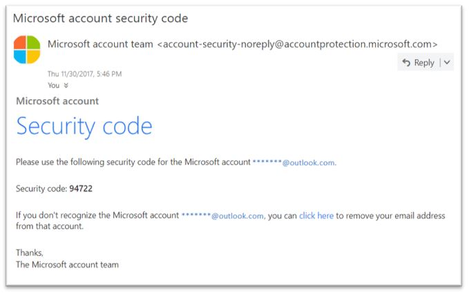

# <a name="anti-spoofing-protection-in-office-365"></a>Antispoofingschutz in Office 365

In diesem Artikel wird beschrieben, wie Office 365 gegen Phishing-Angriffe abschwächt, die gefälschte Absenderdomänen verwenden, also Domänen, die gefälscht sind. Dies wird durch Analysieren der Nachrichten und Blockieren der mit Standard-e-Mail-Authentifizierungsmethoden oder anderen Absender Zuverlässigkeits Techniken authentifizierten. Diese Änderung wurde implementiert, um die Anzahl von Phishing-Angriffen zu reduzieren, denen Organisationen in Office 365 zur Verfügung gestellt werden.
  
In diesem Artikel wird auch beschrieben, warum diese Änderung vorgenommen wird, wie sich Kunden auf diese Änderung vorbereiten können, wie Nachrichten angezeigt werden, die betroffen sind, wie Berichte zu Nachrichten erstellt werden, wie falsch positive Ergebnisse vermieden werden und wie Absender von Microsoft sich darauf vorbereiten sollten. Ändern.
  
Die Anti-Spoofing-Technologie von Microsoft wurde zunächst für Organisationen bereitgestellt, die ein Office 365 Enterprise E5-Abonnement hatten oder das Office 365 Advanced Threat Protection (ATP)-Add-on für Ihr Abonnement erworben hatten. 2018 haben wir den Schutz auch für Organisationen mit Exchange Online Protection (EOP) erweitert. Aufgrund der Art und Weise, in der alle unsere Filter voneinander lernen, können auch Outlook.com-Benutzer betroffen sein.
  
## <a name="how-spoofing-is-used-in-phishing-attacks"></a>Verwendung von Spoofing bei Phishing-Angriffen

Wenn es um den Schutz der Benutzer geht, nimmt Microsoft die Bedrohung durch Phishing ernst. Eine der Techniken, die von Spammern und Phishern häufig verwendet werden, ist Spoofing, wenn der Absender gefälscht ist und eine Nachricht scheinbar von einer Person oder einer anderen Stelle als der tatsächlichen Quelle stammt. Diese Technik wird häufig in Phishing-Kampagnen zum Abrufen von Benutzeranmeldeinformationen verwendet. Die Anti-Spoof-Technologie von Microsoft untersucht insbesondere die Fälschung des "from:-Headers", der in einem e-Mail-Client wie Outlook angezeigt wird. Wenn Microsoft die Gewissheit hat, dass der from:-Header gefälscht ist, wird die Nachricht als spoof identifiziert.
  
Spoofing-Nachrichten haben zwei negative Auswirkungen auf reale Benutzer:
  
### <a name="1-spoofed-messages-deceive-users"></a>1. gefälschte Nachrichten täuschen Benutzer
  
Erstens kann eine gefälschte Nachricht einen Benutzer dazu verleiten, auf einen Link zu klicken und Ihre Anmeldeinformationen aufzugeben, Schadsoftware herunterzuladen oder auf eine Nachricht mit vertraulichen Inhalten zu Antworten (letztere wird als geschäftliche e-Mail-Gefährdung bezeichnet). Im folgenden finden Sie beispielsweise eine Phishing-Nachricht mit einem gefälschten Absender von msoutlook94@service.outlook.com:
  

  
Die oben genannten waren eigentlich nicht aus service.outlook.com, sondern wurden vom Phisher gefälscht, um es so aussehen zu lassen. Er versucht, einen Benutzer zum Klicken auf den Link in der Nachricht zu betrügen.
  
Das folgende Beispiel ist Spoofing contoso.com:
  

  
Die Nachricht sieht zwar legitim aus, ist aber tatsächlich eine Parodie. Bei dieser Phishing-Nachricht handelt es sich um eine Art geschäftlicher e-Mail-Kompromiss, bei dem es sich um eine Unterkategorie von Phishing handelt.

### <a name="2-users-confuse-real-messages-for-fake-ones"></a>2. Benutzer verwirren reale Nachrichten für gefälschte Einsen
  
Zweitens verursachen gefälschte Nachrichten Unsicherheit für Benutzer, die sich über Phishing-Nachrichten informieren, aber nicht den Unterschied zwischen einer echten Nachricht und einem gefälschten Nachrichtentext erkennen können. Nachfolgend sehen Sie ein Beispiel für eine tatsächliche Kennwortzurücksetzung von der e-Mail-Adresse des Microsoft-Sicherheitskontos:
  

  
Die obige Nachricht stammt von Microsoft, aber gleichzeitig werden Benutzer dazu verwendet, Phishing-Nachrichten zu erhalten, die einen Benutzer dazu verleiten, auf einen Link zu klicken und Ihre Anmeldeinformationen, das Herunterladen von Schadsoftware oder das Beantworten einer Nachricht mit vertraulichen Inhalten zu überlisten. Da es schwierig ist, den Unterschied zwischen einer echten Kennwortzurücksetzung und einem gefälschten zu erkennen, ignorieren viele Benutzer diese Nachrichten, melden Sie als Spam oder melden die Nachrichten unnötigerweise zurück an Microsoft als verpasste Phishing-Scams.

Um Spoofing zu beenden, hat die e-Mail-Filter Branche e-Mail-Authentifizierungsprotokolle wie [SPF](https://docs.microsoft.com/office365/SecurityCompliance/set-up-spf-in-office-365-to-help-prevent-spoofing), [DKIM](https://docs.microsoft.com/office365/SecurityCompliance/use-dkim-to-validate-outbound-email)und [DMARC](https://docs.microsoft.com/office365/SecurityCompliance/use-dmarc-to-validate-email)entwickelt. DMARC verhindert, dass Spoofing den Absender einer Nachricht prüft – die, die der Benutzer in seinem e-Mail-Client sieht (in den obigen Beispielen, dies ist service.outlook.com, outlook.com und accountprotection.microsoft.com) – mit der Domäne, die SPF oder DKIM übergeben hat. Das heißt, die Domäne, die der Benutzer sieht, wurde authentifiziert und ist daher nicht gefälscht. Eine ausführlichere Erläuterung finden Sie im Abschnitt "*Grundlegendes dazu, warum die e-Mail-Authentifizierung nicht immer ausreicht, um Spoofing zu beenden"* weiter unten in diesem Artikel.
  
Das Problem besteht jedoch darin, dass e-Mail-Authentifizierungs Einträge optional sind, nicht erforderlich. Während Domänen mit starken Authentifizierungsrichtlinien wie microsoft.com und skype.com vor Spoofing geschützt sind, sind daher Domänen, die schwächere Authentifizierungsrichtlinien oder überhaupt keine Richtlinie veröffentlichen, Ziele für Spoofing. Ab März 2018 veröffentlichen nur 9% der Unternehmensbereiche im Fortune 500 starke e-Mail-Authentifizierungsrichtlinien. Die restlichen 91% können von einem Phisher gefälscht werden, und es sei denn, der e-Mail-Filter erkennt es mithilfe einer anderen Richtlinie, kann an einen Endbenutzer geliefert werden und diese täuschen:
  

  
Der Anteil kleiner und mittlerer Unternehmen, die nicht im Fortune 500, die starke e-Mail-Authentifizierungsrichtlinien veröffentlichen, ist kleiner und für Domänen außerhalb von Nordamerika und Westeuropa kleiner.
  
Dies ist ein großes Problem, da sich Unternehmen möglicherweise nicht über die Funktionsweise der e-Mail-Authentifizierung im klaren sind und die fehlende IT-Adresse verstehen.
  
Informationen zum Einrichten von SPF, DKIM und DMARC finden Sie im Abschnitt "Customers*of Office 365"* in diesem Dokument. 
  
## <a name="stopping-spoofing-with-implicit-email-authentication"></a>Beenden von Spoofing mit impliziter e-Mail-Authentifizierung

Da Phishing und Spear-Phishing ein solches Problem darstellen, wird Microsoft weiterhin in die Möglichkeiten zum Schutz seiner Kunden investieren, und aufgrund der begrenzten Akzeptanz von starken e-Mail-Authentifizierungsrichtlinien wird in die Funktionen investiert. Microsoft wird daher mit der impliziten *e-Mail-Authentifizierung* fortfahren – wenn sich eine Domäne nicht authentifiziert, wird Sie von Microsoft so behandelt, als ob Sie e-Mail-Authentifizierungsdaten Sätze veröffentlicht und diese entsprechend behandeln sollte, wenn Sie nicht erfolgreich ist. 
  
Zu diesem Zweck hat Microsoft zahlreiche Erweiterungen für die reguläre e-Mail-Authentifizierung einschließlich Absenderzuverlässigkeit, Absender/Empfänger Verlauf, Verhaltensanalyse und andere erweiterte Techniken erstellt. Eine Nachricht, die von einer Domäne gesendet wird, die keine e-Mail-Authentifizierung veröffentlicht, wird als spoof gekennzeichnet, es sei denn, Sie enthält andere Signale, um anzuzeigen, dass Sie legitim ist.
  
Auf diese Weise können Endbenutzer Vertrauen, dass eine an Sie gesendete e-Mail nicht gefälscht wurde, Absender können sicher sein, dass niemand Ihre Domäne imitiert, und Kunden von Office 365 können einen noch besseren Schutz wie Identitätswechsel Schutz bieten.
  
Informationen zur allgemeinen Ankündigung von Microsoft finden Sie unter [Sea of Phishing Teil 2 – enhancEd Anti-Spoofing in Office 365](https://techcommunity.microsoft.com/t5/Security-Privacy-and-Compliance/Schooling-A-Sea-of-Phish-Part-2-Enhanced-Anti-spoofing/ba-p/176209).
  
## <a name="identifying-that-a-message-is-classified-as-spoofed"></a>Identifizieren, dass eine Nachricht als gefälscht klassifiziert wird

### <a name="composite-authentication"></a>Verbundauthentifizierung

Während SPF-, DKIM-und DMARC-Werte für sich selbst nützlich sind, kommunizieren Sie nicht genügend Authentifizierungsstatus, wenn eine Nachricht keine expliziten Authentifizierungsdaten Sätze enthält. Microsoft hat daher einen Algorithmus entwickelt, der mehrere Signale in einem einzigen Wert mit dem Namen Composite Authentication oder compauth für kurze kombiniert. Kunden in Office 365 haben compauth-Werte, die in den Header *Authentication-results* in den Nachrichtenkopfzeilen gestempelt wurden. 
  
```
Authentication-Results:
  compauth=<fail|pass|softpass|none> reason=<yyy>

```

|**CompAuth-Ergebnis**|**Beschreibung**|
|:-----|:-----|
|fehl|Nachricht failed Explicit Authentication (Senden von Domänen veröffentlichten Datensätzen explizit in DNS) oder implizite Authentifizierung (sendende Domäne hat keine Datensätze in DNS veröffentlicht, sodass Office 365 das Ergebnis so interpoliert hat, als ob es veröffentlichte Datensätze hatte).|
|übergeben|Nachrichten, die explizite Authentifizierung (Nachricht übergeben DMARC oder [best guess DMARC](https://blogs.msdn.microsoft.com/tzink/2015/05/06/what-is-dmarc-bestguesspass-in-office-365)) oder implizite Authentifizierung mit hoher Vertrauenswürdigkeit (die sendende Domäne veröffentlicht keine e-Mail-Authentifizierungs Einträge, aber Office 365 hat starke Back-End-Signale an Geben Sie an, dass die Nachricht wahrscheinlich legitim ist).|
|softpass|Nachricht übergeben implizite Authentifizierung mit Low-to-Medium Confidence (sendende Domäne veröffentlicht keine e-Mail-Authentifizierung, aber Office 365 verfügt über Back-End-Signale, um anzugeben, dass die Nachricht legitim ist, aber die Stärke des Signals ist schwächer).|
|Keine|Die Nachricht konnte nicht authentifiziert werden (oder Sie hat authentifiziert, aber nicht ausgerichtet), aber die Verbundauthentifizierung wurde aufgrund der Absenderzuverlässigkeit oder anderer Faktoren nicht angewendet.|
   
|||
|:-----|:-----|
|**Grund**|**Beschreibung**|
|0xx|Zusammengesetzte Authentifizierung für Nachrichten Fehler.<br/>**000** bezeichnet die fehlerhafte Nachricht DMARC mit einer Aktion von Reject oder Quarantine.  <br/>**001** die fehlerhafte e-Mail-Authentifizierung der Nachricht. Dies hat zur Folge, dass in der sendenden Domäne keine e-Mail-Authentifizierungsdaten Sätze veröffentlicht wurden oder wenn Sie eine schwächere Fehler Richtlinie hatten (SPF Soft Fail oder neutral, DMARC-Richtlinie von p = None).  <br/>**002** bedeutet, dass die Organisation über eine Richtlinie für das Absender/Domänen-paar verfügt, das explizit das Senden von gefälschten e-Mails untersagt, wird diese Einstellung manuell von einem Administrator festgelegt.  <br/>**010** bedeutet, dass die Nachricht fehlgeschlagen DMARC mit einer Aktion der Ablehnung oder Quarantäne, und die sendende Domäne ist eine der akzeptierten Domänen Ihrer Organisation (Dies ist Teil der Self-to-Self oder Intra-org, Spoofing).  <br/>**011** bedeutet die Nachricht fehlgeschlagene implizite e-Mail-Authentifizierung, und die sendende Domäne ist eine der akzeptierten Domänen Ihrer Organisation (Dies ist Teil von Self-to-Self oder Intra-org, Spoofing).|
|Alle anderen Codes (1xx, 2xx, 3xx, 4xx, 5xx)|Entspricht verschiedenen internen Codes dafür, warum eine Nachricht die implizite Authentifizierung übergeben hat oder keine Authentifizierung hatte, aber keine Aktion angewendet wurde.|
   
Wenn Sie sich die Kopfzeilen einer Nachricht ansehen, können Administratoren oder sogar Endbenutzer festlegen, wie Office 365 zu dem Schluss gelangt, dass der Absender gefälscht werden kann.
  
### <a name="differentiating-between-different-types-of-spoofing"></a>Unterscheidung zwischen verschiedenen Arten von Spoofing

Microsoft unterscheidet zwischen zwei Arten von Spoofing-Nachrichten:
  
 **Intra-org-Spoofing**
  
Auch als Self-to-Self-Spoofing bezeichnet, tritt dies auf, wenn die Domäne in der von:-Adresse mit der Empfängerdomäne übereinstimmt oder an dieser ausgerichtet ist (wenn die Empfängerdomäne eine der [akzeptiertEn Domänen](https://technet.microsoft.com/en-us/library/jj945194%28v=exchg.150%29.aspx)Ihrer Organisation ist); oder, wenn die Domäne in der von:-Adresse Teil derselben Organisation ist.
  
Beispielsweise hat der Absender und Empfänger aus derselben Domäne (contoso.com). Leerzeichen werden in die e-Mail-Adresse eingefügt, um die Sammlung auf dieser Seite zu verhindern:
  
Von: Absender @ contoso.com
  
An: Recipient @ contoso.com
  
Nachfolgend sind die Absender-und Empfängerdomänen an der Organisationsdomäne ausgerichtet (fabrikam.com):
  
Von: Absender @ foo.fabrikam.com
  
An: Recipient @ bar.fabrikam.com
  
Die folgenden Absender-und Empfängerdomänen sind unterschiedlich (microsoft.com und bing.com), Sie gehören jedoch zur gleichen Organisation (beide sind Teil der akzeptierten Domänen der Organisation):
  
Von: Absender @ microsoft.com
  
An: Recipient @ bing.com
  
Nachrichten, bei denen ein Fehler bei der Intra-org-Spoofing auftritt, enthalten die folgenden Werte in den Kopfzeilen:
  
X-Forefront-Antispam-Report:... CAT: SPM/HSPM/PHSH;... SFTY: 10.9
  
Die Katze ist die Kategorie der Nachricht, und Sie wird normalerweise als SPM (Spam) gestempelt, aber gelegentlich kann es sich um HSPM (Spam mit hoher Vertrauenswürdigkeit) oder Phishing (Phishing) handeln, je nachdem, welche anderen Mustertypen in der Nachricht auftreten.
  
Die SFTY ist die Sicherheitsstufe der Nachricht, die erste Ziffer (9) bedeutet, dass die Nachricht Phishing ist, und der zweite Ziffernsatz, nachdem der Punkt (11) bedeutet, dass es sich um Intra-org-Spoofing handelt.
  
Es gibt keinen bestimmten Grund Code für die Verbundauthentifizierung für die Intra-org-Spoofing, der später in 2018 gestempelt wird (Zeitachse noch nicht definiert).
  
 **Domänenübergreifendes Spoofing**
  
Dies tritt auf, wenn die sendende Domäne in der von:-Adresse eine externe Domäne für die empfangende Organisation ist. Nachrichten, bei denen die Verbundauthentifizierung aufgrund der domänenübergreifenden Spoofing fehlschlägt, enthalten die folgenden Werte in den Kopfzeilen:
  
Authentication-results:... compauth = Fehlerursache = 000/001
  
X-Forefront-Antispam-Report:... CAT: SPOOF;... SFTY: 9.22
  
In beiden Fällen wird der folgende rote Sicherheitstipp in der Nachricht oder eine Entsprechung, die an die Sprache des Empfängerpostfachs angepasst ist, gestempelt:
  

  
Nur wenn Sie sich die from:-Adresse ansehen und wissen, was Ihre Empfänger-e-Mail ist, oder indem Sie die e-Mail-Header überprüfen, können Sie zwischen Intra-org-und domänenübergreifender Spoofing unterscheiden.
  
## <a name="how-customers-of-office-365-can-prepare-themselves-for-the-new-anti-spoofing-protection"></a>Wie sich Kunden von Office 365 auf den neuen Schutz vor Spoofing vorbereiten können

### <a name="information-for-administrators"></a>Informationen für Administratoren

Als Administrator einer Organisation in Office 365 gibt es verschiedene wichtige Informationen, die Sie beachten sollten.
  
### <a name="understanding-why-email-authentication-is-not-always-enough-to-stop-spoofing"></a>GrundLegendes dazu, warum die e-Mail-Authentifizierung nicht immer ausreicht, um Spoofing zu beenden

Der neue Schutz vor Spoofing basiert auf der e-Mail-Authentifizierung (SPF, DKIM und DMARC), um eine Nachricht nicht als Spoofing zu markieren. Ein allgemeines Beispiel ist, wenn eine sendende Domäne nie SPF-Einträge veröffentlicht hat. Wenn keine SPF-Datensätze vorhanden sind oder Sie falsch eingerichtet sind, wird eine gesendete Nachricht als gefälscht gekennzeichnet, es sei denn, Microsoft verfügt über eine Back-End-Intelligenz, die besagt, dass die Nachricht legitim ist.
  
Vor der Bereitstellung von Antispoofing kann beispielsweise eine Nachricht wie folgt aussehen, ohne SPF-Eintrag, keinen DKIM-Eintrag und keinen DMARC-Eintrag: 
  
```
Authentication-Results: spf=none (sender IP is 1.2.3.4)
  smtp.mailfrom=example.com; contoso.com; dkim=none
  (message not signed) header.d=none; contoso.com; dmarc=none
  action=none header.from=example.com;
From: sender @ example.com
To: receiver @ contoso.com
```
Wenn Sie nach dem Anti-Spoofing Office 365 Enterprise E5, EOP oder ATP haben, wird der compauth-Wert gestempelt:
  
```
Authentication-Results: spf=none (sender IP is 1.2.3.4)
  smtp.mailfrom=example.com; contoso.com; dkim=none
  (message not signed) header.d=none; contoso.com; dmarc=none
  action=none header.from=example.com; compauth=fail reason=001
From: sender @ example.com
To: receiver @ contoso.com

```

Wenn example.com dies durch Einrichten eines SPF-Eintrags, aber nicht eines DKIM-Eintrags behoben hat, würde dies die Verbundauthentifizierung überschreiten, da die Domäne, die SPF an die Domäne in der from-Adresse ausgerichtet hat: 
  
```
Authentication-Results: spf=pass (sender IP is 1.2.3.4)
  smtp.mailfrom=example.com; contoso.com; dkim=none
  (message not signed) header.d=none; contoso.com; dmarc=bestguesspass
  action=none header.from=example.com; compauth=pass reason=109
From: sender @ example.com
To: receiver @ contoso.com
```

Oder wenn Sie einen DKIM-Eintrag einrichten, aber keinen SPF-Eintrag, würde dies auch die Verbundauthentifizierung überschreiten, da die Domäne in der DKIM-Signatur, die an die Domäne in der from-Adresse angeglichen wurde: 
  
```
Authentication-Results: spf=none (sender IP is 1.2.3.4)
  smtp.mailfrom=example.com; contoso.com; dkim=pass
  (signature was verified) header.d=outbound.example.com;
  contoso.com; dmarc=bestguesspass action=none
  header.from=example.com; compauth=pass reason=109
From: sender @ example.com
To: receiver @ contoso.com
```

Ein Phisher kann jedoch auch SPF und DKIM einrichten und die Nachricht mit ihrer eigenen Domäne signieren, aber in der von:-Adresse eine andere Domäne angeben. Weder SPF noch DKIM erfordern, dass die Domäne mit der Domäne in der from:-Adresse ausgerichtet ist, daher würde diese nicht als spoof mit DMARC gekennzeichnet werden, es sei denn, example.com veröffentlicht DMARC Records. 
  
```
Authentication-Results: spf=pass (sender IP is 5.6.7.8)
  smtp.mailfrom=maliciousDomain.com; contoso.com; dkim=pass
  (signature was verified) header.d=maliciousDomain.com;
  contoso.com; dmarc=none action=none header.from=example.com;
From: sender @ example.com
To: receiver @ contoso.com
```

Im e-Mail-Client (Outlook, Outlook im Web oder einem anderen e-Mail-Client) wird nur die von:-Domäne angezeigt, nicht die Domäne im SPF oder DKIM, und die den Benutzer zu dem Gedanken führen kann, dass die Nachricht von example.com stammt, aber tatsächlich von maliciousDomain.com stammt. .
  

  
Aus diesem Grund erfordert Office 365, dass die Domäne in der from:-Adresse mit der Domäne in der SPF-oder DKIM-Signatur übereinstimmt, und wenn dies nicht der Fall ist, enthält einige interne Signale, die darauf hinweisen, dass die Nachricht legitim ist. Andernfalls wäre die Nachricht ein compauth-Fehler. 
  
```
Authentication-Results: spf=none (sender IP is 5.6.7.8)
  smtp.mailfrom=maliciousDomain.com; contoso.com; dkim=pass
  (signature was verified) header.d=maliciousDomain.com;
  contoso.com; dmarc=none action=none header.from=contoso.com;
  compauth=fail reason=001
From: sender@contoso.com
To: someone@example.com
```

Daher schützt Office 365 Anti-Spoofing gegen Domänen ohne Authentifizierung und für Domänen, die die Authentifizierung einrichten, jedoch nicht mit der Domäne in der from:-Adresse übereinstimmen, da dies der Benutzer sieht und glaubt, der Absender der Nachricht ist. Dies gilt sowohl für Domänen außerhalb Ihrer Organisation als auch für Domänen innerhalb Ihrer Organisation.
  
Wenn Sie also jemals eine Meldung erhalten, dass die Verbundauthentifizierung fehlgeschlagen ist und als gefälscht gekennzeichnet ist, obwohl die Nachricht SPF und DKIM übergeben hat, liegt dies daran, dass die Domäne, die SPF und DKIM übergeben hat, nicht mit der Domäne in der from:-Adresse abgeglichen wird.
  
### <a name="understanding-changes-in-how-spoofed-emails-are-treated"></a>Grundlegendes zu Änderungen bei der Behandlung von gefälschten e-Mails

Derzeit werden für alle Organisationen in Office 365-ATP und nicht-ATP-Nachrichten, die DMARC mit einer Ablehnungs-oder Quarantänerichtlinie ausfallen, als Spam gekennzeichnet und in der Regel die Spamaktion mit hoher Vertrauenswürdigkeit oder manchmal die regelmäßige Spamaktion (abhängig davon, ob andere Spam Regeln identifizieren Sie zunächst als Spam). Intra-org-Spoof-Entdeckungen führen die regelmäßige Spam-Aktion aus. Dieses Verhalten muss weder aktiviert noch deaktiviert werden.
  
Bei domänenübergreifenden Spoofing-Nachrichten vor dieser Änderung würden Sie jedoch regelmäßig Spam-, Phishing-und Schadsoftware-Prüfungen durchführen, und wenn andere Teile des Filters Sie als verdächtig identifiziert haben, würden Sie Sie als Spam, Phishing oder Schadsoftware kennzeichnen. Mit dem neuen domänenübergreifenden Spoofing-Schutz werden alle Nachrichten, die nicht authentifiziert werden können, standardmäßig mit der in der Anti-Phishing \> -Antispoofing-Richtlinie definierten Aktion ausgeführt. Wenn eine nicht definiert ist, wird Sie in einen Junk-e-Mail-Ordner der Benutzer verschoben. In einigen Fällen wird auch bei verdächtigen Nachrichten der Nachricht der rote Sicherheitstipp hinzugefügt.
  
Dies kann dazu führen, dass einige Nachrichten, die zuvor als Spam markiert wurden, noch als Spam markiert wurden, aber jetzt auch einen roten Sicherheitstipp haben. in anderen Fällen werden Nachrichten, die zuvor als nicht-Spam markiert wurden, als Spam (CAT: SPOOF) mit einem roten Sicherheitstipp hinzugefügt. In anderen Fällen würden Kunden, die alle Spam-und Phishing-Nachrichten in die Quarantäne verschoben haben, nun den Junk-Mail-Ordner aufrufen (dieses Verhalten kann geändert werden, siehe [Ändern der Einstellungen](#changing-your-anti-spoofing-settings)für das Spoofing).
  
Es gibt mehrere verschiedene Möglichkeiten, wie eine Nachricht gefälscht werden kann (siehe unter [Scheidung zwischen verschiedenen Spoofing-Typen](#differentiating-between-different-types-of-spoofing) weiter oben in diesem Artikel), aber ab März 2018 ist die Art und Weise, in der Office 365 diese Nachrichten behandelt, noch nicht einheitlich. Die folgende Tabelle ist eine kurze Zusammenfassung mit domänenüberGreifenden Spoofing-Schutz als neues Verhalten: 
  
|**Spoof-Typ**|**Category**|**Sicherheitstipp hinzugefügt?**|**Gilt für**|
|:-----|:-----|:-----|:-----|
|DMARC-Fehler (Quarantäne oder Ablehnung)  <br/> |HSPM (Standard), kann auch SPM oder PHSH  <br/> |Nein (noch nicht)  <br/> |Alle Office 365-Kunden, Outlook.com  <br/> |
|Self-to-Self  <br/> |SPM  <br/> |Ja  <br/> |Alle Office 365-Organisationen, Outlook.com  <br/> |
|Domänenübergreifendes  <br/> |SPOOFING  <br/> |Ja  <br/> |Office 365 Advanced Threat Protection und E5-Kunden  <br/> |

### <a name="changing-your-anti-spoofing-settings"></a>Ändern der Einstellungen für das Spoofing

Zum Erstellen oder Aktualisieren Ihrer Einstellungen für die (domänenübergreifende) Antispoofing navigieren Sie im Security \> \> &amp; Compliance Center unter der Registerkarte "Threat Management Policy" zu den Anti-Phishing-Antispoofing-Einstellungen. Wenn Sie noch keine Anti-Phishing-Einstellungen erstellt haben, müssen Sie eine erstellen:
  

  
Wenn Sie bereits einen erstellt haben, können Sie ihn auswählen, um ihn zu ändern:
  

  
Wählen Sie die soeben erstellte Richtlinie aus, und gehen Sie wie in [erfahren Sie mehr über Spoof Intelligence](learn-about-spoof-intelligence.md)beschrieben vor.
  

  

  
So erstellen Sie eine neue Richtlinie mithilfe von PowerShell: 
  
```powershell
$org = Get-OrganizationConfig
$name = "My first anti-phishing policy for " + $org.Name
# Note: The name should not exclude 64 characters, including spaces.
# If it does, you will need to pick a smaller name.
# Next, create a new anti-phishing policy with the default values
New-AntiphishPolicy -Name $Name
# Select the domains to scope it to
# Multiple domains are specified in a comma-separated list
$domains = "domain1.com, domain2.com, domain3.com"
# Next, create the anti-phishing rule, scope it to the anti-phishing rule
New-AntiphishRule -Name $name -AntiphishPolicy $name -RecipientDomainIs $domains
```

Anschließend können Sie die Parameter für die Anti-Phishing-Richtlinie mithilfe von PowerShell ändern, nachdem Sie die Dokumentation unter [Set-AntiphishPolicy](https://docs.microsoft.com/powershell/module/exchange/advanced-threat-protection/Set-AntiPhishPolicy?view=exchange-ps). Sie können die $name als Parameter angeben:
  
```powershell
Set-AntiphishPolicy -Identity $name <fill in rest of parameters>
```

Wenn Sie später in 2018 eine Standardrichtlinie erstellen, wird eine für Sie erstellt, die auf alle Empfänger in Ihrer Organisation ausgelegt ist, sodass Sie Sie nicht manuell angeben müssen (die Screenshots unten können vor der endgültigen Implementierung geändert werden).
  

  
Im Gegensatz zu einer Richtlinie, die Sie erstellen, können Sie die Standardrichtlinie nicht löschen, ihre Priorität ändern oder auswählen, auf welche Benutzer, Domänen oder Gruppen Sie Sie festlegen möchten.
  

  
So richten Sie den Standardschutz mithilfe von PowerShell ein:
  
```powershell
$defaultAntiphishPolicy = Get-AntiphishPolicy | ? {$_.IsDefault -eq $true}
Set-AntiphishPolicy -Identity $defaultAntiphishPolicy.Name -EnableAntispoofEnforcement <$true|$false>
```

Sie sollten den Schutz vor Spoofing nur deaktivieren, wenn Sie über einen anderen e-Mail-Server oder Server vor Office 365 (siehe legitime Szenarien zum Deaktivieren von Antispoofing für weitere Details) verfügen.
  
```powershell
$defaultAntiphishPolicy = Get-AntiphishiPolicy | ? {$_.IsDefault $true}
Set-AntiphishPolicy -Identity $defaultAntiphishPolicy.Name -EnableAntispoofEnforcement $false 

```
> [!IMPORTANT]
> Wenn der erste Hop in Ihrem e-Mail-Pfad Office 365 ist und Sie zu viele legitime e-Mails erhalten, die als spoof gekennzeichnet sind, sollten Sie zunächst die Absender einrichten, die Spoof-e-Mails an Ihre Domäne senden dürfen (siehe Abschnitt *"Verwalten von legitimen Absendern, die u senden. nauthenticated-e-Mail "* ). Wenn Sie immer noch zu viele falsch positive Ergebnisse erhalten (also legitime Nachrichten als spoof gekennzeichnet), wird die Deaktivierung des Schutzes gegen Spoofing nicht empfohlen. Stattdessen empfehlen wir die Auswahl von Basic statt hoher Schutz. Es ist besser, falsch positive Ergebnisse zu verwenden, als Ihre Organisation gefälschten e-Mails zur Verfügung zu stellen, die langfristig deutlich höhere Kosten verursachen könnten.

### <a name="managing-legitimate-senders-who-are-sending-unauthenticated-email"></a>Verwalten von legitimen Absendern, die nicht authentifizierte e-Mails senden

Office 365 verfolgt, wer nicht authentifizierte e-Mails an Ihre Organisation sendet. Wenn der Dienst der Meinung ist, dass der Absender nicht legitim ist, markiert er ihn als *compauth* -Fehler. Dies wird als SPOOF klassifiziert, obwohl es von ihrer Anti-Spoofing-Richtlinie abhängt, die auf die Nachricht angewendet wurde.
  
Als Administrator können Sie jedoch angeben, welche Absender Spoof-e-Mails senden dürfen, indem Sie die Entscheidung von Office 365 überschreiben.
  
**Methode 1: Wenn Ihre Organisation die Domäne besitzt, richten Sie die e-Mail-Authentifizierung ein.**
  
Diese Methode kann verwendet werden, um die Intra-org-Spoofing zu beheben, und domänenübergreifendes Spoofing, wenn Sie mehrere Mandanten besitzen oder mit ihnen interagieren. Es hilft auch bei der Lösung der domänenübergreifenden Spoofing-Funktion, wenn Sie an andere Kunden in Office 365 und auch an Dritte weiterleiten, die in anderen Anbietern gehostet werden.
  
Weitere Informationen finden Sie unter [Customers of Office 365](#customers-of-office-365).

**Methode 2-Spoof Intelligence verwenden, um zugelassene Absender von nicht authentifizierten e-Mails zu konfigurieren**
  
Sie können auch [Spoof Intelligence](https://support.office.com/article/Learn-more-about-spoof-intelligence-978c3173-3578-4286-aaf4-8a10951978bf) verwenden, um Absender zu gestatten, nicht authentifizierte Nachrichten an Ihre Organisation zu übertragen. 
  
Bei externen Domänen ist der gefälschte Benutzer die Domäne in der von-Adresse, während die sendende Infrastruktur entweder die sendende IP-Adresse (aufgeteilt in/24 CIDR-Bereiche) oder die Organisationsdomäne des PTR-Eintrags ist (im folgenden Screenshot kann die sendende IP 131.107.18.4 sein, dessen PTR-Eintrag outbound.mail.protection.outlook.com ist und der als outlook.com für die sendende Infrastruktur angezeigt würde).
  
Um diesem Absender zu gestatten, nicht authentifizierte e-Mails zu senden, ändern Sie den **Nein** in einen **Ja**.
  

  
Sie können PowerShell auch verwenden, um dem Absender zu gestatten, Ihre Domäne zu spoofen:
  
```powershell
$file = "C:\My Documents\Summary Spoofed Internal Domains and Senders.csv"
```

```powershell
Get-PhishFilterPolicy -Detailed -SpoofAllowBlockList -SpoofType External | Export-CSV $file
```


  
Im vorherigen Bild wurden zusätzliche Zeilenumbrüche hinzugefügt, um diesen Screenshot fit zu machen. NormalerWeise werden alle Werte in einer einzelnen Reihe angezeigt.
  
Bearbeiten Sie die Datei, und suchen Sie nach der Zeile, die outlook.com und bing.com entspricht, und ändern Sie den AllowedToSpoof-Eintrag von Nein in ja:
  

  
Speichern Sie die Datei, und führen Sie dann Folgendes aus:
  
```powershell
$UpdateSpoofedSenders = Get-Content -Raw "C:\My Documents\Spoofed Senders.csv"
Set-PhishFilterPolicy -Identity Default -SpoofAllowBlockList $UpdateSpoofedSenders
```

Dadurch kann bing.com nicht authentifizierte e-Mails von \*. Outlook.com senden.

**Methode 3-Erstellen eines Zulassungs Eintrags für das Absender-/Empfängerpaar**
  
Sie können auch die gesamte Spamfilterung für einen bestimmten Absender umgehen. Weitere Informationen finden Sie unter [sicheres Hinzufügen eines Absenders zu einer Zulassungsliste in Office 365](https://blogs.msdn.microsoft.com/tzink/2017/11/29/how-to-securely-add-a-sender-to-an-allow-list-in-office-365/).
  
Wenn Sie diese Methode verwenden, überspringen Sie Spam und einige der Phishing-Filterung, jedoch keine Filterung von Schadsoftware.
  
**Methode 4-wenden Sie sich an den Absender, und bitten Sie ihn, die e-Mail-Authentifizierung einzurichten**
  
Aufgrund des Problems von Spam und Phishing empfiehlt Microsoft allen Absendern, die e-Mail-Authentifizierung einzurichten. Wenn Sie einen Administrator der sendenden Domäne kennen, kontaktieren Sie diese, und fordern Sie an, e-Mail-Authentifizierungsdaten Sätze einzurichten, damit Sie keine Überschreibungen hinzufügen müssen. Weitere Informationen finden Sie weiter unten in diesem Artikel unter [Administratoren von Domänen, die keine Office 365-Kunden sind](#administrators-of-domains-that-are-not-office-365-customers). 
  
Während es zunächst schwierig sein kann, sendende Domänen zu authentifizieren, während mehr und mehr e-Mail-Filter junkings starten oder sogar Ihre e-Mails ablehnen, führt dies dazu, dass Sie die richtigen Einträge einrichten, um eine bessere Zustellung zu gewährleisten.
  
### <a name="viewing-reports-of-how-many-messages-were-marked-as-spoofed"></a>Anzeigen von Berichten darüber, wie viele Nachrichten als gefälscht markiert wurden

Nachdem Sie die Anti-Spoofing-Richtlinie aktiviert haben, können Sie mithilfe von Threat Intelligence Zahlen erhalten, wie viele Nachrichten als Phishing markiert sind. Gehen Sie dazu in den Security &amp; Compliance Center (SCC) unter Threat Management \> Explorer, legen Sie die Ansicht auf Phishing und Gruppieren nach Absenderdomäne oder Schutz Status:
  

  
Sie können mit den verschiedenen Berichten interagieren, um zu sehen, wie viele als Phishing markiert wurden, einschließlich Nachrichten, die als SPOOFing gekennzeichnet sind. Weitere Informationen finden Sie unter [Erste Schritte mit Office 365 Threat Intelligence](get-started-with-ti.md).
  
Sie können noch nicht aufteilen, welche Nachrichten aufgrund von Spoofing und anderen Arten von Phishing (allgemeine Phishing, Domänen-oder Benutzeridentitätswechsel usw.) gekennzeichnet wurden. Später können Sie dies jedoch über das Security &amp; Compliance Center tun. Anschließend können Sie diesen Bericht als Ausgangspunkt für die Identifizierung von sendenden Domänen verwenden, die möglicherweise legitim sind und aufgrund der fehlerhaften Authentifizierung als spoof gekennzeichnet werden.
  
Der folgende Screenshot ist ein Vorschlag für die Art und Weise, wie diese Daten aussehen, können sich jedoch bei der Veröffentlichung ändern:
  

  
Für nicht-ATP-und E5-Kunden stehen diese Berichte später unter dem Bericht "Threat Protection Status (TPS)" zur Verfügung, werden jedoch um mindestens 24 Stunden verzögert. Diese Seite wird aktualisiert, sobald Sie in das Security &amp; Compliance Center integriert sind.
  
### <a name="predicting-how-many-messages-will-be-marked-as-spoof"></a>Vorhersagen der Anzahl von Nachrichten, die als spoof gekennzeichnet werden

Sobald Office 365 seine Einstellungen aktualisiert, damit Sie die Erzwingung von Antispoofing deaktivieren oder mit einfacher oder hoher Erzwingung fortfahren können, können Sie sehen, wie sich die Nachrichten Disposition an den verschiedenen Einstellungen ändert. Das heißt, wenn Anti-Spoofing deaktiviert ist, können Sie sehen, wie viele Nachrichten als spoof erkannt werden, wenn Sie zu Basic werden; oder, wenn es einfach ist, können Sie sehen, wie viele weitere Nachrichten als spoof erkannt werden, wenn Sie es zu Hochdrehen.
  
Diese Funktion ist derzeit in der Entwicklung. Da weitere Details definiert sind, wird diese Seite mit Screenshots des Security and Compliance Center und mit PowerShell-Beispielen aktualisiert.
  

  

  
### <a name="understanding-how-spam-phishing-and-advanced-phishing-detections-are-combined"></a>Grundlegendes zur Kombination von Spam, Phishing und erweiterten Phishing-Entdeckungen

Organisationen, die Exchange Online mit oder ohne ATP verwenden, können angeben, welche Aktionen ausgeführt werden sollen, wenn der Dienst Nachrichten als Schadsoftware, Spam, Spam mit hoher Vertrauenswürdigkeit, Phishing und Massen Erkennung identifiziert. Mit den Richtlinien für ATP-Phishing für ATP-Kunden und den Richtlinien für den Schutz vor Phishing für EOP-Kunden und der Tatsache, dass eine Nachricht mehrere Erkennungstypen treffen kann (beispielsweise Schadsoftware, Phishing und Benutzeridentitätswechsel), kann es zu Verwirrung darüber kommen, welche Richtlinie gilt.
  
Im Allgemeinen wird die auf eine Nachricht angewendete Richtlinie im Header X-Forefront-Antispam-Report in der CAT (Category)-Eigenschaft identifiziert.
  
|**Priority**|**Richtlinie**|**Category**|**Wo verwaltet?**|**Gilt für**|
|:-----|:-----|:-----|:-----|:-----|
|1  <br/> |Schadsoftware  <br/> |MALW  <br/> |[Schadsoftware-Richtlinie](configure-anti-malware-policies.md) <br/> |Alle Organisationen  <br/> |
|2  <br/> |Phishing-E-Mail  <br/> |PHSH  <br/> |[Konfigurieren von Spamfilterrichtlinien](configure-your-spam-filter-policies.md) <br/> |Alle Organisationen  <br/> |
|3  <br/> |Spam mit hoher Vertrauenswürdigkeit  <br/> |HSPM  <br/> |[Konfigurieren von Spamfilterrichtlinien](configure-your-spam-filter-policies.md) <br/> |Alle Organisationen  <br/> |
|4  <br/> |Spoofing  <br/> |SPOOFING  <br/> |[Anti-Phishing-Richtlinie](https://go.microsoft.com/fwlink/?linkid=864553), [Spoof Intelligence](learn-about-spoof-intelligence.md) <br/> |Alle Organisationen  <br/> |
|5  <br/> |Spam  <br/> |SPM  <br/> |[Konfigurieren von Spamfilterrichtlinien](configure-your-spam-filter-policies.md) <br/> |Alle Organisationen  <br/> |
|6  <br/> |Massen  <br/> |Massen  <br/> |[Konfigurieren von Spamfilterrichtlinien](configure-your-spam-filter-policies.md) <br/> |Alle Organisationen  <br/> |
|7  <br/> |Domänen Identitätswechsel  <br/> |DIMP  <br/> |[Einrichten von Office 365 ATP-Antiphishing-und-Phishing-Richtlinien](set-up-anti-phishing-policies.md) <br/> |Organisationen mit nur ATP  <br/> |
|8  <br/> |Benutzeridentitätswechsel  <br/> |UIMP  <br/> |[Einrichten von Office 365 ATP-Antiphishing-und-Phishing-Richtlinien](set-up-anti-phishing-policies.md) <br/> |Organisationen mit nur ATP <br/> |

Wenn Sie über mehrere verschiedene Richtlinien zum Schutz vor Phishing verfügen, gilt diejenige mit der höchsten Priorität. Angenommen, Sie haben zwei Richtlinien:

|**Richtlinie**|**Priority**|**Identitätswechsel für Benutzer/Domänen**|**Antispoofing**|
|:-----|:-----|:-----|:-----|
|A  <br/> |1  <br/> |Ein  <br/> |Off  <br/> |
|B  <br/> |2  <br/> |Off  <br/> |Ein  <br/> |

Wenn eine Nachricht eingeht und sowohl als Spoofing als auch als Benutzeridentitätswechsel identifiziert wird und dieselbe Gruppe von Benutzern auf Richtlinie A und Richtlinie B ausgelegt ist, wird die Nachricht als spoof behandelt, aber es wird keine Aktion angewendet, da Antispoofing deaktiviert ist. , und SPOOF wird mit einer höheren Priorität (4) als der Benutzeridentitätswechsel (8) ausgeführt.
  
Damit andere Arten von Phishing-Richtlinien angewendet werden, müssen Sie die Einstellungen anpassen, auf die die verschiedenen Richtlinien angewendet werden.
  
### <a name="legitimate-scenarios-to-disable-anti-spoofing"></a>Legitime Szenarien zur Deaktivierung von Spoofing

Durch Antispoofing werden Kunden vor Phishing-Angriffen besser geschützt, und daher wird die Deaktivierung des Schutzes gegen Spoofing dringend abgeraten. Wenn Sie es deaktivieren, können Sie einige kurzfristige falsch positive Ergebnisse beheben, aber langfristig werden Sie einem höheren Risiko ausgesetzt. Die Kosten für das Einrichten der Authentifizierung auf der Absenderseite oder Anpassungen in den Phishing-Richtlinien sind in der Regel einmalige Ereignisse oder erfordern nur minimale, regelmäßige Wartung. Die Kosten für die Wiederherstellung eines Phishing-Angriffs, bei dem Daten verfügbar gemacht wurden, oder die Gefährdung von Objekten sind jedoch wesentlich höher.
  
Aus diesem Grund ist es besser, gefälschte Fehlermeldungen zu fälschen, als den Schutz vor Spoofing zu deaktivieren.
  
Es gibt jedoch ein legitimes Szenario, in dem Antispoofing deaktiviert werden sollte, und das heißt, wenn im Nachrichtenrouting zusätzliche e-Mail-Filterungs Produkte vorhanden sind und Office 365 nicht der erste Hop im e-Mail-Pfad ist:
  

  
Bei dem anderen Server kann es sich um einen lokalen Exchange-e-Mail-Server, ein e-Mail-Filtergerät wie IronPort oder einen anderen in der Cloud gehosteten Dienst handeln.
  
Wenn der MX-Eintrag der Empfängerdomäne nicht auf Office 365 zeigt, müssen Sie keine Antispoofing-Funktion deaktivieren, da Office 365 den MX-Eintrag Ihrer empfangenden Domäne nachschlägt und Antispoofing unterdrückt, wenn es auf einen anderen Dienst verweist. Wenn Sie nicht wissen, ob Ihre Domäne einen anderen Server vor hat, können Sie eine Website wie die MX-Toolbox zum Nachschlagen des MX-Eintrags verwenden. Es könnte etwa wie folgt aussehen:
  

  
Diese Domäne weist einen MX-Eintrag auf, der nicht auf Office 365 verweist, sodass Office 365 die Erzwingung von Antispoofing nicht anwenden würde.
  
Wenn der MX-Eintrag der Empfängerdomäne jedoch auf ** Office 365 zeigt, obwohl es einen anderen Dienst vor Office 365 gibt, sollten Sie Antispoofing deaktivieren. Das häufigste Beispiel ist die Verwendung einer Empfänger Umschreibung: 
  

  
Der MX-Eintrag der Domäne contoso. com verweist auf den lokalen Server, während der MX-Eintrag der Domäne @office365. contoso. net auf Office 365 verweist, da Sie \*protection.outlook.com oder \*eo.Outlook.com im MX-Eintrag enthält:
  

  
Stellen Sie sicher, dass Sie unterscheiden, wenn der MX-Eintrag einer Empfängerdomäne nicht auf Office 365 verweist und wenn Sie einer Empfänger Umschreibung unterzogen wurde. Es ist wichtig, den Unterschied zwischen diesen beiden Fällen zu erkennen.
  
Wenn Sie sich nicht sicher sind, ob Ihre empfangende Domäne einem Empfänger-umschreiben unterzogen wurde, können Sie dies anhand der Nachrichtenkopfzeilen erkennen.
  
a) betrachten Sie zunächst die Kopfzeilen in der Nachricht für die Empfängerdomäne im Authentication-results-Header:
  
```
Authentication-Results: spf=fail (sender IP is 1.2.3.4)
  smtp.mailfrom=example.com; office365.contoso.net; dkim=fail
  (body hash did not verify) header.d=simple.example.com;
  office365.contoso.net; dmarc=none action=none
  header.from=example.com; compauth=fail reason=001
```

Die Empfängerdomäne befindet sich im fett formatierten roten Text oben, in diesem Fall office365.contoso.net. Dies kann unterschiedlich sein, dass der Empfänger im to:-Header:
  
To: Beispiel Empfänger \<empfänger @ contoso.com\>
  
Führen Sie eine MX-Record-Suche der tatsächlichen Empfängerdomäne durch. Wenn die protection.outlook.com \*-, Mail.Messaging.Microsoft.com-, \*eo.Outlook.com-oder Mail.Global.FrontBridge.com-Methode enthält, weist das MX auf Office 365 hin.
  
Wenn diese Werte nicht enthalten sind, bedeutet dies, dass der MX nicht auf Office 365 verweist. Ein Tool, mit dem Sie dies überprüfen können, ist die MX-Toolbox.
  
In diesem Beispiel lautet der folgende Hinweis: contoso.com, die Domäne, die wie der Empfänger aussieht, da es sich um den Header "an:" handelt, weist MX-Eintrag auf einen Server mit "on-Prem" hin.
  

  
Der tatsächliche Empfänger ist jedoch office365.contoso.net, dessen MX-Eintrag auf Office 365 verweist:
  

  
Daher wurde diese Nachricht wahrscheinlich einer Empfänger Umschreibung unterzogen.
  
b) stellen Sie sicher, dass Sie zwischen allgemeinen Anwendungsfällen von Empfänger Umschreibungen unterscheiden. Wenn Sie die Empfängerdomäne in \*. onmicrosoft.com umschreiben möchten, schreiben Sie Sie stattdessen in \*. Mail.onmicrosoft.com.
  
Nachdem Sie die endgültige Empfängerdomäne identifiziert haben, die hinter einem anderen Server geroutet wird und der MX-Eintrag der Empfängerdomäne tatsächlich auf Office 365 zeigt (wie in den DNS-Einträgen veröffentlicht), können Sie mit der Deaktivierung von Antispoofing fortfahren.
  
Denken Sie daran, dass Sie Antispoofing nicht deaktivieren möchten, wenn der erste Hop der Domäne im Routingpfad Office 365 ist, nur, wenn es sich hinter einem oder mehreren Diensten befindet.
  
### <a name="how-to-disable-anti-spoofing"></a>Deaktivieren von Antispoofing

Wenn Sie bereits eine Anti-Phishing-Richtlinie erstellt haben, legen Sie den Parameter EnableAntispoofEnforcement auf $false fest:
  
```
$name = "<name of policy>"
Set-AntiphishPolicy -Identity $name -EnableAntiSpoofEnforcement $false

```

Wenn Sie den Namen der zu deaktivierenden Richtlinie (oder Richtlinien) nicht kennen, können Sie diese anzeigen:
  
```
Get-AntiphishPolicy | fl Name
```

Wenn Sie nicht über eine Richtlinie zum Schutz vor Phishing verfügen, können Sie eine erstellen und diese dann deaktivieren (auch wenn Sie keine Policy haben, wird die Antispoofing-Funktion weiterhin angewendet; später in 2018 wird eine Standardrichtlinie für Sie erstellt, und Sie können diese dann deaktivieren, anstatt eine Richtlinie zu erstellen). . Sie müssen dies in mehreren Schritten tun:
  
```
$org = Get-OrganizationConfig
$name = "My first anti-phishing policy for " + $org.Name
# Note: If the name is more than 64 characters, you will need to choose a smaller one
```

```
# Next, create a new anti-phishing policy with the default values
New-AntiphishPolicy -Name $Name
# Select the domains to scope it to
# Multiple domains are specified in a comma-separated list
$domains = "domain1.com, domain2.com, domain3.com"
# Next, create the anti-phishing rule, scope it to the anti-phishing rule
New-AntiphishRule -Name $name -AntiphishPolicy -RecipientDomainIs $domains
# Finally, scope the anti-phishing policy to the domains
Set-AntiphishPolicy -Identity $name -EnableAntispoofEnforcement $false

```

Das Deaktivieren von Antispoofing ist nur über das Cmdlet möglich (später wird es im Security &amp; Compliance Center zur Verfügung stehen). Wenn Sie keinen Zugriff auf PowerShell haben, erstellen Sie ein Support Ticket.
  
Beachten Sie, dass dies nur auf Domänen angewendet werden sollte, die bei der Übermittlung an Office 365 indirekt weitergeleitet werden. Der Versuchung widerstehen, Antispoofing aufgrund von falschen positives zu deaktivieren, wird langfristig besser funktionieren.
  
### <a name="information-for-individual-users"></a>Informationen für einzelne Benutzer

Einzelne Benutzer beschränken sich darauf, wie Sie mit dem Sicherheitstipp für die Fälschungssicherheit interagieren können. Es gibt jedoch mehrere Möglichkeiten, um häufige Szenarien zu beheben.
  
### <a name="common-scenario-1---mailbox-forwarding"></a>Allgemeines Szenario #1-Post Fach Weiterleitung

Wenn Sie einen anderen e-Mail-Dienst verwenden und Ihre e-Mails an Office 365 oder Outlook.com weiterleiten, werden Ihre e-Mails möglicherweise als Spoofing gekennzeichnet und erhalten einen roten Sicherheitstipp. Office 365 und Outlook.com planen, diese automatisch zu beheben, wenn die Weiterleitung einer von Outlook.com, Office 365, Gmail oder einem anderen Dienst ist, der das [Arc-Protokoll](https://arc-spec.org)verwendet. Bis dieser Fix bereitgestellt wurde, sollten Benutzer das Feature verbundene Konten verwenden, um Ihre Nachrichten direkt zu importieren, statt die Weiterleitungsoption zu verwenden.
  
Um verbundene Konten in Office 365 einzurichten, wählen Sie das Zahnradsymbol in der oberen rechten Ecke der Office 365- \> Webinterface \> - \> e \> -Mail-Konten mit verbundenen Konten aus.
  

  
In Outlook.com ist der Prozess das Zahnrad \> Symbol Optionen \> e- \> Mail \> -Konten verbundene Konten.
  
### <a name="common-scenario-2---discussion-lists"></a>Allgemeines Szenario #2-Diskussionslisten

Diskussionslisten haben bekanntermaßen Probleme mit dem Schutz vor Spoofing aufgrund der Art und Weise, wie Sie die Nachricht weiterleiten und ihren Inhalt ändern, behalten jedoch die ursprüngliche from:-Adresse bei.
  
Nehmen wir beispielsweise an, Ihre e-Mail-Adresse lautet "user @ contoso.com", und Sie interessieren sich für Vogelbeobachtungen und nehmen an der Diskussionsliste "ornithologies @ example.com" Teil. Wenn Sie eine Nachricht an die Diskussionsliste senden, können Sie diese so senden:
  
**Von:** John Doe \<-benutzer @ contoso.com\> 
  
**An:** Ornithologie-Diskussionsliste \<Ornithologen @ example.com\> 
  
**Betreff:** Great Viewing of Blue Jays oben auf Mt. Rainier diese Woche 
  
Jeder möchte die Ansicht dieser Woche vom Mt. Rainier?
  
Wenn die e-Mail-Liste die Nachricht empfängt, formatieren Sie die Nachricht, ändern ihren Inhalt und spielen Sie an den Rest der Mitglieder in der Diskussionsliste ab, die aus Teilnehmern aus vielen verschiedenen e-Mail-Empfängern besteht.
  
**Von:** John Doe \<-benutzer @ contoso.com\> 
  
**An:** Ornithologie-Diskussionsliste \<Ornithologen @ example.com\> 
  
**Betreff:** BIRDWATCHERS Great Viewing of Blue Jays oben auf Mt. Rainier diese Woche 
  
Jeder möchte die Ansicht dieser Woche vom Mt. Rainier?
  
---
  
Diese Nachricht wurde an die Vogelbeobachter-Diskussionsliste gesendet. Sie können das Abonnement jederzeit kündigen.
  
Im obigen Artikel hat die wiedergegebene Nachricht dieselbe von: Address (user @ contoso.com), aber die ursprüngliche Nachricht wurde durch Hinzufügen eines Tags zur Betreffzeile und eine Fußzeile am Ende der Nachricht geändert. Diese Art der Nachrichtenänderung ist in Mailinglisten üblich und kann zu falsch positiven Ergebnissen führen.
  
Wenn Sie oder eine Person in Ihrer Organisation ein Administrator der Mailingliste sind, können Sie Sie möglicherweise so konfigurieren, dass Sie Antispoofing-Prüfungen durchführen.
  
- Lesen Sie die FAQ unter DMARC.org: [Ich betreibe eine Mailingliste und möchte mit DMARC zusammenarbeiten, was soll ich tun?](https://dmarc.org/wiki/FAQ#I_operate_a_mailing_list_and_I_want_to_interoperate_with_DMARC.2C_what_should_I_do.3F)

- Lesen Sie die Anweisungen in diesem Blogbeitrag: [ein Tipp für Mailing List-Operatoren zur Interoperabilität mit DMARC, um Fehler zu vermeiden](https://blogs.msdn.microsoft.com/tzink/2017/03/22/a-tip-for-mailing-list-operators-to-interoperate-with-dmarc-to-avoid-failures/)

- Erwägen Sie die Installation von Updates auf Ihrem Mailinglisten Server zur Unterstützung von ARC, siehe[https://arc-spec.org](https://arc-spec.org/)

Wenn Sie nicht über das Eigentum an der Mailingliste verfügen:
  
- Sie können den Maintainer der Mailingliste anfordern, um eine der obigen Optionen zu implementieren (Außerdem sollten Sie die e-Mail-Authentifizierung für die Domäne einrichten, von der die Mailingliste weitergeleitet wird).

- Sie können Postfachregeln in Ihrem e-Mail-Client erstellen, um Nachrichten in den Posteingang zu verschieben. Sie können die Administratoren Ihrer Organisation auch anweisen, Zulassungsregeln einzurichten, oder Außerkraftsetzungen, wie im Abschnitt Verwalten von legitimen Absendern, die nicht authentifizierte e-Mails senden

- Sie können ein Support Ticket mit Office 365 erstellen, um eine Außerkraftsetzung für die Mailingliste zu erstellen, um Sie als legitim zu behandeln.

### <a name="other-scenarios"></a>Andere Szenarien

1. Wenn keines der obigen allgemeinen Szenarien für Ihre Situation gilt, melden Sie die Nachricht als falsch positives Ergebnis an Microsoft. Weitere Informationen finden Sie im Abschnitt [wie kann ich Spam-oder nicht-Spamnachrichten zurück an Microsoft melden?](#how-can-i-report-spam-or-non-spam-messages-back-to-microsoft) weiter unten in diesem Artikel. 

2. Sie können sich auch an Ihren e-Mail-Administrator wenden, der ihn als Support Ticket bei Microsoft anheben kann. Das Microsoft Engineering-Team untersucht, warum die Nachricht als spoof gekennzeichnet wurde.

3. Wenn Sie wissen, wer der Absender ist und sicher sind, dass er nicht in böswilliger Absicht gefälscht ist, können Sie dem Absender zurückgeben, der angibt, dass er Nachrichten von einem e-Mail-Server sendet, der sich nicht authentifiziert. Dies führt manchmal dazu, dass der ursprüngliche Absender sich an seinen IT-Administrator wenden muss, der die erforderlichen e-Mail-Authentifizierungs Einträge einrichten wird.
  
Wenn genügend Absender zurück an Domänenbesitzer Antworten, dass Sie e-Mail-Authentifizierungs Einträge einrichten sollten, werden Sie dazu angespornt, Maßnahmen zu ergreifen. Während Microsoft auch mit Domänenbesitzern zusammenarbeitet, um die erforderlichen Datensätze zu veröffentlichen, hilft es noch mehr, wenn einzelne Benutzer es anfordern.

4. Optional können Sie den Absender zur Liste sicherer Absender hinzufügen. Beachten Sie jedoch, dass ein Phishing-Empfänger dieses Konto an Ihr Postfach zugestellt wird. Daher sollte diese Option sparsam verwendet werden.

## <a name="how-senders-to-microsoft-should-prepare-for-anti-spoofing-protection"></a>Vorbereiten der vorGehensWeise für den Schutz vor Spoofing durch Absender an Microsoft

Wenn Sie ein Administrator sind, der derzeit Nachrichten an Microsoft sendet, entweder Office 365 oder Outlook.com, sollten Sie sicherstellen, dass Ihre e-Mails ordnungsgemäß authentifiziert werden, da Sie möglicherweise als Spam oder Phishing gekennzeichnet werden.
  
### <a name="customers-of-office-365"></a>Kunden von Office 365

Wenn Sie ein Office 365-Kunde sind und Office 365 zum Senden ausgehender e-Mails verwenden:
  
- [Einrichten von SPF in Office 365](set-up-spf-in-office-365-to-help-prevent-spoofing.md) für Ihre Domänen, um Spoofing zu verhindern

- Verwenden Sie für Ihre primären Domänen DKIM zum Überprüfen ausgehender [e-Mails, die von Ihrer benutzerdefinierten Domäne in Office 365 gesendet werden](use-dkim-to-validate-outbound-email.md) .

- Erwägen Sie das [Einrichten von DMARC](use-dmarc-to-validate-email.md) -Einträgen für Ihre Domäne, um zu bestimmen, wer ihre legitimen Absender sind.

Microsoft bietet keine detaillierten Implementierungsrichtlinien für die einzelnen SPF-, DKIM-und DMARC-Richtlinien. Es werden jedoch viele Informationen online veröffentlicht. Es gibt auch 3rd-Party-Unternehmen, die Ihr Unternehmen dabei helfen, e-Mail-Authentifizierungs Einträge einzurichten.
  
### <a name="administrators-of-domains-that-are-not-office-365-customers"></a>Administratoren von Domänen, die keine Office 365-Kunden sind

Wenn Sie ein Domänenadministrator sind, aber kein Office 365-Kunde sind:
  
- Sie sollten SPF so einrichten, dass die sendenden IP-Adressen Ihrer Domäne veröffentlicht werden, und auch DKIM (falls verfügbar) zum digitalen Signieren von Nachrichten einrichten. Sie können auch das Einrichten von DMARC-Datensätzen erwägen.

- Wenn Sie über Massen Absender verfügen, die e-Mails in Ihrem Namen übermitteln, sollten Sie mit Ihnen zusammenarbeiten, um e-Mails so zu senden, dass die sendende Domäne in der von:-Adresse (falls Sie Ihnen gehört) mit der Domäne übereinstimmt, die SPF oder DMARC übergibt.

- Wenn Sie lokale e-Mail-Server oder von einem Software-as-a-Service-Anbieter oder von einem Cloud-Hosting-Dienst wie Microsoft Azure, GoDaddy, Rackspace, Amazon Web Services oder ähnliches senden, sollten Sie sicherstellen, dass Sie zu Ihrem SPF-Eintrag hinzugefügt werden.

- Wenn Sie eine kleine Domäne sind, die von einem ISP gehostet wird, sollten Sie Ihren SPF-Eintrag gemäß den Anweisungen Ihres ISP einrichten. Die meisten ISPs bieten diese Typen von Anweisungen und können auf den Support Seiten des Unternehmens gefunden werden.

- Auch wenn Sie keine e-Mail-Authentifizierungsdaten Sätze veröffentlichen mussten, und es funktionierte einwandfrei, müssen Sie dennoch e-Mail-Authentifizierungsdaten Sätze veröffentlichen, die an Microsoft gesendet werden. Auf diese Weise helfen Sie bei der Bekämpfung von Phishing und verringern die Möglichkeit, dass Sie oder Organisationen, an die Sie senden, Phishing erhalten.

### <a name="what-if-you-dont-know-who-sends-email-as-your-domain"></a>Was geschieht, wenn Sie nicht wissen, wer e-Mails als Domäne sendet?

Viele Domänen veröffentlichen keine SPF-Einträge, da Sie nicht wissen, wer alle Absender sind. Das ist in Ordnung, Sie müssen nicht wissen, wer alle sind. Stattdessen sollten Sie zunächst einen SPF-Eintrag für diejenigen veröffentlichen, die Sie kennen, insbesondere dort, wo sich Ihr Unternehmens Datenverkehr befindet, und eine neutrale SPF-Richtlinie veröffentlichen:
  
example.com IN TXT "v = spf1 include:SPF. example. com? all"
  
Die neutrale SPF-Richtlinie besagt, dass alle e-Mails, die aus Ihrer Unternehmensinfrastruktur kommen, e-Mail-Authentifizierung an allen anderen e-Mail-Empfängern durchführen. E-Mail-Nachrichten, die von Absendern stammen, die Sie nicht kennen, werden auf neutral zurückgreifen, was fast identisch mit dem Veröffentlichen von SPF-Einträgen ist.
  
Beim Senden an Office 365 werden e-Mails, die von Ihrem Firmendaten Verkehr stammen, als authentifiziert gekennzeichnet, aber die e-Mail, die von Quellen stammt, die Sie nicht kennen, kann weiterhin als spoof gekennzeichnet werden (je nachdem, ob Sie von Office 365 implizit authentifiziert werden kann). Dies ist jedoch weiterhin eine Verbesserung von allen e-Mails, die von Office 365 als spoof gekennzeichnet werden.
  
Sobald Sie mit einem SPF-Eintrag mit einer Fallback-Richtlinie von? all begonnen haben, können Sie schrittweise mehr und mehr sendende Infrastrukturen hinzufügen und dann eine strengere Richtlinie veröffentlichen. 
  
### <a name="what-if-you-are-the-owner-of-a-mailing-list"></a>Was geschieht, wenn Sie der Besitzer einer Mailingliste sind?

Weitere Informationen finden Sie im Abschnitt [häufige szenarien #2-Diskussionslisten](#common-scenario-2---discussion-lists).
  
### <a name="what-if-you-are-an-infrastructure-provider-such-as-an-internet-service-provider-isp-email-service-provider-esp-or-cloud-hosting-service"></a>Was geschieht, wenn Sie ein Infrastrukturanbieter wie ein InternetdienstAnbieter (ISP), e-Mail-Dienstanbieter (ESP) oder ein Cloud-Hostingdienst sind?

Wenn Sie die e-Mail-Adresse einer Domäne hosten und e-Mails senden oder eine Hosting-Infrastruktur bereitstellen, über die e-Mails gesendet werden können, sollten Sie folgende Schritte ausführen:
  
- Sicherstellen, dass Ihre Kunden über Dokumentationen verfügen, die in ihren SPF-Einträgen veröffentlichen

- Erwägen Sie, DKIM-Signaturen in ausgehenden e-Mails zu signieren, auch wenn der Kunde es nicht explizit eingerichtet hat (Signieren mit einer Standarddomäne). Sie können die e-Mail sogar mit DKIM-Signaturen doppelt signieren (einmal mit der Domäne des Kunden, wenn Sie Sie eingerichtet haben, und ein zweites Mal mit der DKIM-Signatur Ihres Unternehmens)

Die Bereitstellung von Microsoft wird nicht sichergestellt, auch wenn Sie e-Mails von Ihrer Plattform aus authentifizieren, aber es wird sichergestellt, dass Microsoft Ihre e-Mails nicht abgibt, da Sie nicht authentifiziert wird. Weitere Informationen dazu, wie Outlook.com e-Mails filtert, finden Sie auf der [Outlook.com-Postmaster Seite](https://postmaster.live.com/pm/postmaster.aspx).
  
Weitere Informationen zu den bewährten Methoden für Dienstanbieter finden Sie unter [M3AAWG Mobile Messaging Best Practices for Service Providers](https://www.m3aawg.org/sites/default/files/M3AAWG-Mobile-Messaging-Best-Practices-Service-Providers-2015-08.pdf).
  
## <a name="frequently-asked-questions"></a>Häufig gestellte Fragen

### <a name="why-is-microsoft-making-this-change"></a>Warum wird diese Änderung von Microsoft vorgenommen?

Aufgrund der Auswirkungen von Phishing-Angriffen und da die e-Mail-Authentifizierung seit mehr als 15 Jahren besteht, ist Microsoft der Ansicht, dass das Risiko, weiterhin nicht authentifizierte e-Mails zuzulassen, höher ist als das Risiko, dass Sie legitime e-Mails verlieren.
  
### <a name="will-this-change-cause-legitimate-email-to-be-marked-as-spam"></a>Wird diese Änderung dazu führen, dass legitime e-Mails als Spam markiert werden?

Es gibt zunächst einige Nachrichten, die als Spam markiert sind. Im Laufe der Zeit werden Absender jedoch angepasst, und die Anzahl der Nachrichten, die als gefälscht gekennzeichnet sind, ist für die meisten e-Mail-Pfade vernachlässigbar.
  
Microsoft selbst hat diese Funktion zunächst mehrere Wochen vor der Bereitstellung für die restlichen Kunden übernommen. Während es anfänglich zu einer Unterbrechung kam, sank er allmählich.
  
### <a name="will-microsoft-bring-this-feature-to-outlookcom-and-non-advanced-threat-protection-customers-of-office-365"></a>Bringt Microsoft diese Funktion zu Outlook.com und nicht-Advanced Threat Protection-Kunden von Office 365?

Die Anti-Spoofing-Technologie von Microsoft wurde zunächst für Organisationen bereitgestellt, die ein Office 365 Enterprise E5-Abonnement hatten oder das Office 365 Advanced Threat Protection (ATP)-Add-on für Ihr Abonnement erworben hatten. Ab Oktober 2018 haben wir den Schutz auch für Organisationen mit Exchange Online Protection (EOP) erweitert. In Zukunft können wir Sie für Outlook.com freigeben. Wenn dies der Fall ist, gibt es möglicherweise einige Funktionen, die nicht wie Berichte und benutzerdefinierte Überschreibungen angewendet werden.
  
### <a name="how-can-i-report-spam-or-non-spam-messages-back-to-microsoft"></a>Wie kann ich Spam-oder nicht-Spamnachrichten an Microsoft zurückmelden?

Sie können entweder das [Berichtnachrichten-Add-in für Outlook](https://support.office.com/article/use-the-report-message-add-in-b5caa9f1-cdf3-4443-af8c-ff724ea719d2)verwenden oder, wenn es nicht installiert ist, [Spam-, nicht-Spam-und Phishing-Betrugs Nachrichten an Microsoft zur Analyse übermitteln](https://technet.microsoft.com/en-us/library/jj200769%28v=exchg.150%29.aspx).
  
### <a name="im-a-domain-administrator-who-doesnt-know-who-all-my-senders-are"></a>Ich bin ein Domänenadministrator, der nicht weiß, wer alle meine Absender sind!

Weitere Informationen finden Sie unter [Administratoren von Domänen, die keine Office 365-Kunden sind](#administrators-of-domains-that-are-not-office-365-customers).
  
### <a name="what-happens-if-i-disable-anti-spoofing-protection-for-my-organization-even-though-office-365-is-my-primary-filter"></a>Was geschieht, wenn ich den Schutz vor Spoofing für meine Organisation deaktiviere, obwohl Office 365 mein primärer Filter ist?

Dies wird nicht empfohlen, da Sie mehr verpassten Phishing-und Spamnachrichten ausgesetzt werden. Nicht alle Phishing-Angriffe werden gefälscht, und nicht alle Spoof-Angriffe werden ausgelassen. Allerdings ist Ihr Risiko höher als ein Kunde, der Antispoofing ermöglicht.
  
### <a name="does-enabling-anti-spoofing-protection-mean-i-will-be-protected-from-all-phishing"></a>Bedeutet die Aktivierung des Schutzes gegen Spoofing, dass ich vor allen Phishing-Angriffen geschützt bin?

Leider Nein, da Phisher sich an die Verwendung anderer Techniken wie kompromittierten Konten oder der Einrichtung von kostenlosen Diensten anpassen können. Allerdings funktioniert der Schutz vor Phishing viel besser, um diese anderen Arten von Phishing-Methoden zu identifizieren, da die Schutzebenen von Office 365 so konzipiert sind, dass Sie zusammenarbeiten und übereinander stehen.
  
### <a name="do-other-large-email-receivers-block-unauthenticated-email"></a>Blockieren andere e-Mail-Empfänger nicht authentifizierte e-Mails?

Fast alle e-Mail-Empfänger implementieren herkömmliche SPF-, DKIM-und DMARC-Geräte. Einige Empfänger haben andere Prüfungen, die strenger sind als diese Standards, aber nur wenige gehen bis Office 365, um nicht authentifizierte e-Mails zu blockieren und Sie als spoof zu behandeln. Der größte Teil der Branche wird jedoch immer strenger bei dieser Art von e-Mail, insbesondere aufgrund des Problems mit Phishing.
  
### <a name="do-i-still-need-the-advanced-spam-filtering-option-enabled-for-spf-hard-fail-if-i-enable-anti-spoofing"></a>Muss ich die erweiterte Spam Filterungs Option, die für "SPF Hard Fail" aktiviert ist, weiterhin aktivieren, wenn ich Antispoofing aktiviere?

Nein, diese Option ist nicht mehr erforderlich, da bei der Anti-Spoofing-Funktion nicht nur die SPF-Festplatte fehlschlägt, sondern auch eine viel breitere Palette an Kriterien. Wenn Sie Anti-Spoofing aktiviert haben und die SPF-Option Hard Fail aktiviert ist, erhalten Sie wahrscheinlich weitere falsch positive Ergebnisse. Es wird empfohlen, diese Funktion zu deaktivieren, da Sie fast keinen zusätzlichen catch für Spam oder Phishing bereitstellen und stattdessen meist falsch positive Ergebnisse generieren würde.
  
### <a name="does-sender-rewriting-scheme-srs-help-fix-forwarded-email"></a>Hilft das Absender-umschreibungs Schema (SRS) beim Beheben von weitergeleiteten e-Mails?

SRS behebt nur teilweise das Problem der weitergeleiteten e-Mail. Durch das Umschreiben der SMTP-e-MAIL von kann SRS sicherstellen, dass die weitergeleitete Nachricht SPF am nächsten Ziel übergibt. Da Antispoofing jedoch auf der from:-Adresse in Kombination mit der Domäne MAIL FROM oder DKIM-Signing (oder anderen Signalen) basiert, genügt es nicht, zu verhindern, dass weitergeleitete e-Mails als gefälscht gekennzeichnet werden.