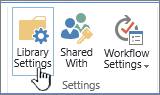

# Anwenden der Verwaltung von Informationsrechten (IRM) auf eine Liste oder BibliothekApply Information Rights Management (IRM) to a list or library

Sie können die Verwaltung von Informationsrechten (Information Rights Management, IRM) verwenden, um Dateien zu steuern und zu schützen, die aus Listen oder Bibliotheken heruntergeladen werden.You can use Information Rights Management (IRM) to help control and protect files that are downloaded from lists or libraries.
  
## Bevor Sie beginnenBefore you begin

- Der Azure Rights Management Service (Azure RMS) von Azure Information Protection und die lokalen äquivalenten Active Directory-RechteverwaltungsDienste (AD RMS) unterstützen die Verwaltung von Informationsrechten für Websites. Es sind keine separaten oder zusätzlichen Installationen erforderlich.The Azure Rights Management service (Azure RMS) from Azure Information Protection, and the on-premises equivalent, Active Directory Rights Management Services (AD RMS), support Information Rights Management for sites. No separate or additional installations are required.
    
- Bevor Sie IRM auf eine Liste oder Bibliothek anwenden, muss Sie zunächst von einem Administrator für Ihre Website aktiviert werden.Before you apply IRM to a list or library it must first be enabled by an administrator for your site.
    
- Zum Anwenden von IRM auf eine Liste oder Bibliothek benötigen Sie Administratorberechtigungen für diese Liste oder Bibliothek.To apply IRM to a list or library, you must have administrator permissions for that list or library.
    
- Wenn Sie SharePoint Online verwenden, können Benutzer Timeouts beim Herunterladen größerer IRM-geschützter Dateien erfahren. In diesem Fall wenden Sie den IRM-Schutz mithilfe Ihrer Office-Programme an, und speichern Sie größere Dateien in einer SharePoint-Bibliothek, die IRM nicht verwendet.If you are using SharePoint Online, your users might experience timeouts when downloading larger IRM-protected files. If this happens, then apply IRM protection by using your Office programs, and store larger files in a SharePoint library that does not use IRM.
    
> [!NOTE]
> Wenn Sie SharePoint Server 2013 verwenden, muss ein Server Administrator auf allen Front-End-Webservern für jeden Dateityp, den die Personen in Ihrer Organisation mithilfe von IRM schützen möchten, die Schutzkomponenten installieren.If you're using SharePoint Server 2013, a server administrator must install protectors on all front-end Web servers for every file type that the people in your organization want to protect by using IRM. 
  
## Anwenden von IRM auf eine Liste oder BibliothekApply IRM to a list or library

  
1. Wechseln Sie zu der Liste oder Bibliothek, für die Sie IRM konfigurieren möchten.Go to the list or library for which you want to configure IRM.
    
2. Klicken Sie auf dem Menüband auf die Registerkarte **Bibliothek** , und klicken Sie dann auf **Bibliothekseinstellungen**. (Wenn Sie in einer Liste arbeiten, klicken Sie auf die Registerkarte **Liste** , und klicken Sie dann auf **Listeneinstellungen**).On the ribbon, click the **Library** tab, and then click **Library Settings**. (If you are working in a list, click the **List** tab, and then click **List Settings**).
    
    
  
3. Klicken Sie unter **Berechtigungen und Verwaltung**auf **Verwaltung von Informationsrechten**. Wenn der Link Information Rights Management nicht angezeigt wird, ist IRM möglicherweise nicht für Ihre Website aktiviert. Wenden Sie sich an den Server Administrator, um zu prüfen, ob IRM für Ihre Website aktiviert werden kann. Der Link zur Verwaltung von Informationsrechten wird nicht für Bildbibliotheken angezeigt.Under **Permissions and Management**, click **Information Rights Management**. If the Information Rights Management link does not appear, IRM might not be enabled for your site. Contact your server administrator to see if it is possible to enable IRM for your site. The Information Rights Management link does not appear for picture libraries.
    
4. Aktivieren Sie auf der Seite Einstellungen für die **Verwaltung von Informationsrechten** das Kontrollkästchen **Berechtigungen für Dokumente in dieser Bibliothek beim Herunterladen einschränken** , um eingeschränkte Berechtigungen für Dokumente anzuwenden, die aus dieser Liste oder Bibliothek heruntergeladen werden.On the **Information Rights Management Settings** page, select the **Restrict permission to documents in this library on download** check box to apply restricted permission to documents that are downloaded from this list or library. 
    
5. Geben Sie im Feld **Titel der Berechtigungsrichtlinie erstellen** einen beschreibenden Namen für die Richtlinie ein, die Sie später verwenden können, um diese Richtlinie von anderen Richtlinien zu unterscheiden. Sie können beispielsweise " **Company Confidential** " eingeben, wenn Sie eine eingeschränkte Berechtigung für eine Liste oder Bibliothek anwenden, die vertrauliche Unternehmensdokumente enthalten soll.In the **Create a permission policy title** box, type a descriptive name for the policy that you can use later to differentiate this policy from other policies. For example, you can type **Company Confidential** if you are applying restricted permission to a list or library that will contain company documents that are confidential. 
    
6. Geben Sie im Feld **Beschreibung einer Berechtigungsrichtlinie hinzufügen** eine Beschreibung ein, die Personen angezeigt wird, die diese Liste oder Bibliothek verwenden, um zu erläutern, wie Sie die Dokumente in dieser Liste oder Bibliothek behandeln sollen. Sie können beispielsweise **den Inhalt dieses Dokuments nur mit anderen Mitarbeitern besprechen** eingeben, wenn Sie den Zugriff auf die Informationen in diesen Dokumenten auf interne Mitarbeiter beschränken möchten.In the **Add a permission policy description** box, type a description that will appear to people who use this list or library that explains how they should handle the documents in this list or library. For example, you can type **Discuss the contents of this document only with other employees** if you want to restrict access to the information in these documents to internal employees. 
    
7. Wenn Sie zusätzliche Einschränkungen für die Dokumente in dieser Liste oder Bibliothek anwenden möchten, klicken Sie auf **Optionen anzeigen**, und führen Sie einen der folgenden Schritte aus:To apply additional restrictions to the documents in this list or library, click **Show Options**, and do any of the following:
    
|**Zu diesem Zweck:****To do this:**|**Tun Sie Folgendes:****Do this:**|
|:-----|:-----|
|Zulassen, dass Benutzer Dokumente aus dieser Liste oder Bibliothek druckenAllow people to print documents from this list or library    |Aktivieren Sie das Kontrollkästchen **Viewer drucken zulassen** .Select the **Allow viewers to print** check box.    |
|Personen mit mindestens der View Items-Berechtigung erlauben, eingebetteten Code oder Makros in einem Dokument auszuführen.Allow people with at least the View Items permission to run embedded code or macros on a document.    |Aktivieren Sie das Kontrollkästchen zum **Ausführen von Skripts und Bildschirmleseprogrammen für heruntergeladene Dokumente zulassen** .Select the **Allow viewers to run script and screen reader to function on downloaded documents** check box.    Wenn Sie diese Option auswählen, können Benutzercode ausführen, um den Inhalt eines Dokuments zu extrahieren.If you select this option, users could run code to extract the contents of a document.           |
|Verlangen, dass Personen Ihre Anmeldeinformationen in bestimmten Intervallen überprüfen.Require that people verify their credentials at specific intervals.    Wählen Sie diese Option aus, wenn Sie den Zugriff auf Inhalte auf einen bestimmten Zeitraum einschränken möchten. Wenn Sie diese Option auswählen, laufen die Veröffentlichungslizenzen für die Personen, die für den Zugriff auf den Inhalt gelten, nach der angegebenen Anzahl von Tagen ab, und Personen müssen zum Server zurückkehren, um Ihre Anmeldeinformationen zu überprüfen und eine neue Kopie herunterzuladen.Select this option if you want to restrict access to content to a specified period of time. If you select this option, people's issuance licenses to access the content will expire after the specified number of days, and people will be required to return to the server to verify their credentials and download a new copy.    |Aktivieren Sie das Kontrollkästchen **Benutzer müssen Ihre Anmeldeinformationen mit diesem Intervall (Tage) überprüfen** , und geben Sie dann die Anzahl der Tage an, für die das Dokument angezeigt werden soll.Select the **Users must verify their credentials using this interval (days)** check box, and then specify the number of days for which you want the document to be viewable.    |
| Verhindern, dass Personen Dokumente hochladen, die IRM nicht unterstützen, in dieser Liste oder Bibliothek.Prevent people from uploading documents that do not support IRM to this list or library.     Wenn Sie diese Option auswählen, können die Benutzer keine der folgenden Dateitypen hochladen:If you select this option, people will not be able to upload any of the following file types:     Dateitypen, die auf allen Front-End-Webservern nicht über entsprechende IRM-Schutzkomponenten verfügen.File types that do not have corresponding IRM protectors installed on all of the front-end Web servers.     Dateitypen, die von SharePoint Server 2010 nicht entschlüsselt werden können.File types that SharePoint Server 2010 cannot decrypt.     Dateitypen, die in einem anderen Programm IRM-geschützt sindFile types that are IRM protected in another program    |Aktivieren Sie das Kontrollkästchen **Benutzer dürfen keine Dokumente hochladen, die IRM nicht unterstützen** .Select the **Do not allow users to upload documents that do not support IRM** check box.    |
|Entfernen Sie eingeschränkte Berechtigungen aus dieser Liste oder Bibliothek zu einem bestimmten Datum.Remove restricted permissions from this list or library on a specific date.    |Aktivieren Sie das Kontrollkästchen **Zugriff auf die Bibliothek beschränken** auf, und wählen Sie dann das gewünschte Datum aus.Select the **Stop restricting access to the library at** check box, and then select the date that you want.    |
|Steuern des Intervalls, in dem die Anmeldeinformationen für das Programm, das zum Öffnen des Dokuments lizenziert ist, zwischengespeichert werden.Control the interval that credentials are cached for the program that is licensed to open the document.    |Geben Sie im Feld **Gruppen Schutz und Anmeldeinformationen festlegen**in der Anzahl von Tagen theinterval für das Zwischenspeichern von Anmeldeinformationen ein.In the **Set group protection and credentials interval**, enter theinterval for caching credentials in number of days.    |
|Gruppen Schutz zulassen, sodass Benutzer für Mitglieder derselben Gruppe freigeben können.Allow group protection so that users can share with members of the same group.    |Wählen Sie **Gruppen Schutz zulassen**aus, und geben Sie den Namen der Gruppe für die Freigabe ein.Select **Allow group protection**, and enter the group's name for sharing.    |
   
8. Nachdem Sie die gewünschten Optionen ausgewählt haben, klicken Sie auf **OK**.After you finish selecting the options you want, click **OK**.
  
## Was ist Verwaltung von Informationsrechten?What is Information Rights Management?

Mit der Verwaltung von Informationsrechten (IRM) können Sie die Aktionen einschränken, die Benutzer auf Dateien übernehmen dürfen, die aus Listen oder Bibliotheken heruntergeladen wurden. IRM verschlüsselt die heruntergeladenen Dateien und schränkt die Gruppe von Benutzern und Programmen ein, die diese Dateien entschlüsseln dürfen. IRM kann auch die Rechte der Benutzer einschränken, die Dateien lesen dürfen, sodass Sie keine Aktionen wie das Drucken von Kopien der Dateien oder das Kopieren von Text davon ausführen können.Information Rights Management (IRM) enables you to limit the actions that users can take on files that have been downloaded from lists or libraries. IRM encrypts the downloaded files and limits the set of users and programs that are allowed to decrypt these files. IRM can also limit the rights of the users who are allowed to read files, so that they cannot take actions such as print copies of the files or copy text from them.
  
Sie können IRM in Listen oder Bibliotheken verwenden, um die Verbreitung von vertraulichen Inhalten einzuschränken. Wenn Sie beispielsweise eine Dokumentbibliothek erstellen, um Informationen zu bevorstehenden Produkten mit ausgewählten Marketing Vertretern gemeinsam zu verwenden, können Sie mithilfe von IRM verhindern, dass diese Personen diese Inhalte für andere Mitarbeiter im Unternehmen freigeben.You can use IRM on lists or libraries to limit the dissemination of sensitive content. For example, if you are creating a document library to share information about upcoming products with selected marketing representatives, you can use IRM to prevent these individuals from sharing this content with other employees in the company.
  
Auf einer Website wenden Sie IRM auf eine gesamte Liste oder Bibliothek und nicht auf einzelne Dateien an. Dadurch wird es einfacher, einen konsistenten Schutzgrad für eine ganze Gruppe von Dokumenten oder Dateien sicherzustellen. IRM kann daher Ihre Organisation bei der Durchsetzung von Unternehmensrichtlinien unterstützen, die die Verwendung und Weitergabe vertraulicher oder proprietärer Informationen steuern.On a site, you apply IRM to an entire list or library, rather than to individual files. This makes it easier to ensure a consistent level of protection for an entire set of documents or files. IRM can thus help your organization to enforce corporate policies that govern the use and dissemination of confidential or proprietary information.
  
> [!NOTE]
> Die Informationen auf dieser Seite zur Verwaltung von Informationsrechten ersetzen alle Ausdrücke, die in allen Microsoft SharePoint Server 2013-und SharePoint Server 2016-Lizenz Begriffs Vereinbarungen auf "Information Rights Management" verweisen.The information on this page regarding Information Rights Management supersedes any terms that reference 'Information Rights Management' in any Microsoft SharePoint Server 2013 and SharePoint Server 2016 license term agreements. 
  
### Wie IRM zum Schutz von Inhalten beitragen kannHow IRM can help protect content

IRM unterstützt den Schutz eingeschränkter Inhalte auf folgende Weise:IRM helps to protect restricted content in the following ways:
  
- Verhindert, dass ein autorisierter Betrachter das Kopieren, ändern, drucken, Faxen oder kopieren und Einfügen des Inhalts zur nicht autorisierten Verwendung ermöglichtHelps to prevent an authorized viewer from copying, modifying, printing, faxing, or copying and pasting the content for unauthorized use
    
- Verhindert, dass ein autorisierter Viewer den Inhalt mithilfe der Druck Bildschirm Funktion in Microsoft Windows kopiertHelps to prevent an authorized viewer from copying the content by using the Print Screen feature in Microsoft Windows
    
- Verhindert, dass ein nicht autorisierter Betrachter den Inhalt anzeigt, wenn er per e-Mail gesendet wird, nachdem er vom Server heruntergeladen wurde.Helps to prevent an unauthorized viewer from viewing the content if it is sent in e-mail after it is downloaded from the server
    
- Schränkt den Zugriff auf Inhalte auf einen bestimmten Zeitraum ein, nach dem Benutzer ihre Anmeldeinformationen bestätigen und erneut herunterladen müssen.Restricts access to content to a specified period of time, after which users must confirm their credentials and download the content again
    
- Unterstützt die Durchsetzung von Unternehmensrichtlinien, die die Verwendung und Verbreitung von Inhalten in Ihrer Organisation steuernHelps to enforce corporate policies that govern the use and dissemination of content within your organization
    
### Wie IRM nicht zum Schutz von Inhalten beitragen kannHow IRM cannot help protect content

IRM kann eingeschränkte Inhalte nicht aus folgenden Bereichen schützen:IRM cannot protect restricted content from the following:
  
- Löschung, Diebstahl, Erfassung oder Übertragung durch bösartige Programme wie Trojanische Pferde, keyloggers und bestimmte Arten von SpywareErasure, theft, capture, or transmission by malicious programs such as Trojan horses, keystroke loggers, and certain types of spyware
    
- Verlust oder Beschädigung aufgrund der Aktionen von ComputervirenLoss or corruption because of the actions of computer viruses
    
- Manuelles Kopieren oder erneutes Eingeben von Inhalten aus der Anzeige auf einem BildschirmManual copying or retyping of content from the display on a screen
    
- Digitale oder Film Fotografie von Inhalten, die auf einem Bildschirm angezeigt werdenDigital or film photography of content that is displayed on a screen
    
- Kopieren durch die Verwendung von Drittanbieter-BildschirmaufnahmeprogrammenCopying through the use of third-party screen-capture programs
    
- Kopieren von Inhaltsmetadaten (Spaltenwerte) durch die Verwendung von Bildschirmaufnahmeprogrammen eines Drittanbieters oder durch Kopieren und EinfügenCopying of content metadata (column values) through the use of third-party screen-capture programs or copy-and-paste action
    
[Anwenden der Verwaltung von Informationsrechten auf eine Liste oder BibliothekApply Information Rights Management to a list or library](https://support.office.com/article/6714cfe3-ef39-43b0-bb65-a887726bb63c)
  
## FunktionsWeise von IRM für Listen und BibliothekenHow IRM works for lists and libraries

Der IRM-Schutz wird auf Dateien auf der Listen-oder Bibliotheksebene angewendet. Wenn IRM für eine Bibliothek aktiviert ist, gilt die Rechteverwaltung für alle Dateien in dieser Bibliothek. Wenn IRM für eine Liste aktiviert ist, gilt die Rechteverwaltung nur für Dateien, die an Listenelemente angefügt sind, nicht die eigentlichen Listenelemente.IRM protection is applied to files at the list or library level. When IRM is enabled for a library, rights management applies to all of the files in that library. When IRM is enabled for a list, rights management applies only to files that are attached to list items, not the actual list items.
  
Wenn Benutzer Dateien in einer IRM-fähigen Liste oder Bibliothek herunterladen, werden die Dateien verschlüsselt, sodass nur autorisierte Personen Sie anzeigen können. Jede Datei mit verwalteten Rechten enthält außerdem eine Veröffentlichungslizenz, die den Personen, die die Datei anzeigen, Einschränkungen auferlegt. Zu den typischen Einschränkungen gehört das Erstellen einer schreibgeschützten Datei, das Deaktivieren des Kopierens von Text, das verhindern des Speicherns einer lokalen Kopie und das verhindern, dass Personen die Datei drucken. Client Programme, die IRM-gestützte Dateitypen lesen können, verwenden die Veröffentlichungslizenz innerhalb der Datei mit verwalteten Rechten, um diese Einschränkungen zu erzwingen. So behält eine Datei mit verwalteten Rechten ihren Schutz auch nach dem Herunterladen vom Server.When people download files in an IRM-enabled list or library, the files are encrypted so that only authorized people can view them. Each rights-managed file also contains an issuance license that imposes restrictions on the people who view the file. Typical restrictions include making a file read-only, disabling the copying of text, preventing people from saving a local copy, and preventing people from printing the file. Client programs that can read IRM-supported file types use the issuance license within the rights-managed file to enforce these restrictions. This is how a rights-managed file retains its protection even after it is downloaded from the server.
  
Die Einschränkungen, die beim Herunterladen aus einer Liste oder Bibliothek auf eine Datei angewendet werden, basieren auf den Berechtigungen des jeweiligen Benutzers für die Website, die die Datei enthält. In der folgenden Tabelle wird erläutert, wie die Berechtigungen für Websites IRM-Berechtigungen entsprechen.The types of restrictions that are applied to a file when it is downloaded from a list or library are based on the individual user's permissions on the site that contains the file. The following table explains how the permissions on sites correspond to IRM permissions.
  
|**Berechtigungen****Permissions**|**IRM-Berechtigungen****IRM Permissions**|
|:-----|:-----|
|Berechtigungen verwalten, Website verwaltenManage Permissions, Manage Web Site    |**Vollzugriff** (wie vom Clientprogramm definiert): diese Berechtigung ermöglicht es einem Benutzer im Allgemeinen, Berechtigungen für Inhalte mit verwalteten Rechten zu lesen, zu bearbeiten, zu kopieren, zu speichern und zu ändern.**Full control** (as defined by the client program): This permission generally allows a user to read, edit, copy, save, and modify permissions of rights-managed content.    |
|Bearbeiten von Elementen, Verwalten von Listen, hinzufügen und Anpassen von SeitenEdit Items, Manage Lists, Add and Customize Pages    |**Bearbeiten**, **Kopieren**und **Speichern**: ein Benutzer kann eine Datei nur drucken, wenn das Kontrollkästchen **Benutzern das Drucken von Dokumenten erlauben** auf der Seite Einstellungen für die Verwaltung von Informationsrechten für die Liste oder Bibliothek aktiviert ist.**Edit**, **Copy**, and **Save**: A user can print a file only if the **Allow users to print documents** check box is selected on the Information Rights Management Settings page for the list or library.    |
|
            Elemente anzeigenView Items    |**Lesen**: ein Benutzer kann das Dokument lesen, aber seinen Inhalt nicht kopieren oder ändern. Ein Benutzer kann nur drucken, wenn das Kontrollkästchen **Benutzer können Dokumente drucken** aktiviert ist, auf der Seite Einstellungen für die Verwaltung von Informationsrechten für die Liste oder Bibliothek.**Read**: A user can read the document, but cannot copy or modify its content. A user can print only if the **Allow users to print documents** check box is selected on the Information Rights Management Settings page for the list or library.    |
|AndereOther    |Keine anderen Berechtigungen entsprechen den IRM-Berechtigungen direkt.No other permissions correspond directly to IRM permissions.    |
   
Wenn Sie IRM für eine Liste oder Bibliothek in SharePoint Server 2013 aktivieren, können Sie nur Dateitypen in dieser Liste oder Bibliothek schützen, für die eine Schutzkomponente auf allen Front-End-Webservern installiert ist. Ein Protector ist ein Programm, das die Verschlüsselung und Entschlüsselung von Dateien mit verwalteten Rechten eines bestimmten Dateiformats steuert. SharePoint enthält Schutzfolien für die folgenden Dateitypen:When you enable IRM for a list or library in SharePoint Server 2013, you can only protect file types in that list or library for which a protector is installed on all front-end Web servers. A protector is a program that controls the encryption and decryption of rights-managed files of a specific file format. SharePoint includes protectors for the following file types:
  
- Microsoft Office InfoPath-FormulareMicrosoft Office InfoPath forms
    
- Die 97-2003-Dateiformate für die folgenden Microsoft Office-Programme: Word, Excel und PowerPointThe 97-2003 file formats for the following Microsoft Office programs: Word, Excel, and PowerPoint
    
- Die Office Open XML-Formate für die folgenden Microsoft Office-Programme: Word, Excel und PowerPointThe Office Open XML Formats for the following Microsoft Office programs: Word, Excel, and PowerPoint
    
- XML Paper Specification (XPS)-FormatThe XML Paper Specification (XPS) format
    
Wenn in Ihrer Organisation zusätzlich zu den oben aufgeführten die IRM zum Schutz anderer Dateitypen verwendet werden soll, muss der Server Administrator die Schutzkomponenten für diese zusätzlichen Dateiformate installieren.If your organization plans to use IRM to protect any other file types in addition to those listed above, your server administrator must install protectors for these additional file formats.
  

