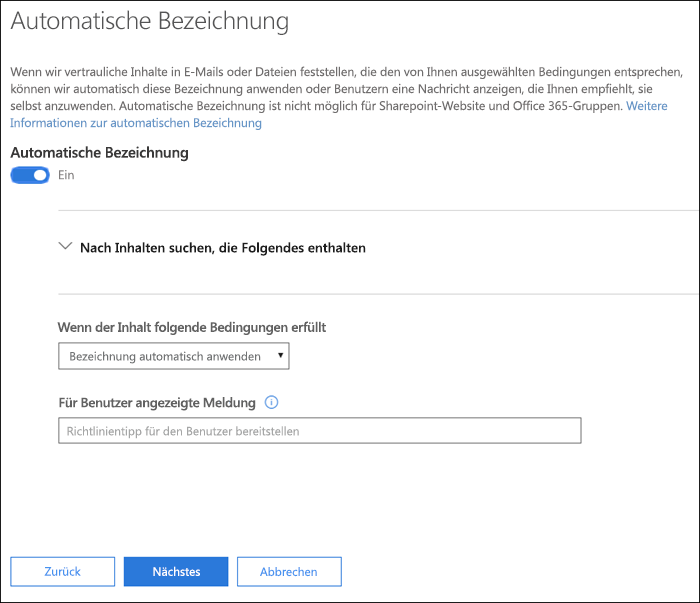
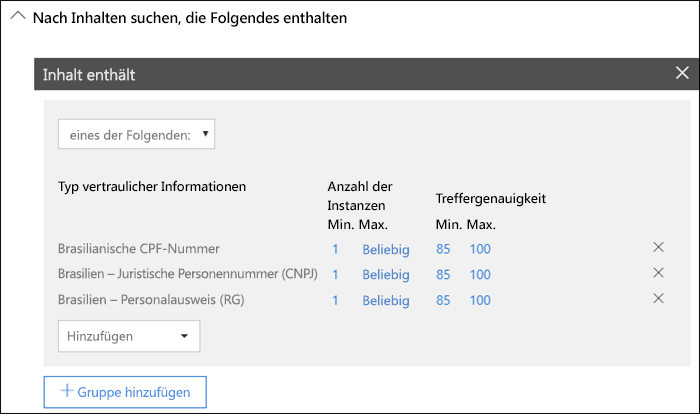
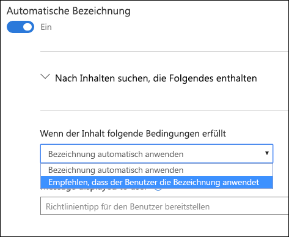
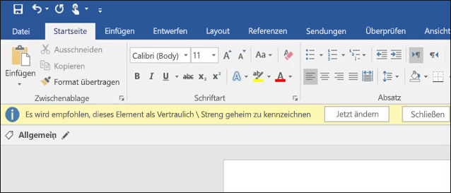

# Automatisches Anwenden einer Vertraulichkeitsbezeichnung auf InhalteApply a sensitivity label to content automatically

Wenn Sie eine Vertraulichkeitsbezeichnung erstellen, können Sie diese Bezeichnung automatisch Inhalten mit vertraulichen Informationen zuweisen oder die Benutzer dazu auffordern, die von Ihnen empfohlene Bezeichnung anzuwenden.When you create a sensitivity label, you can automatically assign that label to content containing sensitive information, or you can prompt users to apply the label that you recommend.

Die Möglichkeit, Vertraulichkeitsbezeichnungen automatisch auf Inhalte anzuwenden, ist aus den folgenden Gründen wichtig:The ability to apply sensitivity labels to content automatically is important because:

- Sie müssen die Benutzer nicht schulen, damit sie alle Ihre Klassifizierungen kennen.You don't need to train your users on all of your classifications.

- Sie müssen sich nicht darauf verlassen, dass die Benutzer alle Inhalte richtig klassifizieren.You don't need to rely on users to classify all content correctly.

- Benutzer müssen nicht mehr über die Richtlinien Bescheid wissen, sondern können sich stattdessen auf ihre Arbeit konzentrieren.Users no longer need to know about your policies - they can instead focus on their work.

> [!NOTE]
> Für die Funktion zum automatischen Anwenden von Bezeichnungen ist ein Azure Information Protection P2-Abonnement erforderlich. Um diese Funktion zu verwenden, müssen Sie [den Azure Information Protection-Client für einheitliche Bezeichnungen herunterladen und installieren](https://docs.microsoft.com/de-DE/azure/information-protection/rms-client/install-unifiedlabelingclient-app). Wir arbeiten an einer systemeigenen Unterstützung für diese Funktion in Office-Apps, damit der Azure Information Protection-Client für einheitliche Bezeichnungen nicht länger erforderlich ist. Darüber hinaus wird der Client für einheitliche Bezeichnungen nur unter Windows ausgeführt, sodass die Funktion derzeit nicht unter Mac, iOS und Android unterstützt wird.The capability to apply labels automatically requires an Azure Information Protection P2 subscription. To use this feature, you must [Download and install the Azure Information Protection unified labeling client](https://docs.microsoft.com/de-DE/azure/information-protection/rms-client/install-unifiedlabelingclient-app). We're working on native support for this feature in Office apps, so that it won't require the Azure Information Protection unified labeling client. Also, the unified labeling client runs only on Windows, so this feature is not yet supported on Mac, iOS, and Android.

## Automatisches Anwenden einer Vertraulichkeitsbezeichnung basierend auf KriterienApply a sensitivity label automatically based on conditions

Eines der leistungsstärksten Funktionen von Vertraulichkeitsbezeichnungen ist die Möglichkeit, sie automatisch auf Inhalte anzuwenden, die bestimmte Kriterien erfüllen. In diesem Fall müssen Personen in Ihrer Organisation die Vertraulichkeitsbezeichnungen nicht selbst anwenden – Office 365 erledigt dies für sie.One of the most powerful features of sensitivity labels is the ability to apply them automatically to content that matches certain conditions. In this case, people in your organization don't need to apply the sensitivity labels - Office 365 does the work for them.
   
Sie können festlegen, dass Vertraulichkeitsbezeichnungen automatisch auf Inhalte angewendet werden, wenn bestimmte Typen vertraulicher Informationen enthalten sind. Wenn Se festlegen, dass eine Vertraulichkeitsbezeichnung automatisch angewendet werden soll, wird dieselbe Liste mit Typen vertraulicher Informationen angezeigt wie beim Erstellen einer DLP-Richtlinie (Data Loss Prevention, Verhinderung von Datenverlust). So können Sie z. B. automatisch die Bezeichnung „Streng vertraulich“ auf Inhalte anwenden, die personenbezogene Kundendaten wie Kreditkartennummern oder Sozialversicherungsnummern enthalten.You can choose to apply sensitivity labels to content automatically when that content contains specific types of sensitive information. When you configure a sensitivity label to be applied automatically, you see the same list of sensitive information types as when you create a data loss prevention (DLP) policy. So you can, for example, automatically apply a Highly Confidential label to any content that contains customers' personally identifiable information (PII), such as credit card numbers or social security numbers. 

Nachdem Sie die Typen vertraulicher Informationen ausgewählt haben, können Sie die Kriterien eingrenzen, indem Sie die Instanzenanzahl oder Übereinstimmungsgenauigkeit ändern. Weitere Informationen finden Sie unter [Optimieren der Regeln für niedrigere oder höhere Übereinstimmungsgenauigkeit](data-loss-prevention-policies.md#tuning-rules-to-make-them-easier-or-harder-to-match).After you choose your sensitive informaton types, you can refine your condition by changing the instance count or match accuracy. For more information, see [Tuning rules to make them easier or harder to match](data-loss-prevention-policies.md#tuning-rules-to-make-them-easier-or-harder-to-match).

Darüber hinaus können Sie auswählen, ob die Kriterien alle Typen vertraulicher Informationen oder nur einen Typ feststellen müssen. Damit die Kriterien flexibler oder komplexer sind, können Sie Gruppen hinzufügen und logische Operatoren zwischen den Gruppen verwenden. Weitere Informationen finden Sie unter [Gruppieren und logische Operatoren](data-loss-prevention-policies.md#grouping-and-logical-operators).Further, you can choose whether a condition must detect all of the sensitive infromation types, or just one of them. And to make your conditions more flexible or complex, you can add groups and use logical operators between the groups. For more information, see [Grouping and logical operators](data-loss-prevention-policies.md#grouping-and-logical-operators).

Wenn eine Vertraulichkeitsbezeichnung automatisch angewendet wird, wird dem Benutzer eine Benachrichtigung in der Office-App angezeigt. Sie können **OK** auswählen, um die Benachrichtigung zu schließen.When a sensitivity label is automatically applied, the user sees a notification in their Office app. They can choose **OK** to dismiss the notification.

## Empfehlen des Anwendens einer VertraulichkeitsbezeichnungRecommend that the user apply a sensitivity label

Auf Wunsch können Sie, anstatt eine Vertraulichkeitsbezeichnung automatisch auf Inhalte anzuwenden, Benutzern empfehlen, die Bezeichnung anzuwenden. Diese Option bietet Benutzern die Möglichkeit, die Klassifizierung und den dazugehörigen Schutz zu akzeptieren oder die Empfehlung abzulehnen, falls die Bezeichnung für das Dokument oder die E-Mail nicht geeignet ist.If you prefer, instead of applying a sensitivity label automatically to content, you can recommend to your users that they apply the label. This option provides your users the flexibility of accepting the classification and any associated protection, or dismissing the recommendation if the label is not suitable for their document or email.

Beachten Sie, dass empfohlene Bezeichnungen in Word, PowerPoint und Excel unterstützt werden (Azure Information Protection-Client für einheitliche Bezeichnungen muss installiert sein). Wir arbeiten daran, dass die empfohlenen Bezeichnungen in Outlook unterstützt werden.Note that recommended labels are supported in Word, PowerPoint, and Excel (and require that the Azure Information Proteciton unified labeling client is installed). We're working on support for recommended labels in Outlook.

Im Folgenden finden Sie ein Beispiel für eine Aufforderung, wenn Sie Kriterien zum Anwenden einer Bezeichnung als empfohlene Aktion, und einen benutzerdefinierten Richtlinientipp. Sie können den Text festlegen, der im Richtlinientipp angezeigt wird.Here's an example of a prompt when you configure a condition to apply a label as a recommended action, with a custom policy tip. You can choose what text is displayed in the policy tip.

## Anwenden automatischer oder empfohlener BezeichnungenHow automatic or recommended labels are applied

- Das automatische Anwenden von Bezeichnungen gilt für Word, Excel und PowerPoint, wenn Dokumente gespeichert werden, und für Outlook, wenn E-Mails gesendet werden. Diese Kriterien erkennen vertrauliche Informationen im Text in den Dokumenten und E-Mails sowie in Kopf-und Fußzeilen, jedoch nicht in der Betreffzeile oder Anlagen von E-Mails.Automatic labeling applies to Word, Excel, and PowerPoint when documents are saved, and to Outlook when emails are sent. These conditions detect sensitive information in the body text in documents and emails, and to headers and footers -- but not in the subject line or attachments of email.

- Die automatische Klassifizierung kann nicht für Dokumente und E-Mails verwendet werden, die zuvor manuell mit einer Bezeichnung versehen wurden oder automatisch mit einer Bezeichnung mit höherer Klassifizierung versehen wurden. Ein Dokument oder eine E-Mail darf nur über eine angewendete Vertraulichkeitsbezeichnung verfügen (zusätzlich zu einer einzelnen Aufbewahrungsbezeichnung).You cannot use automatic classification for documents and emails that were previously manually labeled, or previously automatically labeled with a higher classification. Remember, a document or email can have only a single sensitivity label applied to it (in addition to a single retention label).

- Die Empfohlene Klassifizierung gilt für Word, Excel und PowerPoint, wenn Dokumente gespeichert werden. Wir arbeiten daran, dass das Anwenden empfohlener Bezeichnungen in Outlook unterstützt wird.Recommended classification applies to Word, Excel, and PowerPoint when documents are saved. We're working on support for recommended labeling in Outlook.

- Die empfohlene Klassifizierung kann nicht für Dokumente verwendet werden, die bereits mit einer Bezeichnung mit höherer Klassifizierung versehen wurden. Wenn der Inhalt bereits mit einer Bezeichnung mit höherer Klassifizierung versehen ist, wird in diesem Fall dem Benutzer keine Aufforderung mit der Empfehlung und dem Richtlinientipp angezeigt.You cannot use recommended classification for documents that were previously labeled with a higher classification. In this case, when the content's already labeled with a higher classification, the user won't see the prompt with the recommendation and policy tip.

## Auswerten mehrerer Kriterien, wenn sie für mehr als eine Bezeichnung zutreffenHow multiple conditions are evaluated when they apply to more than one label

Die Bezeichnungen werden je nach Position, die Sie in der Richtlinie festlegen, sortiert: die Bezeichnung an erster Stelle hat die niedrigste Position (am wenigsten vertraulich) und die Bezeichnung an letzter Stelle hat die höchste Position (am meisten vertraulich). Weitere Informationen zur Priorität finden Sie unter [Priorität der Bezeichnungen (Reihenfolge wesentlich)](sensitivity-labels.md#label-priority-order-matters).The labels are ordered for evaluation according to their position that you specify in the policy: The label positioned first has the lowest position (least sensitive) and the label positioned last has the highest position (most sensitive). For more information on priority, see [Label priority (order matters)](sensitivity-labels.md#label-priority-order-matters).