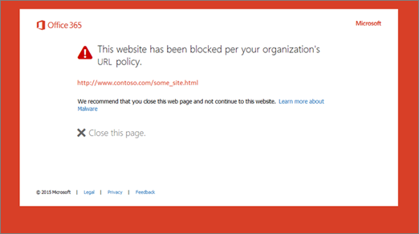

# Office 365 ATP sichere Links Warnung Seiten

[Office 365 erweiterten Schutz](office-365-atp.md) (ATP) trägt zum Schutz Ihrer Organisation vor Phishing-Versuche und Malware über Features, wie [ATP sichere Links](atp-safe-links.md), [ATP sichere Anlagen](atp-safe-attachments.md)und [Phishing - Schutz](anti-phishing-protection.md). Wenn Schutz vorhanden ist, werden Links (URLs) in e-Mail-Nachrichten und Office-Dokumente überprüft. Wenn eine URL als verdächtigen oder böswilliges identifiziert wird, können Sie verhindert werden, dass die URL zu öffnen, wenn Sie darauf klicken. Statt direkt auf der Website kann zu eine Seite Warnung sehen. 
  
Lesen Sie diesen Artikel, um die [Beispiele für Warnung Seiten](atp-safe-links-warning-pages.md#examples) finden Sie unter, die zusammen mit [zuletzt verwendet wird aktualisiert und Warnung Seiten](atp-safe-links-warning-pages.md#updates)angezeigt werden.
  
## Beispiele für Warnung Seiten

### ATP wird den Link gescannt.

Eine URL wird vom ATP sichere Links überprüft wird. Möglicherweise müssen Sie warten Sie einen Moment, um die Verbindung erneut versuchen.

### Eine URL befindet sich in einer verdächtigen e-Mail-Nachricht

Die URL ist in einer e-Mail-Nachricht, die andere e-Mail-Nachrichten ähnelt scheint, die verdächtigen berücksichtigt werden. Es wird empfohlen, dass Sie die e-Mail-Nachricht, bevor Sie mit der Website überprüfen.

### Eine URL, die in einer Nachricht als Phishing-Versuch gekennzeichnet ist

Die URL ist in einer e-Mail-Nachricht, die als Phishingangriff identifiziert wurde. Dementsprechend werden alle URLs in der e-Mail-Nachricht blockiert. Es wird empfohlen, Sie zu der Website nicht ignorieren.

### Eine Website wurde als bösartige identifiziert

Die URL verweist auf eine Website, die als böswillige identifiziert wurde.    Es wird empfohlen, Sie zu der Website nicht ignorieren.

### Eine Website ist gesperrt.

Die URL ist für Ihre Organisation blockiert. Es gibt verschiedene Gründe, warum eine URL blockiert werden. Es wird empfohlen, dass Sie Ihre Organisation Office 365-Administrator wenden.

### An error has occurred

Eine Art von Fehler aufgetreten, und die URL kann nicht geöffnet werden.

## Aktuelle Updates zu Warnung Seiten

Mehrere Warnung Seiten wurden kürzlich für Office 365 ATP aktualisiert. Wenn Sie noch nicht aktualisierten Seiten angezeigt werden, werden Sie bald. Die Updates umfassen ein neues Farbschema, Weitere Informationen und die Möglichkeit, mit einer Website trotz der angegebenen Warnung und Empfehlungen fortfahren.

### URL-Überprüfung in Bearbeitung

Warnung Ursprungsseite:

Aktualisierte Seite "Warnung":

### Bösartige Website-Warnung

Warnung Ursprungsseite:

Aktualisierte Seite "Warnung":

### URL-Warnung blockiert

Warnung Ursprungsseite:

Aktualisierte Seite "Warnung":

### "Fehler" Seite "Warnung"

Warnung Ursprungsseite:

Aktualisierte Seite "Warnung":

   
