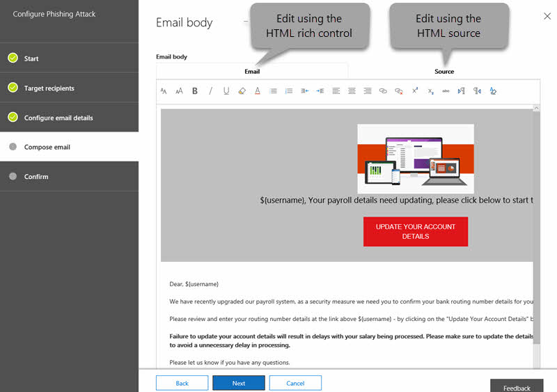

# Angriffssimulator in Office 365Attack Simulator in Office 365

**Zusammenfassung** Wenn Sie ein globaler Office 365-Administrator sind und Ihre Organisation über [Untersuchungen und Reaktionsmöglichkeiten in office 365](office-365-ti.md)verfügt, können Sie mit Angriffs Simulator realistische Angriffsszenarien in Ihrer Organisation ausführen.**Summary** If you are an Office 365 global administrator and your organization has [Office 365 Threat Investigation and Response capabilities](office-365-ti.md), you can use Attack Simulator to run realistic attack scenarios in your organization. Dies kann Ihnen dabei helfen, anfällige Benutzer zu identifizieren und zu suchen, bevor sich ein echter Angriff auf Ihr Endergebnis auswirkt.This can help you identify and find vulnerable users before a real attack impacts your bottom line. Lesen Sie diesen Artikel, um mehr zu erfahren.Read this article to learn more.

> [!IMPORTANT]
> Office 365 Advanced Threat Protection und Threat Investigation and Response (ehemals Threat Intelligence) sind nun Teil von Advanced Threat Protection Plan 2 von Office 365 mit zusätzlichen Funktionen zum Schutz vor Bedrohungen.Office 365 Advanced Threat Protection and Threat Investigation and Response (formerly known as Threat Intelligence) are now part of Office 365 Advanced Threat Protection Plan 2, with additional threat protection capabilities. Weitere Informationen finden Sie unter [office 365 Advanced Threat Protection-Pläne und Preise](https://products.office.com/exchange/advance-threat-protection) und die [Office 365 Advanced Threat Protection-Dienstbeschreibung](https://docs.microsoft.com/office365/servicedescriptions/office-365-advanced-threat-protection-service-description).To learn more, see [Office 365 Advanced Threat Protection plans and pricing](https://products.office.com/exchange/advance-threat-protection) and the [Office 365 Advanced Threat Protection Service Description](https://docs.microsoft.com/office365/servicedescriptions/office-365-advanced-threat-protection-service-description).
  
## Die AngriffeThe Attacks

Derzeit stehen drei Arten von Angriffssimulationen zur Verfügung:Three kinds of attack simulations are currently available:
  
- [Anzeigename Spear-Phishing-AngriffDisplay name spear-phishing attack](#display-name-spear-phishing-attack)
- [Kenn Wort Sprüh AngriffPassword-spray attack](#password-spray-attack)
- [Brute-Force-KennwortangriffBrute-force password attack](#brute-force-password-attack)
    
Damit ein Angriff erfolgreich gestartet werden kann, verwenden Sie die mehrstufige Authentifizierung für das Konto, mit dem Sie simulierte Angriffe ausführen.For an attack to be successfully launched, you use multi-factor authentication on the account you are using to run simulated attacks. Darüber hinaus müssen Sie ein globaler Office 365-Administrator sein.In addition, you must be an Office 365 global administrator.
  
> [!NOTE]
> Die Unterstützung für bedingten Zugriff wird in Kürze verfügbar sein.Support for Conditional Access is coming soon. 
  
Für den Zugriff auf Angriffs Simulator &amp; wählen Sie im Security Compliance Center **Threat Management** \> **Attack Simulator**aus.To access Attack Simulator, in the Security &amp; Compliance Center, choose **Threat management** \> **Attack simulator**.
  
## Bevor Sie beginnen...Before you begin...

Stellen Sie sicher, dass Sie und Ihre Organisation die folgenden Anforderungen für anGriffs Simulator erfüllen:Make sure that you and your organization meet the following requirements for Attack Simulator:
      
- **Die E-Mails Ihrer Organisation werden in Exchange Online gehostet**.**Your organization's email is hosted in Exchange Online**. (AnGriffs Simulator ist für lokale e-Mail-Server nicht verfügbar.)(Attack Simulator is not available for on-premises email servers.)
    
- **Sie sind ein Office 365-globaler Administrator****You are an Office 365 global administrator**
    
- **Die mehrstufige [Authentifizierung (Multi-Factor Authentication](https://docs.microsoft.com/office365/admin/security-and-compliance/set-up-multi-factor-authentication?view=o365-worldwide) , MFA) ist mindestens für das globale Administratorkonto von Office 365 aktiviert**.**[Multi-factor authentication](https://docs.microsoft.com/office365/admin/security-and-compliance/set-up-multi-factor-authentication?view=o365-worldwide) (MFA) is turned on, for at least the Office 365 global administrator account**. (Im Idealfall ist MFA für alle Benutzer in Ihrer Organisation aktiviert.)(Ideally, MFA is turned on for all users in your organization.)
 
- **ihre organisation verfügt [über Office 365 Advanced Threat Protection Plan 2](office-365-ti.md)**, mit angriffs simulator im &amp; Security Compliance Center (zum **Threat management** \> -angriffs **simulator**)**Your organization has [Office 365 Advanced Threat Protection Plan 2](office-365-ti.md)**, with Attack Simulator visible in the Security &amp; Compliance Center (go to **Threat management** \> **Attack simulator**) 

    
## Anzeigename Spear-Phishing-AngriffDisplay name spear-phishing attack

Phishing ist ein allgemeiner Ausdruck für eine breite Palette von Angriffen, die als Social Engineering-Angriff eingestuft werden.Phishing is a generic term for a broad suite of attacks classed as a social engineering style attack. Dieser Angriff konzentriert sich auf Spear-Phishing, einen gezielteren Angriff, der auf eine bestimmte Gruppe von Individuen oder eine Organisation abzielt.This attack is focused on spear phishing, a more targeted attack that is aimed at a specific group of individuals or an organization. In der Regel wird eine angepasste Angriffs Funktion mit einer gewissen Aufklärung durchgeführt und ein Anzeigename verwendet, der eine Vertrauensstellung im Empfänger generiert, beispielsweise eine e-Mail-Nachricht, die so aussieht, als ob Sie von einem Führungskräfte in Ihrer Organisation stammt.Typically, a customized attack with some reconnaissance performed and using a display name that will generate trust in the recipient, such as an email message that looks like it came from an executive within your organization.
  
Dieser Angriff hat den Schwerpunkt darauf, dass Sie ändern, von wem die Nachricht scheinbar stammt, indem Sie den Anzeigenamen und die Quelladresse geändert haben.This attack focuses on letting you manipulate who the message appears to have originated from by changing the display name and source address. Wenn Speer-Phishing-Angriffe erfolgreich sind, erhalten Internetkriminelle Zugriff auf die Anmeldeinformationen der Benutzer.When spear-phishing attacks are successful, cybercriminals gain access to users' credentials.
  
### So simulieren Sie einen Speer-Phishing-AngriffTo simulate a spear-phishing attack

  
Sie können den Rich-HTML-Editor direkt im Feld **e-Mail-Textkörper** selbst oder mit HTML-Quelle arbeiten.You can craft the rich HTML editor directly in the **Email body** field itself or work with HTML source.
  
1. Wählen Sie [im &amp; Security Compliance Center](https://protection.office.com) **Threat Management** \> **Attack Simulator**aus.In the [Security &amp; Compliance Center](https://protection.office.com), choose **Threat management** \> **Attack simulator**.
    
2. Geben Sie einen aussagekräftigen Namen für die Kampagne an, oder wählen Sie eine Vorlage aus.Specify a meaningful campaign name for the attack or select a template.  
  
3. Geben Sie die Zielempfänger an.Specify the target recipients. Dabei kann es sich um Einzelpersonen oder Gruppen in Ihrer Organisation handeln.This can be individuals or groups in your organization. Jeder Zielempfänger muss über ein Exchange Online-Postfach verfügen, damit der Angriff erfolgreich ist.Each targeted recipient must have an Exchange Online Mailbox in order for the attack to be successful.  
  
4. Konfigurieren Sie die Details für Phishing-e-Mails.Configure the Phishing email details.   Die HTML-Formatierung kann so komplex oder einfach sein, wie es Ihre Kampagne benötigt.The HTML formatting can be as complex or basic as your campaign needs. Da das e-Mail-Format HTML ist, können Sie Bilder und Text einfügen, um Glaubwürdigkeit erhöhen zu verbessern.As the email format is HTML, you can insert images and text to enhance believability. Sie haben die Kontrolle darüber, wie die empfangene Nachricht im empfangenden e-Mail-Client aussieht.You have control on what the received message will look like in the receiving email client.
    
5. Geben Sie Text für das Feld **from (Name)** an.Specify text for the **From (Name)** field. Dies ist das Feld, das im **Anzeigenamen** im empfangenden e-Mail-Client angezeigt wird.This is the field that shows in the **Display Name** in the receiving email client. 
    
6. Geben Sie Text oder das Feld **von** ein.Specify text or the **From** field. Dies ist das Feld, das als e-Mail-Adresse des Absenders im empfangenden e-Mail-Client angezeigt wird.This is the field that shows as the email address of the sender in the receiving email client.  Sie können einen vorhandenen e-Mail-Namespace in Ihrer Organisation eingeben (Dadurch wird die e-Mail-Adresse tatsächlich im empfangenden Client aufgelöst, wodurch ein sehr hohes vertrauenswürdiges Modell erleichtert wird), oder Sie können eine externe e-Mail-Adresse eingeben.You can enter an existing email namespace within your organization (doing this will make the email address actually resolve in the receiving client, facilitating a very high trust model), or you can enter an external email address. Die angegebene e-Mail-Adresse muss nicht tatsächlich vorhanden sein, Sie muss jedoch das Format einer gültigen SMTP-Adresse wie Benutzer @ Domänenname. Extension befolgen.The email address that you specify does not have to actually exist, but it does need to following the format of a valid SMTP address, such as user@domainname.extension. 
  
7. Wählen Sie mithilfe der Dropdownauswahl eine Phishing-Anmeldeserver-URL aus, die die Art der Inhalte widerspiegelt, die Sie in ihrem Angriff haben werden.Using the drop-down selector, select a Phishing Login server URL that reflects the type of content you will have within your attack. Es werden mehrere Thema-URLs bereitgestellt, aus denen Sie auswählen können, beispielsweise Dokument Zustellungen, Technik, Abrechnung usw. Dies ist die URL, auf die gezielt Benutzer klicken müssen.Several themed URLs are provided for you to choose from, such as document delivery, technical, payroll etc. This is effectively the URL that targeted users are asked to click.
    
8. Geben Sie eine benutzerdefinierte Zielseiten-URL an.Specify a custom landing page URL. Bei Verwendung dieser Methode werden Benutzer zu einer URL umgeleitet, die Sie am Ende eines erfolgreichen Angriffs angeben.Using this will redirect users to a URL you specify at the end of a successful attack. Wenn Sie beispielsweise über interne Schulungen verfügen, können Sie dies hier angeben.If you have internal awareness training, for example, you can specify that here.
    
9. Geben Sie Text für das Feld **Betreff** an.Specify text for the **Subject** field. Dies ist das Feld, das als **antragSteller Name** im empfangenden e-Mail-Client angezeigt wird.This is the field that shows as the **Subject Name** in the receiving email client. 
    
10. VerFassen Sie den **e-Mail-Text** , der vom Ziel empfangen wird.Compose the **Email body** that the target will receive.  `${username}`Fügt den Namen der Ziele in den e-Mail-Text ein.`${username}` inserts the targets name into the Email body.  `${loginserverurl}`Fügt die URL ein, auf die Zielbenutzer klicken sollen.`${loginserverurl}` inserts the URL we want target users to click 
    
11. Klicken Sie auf **weiter und** dann auf **Fertig stellen** , um den Angriff zu starten.Choose **Next,** then **Finish** to launch the attack. Die Spear-Phishing-e-Mail wird an die Postfächer ihrer Zielempfänger gesendet.The spear phishing email message is delivered to your target recipients' mailboxes. 
    
## Kenn Wort Sprüh AngriffPassword-spray attack

Ein Kenn Wort Sprüh Angriff gegen eine Organisation wird in der Regel verwendet, nachdem ein fehlerhafter Akteur erfolgreich eine Liste gültiger Benutzer aus dem Mandanten abgerufen hat.A password spray attack against an organization is typically used after a bad actor has successfully acquired a list of valid users from the tenant. Der ungültige Akteur weiß um allgemeine Kennwörter, die von Benutzern verwendet werden.The bad actor knows about common passwords that people use. Hierbei handelt es sich um eine weit verbreitete Attacke, da es sich um einen billigen Angriff handelt, der nicht mehr erkannt werden kann als Brute-Force-Ansätze.This is a widely used attack, as it is a cheap attack to run, and harder to detect than brute force approaches.
  
Dieser Angriff konzentriert sich darauf, dass Sie ein allgemeines Kennwort für eine umfangreiche Zielbasis von Benutzern angeben können.This attack focuses on letting you specify a common password against a large target base of users.
  
### So simulieren Sie einen Kenn Wort Sprüh AngriffTo simulate a password-spray attack

1. Wählen Sie [im &amp; Security Compliance Center](https://protection.office.com) **Threat Management** \> **Attack Simulator**aus.In the [Security &amp; Compliance Center](https://protection.office.com), choose **Threat management** \> **Attack simulator**.
    
2. Geben Sie einen aussagekräftigen Kampagnennamen für den Angriff an.Specify a meaningful campaign name for the attack.
    
3. Geben Sie die Zielempfänger an.Specify the target recipients. Dabei kann es sich um Einzelpersonen oder Gruppen in Ihrer Organisation handeln.This can be individuals or groups in your organization. Ein Zielempfänger muss über ein Exchange Online-Postfach verfügen, damit der Angriff erfolgreich ist.A targeted recipient must have an Exchange Online Mailbox in order for the attack to be successful.
    
4. Geben Sie ein Kennwort für den Angriff an.Specify a password to use for the attack. Beispiel: ein gemeinsames, relevantes Kennwort, das Sie ausprobieren können, ist `Fall2017`.For example, one common, relevant password you could try is `Fall2017`. Eine andere kann `Spring2018`sein, `Password1`oder.Another might be `Spring2018`, or `Password1`.
    
5. Wählen Sie **Fertig stellen** , um den Angriff zu starten.Choose **Finish** to launch the attack. 
    
## Brute-Force-KennwortangriffBrute-force password attack

Ein Brute-Force-Kennwortangriff gegen eine Organisation wird in der Regel verwendet, nachdem ein fehlerhafter Akteur erfolgreich eine Liste der Hauptbenutzer aus dem Mandanten abgerufen hat.A brute-force password attack against an organization is typically used after a bad actor has successfully acquired a list of key users from the tenant. Dieser Angriff zielt darauf ab, eine Reihe von Kennwörtern für das Konto eines einzelnen Benutzers zu testen.This attack focuses on trying a set of passwords on a single user's account.
  
### So simulieren Sie einen Brute-Force-KennwortangriffTo simulate a brute-force password attack

1. Wählen Sie [im &amp; Security Compliance Center](https://protection.office.com) **Threat Management** \> **Attack Simulator**aus.In the [Security &amp; Compliance Center](https://protection.office.com), choose **Threat management** \> **Attack simulator**.
    
2. Geben Sie einen aussagekräftigen Kampagnennamen für den Angriff an.Specify a meaningful campaign name for the attack.
    
3. Geben Sie den Zielempfänger an.Specify the target recipient. Ein Zielempfänger muss über ein Exchange Online-Postfach verfügen, damit der Angriff erfolgreich ist.A targeted recipient must have an Exchange Online Mailbox in order for the attack to be successful.
    
4. Geben Sie einen Satz von Kennwörtern an, die für den Angriff verwendet werden sollen.Specify a set of passwords to use for the attack. Zu diesem Zweck können Sie eine Textdatei (. txt) für die Liste der Kennwörter verwenden.To do this, you can use a text (.txt) file for your list of passwords. Die Textdatei darf nicht größer als 10 MB sein.The text file cannot exceed 10 MB in file size. Verwenden Sie ein Kennwort pro Leitung, und stellen Sie sicher, dass Sie nach dem letzten Kennwort in der Liste eine harte Rückgabe angeben.Use one password per line, and make sure to include a hard return after the last password in your list.
    
5. Wählen Sie **Fertig stellen** , um den Angriff zu starten.Choose **Finish** to launch the attack. 
    
## Neue Features im anGriffs SimulatorNew features in Attack Simulator

Dem anGriffs Simulator werden neue Features hinzugefügt.New features are being added to Attack Simulator. Zu diesen zählen:These include:

- **Erweiterte Berichterstellungsfunktionen**.**Advanced reporting capabilities**. Sie können beispielsweise die schnellste (oder langsamste) Zeit zum Öffnen einer e-Mail-Angriffssimulation sehen, die schnellste (oder langsamste) Zeit, um auf einen Link in der Nachricht zu klicken, und vieles mehr.You'll be able to see data such as the fastest (or slowest) time to open an attack simulation email message, the fastest (or slowest) time to click a link in the message, and more.

- **E-Mail-Vorlageneditor**.**Email template editor**. Sie können eine benutzerdefinierte, wieder verwendbare e-Mail-Vorlage erstellen, die Sie für zukünftige Angriffssimulationen verwenden können.You can create a custom, reusable email template that you can use for future attack simulations.

Besuchen Sie die [Microsoft 365-Roadmap](https://www.microsoft.com/microsoft-365/roadmap) , um zu sehen, was sich in der Entwicklung befindet, was ausrollt und was bereits gestartet wurde.Visit the [Microsoft 365 Roadmap](https://www.microsoft.com/microsoft-365/roadmap) to see what's in development, what's rolling out, and what's already launched.

## Siehe auchSee also

[Office 365 Advanced Threat Protection-DienstbeschreibungOffice 365 Advanced Threat Protection Service Desription](https://docs.microsoft.com/en-us/office365/servicedescriptions/office-365-advanced-threat-protection-service-description)

[Office 365 Advanced Threat ProtectionOffice 365 Advanced Threat Protection](office-365-atp.md)

