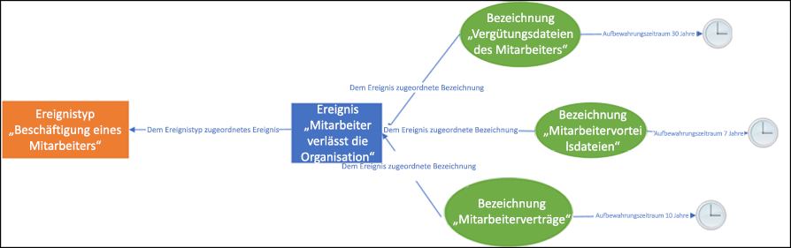
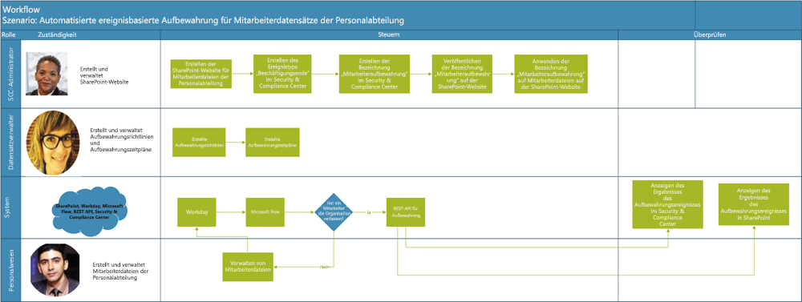
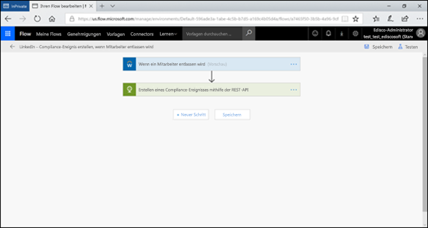
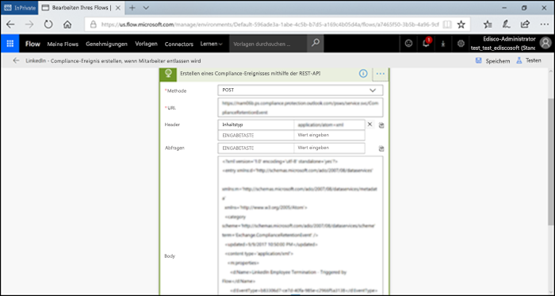
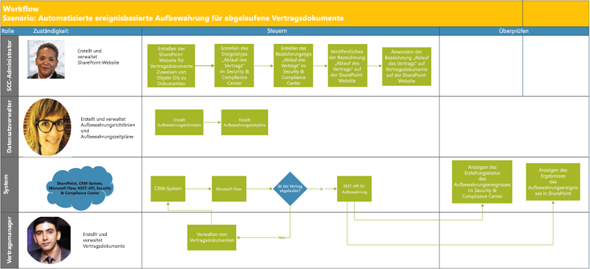
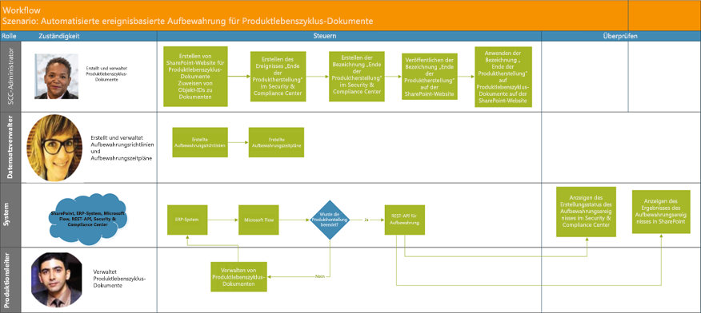

# Automatisieren der ereignisbasierten Aufbewahrung

Die explosionsartige Zunahme von Inhalten in Unternehmen und wie erreicht werden kann, dass diese keine Rolle mehr spielt, ist eine ernste Angelegenheit. Um auch weiterhin den Herausforderungen im Zusammenhang mit der Einhaltung gesetzlicher und geschäftlicher Bestimmungen gerecht zu werden, müssen Unternehmen in der Lage sein, wichtige Informationen aufzubewahren und zu schützen und schnell herauszufinden, was relevant ist. Die Aufbewahrung ausschließlich wichtiger, relevanter Informationen ist der Schlüssel zum Erfolg eines Unternehmens.

Daher können Unternehmen die Aufbewahrungslösungen im Office 365 Security & Compliance Center nutzen. Aufbewahrung kann mithilfe von [Aufbewahrungsbezeichnungen](labels.md) ausgelöst werden. Eine Aufbewahrungsbezeichnung kann als [Grundlage für den Aufbewahrungszeitraum für ein bestimmtes Ereignis](event-driven-retention.md) dienen. In der Regel basiert der Aufbewahrungszeitraum auf einem bekannten Datum, z. B. dem Erstellungsdatum oder dem Datum der letzten Änderung der Inhalte. Unternehmen müssen jedoch auch Inhalte aufgrund des Eintretens eines Ereignisses entfernen, zum Beispiel 7 Jahre nach dem Austritt eines Mitarbeiters aus dem Unternehmen.

Um ein ordnungsgemäßes Entfernen der Inhalte sicherzustellen, ist es zwingend erforderlich zu wissen, wann ein Ereignis eintritt. Da die Inhaltsmenge rasant zunimmt, wird es immer schwieriger, Inhalte zeitnah und ordnungsgemäß aufzubewahren und zu entfernen.

Die ereignisbasierte Aufbewahrung stellt eine Lösung für dieses Problem dar. In diesem Thema wird erläutert, wie Sie Geschäftsprozessabläufe über Ereignisse mithilfe der Microsoft 365-REST-API einrichten können, um die Aufbewahrung zu automatisieren.

## Grundlegendes zur ereignisbasierten Aufbewahrung

Es gibt kleine, mittelständige und Großunternehmen. Die Anzahl der Geschäftsdokumente, Rechtsdokumente, Mitarbeiterdateien, Verträgen und Produktdokumenten, die täglich erstellt und verwaltet werden, nimmt dramatisch zu.

Zum Beispiel werden täglich Dutzende Mitarbeiter eingestellt, und es verlassen auch Dutzende Mitarbeiter die Unternehmen. Die Personalabteilung erstellt, aktualisiert oder löscht weiterhin mitarbeiterbezogene Dokumente gemäß den Geschäftsanforderungen. Dieser Prozess unterliegt verschiedenen Aufbewahrungsrichtlinien, die für das Unternehmen festgelegt sind:

- **Der Aufbewahrungszeitraum für die Inhalte kann ein bekanntes Datum sein,** z. B. das Datum, an dem der Inhalt erstellt, zuletzt geändert oder mit einer Bezeichnung versehen wurde. Beispiel: Dokumente werden möglicherweise sieben Jahre lang ab Erstellung aufbewahrt und anschließend gelöscht.

- **Der Aufbewahrungszeitraum für den Inhalt kann auch ein unbekanntes Datum sein**. Mit Aufbewahrungsbezeichnungen können Sie zum Beispiel als Basis für den Aufbewahrungszeitraum ein bestimmtes Ereignis festlegen, zum Beispiel den Austritt eines Mitarbeiters aus dem Unternehmen.

Mit dem Ereignis wird der Anfang des Aufbewahrungszeitraums ausgelöst. Für alle Inhalte mit einer Bezeichnung, die für diese Art des Ereignisses angewendet wurde, werden die Aufbewahrungsmaßnahmen der Bezeichnung erzwungen. Dies wird auch als ereignisbasierte Aufbewahrung bezeichnet. Weitere Informationen hierzu finden Sie unter [Übersicht über die ereignisgesteuerte Aufbewahrung](event-driven-retention.md).

## Einrichten der ereignisbasierten Aufbewahrung

Dieser Abschnitt beinhaltet die für die Aufbewahrung von Inhalten erforderlichen Schritte.

### Identifizieren von Rollen

Identifizieren Sie die verschiedenen Rollen in einem Unternehmen, die Aufgaben für die Datensatzverwaltung ausführen und für eine effektive und effiziente Aufbewahrung von Geschäftsdokumenten verantwortlich sind.

  | **Persona**| **Rolle**|
  | - | - |
  | Administrators des Security & Compliance Center | Erstellt Ereignistypen für die Aufbewahrung, Aufbewahrungsbezeichnungen und Repositorys für die Aufbewahrung in SharePoint. |
  | Datensatzverwalter                                  | Stellt Details zur Einhaltung von Aufbewahrungsrichtlinien und Aufbewahrungszeitplänen bereit.   |
  | Systemadministrator (Unternehmen)                          | Richtet externe Systeme für die Verwendung mit Microsoft 365 ein, und verwaltet diese.                       |
  | Information-Worker                               | Verwaltet den Lebenszyklus der Geschäftsabläufe (HR, Finanzen, IT usw.).                 |

### Einrichten des Security & Compliance Center
  
1. Der Compliance-Administrator erstellt einen Ereignistyp, zum Beispiel Ende der Beschäftigung, Vertragsablauf oder Ende der Produktherstellung (eine schrittweise Anleitung finden Sie im [Artikel zur ereignisgesteuerten Aufbewahrung](https://docs.microsoft.com/de-DE/office365/securitycompliance/event-driven-retention)).
    
1. Der Compliance-Administrator erstellt eine Aufbewahrungsbezeichnung auf der Grundlage eines Ereignisses und weist die Bezeichnung einem Ereignistyp zu.
    
1. Es gibt die 4 Arten von Auslösern für Aufbewahrungsbezeichnungen:
            
    1. Erstellungsdatum
                
    1. Zuletzt geändert
                
    1. Datum der Bezeichnung (Zeitpunkt, zu dem die Inhalte mit der Bezeichnung versehen wurden)
                
    1. Ereignis-basiert
    
1. Der Compliance-Administrator veröffentlicht die Bezeichnung.

### Einrichten von SharePoint
   
Der Compliance-Administrator geht wie folgt vor, um ein Repository für Datensätze zu erstellen:

1. Er erstellt eine SharePoint-Website.

1. Er führt einen der folgenden Schritte aus:
        
    - Er erstellt eine SharePoint-Bibliothek: er legt eine ereignisbasierte Bezeichnung auf Bibliotheksebene fest. Weitere Informationen finden Sie unter [Anwenden einer Aufbewahrungsbezeichnung auf alle Inhalte in einer Bibliothek, einem Ordner oder einer Dokumentenmappe in SharePoint](labels.md#applying-a-default-retention-label-to-all-content-in-a-sharepoint-library-folder-or-document-set).
          
    - Er richtet einen Dokumentsatz in SharePoint ein. Weitere Informationen finden Sie unter [Einführung in Dokumentenmappen](https://support.office.com/de-DE/article/Introduction-to-Document-Sets-3DBCD93E-0BED-46B7-B1BA-B31DE2BCD234).
      
1. Er weist jeder Dokumentenmappe eine Asset-ID zu (Asset-ID ist ein Produktname oder eine Code, der von dem Unternehmen verwendet wird, eine Mitarbeiternummer kann zum Beispiel eine Asset-ID sein). (Bei Zuweisung einer Asset-ID zu einem Ordner erben alle Elemente in diesem Ordner automatisch die gleiche Asset-ID. Das bedeutet, dass der Aufbewahrungszeitraum für alle Elemente durch dasselbe Ereignis ausgelöst wird.)

## Möglichkeiten zum Auslösen der ereignisbasierten Aufbewahrung

Es gibt zwei Möglichkeiten zum Auslösen der ereignisbasierten Aufbewahrung:

- **Über die Benutzeroberfläche des Security & Compliance Center** Dies ist ein Prozess, der verwendet werden kann, um weniger Inhalte aufzubewahren oder wenn die Aufbewahrung nicht so häufig ausgelöst wird, zum Beispiel monatlich oder jährlich ist. Weitere Informationen zu dieser Methode finden Sie unter [Übersicht über die ereignisgesteuerte Aufbewahrung](event-driven-retention.md). Diese Art der Aufbewahrungsauslösung kann zeitaufwändig und fehleranfällig sein und die Skalierbarkeit beeinträchtigen. Aus diesem Grund kann eine automatisierte, nahtlose Lösung für die Auslösung der Aufbewahrung die Sicherheit und Compliance von Daten verbessern.

- **Mithilfe einer Microsoft 365-REST-API**Dieser Prozess kann verwendet werden, wenn sehr viele Inhalte aufbewahrt werden und/oder die Aufbewahrung häufig ausgelöst wird, zum Beispiel täglich oder wöchentlich. Der Ablauf erkennt, wenn ein Ereignis in Ihrem Branchensystem eintritt, und erstellt automatisch ein zugehöriges Ereignis im Security & Compliance Center. Sie müssen keine Ereignisse in der Benutzeroberfläche manuell erstellen, wenn diese eintreten.

Es gibt zwei Optionen für die Verwendung der REST-API:

- Sie können **Microsoft Flow oder eine ähnliche Anwendung** verwenden, um das Eintreten eines Ereignisses automatisch auszulösen. Microsoft Flow ist ein Orchestrator für die Verbindung zu anderen Systemen. Bei Verwendung von Microsoft Flow ist keine benutzerdefinierte Lösung erforderlich.

- **PowerShell oder ein HTTP-Client zum Aufrufen der REST-API** Sie können PowerShell (Version 6 oder höher) zum Aufrufen der Microsoft 365-REST-API verwenden, um Ereignisse zu erstellen. 

Bei einer REST-API handelt es sich um einen Dienstendpunkt, der Sätze von HTTP-Vorgängen (Methoden) unterstützt, die den Zugriff auf die Ressourcen des Diensts erstellen/abrufen/aktualisieren/löschen. Weitere Informationen finden Sie unter [Komponenten der REST-API-Anforderung/-Antwort](https://docs.microsoft.com/de-DE/rest/api/gettingstarted/#components-of-a-rest-api-requestresponse) . In diesem Fall können mit der Microsoft 365-REST-API über die POST- und GET-Vorgänge (Methoden) Ereignisse erstellt und abgerufen werden.

## Beispielszenarien

Betrachten Sie die folgenden Szenarien.

### Scenario 1: Mitarbeiter tritt aus dem Unternehmen aus 

Ein Unternehmen erstellt und speichert pro Mitarbeiter zahlreiche mitarbeiterbezogene Dokumente. Diese Dokumente werden während der Beschäftigung jedes Mitarbeiters verwaltet und aufbewahrt. Wenn der Mitarbeiter jedoch aus dem Unternehmen austritt oder das Arbeitsverhältnis beendet wird, ist das Unternehmen aufgrund gesetzlicher und geschäftlicher Bestimmungen verpflichtet, die Dokumente dieses Mitarbeiters über einen bestimmten Zeitraum aufzubewahren.

Wenn nun täglich mehrere Mitarbeiter aus dem Unternehmen austreten, muss das Unternehmen die Aufbewahrungszeit von Hunderten, wenn nicht Tausenden von Dokumenten pro Tag auslösen.

Darüber hinaus muss für jeden dieser Mitarbeiter die Aufbewahrungsfrist als Datum des Austritts aus dem Unternehmen + Anzahl der Tage, Monate oder Jahre je nach Art des Mitarbeiterdatensatzes berechnet werden. So kann beispielsweise die Vergütung des Mitarbeiters gegenüber den Leistungsanmeldungen desselben Arbeitnehmers eine unterschiedliche Aufbewahrung erfordern.

Das folgende Diagramm zeigt, wie mehrere Bezeichnungen einem einzelnen Ereignis zugeordnet werden können. Alle Dateien unter der Bezeichnung „Vergütung“ und alle Dateien unter der Bezeichnung „Leistungen an Arbeitnehmer“ sind hier mit einem einzelnen Ereignis verknüpft, und zwar dem Austritt aus dem Unternehmen. Jede dieser verschiedenen Dateien hat unterschiedliche Aufbewahrungszeiten. Wenn also ein Mitarbeiter aus dem Unternehmen austritt, gilt für jede dieser Datei mit einer Bezeichnung eine unterschiedliche Aufbewahrungsdauer.Die Auslösung all dieser unterschiedlichen Aufbewahrungszeiten für jeden Dateityp oder jede Bezeichnung der Mitarbeiter kann eine sehr anspruchsvolle Aufgabe sein. Stellen Sie sich vor, Sie müssen dies für mehrere Mitarbeiter tun.

Ein automatisierter Prozess zum Auslösen dieser unterschiedlicher Aufbewahrungszeiten für mehrere Mitarbeiter ist daher zeitsparend, fehlerfrei und äußerst effizient.

**Konfigurieren der automatisierten ereignisbasierten Aufbewahrung für dieses Szenario:**

  - Der Administrator erstellt in der Dokumentenmappe mehrere Mitarbeiterordner, zum Beispiel Jane Doe, John Smith.

  - Der Administrator fügt zu jedem Mitarbeiterordner mitarbeiterbezogene Dateien hinzu, zum Beispiel Leistungen, Lohn, Vergütung.

  - Der Administrator weist jedem Mitarbeiterordner eine Asset-ID zu. 

  - Der SCC-Administrator

  - meldet sich beim Security & Compliance Center an.

  - SCC-Administrator erstellt mitarbeiterbezogene Ereignistypen wie „Beschäftigungsende“, „Einstellung des Mitarbeiters“ im Security & Compliance Center.

  - Der SCC-Administrator erstellt die Bezeichnung „Mitarbeiteraufbewahrung“ im Security & Compliance Center.

  - Diese Bezeichnung wird veröffentlicht und manuell oder automatisch auf die Dateien des Mitarbeiters in SharePoint angewendet.

  - Ein HR-Managementsystem wie Workday kann regelmäßig mit Microsoft Flow verwendet werden, um die Dateien von Mitarbeitern zu verwalten.

  - Wenn ein Mitarbeiter aus dem Unternehmen ausgetreten ist, löst der Ablauf die Microsoft 365-REST-API für die ereignisbasierte Aufbewahrung aus, die den Aufbewahrungszeitraum für die Dateien eines bestimmten Mitarbeiters startet.

#### Verwenden von Microsoft Flow

Schritt 1: Erstellen eines Ablaufs zum Erstellen einer Ereignisses mithilfe der Microsoft 365-REST-API

##### Erstellen eines Ereignisses

Beispielcode zum Aufrufen der REST-API

<table>
<thead>
<tr class="header">
<th>Methode</th>
<th>POST</th>
<th></th>
</tr>
</thead>
<tbody>
<tr class="odd">
<td>URL</td>
<td>https://ps.compliance.protection.outlook.com/psws/service.svc/ComplianceRetentionEvent)</td>
<td></td>
</tr>
<tr class="even">
<td>Header</td>
<td>Content-Type</td>
<td>application/atom+xml</td>
</tr>
<tr class="odd">
<td>Body</td>
<td>
&lt;?xml version='1.0' encoding='utf-8' standalone='yes'?&gt;

&lt;entry xmlns:d='http://schemas.microsoft.com/ado/2007/08/dataservices'

xmlns:m='http://schemas.microsoft.com/ado/2007/08/dataservices/metadata'

xmlns='http://www.w3.org/2005/Atom'&gt;

&lt;category scheme='http://schemas.microsoft.com/ado/2007/08/dataservices/scheme' term='Exchange.ComplianceRetentionEvent' /&gt;

&lt;updated&gt;9/9/2017 10:50:00 PM&lt;/updated&gt;

&lt;content type='application/xml'&gt;

&lt;m:properties&gt;

&lt;d:Name&gt;Employee Termination &lt;/d:Name&gt;

&lt;d:EventType&gt;99e0ae64-a4b8-40bb-82ed-645895610f56&lt;/d:EventType&gt;

&lt;d:SharePointAssetIdQuery&gt;1234&lt;/d:SharePointAssetIdQuery&gt;

&lt;d:EventDateTime&gt;2018-12-01T00:00:00Z &lt;/d:EventDateTime&gt;

&lt;/m:properties&gt;

&lt;/content&gt;

&lt;/entry&gt;
</td>
<td></td>
</tr>
<tr class="even">
<td>Authentication</td>
<td>Basic</td>
<td></td>
</tr>
<tr class="odd">
<td>Username</td>
<td>“Complianceuser”</td>
<td></td>
</tr>
<tr class="even">
<td>Password</td>
<td>“Compliancepassword”</td>
<td></td>
</tr>
</tbody>
</table>

##### Verfügbare Parameter

<table>
<thead>
<tr class="header">
<th><strong>Parameter</strong></th>
<th><strong>Beschreibung</strong></th>
<th><strong>Hinweise</strong></th>
</tr>
</thead>
<tbody>
<tr class="odd">
<td>&lt;d:Name&gt;&lt;/d:Name&gt;</td>
<td>Geben Sie einen eindeutigen Namen für das Ereignis an.</td>
<td>Der Name darf nachfolgende Leerzeichen und die folgenden Zeichen nicht enthalten: % * \ &amp; &lt; &gt; | # ? , : ;</td>
</tr>
<tr class="even">
<td>&lt;d:EventType&gt;&lt;/d:EventType&gt;</td>
<td>Geben Sie den Namen des Ereignistyps (oder GUID) ein.</td>
<td>Beispiel: „Austritt eines Mitarbeiters“. Der Ereignistyp muss mit einer Aufbewahrungsbezeichnung verknüpft sein.</td>
</tr>
<tr class="odd">
<td>&lt;d:SharePointAssetIdQuery&gt;&lt;/d:SharePointAssetIdQuery&gt;</td>
<td>Geben Sie „ComplianceAssetId:“ und die Mitarbeiter-ID ein.</td>
<td>Beispiel:&quot;ComplianceAssetId:12345&quot;</td>
</tr>
<tr class="even">
<td>&lt;d:EventDateTime&gt;&lt;/d:EventDateTime&gt;</td>
<td>Datum und Uhrzeit des Ereignisses.</td>
<td>
Format: jjjj-MM-ttTHH:mm:ssZ, Beispiel:

2018-12-01T00:00:00Z
</td>
</tr>
</tbody>
</table>

##### Antwortcodes

| **Antwortcode** | **Beschreibung**       |
| ----------------- | --------------------- |
| 302               | Umleiten              |
| 201               | Erstellt               |
| 403               | Autorisierung fehlgeschlagen  |
| 401               | Authentifizierung fehlgeschlagen |

##### Abrufen von Ereignissen basierend auf dem Zeitraum

<table>
<thead>
<tr class="header">
<th>Methode</th>
<th>GET</th>
<th></th>
</tr>
</thead>
<tbody>
<tr class="odd">
<td>URL</td>
<td><ol start="4" type="1">
<li>
https://ps.compliance.protection.outlook.com/psws/service.svc/ComplianceRetentionEvent?BeginDateTime=2019-01-11&amp;EndDateTime=2019-01-16
</li>
</ol></td>
<td></td>
</tr>
<tr class="even">
<td>Header</td>
<td>Content-Type</td>
<td>application/atom+xml</td>
</tr>
<tr class="odd">
<td></td>
<td></td>
<td></td>
</tr>
<tr class="even">
<td>Authentication</td>
<td>Basic</td>
<td></td>
</tr>
<tr class="odd">
<td>Username</td>
<td>“Complianceuser”</td>
<td></td>
</tr>
<tr class="even">
<td>Password</td>
<td>“Compliancepassword”</td>
<td></td>
</tr>
</tbody>
</table>

##### Antwortcodes

| **Antwortcode** | **Beschreibung**                   |
| ----------------- | --------------------------------- |
| 200               | OK, eine Liste der Ereignisse in Atom + XML |
| 404               | Nicht gefunden                         |
| 302               | Umleiten                          |
| 401               | Autorisierung fehlgeschlagen              |
| 403               | Authentifizierung fehlgeschlagen             |

##### Abrufen eines Ereignisses nach ID

| Methode         | GET   |                      |
| -------------- | ------------------------------------------------------------------------------------------------------------------------------------------------------------------------------------------------------------------------------------------------------------------ | -------------------- |
| URL            | [https://ps.compliance.protection.outlook.com/psws/service.svc/ComplianceRetentionEvent(‘174e9a86-74ff-4450-8666-7c11f7730f66’)](https://ps.compliance.protection.outlook.com/psws/service.svc/ComplianceRetentionEvent\('174e9a86-74ff-4450-8666-7c11f7730f66'\)) |                      |
| Header         | Content-Type                                                                                                                                                                                                                                                       | application/atom+xml |
| Authentication | Basic                                                                                                                                                                                                                                                              |                      |
| Username       | “Complianceuser”                                                                                                                                                                                                                                                   |                      |
| Password       | “Compliancepassword”                                                                                                                                                                                                                                               |                      |

##### Antwortcodes

| **Antwortcode** | **Beschreibung**                                      |
| ----------------- | ---------------------------------------------------- |
| 200               | OK, der Antworttext enthält das Ereignis in Atom + XML |
| 404               | Nicht gefunden                                            |
| 302               | Umleiten                                             |
| 401               | Autorisierung fehlgeschlagen                                 |
| 403               | Authentifizierung fehlgeschlagen                                |

##### Abrufen eines Ereignisses anhand des Namens

| Methode         | GET       |                      |
| -------------- | -------------------------------------------------------------------------------------------------------------------------------------------- | -------------------- |
| URL            | <https://ps.compliance.protection.outlook.com/psws/service.svc/ComplianceRetentionEvent('EventByRESTPost-2226bfebcc2841a8968ba71f9516b763')> |                      |
| Header        | Content-Type                                                                                                                                 | application/atom+xml |
| Authentication | Basic                                                                                                                                        |                      |
| Username       | “Complianceuser”                                                                                                                             |                      |
| Password       | “Compliancepassword”                                                                                                                         |                      |

##### Antwortcodes

| **Antwortcode** | **Beschreibung**                                      |
| ----------------- | ---------------------------------------------------- |
| 200               | OK, der Antworttext enthält das Ereignis in Atom + XML |
| 404               | Nicht gefunden                                            |
| 302               | Umleiten                                             |
| 401               | Autorisierung fehlgeschlagen                                 |
| 403               | Authentifizierung fehlgeschlagen                                |

#### Verwenden von PowerShell (Version 6 oder höher) oder eines beliebigen HTTP-Clients

Schritt 1: Stellen Sie eine Verbindung zu PowerShell her.

Schritt 2: Führen Sie das folgende Skript aus.

<table>
<tbody>
<tr class="odd">
<td>
param([string]$baseUri)

$userName = &quot;UserName&quot;

$password = &quot;Password&quot;

$securePassword = ConvertTo-SecureString $password -AsPlainText -Force

$credentials = New-Object System.Management.Automation.PSCredential($userName, $securePassword)

$EventName=&quot;EventByRESTPost-$(([Guid]::NewGuid()).ToString('N'))&quot;

Write-Host &quot;Start to create an event with name: $EventName&quot;

$body = &quot;&lt;?xml version='1.0' encoding='utf-8' standalone='yes'?&gt;

&lt;entry xmlns:d='http://schemas.microsoft.com/ado/2007/08/dataservices'

xmlns:m='http://schemas.microsoft.com/ado/2007/08/dataservices/metadata'

xmlns='http://www.w3.org/2005/Atom'&gt;

&lt;category scheme='http://schemas.microsoft.com/ado/2007/08/dataservices/scheme' term='Exchange.ComplianceRetentionEvent' /&gt;

&lt;updated&gt;7/14/2017 2:03:36 PM&lt;/updated&gt;

&lt;content type='application/xml'&gt;

&lt;m:properties&gt;

&lt;d:Name&gt;$EventName&lt;/d:Name&gt;

&lt;d:EventType&gt;e823b782-9a07-4e30-8091-034fc01f9347&lt;/d:EventType&gt;

&lt;d:SharePointAssetIdQuery&gt;'ComplianceAssetId:123'&lt;/d:SharePointAssetIdQuery&gt;

&lt;/m:properties&gt;

&lt;/content&gt;

&lt;/entry&gt;&quot;

$event = $null

try

{

$event = Invoke-RestMethod -Body $body -Method 'POST' -Uri &quot;$baseUri/ComplianceRetentionEvent&quot; -ContentType &quot;application/atom+xml&quot; -Authentication Basic -Credential $credentials -MaximumRedirection 0

}

catch

{

$response = $_.Exception.Response

if($response.StatusCode -eq &quot;Redirect&quot;)

{

$url = $response.Headers.Location

Write-Host &quot;redirected to $url&quot;

$event = Invoke-RestMethod -Body $body -Method 'POST' -Uri $url -ContentType &quot;application/atom+xml&quot; -Authentication Basic -Credential $credentials -MaximumRedirection 0

}

}

$event | fl *
</td>
</tr>
</tbody>
</table>

#### Überprüfen der Ausgabe bei beiden Optionen

Schritt 1: Wechseln Sie zu Security & Compliance Center.

Schritt 2: Klicken Sie unter Datenkontrolle auf Ereignisse.

Schritt 3: Überprüfen Sie, ob das Ereignis erstellt wurde.

Ebenso können die aufgeführten Optionen zum Automatisieren der ereignisbasierten Aufbewahrung auch für die folgenden Szenarien verwendet werden.

### Szenario 2: Ablauf von Verträgen

Ein Unternehmen kann mehrere Datensätze für einen einzigen Vertrag mit Kunden, Lieferanten und Partnern haben. Diese Dokumente können sich in einer Dokumentenbibliothek wie SharePoint befinden. Das Ende eines Vertrages bestimmt den Beginn des Aufbewahrungszeitraums der Dokumente, die mit dem Vertrag verknüpft sind. Zum Beispiel: Alle Datensätze, die sich auf die Verträge beziehen, müssen fünf Jahre lang ab Ablauf des Vertrages aufbewahrt werden. Das Ereignis, das die fünfjährige Aufbewahrungsdauer auslöst, ist der Ablauf des Vertrages.

Ein CRM-System kann mit Microsoft 365 verwendet werden und die Aufbewahrung für Vertragsdokumente auslösen.

**Konfigurieren der automatisierten ereignisbasierten Aufbewahrung für dieses Szenario:**

  - Der Administrator erstellt eine SharePoint-Bibliothek mit verschiedenen Ordnern für jeden Vertragstyp.

  - Der Administrator fügt Vertragsdateien zu jedem Vertragsordner hinzu, zum Beispiel Lizenzverträge, Entwicklungsverträge.

  - Der Administrator weist jedem Vertragsordner eine Asset-ID zu.

  - Der SCC-Administrator meldet sich beim Security & Compliance Center an.

  - Der SCC-Administrator erstellt im Security & Compliance Center vertragsbezogene Ereignisse wie „Erstellung des Vertrags“, „Ablauf des Vertrags“.

  - Der SCC-Administrator erstellt die Bezeichnung „Ablauf des Vertrags“ im Security & Compliance Center.

  - Diese Bezeichnung wird veröffentlicht und manuell oder automatisch auf die Vertragsdateien in SharePoint angewendet.

  - Ein Vertragsmanagementsystem kann mit Microsoft Flow oder einer ähnlichen Anwendung regelmäßig verwendet werden, um Vertragsdateien zu verwalten.

  - Wenn ein Vertrag abläuft, löst Microsoft Flow die Microsoft 365-REST-API für die ereignisbasierte Aufbewahrung aus, die den Aufbewahrungszeitraum für die Vertragsdateien startet.

### Szenario 3: Ende der Produktherstellung

Ein Produktionsunternehmen, das verschiedene Produktlinien herstellt, erstellt viele Fertigungsspezifikationen und Preisgestaltungsdokumente. Wenn das Produkt nicht mehr hergestellt wird, müssen alle mit diesem Produkt verknüpften Spezifikationen und Dokumente über einen bestimmten Zeitraum ab Ende der Lebensdauer des Produkts aufbewahrt werden.

Ein ERP-System kann mit Microsoft 365 und Microsoft Flow verwendet werden, um die Aufbewahrung auszulösen.

**Konfigurieren der automatisierten ereignisbasierten Aufbewahrung für dieses Szenario:**

  - Der Administrator erstellt in der Dokumentenmappe Produktordner wie Produkt 1, Produkt 2 usw.

  - Der Administrator fügt jedem Produktordner Produktdateien hinzu, zum Beispiel Fertigungsspezifikationen, Produktpreisgestaltung, Produktlizenzierung.

  - Der Administrator weist jedem Produktordner eine Asset-ID zu.

  - Der SCC-Administrator meldet sich beim Security & Compliance Center an.

  - Der SCC-Administrator erstellt im Security & Compliance Center produktbezogene Ereignistypen, zum Beispiel „Beginn der Produktherstellung“, "Ende der Produktherstellung“.

  - Der SCC-Administrator erstellt die Bezeichnung „Ende der Produktherstellung“ im Security & Compliance Center.

  - Diese Bezeichnung wird veröffentlicht und manuell oder automatisch auf die Produktdateien in SharePoint angewendet.

  - ERP-Systeme können mit Microsoft Flow oder ähnlichen Anwendungen regelmäßig verwendet werden, um Produktdateien zu verwalten.

  - Wenn die Herstellung eines Produkts endet, löst Microsoft Flow die Microsoft 365-REST-API für die ereignisbasierte Aufbewahrung aus, die den Aufbewahrungszeitraum für die Produktdateien startet.

## Anhang

### Verwenden der Redirect 302-Antwortergebnisse zum Aufrufen der REST-API

1.  Rufen Sie einen POST-Aufbewahrungsereignisaufruf mithilfe der REST-API-URL auf <https://ps.compliance.protection.outlook.com/psws/service.svc/ComplianceRetentionEvent> (globale Administratorrechte sind erforderlich).

2.  Überprüfen Sie den Antwortcode. Wenn dies 302 ist, rufen Sie die Umleitungs-URL aus der Location-Eigenschaft des Antwortheaders ab.

3.  Rufen Sie den POST-Aufbewahrungsereignisaufruf erneut mithilfe der Umleitungs-URL auf.

## Mitwirkende

Dieses Thema wurde von überprüft von:

Antonio Maio MVP für Microsoft Office-Apps und -Dienste  Antonio.Maio@Protiviti.com
