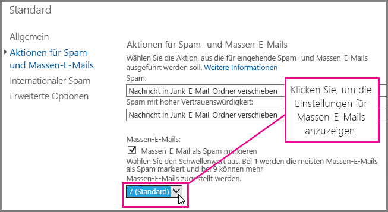
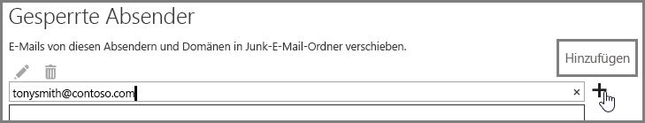

# <a name="block-email-spam-with-the-office-365-spam-filter-to-prevent-false-negative-issues"></a>Blockieren von Spam-E-Mail mit dem Office 365-Spamfilter zur Vermeidung von Problemen mit falsch negativen Nachrichten

Exchange Online Protection (EOP) ist ein cloudbasierter E-Mail-Filterdienst, der Ihnen hilft, Ihre Organisation vor Spam und Schadsoftware zu schützen. Wenn Sie über Postfächer in Office 365 verfügen, werden diese bereits standardmäßig mit EOP geschützt. 
  
Durch die Anpassung Ihres Office 365-Spamfilters können Sie dazu beitragen, dass Spam- und Junk-E-Mails blockiert werden. Dadurch wird das Problem mit falsch negativen Nachrichten vermieden, bei dem Spam-E-Mail in den Posteingang eines Benutzers gelangt. Führen Sie als Administrator für Exchange Online oder Exchange Online Protection (EOP) die folgenden Schritte aus, um den Spamfilter in Office 365 anzupassen und um zu verhindern, dass Spam in die Postfächer Ihrer Benutzer gelangt.
  
## <a name="customize-the-office-365-anti-spam-filter-with-these-settings"></a>Anpassen des Office 365-Spamfilters mit diesen Einstellungen

Ein Administrator kann mehrere Office 365-Spamfiltereinstellungen verwenden, um zu verhindern, dass Spam-E-Mails an den Posteingang eines Benutzers gesendet werden. Der Office 365-Spamfilter ist besser in der Lage, Spam-E-Mail zu blockieren und falsch negative Nachrichten zu verhindern, wenn Sie die hier aufgeführten Optionen verwenden. In diesem Zusammenhang bezieht sich falsch negativ auf Spam-E-Mails oder Junk-Nachrichten, die an den Posteingang eines Benutzers gesendet werden.
  
### <a name="block-ip-addresses-with-a-connection-filter"></a>Blockieren von IP-Adressen mit einem Verbindungsfilter

Passen Sie Ihren Office 365-Spamfilter an, indem Sie die Absender-IP-Adresse zur Liste blockierter IP-Adressen für den Verbindungsfilter hinzufügen:
  
1. Rufen Sie die Kopfzeilen der Nachrichten ab, die Sie in Ihrem E-Mail-Client wie Outlook oder Outlook Web App blockieren möchten, wie in [Nachrichtenkopfanalyse](https://go.microsoft.com/fwlink/p/?LinkId=306583) beschrieben wird.
    
2. Suchen Sie in der [Nachrichtenkopfanalyse](https://testconnectivity.microsoft.com/?tabid=mha) oder manuell nach der IP-Adresse, die auf das CIP-Tag in der Kopfzeile X-Forefront-Antispam-Report folgt. 
    
3. Fügen Sie die IP-Adresse der IP-Sperrliste hinzu, indem Sie die Schritte unter „Bearbeiten der Standardrichtlinie für Verbindungsfilter mithilfe der Exchange-Verwaltungskonsole“ in [Konfigurieren der Verbindungsfilterrichtlinie](https://technet.microsoft.com/de-DE/library/jj200718%28v=exchg.150%29.aspx) ausführen.
    
### <a name="block-bulk-mail-with-transport-rules-or-the-spam-filter"></a>Blockieren von Massensendungen mit Transportregeln oder dem Spamfilter

Handelt es sich bei Spam in erster Linie um Massensendungen, z. B. Newsletter oder Werbeaktionen? Sie können den Spamfilter in Office 365 anpassen, wenn Sie [Transportregeln verwenden, um Massen-E-Mail-Nachrichten aggressiv zu filtern](https://technet.microsoft.com/de-DE/library/dn720438%28v=exchg.150%29.aspx) oder die Einstellung **Massensendungen** in den [erweiterten Spamfilteroptionen](https://technet.microsoft.com/de-DE/library/jj200750%28v=exchg.150%29.aspx) Ihres Spamfilters aktivieren. Klicken Sie zunächst im Exchange Admin Center auf **Schutz** \> **Inhaltsfilter**, und doppelklicken Sie dann auf die Filterrichtlinie, die Sie anpassen möchten. Klicken Sie auf die Option für Spam- und Massensendungsaktionen****, um die Einstellungen, wie hier gezeigt, anzupassen. 
  

  
### <a name="block-email-spam-using-spam-filter-block-lists"></a>Blockieren von Spam-E-Mails mithilfe von Spamfilter-Sperrlisten

[Konfigurieren Sie Ihre Spamfilterrichtlinien](https://technet.microsoft.com/de-DE/library/jj200684%28v=exchg.150%29.aspx) so, dass Sie im Spamfilter die Adresse des Absenders der Absender-Sperrliste bzw. die Domäne der Liste der gesperrten Domänen hinzufügen. E-Mails von einem Absender oder einer Domäne auf einer Spamfilter-Sperrliste werden als Spam gekennzeichnet. 
  
### <a name="advanced-spam-filtering-options"></a>Erweiterte Spamfilterungsoptionen

[Konfigurieren Sie Ihre Spamfilterrichtlinien](https://technet.microsoft.com/de-DE/library/jj200684%28v=exchg.150%29.aspx), und aktivieren Sie zusätzliche [erweiterte Spamfilterungsoptionen](https://technet.microsoft.com/de-DE/library/jj200750%28v=exchg.150%29.aspx).
  
Allgemeine Antispameinstellungen, die für die gesamte Organisation gelten, finden Sie unter [Verwenden einer Liste sicherer Adressen oder anderer Techniken, um zu verhindern, dass falsch positive E-Mails als Spam markiert werden](prevent-email-from-being-marked-as-spam-0.md). Dies ist hilfreich, wenn Sie über die Steuerung auf Administratorebene verfügen und Sie falsch positive Ergebnisse vermeiden möchten.
  
## <a name="email-users-can-also-help-ensure-that-false-negative-and-email-spam-is-blocked-with-office-365-spam-filter"></a>E-Mail-Benutzer können außerdem dazu beitragen, dass falsch negative und Spam-E-Mails mit dem Office 365-Spamfilter blockiert werden

Sie unterstützen Ihre Office 365-Antispammaßnahmen zur Vermeidung falsch negativer und Junk-E-Mails, wenn Sie Ihre Benutzer auffordern, die Spam-Absenderadresse ihrer Liste der blockierten Absender in [Outlook](https://go.microsoft.com/fwlink/p/?LinkId=270065) oder [Outlook Web App](https://go.microsoft.com/fwlink/p/?LinkId=294862) hinzuzufügen. Klicken Sie zunächst in Outlook Web App auf **Einstellungen** \> **Optionen** \> **Blockieren oder zulassen**, und fügen Sie dann die Adresse der Liste **Blockierte Absender** hinzu, wie hier gezeigt. 
  

  
> [!NOTE]
> Weitere Informationen zu Listen mit sicheren Absendern finden Sie unter [FAQ zu Listen sicherer Absender und blockierter Absender](https://technet.microsoft.com/de-DE/library/dn133608%28v=exchg.150%29.aspx). 
  
Die obigen Absätze in diesem Unterabschnitt gelten nur für Kunden, die EOP als Dienst zum Schutz von lokalen E-Mail-Systemen oder im Rahmen einer hybriden E-Mail-Bereitstellung verwenden. Weitere Informationen zu EOP finden Sie auf der [Exchange Online Protection-Homepage](https://products.office.com/de-DE/exchange/exchange-email-security-spam-protection).
  
## <a name="eop-only-customers-set-up-the-office-365-spam-filter-to-block-email-spam"></a>Kunden, die nur EOP verwenden: Einrichten des Office 365-Spamfilters zum Blockieren von Spam-E-Mail

Nur für Kunden, die nur EOP verwenden, und mit lokalen Postfächern: Wenn Sie einen Spamfilter für die Standardaktion zum Verschieben einer Nachricht in den Junk-E-Mail-Ordner einrichten, führen Sie die erforderlichen Schritte in „Sicherstellen, dass Spam an den Junk-E-Mail-Ordner jedes Benutzers weitergeleitet wird“ aus. Wir haben versucht, Ihnen dies leicht zu machen, indem wir für die Befehle der Exchange-Verwaltungsshell einen separaten Artikel erstellt haben. Außerdem erhalten Sie einen Link zu allgemeineren Informationen zum Einstieg in die Shell.
  
Wenn Sie Benutzereinstellungen über die Verzeichnissynchronisierung mit dem Dienst synchronisieren, um sicherzustellen, dass Ihre blockierten Absender beachtet werden, hilft Ihnen dies, falsch negative Spam-E-Mails zu vermeiden. Weitere Informationen finden Sie unter „Verwalten von E-Mail-Benutzern durch Verzeichnissynchronisierung" im Artikel „Verwalten von E-Mail-Benutzern in EOP“.
  
## <a name="eop-only-customers-who-are-not-using-directory-synchronization"></a>Kunden, die nur EOP verwenden, und die keine Verzeichnissynchronisierung verwenden

Der EOP-Dienst ist darauf ausgelegt, die sicheren und blockierten Absender des Benutzers zu berücksichtigen, wenn die Informationen mit dem Dienst geteilt wurden. Wenn Sie ein EOP-Kunde sind und Outlook verwenden, aber keine Verzeichnissynchronisierung konfiguriert haben, um Ihre Benutzer mit Office 365 zu synchronisieren, können Sie dennoch mithilfe blockierter Absender verhindern, dass Nachrichten an den Posteingang Ihrer Benutzer übermittelt werden. In folgenden Fällen müssen Sie jedoch möglicherweise einige Exchange-Nachrichtenflussregeln einrichten:
  
- Wenn eine Nachricht den regulären Spamfilter durch EOP durchläuft und dann an einen lokalen Exchange-Server übermittelt wird und EOP die Spambeurteilung SCL 1-4 (kein Spam) zuweist, dann setzt die Liste lokaler blockierter Absender Ihrer Benutzer die EOP-Spam-Filterbeurteilung außer Kraft und sendet sie an den Junk-E-Mail-Ordner.
    
- Wenn einer Nachricht durch eine Exchange-Nachrichtenflussregel, oder weil sich die IP-Adresse oder Domäne in Ihrer Positivliste befindet, in EOP SCL-1 zugewiesen wird, wird das SCL mit Connectors an den lokalen Exchange-Server weitergegeben. In diesem Fall wird die Liste der blockierten Absender Ihres Benutzers nicht berücksichtigt. Wenn Sie dies ändern möchten, können Sie eine lokale Nachrichtenflussregel erstellen, die den SCL-Wert auf 0 festlegt. Dies bewirkt, dass Outlook die Liste der lokalen blockierten Absender Ihres Benutzers berücksichtigt.
    
**Einrichten einer Nachrichtenflussregel, damit Nachrichten mithilfe der Liste der blockierten Absender nicht mehr an den Posteingang Ihrer Benutzer übermittelt werden**
  
1. Öffnen Sie auf die Exchange-Verwaltungsshell auf Ihrem lokalen Server. Wie Sie die Shell in Ihrer lokalen Exchange-Organisation öffnen, erfahren Sie unter [Öffnen der Exchange-Verwaltungsshell](https://technet.microsoft.com/library/dd638134%28v=exchg.160%29.aspx).
    
2. Führen Sie den folgenden Befehl aus, um bei der Inhaltsfilterung erkannte Spamnachrichten in den Junk-E-Mail-Ordner weiterzuleiten, um das SCL bei jeder Nachricht zu aktualisieren, die mit SCL -1 gekennzeichnet war:
    
  ```
  New-TransportRule "NameForRule" -HeaderContainsMessageHeader "X-Forefront-Antispam-Report" -HeaderContainsWords "SCL:-1" -SetSCL 0
  ```

    Da der SCL-Wert auf dem lokalen Exchange-Server 0 ist, werden Nicht-Spam-Nachrichten an die Posteingänge der Benutzer übermittelt, aber es ist dennoch möglich, dass die Liste lokaler blockierter Absender der Benutzer diese an den Junk-E-Mail-Ordner sendet. Wenn Sie Spam-Quarantäne in EOP verwenden, ist es weiterhin möglich, dass Absender, die sich auf der Liste sicherer Absender Ihrer Benutzer befinden, als Spam identifiziert und in Quarantäne gesetzt werden. Wenn Sie allerdings den Junk-E-Mail-Ordner in Ihrem lokalen Postfach verwenden, werden Nachrichten sicherer Absender an den Posteingang übermittelt.

> [!WARNING]
> Wenn Sie eine Nachrichtenflussregel verwenden, um den SCL-Wert in 0 (oder einen anderen Wert als -1) zu ändern, werden alle Outlook-Junk-E-Mail-Optionen auf die Nachricht angewendet. Dies bedeutet, dass Listen mit gesperrten und sicheren Absendern berücksichtigt werden, aber auch, dass Nachrichten von Adressen, die sich auf der Liste blockierter oder sicherer Absender befinden, durch die clientseitige Junk-E-Mail-Filter-Verarbeitung möglicherweise als Junk markiert werden. Wenn Outlook die blockierten und sicheren Listen verarbeiten soll, aber nicht den clientseitigen Junk-E-Mail-Filter verwenden soll, müssen Sie in den Outlook Junk-E-Mail-Optionen die Option auf „Keine automatische Filterung“ festlegen. „Keine automatische Filterung“ ist die Standardoption in den neuesten Versionen von Outlook, aber Sie sollten überprüfen, ob diese Einstellung aktiviert ist, um sicherzustellen, dass auf die Nachrichten nicht der clientseitige Junk-E-Mail-Filter angewendet wird. Als Administrator können Sie die Deaktivierung der Junk-E-Mail-Filterung in Outlook erzwingen, indem Sie die Anleitung in [Outlook: Richtlinieneinstellung zur Deaktivierung der Benutzeroberfläche und des Filtermechanismus für Junk-E-Mails](https://support.microsoft.com/de-DE/kb/2180568) befolgen.
  
## <a name="see-also"></a>Siehe auch
<a name="BKMK_please_comment"> </a>

[Antispamschutz für Office 365-E-Mails](anti-spam-protection.md)
  
[Verwenden einer Liste sicherer IP-Adressen oder anderer Techniken, um zu verhindern, dass falsch positive E-Mails als Spam markiert werden](prevent-email-from-being-marked-as-spam-0.md)
  

