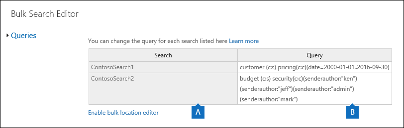
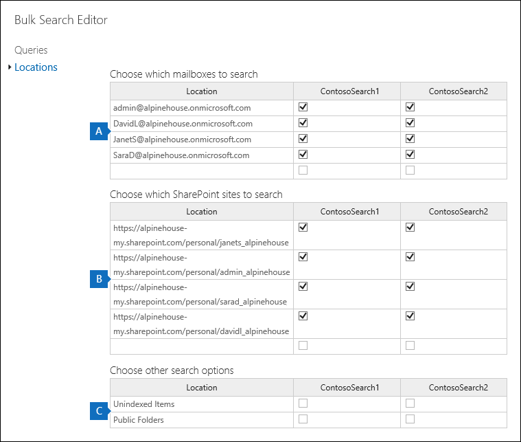

# Massenbearbeitung von Inhalts suchenBulk edit Content Searches

Sie können den Massen Such-Editor im Inhaltssuche-Tool verwenden, um mehrere Suchvorgänge gleichzeitig zu bearbeiten.You can use the Bulk Search Editor in the Content Search tool to edit multiple searches at the same time. Mit diesem Tool können Sie die Abfrage-und inhaltsspeicherorte für eine oder mehrere Suchvorgänge schnell ändern.Using this tool lets you quickly change the query and content locations for one or more searches. Dann können Sie die Suchvorgänge erneut ausführen und neue geschätzte Suchergebnisse für die überarbeiteten suchen abrufen.Then you can re-run the searches and get new estimated search results for the revised searches. Der Editor ermöglicht auch das Kopieren und Einfügen von Abfragen und Inhaltsspeicherorten aus einer Microsoft Excel-Datei oder-Textdatei.The editor also lets you copy and paste queries and content locations from a Microsoft Excel file or text file. Sie können das Suchstatistik Tool verwenden, um die Statistiken einer oder mehrerer Suchvorgänge anzuzeigen, die Statistiken in eine CSV-Datei zu exportieren, in der Sie die Abfragen und inhaltsspeicherorte in Excel bearbeiten können.This means you can use the Search Statistics tool to view the statistics of one or more searches, export the statistics to a CSV file where you can edit the queries and content locations in Excel. Anschließend verwenden Sie den Massen Such-Editor, um die überarbeiteten Abfragen und inhaltsspeicherorte zu den Suchvorgängen hinzuzufügen.Then you use the Bulk Search Editor to add the revised queries and content locations to the searches. Nachdem Sie eine oder mehrere Suchvorgänge überarbeitet haben, können Sie Sie neu starten und neue geschätzte Suchergebnisse erhalten.After you've revised one or more searches, you can re-start them and get new estimated search results.
  
Weitere Informationen zur Verwendung des Suchstatistik Tools finden Sie unter [View Keyword Statistics for Content Search results](view-keyword-statistics-for-content-search.md).For more information about using the Search Statistics tool, see [View keyword statistics for Content Search results](view-keyword-statistics-for-content-search.md).
  
## Verwenden des Massen Such-Editors zum Ändern von AbfragenUse the Bulk Search Editor to change queries

1. Wechseln Sie [https://protection.office.com](https://protection.office.com)zu, und klicken Sie dann auf **Inhaltssuche** **Durchsuchen** \> .Go to [https://protection.office.com](https://protection.office.com), and then click **Search** \> **Content search**.
    
2. Wählen Sie in der Liste der Suchvorgänge eine oder mehrere Suchvorgänge aus, \*\*\*\* Editor-Schaltfläche für Massensuche.In the list of searches, select one or more searches, and then click **Bulk Search Editor** .
    
    
  
    Die folgenden Informationen werden auf der Seite **Abfragen** des Massen Such-Editors angezeigt.The following information is displayed on the **Queries** page of the Bulk Search Editor. 
    
    
  
    a.a. In der Spalte **Suchen** wird der Name der Inhaltssuche angezeigt.The **Search** column displays the name of the Content Search. Wie bereits erwähnt, können Sie die Abfrage für mehrere Suchvorgänge bearbeiten.As previously stated, you can edit the query for multiple searches. 
    
    b.b. In der Spalte **Abfrage** wird die Abfrage für die in der Spalte **Suchen** aufgeführte Inhaltssuche angezeigt.The **Query** column displays the query for the Content Search listed in the **Search** column. Wenn die Abfrage mithilfe des Schlüsselwortlisten-Features erstellt wurde, werden die Schlüsselwörter durch den Text `(c:s)`\* \* getrennt \*\*. Dies gibt an, dass die Schlüsselwörter durch den **or** -Operator verbunden werden. Wenn die Abfragebedingungen enthält, werden außerdem die Schlüsselwörter und die Bedingungen durch den Text \* \* `(c:c)`getrennt \*\*.If the query was created using the keyword list feature, the keywords are separated by the text \*\* `(c:s)`**. This indicates that the keywords are connected by the **OR** operator. Additionally, if the query includes conditions, the keywords and the conditions are separated by the text \*\* `(c:c)`**. Dies gibt an, dass die Schlüsselwörter (oder Schlüsselwort Phasen) mit den Bedingungen des **and-** Operators verbunden sind.This indicates that the keywords (or keyword phases) are connected to the conditions by the **AND** operator. Beispiel: im vorherigen Screenshot der for Search-ContosoSearch1 die KQL-Abfrage, die äquivalent zu `customer (c:s) pricing(c:c)(date=2000-01-01..2016-09-30)` wäre. `(customer OR pricing) AND (date=2002-01-01..2016-09-30)`For example, in the previous screenshot the for search ContosoSearch1, the KQL query that is equivalent to  `customer (c:s) pricing(c:c)(date=2000-01-01..2016-09-30)` would be  `(customer OR pricing) AND (date=2002-01-01..2016-09-30)`.
    
3. Klicken Sie zum Bearbeiten einer Abfrage in die Zelle der Abfrage, die Sie ändern möchten, und führen Sie eine der folgenden Aktionen aus.To edit a query, click in the cell of the query that you want to change and doing one of the following things. Beachten Sie, dass die Zelle von einem blauen Feld umgeben wird, wenn Sie darauf klicken.Note that the cell is bordered by a blue box when you click it.
    
   - Geben Sie die neue Abfrage in die Zelle ein.Type the new query in the cell. Beachten Sie, dass ein Teil der Abfrage nicht bearbeitet werden kann.Note that you can't edit a portion of the query. Sie müssen die gesamte Abfrage eingeben.You have to type the entire query.
    
      OderOr
    
    - Fügt eine neue Abfrage in die Zelle ein.Paste a new query in the cell. Dabei wird davon ausgegangen, dass Sie den Abfragetext aus einer Datei wie eine Textdatei oder eine Excel-Datei kopiert haben.This assumes that you've copied the query text from a file, such as a text file or an Excel file.
    
4. Nachdem Sie auf der Seite **Abfragen** eine oder mehrere Abfragen bearbeitet haben, klicken Sie auf **Speichern**.After you've edited one or more queries on the **Queries** page, click **Save**.
    
    Die überarbeitete Abfrage wird in der Spalte **Abfrage** für die ausgewählte Suche angezeigt.The revised query is displayed in the **Query** column for the selected search. 
    
5. Klicken Sie auf **Beenden** , um den Massen Such Editor zu beenden.Click **Close** to close the Bulk Search Editor. 
    
6. Wählen Sie auf der Seite **Inhaltssuche** die Suche aus, die Sie bearbeitet haben, und klicken Sie auf Suche **starten** , um die Suche mithilfe der überarbeiteten Abfrage neu zu starten.On the **Content search** page, select the search that you edited, and click **Start** search to restart the search using the revised query. 
    
Im folgenden finden Sie einige Tipps zum Bearbeiten von Abfragen mithilfe des Massen Such-Editors:Here are some tips for editing queries using the Bulk Search Editor:
  
- Kopieren Sie die vorhandene Abfrage (mithilfe von **STRG + C** ) in eine Textdatei.Copy the existing query (by using **Ctrl C** ) to a text file. Bearbeiten Sie die Abfrage in der Textdatei, kopieren Sie die überarbeitete Abfrage, und fügen Sie Sie (mit **STRG V** ) wieder in die Zelle auf der Seite **Abfragen** ein.Edit the query in the text file, and then copy the revised query and paste it (using **Ctrl V** ) back into the cell on the **Queries** page. 
    
- Sie können auch Abfragen aus anderen Anwendungen (wie Microsoft Word oder Microsoft Excel) kopieren.You can also copy queries from other applications (such as Microsoft Word or Microsoft Excel). Beachten Sie jedoch, dass Sie möglicherweise versehentlich nicht unterstützte Zeichen zu einer Abfrage mithilfe des Massen Such-Editors hinzufügen.However, be aware that you might inadvertently add unsupported characters to a query using the Bulk Search Editor. Die beste Möglichkeit, nicht unterstützte Zeichen zu verhindern, ist das Eingeben der Abfrage in eine Zelle auf der Seite **Abfragen** .The best way to prevent unsupported characters is to just type the query in a cell on the **Queries** page. Alternativ können Sie eine Abfrage aus Word oder Excel kopieren und in einem Nur-Text-Editor, z. B. Microsoft Editor, in eine Datei einfügen.Alternatively, you can copy a query from Word or Excel and then paste it to file in a plain text editor, such as Microsoft Notepad. Speichern Sie dann die Textdatei, und wählen Sie **ANSI** in der Dropdownliste **Codierung** aus.Then save the text file and select **ANSI** in the **Encoding** drop-down list. Dadurch werden alle Formatierungen und nicht unterstützten Zeichen entfernt.This will remove any formatting and unsupported characters. Anschließend können Sie die Abfrage aus der Textdatei kopieren und in die Seite **Abfragen** einfügen.Then you can copy and paste the query from the text file to the **Queries** page. 
    
  
## Verwenden des Massen Such-Editors zum Ändern von InhaltsspeicherortenUse the Bulk Search Editor to change content locations

1. Klicken Sie im Massen Such-Editor für eine oder mehrere ausgewählte Suchvorgänge auf **Massen Speicherort-Editor aktivieren**, und klicken Sie dann auf den Link **Standorte** , der auf der Seite angezeigt wird.In the Bulk Search Editor for one or more selected searches, click **Enable bulk location editor**, and then click the **Locations** link that is displayed on the page. 
    
    Die folgenden Informationen werden auf der Seite **Speicherorte** des Massen Such-Editors angezeigt.The following information is displayed on the **Locations** page of the Bulk Search Editor. 
    
    
  
    a.a. **Zu durchsuchende Postfächer** In diesem Abschnitt wird eine Spalte für jede ausgewählte Inhaltssuche und Zeile für jedes Postfach angezeigt, das in der Suche enthalten ist.**Mailboxes to search**This section displays a column for each selected Content Search, and row for each mailbox that's included in the search. Ein Häkchen gibt an, dass das Postfach in der Suche enthalten ist.A checkmark indicates that the mailbox is included in the search. Sie können einer Suche zusätzliche Postfächer hinzufügen, indem Sie die e-Mail-Adresse des Postfachs in eine leere Zeile eingeben und dann auf das Kontrollkästchen für die Inhaltssuche klicken, der Sie Sie hinzufügen möchten.You can add additional mailboxes to a search by typing the email address of the mailbox in a blank row and then clicking the checkbox for the Content Search that you want to add it to. Sie können auch ein Postfach aus einer Suche entfernen, indem Sie das Kontrollkästchen deaktivieren.Or you can remove a mailbox from a search by clearing the checkbox.
    
    b.b. **Zu durchsuchende SharePoint-Websites** In diesem Abschnitt wird für jede SharePoint-und OneDrive-Website, die in jeder ausgewählten Inhaltssuche enthalten ist, eine Zeile angezeigt.**SharePoint sites to search**This section displays a row for each SharePoint and OneDrive site that included in each selected Content Search. Ein Häkchen gibt an, dass die Website in der Suche enthalten ist.A checkmark indicates that the site is included in the search. Sie können einer Suche zusätzliche Websites hinzufügen, indem Sie die URL für die Website in eine leere Zeile eingeben und dann auf das Kontrollkästchen für die Inhaltssuche klicken, der Sie Sie hinzufügen möchten.You can add additional sites to a search by typing the URL for the site in a blank row and then and clicking the checkbox for the Content Search that you want to add it to. Sie können auch eine Website aus einer Suche entfernen, indem Sie das Kontrollkästchen deaktivieren.Or you can remove a site from a search by clearing the checkbox.
    
    c.c. **Weitere Suchoptionen** Dieser Abschnitt gibt an, ob nicht indizierte Elemente und öffentliche Ordner in die Suche einbezogen werden.**Other search options**This section indicates whether unindexed items and public folders are included in the search. Um diese einzuschließen, stellen Sie sicher, dass das Kontrollkästchen aktiviert ist.To include these, make sure the checkbox is selected. Deaktivieren Sie das Kontrollkästchen, um Sie zu entfernen.To remove them, clear the checkbox.
    
2. Nachdem Sie einen oder mehrere Abschnitte auf der Seite **Speicherorte** bearbeitet haben, klicken Sie auf **Speichern**.After you've edited one or more of the sections on the **Locations** page, click **Save**.
    
    Die überarbeiteten inhaltsspeicherorte werden im entsprechenden Abschnitt für die ausgewählten Suchvorgänge angezeigt.The revised content locations are displayed in the appropriate section for the selected searches.
    
3. Klicken Sie auf **Beenden** , um den Massen Such Editor zu beenden.Click **Close** to close the Bulk Search Editor. 
    
4. Wählen Sie auf der Seite **Inhaltssuche** die Suche aus, die Sie bearbeitet haben, und klicken Sie auf Suche **starten** , um die Suche mithilfe der überarbeiteten inhaltsspeicherorte neu zu starten.On the **Content search** page, select the search that you edited, and click **Start** search to restart the search using the revised content locations. 
    
Im folgenden finden Sie einige Tipps zum Bearbeiten von Inhaltsspeicherorten mithilfe des Massen Such-Editors:Here are some tips for editing content locations using the Bulk Search Editor:
  
- Sie können die Inhaltssuche bearbeiten, um alle Postfächer oder Websites in der Organisation zu durchsuchen, indem Sie im Abschnitt **Postfächer zu durchsuchende** oder zu durchsuchende **SharePoint-Websites** **alle** in eine leere Zeile eingeben und dann auf das Kontrollkästchen klicken.You can edit Content Searches to search all mailboxes or sites in the organization by typing **All** in a blank row in the **Mailboxes to search** or **SharePoint sites to search** section and then clicking the checkbox. 
    
- Sie können einer oder mehreren Suchvorgängen mehrere inhaltsspeicherorte hinzufügen, indem Sie mehrere Zeilen aus einer Textdatei oder einer Excel-Datei kopieren und Sie dann in einen Abschnitt auf der Seite **Speicherorte** einfügen.You can add multiple content locations to one or more searches by copying multiple rows from a text file or an Excel file and then pasting them to a section on the **Locations** page. Nachdem Sie neue Speicherorte hinzugefügt haben, müssen Sie das Kontrollkästchen für jede Suche aktivieren, der Sie den Speicherort hinzufügen möchten.After you add new locations, be sure to select the checkbox for each search that you want add the location to. 
    
    > [!TIP]
    > Um eine Liste der e-Mail-Adressen für alle Benutzer in Ihrer Organisation zu generieren, führen Sie den PowerShell-Befehl in Schritt 2 in [use Content Search aus, um das Postfach und die OneDrive for Business-Website nach einer Liste von Benutzern zu durchsuchen](search-the-mailbox-and-onedrive-for-business-for-a-list-of-users.md#step2).To generate a list of email addresses for all the users in your organization, run the PowerShell command in Step 2 in [Use Content Search to search the mailbox and OneDrive for Business site for a list of users](search-the-mailbox-and-onedrive-for-business-for-a-list-of-users.md#step2). Oder verwenden Sie das Skript in [Erstellen einer Liste aller OneDrive-Speicherorte in Ihrer Organisation](https://support.office.com/article/8e200cb2-c768-49cb-88ec-53493e8ad80a) , um eine Liste aller OneDrive für Business-Websites in Ihrer Organisation zu generieren.Or use the script in [Create a list of all OneDrive locations in your organization](https://support.office.com/article/8e200cb2-c768-49cb-88ec-53493e8ad80a) to generate a list of all OneDrive for Business sites in your organization. Beachten Sie, dass Sie die URL für Ihre organization's mysite-Domäne (beispielsweise https://contoso-my.sharepoint.com) an die OneDrive for Business-Websites, die durch das Skript erstellt werden) anfügen müssen.Note that you'll have to append the URL for your's organization's MySite domain (for example, https://contoso-my.sharepoint.com) to the OneDrive for Business sites that's created by the script. Nachdem Sie eine Liste von e-Mail-Adressen oder OneDrive für Business-Websites haben, können Sie diese kopieren und auf der Seite " **Standorte** " im Massen Such-Editor einfügen.After you have list of email addresses or OneDrive for Business sites, you can copy and paste them to the **Locations** page in the Bulk Search Editor. 
  
- Nachdem Sie auf **Speichern** klicken, um die Änderungen im Massen Such Editor zu speichern, wird die e-Mail-Adresse für Postfächer, die Sie einer Suche hinzugefügt haben, überprüft.After you click **Save** to save changes in Bulk Search Editor, the email address for mailboxes that you added to a search will be validated. Wenn die e-Mail-Adresse nicht vorhanden ist, wird eine Fehlermeldung angezeigt, die besagt, dass das Postfach nicht gefunden werden kann.If the email address doesn't exist, an error message is displayed saying the mailbox can't be located. Beachten Sie, dass URLs für Websites nicht validiert werden.Note that URLs for sites aren't validated. 
  

