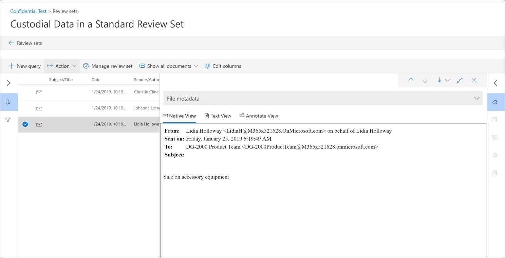

# Überprüfen von Unterhaltungen in Advanced eDiscovery 

Instant Messaging ist eine bequeme Möglichkeit, Fragen zu stellen, Ideen auszutauschen oder schnell über große Zielgruppen hinweg zu kommunizieren. Als Instant Messaging-Plattformen wie Microsoft Teams werden Kernkompetenzen für die Zusammenarbeit in Unternehmen, müssen Organisationen bewerten, wie Ihre eDiscovery-Workflow diese neuen Formen der Kommunikation und Zusammenarbeit behandelt. 

Das Feature zur Wiederherstellung von Unterhaltungen in Advanced eDiscovery dient dazu, kontextbezogene Inhalte zu identifizieren und unterschiedliche Unterhaltungs Ansichten zu erstellen. Mit dieser Funktion können Sie vollständige Sofortnachrichtenunterhaltungen (auch als *Thread Unterhaltung*bezeichnet) effizient und schnell überprüfen, die in Plattformen wie Microsoft Teams generiert werden.

Bei der Wiederherstellung von Unterhaltungen können Sie integrierte Funktionen verwenden, um threadbezogene Unterhaltungen neu zu erstellen, zu überprüfen und zu exportieren. Verwenden Sie die erweiterte eDiscovery Conversation Reconstruction für:

- Beibehalten eindeutiger Metadaten auf Nachrichtenebene für alle Nachrichten in einer Unterhaltung.

- Sammeln Sie kontextbezogene Nachrichten um Ihre Suchergebnisse.

- Überprüfen, kommentieren und redact-Thread Unterhaltungen.

- Exportieren einzelner Nachrichten oder Thread Unterhaltungen

## Terminologie

Hier sind einige Definitionen, die Sie beim Einstieg in die Wiederherstellung von Unterhaltungen unterstützen.

- **Nachrichten:** Stellt die kleinste Einheit einer Unterhaltung dar. Nachrichten können in Größe, Struktur und Metadaten variieren. 

- Unter **Haltung:** Stellt eine Gruppierung von einer oder mehreren Nachrichten dar. In verschiedenen Anwendungen können Unterhaltungen auf verschiedene Weise dargestellt werden. In einigen Anwendungen gibt es eine explizite Aktion, die sich aus der Antwort auf eine vorhandene Nachricht ergibt. Unterhaltungen werden explizit als Ergebnis dieser Benutzeraktion gebildet. Hier ist beispielsweise ein Screenshot einer Kanal Unterhaltung in Microsoft Teams.

   

   In anderen apps (wie 1xN Chatnachrichten in Microsoft Teams) gibt es keine formelle Antwort Kette, und stattdessen werden Nachrichten in einem einzelnen Thread als "Flat River of messages" angezeigt. In diesen Typen apps werden Unterhaltungen aus einer Gruppe von Nachrichten abgeleitet, die innerhalb eines bestimmten Zeitraums auftreten. Diese "weiche Gruppierung" von Nachrichten (im Gegensatz zu einer Antwort Kette) stellen die Unterhaltung "hin und her" zu einem bestimmten interessanten Thema dar. 

## Schritt 1: Ausführen einer Suche

Nachdem Sie relevante Verwalter und inhaltsspeicherorte identifiziert haben, können Sie eine Suche erstellen, um potenziell relevante Inhalte zu finden. Auf der Registerkarte **Suchen** im erweiterten eDiscovery-Fall können Sie eine Suche erstellen, indem Sie auf **neue Suche** klicken und dem Assistenten folgen. Weitere Informationen zum Erstellen einer Suche, zum Erstellen einer Suchabfrage und zum Anzeigen der Suchergebnisse finden Sie unter [Sammeln von Daten für einen Fall](create-search-to-collect-data.md).

## Schritt 2: Erstellen eines Unterhaltungs Überprüfungs Satzes

In einer Überprüfungsgruppe können Sie Dokumente, e-Mail-Nachrichten und Chat Unterhaltungen durchsuchen, markieren, kommentieren und redact. In Advanced eDiscovery können Sie die Überprüfung von Unterhaltungen anpassen, basierend auf einzelnen Nachrichten oder Thread Unterhaltungen. Dies wird durch den Typ des Überprüfungs Satzes bestimmt, den Sie die Ergebnisse der in Schritt 1 erstellten Suche hinzufügen. Es gibt zwei verschiedene Typen von Überprüfungs Sätzen: 
  
  - **Standard Überprüfungs Sätze:** Nachrichten in Unterhaltungen werden verarbeitet und als einzelne Elemente angezeigt. 
  
  -  **Konversations Überprüfungs Sätze:** Nachrichten in Unterhaltungen werden einzeln verarbeitet, aber in einer Unterhaltungsansicht angezeigt. In einer Konversations Überprüfungsgruppe können Sie Nachrichten in einer Diskussionsfadenansicht kommentieren, markieren und redact. 

Weitere Informationen zum Überprüfen und Verwalten von Inhalten in einem Überprüfungs Satz finden Sie unter [Manage Review Sets](managing-review-sets.md). 

## Schritt 3: Aktivieren der Optionen für den Unterhaltungs Abruf

Nachdem Sie Ihre Suchabfrage überprüft und abgeschlossen haben, können Sie die Suchergebnisse zu einer Überprüfungsgruppe hinzufügen. Wenn Sie Ihre Suchergebnisse zu einer Überprüfungsgruppe hinzufügen, werden die ursprünglichen Daten in einen Azure-Speicherbereich kopiert, um den Überprüfungs-und Analyseprozess zu vereinfachen. Weitere Informationen zum Hinzufügen von Suchergebnissen zu einer Überprüfungsgruppe finden Sie unter [Hinzufügen von Suchergebnissen zu einer Überprüfungsgruppe](add-data-to-review-set.md). 

Wenn Sie Daten aus Unterhaltungen zu einem Überprüfungs Sätze hinzufügen, können Sie die Optionen zum Abrufen von Unterhaltungen verwenden, um die Suche zu erweitern und kontextbezogene Nachrichten einzuschließen. Nachdem Sie die Optionen für den Abruf von Unterhaltungen festgelegt haben, können die folgenden Dinge passieren:

  
  
1. Bei Verwendung einer Schlüsselwort-und Datumsbereichs Abfrage hat die Suche einen Treffer bei *Nachricht 3*zurückgegeben. Diese Nachricht war Teil einer größeren Unterhaltung, illustriert von *CRC1*. 
  
2. Wenn Sie die Daten in einem Überprüfungs hinzufügen und die Unterhaltungs Abrufoptionen aktivieren, wird Advanced eDiscovery zurückgegeben und sammelt andere Elemente in *CRC1*. 
  
3. Nachdem die Elemente zum Überprüfungs Sätze hinzugefügt wurden, können Sie alle einzelnen Nachrichten von *CRC1*überprüfen. 

So aktivieren Sie den Unterhaltungs Abruf:
  
1. Wählen Sie auf der Registerkarte **Suchen** im Fall Advanced eDiscovery eine Suche aus, und klicken Sie dann auf der Flyout-Seite auf **zu Überarbeitungs Gruppe hinzufügen** .
  
2. Auswählen eines vorhandenen Überprüfungs Satzes oder Erstellen eines Überprüfungs Satzes. Sie können Abrufoptionen beim Hinzufügen von Suchergebnissen zu einer Standard-oder Unterhaltungs Überprüfungsgruppe konfigurieren.
  
3. Konfigurieren Sie unter **Sammlungsoptionen**die Optionen für den Unterhaltungs Abruf für die Inhaltsquellen, die Sie in Ihrer Suche erweitern möchten, und klicken Sie dann auf **Hinzufügen** , um den Prozess zu starten.  
  
4. Nachdem der Auftrag **zum Überprüfen hinzufügen** auf der Registerkarte **Aufträge** abgeschlossen ist, können Sie mit der Überprüfung der Unterhaltungen beginnen.

## Schritt 4: Überprüfen der Unterhaltungen in der Überprüfungsgruppe

Nachdem der Inhalt verarbeitet und dem Überprüfungs hinzugefügt wurde, können Sie mit der Überprüfung der Daten im Überprüfungs-Datensatz beginnen. Die Überprüfungsfunktionen unterscheiden sich in Abhängigkeit davon, ob der Inhalt einem Standard Überprüfungs oder einer Konversations Überprüfungsgruppe hinzugefügt wurde. 

### Überprüfen von Unterhaltungen in einer Standard Überprüfungsgruppe

In einer Standard Überprüfungsgruppe werden Nachrichten verarbeitet und als einzelne Elemente angezeigt, ähnlich wie Sie in einem Postfachordner gespeichert werden. In diesem Workflow wird jede Nachricht als separates Element verarbeitet. Daher sind die Optionen für den threaded Summary and Export in einer Standard Überprüfungsgruppe nicht verfügbar. 

  

### Überprüfen von Unterhaltungen in einer Konversations Überprüfungsgruppe

In einer Konversations Überprüfungsgruppe werden einzelne Nachrichten mit einem Thread zusammengefasst und als Unterhaltungen dargestellt. Auf diese Weise können Sie kontextbezogene Unterhaltungen überprüfen und exportieren. 

  

In den folgenden Abschnitten wird das überprüfen und Exportieren von Unterhaltungen in einer Konversations Überprüfungsgruppe beschrieben.

#### Überprüfen von Unterhaltungen

In einer Konversations Überprüfungsgruppe können Sie die folgenden Optionen verwenden, um den Überprüfungsprozess zu vereinfachen.

- **Nach Unterhaltung gruppieren:** Gruppiert Nachrichten innerhalb der gleichen Unterhaltung zusammen, um Benutzer beim vereinfachen und beschleunigen Ihres Überprüfungsprozesses zu unterstützen. 

- **Zusammenfassungsansicht:** Zeigt die gethreadte Unterhaltung an. In dieser Ansicht können Sie die gesamte Unterhaltung sehen und auch auf die Metadaten für jede einzelne Nachricht zugreifen.  
  
   - Anzeigen von Metadaten für einzelne Nachrichten
   
   - Einzelne Nachrichten herunterladen

- **Text Ansicht:** Stellt den extrahierten Text für die gesamte Unterhaltung bereit. 

- **Ansicht mit Anmerkungen versehen:** Hiermit können Sie eine Threadansicht der Unterhaltung markieren. Alle Nachrichten in der Unterhaltung verwenden dasselbe Dokument mit Anmerkungen.

- **Tagging:** Wenn Sie Unterhaltungen in einem Überprüfungs Satzes anzeigen, können Sie Tags anzeigen und anwenden, indem Sie im Coding Panel auf Markierungs **Bereich** klicken.

- Unter **Haltungs Konvertierung erneut ausführen:** Wenn Nachrichten zu einer Konversations Überprüfungsgruppe hinzugefügt werden, wird automatisch ein Konvertierungsauftrag ausgeführt, um die Zusammenfassung mit Threads zu erstellen und Ansichten zu kommentieren. Wenn der Auftrag für die Wiederherstellung der Unterhaltung fehlschlägt, können Sie diesen Auftrag erneut ausführen, indem Sie auf **Aktion #a0 Erstellen von Unterhaltungs PDFs** in der Überprüfungsgruppe klicken.

#### Exportieren von Unterhaltungen

In einer Konversations Überprüfungsgruppe können Sie die folgenden Optionen zum Exportieren von Unterhaltungen festlegen:

a. Metadaten-Optionen

   - **Datei laden:** Metadaten sind für jede einzelne Nachricht, e-Mail und jedes Dokument enthalten. Es gibt eine Zeile für jede Nachricht in einer Unterhaltung. 

   - **Tags:** Tags aus dem Überprüfungsprozess sind in der Metadatendatei enthalten. Nachrichten in einer Unterhaltung verwenden dieselben Tags. 

b. Unterhaltungsoptionen
  
   - **Unterhaltungsdateien:** Wenn Sie Unterhaltungsdateien exportieren, wird die kommentierte Ansicht in eine PDF-Datei konvertiert und in den Exportordner heruntergeladen. Nachrichten in einer Unterhaltungs Datei deuten auf die PDF-Version der gleichen Unterhaltungs Datei.  
  
   - **Einzelne Chatnachrichten:** Wenn Sie einzelne Nachrichten exportieren, wird jede eindeutige Nachricht in der Unterhaltung als eigenständiges Element exportiert. Die Datei wird in dem Format exportiert, in dem Sie im Postfach gespeichert wurde. Für eine bestimmte Unterhaltung erhalten Sie mehrere msg-Dateien. 

     >[!NOTE]
     > Wenn Sie Anmerkungen auf die Unterhaltungs Datei angewendet haben, werden diese Anmerkungen nicht an die einzelnen Nachrichten übertragen. 

c. Weitere Optionen

   - **Generieren von Textdateien für alle exportierten Inhalte:** Generiert eine Textdatei für jede Unterhaltung, die aus der Überprüfungsgruppe exportiert wurde. 

   - **Ersetzen exportierter Inhalte durch redigierte PDFs:** Wenn während des Überprüfungsprozesses unter Haltungs Dateien generiert werden, stehen diese Dateien während des Exports zur Verfügung. Sie können entscheiden, ob nur die systemeigenen Dateien exportiert werden sollen (indem Sie diese Option nicht auswählen) oder die systemeigenen Dateien durch die behandelten Versionen der systemeigenen Dateien ersetzen (indem Sie diese Option auswählen), die als PDF-Dateien exportiert werden.

## Weitere Informationen

Weitere Informationen zum Überprüfen von Falldaten in Advanced eDiscovery finden Sie in den folgenden Artikeln:

- [Anzeigen von Daten in Großbuchstaben](view-documents-in-review-set.md) 

- [Analysieren von Falldaten](analyzing-data-in-review-set.md)

- [Exportieren von Falldaten](exporting-data-ediscover20.md)
