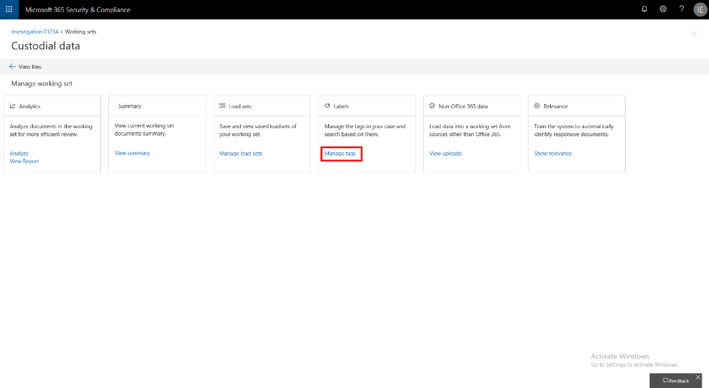

## Erstellen von Tag-Gruppen

Bevor Sie oder andere Personen Dokumente in einem Überprüfungs Satzes markieren können, müssen die Tags erstellt werden. Dazu können Sie Tag-Gruppen erstellen, die untergeordnete Tags enthalten. Tags werden im taggingfenster angezeigt, wenn Sie Dokumente in einem Überprüfungs Satzes überprüfen.

So erstellen Sie eine Transpondergruppe:

1.  Wählen Sie im Arbeitsbereich Arbeitsmappe verwalten aus.

> 

2.  Klicken Sie dann auf den Link Tags verwalten.

> 

Innerhalb der Tag-Verwaltung können Tags erstellt werden, um die Anforderungen Ihres Falls zu erfüllen.

> Beginnen Sie mit dem Erstellen eines Tag-Abschnitts.

1.  Klicken Sie auf die Schaltfläche "Abschnitt hinzufügen".

> 

|                                                                                                                             |                                                                                                                                                                 |
| --------------------------------------------------------------------------------------------------------------------------- | --------------------------------------------------------------------------------------------------------------------------------------------------------------- |
| Tipp | Der Vorschau-Bildschirm wird aktualisiert, wenn Sie speichern, sodass Sie eine Vorschau des Tag-Panels anzeigen können, ohne den Tag-Verwaltungsbildschirm schließen und zurück zum Arbeitsmappen wechseln zu müssen. |

2.  Geben Sie einen Titel und eine optionale Beschreibung ein. Um innerhalb dieses Abschnitts ein Tag zu erstellen, klicken Sie auf die Ellipsen im Abschnitt neuer Tag, um Tags in diesem neuen Abschnitt zu erstellen.
    
    

|                                                                                                                             |                                                                                                                                         |
| --------------------------------------------------------------------------------------------------------------------------- | --------------------------------------------------------------------------------------------------------------------------------------- |
| Tipp | Mit Options Tags wird erzwungen, dass Benutzer ein Tag aus einer Gruppe von Tags auswählen. Kontrollkästchentags ermöglichen Benutzern das Auswählen einer beliebigen Kombination von Tags. |

## Geschachtelte Tags

1.  Zum Schachteln von Tags klicken Sie auf die Ellipsen eines Tags, und wählen Sie ein neues Tag aus, das hinzugefügt werden soll. ****
    
    

