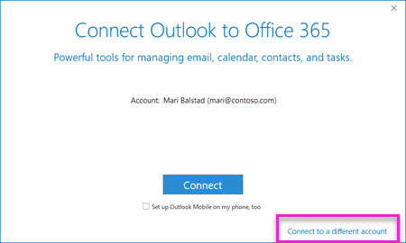

# <a name="configure-supervision-policies-for-your-organization"></a>Konfigurieren von Aufsichtsrichtlinien für Ihre Organisation

Verwenden Sie Aufsichtsrichtlinien, um die Mitarbeiterkommunikation zur Prüfung durch interne oder externe Prüfer zu erfassen. Weitere Informationen dazu, wie Sie mit Aufsichtsrichtlinien die Kommunikation in Ihrer Organisation überwachen können, finden Sie unter [Aufsichtsrichtlinien in Office 365](supervision-policies.md).

> [!NOTE]
> Benutzer, die von Aufsichtsrichtlinien überwacht werden, müssen über eine Microsoft 365 E5-Konformitäts Lizenz, eine Office 365 Enterprise E3-Lizenz mit dem Advanced Compliance-Add-on verfügen oder in ein Office 365 Enterprise E5-Abonnement aufgenommen werden.
Wenn Sie keinen Enterprise E5-Plan haben und die Überwachung testen möchten, können Sie [sich für eine Testversion von Office 365 Enterprise E5 registrieren](https://go.microsoft.com/fwlink/p/?LinkID=698279).
  
Führen Sie die folgenden Schritte aus, um die Überwachung in Ihrer Office 365-Organisation einzurichten und zu verwenden:
  
- **Schritt 1 (optional)** - [Einrichten von Gruppen für die Überwachung](configure-supervision-policies.md#exampledist)

    Bevor Sie mit der Überwachung beginnen, bestimmen Sie, wer Ihre Kommunikation überprüft hat und wer diese Bewertungen durchführen wird. Wenn Sie mit wenigen Benutzern beginnen möchten, um zu sehen, wie die Überwachung funktioniert, können Sie die Einrichtung von Gruppen für jetzt überspringen.

- **Schritt 2 (erforderlich)** - [Beaufsichtigung in Ihrer Organisation verfügbar machen](configure-supervision-policies.md#MakeAvailable)

    Fügen Sie sich selbst zur Rollengruppe Supervisory Review hinzu, damit Sie Richtlinien einrichten können. Jeder, der diese Rolle zugewiesen hat, kann auf die Seite " **Aufsicht** " unter " **Datensteuerung** " im Security & Compliance Center zugreifen. Wenn die zu überprüfende e-Mail in Exchange Online gehostet wird, muss jeder Prüfer auch über [Remote-PowerShell-Zugriff auf Exchange Online](https://docs.microsoft.com/powershell/exchange/exchange-online/disable-access-to-exchange-online-powershell)verfügen.

- **Schritt 3 (optional)** - [Konfigurieren von benutzerdefinierten vertraulichen Informationstypen oder benutzerdefinierten Keyword-Wörterbüchern/Lexika](configure-supervision-policies.md#sensitiveinfo)

    Wenn Sie einen benutzerdefinierten vertraulichen Infotyp oder ein benutzerdefiniertes Stichwort Wörterbuch für Ihre Aufsichtsrichtlinie verwenden müssen, müssen Sie es erstellen, bevor Sie den Überwachungs-Assistenten starten.

- **Schritt 4 (erforderlich)** - [Einrichten einer Aufsichtsrichtlinie](configure-supervision-policies.md#setupsuper)

    Sie erstellen Aufsichtsrichtlinien im Security & Compliance Center. Diese Richtlinien legen fest, welche Kommunikation in Ihrer Organisation überprüft werden soll, und gibt an, wer Bewertungen durchführen soll. Zu den Kommunikationen Gehören e-Mails und Microsoft Teams-Kommunikation sowie Platt Form Kommunikation von Drittanbietern (wie Facebook, Twitter usw.).

- **Schritt 5-(optional)** [Testen der neuen Aufsichtsrichtlinie](configure-supervision-policies.md#TestPolicy)

    Das Testen Ihrer Aufsichtsrichtlinie, um sicherzustellen, dass Sie wie gewünscht funktioniert, ist ein wichtiger Teil, um sicherzustellen, dass Ihre Compliance-Strategie Ihren Standards entspricht.

- **Schritt 6 – (optional)** [Konfigurieren von Outlook für Prüfer, die das Office 365-überwachungsdashboard oder Outlook im Web (früher als Outlook Web App bezeichnet) nicht verwenden möchten, um die überwachte Kommunikation zu überarbeiten](configure-supervision-policies.md#UseOutlook)

    Outlook kann so konfiguriert werden, dass Bearbeiter Zugriff auf die Überwachungsfunktionen innerhalb des Outlook-Clients erhalten, damit Sie jedes Element bewerten und kategorisieren können.

<a name="exampledist"> </a>

## <a name="step-1---set-up-groups-for-supervision-optional"></a>Schritt 1: Einrichten von Gruppen für die Überwachung (optional)

 Wenn Sie eine Aufsichtsrichtlinie erstellen, legen Sie fest, wer Ihre Kommunikation überprüft hat und wer diese Bewertungen durchführen wird. In der Richtlinie verwenden Sie e-Mail-Adressen, um Personen oder Personengruppen zu identifizieren. Um das Setup zu vereinfachen, können Sie Gruppen für Personen erstellen, die Ihre Kommunikation überprüft haben, und Gruppen für Personen, die diese Kommunikationen überprüfen. Wenn Sie Gruppen verwenden, benötigen Sie möglicherweise mehrere-beispielsweise, wenn Sie die Kommunikation zwischen zwei verschiedenen Personengruppen überwachen möchten oder wenn Sie eine Gruppe angeben möchten, die nicht überwacht werden soll.

Anhand des folgenden Diagramms können Sie Gruppen in Ihrer Organisation für Aufsichtsrichtlinien konfigurieren:

| **Richtlinienelement** | **Unterstützte Gruppen** | **Nicht unterstützte Gruppen** |
|:-----|:-----|:-----|
|ÜberWachte Benutzer | Verteilergruppen <br> Office 365-Gruppen | Dynamische Verteilergruppen |
| Reviewers | E-Mail-aktivierte Sicherheitsgruppen  | Verteilergruppen <br> Dynamische Verteilergruppen |
  
Weitere Informationen zum Einrichten von Gruppen finden Sie unter:
- [Erstellen und Verwalten von Verteilergruppen](https://docs.microsoft.com/Exchange/recipients-in-exchange-online/manage-distribution-groups/manage-distribution-groups)
- [Verwalten von E-Mail-aktivierten Sicherheitsgruppen](https://docs.microsoft.com/Exchange/recipients-in-exchange-online/manage-mail-enabled-security-groups)
- [Übersicht über Office 365-Gruppen](https://docs.microsoft.com/office365/admin/create-groups/office-365-groups?view=o365-worldwide)

<a name="MakeAvailable"> </a>

## <a name="step-2---make-supervision-available-in-your-organization-required"></a>Schritt 2: Bereitstellen der Überwachung in Ihrer Organisation (erforderlich)

Um die **Überwachung** als Menüoption im Security _AMP_ Compliance Center zur Verfügung zu stellen, muss Ihnen die Rolle "Supervisory Review Administrator" zugewiesen sein.
  
Zu diesem Zweck können Sie sich selbst als Mitglied der Rollengruppe "Supervisory Review" hinzufügen oder eine neue Rollengruppe erstellen.
  
### <a name="add-members-to-the-supervisory-review-role-group"></a>Hinzufügen von Mitgliedern zur Rollengruppe "Supervisory Review"

1. Melden Sie [https://protection.office.com](https://protection.office.com) sich mit Anmeldeinformationen für ein Administratorkonto in ihrer Office 365-Organisation an.

2. Wechseln Sie im Security & Compliance Center zu **Berechtigungen**.

3. Wählen Sie die Rollengruppe **Aufsichtsüberprüfung** aus, und klicken Sie dann auf das Symbol bearbeiten.

4. Fügen Sie im Abschnitt **Mitglieder** die Personen hinzu, die die Überwachung für Ihre Organisation verwalten sollen.

### <a name="create-a-new-role-group"></a>Erstellen einer neuen Rollengruppe

1. Melden Sie [https://protection.office.com](https://protection.office.com) sich mit Anmeldeinformationen für ein Administratorkonto in ihrer Office 365-Organisation an.

2. Wechseln Sie im Security & Compliance Center zu **Berechtigungen** , und klicken Sie dann auf**+** hinzufügen ().

3. Klicken Sie im Abschnitt **Rollen** auf Hinzufügen**+**(), und Scrollen Sie nach unten zum **Supervisory Review-Administrator**. Fügen Sie diese Rolle der Rollengruppe hinzu.

4. Fügen Sie im Abschnitt **Mitglieder** die Personen hinzu, die die Überwachung für Ihre Organisation verwalten sollen.

Weitere Informationen zu Rollengruppen und Berechtigungen finden Sie unter [Permissions in the Office 365 &amp; Security Compliance Center](permissions-in-the-security-and-compliance-center.md).

### <a name="enable-remote-powershell-access-for-reviewers-if-email-is-hosted-on-exchange-online"></a>Aktivieren des Remote-PowerShell-Zugriffs für Prüfer (wenn e-Mails in Exchange Online gehostet werden)

1. BeFolgen Sie die Anweisungen unter [Aktivieren oder Deaktivieren des Zugriffs auf Exchange Online PowerShell](https://docs.microsoft.com/powershell/exchange/exchange-online/disable-access-to-exchange-online-powershell).

<a name="sensitiveinfo"> </a>
  
## <a name="step-3---create-custom-sensitive-information-types-and-custom-keyword-dictionaries-optional"></a>Schritt 3-Erstellen benutzerdefinierter vertraulicher Informationstypen und benutzerdefinierter Stichwort Wörterbücher (optional)

Um aus vorhandenen benutzerdefinierten vertraulichen Informationstypen oder benutzerdefinierten Keyword-Wörterbüchern im Assistenten für Aufsichtsrichtlinien auszuwählen, müssen Sie diese Elemente bei Bedarf zunächst erstellen.

### <a name="create-custom-keyword-dictionarylexicon-optional"></a>Erstellen benutzerdefinierter Stichwort Wörterbuch/Lexikon (optional)

Erstellen Sie mithilfe eines Text-Editors (wie Notepad) eine neue Datei mit den Stichwortbegriffen, die Sie in einer Aufsichtsrichtlinie überwachen möchten. Stellen Sie sicher, dass sich jeder Ausdruck in einer separaten Leitung befindet, und speichern Sie die Datei im **Unicode/UTF-16 (Little Endian)-** Format.

### <a name="create-custom-sensitive-information-types"></a>Erstellen von benutzerdefinierten Typen für vertrauliche Informationen

1. Erstellen Sie einen neuen vertraulichen Informationstyp, und fügen Sie Ihr Benutzerwörterbuch im Office 365 Security & Compliance Center hinzu. Navigieren Sie zu **vertraulichen Info-Typen** für **Klassifikationen** \> , und führen Sie die Schritte im Assistenten für **neue vertrauliche Informationen**aus. Hier finden Sie die folgenden Schritte:

    - Definieren Sie einen Namen und eine Beschreibung für den vertraulichen Infotyp.
    - Definieren der Näherungs-, Konfidenz Grad-und primären Musterelemente
    - Importieren des Benutzerwörterbuchs als Anforderung für das übereinstimmende Element
    - Überarbeiten Ihrer Auswahl und Erstellen des Typs für vertrauliche Informationen

    Ausführlichere Informationen finden Sie unter [Erstellen eines benutzerdefinierten vertraulichen Informationstyps](create-a-custom-sensitive-information-type.md) und [Erstellen eines Stichwort Wörterbuchs](create-a-keyword-dictionary.md) .

    Nachdem das Benutzerwörterbuch/Lexikon erstellt wurde, können Sie die konfigurierten Schlüsselwörter mithilfe des Cmdlets [Get-DlpKeywordDictionary](https://docs.microsoft.com/powershell/module/exchange/policy-and-compliance-dlp/get-dlpkeyworddictionary) oder durch Hinzufügen und Entfernen von Ausdrücken mithilfe des Cmdlets [Set-DlpKeywordDictionary](https://docs.microsoft.com/powershell/module/exchange/policy-and-compliance-dlp/set-dlpkeyworddictionary) anzeigen.

<a name="setupsuper"> </a>

## <a name="step-4---set-up-a-supervision-policy-required"></a>Schritt 4: Einrichten einer Aufsichtsrichtlinie (erforderlich)
  
1. Melden Sie [https://protection.office.com](https://protection.office.com) sich mit Anmeldeinformationen für ein Administratorkonto in ihrer Office 365-Organisation an.

2. Wählen Sie im Security & Compliance Center die Option **Überwachung**aus.
  
3. Wählen Sie **Erstellen** aus, und folgen Sie dann dem Assistenten, um die folgenden Seiten der Richtlinie einzurichten. Mithilfe des Assistenten können Sie Folgendes tun:

    - Geben Sie der Richtlinie einen Namen und eine Beschreibung.
    - Wählen Sie die zu überwachenden Benutzer oder Gruppen aus, einschließlich der Auswahl von Benutzern oder Gruppen, die Sie ausschließen möchten.
    - Definieren Sie die Aufsichtsrichtlinien Bedingungen.
    - Wählen Sie aus, ob Sie vertrauliche Informationstypen einbeziehen möchten. Hier können Sie Standard-und benutzerdefinierte vertrauliche Infotypen auswählen.
    - Definieren Sie den Prozentsatz der zu überprüfenden Kommunikation.
    - Wählen Sie die Bearbeiter für die Richtlinie aus. Prüfer können einzelne Benutzer oder [e-Mail-aktivierte Sicherheitsgruppen](https://docs.microsoft.com/Exchange/recipients-in-exchange-online/manage-mail-enabled-security-groups#create-a-mail-enabled-security-group)sein.
    - Überdenken Sie Ihre Richtlinienauswahl und erstellen Sie die Richtlinie.

<a name="TestPolicy"> </a>

## <a name="step-5---test-your-supervision-policy-optional"></a>Schritt 5 – Testen der Aufsichtsrichtlinie (optional)

Nachdem Sie eine Aufsichtsrichtlinie erstellt haben, empfiehlt es sich zu testen, um sicherzustellen, dass die von Ihnen definierten Bedingungen ordnungsgemäß durch die Richtlinie erzwungen werden. Sie können auch [Ihre Data Loss Prevention (DLP)-Richtlinien testen](create-test-tune-dlp-policy.md) , wenn Ihre Aufsichtsrichtlinien vertrauliche Informationstypen aufweisen. Führen Sie die folgenden Schritte aus, um Ihre Aufsichtsrichtlinie zu testen:

1. Öffnen Sie einen e-Mail-Client oder Microsoft Teams, die als überwachten Benutzer angemeldet sind, der in der Richtlinie definiert ist, die Sie testen möchten.
2. Senden Sie eine e-Mail oder einen Microsoft Teams-Chat, der den Kriterien entspricht, die Sie in der Aufsichtsrichtlinie definiert haben. Dabei kann es sich um ein Stichwort, eine Anlagegröße, eine Domäne usw. handeln. Stellen Sie sicher, dass Sie feststellen, ob die konfigurierten bedingten Einstellungen in der Richtlinie zu restriktiv oder zu nachsichtig sind.

    > [!Note]
    > E-Mails, die bestimmten Richtlinien unterliegen, werden nahezu in Echtzeit verarbeitet und können sofort nach der Konfiguration der Richtlinie getestet werden. Chats in Microsoft Teams können bis zu 24 Stunden dauern, bis Sie in einer Richtlinie vollständig verarbeitet werden. 

3. Melden Sie sich bei Ihrem Office 365-Mandanten als Prüfer an, der in der Aufsichtsrichtlinie festgelegt ist. Navigieren Sie zu **Aufsicht** > *Ihre benutzerdefinierte Richtlinie* > **** , um den Bericht für die Richtlinie anzuzeigen.

<a name="UseOutlook"> </a>

## <a name="step-6---configure-outlook-for-reviewers-optional"></a>Schritt 6: Konfigurieren von Outlook für Prüfer (optional)

Prüfer, die Outlook verwenden möchten, anstatt das Aufsichts Dashboard in Office 365 zur Überprüfung der Kommunikation zu überwachen, müssen Ihren Outlook-Client konfigurieren.

### <a name="step-1-copy-the-address-for-the-supervision-mailbox"></a>Schritt 1: Kopieren der Adresse für das überwachungspostfach

Zum Konfigurieren der Überprüfung für Outlook-Desktop oder Outlook für das Web benötigen Sie die Adresse für das Aufsichts Postfach, das als Teil der Aufsichtsrichtlinien Einrichtung erstellt wurde.
  
> [!NOTE]
> Wenn eine andere Person die Richtlinie erstellt hat, müssen Sie diese Adresse abrufen, um das Add-in zu installieren.

 **So finden Sie die Überwachungs Postfachadresse**
  
1. Melden Sie sich [beim &amp; Security Compliance Center](https://protection.office.com) mithilfe von Anmeldeinformationen für ein Administratorkonto in Ihrer Office 365-Organisation an.

2. Gehen Sie zur **Überwachung**.

3. Klicken Sie auf die Aufsichtsrichtlinie, die die zu überprüfende Kommunikation erfasst.

4. Kopieren Sie im Flyout Richtliniendetails unter **überwachungspostfach**die Adresse.<br/>
  
### <a name="step-2-configure-the-supervision-mailbox-for-outlook-access"></a>Schritt 2: Konfigurieren des Überwachungs Postfachs für Outlook-Zugriff

Als nächstes müssen die Bearbeiter einige Exchange Online PowerShell-Befehle ausführen, damit Sie Outlook mit dem überwachungspostfach verbinden können.
  
1. Stellen Sie eine Verbindung mit Exchange Online PowerShell her. [Wie muss ich vorgehen?](https://docs.microsoft.com/powershell/exchange/exchange-online/connect-to-exchange-online-powershell/connect-to-exchange-online-powershell)

2. Führen Sie die folgenden Befehle aus, wobei *SupervisoryReview {GUID} @domain. onmicrosoft.com* die Adresse ist, die Sie in Schritt 1 oben kopiert haben, und *Benutzer* ist der Name des Rezensenten, der eine Verbindung mit dem überwachungspostfach in Schritt 3 herstellt.

    ```Add-MailboxPermission "SupervisoryReview{GUID}@domain.onmicrosoft.com" -User <alias or email address of the account that has reviewer permissions to the supervision mailbox> -AccessRights FullAccess```

    ```Set-Mailbox "<SupervisoryReview{GUID}@domain.onmicrosoft.com>" -HiddenFromAddressListsEnabled: $false```

3. Warten Sie mindestens eine Stunde, bevor Sie mit Schritt 3 fortfahren.

### <a name="step-3-create-an-outlook-profile-to-connect-to-the-supervision-mailbox"></a>Schritt 3: Erstellen eines Outlook-Profils zum Herstellen einer Verbindung mit dem überwachungspostfach

Für den letzten Schritt müssen die Bearbeiter ein Outlook-Profil erstellen, um eine Verbindung mit dem überwachungspostfach herzustellen.

> [!NOTE]
> Zum Erstellen eines neuen Outlook-Profils verwenden Sie die e-Mail-Einstellungen in der Windows-Systemsteuerung. Der Pfad, den Sie zum Abrufen dieser Einstellungen ergreifen, hängt möglicherweise davon ab, welches Windows-Betriebssystem (Windows 7, Windows 8 oder Windows 10) Sie verwenden und welche Version von Outlook installiert ist.
  
1. Öffnen Sie die Systemsteuerung, und geben Sie im **Suchfeld** oben im Fenster **e-Mail**ein.<br/>(Sind Sie nicht sicher, wie Sie zur Systemsteuerung gelangen? Weitere Informationen finden Sie unter [wo ist die Systemsteuerung?](https://support.microsoft.com/help/13764/windows-where-is-control-panel))
  
2. Öffnen Sie die **Mail-** app.

3. Klicken Sie in **Mail Setup-Outlook**auf **Profile anzeigen**.<br/>
  
4. Klicken Sie in **e-Mail**auf **Hinzufügen**. Geben Sie dann unter **Neues Profil**einen Namen für das überwachungspostfach ein (beispielsweise **Aufsicht**).<br/>
  
5. Klicken Sie in **Outlook mit Office 365 verbinden**auf mit **einem anderen Konto verbinden**.<br/>
  
6. Wählen Sie unter **Automatische Kontoeinrichtung** **manuell einrichten oder zusätzliche Servertypen**aus, und klicken Sie dann auf **weiter**.

7. Wählen Sie unter **Wählen Sie Ihren Kontotyp aus die**option **Office 365**. Geben Sie dann im Feld **e-Mail-Adresse** die Adresse des Überwachungs Postfachs ein, das Sie zuvor kopiert haben.<br/>
  
8. Geben Sie Ihre Office 365-Anmeldeinformationen ein, wenn Sie dazu aufgefordert werden.

9. Wenn die Einstellung erfolgreich ist, wird der Ordner " ** \<Aufsicht\> -Richtlinienname** " in der Ansicht "Ordnerliste" in Outlook angezeigt.

## <a name="powershell-reference"></a>PowerShell-Referenz

Bei Bedarf können Sie Aufsichtsrichtlinien mithilfe der folgenden PowerShell-Cmdlets erstellen und verwalten:

- [New-SupervisoryReviewPolicyV2](https://docs.microsoft.com/powershell/module/exchange/policy-and-compliance/new-supervisoryreviewpolicyv2?view=exchange-ps)
- [Get-SupervisoryReviewPolicyV2](https://docs.microsoft.com/powershell/module/exchange/policy-and-compliance/get-supervisoryreviewpolicyv2?view=exchange-ps)
- [Set-SupervisoryReviewPolicyV2](https://docs.microsoft.com/powershell/module/exchange/policy-and-compliance/set-supervisoryreviewpolicyv2?view=exchange-ps)
- [Remove-SupervisoryReviewPolicyV2](https://docs.microsoft.com/powershell/module/exchange/policy-and-compliance/remove-supervisoryreviewpolicyv2?view=exchange-ps)
- [New-SupervisoryReviewRule](https://docs.microsoft.com/powershell/module/exchange/policy-and-compliance/new-supervisoryreviewrule?view=exchange-ps)
- [Set-SupervisoryReviewRule](https://docs.microsoft.com/powershell/module/exchange/policy-and-compliance/set-supervisoryreviewrule?view=exchange-ps)
- [Get-SupervisoryReviewActivity](https://docs.microsoft.com/powershell/module/exchange/reporting/get-supervisoryreviewactivity)
- [Get-SupervisoryReviewOverallProgressReport](https://docs.microsoft.com/powershell/module/exchange/reporting/get-supervisoryreviewoverallprogressreport)
- [Get-SupervisoryReviewTopCasesReport](https://docs.microsoft.com/powershell/module/exchange/reporting/get-supervisoryreviewtopcasesreport)