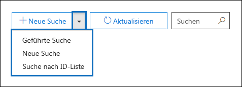
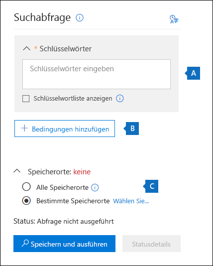
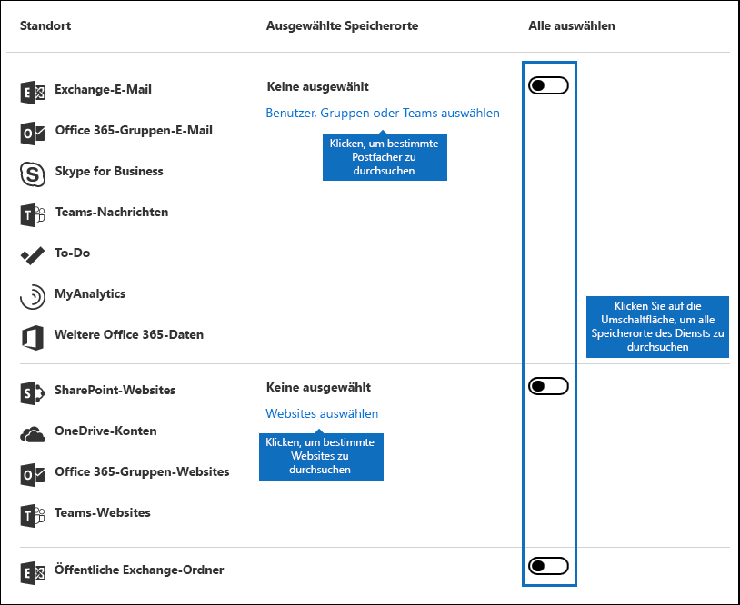
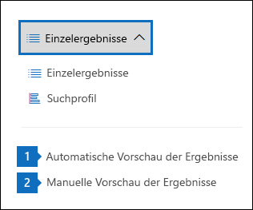
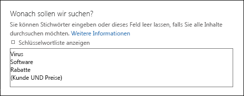
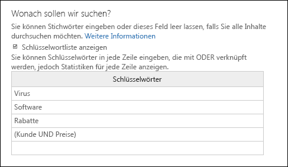
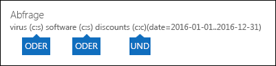
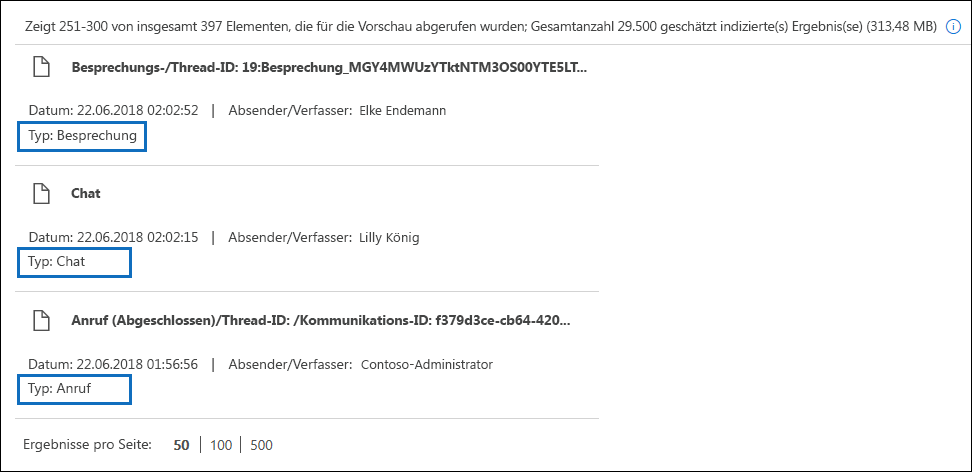
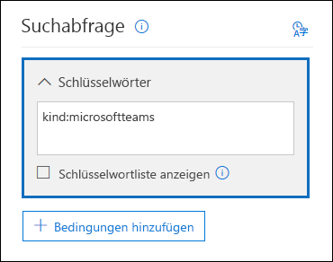
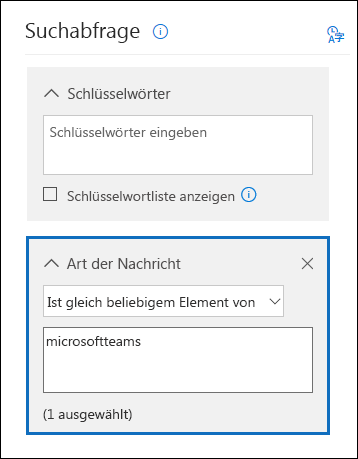

# <a name="content-search-in-office-365"></a><span data-ttu-id="cf893-106">Inhaltssuche in Office 365</span><span class="sxs-lookup"><span data-stu-id="cf893-106">Content Search in Office 365</span></span>

<span data-ttu-id="cf893-107">Sie können das eDiscovery-Tool für die Inhaltssuche im Compliance Center in Office 365 oder Microsoft 365 verwenden, um nach in-Place-Elementen wie e-Mails, Dokumenten und Sofortnachrichtenunterhaltungen in Ihrer Office 365-Organisation zu suchen.</span><span class="sxs-lookup"><span data-stu-id="cf893-107">You can use the Content Search eDiscovery tool in the compliance center in Office 365 or Microsoft 365 to search for in-place items such as email, documents, and instant messaging conversations in your Office 365 organization.</span></span> <span data-ttu-id="cf893-108">Verwenden Sie dieses Tool, um nach Elementen in diesen Office 365-Diensten zu suchen:</span><span class="sxs-lookup"><span data-stu-id="cf893-108">Use this tool to search for items in these Office 365 services:</span></span>
  
- <span data-ttu-id="cf893-109">Exchange Online-Postfächer und öffentliche Ordner</span><span class="sxs-lookup"><span data-stu-id="cf893-109">Exchange Online mailboxes and public folders</span></span>
    
- <span data-ttu-id="cf893-110">SharePoint Online-Websites und OneDrive for Business-Konten</span><span class="sxs-lookup"><span data-stu-id="cf893-110">SharePoint Online sites and OneDrive for Business accounts</span></span>
    
- <span data-ttu-id="cf893-111">Skype for Business-Unterhaltungen</span><span class="sxs-lookup"><span data-stu-id="cf893-111">Skype for Business conversations</span></span>
    
- <span data-ttu-id="cf893-112">Microsoft Teams</span><span class="sxs-lookup"><span data-stu-id="cf893-112">Microsoft Teams</span></span> 
    
- <span data-ttu-id="cf893-113">Office 365-Gruppen</span><span class="sxs-lookup"><span data-stu-id="cf893-113">Office 365 Groups</span></span>
    
<span data-ttu-id="cf893-114">Nachdem Sie eine Inhaltssuche ausgeführt haben, wird die Anzahl der inhaltsspeicherorte und eine geschätzte Anzahl von Suchergebnissen im Suchprofil angezeigt.</span><span class="sxs-lookup"><span data-stu-id="cf893-114">After you run a Content Search, the number of content locations and an estimated number of search results are displayed in the search profile.</span></span> <span data-ttu-id="cf893-115">Sie können auch schnell Statistiken anzeigen, beispielsweise die inhaltsspeicherorte mit den meisten Elementen, die mit der Suchabfrage übereinstimmen.</span><span class="sxs-lookup"><span data-stu-id="cf893-115">You can also quickly view statistics, such as the content locations that have the most items that match the search query.</span></span> <span data-ttu-id="cf893-116">Nachdem Sie eine Suche ausgeführt haben, können Sie eine Vorschau der Ergebnisse anzeigen oder Sie auf einen lokalen Computer exportieren.</span><span class="sxs-lookup"><span data-stu-id="cf893-116">After you run a search, you can preview the results or export them to a local computer.</span></span>


## <a name="create-a-new-search"></a><span data-ttu-id="cf893-117">Erstellen einer neuen Suche</span><span class="sxs-lookup"><span data-stu-id="cf893-117">Create a new search</span></span>

<span data-ttu-id="cf893-118">Damit Sie Zugriff auf die Seite " **Inhaltssuche** " haben, um Suchergebnisse ausführen und eine Vorschau anzeigen und exportieren können, muss ein Administrator, ein Compliance Officer oder ein eDiscovery-Manager Mitglied der rollenGruppe "eDiscovery Manager" im Security _AMP_ Compliance Center sein.</span><span class="sxs-lookup"><span data-stu-id="cf893-118">To have access to the **Content search** page to run searches and preview and export search results, an administrator, compliance officer, or eDiscovery manager must be a member of the eDiscovery Manager role group in the Security & Compliance Center.</span></span> <span data-ttu-id="cf893-119">Weitere Informationen finden Sie unter [Zuweisen von eDiscovery-Berechtigungen](assign-ediscovery-permissions.md).</span><span class="sxs-lookup"><span data-stu-id="cf893-119">For more information, see [Assign eDiscovery permissions](assign-ediscovery-permissions.md).</span></span>
  
1. <span data-ttu-id="cf893-120">Wechseln Sie [https://protection.office.com](https://protection.office.com) zu, und melden Sie sich mit ihrer Office 365-e-Mail-Adresse und Ihrem Kennwort an.</span><span class="sxs-lookup"><span data-stu-id="cf893-120">Go to [https://protection.office.com](https://protection.office.com) and sign in using your Office 365 email address and password.</span></span>
    
2. <span data-ttu-id="cf893-121">Klicken Sie auf **Such** \> **Inhaltssuche**.</span><span class="sxs-lookup"><span data-stu-id="cf893-121">Click **Search** \> **Content search**.</span></span>
    
3. <span data-ttu-id="cf893-122">Klicken Sie auf der Seite **Suchen** auf den Pfeil neben  **neue Suche**hinzufügen.</span><span class="sxs-lookup"><span data-stu-id="cf893-122">On the **Search** page, click the arrow next to  **New search**.</span></span> 
    
    
  
    <span data-ttu-id="cf893-124">Verwenden Sie die Registerkarte Interne DNS-Lookups, um festzulegen, ob die DNS-Server verwendet werden sollen, die für einen auf diesem Server installierten Netzadapter konfiguriert sind, oder ob beim Auflösen der Adressen von E-Mail-Servern für die interne Nachrichtenzustellung bestimmte DNS-Server verwendet werden sollen. Interne DNS-Server werden zum Auflösen von IP-Adressen für Server innerhalb der Organisation verwendet.</span><span class="sxs-lookup"><span data-stu-id="cf893-124">You can choose one of the following options:</span></span>
    
    - <span data-ttu-id="cf893-125">**Guided search** -mit dieser Option wird ein Assistent gestartet, der Sie durch die Erstellung der Suche führt.</span><span class="sxs-lookup"><span data-stu-id="cf893-125">**Guided search** - This option starts a wizard that guides you through the creating the search.</span></span> <span data-ttu-id="cf893-126">Die Benutzeroberfläche, um inhaltsspeicherorte auszuwählen und die Suchabfrage zu erstellen, ist identisch mit der **neuen Such** Option.</span><span class="sxs-lookup"><span data-stu-id="cf893-126">The user interface to select content locations and build the search query are the same as the **New search** option.</span></span> 
    
    - <span data-ttu-id="cf893-127">**Neue Suche** : mit dieser Option wird eine aktualisierte Benutzeroberfläche zum Erstellen einer neuen Suche angezeigt.</span><span class="sxs-lookup"><span data-stu-id="cf893-127">**New search** - This option displays an updated user interface to create a new search.</span></span> <span data-ttu-id="cf893-128">Dies ist die Standardoption, wenn Sie auf **neue Suche**klicken.</span><span class="sxs-lookup"><span data-stu-id="cf893-128">This is the default option if you click **New search**.</span></span>
    
    - <span data-ttu-id="cf893-129">**Suche nach ID-Liste** – mit dieser Option können Sie mit einer Liste von Exchange-IDs nach bestimmten e-Mail-Nachrichten und anderen Postfachelementen suchen.</span><span class="sxs-lookup"><span data-stu-id="cf893-129">**Search by ID List** - This option lets you search for specific email messages and other mailbox items using a list of Exchange IDs.</span></span> <span data-ttu-id="cf893-130">Um eine ID-Listensuche (formell als gezielte Suche bezeichnet) zu erstellen, übermitteln Sie eine CSV-Datei (Comma Separated Value), die die zu suchenden Postfachelemente identifiziert.</span><span class="sxs-lookup"><span data-stu-id="cf893-130">To create an ID list search (formally called a targeted search), you submit a comma separated value (CSV) file that identifies the specific mailbox items to search for.</span></span> <span data-ttu-id="cf893-131">Weitere Informationen finden Sie unter [Vorbereiten einer CSV-Datei für die Inhaltssuche einer ID-Liste in Office 365](csv-file-for-an-id-list-content-search.md).</span><span class="sxs-lookup"><span data-stu-id="cf893-131">For instructions, see [Prepare a CSV file for an ID list Content Search in Office 365](csv-file-for-an-id-list-content-search.md).</span></span>
    
    <span data-ttu-id="cf893-132">Die restlichen Schritte in diesem Verfahren folgen dem standardmäßigen neuen Such Workflow.</span><span class="sxs-lookup"><span data-stu-id="cf893-132">The remainder of the steps in this procedure will follow the default new search workflow.</span></span>
    
4. <span data-ttu-id="cf893-133">Klicken Sie in der Dropdownliste auf **neue Suche** .</span><span class="sxs-lookup"><span data-stu-id="cf893-133">Click **New search** in the drop-down list.</span></span> 
    
5. <span data-ttu-id="cf893-134">Geben Sie unter **Suchabfrage**die folgenden Punkte an.</span><span class="sxs-lookup"><span data-stu-id="cf893-134">Under **Search query**, specify the following things.</span></span>
    
    
  
   - <span data-ttu-id="cf893-136">**Zu suchende Schlüsselwörter** -geben Sie im Feld **Stichwörter** eine Suchabfrage ein.</span><span class="sxs-lookup"><span data-stu-id="cf893-136">**Keywords to search for** - Type a search query in **Keywords** box.</span></span> <span data-ttu-id="cf893-137">Sie können Schlüsselwörter, Nachrichteneigenschaften , z. B. Sende- und Empfangsdatum, oder Dokumenteigenschaften angeben, z. B. Dateinamen oder das Datum der letzten Dokumentänderung.</span><span class="sxs-lookup"><span data-stu-id="cf893-137">You can specify keywords, message properties such as sent and received dates, or document properties such as file names or the date that a document was last changed.</span></span> <span data-ttu-id="cf893-138">Sie können komplexere Abfragen verwenden, die einen booleschen Operator verwenden, beispielsweise **and**, **or**, **Not**und **near**.</span><span class="sxs-lookup"><span data-stu-id="cf893-138">You can use a more complex queries that use a Boolean operator, such as **AND**, **OR**, **NOT**, and **NEAR**.</span></span> <span data-ttu-id="cf893-139">Sie können auch nach vertraulichen Informationen (wie Sozialversicherungsnummern) in Dokumenten suchen oder nach Dokumenten suchen, die extern freigegeben wurden.</span><span class="sxs-lookup"><span data-stu-id="cf893-139">You can also search for sensitive information (such as social security numbers) in documents, or search for documents that have been shared externally.</span></span> <span data-ttu-id="cf893-140">Wenn Sie das Schlüsselwortfeld leer lassen, werden alle Inhalte an den angegebenen Inhaltsspeicherorten in die Suchergebnisse eingeschlossen.</span><span class="sxs-lookup"><span data-stu-id="cf893-140">If you leave the keyword box empty, all content located in the specified content locations will be included in the search results.</span></span>
    
      <span data-ttu-id="cf893-141">Alternativ können Sie auf das Kontrollkästchen **Keyword-Liste anzeigen** klicken und in jeder Zeile ein Stichwort eingeben.</span><span class="sxs-lookup"><span data-stu-id="cf893-141">Alternatively, you can click the **Show keyword list** checkbox and the type a keyword in each row.</span></span> <span data-ttu-id="cf893-142">Wenn Sie dies tun, werden die Schlüsselwörter in jeder Zeile durch einen logischen Operator ( **c:s**) verbunden, der in der Funktionalität mit dem **or** -Operator in der erstellten Suchabfrage vergleichbar ist.</span><span class="sxs-lookup"><span data-stu-id="cf893-142">If you do this, the keywords on each row are connected by a logical operator ( **c:s**) that is similar in functionality to the **OR** operator in the search query that's created.</span></span> 
    
      <span data-ttu-id="cf893-143">Gründe für die Verwendung der Keyword-Liste</span><span class="sxs-lookup"><span data-stu-id="cf893-143">Why use the keyword list?</span></span> <span data-ttu-id="cf893-144">Sie können Statistiken abrufen, die zeigen, wie viele Elemente mit jedem Stichwort übereinstimmen.</span><span class="sxs-lookup"><span data-stu-id="cf893-144">You can get statistics that show how many items match each keyword.</span></span> <span data-ttu-id="cf893-145">Auf diese Weise können Sie schnell erkennen, welche Schlüsselwörter am meisten (und am wenigsten) wirksam sind.</span><span class="sxs-lookup"><span data-stu-id="cf893-145">This can help you quickly identify which keywords are the most (and least) effective.</span></span> <span data-ttu-id="cf893-146">Sie können auch eine Schlüsselwortphrase (umgeben von Klammern) in einer Zeile verwenden.</span><span class="sxs-lookup"><span data-stu-id="cf893-146">You can also use a keyword phrase (surrounded by parentheses) in a row.</span></span> <span data-ttu-id="cf893-147">Weitere Informationen zu Suchstatistiken finden Sie unter [View Keyword Statistics for Content Search results](view-keyword-statistics-for-content-search.md).</span><span class="sxs-lookup"><span data-stu-id="cf893-147">For more information about search statistics, see [View keyword statistics for Content Search results](view-keyword-statistics-for-content-search.md).</span></span>

    > [!NOTE]
    > <span data-ttu-id="cf893-148">Um Probleme zu vermeiden, die durch umfangreiche Stichwortlisten verursacht werden, sind Sie jetzt auf maximal 20 Zeilen in der Keyword-Liste beschränkt.</span><span class="sxs-lookup"><span data-stu-id="cf893-148">To help reduce issues caused by large keyword lists, you're now limited to a maximum of 20 rows in the keyword list.</span></span>
    
    - <span data-ttu-id="cf893-149">**Bedingungen** : Sie können Suchbedingungen hinzufügen, um eine Suche einzuschränken und eine genauere Ergebnismenge zurückzugeben.</span><span class="sxs-lookup"><span data-stu-id="cf893-149">**Conditions** - You can add search conditions to narrow a search and return a more refined set of results.</span></span> <span data-ttu-id="cf893-150">Jede Bedingung fügt eine Klausel zu der Suchabfrage hinzu, die erstellt und beim Starten der Suche ausgeführt wird.</span><span class="sxs-lookup"><span data-stu-id="cf893-150">Each condition adds a clause to the search query that is created and run when you start the search.</span></span> <span data-ttu-id="cf893-151">Eine Bedingung ist logisch mit der Stichwortabfrage (angegeben im Stichwortfeld) durch einen logischen Operator ( **c:c**) verbunden, der in der Funktionalität mit dem **and-** Operator vergleichbar ist.</span><span class="sxs-lookup"><span data-stu-id="cf893-151">A condition is logically connected to the keyword query (specified in the keyword box) by a logical operator ( **c:c**) that is similar in functionality to the **AND** operator.</span></span> <span data-ttu-id="cf893-152">Dies führt dazu, dass Elemente sowohl die Stichwortabfrage als auch eine oder mehrere Bedingungen erfüllen müssen, die in die Ergebnisse eingeschlossen werden sollen.</span><span class="sxs-lookup"><span data-stu-id="cf893-152">That means that items have to satisfy both the keyword query and one or more conditions to be included in the results.</span></span> <span data-ttu-id="cf893-153">Auf diese Weise können Sie Ihre Ergebnisse mit Bedingungen eingrenzen.</span><span class="sxs-lookup"><span data-stu-id="cf893-153">This is how conditions help to narrow your results.</span></span> <span data-ttu-id="cf893-154">Eine Liste und Beschreibung der Bedingungen, die Sie in einer Suchabfrage verwenden können, finden Sie im Abschnitt "Suchbedingungen" in [Stichwortabfragen und Suchbedingungen für die Inhaltssuche](keyword-queries-and-search-conditions.md#search-conditions).</span><span class="sxs-lookup"><span data-stu-id="cf893-154">For a list and description of conditions that you can use in a search query, see the "Search conditions" section in [Keyword queries and search conditions for Content Search](keyword-queries-and-search-conditions.md#search-conditions).</span></span>
    
       - <span data-ttu-id="cf893-155">**Standorte** – wählen Sie die zu durchsuchenden inhaltsspeicherorte aus.</span><span class="sxs-lookup"><span data-stu-id="cf893-155">**Locations** - Choose the content locations to search.</span></span>
    
      - <span data-ttu-id="cf893-156">**Alle Standorte** -verwenden Sie diese Option, um alle inhaltsspeicherorte in Ihrer Organisation zu durchsuchen.</span><span class="sxs-lookup"><span data-stu-id="cf893-156">**All locations** - Use this option to search all content locations in your organization.</span></span> <span data-ttu-id="cf893-157">Dazu gehören e-Mails in allen Exchange-Postfächern (einschließlich aller inaktiven Postfächer, Postfächer für alle Office 365-Gruppen, Postfächer für alle Microsoft Teams), alle Skype for Business-Unterhaltungen, alle SharePoint-und OneDrive für Business-Websites (einschließlich der Websites für alle Office 365-Gruppen und Microsoft Teams) und Elemente in allen öffentlichen Exchange-Ordnern.</span><span class="sxs-lookup"><span data-stu-id="cf893-157">This includes email in all Exchange mailboxes (including all inactive mailboxes, mailboxes for all Office 365 Groups, mailboxes for all Microsoft Teams), all Skype for Business conversations, all SharePoint and OneDrive for Business sites (including the sites for all Office 365 Groups and Microsoft Teams), and items in all Exchange public folders.</span></span>
    
      - <span data-ttu-id="cf893-158">**Bestimmte Standorte** -verwenden Sie diese Option, um bestimmte inhaltsspeicherorte zu durchsuchen.</span><span class="sxs-lookup"><span data-stu-id="cf893-158">**Specific locations** - Use this option to search specific content locations.</span></span> <span data-ttu-id="cf893-159">Sie können alle inhaltsspeicherorte für einen bestimmten Office 365-Dienst durchsuchen (beispielsweisedurch Suchen aller Exchange-Postfächer oder Durchsuchen aller SharePoint-Websites), oder Sie können bestimmte Standorte in einem der Office 365-Dienste durchsuchen, die angezeigt werden.</span><span class="sxs-lookup"><span data-stu-id="cf893-159">You can search all content locations for a specific Office 365 service (such as searching all Exchange mailboxes or search all SharePoint sites) or you can search specific locations in any of the Office 365 services that are displayed.</span></span> 
    
        
  
         <span data-ttu-id="cf893-161">Beachten Sie, dass Sie der Liste der zu durchsuchenden Exchange-Postfächer auch Verteilergruppen hinzufügen können.</span><span class="sxs-lookup"><span data-stu-id="cf893-161">Note that you can also add distribution groups to the list of Exchange mailboxes to search.</span></span> <span data-ttu-id="cf893-162">Für Verteilergruppen werden die Postfächer der Gruppenmitglieder durchsucht.</span><span class="sxs-lookup"><span data-stu-id="cf893-162">For distribution groups, the mailboxes of group members are searched.</span></span> <span data-ttu-id="cf893-163">Beachten Sie, dass dynamische Verteilergruppen nicht unterstützt werden.</span><span class="sxs-lookup"><span data-stu-id="cf893-163">Note that dynamic distribution groups aren't supported.</span></span>
    
       <span data-ttu-id="cf893-164">**Wichtig:** Wenn Sie alle Postfachspeicher Orte oder nur bestimmte Postfächer durchsuchen, werden Daten aus myAnalytics und anderen Office 365-Anwendungen, die in Benutzerpostfächern gespeichert sind, beim Exportieren der Ergebnisse einer Inhaltssuche eingeschlossen.</span><span class="sxs-lookup"><span data-stu-id="cf893-164">**Important:** When you search all mailbox locations or just specific mailboxes, data from MyAnalytics and other Office 365 applications that's saved to user mailboxes will be included when you export the results of a Content Search.</span></span> <span data-ttu-id="cf893-165">Diese Daten werden nicht in die geschätzten Suchergebnisse eingeschlossen und stehen nicht für die Vorschau zur Verfügung.</span><span class="sxs-lookup"><span data-stu-id="cf893-165">This data will not be included in the estimated search results and it won't be available for preview.</span></span> <span data-ttu-id="cf893-166">Sie wird nur beim Exportieren und Herunterladen der Suchergebnisse eingeschlossen. Weitere Informationen finden Sie unter [Exportieren von Daten aus myAnalytics und anderen Office 365-Anwendungen](#exporting-data-from-myanalytics-and-other-office-365-applications) im Abschnitt "Weitere Information über Inhaltssuche".</span><span class="sxs-lookup"><span data-stu-id="cf893-166">It will only be included when you export and download the search results; see [Exporting data from MyAnalytics and other Office 365 applications](#exporting-data-from-myanalytics-and-other-office-365-applications) in the "More information about content search" section.</span></span> 
    
6. <span data-ttu-id="cf893-167">Nachdem Sie Ihre Suchabfrage eingerichtet haben, klicken Sie **auf &amp; Run speichern**.</span><span class="sxs-lookup"><span data-stu-id="cf893-167">After you've set up your search query, click **Save &amp; run**.</span></span>
    
7. <span data-ttu-id="cf893-168">Geben Sie auf der Seite **Suche speichern** einen Namen für die Suche und eine optionale Beschreibung ein, die die Suche erleichtert.</span><span class="sxs-lookup"><span data-stu-id="cf893-168">On the **Save search** page, type a name for the search, and an optional description that helps identify the search.</span></span> <span data-ttu-id="cf893-169">Beachten Sie, dass der Name der Suche in Ihrer Organisation eindeutig sein muss.</span><span class="sxs-lookup"><span data-stu-id="cf893-169">Note that the name of the search has to be unique in your organization.</span></span> 
    
8. <span data-ttu-id="cf893-170">Klicken Sie auf **Speichern** , um die Suche zu starten.</span><span class="sxs-lookup"><span data-stu-id="cf893-170">Click **Save** to start the search.</span></span> 
    
    <span data-ttu-id="cf893-171">Nachdem Sie die Suche gespeichert und ausgeführt haben, werden alle von der Suche zurückgegebenen Ergebnisse im Ergebnisbereich angezeigt.</span><span class="sxs-lookup"><span data-stu-id="cf893-171">After you save and run the search, any results returned by the search are displayed in the results pane.</span></span> <span data-ttu-id="cf893-172">Je nachdem, wie Sie die Vorschau Einstellung konfiguriert haben, werden die Suchergebnisse angezeigt, oder Sie müssen auf **Vorschau Ergebnisse** klicken, um Sie anzuzeigen.</span><span class="sxs-lookup"><span data-stu-id="cf893-172">Depending on how you have the preview setting configured, the search results are display or you have to click **Preview results** to view them.</span></span> <span data-ttu-id="cf893-173">Weitere Informationen finden Sie im nächsten Abschnitt.</span><span class="sxs-lookup"><span data-stu-id="cf893-173">See the next section for details.</span></span> 
    
<span data-ttu-id="cf893-174">Um erneut auf diese Inhaltssuche zuzugreifen oder auf andere auf der Seite **Inhaltssuche** aufgeführte Inhalts Suchvorgänge zuzugreifen, wählen Sie die Suche aus, und klicken Sie dann auf **Öffnen**.</span><span class="sxs-lookup"><span data-stu-id="cf893-174">To access this content search again or access other content searches listed on the **Content search** page, select the search and then click **Open**.</span></span> 
  
<span data-ttu-id="cf893-175">Klicken Sie  \*\*\*\* hinzufügen, um die Ergebnisse zu löschen oder eine neue Suche zu erstellen.</span><span class="sxs-lookup"><span data-stu-id="cf893-175">To clear the results or create a new search, click  **New search**.</span></span> 

  
## <a name="preview-search-results"></a><span data-ttu-id="cf893-176">Suchergebnisse in der Vorschau anzeigen</span><span class="sxs-lookup"><span data-stu-id="cf893-176">Preview search results</span></span>

<span data-ttu-id="cf893-177">Es gibt zwei Konfigurationseinstellungen für die Vorschau der Suchergebnisse.</span><span class="sxs-lookup"><span data-stu-id="cf893-177">There are two configuration settings for previewing search results.</span></span> <span data-ttu-id="cf893-178">Nachdem Sie eine neue Suche ausgeführt oder eine vorhandene Suche geöffnet haben, klicken Sie auf \* \* Einzelergebnisse \* \*, um die folgenden Vorschaueinstellungen anzuzeigen:</span><span class="sxs-lookup"><span data-stu-id="cf893-178">After you run a new a new search or open an existing search, click \*\* Individual results \*\* to view the following preview settings:</span></span> 
  

  
1. <span data-ttu-id="cf893-180">**Automatische Vorschau der Ergebnisse** – mit dieser Einstellung werden die Suchergebnisse angezeigt, nachdem Sie eine Suche ausgeführt haben.</span><span class="sxs-lookup"><span data-stu-id="cf893-180">**Preview results automatically** - This setting displays the search results after you a run a search.</span></span>
    
2. <span data-ttu-id="cf893-181">**Ergebnisse manuell** anzeigen – mit dieser Einstellung werden Platzhalter im Suchergebnisbereich angezeigt und die Schaltfläche **Vorschau Ergebnisse** angezeigt, auf die Sie klicken müssen, um die Suchergebnisse anzuzeigen.</span><span class="sxs-lookup"><span data-stu-id="cf893-181">**Preview results manually** - This setting displays placeholders in the search results pane, and displays the **Preview results** button that you have to click to display the search results.</span></span> <span data-ttu-id="cf893-182">Dies ist die Standardeinstellung; Dadurch wird die Suchleistung verbessert, da beim Öffnen einer vorhandenen Suche nicht automatisch die Suchergebnisse angezeigt werden.</span><span class="sxs-lookup"><span data-stu-id="cf893-182">This is the default setting; it helps enhance search performance by not automatically displaying the search results when you open an existing search.</span></span> 
    
<span data-ttu-id="cf893-183">Es gibt Beschränkungen im Zusammenhang mit der Anzahl der verfügbaren Elemente für die Vorschau.</span><span class="sxs-lookup"><span data-stu-id="cf893-183">There are limits related to how many items are available to be previewed.</span></span> <span data-ttu-id="cf893-184">Weitere Informationen finden Sie unter [Grenzwerte für die Inhaltssuche](limits-for-content-search.md).</span><span class="sxs-lookup"><span data-stu-id="cf893-184">For more information, see [Limits for Content Search](limits-for-content-search.md).</span></span> 
  
<span data-ttu-id="cf893-185">Eine Liste der unterstützten Dateitypen, die in der Vorschau angezeigt werden können, finden Sie unter [Vorschau der Suchergebnisse](#previewing-search-results) im Abschnitt "Weitere Informationen zur Inhaltssuche".</span><span class="sxs-lookup"><span data-stu-id="cf893-185">For a list of supported file types that can be previewed, see [Previewing search results](#previewing-search-results) in the "More information about content search" section.</span></span> <span data-ttu-id="cf893-186">Wenn ein Dateityp für die Vorschau nicht unterstützt wird oder eine Kopie eines Dokuments heruntergeladen wird, können Sie auf **Originaldatei herunter** laden klicken, um Sie auf Ihren lokalen Computer herunterzuladen.</span><span class="sxs-lookup"><span data-stu-id="cf893-186">If a file type isn't supported for preview or to download a copy of a document, you can click **Download original file** to download it to your local computer.</span></span> <span data-ttu-id="cf893-187">Für aspx-Webseiten ist die URL für die Seite enthalten, obwohl Sie möglicherweise nicht über die Berechtigungen für den Zugriff auf die Seite verfügen.</span><span class="sxs-lookup"><span data-stu-id="cf893-187">For .aspx Web pages, the URL for the page is included though you might not have permissions to access the page.</span></span> 
  
<span data-ttu-id="cf893-188">Beachten Sie, dass nicht indizierte Elemente für die Vorschau nicht verfügbar sind.</span><span class="sxs-lookup"><span data-stu-id="cf893-188">Also note that unindexed items aren't available for previewing.</span></span>
  
## <a name="view-information-and-statistics-about-a-search"></a><span data-ttu-id="cf893-189">Anzeigen von Informationen und Statistiken zu einer Suche</span><span class="sxs-lookup"><span data-stu-id="cf893-189">View information and statistics about a search</span></span>

<span data-ttu-id="cf893-190">Nach dem Erstellen und Ausführen einer Inhaltssuche können Sie Statistiken zu den geschätzten Suchergebnissen anzeigen.</span><span class="sxs-lookup"><span data-stu-id="cf893-190">After you create and run a content search, you can view statistics about the estimated search results.</span></span> <span data-ttu-id="cf893-191">Hierzu gehören eine Zusammenfassung der Suchergebnisse, die Abfragestatistiken wie die Anzahl der inhaltsspeicherorte mit Elementen, die mit der Suchabfrage übereinstimmen, und der Name der inhaltsspeicherorte, die die meisten übereinstimmenden Elemente aufweisen.</span><span class="sxs-lookup"><span data-stu-id="cf893-191">This includes a summary of the search results, the query statistics such as the number of content locations with items that match the search query, and the name of content locations that have the most matching items.</span></span> <span data-ttu-id="cf893-192">Sie können Statistiken für eine oder mehrere Inhalts Suchvorgänge anzeigen.</span><span class="sxs-lookup"><span data-stu-id="cf893-192">You can display statistics for one or more content searches.</span></span> <span data-ttu-id="cf893-193">Auf diese Weise können Sie die Ergebnisse für mehrere Suchvorgänge schnell vergleichen und Entscheidungen zur Effektivität ihrer Suchabfragen treffen.</span><span class="sxs-lookup"><span data-stu-id="cf893-193">This lets you to quickly compare the results for multiple searches and make decisions about the effectiveness of your search queries.</span></span>
  
<span data-ttu-id="cf893-194">Sie können die Suchstatistiken und Keyword-Statistiken auch in eine CSV-Datei herunterladen.</span><span class="sxs-lookup"><span data-stu-id="cf893-194">You can also download the search statistics and keyword statistics to a CSV file.</span></span> <span data-ttu-id="cf893-195">Auf diese Weise können Sie die Filter-und Sortierfunktionen in Excel verwenden, um Ergebnisse zu vergleichen und Berichte für Ihre Suchergebnisse vorzubereiten.</span><span class="sxs-lookup"><span data-stu-id="cf893-195">This lets you use the filtering and sorting features in Excel to compare results, and prepare reports for your search results.</span></span>
  
<span data-ttu-id="cf893-196">So zeigen Sie Suchstatistiken an</span><span class="sxs-lookup"><span data-stu-id="cf893-196">To view search statistics:</span></span>
  
1. <span data-ttu-id="cf893-197">Klicken Sie auf der Seite **Inhaltssuche** auf **Öffnen** , und klicken Sie dann auf die Suche, für die Sie die Statistik anzeigen möchten.</span><span class="sxs-lookup"><span data-stu-id="cf893-197">On the **Content search** page, click **Open** and then click the search that you want to view the statistic for.</span></span> 
    
2. <span data-ttu-id="cf893-198">Klicken Sie auf der Seite Fly Out auf **Abfrage öffnen**.</span><span class="sxs-lookup"><span data-stu-id="cf893-198">On the fly out page, click **Open query**.</span></span> 
    
3. <span data-ttu-id="cf893-199">Klicken Sie in der Dropdownliste **Einzelergebnisse** auf **Suchprofil**.</span><span class="sxs-lookup"><span data-stu-id="cf893-199">In the **Individual results** drop down list, click **Search profile**.</span></span>
    
4. <span data-ttu-id="cf893-200">Klicken Sie in der Dropdownliste **Typ** auf eine der folgenden Optionen, je nachdem, welche Suchstatistiken angezeigt werden sollen.</span><span class="sxs-lookup"><span data-stu-id="cf893-200">In the **Type** drop down list, click one of the following options depending on the search statistics you want to view.</span></span> 
    
  - <span data-ttu-id="cf893-201">**Zusammenfassung** : zeigt Statistiken für jeden Typ von durchsuchten Inhaltsspeicherorten an.</span><span class="sxs-lookup"><span data-stu-id="cf893-201">**Summary** - Displays statistics for each type of content locations searched.</span></span> <span data-ttu-id="cf893-202">Dieser Inhalt gibt die Anzahl der inhaltsspeicherorte an, die Elemente enthalten, die mit der Suchabfrage übereinstimmen, sowie die Gesamtanzahl und Größe der Suchergebnis Elemente.</span><span class="sxs-lookup"><span data-stu-id="cf893-202">This contents the number of content locations that contained items that matched the search query, and the total number and size of search result items.</span></span> <span data-ttu-id="cf893-203">Dies ist die Standardeinstellung.</span><span class="sxs-lookup"><span data-stu-id="cf893-203">This is the default setting.</span></span>
    
  - <span data-ttu-id="cf893-204">**Queries** – zeigt Statistiken zur Suchabfrage an.</span><span class="sxs-lookup"><span data-stu-id="cf893-204">**Queries** - Displays statistics about the search query.</span></span> <span data-ttu-id="cf893-205">Dies umfasst die Art des Inhaltsspeicherorts, auf den die Abfragestatistik angewendet werden soll, ein Teil der Suchabfrage, auf die die \*\*\*\* Statistik angewendet werden soll (Beachten Sie, dass Primary die gesamte Suchabfrage angibt), die Anzahl der inhaltsspeicherorte, die Elemente enthalten, die Übereinstimmung mit der Suchabfrage und der Gesamtanzahl und-Größe und den gefundenen Elementen (am angegebenen Inhaltsspeicherort), die mit der Suchabfrage übereinstimmen.</span><span class="sxs-lookup"><span data-stu-id="cf893-205">This includes the type of content location the query statistics are applicable to, part of the search query the statistics are applicable to (note that **Primary** indicates the entire search query), the number of the content locations that contain items that match the search query, and the total number and size and items that were found (in the specified content location) that match the search query.</span></span> <span data-ttu-id="cf893-206">Beachten Sie, dass Statistiken für nicht indizierte Elemente (auch als teilweise indizierte Elemente bezeichnet) ebenfalls angezeigt werden.</span><span class="sxs-lookup"><span data-stu-id="cf893-206">Note that statistics for unindexed items (also called partially indexed items) are also displayed.</span></span> <span data-ttu-id="cf893-207">Die Statistik enthält jedoch nur teilweise indizierte Elemente aus Postfächern.</span><span class="sxs-lookup"><span data-stu-id="cf893-207">However, only partially indexed items from mailboxes are included in the statistics.</span></span> <span data-ttu-id="cf893-208">Teilweise indizierte Elemente aus SharePoint und OneDrive sind nicht in der Statistik enthalten.</span><span class="sxs-lookup"><span data-stu-id="cf893-208">Partially indexed items from SharePoint and OneDrive are not included in the statistics.</span></span>
    
  - <span data-ttu-id="cf893-209">**Top Locations** – zeigt Statistiken zur Anzahl der Elemente an, die mit der Suchabfrage an jedem gesuchten Inhaltsspeicherort übereinstimmen.</span><span class="sxs-lookup"><span data-stu-id="cf893-209">**Top locations** - Displays statistics about the number of items that match the search query in each content location that was searched.</span></span> <span data-ttu-id="cf893-210">Die Top 1.000-Speicherorte werden angezeigt.</span><span class="sxs-lookup"><span data-stu-id="cf893-210">The top 1,000 locations are displayed.</span></span>
    
<span data-ttu-id="cf893-211">Ausführlichere Informationen zu Suchstatistiken finden Sie unter [View Keyword Statistics for Content Search results](view-keyword-statistics-for-content-search.md).</span><span class="sxs-lookup"><span data-stu-id="cf893-211">For more detailed information about search statistics, see [View keyword statistics for Content Search results](view-keyword-statistics-for-content-search.md).</span></span>
  
  
## <a name="export-search-results"></a><span data-ttu-id="cf893-212">Exportieren der Suchergebnisse</span><span class="sxs-lookup"><span data-stu-id="cf893-212">Export search results</span></span>

<span data-ttu-id="cf893-213">Nachdem eine Suche erfolgreich ausgeführt wurde, können Sie die Suchergebnisse auf einen lokalen Computer exportieren.</span><span class="sxs-lookup"><span data-stu-id="cf893-213">After a search is successfully run, you can export the search results to a local computer.</span></span> <span data-ttu-id="cf893-214">Wenn Sie e-Mail-Ergebnisse exportieren, können diese als PST-Dateien oder als einzelne Nachrichten (msg-Dateien) auf Ihren Computer heruntergeladen werden.</span><span class="sxs-lookup"><span data-stu-id="cf893-214">When you export email results, they can be downloaded to your computer as PST files or as individual messages (.msg files).</span></span> <span data-ttu-id="cf893-215">Beim Exportieren von Inhalten aus SharePoint-und OneDrive-Websites werden Kopien von systemeigenen Office-Dokumenten exportiert.</span><span class="sxs-lookup"><span data-stu-id="cf893-215">When you export content from SharePoint and OneDrive sites, copies of native Office documents are exported.</span></span> <span data-ttu-id="cf893-216">Es gibt auch zusätzliche Dokumente und Berichte, die in den exportierten Suchergebnissen enthalten sind.</span><span class="sxs-lookup"><span data-stu-id="cf893-216">There are also additional documents and reports that are included with the exported search results.</span></span> <span data-ttu-id="cf893-217">Sie können den Suchergebnisbericht auch nur exportieren und nicht die tatsächlichen Elemente.</span><span class="sxs-lookup"><span data-stu-id="cf893-217">You can also just export the search results report and not the actual items.</span></span>
  
<span data-ttu-id="cf893-218">So exportieren Sie Suchergebnisse:</span><span class="sxs-lookup"><span data-stu-id="cf893-218">To export search results:</span></span>
  
1. <span data-ttu-id="cf893-219">Klicken Sie auf der Seite **Inhaltssuche** auf die Suche, für die Sie die Suchergebnisse exportieren möchten.</span><span class="sxs-lookup"><span data-stu-id="cf893-219">On the **Content search** page, click the search that you want to export the search results for.</span></span> 
    
2. <span data-ttu-id="cf893-220">Klicken Sie  exportieren **mehr**, und klicken Sie dann auf **Ergebnisse exportieren**.</span><span class="sxs-lookup"><span data-stu-id="cf893-220">On the fly out page, click  **More**, and then click **Export results**.</span></span> <span data-ttu-id="cf893-221">Beachten Sie, dass Sie einen Suchergebnisbericht auch exportieren können.</span><span class="sxs-lookup"><span data-stu-id="cf893-221">Note that you can also export a search results report.</span></span>
    
3. <span data-ttu-id="cf893-222">Führen Sie die Abschnitte auf der Seite **Export results** Fly Out aus.</span><span class="sxs-lookup"><span data-stu-id="cf893-222">Complete the sections on the **Export results** fly out page.</span></span> <span data-ttu-id="cf893-223">Verwenden Sie unbedingt die Bildlaufleiste, um alle Exportoptionen anzuzeigen.</span><span class="sxs-lookup"><span data-stu-id="cf893-223">Be sure to use the scroll bar to view all export options.</span></span> 
    
<span data-ttu-id="cf893-224">Ausführlichere Anweisungen und Tipps zur Problembehandlung finden Sie unter:</span><span class="sxs-lookup"><span data-stu-id="cf893-224">For more detailed instructions and troubleshooting tips, see:</span></span>
  
- [<span data-ttu-id="cf893-225">Exportieren von Inhaltssuchergebnissen </span><span class="sxs-lookup"><span data-stu-id="cf893-225">Export Content Search results</span></span>](export-search-results.md)
    
- [<span data-ttu-id="cf893-226">Exportieren eines Inhaltssuchberichts</span><span class="sxs-lookup"><span data-stu-id="cf893-226">Export a Content Search report</span></span>](export-a-content-search-report.md)
    
  
## <a name="more-information-about-content-search"></a><span data-ttu-id="cf893-227">Weitere Informationen zur Inhaltssuche</span><span class="sxs-lookup"><span data-stu-id="cf893-227">More information about content search</span></span>

<span data-ttu-id="cf893-228">Weitere Informationen zu Inhalts suchen finden Sie in den folgenden Abschnitten.</span><span class="sxs-lookup"><span data-stu-id="cf893-228">See the following sections for more information about content searches.</span></span>
  
[<span data-ttu-id="cf893-229">Grenzwerte für die Inhaltssuche</span><span class="sxs-lookup"><span data-stu-id="cf893-229">Content search limits</span></span>](#content-search-limits)
  
[<span data-ttu-id="cf893-230">Erstellen einer Suchabfrage</span><span class="sxs-lookup"><span data-stu-id="cf893-230">Building a search query</span></span>](#building-a-search-query)
  
[<span data-ttu-id="cf893-231">DurchSuchen von OneDrive-Konten</span><span class="sxs-lookup"><span data-stu-id="cf893-231">Searching OneDrive accounts</span></span>](#searching-onedrive-accounts)
  
[<span data-ttu-id="cf893-232">DurchSuchen von Microsoft Teams und Office 365-Gruppen</span><span class="sxs-lookup"><span data-stu-id="cf893-232">Searching Microsoft Teams and Office 365 Groups</span></span>](#searching-microsoft-teams-and-office-365-groups)
  
[<span data-ttu-id="cf893-233">DurchSuchen inaktiver Postfächer</span><span class="sxs-lookup"><span data-stu-id="cf893-233">Searching inactive mailboxes</span></span>](#searching-inactive-mailboxes)
  
[<span data-ttu-id="cf893-234">Anzeigen einer Vorschau der Suchergebnisse</span><span class="sxs-lookup"><span data-stu-id="cf893-234">Previewing search results</span></span>](#previewing-search-results)
  
[<span data-ttu-id="cf893-235">Teilweise indizierte Elemente</span><span class="sxs-lookup"><span data-stu-id="cf893-235">Partially indexed items</span></span>](#partially-indexed-items)
  
[<span data-ttu-id="cf893-236">Exportieren von Daten aus myAnalytics und anderen Office 365-Anwendungen</span><span class="sxs-lookup"><span data-stu-id="cf893-236">Exporting data from MyAnalytics and other Office 365 applications</span></span>](#exporting-data-from-myanalytics-and-other-office-365-applications)
  
### <a name="content-search-limits"></a><span data-ttu-id="cf893-237">Grenzwerte für die Inhaltssuche</span><span class="sxs-lookup"><span data-stu-id="cf893-237">Content search limits</span></span>

- <span data-ttu-id="cf893-238">Eine Beschreibung der Grenzwerte für die Inhaltssuche finden Sie unter [Grenzwerte für die Inhalts](limits-for-content-search.md)Suche.</span><span class="sxs-lookup"><span data-stu-id="cf893-238">For a description of the limits that are applied to the Content Search feature, see [Limits for Content Search](limits-for-content-search.md).</span></span>
    
- <span data-ttu-id="cf893-239">Microsoft sammelt Leistungsinformationen für Inhaltssuche, die von allen Office 365-Organisationen ausgeführt werden.</span><span class="sxs-lookup"><span data-stu-id="cf893-239">Microsoft collects performance information for Content Searches run by all Office 365 organizations.</span></span> <span data-ttu-id="cf893-240">Während sich die Komplexität der Suchabfrage auf die Suchzeiten auswirken kann, ist der größte Faktor für die Dauer der Suche die Anzahl der durchsuchten Postfächer.</span><span class="sxs-lookup"><span data-stu-id="cf893-240">While the complexity of the search query can impact search times, the biggest factor that affects how long searches take is the number of mailboxes searched.</span></span> <span data-ttu-id="cf893-241">Obwohl Microsoft keine Vereinbarung zum Service Level für Suchzeiten bereitstellt, werden in der folgenden Tabelle die durchschnittlichen Suchzeiten für eine Inhaltssuche basierend auf der Anzahl der Postfächer aufgeführt, die in der Suche enthalten sind.</span><span class="sxs-lookup"><span data-stu-id="cf893-241">Although Microsoft doesn't provide a Service Level Agreement for search times, the following table lists average search times for a Content Search based on the number of mailboxes included in the search.</span></span>
    
|<span data-ttu-id="cf893-242">**Anzahl der Postfächer**</span><span class="sxs-lookup"><span data-stu-id="cf893-242">**Number of mailboxes**</span></span>|<span data-ttu-id="cf893-243">**Durchschnittliche Suchzeit**</span><span class="sxs-lookup"><span data-stu-id="cf893-243">**Average search time**</span></span>|
|:-----|:-----|
|<span data-ttu-id="cf893-244">100</span><span class="sxs-lookup"><span data-stu-id="cf893-244">100</span></span>  <br/> |<span data-ttu-id="cf893-245">30 Sekunden</span><span class="sxs-lookup"><span data-stu-id="cf893-245">30 seconds</span></span>  <br/> |
|<span data-ttu-id="cf893-246">1,000</span><span class="sxs-lookup"><span data-stu-id="cf893-246">1,000</span></span>  <br/> |<span data-ttu-id="cf893-247">45 Sekunden</span><span class="sxs-lookup"><span data-stu-id="cf893-247">45 seconds</span></span>  <br/> |
|<span data-ttu-id="cf893-248">10,000</span><span class="sxs-lookup"><span data-stu-id="cf893-248">10,000</span></span>  <br/> |<span data-ttu-id="cf893-249">4 Minuten</span><span class="sxs-lookup"><span data-stu-id="cf893-249">4 minutes</span></span>  <br/> |
|<span data-ttu-id="cf893-250">25.000</span><span class="sxs-lookup"><span data-stu-id="cf893-250">25,000</span></span>  <br/> |<span data-ttu-id="cf893-251">10 Minuten</span><span class="sxs-lookup"><span data-stu-id="cf893-251">10 minutes</span></span>  <br/> |
|<span data-ttu-id="cf893-252">50.000</span><span class="sxs-lookup"><span data-stu-id="cf893-252">50,000</span></span>  <br/> |<span data-ttu-id="cf893-253">20 Minuten</span><span class="sxs-lookup"><span data-stu-id="cf893-253">20 minutes</span></span>  <br/> |
|<span data-ttu-id="cf893-254">100,000</span><span class="sxs-lookup"><span data-stu-id="cf893-254">100,000</span></span>  <br/> |<span data-ttu-id="cf893-255">25 Minuten</span><span class="sxs-lookup"><span data-stu-id="cf893-255">25 minutes</span></span>  <br/> |
  
### <a name="building-a-search-query"></a><span data-ttu-id="cf893-256">Erstellen einer Suchabfrage</span><span class="sxs-lookup"><span data-stu-id="cf893-256">Building a search query</span></span>

<span data-ttu-id="cf893-257">Ausführliche Informationen zum Erstellen einer Suchabfrage, verwenden von booleschen Suchoperatoren und Suchbedingungen sowie zum Suchen nach vertraulichen Informationstypen und Inhalten, die für Benutzer außerhalb Ihrer Organisation freigegeben sind, finden Sie unter [Stichwortabfragen und Suchbedingungen. für die Inhaltssuche ](keyword-queries-and-search-conditions.md).</span><span class="sxs-lookup"><span data-stu-id="cf893-257">For detailed information about creating a search query, using Boolean search operators and search conditions, and searching for sensitive information types and content shared with users outside your organization, see [Keyword queries and search conditions for Content Search ](keyword-queries-and-search-conditions.md).</span></span>
  
<span data-ttu-id="cf893-258">Beachten Sie bei der Verwendung der Stichwortliste zum Erstellen einer Suchabfrage die folgenden Aspekte.</span><span class="sxs-lookup"><span data-stu-id="cf893-258">Keeping the following things in mind when using the keyword list to create a search query.</span></span>
  
- <span data-ttu-id="cf893-259">Sie müssen das Kontrollkästchen **Keyword-Liste anzeigen** aktivieren und dann jedes Schlüsselwort in eine separate Zeile eingeben, um eine Suchabfrage zu erstellen, in der die Schlüsselwörter (oder Stichwort Ausdrücke) in jeder Zeile durch den **or** -Operator verbunden werden.</span><span class="sxs-lookup"><span data-stu-id="cf893-259">You have to select the **Show keyword list** checkbox and then type each keyword in a separate row to create a search query where the keywords (or keyword phrases) in each row are connected by the **OR** operator.</span></span> <span data-ttu-id="cf893-260">Wenn Sie nur eine Liste mit Stichwörtern in das Stichwortfeld einfügen oder die **Eingabe** Taste drücken, nachdem Sie ein Schlüsselwort eingegeben haben, werden Sie nicht durch den **or** -Operator verbunden.</span><span class="sxs-lookup"><span data-stu-id="cf893-260">If you just paste a list of keywords in the keyword box or press the **Enter** key after typing a keyword, they won't be connected by the **OR** operator.</span></span> <span data-ttu-id="cf893-261">Hier sind falsch und richtig Beispiel für das Hinzufügen einer Liste von Schlüsselwörtern.</span><span class="sxs-lookup"><span data-stu-id="cf893-261">Here are incorrect and correct example of adding a list of keywords.</span></span> 
    
    <span data-ttu-id="cf893-262">**Falsch**</span><span class="sxs-lookup"><span data-stu-id="cf893-262">**Incorrect**</span></span>
    
    
  
    <span data-ttu-id="cf893-264">**Richtig**</span><span class="sxs-lookup"><span data-stu-id="cf893-264">**Correct**</span></span>
    
    
  
- <span data-ttu-id="cf893-266">Sie können auch eine Liste von Schlüsselwörtern oder Keyword-Phrasen in einer Excel-Datei oder in einer nur-Text-Datei vorbereiten und dann Ihre Liste in die Stichwortliste kopieren und einfügen.</span><span class="sxs-lookup"><span data-stu-id="cf893-266">You can also prepare a list of keywords or keyword phrases in an Excel file or a plain text file, and then copy and paste your list in to the keyword list.</span></span> <span data-ttu-id="cf893-267">Hierzu müssen Sie das Kontrollkästchen **Keyword-Liste anzeigen** aktivieren.</span><span class="sxs-lookup"><span data-stu-id="cf893-267">To do this, you have to select the **Show keyword list** check box.</span></span> <span data-ttu-id="cf893-268">Klicken Sie dann auf die erste Zeile in der Stichwortliste, und fügen Sie Ihre Liste ein.</span><span class="sxs-lookup"><span data-stu-id="cf893-268">Then, click the first row in the keyword list and paste your list.</span></span> <span data-ttu-id="cf893-269">Jede Zeile aus der Excel-oder Textdatei wird in eine separate Zeile in der Stichwortliste eingefügt.</span><span class="sxs-lookup"><span data-stu-id="cf893-269">Each line from the Excel or text file will be pasted in to separate row in the keyword list.</span></span> 
    
- <span data-ttu-id="cf893-270">Nachdem Sie eine Abfrage mithilfe der Stichwortliste erstellt haben, empfiehlt es sich, die Suchabfrage Syntax zu überprüfen, um die beabsichtigte Suchabfrage zu aktivieren.</span><span class="sxs-lookup"><span data-stu-id="cf893-270">After you create a query using the keyword list, it's a good idea to verify the search query syntax to make the search query is what you intended.</span></span> <span data-ttu-id="cf893-271">In der Suchabfrage, die im Detailbereich unter **Query** angezeigt wird, werden die Schlüsselwörter durch den Text **(c:s)** getrennt.</span><span class="sxs-lookup"><span data-stu-id="cf893-271">In the search query that's displayed under **Query** in the details pane, the keywords are separated by the text **(c:s)**.</span></span> <span data-ttu-id="cf893-272">Dies gibt an, dass die Schlüsselwörter durch einen logischen Operator ähnlich der Funktionalität mit dem **or** -Operator verbunden sind.</span><span class="sxs-lookup"><span data-stu-id="cf893-272">This indicates that the keywords are connected by a logical operator similar in functionality to the **OR** operator.</span></span> <span data-ttu-id="cf893-273">Wenn Ihre Suchabfrage Bedingungen enthält, werden die Schlüsselwörter und die Bedingungen entsprechend durch den Text **(c:c)** getrennt.</span><span class="sxs-lookup"><span data-stu-id="cf893-273">Similarly, if your search query includes conditions, the keywords and the conditions are separated by the text **(c:c)**.</span></span> <span data-ttu-id="cf893-274">Dies gibt an, dass die Schlüsselwörter mit den Bedingungen mit einem logischen Operator ähnlich in der Funktionalität mit dem **and-** Operator verbunden sind.</span><span class="sxs-lookup"><span data-stu-id="cf893-274">This indicates that the keywords are connected to the conditions with a logical operator similar in functionality to the **AND** operator.</span></span> <span data-ttu-id="cf893-275">Nachfolgend finden Sie ein Beispiel für die Suchabfrage (wird im Detailbereich angezeigt), die bei Verwendung der Stichwortliste und einer Bedingung resultiert.</span><span class="sxs-lookup"><span data-stu-id="cf893-275">Here's an example of the search query (displayed in the Details pane) that results when using the keyword list and a condition.</span></span> 
    
    
  
- <span data-ttu-id="cf893-277">Wenn Sie eine Inhaltssuche ausführen, prüft Office 365 automatisch Ihre Suchabfrage nach nicht unterstützten Zeichen und für boolesche Operatoren, die möglicherweise nicht groß geschrieben werden.</span><span class="sxs-lookup"><span data-stu-id="cf893-277">When you run a content search, Office 365 automatically checks your search query for unsupported characters and for Boolean operators that might not be capitalized.</span></span> <span data-ttu-id="cf893-278">Nicht unterstützte Zeichen werden oft ausgeblendet und verursachen in der Regel einen Suchfehler oder geben unbeabsichtigte Ergebnisse zurück.</span><span class="sxs-lookup"><span data-stu-id="cf893-278">Unsupported characters are often hidden and typically cause a search error or return unintended results.</span></span> <span data-ttu-id="cf893-279">Weitere Informationen zu den nicht unterstützten Zeichen, die überprüft werden, finden Sie unter [Überprüfen der Inhalts Suchabfrage auf Fehler](check-your-content-search-query-for-errors.md).</span><span class="sxs-lookup"><span data-stu-id="cf893-279">For more information about the unsupported characters that are checked, see [Check your Content Search query for errors](check-your-content-search-query-for-errors.md).</span></span>
    
- <span data-ttu-id="cf893-280">Wenn Sie über eine Suchabfrage mit Schlüsselwörtern für nicht englische Zeichen (beispielsweise chinesische Zeichen) verfügen, können Sie in der Inhaltssuche](media/8d4b60c8-e1f1-40f9-88ae-ee2a7eca0886.png) auf **Sprache-Land/Region** and select a language-country culture code value for the search.</span></span> <span data-ttu-id="cf893-281">Beachten Sie, dass die Standardsprache/Region neutral ist.</span><span class="sxs-lookup"><span data-stu-id="cf893-281">Note that the default language/region is neutral.</span></span> <span data-ttu-id="cf893-282">Wie können Sie feststellen, ob die Spracheinstellung für eine Inhaltssuche geändert werden muss?</span><span class="sxs-lookup"><span data-stu-id="cf893-282">How can you tell if you need to change the language setting for a content search?</span></span> <span data-ttu-id="cf893-283">Wenn Sie bestimmte inhaltsspeicherorte die nicht-englischen Zeichen enthalten, die Sie suchen, aber die Suche keine Ergebnisse zurückgibt, kann die Spracheinstellung die Ursache sein.</span><span class="sxs-lookup"><span data-stu-id="cf893-283">If you're certain content locations contain the non-English characters you're searching for, but the search returns no results, the language setting might be the cause.</span></span> 
  
### <a name="searching-onedrive-accounts"></a><span data-ttu-id="cf893-284">DurchSuchen von OneDrive-Konten</span><span class="sxs-lookup"><span data-stu-id="cf893-284">Searching OneDrive accounts</span></span>

- <span data-ttu-id="cf893-285">Informationen zum Erfassen einer Liste der URLs für die OneDrive-Websites in Ihrer Organisation finden Sie unter [Erstellen einer Liste aller OneDrive-Standorte in Ihrer Organisation](https://support.office.com/article/8e200cb2-c768-49cb-88ec-53493e8ad80a).</span><span class="sxs-lookup"><span data-stu-id="cf893-285">To collect a list of the URLs for the OneDrive sites in your organization, see [Create a list of all OneDrive locations in your organization](https://support.office.com/article/8e200cb2-c768-49cb-88ec-53493e8ad80a).</span></span> <span data-ttu-id="cf893-286">Dieses Skript in diesem Artikel erstellt eine Textdatei, die eine Liste aller OneDrive-Websites enthält.</span><span class="sxs-lookup"><span data-stu-id="cf893-286">This script in this article creates a text file that contains a list of all OneDrive sites.</span></span> <span data-ttu-id="cf893-287">Um dieses Skript ausführen zu können, müssen Sie die SharePoint Online-Verwaltungsshell installieren und verwenden.</span><span class="sxs-lookup"><span data-stu-id="cf893-287">To run this script, you'll have to install and use the SharePoint Online Management Shell.</span></span> <span data-ttu-id="cf893-288">Fügen Sie die URL der mysite-Domäne Ihrer Organisation jeder OneDrive-Website, die Sie durchsuchen möchten, hinzu.</span><span class="sxs-lookup"><span data-stu-id="cf893-288">Be sure to append the URL for your organization's MySite domain to each OneDrive site that you want to search.</span></span> <span data-ttu-id="cf893-289">Dies ist die Domäne, die alle Ihre OneDrive enthält. Beispiel: `https://contoso-my.sharepoint.com`.</span><span class="sxs-lookup"><span data-stu-id="cf893-289">This is the domain that contains all your OneDrive; for example,  `https://contoso-my.sharepoint.com`.</span></span> <span data-ttu-id="cf893-290">Nachfolgend finden Sie ein Beispiel für eine URL für die OneDrive-Website `https://contoso-my.sharepoint.com/personal/sarad_contoso_onmicrosoft.com`eines Benutzers:.</span><span class="sxs-lookup"><span data-stu-id="cf893-290">Here's an example of a URL for a user's OneDrive site:  `https://contoso-my.sharepoint.com/personal/sarad_contoso_onmicrosoft.com`.</span></span>
    
    <span data-ttu-id="cf893-291">In dem seltenen Fall, dass der Benutzerprinzipalname (UPN) einer Person geändert wird, wird auch die URL für Ihren OneDrive-Speicherort geändert, um den neuen UPN zu integrieren.</span><span class="sxs-lookup"><span data-stu-id="cf893-291">In the rare case that a person's user principal name (UPN) is changed, the URL for their OneDrive location will also be changed to incorporate the new UPN.</span></span> <span data-ttu-id="cf893-292">In diesem Fall müssen Sie eine Inhaltssuche ändern, indem Sie die neue OneDrive-URL des Benutzers hinzufügen und den alten entfernen.</span><span class="sxs-lookup"><span data-stu-id="cf893-292">If this happens, you'll have to modify a content search by adding the user's new OneDrive URL and removing the old one.</span></span>
  
### <a name="searching-microsoft-teams-and-office-365-groups"></a><span data-ttu-id="cf893-293">DurchSuchen von Microsoft Teams und Office 365-Gruppen</span><span class="sxs-lookup"><span data-stu-id="cf893-293">Searching Microsoft Teams and Office 365 Groups</span></span>

<span data-ttu-id="cf893-294">Sie können das Postfach durchsuchen, das einer Office 365-Gruppe oder einem Microsoft-Team zugeordnet ist.</span><span class="sxs-lookup"><span data-stu-id="cf893-294">You can search the mailbox that's associated with an Office 365 Group or a Microsoft Team.</span></span> <span data-ttu-id="cf893-295">Da Microsoft Teams in Office 365-Gruppen erstellt werden, sind Sie sehr ähnlich.</span><span class="sxs-lookup"><span data-stu-id="cf893-295">Because Microsoft Teams are built on Office 365 Groups, searching them is very similar.</span></span> <span data-ttu-id="cf893-296">In beiden Fällen wird nur das Postfach der Gruppe oder des Teams durchsucht; die Postfächer der Gruppe oder Teammitglieder wurden nicht durchsucht.</span><span class="sxs-lookup"><span data-stu-id="cf893-296">In both cases, only the group or team mailbox is searched; the mailboxes of the group or team members aren't searched.</span></span> <span data-ttu-id="cf893-297">Um Sie durchsuchen zu können, müssen Sie Sie der Suche ausdrücklich hinzufügen.</span><span class="sxs-lookup"><span data-stu-id="cf893-297">To search them, you have to specifically add them to the search.</span></span>
  
<span data-ttu-id="cf893-298">Beachten Sie bei der Suche nach Inhalten in Microsoft Teams-und Office 365-Gruppen die folgenden Aspekte.</span><span class="sxs-lookup"><span data-stu-id="cf893-298">Keep the following things in mind when searching for content in Microsoft Teams and Office 365 Groups.</span></span>
  
- <span data-ttu-id="cf893-299">Zum Suchen nach Inhalten in Microsoft Teams-und Office 365-Gruppen müssen Sie das Postfach und die SharePoint-Website angeben, die einem Team oder einer Gruppe zugeordnet sind.</span><span class="sxs-lookup"><span data-stu-id="cf893-299">To search for content located in Microsoft Teams and Office 365 Groups, you have to specify the mailbox and SharePoint site that are associated with a team or group.</span></span>
    
- <span data-ttu-id="cf893-300">Führen Sie das Cmdlet **Get-Unifiedgroup** in Exchange Online aus, um die Eigenschaften für ein Microsoft-Team oder eine Office 365-Gruppe anzuzeigen.</span><span class="sxs-lookup"><span data-stu-id="cf893-300">Run the **Get-UnifiedGroup** cmdlet in Exchange Online to view properties for a Microsoft Team or an Office 365 Group.</span></span> <span data-ttu-id="cf893-301">Dies ist eine gute Möglichkeit, die URL für die Website abzurufen, die einem Team oder einer Gruppe zugeordnet ist.</span><span class="sxs-lookup"><span data-stu-id="cf893-301">This is a good way to get the URL for the site that's associated with a team or a group.</span></span> <span data-ttu-id="cf893-302">Mit dem folgenden Befehl werden beispielsweise ausgewählte Eigenschaften für eine Office 365-Gruppe mit dem Namen "Senior Leadership Team" angezeigt:</span><span class="sxs-lookup"><span data-stu-id="cf893-302">For example, the following command displays selected properties for an Office 365 Group named Senior Leadership Team:</span></span> 
    
  ```
  Get-UnifiedGroup "Senior Leadership Team" | FL DisplayName,Alias,PrimarySmtpAddress,SharePointSiteUrl
  DisplayName            : Senior Leadership Team
  Alias                  : seniorleadershipteam
  PrimarySmtpAddress     : seniorleadershipteam@contoso.onmicrosoft.com
  SharePointSiteUrl      : https://contoso.sharepoint.com/sites/seniorleadershipteam
  
  ```

    > [!NOTE]
    > <span data-ttu-id="cf893-303">Damit Sie das Cmdlet **Get-Unifiedgroup** ausführen können, müssen Sie die Rolle "nur anzeigen" in Exchange Online oder Mitglied einer Rollengruppe haben, der die Rolle "nur anzeigen" zugewiesen ist.</span><span class="sxs-lookup"><span data-stu-id="cf893-303">To run the **Get-UnifiedGroup** cmdlet, you have to be assigned the View-Only Recipients role in Exchange Online or be a member of a role group that's assigned the View-Only Recipients role.</span></span> 
  
- <span data-ttu-id="cf893-304">Wenn das Postfach eines Benutzers durchsucht wird, wird jede Microsoft-Team-oder Office 365-Gruppe, der der Benutzer angehört, nicht durchsucht.</span><span class="sxs-lookup"><span data-stu-id="cf893-304">When a user's mailbox is searched, any Microsoft Team or Office 365 Group that the user is a member of won't be searched.</span></span> <span data-ttu-id="cf893-305">Auf ähnliche Weise wird beim Durchsuchen eines Microsoft-Teams oder einer Office 365-Gruppe nur das Gruppenpostfach und die von Ihnen angegebene Gruppen Website durchsucht; die Postfächer und OneDrive für Geschäftskonten von Gruppenmitgliedern werden nicht durchsucht, es sei denn, Sie fügen Sie der Suche explizit hinzu.</span><span class="sxs-lookup"><span data-stu-id="cf893-305">Similarly, when you search a Microsoft Team or an Office 365 Group, only the group mailbox and group site that you specify is searched; the mailboxes and OneDrive for Business accounts of group members aren't searched unless you explicitly add them to the search.</span></span>
    
- <span data-ttu-id="cf893-306">Wenn Sie eine Liste der Mitglieder eines Microsoft-Teams oder einer Office 365-Gruppe abrufen möchten, können Sie die Eigenschaften auf der Seite **Start \> gruppen** im Microsoft 365 Admin Center anzeigen.</span><span class="sxs-lookup"><span data-stu-id="cf893-306">To get a list of the members of a Microsoft Team or an Office 365 Group, you can view the properties on the **Home \> Groups** page in the Microsoft 365 admin center.</span></span> <span data-ttu-id="cf893-307">Alternativ können Sie den folgenden Befehl in Exchange Online PowerShell ausführen:</span><span class="sxs-lookup"><span data-stu-id="cf893-307">Alternatively, you can run the following command in Exchange Online PowerShell:</span></span> 
    
  ```
  Get-UnifiedGroupLinks <group or team name> -LinkType Members | FL DisplayName,PrimarySmtpAddress 
  ```

    > [!NOTE]
    > <span data-ttu-id="cf893-308">Damit Sie das Cmdlet **Get-UnifiedGroupLinks** ausführen können, müssen Sie die Rolle "nur anzeigen" in Exchange Online oder Mitglied einer Rollengruppe haben, der die Rolle "nur anzeigen" zugewiesen ist.</span><span class="sxs-lookup"><span data-stu-id="cf893-308">To run the **Get-UnifiedGroupLinks** cmdlet, you have to be assigned the View-Only Recipients role in Exchange Online or be a member of a role group that's assigned the View-Only Recipients role.</span></span> 
  
- <span data-ttu-id="cf893-309">Unterhaltungen, die Teil eines Microsoft Teams-Kanals sind, werden in dem Postfach gespeichert, das dem Microsoft-Team zugeordnet ist.</span><span class="sxs-lookup"><span data-stu-id="cf893-309">Conversations that are part of a Microsoft Teams channel are stored in the mailbox that's associated with the Microsoft Team.</span></span> <span data-ttu-id="cf893-310">Entsprechend werden Dateien, die Teammitglieder in einem Kanal freigeben, auf der SharePoint-Website des Teams gespeichert.</span><span class="sxs-lookup"><span data-stu-id="cf893-310">Similarly, files that team members share in a channel are stored on the team's SharePoint site.</span></span> <span data-ttu-id="cf893-311">Daher müssen Sie das Microsoft Team-Postfach und die SharePoint-Website als Inhaltsspeicherort hinzufügen, um Unterhaltungen und Dateien in einem Kanal zu durchsuchen.</span><span class="sxs-lookup"><span data-stu-id="cf893-311">Therefore, you have to add the Microsoft Team mailbox and SharePoint site as a content location to search conversations and files in a channel.</span></span>
    
- <span data-ttu-id="cf893-312">Alternativ werden Unterhaltungen, die Teil der Chat Liste in Microsoft Teams sind, im Exchange Online-Postfach der Benutzer gespeichert, die am Chat teilnehmen.</span><span class="sxs-lookup"><span data-stu-id="cf893-312">Alternatively, conversations that are part of the Chat list in Microsoft Teams are stored in the Exchange Online mailbox of the users who participate in the chat.</span></span> <span data-ttu-id="cf893-313">Und Dateien, die ein Benutzer in Chat Unterhaltungen freigibt, werden im OneDrive for Business-Konto des Benutzers gespeichert, der die Datei freigibt.</span><span class="sxs-lookup"><span data-stu-id="cf893-313">And files that a user shares in Chat conversations are stored in the OneDrive for Business account of the user who shares the file.</span></span> <span data-ttu-id="cf893-314">Daher müssen Sie die einzelnen Benutzerpostfächer und OneDrive für Geschäftskonten als inhaltsspeicherorte hinzufügen, um Unterhaltungen und Dateien in der Chat Liste zu durchsuchen.</span><span class="sxs-lookup"><span data-stu-id="cf893-314">Therefore, you have to add the individual user mailboxes and OneDrive for Business accounts as content locations to search conversations and files in the Chat list.</span></span>
    
    > [!NOTE]
    > <span data-ttu-id="cf893-315">In einer Exchange-hybridbereitstellung können Benutzer mit einem lokalen Postfach an Unterhaltungen teilnehmen, die in der Chat Liste in Microsoft Teams enthalten sind.</span><span class="sxs-lookup"><span data-stu-id="cf893-315">In an Exchange hybrid deployment, users with an on-premises mailbox might participate in conversations that are part of the Chat list in Microsoft Teams.</span></span> <span data-ttu-id="cf893-316">In diesem Fall ist der Inhalt dieser Unterhaltungen auch durchsuchbar, da er in einem cloudbasierten Speicherbereich (als *Cloud-basiertes Postfach für lokale Benutzer*bezeichnet) für Benutzer gespeichert wird, die über ein lokales Postfach verfügen.</span><span class="sxs-lookup"><span data-stu-id="cf893-316">In this case, content from these conversations is also searchable because it's saved to a cloud-based storage area (called a *cloud-based mailbox for on-premises users*) for users who have an on-premises mailbox.</span></span> <span data-ttu-id="cf893-317">Weitere Informationen finden Sie unter [Durchsuchen von cloudbasierten Postfächern für lokale Benutzer in Office 365](search-cloud-based-mailboxes-for-on-premises-users.md).</span><span class="sxs-lookup"><span data-stu-id="cf893-317">For more information, see [Searching cloud-based mailboxes for on-premises users in Office 365](search-cloud-based-mailboxes-for-on-premises-users.md).</span></span>
  
- <span data-ttu-id="cf893-318">Jeder Microsoft-Team-oder Team Kanal enthält ein wiki für Notizen und Zusammenarbeit.</span><span class="sxs-lookup"><span data-stu-id="cf893-318">Every Microsoft Team or team channel contains a Wiki for note-taking and collaboration.</span></span> <span data-ttu-id="cf893-319">Der wiki-Inhalt wird automatisch in einer Datei mit dem MHT-Format gespeichert.</span><span class="sxs-lookup"><span data-stu-id="cf893-319">The Wiki content is automatically saved to a file with a .mht format.</span></span> <span data-ttu-id="cf893-320">Diese Datei wird in der Microsoft Teams-wiki-Datendokument Bibliothek auf der SharePoint-Website des Teams gespeichert.</span><span class="sxs-lookup"><span data-stu-id="cf893-320">This file is stored in the Teams Wiki Data document library on the team's SharePoint site.</span></span> <span data-ttu-id="cf893-321">Sie können das Inhaltssuche-Tool verwenden, um das Wiki zu durchsuchen, indem Sie die SharePoint-Website des Teams als den zu durchsuchenden Inhaltsspeicherort angeben.</span><span class="sxs-lookup"><span data-stu-id="cf893-321">You can use the Content Search tool to search the Wiki by specifying the team's SharePoint site as the content location to search.</span></span> 
    
    > [!NOTE]
    > <span data-ttu-id="cf893-322">Die Möglichkeit zum Durchsuchen des Wikis nach einem Microsoft-Team oder-Kanal (beim Durchsuchen der SharePoint-Website des Teams) wurde am 2017 veröffentlicht.</span><span class="sxs-lookup"><span data-stu-id="cf893-322">The capability to search the Wiki for a Microsoft Team or Channel (when you search the team's SharePoint site) was released on June 22, 2017.</span></span> <span data-ttu-id="cf893-323">Wiki-Seiten, die an diesem oder nach dem Datum gespeichert oder aktualisiert wurden, können durchsucht werden.</span><span class="sxs-lookup"><span data-stu-id="cf893-323">Wiki pages that were saved or updated on that date or after are available to be searched.</span></span> <span data-ttu-id="cf893-324">Wiki-Seiten, die zuletzt gespeichert oder vor diesem Datum aktualisiert wurden, sind nicht für die Suche verfügbar.</span><span class="sxs-lookup"><span data-stu-id="cf893-324">Wiki pages last saved or updated before that date aren't available for search.</span></span> 
 
- <span data-ttu-id="cf893-325">Zusammenfassende Informationen für Besprechungen und Anrufe in einem Microsoft Teams-Kanal werden auch in den Postfächern der Benutzer gespeichert, die sich in die Besprechung oder den Anruf eingewählt haben.</span><span class="sxs-lookup"><span data-stu-id="cf893-325">Summary information for meetings and calls in a Microsoft Teams channel are also stored in the mailboxes of users who dialed into the meeting or call.</span></span> <span data-ttu-id="cf893-326">Dies führt dazu, dass Sie die Inhaltssuche zum Durchsuchen dieser zusammenfassenden Datensätze verwenden können.</span><span class="sxs-lookup"><span data-stu-id="cf893-326">This means you can use Content Search to search these summary records.</span></span> <span data-ttu-id="cf893-327">Zu den zusammenfassenden Informationen gehören:</span><span class="sxs-lookup"><span data-stu-id="cf893-327">Summary information includes:</span></span> 
  - <span data-ttu-id="cf893-328">Datum, Startzeit, Endzeit und Dauer einer Besprechung oder eines Anrufs</span><span class="sxs-lookup"><span data-stu-id="cf893-328">Date, start time, end time, and duration of a meeting or call</span></span>

  - <span data-ttu-id="cf893-329">Das Datum und die Uhrzeit, zu denen jeder Teilnehmer der Besprechung oder dem Anruf beigetreten ist.</span><span class="sxs-lookup"><span data-stu-id="cf893-329">The date and time when each participant joined or left the meeting or call</span></span>

  - <span data-ttu-id="cf893-330">An Voicemail gesendete Anrufe</span><span class="sxs-lookup"><span data-stu-id="cf893-330">Calls sent to voice mail</span></span>

  - <span data-ttu-id="cf893-331">VerPasste oder nicht entgegengenommene Anrufe</span><span class="sxs-lookup"><span data-stu-id="cf893-331">Missed or unanswered calls</span></span>

  - <span data-ttu-id="cf893-332">Anruf Übertragungen, die als zwei getrennte Anrufe dargestellt werden</span><span class="sxs-lookup"><span data-stu-id="cf893-332">Call transfers, which are represented as two separate calls</span></span>

  <span data-ttu-id="cf893-333">Beachten Sie, dass es bis zu 8 Stunden dauern kann, bis Besprechungs-und Anruf Zusammenfassungs Einträge durchsucht werden können.</span><span class="sxs-lookup"><span data-stu-id="cf893-333">Note that it can take up to 8 hours for meeting and call summary records to be available to be searched.</span></span>

  <span data-ttu-id="cf893-334">In den Suchergebnissen werden Besprechungs Zusammenfassungen im **Feld Typ**als **Besprechung** identifiziert. Anruf Zusammenfassungen werden als **Anruf**identifiziert.</span><span class="sxs-lookup"><span data-stu-id="cf893-334">In the search results, meeting summaries are identified as **Meeting** in the **Type field**; call summaries are identified as **Call**.</span></span> <span data-ttu-id="cf893-335">Darüber hinaus werden Unterhaltungen, die Teil eines Teams-Kanals und 1xN-Chats sind, als **Sofortnachrichten** im Feld **Typ** identifiziert.</span><span class="sxs-lookup"><span data-stu-id="cf893-335">Additionally, conversations that are part of a Teams channel and 1xN chats are identified as **IM** in the **Type** field.</span></span>
  
  

- <span data-ttu-id="cf893-337">Sie können die **Art** -e-Mail-Eigenschaft oder die **Nachrichtentyp** -Suchbedingung verwenden, um in Microsoft Teams gezielt nach Inhalten zu suchen.</span><span class="sxs-lookup"><span data-stu-id="cf893-337">You can use the **Kind** email property or the **Message kind** search condition to search specifically for content in Microsoft Teams.</span></span> 
  - <span data-ttu-id="cf893-338">Wenn Sie die **Kind** -Eigenschaft als Teil der Keyword-Suchabfrage verwenden möchten, geben `kind:microsoftteams`Sie im Feld **Stichwörter** einer Suchabfrage ein.</span><span class="sxs-lookup"><span data-stu-id="cf893-338">To use the **Kind** property as part of the keyword search query, in the **Keywords** box of a search query, type `kind:microsoftteams`.</span></span>

    
  
  - <span data-ttu-id="cf893-340">Wenn Sie eine Suchbedingung verwenden möchten, fügen Sie die Bedingung für die **Nachrichten Freundlichkeit** hinzu, und verwenden Sie den Wert `microsoftteams`.</span><span class="sxs-lookup"><span data-stu-id="cf893-340">To use a search condition, add the **Message kind** condition and use the value `microsoftteams`.</span></span> 

    

<span data-ttu-id="cf893-342">Beachten Sie, dass Bedingungen logisch mit der Schlüsselwortabfrage vom **and-** Operator verbunden sind.</span><span class="sxs-lookup"><span data-stu-id="cf893-342">Note that conditions are logically connected to the keyword query by the **AND** operator.</span></span> <span data-ttu-id="cf893-343">Das muss bedeuten, dass ein Element sowohl der Stichwortabfrage als auch der Suchbedingung entspricht, die in den Suchergebnissen zurückgegeben werden soll.</span><span class="sxs-lookup"><span data-stu-id="cf893-343">That means an item must match both the keyword query and the search condition to be returned in the search results.</span></span> <span data-ttu-id="cf893-344">Weitere Informationen finden Sie im Abschnitt "Richtlinien für die Verwendung von Bedingungen" in [Stichwortabfragen und Suchbedingungen für die Inhaltssuche.](keyword-queries-and-search-conditions.md#guidelines-for-using-conditions)</span><span class="sxs-lookup"><span data-stu-id="cf893-344">For more information, see the "Guidelines for using conditions" section in [Keyword queries and search conditions for Content Search.](keyword-queries-and-search-conditions.md#guidelines-for-using-conditions)</span></span>

  
### <a name="searching-inactive-mailboxes"></a><span data-ttu-id="cf893-345">DurchSuchen inaktiver Postfächer</span><span class="sxs-lookup"><span data-stu-id="cf893-345">Searching inactive mailboxes</span></span>

<span data-ttu-id="cf893-346">Sie können inaktive Postfächer in einer Inhaltssuche durchsuchen.</span><span class="sxs-lookup"><span data-stu-id="cf893-346">You can search inactive mailboxes in a content search.</span></span> <span data-ttu-id="cf893-347">Führen Sie den Befehl `Get-Mailbox -InactiveMailboxOnly` in Exchange Online PowerShell aus, um eine Liste der inaktiven Postfächer in Ihrer Organisation zu erhalten.</span><span class="sxs-lookup"><span data-stu-id="cf893-347">To get a list of the inactive mailboxes in your organization, run the command  `Get-Mailbox -InactiveMailboxOnly` in Exchange Online PowerShell.</span></span> <span data-ttu-id="cf893-348">Alternativ können Sie im Security & Compliance Center zu **Data Governance** \> **Retention** wechseln und dann auf **Weitere** \> **inaktive Postfächer**klicken.</span><span class="sxs-lookup"><span data-stu-id="cf893-348">Alternatively, you can go to **Data governance** \> **Retention** in the Security & Compliance Center, and then click **More** \> **Inactive mailboxes**.</span></span>
  
<span data-ttu-id="cf893-349">Im folgenden finden Sie einige Punkte, die Sie beachten sollten, wenn Sie inaktive Postfächer durchsuchen.</span><span class="sxs-lookup"><span data-stu-id="cf893-349">Here are a few things to keep in mind when searching inactive mailboxes.</span></span>
  
- <span data-ttu-id="cf893-350">Wenn eine Inhaltssuche ein Benutzerpostfach enthält und das Postfach dann inaktiv ist, wird die Inhaltssuche weiterhin das inaktive Postfach durchsuchen, wenn Sie die Suche erneut ausführen, nachdem Sie inaktiv wurde.</span><span class="sxs-lookup"><span data-stu-id="cf893-350">If a content search includes a user mailbox and that mailbox is then made inactive, the content search will continue to search the inactive mailbox when you re-run the search after it becomes inactive.</span></span>
    
- <span data-ttu-id="cf893-351">In einigen Fällen kann ein Benutzer über ein aktives Postfach und ein inaktives Postfach mit derselben SMTP-Adresse verfügen.</span><span class="sxs-lookup"><span data-stu-id="cf893-351">In some cases, a user may have an active mailbox and an inactive mailbox that have the same SMTP address.</span></span> <span data-ttu-id="cf893-352">In diesem Fall wird nur das bestimmte Postfach, das Sie als Speicherort für eine Inhaltssuche auswählen, durchsucht.</span><span class="sxs-lookup"><span data-stu-id="cf893-352">In this case, only the specific mailbox that you select as a location for a content search will be searched.</span></span> <span data-ttu-id="cf893-353">Anders ausgedrückt: Wenn Sie ein Benutzerpostfach zu einer Suche hinzufügen, können Sie nicht davon ausgehen, dass sowohl Ihre aktiven als auch die inaktiven Postfächer durchsucht werden. nur das Postfach, das Sie der Suche explizit hinzufügen, wird durchsucht.</span><span class="sxs-lookup"><span data-stu-id="cf893-353">In other words, if you add a user's mailbox to a search, you can't assume that both their active and inactive mailboxes will be searched; only the mailbox that you explicitly add to the search will be searched.</span></span>
    
- <span data-ttu-id="cf893-354">Es wird dringend empfohlen, ein aktives Postfach und ein inaktives Postfach mit derselben SMTP-Adresse zu vermeiden.</span><span class="sxs-lookup"><span data-stu-id="cf893-354">We strongly recommend that you avoid having an active mailbox and inactive mailbox with the same SMTP address.</span></span> <span data-ttu-id="cf893-355">Wenn Sie die SMTP-Adresse, die derzeit einem inaktiven Postfach zugewiesen ist, wieder verwenden müssen, sollten Sie das inaktive Postfach wiederherstellen oder den Inhalt eines inaktiven Postfachs in einem aktiven Postfach (oder im Archiv eines aktiven Postfachs) wiederherstellen und dann den inaktives Postfach.</span><span class="sxs-lookup"><span data-stu-id="cf893-355">If you need to reuse the SMTP address that is currently assigned to an inactive mailbox, we recommend that you recover the inactive mailbox or restore the contents of an inactive mailbox to an active mailbox (or the archive of an active mailbox), and then delete the inactive mailbox.</span></span> <span data-ttu-id="cf893-356">Weitere Informationen finden Sie in einem der folgenden Themen:</span><span class="sxs-lookup"><span data-stu-id="cf893-356">For more information, see one of the following topics:</span></span>
    
  - [<span data-ttu-id="cf893-357">Wiederherstellen eines inaktiven Postfachs in Office 365</span><span class="sxs-lookup"><span data-stu-id="cf893-357">Recover an inactive mailbox in Office 365</span></span>](recover-an-inactive-mailbox.md)
    
  - [<span data-ttu-id="cf893-358">Wiederherstellen eines inaktiven Postfachs in Office 365</span><span class="sxs-lookup"><span data-stu-id="cf893-358">Restore an inactive mailbox in Office 365</span></span>](restore-an-inactive-mailbox.md)
    
  - [<span data-ttu-id="cf893-359">Löschen eines inaktiven Postfachs in Office 365</span><span class="sxs-lookup"><span data-stu-id="cf893-359">Delete an inactive mailbox in Office 365</span></span>](delete-an-inactive-mailbox.md)

  
### <a name="previewing-search-results"></a><span data-ttu-id="cf893-360">Anzeigen einer Vorschau der Suchergebnisse</span><span class="sxs-lookup"><span data-stu-id="cf893-360">Previewing search results</span></span>

<span data-ttu-id="cf893-361">Im Vorschaubereich können Sie eine Vorschau der unterstützten Dateitypen anzeigen.</span><span class="sxs-lookup"><span data-stu-id="cf893-361">You can preview supported file types in the preview pane.</span></span> <span data-ttu-id="cf893-362">Wenn ein Dateityp nicht unterstützt wird, müssen Sie eine Kopie der Datei auf den lokalen Computer herunterladen, um Sie anzuzeigen.</span><span class="sxs-lookup"><span data-stu-id="cf893-362">If a file type isn't supported, you'll have to download a copy of the file to your local computer to view it.</span></span> <span data-ttu-id="cf893-363">Die folgenden Dateitypen werden unterstützt und können im Suchergebnisbereich angezeigt werden.</span><span class="sxs-lookup"><span data-stu-id="cf893-363">The following file types are supported and can be previewed in the search results pane.</span></span>
  
- <span data-ttu-id="cf893-364">. txt,. html,. MHTML</span><span class="sxs-lookup"><span data-stu-id="cf893-364">.txt, .html, .mhtml</span></span>
    
- <span data-ttu-id="cf893-365">. eml</span><span class="sxs-lookup"><span data-stu-id="cf893-365">.eml</span></span>
    
- <span data-ttu-id="cf893-366">. doc,. docx,. docm</span><span class="sxs-lookup"><span data-stu-id="cf893-366">.doc, .docx, .docm</span></span>
    
- <span data-ttu-id="cf893-367">. pptm, PPTX</span><span class="sxs-lookup"><span data-stu-id="cf893-367">.pptm, .pptx</span></span>
    
- <span data-ttu-id="cf893-368">PDF</span><span class="sxs-lookup"><span data-stu-id="cf893-368">.pdf</span></span>
    
<span data-ttu-id="cf893-369">Darüber hinaus werden die folgenden Dateicontainer Typen unterstützt.</span><span class="sxs-lookup"><span data-stu-id="cf893-369">Additionally, the following file container types are supported.</span></span> <span data-ttu-id="cf893-370">Sie können die Liste der Dateien im Container im Vorschaubereich anzeigen.</span><span class="sxs-lookup"><span data-stu-id="cf893-370">You can view the list of files in the container in the preview pane.</span></span>
  
- <span data-ttu-id="cf893-371">. zip</span><span class="sxs-lookup"><span data-stu-id="cf893-371">.zip</span></span>
    
- <span data-ttu-id="cf893-372">. gzip</span><span class="sxs-lookup"><span data-stu-id="cf893-372">.gzip</span></span>
    
### <a name="partially-indexed-items"></a><span data-ttu-id="cf893-373">Teilweise indizierte Elemente</span><span class="sxs-lookup"><span data-stu-id="cf893-373">Partially indexed items</span></span>

- <span data-ttu-id="cf893-374">Wie bereits erläutert, sind teilweise indizierte Elemente in Postfächern in die geschätzten Suchergebnisse eingeschlossen. teilweise indizierte Elemente aus SharePoint und OneDrive sind nicht in den geschätzten Suchergebnissen enthalten.</span><span class="sxs-lookup"><span data-stu-id="cf893-374">As previously explained, partially indexed items in mailboxes are included in the estimated search results; partially indexed items from SharePoint and OneDrive are not included in the estimated search results.</span></span> 
    
- <span data-ttu-id="cf893-375">Wenn ein Teilelement mit der Suchabfrage übereinstimmt (da andere Nachrichten-oder Dokumenteigenschaften den Suchkriterien entsprechen), wird es nicht in der geschätzten Anzahl von nicht indizierten Elementen eingeschlossen.</span><span class="sxs-lookup"><span data-stu-id="cf893-375">If a partially item matches the search query (because other message or document properties meet the search criteria), it won't be included in the estimated number of unindexed items.</span></span> <span data-ttu-id="cf893-376">Wenn ein Teilelement durch die Suchkriterien ausgeschlossen wird, wird es auch nicht in die geschätzte Anzahl von teilweise indizierten Elementen eingeschlossen.</span><span class="sxs-lookup"><span data-stu-id="cf893-376">If an partially item is excluded by the search criteria, it also won't be included in the estimated number of partially indexed items.</span></span> <span data-ttu-id="cf893-377">Weitere Informationen finden Sie unter [teilweise indizierte Elemente in der Inhaltssuche in Office 365](partially-indexed-items-in-content-search.md).</span><span class="sxs-lookup"><span data-stu-id="cf893-377">For more information, see [Partially indexed items in Content Search in Office 365](partially-indexed-items-in-content-search.md).</span></span>
    
### <a name="exporting-data-from-myanalytics-and-other-office-365-applications"></a><span data-ttu-id="cf893-378">Exportieren von Daten aus myAnalytics und anderen Office 365-Anwendungen</span><span class="sxs-lookup"><span data-stu-id="cf893-378">Exporting data from MyAnalytics and other Office 365 applications</span></span>

- <span data-ttu-id="cf893-379">Daten aus myAnalytics (beispielsweise Einblicke darüber, wie Benutzer ihre Zeit auf der Grundlage von e-Mails und Kalenderdaten in Ihrem Postfach verbringen) und Daten aus anderen Office 365-Anwendungen werden in einem cloudbasierten Postfach des Benutzers in einem verborgenen Speicherort (in einer nicht-IPM-Unterstruktur) gespeichert.</span><span class="sxs-lookup"><span data-stu-id="cf893-379">Data from MyAnalytics (such as insights on how users spend their time based on mail and calendar data in their mailbox) and data from other Office 365 applications is a saved to a hidden location (in a non-IPM subtree) in user's cloud-based mailbox.</span></span> <span data-ttu-id="cf893-380">Nachdem Sie eine Inhaltssuche ausgeführt haben, werden diese Daten nicht in die geschätzten Suchergebnisse, die Abfragestatistik eingeschlossen und sind nicht für die Vorschau verfügbar.</span><span class="sxs-lookup"><span data-stu-id="cf893-380">After you run a Content Search, this data isn't included in the estimated search results, the query statistics, and it isn't available for preview.</span></span> <span data-ttu-id="cf893-381">Diese Daten werden jedoch exportiert, wenn Sie die Ergebnisse einer Suche exportieren.</span><span class="sxs-lookup"><span data-stu-id="cf893-381">However this data will be exported when you export the results of a search.</span></span>
    
- <span data-ttu-id="cf893-382">Die myAnalytics-Daten und die Daten aus anderen Office 365-Anwendungen werden in einen Ordner mit dem Namen "andere Office 365-Daten" exportiert.</span><span class="sxs-lookup"><span data-stu-id="cf893-382">The MyAnalytics data and the data from other Office 365 applications is exported to a folder named "Other Office 365 data".</span></span> <span data-ttu-id="cf893-383">Dieser Ordner enthält Unterordner für jeden Benutzer.</span><span class="sxs-lookup"><span data-stu-id="cf893-383">This folder includes subfolders for each user.</span></span>
  
