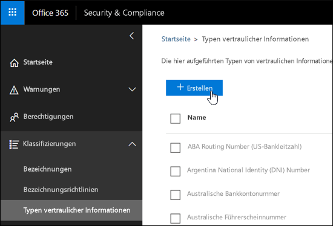
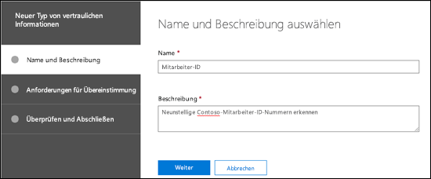
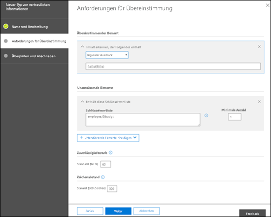
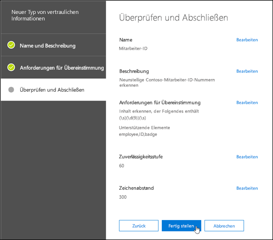
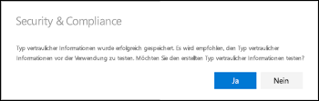
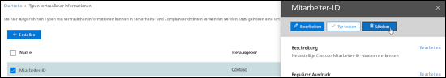
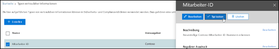
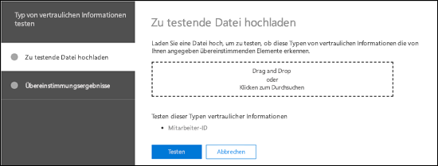
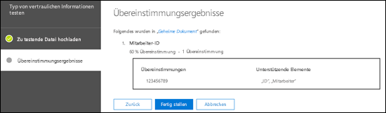

# Erstellen eines benutzerdefinierten Typs für vertrauliche InformationenCreate a custom sensitive information type

Die Verhinderung von Datenverlust (Data Loss Prevention, DLP) in Office 365 umfasst zahlreiche integrierte [Typen vertraulicher Informationen](what-the-sensitive-information-types-look-for.md), die Sie in DLP-Richtlinien verwenden können. Diese integrierten Typen unterstützen Sie beim Erkennen und Schützen von Kreditkartennummern, Bankkontonummern, Reisepassnummern und mehr.Data loss prevention (DLP) in Office 365 includes many built-in [sensitive information types](what-the-sensitive-information-types-look-for.md) that are ready for you to use in your DLP policies. These built-in types can help identify and protect credit card numbers, bank account numbers, passport numbers, and more. 

Wenn Sie jedoch verschiedene Typen vertraulicher Informationen identifizieren und schützen müssen, zum Beispiel Mitarbeiter-IDs oder Projektnummern, die ein für Ihre Organisation spezifisches Format verwenden, können Sie einen benutzerdefinierten Typ für vertrauliche Informationen erstellen.But if you need to identify and protect a different type of sensitive information (for example, employee IDs or project numbers that uses a format specific to your organization) you can create a custom sensitive information type.

Die grundlegenden Bestandteile eines benutzerdefinierten Typs für vertrauliche Informationen sind wie folgt:The fundamental parts of a custom sensitive information type are:

- **Primäres Muster**: Mitarbeiter-ID-Nummer, Projektnummern usw. Dieses wird in der Regel durch einen regulären Ausdruck (RegEx) gekennzeichnet, kann aber auch eine Liste von Schlüsselwörtern sein.**Primary pattern**: employee ID numbers, project numbers, etc. This is typically identified by a regular expression (RegEx), but it can also be a list of keywords.

- **Zusätzliche Nachweise**: Angenommen, Sie suchen nach einer neunstelligen Mitarbeiter-ID-Nummer. Nicht alle neunstelligen ID-Nummern sind Mitarbeiter-ID-Nummern, Sie können daher nach zusätzlichem Text suchen: Schlüsselwörter wie „Mitarbeiter“, „Ausweis“, „ID“ oder andere Textmuster basierend auf zusätzlichen regulären Ausdrücken. Diese Nachweise (auch bezeichnet als _unterstützende_ oder _bestätigende_ Nachweise) erhöhen die Wahrscheinlichkeit, dass die neunstellige Nummer, die in Inhalten gefunden wird, auch wirklich eine Mitarbeiter-ID-Nummer ist.**Additional evidence**: Suppose you're looking for a nine-digit employee ID number. Not all nine-digit numbers are employee ID numbers, so you can look for additional text: keywords like "employee", "badge", "ID", or other text patterns based on additional regular expressions. This supporting evidence (also known as _supporting_ or _corroborative_ evidence) increases the likelihood that nine-digit number found in content is really an employee ID number.

- **Zeichenabstand**: Je näher sich das primäre Muster an den unterstützenden Nachweisen befindet, desto größer ist die Wahrscheinlichkeit, dass die gefundenen Inhalte den von Ihnen gesuchten Inhalten entsprechen. Sie können den Zeichenabstand zwischen dem primären Muster und den unterstützenden Nachweisen angeben (auch als _Näherungsfenster_ bezeichnet), wie in der folgenden Abbildung dargestellt:**Character proximity**: It makes sense that the closer the primary pattern and the supporting evidence are to each other, the more likely the detected content is going to be what you're looking for. You can specify the character distance between the primary pattern and the supporting evidence (also known as the _proximity window_) as shown in the following diagram:

    

- **Zuverlässigkeitsgrad**: Je mehr unterstützende Nachweise Sie haben, desto höher die Wahrscheinlichkeit, dass eine Übereinstimmung die vertraulichen Informationen enthält, die Sie suchen. Sie können höhere Zuverlässigkeitsstufen für Übereinstimmungen zuweisen, die gefunden werden, indem Sie mehr Nachweise verwenden.**Confidence level**: The more supporting evidence you have, the higher the likelihood that a match contains the sensitive information you're looking for. You can assign higher levels of confidence for matches that are detected by using more evidence.

  Wenn eine Übereinstimmung gefunden wurde, gibt ein Muster eine Anzahl und einen Zuverlässigkeitsgrad zurück, die bzw. den Sie in den Bedingungen Ihrer DLP-Richtlinien verwenden können. Wenn Sie eine Bedingung zum Erkennen eines Typs vertraulicher Informationen zu einer DLP-Richtlinie hinzufügen, können Sie die Anzahl und den Zuverlässigkeitsgrad wie in der folgenden Abbildung dargestellt bearbeiten:When satisfied, a pattern returns a count and confidence level, which you can use in the conditions in your DLP policies. When you add a condition for detecting a sensitive information type to a DLP policy, you can edit the count and confidence level as shown in the following diagram:

    

Zum Erstellen von benutzerdefinierten Typen für vertrauliche Informationen im Office 365 Security & Compliance Center stehen Ihnen die folgenden Optionen zur Verfügung:To create custom sensitive information types in the Office 365 Security & Compliance Center, you have the following options:

- **Verwenden der Benutzeroberfläche**: Diese Methode ist schneller und einfacher, aber Sie haben weniger Konfigurationsoptionen als bei PowerShell. Im restlichen Thema werden diese Verfahren beschrieben.**Use the UI**: This method is easier and faster, but you have less configuration options than PowerShell. The rest of this topic describes these procedures.

- **Verwenden von PowerShell**: Diese Methode setzt voraus, dass Sie zuerst eine XML-Datei erstellen (bezeichnet als _Regelpaket_), die einen oder mehrere Typen von vertraulichen Informationen enthält. Sie verwenden dann PowerShell, um das Regelpaket zu importieren (das Importieren des Regelpakets ist einfach im Vergleich zum Erstellen des Regelpakets). Diese Methode ist wesentlich komplexer als die Verwendung der Benutzeroberfläche, aber Sie haben mehr Konfigurationsoptionen. Anweisungen finden Sie unter [Erstellen eines benutzerdefinierten Typs für vertrauliche Informationen in Office 365 Security & Compliance Center PowerShell](create-a-custom-sensitive-information-type-in-scc-powershell.md).**Use PowerShell**: This method requires that you first create an XML file (called a _rule package_) that contains one or more sensitive information types, and then you use PowerShell to import the rule package (importing the rule package is trivial compared to creating the rule package. This method is much more complex than the UI, but you have more configuration options. For instructions, see [Create a custom sensitive information type in Office 365 Security & Compliance Center PowerShell](create-a-custom-sensitive-information-type-in-scc-powershell.md).

Die wichtigsten Unterschiede werden in der folgenden Tabelle näher erläutert:The key differences are described in the following table:

|**Benutzerdefinierte Typen für vertrauliche Informationen in der Benutzeroberfläche****Custom sensitive information types in the UI**|**Benutzerdefinierte Typen für vertrauliche Informationen in PowerShell****Custom sensitive information types in PowerShell**|
|:-----|:-----|
|Name und Beschreibung sind in einer Sprache.Name and Description are in one language.|Unterstützt mehrere Sprachen für Name und Beschreibung.Supports multiple languages for Name and Description.|
|Unterstützt ein Muster.Supports one pattern.|Unterstützt mehrere Muster.Supports multiple patterns.|
|Unterstützende Nachweise können Folgendes sein:Supporting evidence can be:  • Reguläre Ausdrücke• Regular expressions  • Schlüsselwörter• Keywords  • Schlüsselwörterbücher• Keyword dictionaries|Unterstützende Nachweise können Folgendes sein:Supporting evidence can be:  • Reguläre Ausdrücke• Regular expressions  • Schlüsselwörter• Keywords  • Schlüsselwörterbücher• Keyword dictionaries  • [Integrierte DLP-Funktionen](what-the-dlp-functions-look-for.md)• [Built-in DLP functions](what-the-dlp-functions-look-for.md)|
|Benutzerdefinierte Typen vertraulicher Informationen werden zum Regelpaket namens Microsoft.SCCManaged.CustomRulePack hinzugefügt.Custom sensitive information types are added to the rule package named Microsoft.SCCManaged.CustomRulePack|Sie können bis zu 10 Regelpakete erstellen, die benutzerdefinierten Typen vertraulicher Informationen enthalten.You can create up to 10 rule packages that contain custom sensitive information types.|
|Die Musterübereinstimmung erfordert die Erkennung des primären Musters und aller unterstützenden Nachweise (der implizite UND-Operator wird verwendet).Pattern match requires the detection of the primary pattern and all supporting evidence (the implicit AND operator is used).|Die Musterübereinstimmung erfordert die Erkennung des primären Musters und einer konfigurierbaren Menge unterstützender Nachweise (implizite UND- und ODER-Operatoren können verwendet werden).Pattern match requires the detection of the primary pattern and a configurable amount of supporting evidence (implicit AND and OR operators can be used).|

## Was sollten Sie wissen, bevor Sie beginnen?What do you need to know before you begin?

- Informationen zum Öffnen des Security & Compliance Center finden Sie unter [Wechseln zum Office 365 Security & Compliance Center](go-to-the-securitycompliance-center.md).To open the Security & Compliance Center, see [Go to the Office 365 Security & Compliance Center](go-to-the-securitycompliance-center.md).

- Benutzerdefinierte Typen für vertrauliche Informationen erfordern Kenntnisse über reguläre Ausdrücke (RegEx). Weitere Informationen über das Modul Boost.RegEx (vormals als RegEx++ bezeichnet), das für die Textverarbeitung verwendet wird, finden Sie unter [Boost.Regex 5.1.3](https://www.boost.org/doc/libs/1_68_0/libs/regex/doc/html/).Custom sensitive information types require familiarity with regular expressions (RegEx). For more information about the Boost.RegEx (formerly known as RegEx++) engine that's used for processing the text, see [Boost.Regex 5.1.3](https://www.boost.org/doc/libs/1_68_0/libs/regex/doc/html/).

  Der Kundendienst und Support von Microsoft kann beim Bereitstellen von benutzerdefinierten Definitionen für die Inhaltsübereinstimmung (Erstellen benutzerdefinierter Klassifizierungen oder Muster für reguläre Ausdrücke) keine Unterstützung anbieten. Die Supportmitarbeiter können eingeschränkten Support für das Feature bereitstellen (z. B. Bereitstellen von Mustern für reguläre Ausdrücke zu Testzwecken oder Hilfestellung bei der Problembehandlung eines bestehenden Musters für reguläre Ausdrücke, das nicht wie erwartet ausgelöst wird), es können jedoch keine Zusicherungen dahingehend gegeben werden, dass benutzerdefinierte Entwicklungen für die Inhaltsübereinstimmung Ihre Anforderungen oder Verpflichtungen erfüllen.Microsoft Customer Service & Support can't assist with providing custom content-matching definitions (creating custom classifications or regular expression patterns). Support engineers can provide limited support for the feature (for example, providing sample regular expression patterns for testing purposes, or assisting with troubleshooting an existing regular expression pattern that's not triggering as expected), but can't provide assurances that any custom content-matching development will fulfill your requirements or obligations.

- DLP verwendet den Suchcrawler zum Erkennen und Klassifizieren vertraulicher Informationen in SharePoint Online- und OneDrive for Business-Websites. Um Ihren neuen benutzerdefinierten Typ vertraulicher Informationen in vorhandenen Inhalten zu identifizieren, muss der Inhalt erneut durchforstet werden. Inhalte werden basierend auf einem Zeitplan erneut durchforstet, Sie können aber Inhalte für eine Websitesammlung, eine Liste oder eine Bibliothek manuell erneut durchforsten. Weitere Informationen finden Sie unter [Manuelles Anfordern einer Durchforstung und erneutes Indizieren einer Website, einer Bibliothek oder einer Liste](https://docs.microsoft.com/sharepoint/crawl-site-content).DLP uses the search crawler to identify and classify sensitive information in SharePoint Online and OneDrive for Business sites. To identify your new custom sensitive information type in existing content, the content must be recrawled. Content is recrawled based on a schedule, but you can manually recrawl content for a site collection, list, or library. For more information, see [Manually request crawling and re-indexing of a site, a library or a list](https://docs.microsoft.com/sharepoint/crawl-site-content).

## Erstellen von benutzerdefinierten Typen für vertrauliche Informationen im Security & Compliance CenterCreate custom sensitive information types in the Security & Compliance Center

Wechseln Sie im Security & Compliance Center zu **Klassifizierungen** \> **Typen vertraulicher Informationen**, und klicken Sie auf **Erstellen**.In the Security & Compliance Center, go to **Classifications** \> **Sensitive info types** and click **Create**.

Die Einstellungen sind selbsterklärend und werden auf der entsprechenden Seite des Assistenten erläutert:The settings are fairly self-evident, and are explained on the associate page of the wizard:

- **Name****Name**

- **Beschreibung****Description**

- **Näherung****Proximity**

- **Zuverlässigkeitsstufe****Confidence level**

- **Primäres Muster-Element** (Schlüsselwörter, reguläre Ausdrücke oder Wörterbuch)**Primary pattern element** (keywords, regular expression, or dictionary)

- Optionale Elemente für **unterstützende Muster** (Schlüsselwörter, reguläre Ausdrücke oder Wörterbuch) und einen entsprechenden Wert für **Mindestkosten**.Optional **Supporting pattern elements** (keywords, regular expression, or dictionary) and a corresponding **Minimum cost** value.

Sehen Sie sich das folgende Szenario an: Sie möchten einen benutzerdefinierten Typ für vertrauliche Informationen, der neunstellige Mitarbeiternummern in Inhalten erkennt, zusammen mit den Schlüsselwörtern „Mitarbeiter“, „ID“ und „Ausweis“. Um diesen benutzerdefinierten Typ für vertrauliche Information zu erstellen, führen Sie die folgenden Schritte aus:Here's a scenario: You want a custom sensitive information type that detects 9-digit employee numbers in content, along with the keywords "employee" "ID" and "badge". To create this custom sensitive information type, do the following steps:

1. Wechseln Sie im Security & Compliance Center zu **Klassifizierungen** \> **Typen vertraulicher Informationen**, und klicken Sie auf **Erstellen**.In the Security & Compliance Center, go to **Classifications** \> **Sensitive info types** and click **Create**.

    

2. Geben Sie auf der Seite **Namen und Beschreibung auswählen**, die geöffnet wird, die folgenden Werte ein:In the **Choose a name and description** page that opens, enter the following values:

  - **Name**: Mitarbeiter-ID.**Name**: Employee ID.

  - **Beschreibung**: Neunstellige Contoso-Mitarbeiter-ID-Nummern erkennen.**Description**: Detect nine-digit Contoso employee ID numbers.

    

    Klicken Sie nach Abschluss des Vorgangs auf **Weiter**.When you're finished, click **Next**.

3. Klicken Sie auf der Seite **Anforderungen für Übereinstimmung** auf **Element hinzufügen**, um die folgenden Einstellungen zu konfigurieren:In the **Requirements for matching** page that opens, click **Add an element** configure the following settings:

    - **Inhalt erkennen, der Folgendes enthält**:**Detect content containing**:
 
      a. Klicken Sie auf die Option, dass **eines der folgenden Elemente enthalten sein muss**, und wählen Sie **Regulärer Ausdruck** aus.a. Click **Any of these** and select **Regular expression**.

      b. Geben Sie in dem Feld für den regulären Ausdruck `(\s)(\d{9})(\s)` ein (neunstellige Zahlen umgeben von einem Leerzeichen).b. In the regular expression box, enter `(\s)(\d{9})(\s)` (nine-digit numbers surrounded by white space).
  
    - **Unterstützende Elemente**: Klicken Sie auf **Unterstützende Elemente hinzufügen**, und wählen Sie **Enthält die folgende Schlüsselwortliste** aus.**Supporting elements**: Click **Add supporting elements** and select **Contains this keyword list**.

    - Konfigurieren Sie in dem Bereich **Enthält die folgende Schlüsselwortliste**, der angezeigt wird, die folgenden Einstellungen:In the **Contains this keyword list** area that appears, configure the following settings:

      - **Schlüsselwortliste**: Geben Sie den folgenden Wert ein: Mitarbeiter,ID,Ausweis.**Keyword list**: Enter the following value: employee,ID,badge.

      - **Mindestanzahl**: Behalten Sie den Standardwert 1 bei.**Minimum count**: Leave the default value 1.

    - Behalten Sie den Standardwert 60 für den **Zuverlässigkeitsgrad** bei.Leave the default **Confidence level** value 60. 

    - Behalten Sie den Standardwert 300 für den **Zeichenabstand** bei.Leave the default **Character proximity** value 300.

    

    Klicken Sie nach Abschluss des Vorgangs auf **Weiter**.When you're finished, click **Next**.

4. Überprüfen Sie auf der Seite **Überprüfen und Abschließen** die Einstellungen, und klicken Sie auf **Fertig stellen**.On the **Review and finalize** page that opens, review the settings and click **Finish**.

    

5. Auf der nächsten Seite werden Sie aufgefordert, den neuen benutzerdefinierten Typ für vertrauliche Informationen zu testen. Klicken Sie dazu auf **Ja**. Weitere Informationen finden Sie unter [Testen von benutzerdefinierten Typen für vertrauliche Information im Security & Compliance Center](#test-custom-sensitive-information-types-in-the-security--compliance-center). Um die Regel später zu testen, klicken Sie auf **Nein**.The next page encourages you to test the new custom sensitive information type by clicking **Yes**. For more information, see [Test custom sensitive information types in the Security & Compliance Center](#test-custom-sensitive-information-types-in-the-security--compliance-center). To test the rule later, click **No**.

    

### Woher wissen Sie, dass dieses Verfahren erfolgreich war?How do you know this worked?

Um sicherzustellen, dass Sie einen neuen Typ für vertrauliche Informationen erstellt haben, führen Sie einen der folgenden Schritte aus:To verify that you've successfully created a new sensitive information type, do any of the following steps:

  - Wechseln Sie zu **Klassifizierungen** \> **Typen vertraulicher Informationen**, und bestätigen Sie, dass der neue benutzerdefinierte Typ für vertrauliche Informationen aufgeführt ist.Go to **Classifications** \> **Sensitive info types** and verify the new custom sensitive information type is listed.

  - Testen Sie den neuen benutzerdefinierten Typ für vertrauliche Informationen. Weitere Informationen finden Sie unter [Testen von benutzerdefinierten Typen für vertrauliche Informationen im Security & Compliance Center](#test-custom-sensitive-information-types-in-the-security--compliance-center).Test the new custom sensitive information type. For more information, see [Test custom sensitive information types in the Security & Compliance Center](#test-custom-sensitive-information-types-in-the-security--compliance-center).

## Ändern von benutzerdefinierten Typen für vertrauliche Information im Security & Compliance CenterModify custom sensitive information types in the Security & Compliance Center

**Hinweise**:**Notes**:

- Sie können nur benutzerdefinierte Typen für vertrauliche Informationen ändern; integrierte Typen vertraulicher Informationen können nicht geändert werden. Sie können aber PowerShell verwenden, um integrierte Typen vertraulicher Informationen zu exportieren, diese anzupassen und sie als benutzerdefinierte Typen vertraulicher Informationen zu importieren. Weitere Informationen finden Sie unter [Anpassen eines integrierten benutzerdefinierten Typs für vertrauliche Informationen](customize-a-built-in-sensitive-information-type.md).You can only modify custom sensitive information types; you can't modify built-in sensitive information types. But you can use PowerShell to export built-in custom sensitive information types, customize them, and import them as custom sensitive information types. For more information, see [Customize a built-in sensitive information type](customize-a-built-in-sensitive-information-type.md).

- Sie können nur benutzerdefinierte Typen für vertrauliche Informationen ändern, die Sie in der Benutzeroberfläche erstellt haben. Wenn Sie das [PowerShell-Verfahren](create-a-custom-sensitive-information-type-in-scc-powershell.md) zum Importieren eines Regelpakets für benutzerdefinierte Typen für vertrauliche Informationen verwendet haben, erhalten Sie eine Fehlermeldung.You can only modify custom sensitive information types that you created in the UI. If you used the [PowerShell procedure](create-a-custom-sensitive-information-type-in-scc-powershell.md) to import a custom sensitive information type rule package, you'll get an error.

Wechseln Sie im Security & Compliance Center zu **Klassifizierungen** \> **Typen vertraulicher Informationen**, und wählen Sie den benutzerdefinierten Typ vertraulicher Informationen aus, den Sie ändern möchten. Klicken Sie anschließend auf **Bearbeiten**.In the Security & Compliance Center, go to **Classifications** \> **Sensitive info types**, select the custom sensitive information type that you want to modify, and then click **Edit**.

  

Hier stehen die gleichen Optionen wie beim Erstellen des benutzerdefinierten Typs für vertrauliche Informationen im Security & Compliance Center zur Verfügung. Weitere Informationen finden Sie unter [Erstellen von benutzerdefinierten Typen für vertrauliche Informationen im Security & Compliance Center](#create-custom-sensitive-information-types-in-the-security--compliance-center).The same options are available here as when you created the custom sensitive information type in the Security & Compliance Center. For more information, see [Create custom sensitive information types in the Security & Compliance Center](#create-custom-sensitive-information-types-in-the-security--compliance-center).

### Woher wissen Sie, dass dieses Verfahren erfolgreich war?How do you know this worked?

Um sicherzustellen, dass Sie einen neuen Typ für vertrauliche Informationen erfolgreich geändert haben, führen Sie einen der folgenden Schritte aus:To verify that you've successfully modified a sensitive information type, do any of the following steps:

  - Wechseln Sie zu **Klassifizierungen** \> **Typen vertraulicher Informationen**, um die Eigenschaften des geänderten benutzerdefinierten Typs vertraulicher Informationen zu überprüfen.Go to **Classifications** \> **Sensitive info types** to verify the properties of the modified custom sensitive information type. 

  - Testen Sie den geänderten benutzerdefinierten Typ für vertrauliche Informationen. Weitere Informationen finden Sie unter [Testen von benutzerdefinierten Typen für vertrauliche Informationen im Security & Compliance Center](#test-custom-sensitive-information-types-in-the-security--compliance-center).Test the modified custom sensitive information type. For more information, see [Test custom sensitive information types in the Security & Compliance Center](#test-custom-sensitive-information-types-in-the-security--compliance-center).

## Entfernen von benutzerdefinierten Typen für vertrauliche Informationen im Security & Compliance CenterRemove custom sensitive information types in the Security & Compliance Center 

**Hinweise**:**Notes**:

- Sie können nur benutzerdefinierte Typen für vertrauliche Informationen entfernen; Sie können keine integrierten Typen vertraulicher Informationen entfernen.You can only remove custom sensitive information types; you can't remove built-in sensitive information types.

- Bevor Sie einen benutzerdefinierten Typ für vertrauliche Informationen entfernen, überprüfen Sie, dass keine DLP-Richtlinien oder Exchange-Nachrichtenflussregeln (auch bezeichnet als Transportregeln) mehr auf den Typ vertraulicher Informationen verweisen.Before your remove a custom sensitive information type, verify that no DLP policies or Exchange mail flow rules (also known as transport rules) still reference the sensitive information type.

1. Wechseln Sie im Security & Compliance Center zu **Klassifizierungen** \> **Typen vertraulicher Informationen**, und wählen Sie einen oder mehrere benutzerdefinierte Typen vertraulicher Informationen aus, die Sie entfernen möchten.In the Security & Compliance Center, go to **Classifications** \> **Sensitive info types** and select one or more custom sensitive information types that you want to remove.

2. Klicken Sie in dem Fenster, das geöffnet wird, auf **Löschen** (oder auf **Typen vertraulicher Informationen löschen**, wenn Sie mehrere ausgewählt haben).In the fly-out that opens, click **Delete** (or **Delete sensitive info types** if you selected more than one).

    

3. Klicken Sie in der angezeigten Warnmeldung auf **Ja**.In the warning message that appears, click **Yes**.

### Woher wissen Sie, dass dieses Verfahren erfolgreich war?How do you know this worked?

Um sicherzustellen, dass Sie einen benutzerdefinierten Typ vertraulicher Informationen erfolgreich entfernt haben, wechseln Sie zu **Klassifizierungen** \> **Typen vertraulicher Informationen**, und bestätigen Sie, dass der benutzerdefinierte Typ vertraulicher Informationen nicht mehr aufgeführt ist.To verify that you've successfully removed a custom sensitive information type, go to **Classifications** \> **Sensitive info types** to verify the custom sensitive information type is no longer listed.

## Testen von benutzerdefinierten Typen für vertrauliche Informationen im Security & Compliance CenterTest custom sensitive information types in the Security & Compliance Center

1. Wechseln Sie im Security & Compliance Center zu **Klassifizierungen** \> **Typen vertraulicher Informationen**.In the Security & Compliance Center, go to **Classifications** \> **Sensitive info types**.

2. Wählen Sie einen oder mehrere benutzerdefinierte Typen vertraulicher Informationen aus, die Sie testen möchten. Klicken Sie in dem Fenster, das geöffnet wird, auf **Typ testen** (oder auf **Typen vertraulicher Informationen testen**, wenn Sie mehrere ausgewählt haben).Select one or more custom sensitive information types to test. In the fly-out that opens, click **Test type** (or **Test sensitive info types** if you selected more than one).

    

3. Laden Sie auf der Seite **Zu testende Datei hochladen**, die geöffnet wird, per Drag & Drop ein zu testendes Dokument hoch, oder klicken Sie auf **Durchsuchen**, und wählen Sie eine Datei aus.On the **Upload file to test** page that opens, upload a document to test by dragging and dropping a file or by clicking **Browse** and selecting a file.

    

4. Klicken Sie auf die Schaltfläche **Testen**, um das Dokument auf Musterübereinstimmungen in der Datei zu testen.Click the **Test** button to test the document for pattern matches in the file.

5. Klicken Sie auf der Seite **Übereinstimmungsergebnisse** auf **Fertig stellen**.On the **Match results** page, click **Finish**.

    