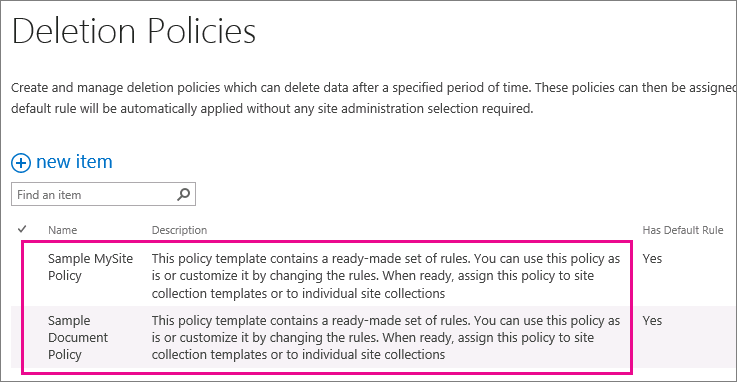
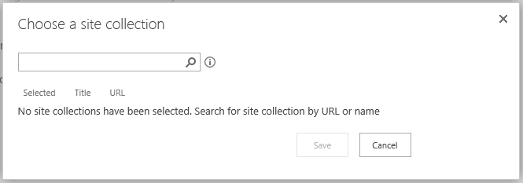

# Erstellen einer DokumentlöschrichtlinieCreate a document deletion policy

> [!IMPORTANT]
> Vorwärts verschoben, es wird empfohlen, dass Sie eine Aufbewahrungsrichtlinie oder in das Wertpapier erstellt Etiketten verwenden &amp; Compliance Center anstelle einer dokumentlöschrichtlinie. Dokumentlöschrichtlinien werden weiterhin parallel zu Aufbewahrungsrichtlinien funktionieren, aber wenn Sie müssen beibehalten oder Löschen von Inhalt an einer beliebigen Stelle in Office 365, es wird empfohlen, dass Sie eine Aufbewahrungsrichtlinie zu verwenden. Weitere Informationen finden Sie unter [Verwendung einer Aufbewahrungsrichtlinie anstelle dieser Features](retention-policies.md#use-a-retention-policy-instead-of-these-features).Moving forward, we recommend that you use a retention policy or labels created in the Security &amp; Compliance Center instead of a document deletion policy. Document deletion policies will continue to work side by side with retention policies, but if you need to retain or delete content anywhere in Office 365, we recommend that you use a retention policy. For more information, see [Use a retention policy instead of these features](retention-policies.md#use-a-retention-policy-instead-of-these-features). 
  
Organisationen müssen häufig Dokumente aufgrund von Konformitäts-, rechtlicher und anderer Bestimmungen für einen bestimmten Zeitraum aufbewahren. Wenn Dokumente aber länger als nötig aufbewahrt werden, kann dies für die Organisation rechtliche Folgen haben.Organizations are often required to retain documents for a certain period of time due to compliance, legal, or other regulations. However, retaining documents for longer than required can expose the organization to legal risk.
  
Sie können mit einer dokumentlöschrichtlinie proaktiv Risiko reduzieren, durch das Löschen von Dokumenten in einer Website nach einem bestimmten Zeitraum – beispielsweise Dokumente löschen in der Benutzer OneDrive for Business-Websites fünf Jahre nach die Dokumente erstellt wurden.With a document deletion policy, you can proactively reduce risk by deleting documents in a site after a specific period of time—for example, you can delete documents in users' OneDrive for Business sites five years after the documents were created. 
  
Nach dem Erstellen einer Dokumentlöschrichtlinie können Sie sie einer Vorlage für Websitesammlung zuweisen, damit die Richtlinie für alle Websitesammlungen, die aus dieser Vorlage erstellt werden, verfügbar ist. Sie können außerdem einer bestimmten Websitesammlung eine Richtlinie zuweisen, die alle Richtlinien, die der Vorlage für diese Websitesammlung möglicherweise schon zugewiesen wurden, außer Kraft setzt.After you create a document deletion policy, you can assign it to a site collection template, so that the policy is available to all site collections created from that template. You can also assign a policy to a specific a site collection, which overrides any policies that may have been assigned to the template for that site collection.
  

  
## RichtlinienvorlagenPolicy templates

Sie können eine Dokumentlöschrichtlinie von Grund auf neu erstellen oder eine unserer Beispielrichtlinien verwenden. Im Compliance Policy Center finden Sie Beispielrichtlinien, die Sie entweder sofort verwenden oder als Ausgangsbasis verwenden und umbenennen oder ändern können.You can create a document deletion policy from scratch, or you can use one of the sample policies. The Compliance Policy Center includes sample policies that you can use as is, or you can use them as a starting point and then rename or modify them.
  

  
## BeispieleExamples of how to use document deletion policies

Eine Websitesammlung oder einer Vorlage für Websitesammlung kann eine weitere Richtlinien zugewiesen, und jeweils die Richtlinien kann eine oder mehrere Regeln verwendet. Allerdings kann nur eine Richtlinie, die pro Website aktiv ist, und kann nur eine Löschregel, die zu einem beliebigen Zeitpunkt für die Bibliotheken, die innerhalb der Website aktiv ist.A site collection or a site collection template can have one more policies assigned to it, and each of those policies can have one or more rules. However, there can be only one policy that's active per site, and there can be only one deletion rule that's active at any time for the libraries within the site.
  

  
Außerdem können Sie eine Richtlinie als obligatorisch oder Standard und eine Löschregel als Standardregel auswählen:In addition, you can select a policy as mandatory or default, and you can select a deletion rule as a default rule: 
  
- **Obligatorische Richtlinie** Wenn eine Richtlinie als obligatorisch gekennzeichnet ist, kann nur eine Richtlinie zur Websitesammlung oder Vorlage zugewiesen werden. Die Richtlinie als Standard markiert werden muss und auf alle Websites angewendet wird. Websitebesitzer können nicht aus der Richtlinie aufheben.**Mandatory policy**When a policy is marked as mandatory, only one policy can be assigned to the site collection or template. The policy must be marked as default and will be applied to all sites. Site owners cannot opt out of the policy.
    
- **Standardrichtlinie** Wenn eine Richtlinie als Standard festgelegt wird, ist die Richtlinie auf allen Websites, die sie zugewiesen wurde keine Aktion erforderlich Websitebesitzer automatisch aktiv.**Default policy**When a policy is set as default, the policy is automatically active in all sites that it's assigned to with no action required by site owner.
    
- **Standardregel** Wenn eine Löschregel als Standard festgelegt wird, wird sie automatisch auf alle Bibliotheken auf den Websites angewendet, die die Richtlinie verwenden.**Default rule**When a deletion rule is set as default, it is automatically applied to all libraries in the sites that use the policy.
    
Die folgenden Beispiele erläutern, wann Sie möglicherweise eine obligatorische Richtlinie oder Standardrichtlinien und -regeln verwenden sollten.The following examples explain when you might want to use a mandatory policy or default policies and rules.
  
### Beispiel 1: Anwenden einer einzelnen Richtlinie mit einer einzelnen Regel auf eine Vorlage für WebsitesammlungExample 1: Apply a single policy with a single rule to a site collection template

Angenommen, Sie möchten eine Dokumentlöschrichtlinie für eine vielfältige Reihe von unstrukturierten Inhalten erzwingen, z. B. alle Websites von OneDrive for Business oder alle Teamwebsites. Wenn Sie sicherstellen möchten, dass eine einzelne Dokumentlöschrichtlinie auf allen Websites aktiv ist, die von einer Vorlage für Websitesammlung erstellt wurde, können Sie wie folgt vorgehen:You may want to enforce a document deletion policy across a broad range of unstructured content, such as all OneDrive for Business sites or all team sites. If you want to ensure that a single document deletion policy is active in all sites created from a site collection template, you can:
  
1. Erstellen Sie eine einzelne Richtlinie mit einer einzelnen Standardlöschregel.Create a single policy with a single default deletion rule.
    
2. Legen Sie die Richtlinie als obligatorisch und Standard fest.Set the policy as mandatory and default.
    
3. Weisen Sie die Richtlinie einer Vorlage für Websitesammlung zu.Assign the policy to a site collection template.
    
In diesem Beispiel wird die Standardlöschregel auf alle Bibliotheken in allen Websitesammlungen angewendet, die aufgrund der Vorlage erstellt wurden, und die Websitebesitzer können die Richtlinie nicht abwählen. Dies ist die einfachste Möglichkeit, um eine Dokumentlöschrichtlinie umfassend und strikt zu erzwingen.In this example, the default deletion rule will be applied to all libraries in all site collections created from the template, and site owners cannot opt out of the policy. This is the simplest way to broadly and rigidly enforce a document deletion policy.
  

  
### Beispiel 2: Anwenden einer einzelnen Richtlinie mit mehreren Regeln auf eine Vorlage für WebsitesammlungExample 2: Apply a single policy with several rules to a site collection template

Websitebesitzer wissen oft am besten, welche Art von Inhalten ihre Website enthält, sodass Sie Websitebesitzern die Auswahl der für ihre Website am besten geeigneten Löschregel ermöglichen können. Sie können auch zulassen, dass Websitebesitzer die Richtlinie ganz abwählen.Site owners often know best what type of content their site contains, so you may choose to allow site owners to select the deletion rule that best applies to their site. You may also want to allow site owners to opt out of a policy entirely.
  
Auch dann können Sie die Richtlinien noch zentral erstellen und verwalten. Sie können auch eine Richtlinie und Regel als den Standard auswählen, sodass eine Richtlinie so lange aktiv ist, bis der Websitebesitzer eine andere auswählt oder die Richtlinie abwählt. Wenn Sie Websitebesitzern diese Flexibilität bieten möchten, können Sie wie folgt vorgehen:At the same time, you can still centrally create and manage the policies. You can also select one policy and rule as the default, so that a policy is always in effect until the site owner chooses a different one or opts out. If you want to provide such flexibility to site owners, you can:
  
1. Erstellen Sie eine einzelne Richtlinie mit mehreren Löschregeln, und legen Sie eine Regel als den Standard fest.Create a single policy with several deletion rules, and set one rule as the default.
    
2. Legen Sie die Richtlinie als die Standardrichtlinie fest.Set the policy as the default policy.
    
3. Weisen Sie die Richtlinie einer Vorlage für Websitesammlung zu.Assign the policy to a site collection template.
    
Websitebesitzer können eine der alternativen Löschregeln auswählen, die Richtlinie abwählen oder nichts unternehmen und die Standardrichtlinie und -regel übernehmen.Site owners can select one of the alternate deletion rules, opt out of the policy, or do nothing and be subject to the default policy and rule.
  

  
### Beispiel 3: Anwenden mehrerer Richtlinien mit mindestens einer Regel auf eine WebsitesammlungExample 3: Apply several policies with one or more rules to a site collection

In diesem Beispiel haben Websitebesitzer die höchste Flexibilität, weil sie aus mehreren Richtlinien auswählen und nach der Auswahl einer Richtlinie oft aus mehreren Regeln auswählen können. Eine Richtlinie und eine Regel sind als der Standard festgelegt, sodass eine Richtlinie so lange aktiv ist, bis der Websitebesitzer eine andere auswählt oder die Richtlinie abwählt. Beachten Sie Folgendes: Wenn Sie keine Richtlinie und Regel als Standard festlegen, sind auf der Website keine Richtlinien oder Regeln für die Dokumentbibliotheken aktiv, bis der Websitebesitzer eine Aktion durchführt, um sie auszuwählen und anzuwenden.This example provides the maximum flexibility to site owners because they can choose from several policies, and after selecting a policy they can often choose from several rules. One policy and rule are set as default, so that a policy is always in effect until the site owner chooses a different one or opts out. Note that if you do not set a policy and rule as the default, then no policies or rules will be active for the document libraries in the site until the site owner takes action to select and apply them.
  
Im Unterschied zu den vorherigen beiden Beispielen werden diese Richtlinien einer bestimmten Websitesammlung zugewiesen, nicht der Vorlage für Websitesammlung. Die Richtlinien können also gezielter für den Inhalt in einer bestimmten Websitesammlung angepasst werden.Unlike the previous two examples, these policies are assigned to a specific site collection — not the site collection template. This means the policies can be more specifically tailored for the content in a specific site collection.
  
Richtlinien und Regeln werden vererbt. Websitebesitzer können für ihre Website eine Richtlinie und Regel auswählen, und alle Unterwebsites erben die Richtlinie von der übergeordneten Website. Ein Besitzer einer Unterwebsite kann aber die Vererbung aufheben, indem er eine andere Richtlinie und Regel auswählt, die wiederum für alle Unterwebsites gilt, bis die Vererbung wieder aufgehoben wird.Policies and rules are inherited. Site owners can select a policy and rule for their site, and all subsites inherit the policy from the parent. However, an owner of a subsite can break inheritance by selecting a different policy and rule, which in turn applies to all subsites until inheritance is broken again.
  
Um dieses Szenario einzurichten, können Sie wie folgt vorgehen:To set up this scenario, you can:
  
1. Erstellen Sie mehrere Richtlinien, die jeweils mindestens eine Regel enthalten.Create several policies that each contains one or more rules.
    
2. Legen Sie eine Richtlinie und Regel als den Standard fest.Set a policy and rule as the default.
    
3. Weisen Sie die Richtlinien einer bestimmten Websitesammlung zu.Assign the policies to a specific site collection.
    
Außerdem werden die Richtlinien und Regeln für eine bestimmte Websitesammlung angepasst, bei der die Websitebesitzer die Vererbung aufheben können, indem sie die Richtlinie und Regel auswählen, die sich am besten für ihre Website eignet.In addition, the policies and rules are tailored to a specific site collection, where site owners can break inheritance by selecting the policy and rule that best applies to their site.
  

  
## Erstellen einer DokumentlöschrichtlinieCreate a document deletion policy

1. In der Office-365Security &amp; Compliance Center, navigieren Sie zu **Verwaltung der Daten** \> **Aufbewahrung**. Klicken Sie unter **Löschen**klicken Sie auf **dokumentlöschrichtlinien für SharePoint Online und OneDrive für Unternehmen verwalten**. Die Löschung Richtlinie Dokumentcenter wird in einer neuen Registerkarte Browser geöffnet.In the Office 365Security &amp; Compliance Center, navigate to **Data management** \> **Retention**. Under **Delete**, click **Manage document deletion policies for SharePoint Online and OneDrive for Business**. The Document Deletion Policy Center opens in a new browser tab.
    
    Beim ersten Sie über die Sicherheit navigieren &amp; Compliance Center an das Dokumentcenter der Löschvorgang Richtlinie, das Richtlinie Center automatisch für Sie erstellt. Alternativ können Sie das Richtlinie Center, [Erstellen der Websitesammlung](http://go.microsoft.com/fwlink/p/?LinkID=404342) und **Compliance Richtlinie Center** auf der Registerkarte **Enterprise** manuell erstellen.The first time you navigate from the Security &amp; Compliance Center to the Document Deletion Policy Center, the policy center is automatically created for you. Alternatively, you can manually create the policy center by [creating the site collection](http://go.microsoft.com/fwlink/p/?LinkID=404342) and choosing **Compliance Policy Center** on the **Enterprise** tab. 
    
2. Wählen Sie **Löschrichtlinien**aus.Choose **Deletion Policies**.
    
    
  
3. Wählen Sie **Neues Element** aus.Choose **new item**.
    
4. Geben Sie einen Namen und eine Beschreibung für die Richtlinie ein. Websitebesitzer wählen eine Richtlinie möglicherweise aufgrund ihres Namens und ihrer Beschreibung aus. Geben Sie daher ausreichende Informationen an, damit sie die richtige Richtlinie auswählen können.Enter a policy name and description. Site owners may be selecting a policy for their site based on this name and description, so include enough information for them to choose the correct policy.
    
5. Um eine Regel zu erstellen, wählen Sie **Neu** aus.To create a rule, choose **New**.
    
6. Geben Sie einen Namen ein, und wählen Sie die folgenden Optionen aus:Enter a name and choose the following options:
    
  - Wählen Sie aus, ob die Regel dauerhaft löschen von Dokumenten oder in den Papierkorb zu löschen. Der Papierkorb stellt ein Sicherheitsnetz endgültigen, bevor ein Element aus einer Website dauerhaft gelöscht wird. Weitere Informationen zu den Papierkorb finden Sie unter [den Papierkorb leeren oder Wiederherstellen die Dateien](http://go.microsoft.com/fwlink/p/?LinkID=404348).Choose whether the rule will permanently delete documents or delete them to the Recycle Bin. The Recycle Bin provides a second-stage safety net before an item is permanently deleted from a site. For more information about the Recycle Bin, see [Empty the Recycle Bin or restore your files](http://go.microsoft.com/fwlink/p/?LinkID=404348).
    
  - Wählen Sie aus, ob das Löschdatum ab dem Datum der Dokumenterstellung oder der letzten Dokumentänderung berechnet werden soll.Choose whether the deletion date is calculated from the date when a document was created or last modified.
    
  - Geben Sie die Anzahl der Tage, Monate oder Jahre als Zeitraum ein, nach dem das Dokument gelöscht werden soll.Enter a number of days, months, or years as the time period after which a document will be deleted.
    
  - Wählen Sie, ob die Regel eine Standardregel ist. Die erste Regel, die Sie erstellen, wird automatisch als die Standardregel festgelegt. Eine Standardregel wird automatisch auf alle Bibliotheken auf den Websites angewendet, die die Richtlinie verwenden.Choose whether the rule is a default rule. The first rule that you create is automatically set as the default rule. A default rule is automatically applied to all libraries in the sites that use the policy.
    

  
7. Klicken Sie auf **Speichern**.Click **Save**.
    
8. Erstellen Sie zusätzliche Regeln, wenn Sie zulassen möchten, dass Websitebesitzer andere Regeln auswählen und auf ihre Website anwenden können. Falls vorhanden wird die Standardregel angewendet, wenn der Websitebesitzer keine Aktion durchführt.Create additional rules if you want site owners to be able to choose different rules to apply to their site. The default rule, if any, will be applied if the site owner takes no action.
    
9. Um eine Regel von einer Richtlinie zu entfernen, wählen Sie die Regel aus, klicken Sie auf **Löschen**, und klicken Sie dann auf **OK**.To remove a rule from a policy, select the rule, click **Delete**, and then click **OK**.
    
    > [!NOTE]
    > Wenn Sie eine Regel löschen und die Richtlinie kein Standardregel enthält, wird keine Regel wird für diese Richtlinie aktiviert werden – also keine Dokumente werden gelöscht.If you delete a rule, and the policy does not contain a default rule, then no rule will be in effect for that policy—in other words, no documents will be deleted. 
  

  
## Zuweisen der Dokumentlöschrichtlinie zu einer Vorlage für WebsitesammlungAssign the document deletion policy to a site collection template

Durch das Zuweisen einer Richtlinie zu einer Vorlage für Websitesammlung machen Sie die Richtlinie für alle Websitesammlungen verfügbar, die aufgrund dieser Vorlage erstellt werden, einschließlich bereits vorhandener und künftiger Websitesammlungen.By assigning a policy to a site collection template, you make the policy available to all site collections created from that template, including both existing site collections and site collections created in the future.
  
Es ist wichtig zu verstehen, dass den Zeitraum an, die für ein Dokument angegeben Löschung die Zeit bedeutet seit das Dokument wurde erstellt oder geändert werden, nicht die Zeit, da die Richtlinie zugewiesen wurde. Wenn Sie die Richtlinie zum ersten Mal zuweisen, werden alle Dokumente in der Website ausgewertet, und wenn sie die Kriterien erfüllen, gelöscht werden. Dies gilt für alle vorhandenen Dokumente, nicht nur neue Dokumente erstellt wurden, da die Richtlinie zugewiesen wurde.It's important to understand that the time period specified for a document deletion policy means the time since the document was created or modified, not the time since the policy was assigned. When you assign the policy for the first time, all documents in the site are evaluated and, if they meet the criteria, they will be deleted. This applies to all existing documents, not just new documents created since the policy was assigned.
  
1. In das Wertpapier &amp; Compliance Center, navigieren Sie zu **Verwaltung der Daten** \> **Aufbewahrung**. Klicken Sie unter **Löschen**klicken Sie auf **dokumentlöschrichtlinien für SharePoint Online und OneDrive für Unternehmen verwalten**. Die Löschung Richtlinie Dokumentcenter wird in einer neuen Registerkarte Browser geöffnet.In the Security &amp; Compliance Center, navigate to **Data management** \> **Retention**. Under **Delete**, click **Manage document deletion policies for SharePoint Online and OneDrive for Business**. The Document Deletion Policy Center opens in a new browser tab.
    
2. Wählen Sie **Richtlinienzuweisungen für Vorlagen**.Choose **Policy Assignments for Templates**.
    
    
  
3. Wählen Sie **Neues Element** aus.Choose **new item**.
    
4. Führen Sie einen der folgenden Schritte aus:Do one of the following:
    
  - Um die Richtlinie einer Vorlage für Websitesammlung wie die Teamwebsitevorlage zuzuweisen, wählen Sie **Vorlage für Websitesammlung zuweisen** aus, und wählen Sie die Vorlage für Websitesammlung.To assign the policy to a site collection template such as the Team Site template, select **Assign to site collection template**, and then select the site collection template.
    
  - Um Benutzern ein Drive für Unternehmen die Richtlinie zuzuweisen, wählen Sie in der **OneDrive for Business-Vorlage zuweisen**, unten hervorgehobene.To assign the policy to users' One Drive for Business, choose **Assign to OneDrive for Business Template**, highlighted below.
    
    > [!NOTE]
    > Wenn Sie eine Richtlinie zu einer Vorlage für Websitesammlung zuweisen, wird die Richtlinie für bereits vorhandene Websitesammlungen, die aufgrund dieser Vorlage erstellt wurden, und für künftige Websitesammlungen verfügbar gemacht.When you assign a policy to a site collection template, that policy will be available both to existing site collections created from that template and to site collections created in the future. 
  

  
5. Klicken Sie auf **Speichern**.Click **Save**.
    
    > [!NOTE]
    > Jede Vorlage kann nur ein Satz von Richtlinien zugewiesen haben. Wenn Sie eine Fehlermeldung ausgegeben sehen, dass diese Vorlage bereits Richtlinien zugewiesen ist, wählen Sie **Abbrechen** \> im linken Navigationsbereich **auf Websitesammlung zuweisen** \> wählen Sie eine Websitesammlung anzeigen und verwalten den Satz von Richtlinien, die bereits sind zugewiesen.Each template can have only one set of policies assigned to it. If you see an error saying that this template already has policies assigned to it, choose **Cancel** \> **Assign to Site Collection** in the left navigation \> select a site collection to view and manage the set of policies that are already assigned. 
  
6. Wählen Sie **Zugewiesene Richtlinien verwalten**, wählen Sie die Richtlinien, die Sie zuweisen möchten, und wählen Sie dann, ob eine Richtlinie die Standardrichtlinie ist. Wenn Sie eine Standardrichtlinie festlegen, haben alle Websites zugewiesen, die Richtlinie automatisch die Richtlinie active keine Aktion Websitebesitzer erforderlich.Choose **Manage Assigned Policies**, select the policies that you want to assign, and then choose whether one policy is the default policy. When you set a default policy, all sites assigned to the policy automatically have the policy active with no action required by site owner.
    
    
  
7. Klicken Sie auf **Speichern**.Click **Save**.
    
8. Wenn Sie die Richtlinie auf allen Websites erzwingen möchten, ohne zuzulassen, dass Websitebesitzer sie abwählen können, wählen Sie **Richtlinie als obligatorisch kennzeichnen** aus. Wenn Sie eine Richtlinie als obligatorisch kennzeichnen, kann einer Vorlage für Websitesammlung nur diese einzelne Richtlinie zugewiesen werden. Die Richtlinie muss außerdem als Standard gekennzeichnet werden.If you want to enforce the policy on all sites without allowing site owners to opt out, choose **Mark Policy as Mandatory**. When you make a policy mandatory, only that single policy can be assigned to the site collection template. The policy must also be marked as default.
    
    Wenn diese Option ausgegraut ist, wählen Sie **Zugewiesene Richtlinien verwalten** aus, und stellen Sie sicher, dass mindestens eine Richtlinie zugewiesen und als Standard festgelegt ist.If this option is grayed out, choose **Manage Assigned Policies** and make sure that at least one policy is assigned and set as default. 
    
9. Klicken Sie auf **Speichern**.Click **Save**.
    
## Zuweisen der Dokumentlöschrichtlinie zu einer WebsitesammlungAssign the document deletion policy to a site collection

Durch das Zuweisen einer Richtlinie zu einer bestimmten Websitesammlung machen Sie die Richtlinie nur für diese Websitesammlung verfügbar. Sie können also Richtlinien näher an den Inhalt in der Websitesammlung anpassen. Außerdem setzen Richtlinien, die einer bestimmten Websitesammlung zugewiesen werden, alle Richtlinien, die der Vorlage für diese Websitesammlung zugewiesen sind, außer Kraft. Zum Beispiel setzt eine Richtlinie, die der (aus der Teamwebsitevorlage erstellten) Websitesammlung Vertriebsabteilung zugewiesen ist, alle Richtlinien außer Kraft, die der Teamwebsitevorlage zugewiesen sind.By assigning a policy to a specific site collection, you make the policy available only to that specific site collection. This means you can tailor policies more closely to the content in the site collection. Also, policies assigned to a specific site collection will override any policies that are assigned to the template for that site collection. For example, a policy assigned to the Sales Department site collection (created from the Team Site template) will override any policies assigned to the Team Site template.
  
Es ist wichtig zu verstehen, dass den Zeitraum an, die für ein Dokument angegeben Löschung die Zeit bedeutet seit das Dokument wurde erstellt oder geändert werden, nicht die Zeit, da die Richtlinie zugewiesen wurde. Wenn Sie die Richtlinie zum ersten Mal zuweisen, werden alle Dokumente in der Website ausgewertet, und wenn sie die Kriterien erfüllen, gelöscht werden. Dies gilt für alle vorhandenen Dokumente, nicht nur neue Dokumente erstellt wurden, da die Richtlinie zugewiesen wurde.It's important to understand that the time period specified for a document deletion policy means the time since the document was created or modified, not the time since the policy was assigned. When you assign the policy for the first time, all documents in the site are evaluated and, if they meet the criteria, they will be deleted. This applies to all existing documents, not just new documents created since the policy was assigned.
  
1. In das Wertpapier &amp; Compliance Center, navigieren Sie zu **Verwaltung der Daten** \> **Aufbewahrung**. Wählen Sie unter **Löschen** **dokumentlöschrichtlinien für SharePoint Online und OneDrive für Unternehmen verwalten**. Die Löschung Richtlinie Dokumentcenter wird in einer neuen Registerkarte Browser geöffnet.In the Security &amp; Compliance Center, navigate to **Data management** \> **Retention**. Under **Delete**, choose **Manage document deletion policies for SharePoint Online and OneDrive for Business**. The Document Deletion Policy Center opens in a new browser tab.
    
2. Wählen Sie **Richtlinienzuweisungen für Websitesammlungen**.Choose **Policy Assignments for Site Collections**.
    
    
  
3. Wählen Sie **Neues Element** aus.Choose **new item**.
    
4. Wählen Sie **eine Websitesammlung auswählen**. Suchen nach Name oder URL der Websitesammlung, wählen Sie die Websitesammlung aus, und klicken Sie auf **Speichern**.Choose **Choose a site collection**. Search for the site collection by name or URL, select the site collection and click **Save**.
    
    > [!NOTE]
    > Jede Websitesammlung kann nur ein Satz von Richtlinien zugewiesen haben. Wenn eine Fehlermeldung ausgegeben, dass diese Websitesammlung bereits Richtlinien zugewiesen hat angezeigt wird, wählen Sie **Abbrechen** \> **Websitesammlung zuweisen** und wählen Sie eine Websitesammlung anzeigen und verwalten den Satz von Richtlinien, die bereits zugewiesen sind.Each site collection can have only one set of policies assigned to it. If you see an error saying that this site collection already has policies assigned to it, choose **Cancel** \> **Assign to Site Collection** and select a site collection to view and manage the set of policies that are already assigned. 
  

  
5. Wählen Sie **Zugewiesene Richtlinien verwalten**, wählen Sie die Richtlinien, die Sie zuweisen möchten, und wählen Sie dann, ob eine Richtlinie die Standardrichtlinie ist. Wenn Sie eine Standardrichtlinie festlegen, haben alle Websites zugewiesen, die Richtlinie automatisch die Richtlinie active keine Aktion Websitebesitzer erforderlich.Choose **Manage Assigned Policies**, select the policies that you want to assign, and then choose whether one policy is the default policy. When you set a default policy, all sites assigned to the policy automatically have the policy active with no action required by site owner.
    
    
  
6. Klicken Sie auf **Speichern**.Click **Save**.
    
7. Wenn Sie die Richtlinie auf allen Websites erzwingen möchten, ohne zuzulassen, dass Websitebesitzer sie abwählen können, wählen Sie **Richtlinie als obligatorisch kennzeichnen** aus. Wenn Sie eine Richtlinie als obligatorisch kennzeichnen, kann einer Websitesammlung nur diese einzelne Richtlinie zugewiesen werden. Die Richtlinie muss außerdem als Standard gekennzeichnet werden.If you want to enforce the policy on all sites without allowing site owners to opt out, choose **Mark Policy as Mandatory**. When you make a policy mandatory, only that single policy can be assigned to the site collection. The policy must also be marked as default.
    
    Wenn diese Option ausgegraut ist, wählen Sie **Zugewiesene Richtlinien verwalten** aus, und stellen Sie sicher, dass mindestens eine Richtlinie zugewiesen und als Standard festgelegt ist.If this option is grayed out, choose **Manage Assigned Policies** and make sure that at least one policy is assigned and set as default. 
    
8. Klicken Sie auf **Speichern**.Click **Save**.
    
## Löschen einer RichtlinienzuweisungDelete a policy assignment

Wenn Sie eine Zuweisung löschen, werden die zugewiesenen Richtlinien nicht mehr auf die Websites in der Websitesammlung oder Vorlage für Websitesammlung angewendet.When you delete an assignment, the assigned policies will no longer apply to any sites in the site collection or site collection template.
  
1. In das Wertpapier &amp; Compliance Center, navigieren Sie zu **Verwaltung der Daten** \> **Aufbewahrung**. Wählen Sie unter **Löschen** **dokumentlöschrichtlinien für SharePoint Online und OneDrive für Unternehmen verwalten**. Die Löschung Richtlinie Dokumentcenter wird in einer neuen Registerkarte Browser geöffnet.In the Security &amp; Compliance Center, navigate to **Data management** \> **Retention**. Under **Delete**, choose **Manage document deletion policies for SharePoint Online and OneDrive for Business**. The Document Deletion Policy Center opens in a new browser tab.
    
2. Wählen Sie entweder **Richtlinienzuweisungen für Vorlagen ** oder **Richtlinienzuweisungen für Websitesammlungen**.Choose either **Policy Assignments for Templates** or **Policy Assignments for Site Collections**.
    
3. Wählen Sie das zuweisungselement aus, und klicken Sie auf **Element löschen**.Select the assignment item and click **Delete Item**.
    
    
  
## Löschen einer RichtlinieDelete a policy

Eine Richtlinie, die verwendet wird, kann nicht gelöscht werden. Bevor Sie eine Richtlinie löschen können, müssen Sie zuerst alle Zuordnungen für Websitesammlungen und Vorlagen, die die Richtlinie einbeziehen löschen – finden Sie im vorherigen Abschnitt.You can't delete a policy that's in use. Before you can delete a policy, you first need to delete all assignments to site collections and site collection templates that include that policy—see the previous section.
  
1. In das Wertpapier &amp; Compliance Center \> wählen Sie **datenverwaltung** \> **Aufbewahrung** im linken Navigationsbereich \> unter **Löschen** \> **Verwalten Dokument löschen von Richtlinien für SharePoint Online und OneDrive für Unternehmen**. Die Löschung Richtlinie Dokumentcenter wird in einer neuen Registerkarte Browser geöffnet.In the Security &amp; Compliance Center \> choose **Data management** \> **Retention** in the left navigation \> under **Delete** \> **Manage document deletion policies for SharePoint Online and OneDrive for Business**. The Document Deletion Policy Center opens in a new browser tab.
    
2. Wählen Sie ** Löschrichtlinien **.Choose ** Deletion Policies **.
    
    
  
3. Wählen Sie die Richtlinie aus.Select the policy.
    
4. Klicken Sie im Menüband \> Registerkarte **Elemente** \> **Richtlinie entfernen**.On the Ribbon \> **Items** tab \> **Remove Policy**.
    
    
  
5. Wenn die Richtlinie verwendet wird, werden Sie gefragt, ob Sie möchten die Richtlinie aus allen Websitesammlungen zu entfernen, auf dem sie verwendet wird. Wenn Sie sicher sind, wählen Sie **OK**.If the policy is in use, you'll be asked if you want to remove the policy from all of the site collections where it's being used. If you're sure, choose **OK**.
    
    
  
## Siehe auchSee also

[Übersicht über DokumentlöschrichtlinienOverview of document deletion policies](document-deletion-policies.md)

[Anwenden oder Entfernen einer Dokumentlöschrichtlinie für eine WebsiteApply or remove a document deletion policy for a site](apply-or-remove-a-document-deletion-policy-for-a-site.md)
 

