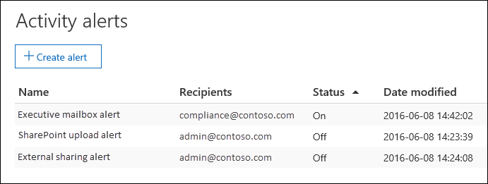

# Erstellen von Aktivitäts Warnungen in Office 365

Sie können eine Aktivitäts Warnung erstellen, die Ihnen eine e-Mail-Benachrichtigung sendet, wenn Benutzer bestimmte Aktivitäten in Office 365 ausführen. Aktivitäts Warnungen ähneln der Suche nach Ereignissen im Office 365-Überwachungsprotokoll, mit der Ausnahme, dass Sie eine e-Mail-Nachricht erhalten, wenn ein Ereignis für eine Aktivität, für die Sie eine Benachrichtigung erstellt haben, geschieht. 
  
 **Warum werden Aktivitäts Warnungen anstelle des Überwachungsprotokolls verwendet?** Möglicherweise gibt es bestimmte Arten von Aktivitäten oder Aktivitäten, die von bestimmten Benutzern ausgeführt werden, die Sie wirklich kennen möchten. Anstatt sich zu erinnern, das Überwachungsprotokoll für diese Aktivitäten durchsuchen zu müssen, können Sie Aktivitäts Warnungen verwenden, damit Office 365 Ihnen eine e-Mail-Nachricht sendet, wenn Benutzer diese Aktivitäten ausführen. Sie können beispielsweise eine Aktivitäts Warnung erstellen, die Sie benachrichtigt, wenn ein Benutzer Dateien in SharePoint löscht, oder Sie können eine Warnung erstellen, die Sie benachrichtigt, wenn ein Benutzer Nachrichten endgültig aus seinem Postfach löscht. Die an Sie gesendete e-Mail-Benachrichtigung enthält Informationen darüber, welche Aktivität ausgeführt wurde und welcher Benutzer Sie ausgeführt hat. 

> [!NOTE]
> Es wird empfohlen, Warnungsrichtlinien im Security and Compliance Center zu verwenden, anstatt neue Aktivitäts Warnungen zu erstellen. Warnungsrichtlinien bieten zusätzliche Funktionen wie die Möglichkeit, eine Warnungs Richtlinie zu erstellen, die eine Warnung auslöst, wenn ein beliebiger Benutzer eine bestimmte Aktivität ausführt, und Warnungen auf der Seite **Warnungen anzeigen** im Security and Compliance Center anzuzeigen. Weitere Informationen finden Sie unter [Warnungsrichtlinien](alert-policies.md).
  
## Bevor Sie beginnen

- Sie müssen die Organisations Konfigurationsdatei im Security & Compliance Center besitzen, um Aktivitäts Warnungen zu verwalten. Diese Rolle wird standardmäßig den Rollengruppen "Compliance-Administrator" und "Organisationsverwaltung" zugewiesen. Weitere Informationen zum Hinzufügen von Mitgliedern zu Rollengruppen finden Sie unter [Gewähren von Benutzern Zugriff auf das Security _AMP_ Compliance Center](grant-access-to-the-security-and-compliance-center.md).
    
- Bevor Sie Aktivitäts Warnungen verwenden können, müssen Sie (oder ein anderer Administrator) zunächst die Überwachungsprotokollierung für Ihre Organisation aktivieren. Klicken Sie dazu auf der Seite **Aktivitäts Benachrichtigungen** auf **Benutzer-und Administrator Aktivität starten** . (Wenn dieser Link nicht angezeigt wird, wurde die Überwachung für Ihre Organisation aktiviert.) Sie können die Überwachung auch auf der Seite **Überwachungsprotokoll Suche** im Security & Compliance Center aktivieren (zur **** \> Such **Überwachungsprotokoll**Suche). Sie müssen dies nur einmal für Ihre Organisation tun.
  
- Sie können Warnungen für die gleichen Aktivitäten erstellen, nach denen Sie im Office 365-Überwachungsprotokoll suchen können. Im Abschnitt [Weitere Informationen](#more-information) finden Sie eine Liste allgemeiner Szenarien (und die zu überwachenden Aktivitäten), für die Sie Warnungen erstellen können. 
    
- Sie können die Seite **Aktivitäts Benachrichtigungen** im Security _AMP_ Compliance Center verwenden, um nur Warnungen für Aktivitäten zu erstellen, die von Benutzern ausgeführt werden, die im Adressbuch Ihrer Organisation aufgeführt sind. Sie können diese Seite nicht zum Erstellen von Benachrichtigungen für Aktivitäten verwenden, die von externen Benutzern ausgeführt werden, die nicht im Adressbuch aufgeführt sind. 
    
## Erstellen einer Aktivitäts Warnung

1. Wechseln Sie zu [https://protection.office.com/managealerts](https://protection.office.com/managealerts).
    
2. Melden Sie sich bei Office 365 mit Ihrem Geschäfts-, Schul- oder Unikonto an.
    
3. Klicken Sie  **neu**hinzufügen.

   Die Flyout-Seite zum Erstellen einer Aktivitäts Warnung wird angezeigt.

    
    
  
4. Füllen Sie die folgenden Felder aus, um eine Aktivitäts Warnung zu erstellen:
    
    a. **Name** : Geben Sie einen Namen für die Warnung ein. Warnungsnamen müssen innerhalb Ihrer Organisation eindeutig sein.
    
    b. **Beschreibung** (Optional): beschreiben Sie die Warnung, wie die Aktivitäten und Benutzer, die nachverfolgt werden, und die Benutzer, an die e-Mail-Benachrichtigungen gesendet werden. Beschreibungen bieten eine schnelle und einfache Möglichkeit zur Beschreibung des Zwecks der Warnung für andere Administratoren.
    
    c. **Warnungstyp** – stellen Sie sicher, dass die **benutzerdefinierte** Option ausgewählt ist. 

    d. **Diese Warnung senden, wenn** -klicken Sie auf **Diese Warnung senden, wenn** und konfigurieren Sie dann diese beiden Felder:
    
    - **Aktivitäten** -klicken Sie auf die Dropdownliste, um die Aktivitäten anzuzeigen, für die Sie eine Warnung erstellen können. Dies ist die gleiche Liste der Aktivitäten, die beim Durchsuchen des Office 365-Überwachungsprotokolls angezeigt wird. Sie können eine oder mehrere bestimmte Aktivitäten auswählen oder auf den Namen der Aktivitätsgruppe klicken, um alle Aktivitäten in der Gruppe auszuwählen. Eine Beschreibung dieser Aktivitäten finden Sie im Abschnitt "überwachte Aktivitäten" unter [Durchsuchen des Überwachungsprotokolls](search-the-audit-log-in-security-and-compliance.md#audited-activities). Wenn ein Benutzer eine der Aktivitäten ausführt, die Sie der Benachrichtigung hinzugefügt haben, wird eine e-Mail-Benachrichtigung gesendet. 
    
     - **Benutzer** – klicken Sie auf dieses Feld, und wählen Sie dann mindestens einen Benutzer aus. Wenn die Benutzer in diesem Feld die Aktivitäten ausführen, die Sie dem Feld **Aktivitäten** hinzugefügt haben, wird eine Warnung gesendet. Lassen Sie das Feld **Benutzer** leer, um eine Warnung zu senden, wenn ein Benutzer in Ihrer Organisation die durch die Warnung angegebenen Aktivitäten ausführt. 

    e. **Diese Warnung senden an** -klicken Sie auf **Diese Warnung senden**, und klicken Sie dann in das Feld **Empfänger** , und geben Sie einen Namen ein, um einen Benutzer hinzuzufügen, der eine e-Mail-Benachrichtigung erhält, wenn ein Benutzer (im Feld **Benutzer** angegeben) eine Aktivität ausführt (angegeben in der Feld **Aktivitäten** ). Beachten Sie, dass Sie standardmäßig der Liste der Empfänger hinzugefügt werden. Sie können Ihren Namen aus dieser Liste entfernen.
    
5. Klicken Sie auf **Speichern** , um die Warnung zu erstellen. 
    
    Die neue Warnung wird in der Liste auf der Seite **Aktivitäts Benachrichtigungen** angezeigt. 
    
    
  
    Der Status der Warnung ist **auf ein**festgelegt. Beachten Sie, dass die Empfänger, die eine e-Mail-Benachrichtigung erhalten, wenn eine Benachrichtigung gesendet wird, ebenfalls aufgeführt werden. 
  
## Deaktivieren einer Aktivitäts Warnung

Sie können eine Aktivitäts Warnung deaktivieren, sodass eine e-Mail-Benachrichtigung nicht gesendet wird. Nachdem Sie die Aktivitäts Warnung deaktiviert haben, wird Sie immer noch in der Liste der Aktivitäts Benachrichtigungen für Ihre Organisation angezeigt, und Sie können ihre Eigenschaften anzeigen.
  
1. Wechseln Sie zu [https://protection.office.com/managealerts](https://protection.office.com/managealerts).
    
2. Melden Sie sich bei Office 365 mit Ihrem Geschäfts-, Schul- oder Unikonto an.
    
3. Klicken Sie in der Liste der Aktivitäts Benachrichtigungen für Ihre Organisation auf die Warnung, die Sie deaktivieren möchten.
    
4. Klicken Sie auf der Seite **Benachrichtigung bearbeiten** auf die Option **bei** Umschaltfläche, um den Status in **aus**zu ändern, und klicken Sie dann auf **Speichern**.
    
    Der Status der Warnung auf den Seiten **Aktivitäts Benachrichtigungen** ist auf **aus**festgelegt. 
    
Wenn Sie eine Aktivitäts Warnung wieder aktivieren möchten, wiederholen Sie diese Schritte, und klicken Sie auf die Option **aus** , **** um den Status in ein zu ändern.
  
## Weitere Informationen

- Nachfolgend finden Sie ein Beispiel für die e-Mail-Benachrichtigung, die an die Benutzer gesendet wird, die im Security & Compliance Center unter " **Empfänger** " auf der Seite " **Aktivitäts Benachrichtigungen** " angegeben sind. 
    
    
  
- Im folgenden finden Sie einige allgemeine Dokument-und e-Mail-Aktivitäten, für die Sie Aktivitäts Benachrichtigungen erstellen können. In den Tabellen werden die Aktivität, der Name der Aktivität, für die eine Warnung erstellt werden soll, und der Name der Aktivitätsgruppe, in der die Aktivität aufgeführt ist, in der Dropdownliste **Aktivitäten** beschrieben. Eine vollständige Liste der Aktivitäten, für die Sie Aktivitäts Benachrichtigungen erstellen können, finden Sie im Abschnitt "überwachte Aktivitäten" unter [Durchsuchen des Überwachungsprotokolls](search-the-audit-log-in-security-and-compliance.md#audited-activities).
    
    > [!TIP]
    > Möglicherweise möchten Sie eine Aktivitäts Warnung für nur eine Aktivität erstellen, die von einem beliebigen Benutzer ausgeführt wird. Sie können auch eine Aktivitäts Warnung erstellen, die mehrere Aktivitäten verfolgt, die von einem oder mehreren Benutzern ausgeführt werden. 
  
    In der folgenden Tabelle sind einige allgemeine dokumentbezogene Aktivitäten in SharePoint oder OneDrive for Business aufgeführt.
    
    |**Wenn ein Benutzer dies tut...**|**Erstellen einer Warnung für diese Aktivität**|**Aktivitätsgruppe**|
    |:-----|:-----|:-----|
    |Zeigt ein Dokument auf einer Website an.    |Datei mit Zugriff    |Datei-und Ordner Aktivitäten    |
    |Bearbeitet oder ändert ein Dokument.    |Geänderte Datei    |Datei-und Ordner Aktivitäten    |
    |Freigabe eines Dokuments für einen Benutzer außerhalb Ihrer Organisation.    |Freigeben von Datei, Ordnern oder Websites    Und    Freigabeeinladung erstellt    Weitere Informationen finden Sie unter [Verwenden der Freigabe Überwachung im Office 365-Überwachungsprotokoll](use-sharing-auditing.md).    |Freigabe-und Zugriffs Anforderungs Aktivitäten    |
    |Lädt ein Dokument hoch oder lädt es herunter.    |HochgeLadene Datei    Und/oder    HeruntergeLadene Datei    |Datei-und Ordner Aktivitäten    |
    |Ändert die Zugriffsberechtigungen für eine Website.    |Geänderte Websiteberechtigungen    |Aktivitäten der Websiteverwaltung    |

    In der folgenden Tabelle sind einige gängige e-Mail-bezogene Aktivitäten in Exchange Online aufgeführt.

    |**Wenn ein Benutzer dies tut...**|**Erstellen einer Warnung für diese Aktivität**|**Aktivitätsgruppe**|
    |:-----|:-----|:-----|
    |Löscht (bereinigt) eine e-Mail-Nachricht dauerhaft aus dem Postfach.    |Gelöschte Nachrichten aus dem Postfach    | Exchange-Postfachaktivitäten    |
    |Sendet eine e-Mail-Nachricht von einem freigegebenen Postfach.    |Gesendete Nachricht unter Verwendung der Berechtigung "Senden als"    Und    Gesendete Nachricht mithilfe von "Senden im Auftrag von"-Berechtigungen    | Exchange-Postfachaktivitäten    |
   
- Sie können auch die Cmdlets **New-ActivityAlert** und **Set-ActivityAlert** in Security & Compliance Center PowerShell verwenden, um Aktivitäts Benachrichtigungen zu erstellen und zu bearbeiten. Beachten Sie Folgendes, wenn Sie diese Cmdlets zum Erstellen oder Bearbeiten von Aktivitäts Warnungen verwenden: 
    
  - Wenn Sie ein Cmdlet verwenden, um der Warnung eine Aktivität hinzuzufügen, die nicht in der Dropdownliste **Aktivitäten** aufgeführt ist, wird eine Meldung auf der Eigenschaftenseite für die Warnung angezeigt, die besagt, dass benutzerdefinierte Vorgänge in der Auswahl nicht aufgeführt sind. 
    
  - Ein guter Grund, die Cmdlets zum Erstellen oder Bearbeiten einer Aktivitäts Warnung zu verwenden, besteht darin, e-Mail-Benachrichtigungen an Personen außerhalb Ihrer Organisation zu senden. Dieser externe Benutzer wird in der Liste der Empfänger für die Warnung aufgeführt. Wenn Sie diesen externen Benutzer jedoch aus der Warnung entfernen, kann dieser Benutzer nicht über die Seite **Benachrichtigung bearbeiten** erneut der Benachrichtigung hinzugefügt werden. Sie müssen den externen Benutzer mithilfe des Cmdlets **Set-ActivityAlert** erneut hinzufügen oder das Cmdlet **New-ActivityAlert** verwenden, um den gleichen (oder anderen) externen Benutzer zu einer neuen Warnung hinzuzufügen. 
