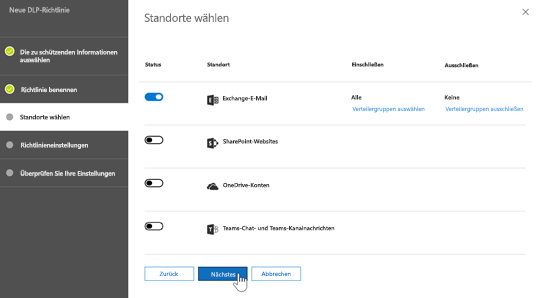
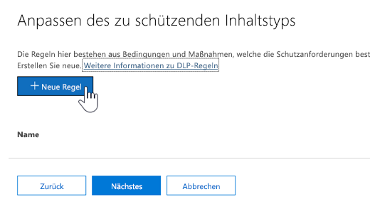
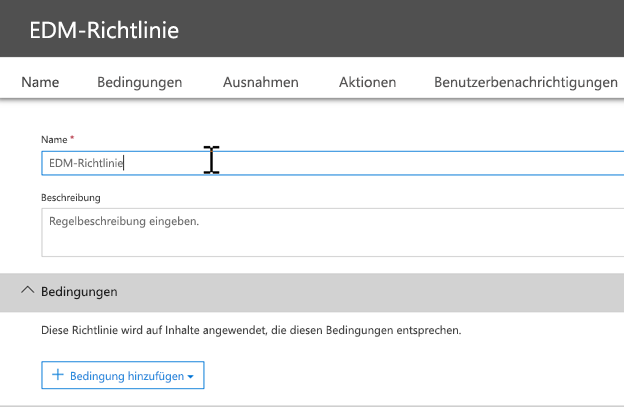
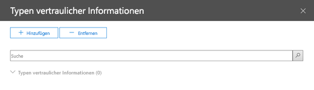

# <a name="create-custom-sensitive-information-types-with-exact-data-match-based-classification-preview"></a><span data-ttu-id="3af01-103">Erstellen benutzerdefinierter vertraulicher Informationstypen mit genauer Datenübereinstimmungsklassifizierung (Vorschau)</span><span class="sxs-lookup"><span data-stu-id="3af01-103">See Create a custom sensitive information type with Exact Data Match based classification (Preview).</span></span>

## <a name="overview"></a><span data-ttu-id="3af01-104">Übersicht</span><span class="sxs-lookup"><span data-stu-id="3af01-104">Overview</span></span>

<span data-ttu-id="3af01-105">[Benutzerdefinierte vertrauliche Informationstypen](custom-sensitive-info-types.md) werden verwendet, um zu verhindern, dass vertrauliche Informationen versehentlich oder unangemessen weitergegeben werden.</span><span class="sxs-lookup"><span data-stu-id="3af01-105">[Custom sensitive information types](custom-sensitive-info-types.md) are used to help prevent inadvertent or inappropriate sharing of sensitive information.</span></span> <span data-ttu-id="3af01-106">Als Administrator können Sie das Security & Compliance Center oder PowerShell verwenden, um einen benutzerdefinierten vertraulichen Informationstyp basierend auf Mustern, Nachweisen (Stichwörtern wie Mitarbeiter\*, \*Abzeichen, ID usw.), Zeichenabstand (wie nahe Nachweise sich an Zeichen in einem bestimmten Muster befinden) und Vertrauensstufen zu definieren.</span><span class="sxs-lookup"><span data-stu-id="3af01-106">As an administrator, you can use the [Security & Compliance Center](create-a-custom-sensitive-information-type.md) or [PowerShell](create-a-custom-sensitive-information-type-in-scc-powershell.md) to define a custom sensitive information type based on patterns, evidence (keywords such as *employee*, *badge*, *ID*, and so on), character proximity (how close evidence is to characters in a particular pattern), and confidence levels.</span></span> <span data-ttu-id="3af01-107">Solche benutzerdefinierten vertraulichen Informationstypen erfüllen die geschäftlichen Anforderungen vieler Organisationen.</span><span class="sxs-lookup"><span data-stu-id="3af01-107">Such custom sensitive information types meet business needs for many organizations.</span></span>

<span data-ttu-id="3af01-108">Was aber, wenn Sie einen benutzerdefinierten vertraulichen Informationstyp verwenden möchten, der genaue Datenwerte anstelle von Mustern und Näherungswerten verwendet?</span><span class="sxs-lookup"><span data-stu-id="3af01-108">But what if you wanted a custom sensitive information type that uses exact data values, instead of patterns and proximity?</span></span> <span data-ttu-id="3af01-109">Mit einer EDM-basierten Klassifizierung (genaue Datenübereinstimmung) können Sie einen benutzerdefinierten Informationstyp mit den folgenden Merkmalen erstellen:</span><span class="sxs-lookup"><span data-stu-id="3af01-109">With Exact Data Match (EDM)-based classification, you can create a custom sensitive information type that is designed to:</span></span>
- <span data-ttu-id="3af01-110">dynamisch und aktualisierbar;</span><span class="sxs-lookup"><span data-stu-id="3af01-110">be dynamic and refreshable;</span></span>
- <span data-ttu-id="3af01-111">höhere Skalierbarkeit;</span><span class="sxs-lookup"><span data-stu-id="3af01-111">be more scalable;</span></span>
- <span data-ttu-id="3af01-112">weniger falsch positive Ergebnisse;</span><span class="sxs-lookup"><span data-stu-id="3af01-112">result in fewer false-positives;</span></span>
- <span data-ttu-id="3af01-113">Arbeiten mit strukturierten vertraulichen Daten;</span><span class="sxs-lookup"><span data-stu-id="3af01-113">work with structured sensitive data;</span></span>
- <span data-ttu-id="3af01-114">vertrauliche Informationen sicherer behandeln; </span><span class="sxs-lookup"><span data-stu-id="3af01-114">handle sensitive information more securely; and</span></span>
- <span data-ttu-id="3af01-115">Verwendbarkeit mit mehreren Microsoft Cloud Services.</span><span class="sxs-lookup"><span data-stu-id="3af01-115">be used with several Microsoft cloud services.</span></span>


<span data-ttu-id="3af01-117">Die EDM-basierte Klassifikation ermöglicht es Ihnen, benutzerdefinierte vertrauliche Informationstypen zu erstellen, die sich auf genaue Werte in einer Datenbank mit vertraulichen Informationen beziehen.</span><span class="sxs-lookup"><span data-stu-id="3af01-117">EDM-based classification enables you to create custom sensitive information types that refer to exact values in a database of sensitive information.</span></span> <span data-ttu-id="3af01-118">Die Datenbank kann täglich oder wöchentlich aktualisiert werden und bis zu 10 Millionen Datenzeilen enthalten.</span><span class="sxs-lookup"><span data-stu-id="3af01-118">The database can be refreshed daily or weekly, and it can contain up to 10 million rows of data.</span></span> <span data-ttu-id="3af01-119">Mitarbeiter, Patienten oder Kunden kommen und gehen und Datensätze ändern sich, aber Ihre benutzerdefinierten vertraulichen Informationstypen bleiben aktuell und anwendbar.</span><span class="sxs-lookup"><span data-stu-id="3af01-119">So as employees, patients, or clients come and go, and records change, your custom sensitive information types remain current and applicable.</span></span> <span data-ttu-id="3af01-120">Darüber hinaus können Sie EDM-basierte Klassifikation mit Richtlinien verwenden, z. B. [Richtlinien zur Verhinderung von Datenverlust](data-loss-prevention-policies.md) (Data Loss Prevention, DLP) oder Microsoft Cloud App Security-Dateirichtlinien](https://docs.microsoft.com/cloud-app-security/data-protection-policies).</span><span class="sxs-lookup"><span data-stu-id="3af01-120">And, you can use EDM-based classification with policies, such as [data loss prevention policies](data-loss-prevention-policies.md) (DLP) or [Microsoft Cloud App Security file policies](https://docs.microsoft.com/cloud-app-security/data-protection-policies).</span></span>

## <a name="required-licenses-and-permissions"></a><span data-ttu-id="3af01-121">Erforderliche Lizenzen und Berechtigungen</span><span class="sxs-lookup"><span data-stu-id="3af01-121">Required licenses and permissions</span></span>

- <span data-ttu-id="3af01-122">Sie müssen ein globaler, Compliance- oder Exchange Online-Administrator sein, um die in diesem Artikel beschriebenen Aufgaben ausführen zu können.</span><span class="sxs-lookup"><span data-stu-id="3af01-122">You must be a global admin, compliance administrator, or Exchange Online administrator to perform the tasks described in this article.</span></span> <span data-ttu-id="3af01-123">Weitere Informationen über DLP-Berechtigungen finden Sie unter [Berechtigungen](data-loss-prevention-policies.md#permissions).</span><span class="sxs-lookup"><span data-stu-id="3af01-123">To learn more about DLP permissions, see [Permissions](data-loss-prevention-policies.md#permissions).</span></span>

- <span data-ttu-id="3af01-124">Nach allgemeiner Verfügbarkeit werden die EDM-basierten Klassifikation in den folgenden Abonnements berücksichtigt:</span><span class="sxs-lookup"><span data-stu-id="3af01-124">When generally available, EDM-based classification will be included in the following subscriptions:</span></span>
    - <span data-ttu-id="3af01-125">Office 365 E5</span><span class="sxs-lookup"><span data-stu-id="3af01-125">Office 365 Enterprise E5</span></span>
    - <span data-ttu-id="3af01-126">Microsoft 365 E5</span><span class="sxs-lookup"><span data-stu-id="3af01-126">Microsoft 365 E5</span></span>
    - <span data-ttu-id="3af01-127">Microsoft 365 Informationsschutz und Compliance</span><span class="sxs-lookup"><span data-stu-id="3af01-127">Microsoft 365 Information Protection and Compliance</span></span>
    - <span data-ttu-id="3af01-128">Erweiterte Compliance in Office 365</span><span class="sxs-lookup"><span data-stu-id="3af01-128">Office 365 Advanced Compliance</span></span>

> [!NOTE]
> <span data-ttu-id="3af01-129">**Die EDM-basierte Klassifikation ist derzeit in der Vorschau** für [DLP in Office 365](data-loss-prevention-policies.md) (mit Exchange Online und Microsoft Teams) und [Cloud App Security](https://docs.microsoft.com/cloud-app-security).</span><span class="sxs-lookup"><span data-stu-id="3af01-129">**EDM-based classification is currently in preview** for [DLP in Office 365](data-loss-prevention-policies.md) (with Exchange Online and Microsoft Teams) and [Cloud App Security](https://docs.microsoft.com/cloud-app-security).</span></span> <span data-ttu-id="3af01-130">Wenn in Ihrer Organisation [DLP-Funktionen](https://docs.microsoft.com/office365/servicedescriptions/exchange-online-protection-service-description/messaging-policy-and-compliance-servicedesc#data-loss-prevention-dlp) zur Verfügung stehen, können Sie die EDM-basierte Klassifikation ausprobieren.</span><span class="sxs-lookup"><span data-stu-id="3af01-130">If your organization has [DLP capabilities](https://docs.microsoft.com/office365/servicedescriptions/exchange-online-protection-service-description/messaging-policy-and-compliance-servicedesc#data-loss-prevention-dlp), you can try EDM-based classification.</span></span> <span data-ttu-id="3af01-131">Wenn Sie noch nicht an der Vorschau teilnehmen, wenden Sie sich an [Microsoft](https://resources.office.com/us-landing-spe-contactus.html?LCID=EN-US), um einzusteigen.</span><span class="sxs-lookup"><span data-stu-id="3af01-131">If you are not already participating in the preview, [contact Microsoft](https://resources.office.com/us-landing-spe-contactus.html?LCID=EN-US) to get started.</span></span> 

## <a name="the-work-flow-at-a-glance"></a><span data-ttu-id="3af01-132">Der Workflow auf einen Blick</span><span class="sxs-lookup"><span data-stu-id="3af01-132">The work flow at a glance</span></span>

|<span data-ttu-id="3af01-133">Phase</span><span class="sxs-lookup"><span data-stu-id="3af01-133">Phase</span></span>  |<span data-ttu-id="3af01-134">Anforderungen</span><span class="sxs-lookup"><span data-stu-id="3af01-134">What's needed</span></span>  |
|---------|---------|
|[<span data-ttu-id="3af01-135">Teil 1: Einrichten der EDM-basierten Klassifizierung</span><span class="sxs-lookup"><span data-stu-id="3af01-135">Part 1: Set up EDM-based classification</span></span>](#part-1-set-up-edm-based-classification)<br/><br/><span data-ttu-id="3af01-136">(je nach Bedarf)</span><span class="sxs-lookup"><span data-stu-id="3af01-136">(As needed)</span></span><br/><span data-ttu-id="3af01-137">- [Bearbeiten des Datenbankschemas](#editing-the-schema-for-edm-based-classification)</span><span class="sxs-lookup"><span data-stu-id="3af01-137">- [Edit the database schema](#editing-the-schema-for-edm-based-classification)</span></span> <br/><span data-ttu-id="3af01-138">- [Entfernen des Schemas](#removing-the-schema-for-edm-based-classification)</span><span class="sxs-lookup"><span data-stu-id="3af01-138">- [Remove the schema](#removing-the-schema-for-edm-based-classification)</span></span> |<span data-ttu-id="3af01-139">– Lesezugriff auf vertrauliche Daten</span><span class="sxs-lookup"><span data-stu-id="3af01-139">- Read access to the sensitive data</span></span><br/><span data-ttu-id="3af01-140">– Datenbankschema im XML-Format (Beispiel)</span><span class="sxs-lookup"><span data-stu-id="3af01-140">- Database schema in .xml format (example provided)</span></span><br/><span data-ttu-id="3af01-141">– Regelpaket im XML-Format (Beispiel)</span><span class="sxs-lookup"><span data-stu-id="3af01-141">- Rule package in .xml format (example provided)</span></span><br/><span data-ttu-id="3af01-142">– Administratorberechtigungen für das Security & Compliance Center (mithilfe von PowerShell)</span><span class="sxs-lookup"><span data-stu-id="3af01-142">- Admin permissions to the Security & Compliance Center (using PowerShell)</span></span> |
|[<span data-ttu-id="3af01-143">Teil 2: Indizieren und Hochladen vertraulicher Daten</span><span class="sxs-lookup"><span data-stu-id="3af01-143">Part 2: Index and upload the sensitive data</span></span>](#part-2-index-and-upload-the-sensitive-data)<br/><br/><span data-ttu-id="3af01-144">(je nach Bedarf)</span><span class="sxs-lookup"><span data-stu-id="3af01-144">(As needed)</span></span><br/>[<span data-ttu-id="3af01-145">Aktualisieren der Daten</span><span class="sxs-lookup"><span data-stu-id="3af01-145">Refresh the data</span></span>](#refreshing-your-sensitive-information-database) |<span data-ttu-id="3af01-146">– Benutzerdefinierte Sicherheitsgruppe und Benutzerkonto</span><span class="sxs-lookup"><span data-stu-id="3af01-146">- Custom security group and user account</span></span><br/><span data-ttu-id="3af01-147">– Lokaler Administratorzugriff auf den Computer mit dem EDM-Upload-Agent</span><span class="sxs-lookup"><span data-stu-id="3af01-147">- Local admin access to machine with EDM Upload Agent</span></span><br/><span data-ttu-id="3af01-148">– Lesezugriff auf vertrauliche Daten</span><span class="sxs-lookup"><span data-stu-id="3af01-148">- Read access to the sensitive data</span></span><br/><span data-ttu-id="3af01-149">– Prozess und Zeitplan für die Datenaktualisierung</span><span class="sxs-lookup"><span data-stu-id="3af01-149">- Process and schedule for refreshing the data</span></span>|
|[<span data-ttu-id="3af01-150">Teil 3: Verwenden der EDM-basierten Klassifizierung mit Ihren Microsoft Cloud Services</span><span class="sxs-lookup"><span data-stu-id="3af01-150">Part 3: Use EDM-based classification with your Microsoft cloud services</span></span>](#part-3-use-edm-based-classification-with-your-microsoft-cloud-services) |<span data-ttu-id="3af01-151">– Office 365-Abonnement mit DLP</span><span class="sxs-lookup"><span data-stu-id="3af01-151">- Office 365 subscription with DLP</span></span><br/><span data-ttu-id="3af01-152">– EDM-basiertes Klassifizierungsfeature aktiviert (in Vorschau)</span><span class="sxs-lookup"><span data-stu-id="3af01-152">- EDM-based classification feature enabled (in preview)</span></span> |

## <a name="part-1-set-up-edm-based-classification"></a><span data-ttu-id="3af01-153">Teil 1: Einrichten der EDM-basierten Klassifizierung</span><span class="sxs-lookup"><span data-stu-id="3af01-153">Part 1: Set up EDM-based classification</span></span>

<span data-ttu-id="3af01-154">Beim Einrichten und Konfigurieren der EDM-basierten Klassifizierung werden vertrauliche Daten im CSV-Format gespeichert, ein Schema für Ihre Datenbank mit vertraulichen Informationen definiert und ein Regelpaket erstellt. Anschließend werden das Schema und das Regelpaket hochgeladen.</span><span class="sxs-lookup"><span data-stu-id="3af01-154">Setting up and configuring EDM-based classification involves saving sensitive data in .csv format, defining a schema for your database of sensitive information, creating a rule package, and then uploading the schema and rule package.</span></span>

### <a name="define-the-schema-for-your-database-of-sensitive-information"></a><span data-ttu-id="3af01-155">Definieren des Schemas für Ihre Datenbank mit vertraulichen Informationen</span><span class="sxs-lookup"><span data-stu-id="3af01-155">Define the schema for your database of sensitive information</span></span>

1. <span data-ttu-id="3af01-156">Identifizieren Sie die vertraulichen Informationen, die Sie verwenden möchten.</span><span class="sxs-lookup"><span data-stu-id="3af01-156">Identify the KPIs that you want to use.</span></span> <span data-ttu-id="3af01-157">Exportieren Sie die Daten in eine App, wie z. B. Microsoft Excel, und speichern Sie die Datei im CSV-Format.</span><span class="sxs-lookup"><span data-stu-id="3af01-157">Export the data to an app, such as Microsoft Excel, and save the file in .csv format.</span></span> <span data-ttu-id="3af01-158">Die Datendatei kann Folgendes umfassen:</span><span class="sxs-lookup"><span data-stu-id="3af01-158">The data file can include:</span></span>

    - <span data-ttu-id="3af01-159">Bis zu 10 Millionen Zeilen vertraulicher Daten</span><span class="sxs-lookup"><span data-stu-id="3af01-159">Up to 10 million rows of sensitive data</span></span>
    - <span data-ttu-id="3af01-160">Bis zu 32 Spalten (Felder) pro Datenquelle</span><span class="sxs-lookup"><span data-stu-id="3af01-160">Up to 32 columns (fields) per data source</span></span>

2. <span data-ttu-id="3af01-161">Strukturieren Sie die vertraulichen Daten in der CSV-Datei so, dass die erste Zeile die Namen der für die EDM-basierte Klassifizierung verwendeten Felder enthält.</span><span class="sxs-lookup"><span data-stu-id="3af01-161">Structure the sensitive data in the .csv file such that the first row includes the names of the fields used for EDM-based classification.</span></span> <span data-ttu-id="3af01-162">Möglicherweise gibt es in Ihrer CSV-Datei Feldnamen, wie z. B. "SSN", "Geburtsdatum", "Vorname", "Nachname" usw.</span><span class="sxs-lookup"><span data-stu-id="3af01-162">In your .csv file, you might have field names, such as "ssn", "birthdate", "firstname", "lastname", and so on.</span></span> <span data-ttu-id="3af01-163">Im Beispiel nennen wir unsere CSV-Datei *PatientRecords.csv*, und die Spalten beinhalten *PatientID*, *MRN*, *lastname*, *FirstName*, *SSN* und mehr.</span><span class="sxs-lookup"><span data-stu-id="3af01-163">As an example, our .csv file is called *PatientRecords.csv*, and its columns include *PatientID*, *MRN*, *lastname*, *FirstName*, *SSN* and more.</span></span>

3. <span data-ttu-id="3af01-164">Definieren Sie das Schema für die Datenbank mit vertraulichen Informationen im XML-Format (ähnlich wie in unserem Beispiel unten).</span><span class="sxs-lookup"><span data-stu-id="3af01-164">Define the schema for the database of sensitive information in .xml format (similar to our example below).</span></span> <span data-ttu-id="3af01-165">Nennen Sie diese Schemadatei `edm.xml` und konfigurieren Sie sie so, dass für jede Spalte in der Datenbank eine Zeile mit der Syntax `<Field name="" unique="" searchable=""/>` verwendet wird.</span><span class="sxs-lookup"><span data-stu-id="3af01-165">Name this schema file `edm.xml`, and configure it such that for each column in the database, there is a line that uses the syntax `<Field name="" unique="" searchable=""/>`.</span></span> 

    - <span data-ttu-id="3af01-166">Verwenden Sie Spaltennamen für *Field name*-Werte.</span><span class="sxs-lookup"><span data-stu-id="3af01-166">Use column names for *Field name* values.</span></span>
    - <span data-ttu-id="3af01-167">Verwenden Sie *unique="true* für die Felder mit eindeutigen Werten (Sozialversicherungsnummern, Identifikationsnummern usw.), verwenden Sie andernfalls *unique = "false*".</span><span class="sxs-lookup"><span data-stu-id="3af01-167">Use *unique="true"* for the fields that contain unique values (Social Security numbers, identification numbers, etc.); otherwise, use *unique="false"*.</span></span>
    - <span data-ttu-id="3af01-168">Verwenden Sie *searchable = "true* für die Felder, die durchsuchbar sein sollen.</span><span class="sxs-lookup"><span data-stu-id="3af01-168">Use *searchable="true"* for the fields that you want to be searchable.</span></span> <span data-ttu-id="3af01-169">Geben Sie nicht mehr als fünf Felder pro Datenbank an, die durchsuchbar sein sollen.</span><span class="sxs-lookup"><span data-stu-id="3af01-169">Do not specify more than five fields per database to be searchable.</span></span> <span data-ttu-id="3af01-170">Für alle übrigen sollte gelten: *searchable="false"*.</span><span class="sxs-lookup"><span data-stu-id="3af01-170">All the rest should have *searchable="false"*.</span></span>  

    <span data-ttu-id="3af01-171">Im folgenden Beispiel definiert die XML-Datei das Schema für eine Datenbank mit Patientendatensätzen, wobei fünf Felder als durchsuchbar angegeben werden: *PatientID*, *MRN*, *SSN*, *Phone* und *DOB*.</span><span class="sxs-lookup"><span data-stu-id="3af01-171">As an example, the following .xml file defines the schema for a patient records database, with five fields specified as searchable: *PatientID*, *MRN*, *SSN*, *Phone*, and *DOB*.</span></span> 
    
    <span data-ttu-id="3af01-172">(Sie können das Beispiel kopieren, ändern und verwenden.)</span><span class="sxs-lookup"><span data-stu-id="3af01-172">(You can copy, modify, and use our example.)</span></span>
    
    <span data-ttu-id="3af01-173">\`\`\`<?xml version="1.0" encoding="utf-8"?> <EdmSchema xmlns="http://schemas.microsoft.com/office/2018/edm"></span><span class="sxs-lookup"><span data-stu-id="3af01-173"></span></span>
        <span data-ttu-id="3af01-174"><DataStore name="PatientRecords" description="Schema für Patientendatensätze</span><span class="sxs-lookup"><span data-stu-id="3af01-174"><DataStore name="PatientRecords" description="Schema for patient records</span></span>" version="1">
            <span data-ttu-id="3af01-175"><Field name="PatientID" unique="false" searchable="true" /> <Field name="MRN" unique="false" searchable="true" /></span><span class="sxs-lookup"><span data-stu-id="3af01-175"></span></span>
            <Field name="FirstName" unique="false" searchable="false" />
            <Field name="LastName" unique="false" searchable="false" />
            <Field name="SSN" unique="false" searchable="true" />
            <Field name="Phone" unique="false" searchable="true" />
            <Field name="DOB" unique="false" searchable="true" />
            <Field name="Gender" unique="false" searchable="false" />
            <Field name="Address" unique="false" searchable="false" />
        </DataStore>
    </EdmSchema>
    ```

4. [Connect to Office 365 Security & Compliance Center PowerShell](https://docs.microsoft.com/powershell/exchange/office-365-scc/connect-to-scc-powershell/connect-to-scc-powershell?view=exchange-ps).

5. To upload the database schema, run the following cmdlets, one at a time:

    `$edmSchemaXml=Get-Content .\edm.xml -Encoding Byte -ReadCount 0`

    `New-DlpEdmSchema -FileData $edmSchemaXml -Confirm:$true`

    You will be prompted to confirm, as follows:

       Confirm
       Are you sure you want to perform this action?
       New EDM Schema for the data store 'patientrecords' will be imported.
       [Y] Yes  [A] Yes to All  [N] No  [L] No to All  [?] Help (default is "Y"):

    > [!TIP]
    > If you want your changes to occur without confirmation, in Step 5, use this cmdlet instead: `New-DlpEdmSchema -FileData $edmSchemaXml`
    
Now that the schema for your database of sensitive information is defined, the next step is to set up a rule package. Proceed to the section [Set up a rule package](#set-up-a-rule-package).

#### Editing the schema for EDM-based classification 

(As needed) If you want to make changes to your edm.xml file, such as changing which fields are used for EDM-based classification, follow these steps:

1. Edit your edm.mxl file (this is the file discussed in the [Define the schema](#define-the-schema-for-your-database-of-sensitive-information) section of this article).

2. [Connect to Office 365 Security & Compliance Center PowerShell](https://docs.microsoft.com/powershell/exchange/office-365-scc/connect-to-scc-powershell/connect-to-scc-powershell?view=exchange-ps).

3. To update your database schema, run the following cmdlets, one at a time:

    `$edmSchemaXml=Get-Content .\edm.xml -Encoding Byte -ReadCount 0`

    `Set-DlpEdmSchema -FileData $edmSchemaXml -Confirm:$true`

    You will be prompted to confirm, as follows:

       Confirm
       Are you sure you want to perform this action?
       EDM Schema for the data store 'patientrecords' will be updated.
       [Y] Yes  [A] Yes to All  [N] No  [L] No to All  [?] Help (default is "Y"):

    > [!TIP]
    > If you want your changes to occur without confirmation, in Step 3, use this cmdlet instead: `Set-DlpEdmSchema -FileData $edmSchemaXml`

#### Removing the schema for EDM-based classification

(As needed) If you want to remove the schema you're using for EDM-based classification, follow these steps:

1. [Connect to Office 365 Security & Compliance Center PowerShell](https://docs.microsoft.com/powershell/exchange/office-365-scc/connect-to-scc-powershell/connect-to-scc-powershell?view=exchange-ps).

2. Run the following PowerShell cmdlet, substituting the data store name of "patientrecords" with the one you want to remove:

    `Remove-DlpEdmSchema -Identity patientrecords`

     You will be prompted to confirm, as follows:
    
       Confirm
       Are you sure you want to perform this action?
       EDM Schema for the data store 'patientrecords' will be removed.
       [Y] Yes  [A] Yes to All  [N] No  [L] No to All  [?] Help (default is "Y"):
    
    > [!TIP]
    > If you want your changes to occur without confirmation, in Step 2, use this cmdlet instead: `Remove-DlpEdmSchema -Identity patientrecords -Confirm:$false`

### Set up a rule package

1. Create a rule package in .xml format (with Unicode encoding), similar to the following example. (You can copy, modify, and use our example.) 

   Recall from the previous procedure that our PatientRecords schema defines five fields as searchable: *PatientID*, *MRN*, *SSN*, *Phone*, and *DOB*. Our example rule package includes those fields and references the database schema file (edm.xml), with one *ExactMatch* items per searchable field. Consider the following ExactMatch item:

   ```
    <span data-ttu-id="3af01-176"><ExactMatch id = "E1CC861E-3FE9-4A58-82DF-4BD259EAB371" patternsProximity = "300" dataStore ="PatientRecords" recommendedConfidence = "65" > <Pattern confidenceLevel="65"> <idMatch matches = "SSN" classification = "U.S. Social Security Number (SSN)" /> </Pattern> </ExactMatch></span><span class="sxs-lookup"><span data-stu-id="3af01-176"></span></span>
   ```

    In this example, note the following:

    - The dataStore name references the .csv file we created earlier: **dataStore = "PatientRecords"**.
    - The idMatch value references a searchable field that is listed in the database schema file: **idMatch matches = "SSN"**.
    - The classification value references an existing or custom sensitive information type: **classification = "U.S. Social Security Number (SSN)"**. (In this case, we use the existing sensitive information type of U.S. Social Security Number.)

    When you set up your rule package, make sure to correctly reference your .csv file and edm.xml file. (You can copy, modify, and use our example.) 

    ```<?xml version="1.0" encoding="utf-8"?>
    <RulePackage xmlns="http://schemas.microsoft.com/office/2018/edm">
      <RulePack id="fd098e03-1796-41a5-8ab6-198c93c62b11">
        <Version build="0" major="2" minor="0" revision="0" />
        <Publisher id="eb553734-8306-44b4-9ad5-c388ad970528" />
        <Details defaultLangCode="en-us">
          <LocalizedDetails langcode="en-us">
            <PublisherName>IP DLP</PublisherName>
            <Name>Health Care EDM Rulepack</Name>
            <Description>This rule package contains the EDM sensitive type for health care sensitive types.</Description>
          </LocalizedDetails>
        </Details>
      </RulePack>
      <Rules>
        <ExactMatch id = "E1CC861E-3FE9-4A58-82DF-4BD259EAB371" patternsProximity = "300" dataStore ="PatientRecords" recommendedConfidence = "65" >
          <Pattern confidenceLevel="65">
            <idMatch matches = "SSN" classification = "U.S. Social Security Number (SSN)" />
          </Pattern>
          <Pattern confidenceLevel="75">
            <idMatch matches = "SSN" classification = "U.S. Social Security Number (SSN)" />
            <Any minMatches ="3" maxMatches ="100">
              <match matches="PatientID" />
              <match matches="MRN"/>
              <match matches="FirstName"/>
              <match matches="LastName"/>
              <match matches="Phone"/>
              <match matches="DOB"/>
            </Any>
          </Pattern>
        </ExactMatch>
        <LocalizedStrings>
          <Resource idRef="E1CC861E-3FE9-4A58-82DF-4BD259EAB371">
            <Name default="true" langcode="en-us">Patient SSN Exact Match.</Name>
            <Description default="true" langcode="en-us">EDM Sensitive type for detecting Patient SSN.</Description>
          </Resource>
        </LocalizedStrings>
      </Rules>
    </RulePackage>
    ```
    
2. <span data-ttu-id="3af01-177">Laden Sie das Regelpaket herunter, indem Sie nacheinander die folgenden PowerShell-Cmdlets ausführen:</span><span class="sxs-lookup"><span data-stu-id="3af01-177">Upload the rule package by running the following PowerShell cmdlets, one at a time:</span></span>

    `$rulepack=Get-Content .\rulepack.xml -Encoding Byte -ReadCount 0`

    `New-DlpSensitiveInformationTypeRulePackage -FileData $rulepack`

<span data-ttu-id="3af01-178">Sie haben die EDM-basierte Klassifizierung nun eingerichtet.</span><span class="sxs-lookup"><span data-stu-id="3af01-178">At this point, you have set up EDM-based classification.</span></span> <span data-ttu-id="3af01-179">Im nächsten Schritt werden die vertraulichen Daten indiziert und dann die indizierten Daten hochgeladen.</span><span class="sxs-lookup"><span data-stu-id="3af01-179">The next step is to index the sensitive data, and then upload the indexed data.</span></span> 

## <a name="part-2-index-and-upload-the-sensitive-data"></a><span data-ttu-id="3af01-180">Teil 2: Indizieren und Hochladen vertraulicher Daten</span><span class="sxs-lookup"><span data-stu-id="3af01-180">Part 2: Index and upload the sensitive data</span></span>

<span data-ttu-id="3af01-181">In dieser Phase richten Sie eine benutzerdefinierte Sicherheitsgruppe, ein Benutzerkonto und das Tool EDM-Upload-Agent ein.</span><span class="sxs-lookup"><span data-stu-id="3af01-181">During this phase, you set up a custom security group and user account, and set up the EDM Upload Agent tool.</span></span> <span data-ttu-id="3af01-182">Dann verwenden Sie das Tool, um die vertraulichen Daten zu indizieren und die indizierten Daten hochzuladen.</span><span class="sxs-lookup"><span data-stu-id="3af01-182">Then, you use the tool to index the sensitive data, and upload the indexed data.</span></span>

### <a name="set-up-the-security-group-and-user-account"></a><span data-ttu-id="3af01-183">Einrichten der Sicherheitsgruppe und des Benutzerkontos</span><span class="sxs-lookup"><span data-stu-id="3af01-183">Set up the security group and user account</span></span>

1. <span data-ttu-id="3af01-184">Wechseln Sie als globaler Administrator zum Admin Center ([https://admin.microsoft.com](https://admin.microsoft.com)) und [erstellen Sie eine Sicherheitsgruppe](https://docs.microsoft.com/office365/admin/email/create-edit-or-delete-a-security-group?view=o365-worldwide) namens `EDM_DataUploaders`.</span><span class="sxs-lookup"><span data-stu-id="3af01-184">As a global administrator, go to the admin center ([https://admin.microsoft.com](https://admin.microsoft.com)) and [create a security group](https://docs.microsoft.com/office365/admin/email/create-edit-or-delete-a-security-group?view=o365-worldwide) called `EDM_DataUploaders`.</span></span> 

2. <span data-ttu-id="3af01-185">Fügen Sie einen oder mehrere Benutzer zu der *EDM_DataUploaders*-Sicherheitsgruppe hinzu.</span><span class="sxs-lookup"><span data-stu-id="3af01-185">Add one or more users to the *EDM_DataUploaders* security group.</span></span> <span data-ttu-id="3af01-186">(Diese Benutzer verwalten die Datenbank mit vertraulichen Informationen.)</span><span class="sxs-lookup"><span data-stu-id="3af01-186">(These users will manage the database of sensitive information.)</span></span>

3. <span data-ttu-id="3af01-187">Stellen Sie sicher, dass jeder Benutzer, der die vertraulichen Daten verwaltet, ein lokaler Administrator auf dem Computer ist, der für den EDM-Upload-Agent verwendet wird.</span><span class="sxs-lookup"><span data-stu-id="3af01-187">Make sure each user who is managing the sensitive data is a local admin on the machine used for the EDM Upload Agent.</span></span>

### <a name="set-up-the-edm-upload-agent"></a><span data-ttu-id="3af01-188">Einrichten des EDM-Upload-Agenten</span><span class="sxs-lookup"><span data-stu-id="3af01-188">Set up the EDM Upload Agent</span></span>

> [!NOTE]
> <span data-ttu-id="3af01-189">Bevor Sie mit diesem Verfahren beginnen, stellen Sie sicher, dass Sie ein Mitglied der Sicherheitsgruppe *EDM_DataUploaders* und ein lokaler Administrator auf Ihrem Computer sind.</span><span class="sxs-lookup"><span data-stu-id="3af01-189">Before you begin this procedure, make sure that you are a member of the *EDM_DataUploaders* security group and a local admin on your machine.</span></span>

1. <span data-ttu-id="3af01-190">Laden Sie den EDM-Upload-Agent unter [https://go.microsoft.com/fwlink/?linkid=2088639](https://go.microsoft.com/fwlink/?linkid=2088639) herunter und installieren Sie ihn.</span><span class="sxs-lookup"><span data-stu-id="3af01-190">Download and install the EDM Upload Agent at [https://go.microsoft.com/fwlink/?linkid=2088639](https://go.microsoft.com/fwlink/?linkid=2088639).</span></span> <span data-ttu-id="3af01-191">Standardmäßig lautet der Installationsspeicherort `C:\Program Files\Microsoft\EdmUploadAgent`.</span><span class="sxs-lookup"><span data-stu-id="3af01-191">By default, the installation location should be `C:\Program Files\Microsoft\EdmUploadAgent`.</span></span> 

2. <span data-ttu-id="3af01-192">Wenn Sie den EDM-Upload-Agent autorisieren möchten, öffnen Sie die Windows-Eingabeaufforderung (als Administrator), und führen Sie dann den folgenden Befehl aus:</span><span class="sxs-lookup"><span data-stu-id="3af01-192">To authorize the EDM Upload Agent, open Windows Command Prompt (as an administrator), and then run the following command:</span></span>

    `EdmUploadAgent.exe /Authorize`

3. <span data-ttu-id="3af01-193">Melden Sie sich mit Ihrem Office 365-Geschäfts-, Schul- oder Unikonto an.</span><span class="sxs-lookup"><span data-stu-id="3af01-193">Sign in with your Office 365 work or school account.</span></span>

<span data-ttu-id="3af01-194">Im nächsten Schritt verwenden Sie den EDM-Upload-Agent, um die vertraulichen Daten zu indizieren und dann die indizierten Daten hochzuladen.</span><span class="sxs-lookup"><span data-stu-id="3af01-194">The next step is to use the EDM Upload Agent to index the sensitive data, and then upload the indexed data.</span></span>

### <a name="index-and-upload-the-sensitive-data"></a><span data-ttu-id="3af01-195">Indizieren und Hochladen vertraulicher Daten</span><span class="sxs-lookup"><span data-stu-id="3af01-195">Index and upload the sensitive data</span></span>

1. <span data-ttu-id="3af01-196">Speichern Sie die Datei mit den vertraulichen Daten (unser Beispiel ist *PatientRecords.csv*) auf dem lokalen Laufwerk Ihres Computers.</span><span class="sxs-lookup"><span data-stu-id="3af01-196">Save the sensitive data file (recall our example is *PatientRecords.csv*) to the local drive on the machine.</span></span> <span data-ttu-id="3af01-197">(Wir haben unser Beispiel *PatientRecords.csv* auf `C:\Edm\Data` gespeichert.)</span><span class="sxs-lookup"><span data-stu-id="3af01-197">(We saved our example *PatientRecords.csv* file to `C:\Edm\Data`.)</span></span>

2. <span data-ttu-id="3af01-198">Um die vertraulichen Daten zu indizieren, führen Sie den folgenden Befehl in der Windows-Eingabeaufforderung aus:</span><span class="sxs-lookup"><span data-stu-id="3af01-198">To index the sensitive data, run the following command in Windows Command Prompt:</span></span>

    `EdmUploadAgent.exe /CreateHash /DataStoreName <DataStoreName> /DataFile <DataFilePath> /HashLocation <HashedFileLocation>`

    <span data-ttu-id="3af01-199">Beispiel: **EdmUploadAgent.exe /CreateHash /DataStoreName PatientRecords /DataFile C:\Edm\Data\PatientRecords.csv /HashLocation C:\Edm\Hash**</span><span class="sxs-lookup"><span data-stu-id="3af01-199">Example: **EdmUploadAgent.exe /CreateHash /DataStoreName PatientRecords /DataFile C:\Edm\Data\PatientRecords.csv /HashLocation C:\Edm\Hash**</span></span> 

3. <span data-ttu-id="3af01-200">Um die vertraulichen Daten hochzuladen, führen Sie den folgenden Befehl in der Windows-Eingabeaufforderung aus:</span><span class="sxs-lookup"><span data-stu-id="3af01-200">To upload the indexed data, run the following command in Windows Command Prompt:</span></span>

    `EdmUploadAgent.exe /UploadHash /DataStoreName <DataStoreName> /HashFile <HashedSourceFilePath>`

    <span data-ttu-id="3af01-201">Beispiel: **EdmUploadAgent.exe /UploadHash /DataStoreName PatientRecords /HashFile C:\Edm\Hash\PatientRecords.EdmHash**</span><span class="sxs-lookup"><span data-stu-id="3af01-201">Example: **EdmUploadAgent.exe /UploadHash /DataStoreName PatientRecords /HashFile C:\Edm\Hash\PatientRecords.EdmHash**</span></span> 

4. <span data-ttu-id="3af01-202">Um zu überprüfen, ob Ihre vertraulichen Daten hochgeladen wurden, führen Sie den folgenden Befehl in der Windows-Eingabeaufforderung aus:</span><span class="sxs-lookup"><span data-stu-id="3af01-202">To verify your sensitive data has been uploaded, run the following command in Windows Command Prompt:</span></span>

    `EdmUploadAgent.exe /GetDataStore`

    <span data-ttu-id="3af01-203">Sie sehen eine Liste der Datenspeicher mit dem Zeitpunkt der letzten Aktualisierung, die der folgenden Liste ähnelt:</span><span class="sxs-lookup"><span data-stu-id="3af01-203">You'll see a list of data stores and when they were last updated, similar to the following:</span></span> <br/>

5. <span data-ttu-id="3af01-205">Fahren Sie mit dem Einrichten des Prozesses und des Zeitplans für [Aktualisieren der Datenbank für vertrauliche Informationen](#refreshing-your-sensitive-information-database) fort.</span><span class="sxs-lookup"><span data-stu-id="3af01-205">Proceed to set up your process and schedule for [Refreshing your sensitive information database](#refreshing-your-sensitive-information-database).</span></span>

<span data-ttu-id="3af01-206">Sie können nun die EDM-basierte Klassifikation mit Ihren Microsoft Cloud Services verwenden.</span><span class="sxs-lookup"><span data-stu-id="3af01-206">At this point, you are ready to use EDM-based classification with your Microsoft cloud services.</span></span> <span data-ttu-id="3af01-207">Sie können beispielsweise [eine DLP-Richtlinie mithilfe der EDM-basierten Klassifizierung](#to-create-a-dlp-policy-with-edm) einrichten.</span><span class="sxs-lookup"><span data-stu-id="3af01-207">For example, you can [set up a DLP policy using EDM-based classification](#to-create-a-dlp-policy-with-edm).</span></span> 

### <a name="refreshing-your-sensitive-information-database"></a><span data-ttu-id="3af01-208">Aktualisieren der Datenbank für vertrauliche Informationen</span><span class="sxs-lookup"><span data-stu-id="3af01-208">Refreshing your sensitive information database</span></span>

<span data-ttu-id="3af01-209">Sie können Ihre Datenbank für vertrauliche Informationen täglich oder wöchentlich aktualisieren, und das EDM-Upload-Tool kann die vertraulichen Daten neu indizieren und dann die indizierten Daten erneut hochladen.</span><span class="sxs-lookup"><span data-stu-id="3af01-209">You can refresh your sensitive information database daily or weekly, and the EDM Upload Tool can reindex the sensitive data and then reupload the indexed data.</span></span> 

1. <span data-ttu-id="3af01-210">Ermitteln Sie den Vorgang und die Häufigkeit (täglich oder wöchentlich) zum Aktualisieren der Datenbank mit vertraulichen Informationen.</span><span class="sxs-lookup"><span data-stu-id="3af01-210">Determine your process and frequency (daily or weekly) for refreshing the database of sensitive information.</span></span>

2. <span data-ttu-id="3af01-211">Exportieren Sie die vertraulichen Daten erneut in eine App, wie z. B. Microsoft Excel, und speichern Sie die Datei im CSV-Format.</span><span class="sxs-lookup"><span data-stu-id="3af01-211">Re-export the sensitive data to an app, such as Microsoft Excel, and save the file in .csv format.</span></span> <span data-ttu-id="3af01-212">Behalten Sie den Dateinamen und den Speicherort bei, den Sie beim Ausführen der unter [Indizieren und Hochladen vertraulicher Daten](#index-and-upload-the-sensitive-data) beschriebenen Schritte verwendet haben.</span><span class="sxs-lookup"><span data-stu-id="3af01-212">Keep the same file name and location you used when you followed the steps described in [Index and upload the sensitive data](#index-and-upload-the-sensitive-data).</span></span>

    > [!NOTE]
    > <span data-ttu-id="3af01-213">Wenn es keine Änderungen an der Struktur (Feldnamen) der CSV-Datei gibt, müssen Sie keine Änderungen an der Datenbankschemadatei vornehmen, wenn Sie die Daten aktualisieren.</span><span class="sxs-lookup"><span data-stu-id="3af01-213">If there are no changes to the structure (field names) of the .csv file, you won't need to make any changes to your database schema file when you refresh the data.</span></span> <span data-ttu-id="3af01-214">Wenn Sie jedoch Änderungen vornehmen müssen, stellen Sie sicher, dass Sie das [Datenbankschema](#editing-the-schema-for-edm-based-classification) und Ihr [Regelpaket](#set-up-a-rule-package) entsprechend bearbeiten.</span><span class="sxs-lookup"><span data-stu-id="3af01-214">But if you must make changes, make sure to edit the [database schema](#editing-the-schema-for-edm-based-classification) and your [rule package](#set-up-a-rule-package) accordingly.</span></span>        

3. <span data-ttu-id="3af01-215">Verwenden Sie die [Aufgabenplanung](https://docs.microsoft.com/windows/desktop/TaskSchd/task-scheduler-start-page), um die Schritte 2 und 3 im Verfahren [Indexieren und Hochladen vertraulicher Daten](#index-and-upload-the-sensitive-data) zu automatisieren.</span><span class="sxs-lookup"><span data-stu-id="3af01-215">Use [Task Scheduler](https://docs.microsoft.com/windows/desktop/TaskSchd/task-scheduler-start-page) to automate steps 2 and 3 in the [Index and upload the sensitive data](#index-and-upload-the-sensitive-data) procedure.</span></span> <span data-ttu-id="3af01-216">Sie können Aufgaben mithilfe verschiedener Methoden planen:</span><span class="sxs-lookup"><span data-stu-id="3af01-216">You can schedule tasks using several methods:</span></span>
    
    |<span data-ttu-id="3af01-217">Methode</span><span class="sxs-lookup"><span data-stu-id="3af01-217">Method</span></span>  |<span data-ttu-id="3af01-218">Vorgehensweise</span><span class="sxs-lookup"><span data-stu-id="3af01-218">What to do</span></span>  |
    |---------|---------|
    |<span data-ttu-id="3af01-219">Windows PowerShell</span><span class="sxs-lookup"><span data-stu-id="3af01-219">Windows PowerShell</span></span>     |<span data-ttu-id="3af01-220">Siehe Dokumentation [Aufgabenplanung und Beispiel PowerShell-Skript in diesem Artikel</span><span class="sxs-lookup"><span data-stu-id="3af01-220">See the [ScheduledTasks](https://docs.microsoft.com/powershell/module/scheduledtasks/?view=win10-ps) documentation and the [example PowerShell script](#example-powershell-script-for-task-scheduler) in this article</span></span>|
    |<span data-ttu-id="3af01-221">Aufgabenplaner-API</span><span class="sxs-lookup"><span data-stu-id="3af01-221">Task Scheduler API</span></span> |<span data-ttu-id="3af01-222">Siehe Dokumentation [Aufgabenplaner](https://docs.microsoft.com/windows/desktop/TaskSchd/using-the-task-scheduler)</span><span class="sxs-lookup"><span data-stu-id="3af01-222">See the [Task Scheduler](https://docs.microsoft.com/windows/desktop/TaskSchd/using-the-task-scheduler) documentation</span></span> |
    |<span data-ttu-id="3af01-223">Windows-Benutzeroberfläche</span><span class="sxs-lookup"><span data-stu-id="3af01-223">Windows user interface</span></span>     |<span data-ttu-id="3af01-224">Klicken Sie in Windows auf **Start** und geben Sie `Task Scheduler` ein.</span><span class="sxs-lookup"><span data-stu-id="3af01-224">In Windows, click **Start**, and type `Task Scheduler`.</span></span> <span data-ttu-id="3af01-225">Klicken Sie dann in der Ergebnisliste mit der rechten Maustaste auf **Aufgabenplaner** und wählen Sie **Als Administrator ausführen**.</span><span class="sxs-lookup"><span data-stu-id="3af01-225">Then, in the list of results, right-click **Task Scheduler**, and choose **Run as administrator**.</span></span>          |

#### <a name="example-powershell-script-for-task-scheduler"></a><span data-ttu-id="3af01-226">Beispiel: PowerShell-Skript für den Aufgabenplaner</span><span class="sxs-lookup"><span data-stu-id="3af01-226">Example PowerShell script for Task Scheduler</span></span>

<span data-ttu-id="3af01-227">Dieser Abschnitt enthält ein Beispiel für ein PowerShell-Skript, das Sie verwenden können, um Ihre Aufgaben zum Indizieren von Daten und Hochladen der indizierten Daten zu planen:</span><span class="sxs-lookup"><span data-stu-id="3af01-227">This section includes an example PowerShell script you can use to schedule your tasks for indexing data and uploading the indexed data:</span></span>

```powershell
param([string]$dataStoreName,[string]$fileLocation)
# Assuming current user is also the user context to run the task
$user = "$env:USERDOMAIN\$env:USERNAME"
$edminstallpath = 'C:\Program Files\Microsoft\EdmUploadAgent\'
$edmuploader = $edminstallpath + 'EdmUploadAgent.exe'
$csvext = '.csv'
$edmext = '.EdmHash'
# Assuming CSV file name is same as data store name
$dataFile = "$fileLocation\$dataStoreName$csvext"
$hashFile = "$fileLocation\$dataStoreName$edmext"
# Assuming location to store hash file is same as the location of csv file
$hashLocation = $fileLocation
$createHashArgs = '/CreateHash /DataStoreName ' + $dataStoreName + ' /DataFile ' + $dataFile + ' /HashLocation ' + $hashLocation
$uploadHashArgs = '/UploadHash /DataStoreName ' + $dataStoreName + ' /HashFile ' + $hashFile
# Set up actions associated with the task
$actions = @()
$actions += New-ScheduledTaskAction -Execute $edmuploader -Argument $createHashArgs -WorkingDirectory $edminstallpath
$actions += New-ScheduledTaskAction -Execute $edmuploader -Argument $uploadHashArgs -WorkingDirectory $edminstallpath
# Set up trigger for the task
$trigger = New-ScheduledTaskTrigger -Weekly -DaysOfWeek Sunday -At 2am
# Set up task settings
$principal = New-ScheduledTaskPrincipal -UserId $user -LogonType S4U -RunLevel Highest
$settings = New-ScheduledTaskSettingsSet -RunOnlyIfNetworkAvailable -StartWhenAvailable -WakeToRun
# Create the scheduled task
$scheduledTask = New-ScheduledTask -Action $actions -Principal $principal -Trigger $trigger -Settings $settings
# Get credentials to run the task
$creds = Get-Credential -UserName $user -Message "Enter credentials to run the task"
$password=[Runtime.InteropServices.Marshal]::PtrToStringAuto([Runtime.InteropServices.Marshal]::SecureStringToBSTR($creds.Password))
# Register the scheduled task
$taskName = 'EDMUpload_' + $dataStoreName
Register-ScheduledTask -TaskName $taskName -InputObject $scheduledTask -User $user -Password $password
```
## <a name="part-3-use-edm-based-classification-with-your-microsoft-cloud-services"></a><span data-ttu-id="3af01-228">Teil 3: Verwenden der EDM-basierten Klassifizierung mit Ihren Microsoft Cloud Services</span><span class="sxs-lookup"><span data-stu-id="3af01-228">Part 3: Use EDM-based classification with your Microsoft cloud services</span></span>

<span data-ttu-id="3af01-229">Sie können die EDM-basierte Klassifikation mit Informationsschutzfunktionen verwenden, wie z. B. [Office 365 DLP-Richtlinien](data-loss-prevention-policies.md) und [Microsoft Cloud App Security-Dateirichtlinien](https://docs.microsoft.com/cloud-app-security/data-protection-policies).</span><span class="sxs-lookup"><span data-stu-id="3af01-229">You can use EDM-based classification with information protection features, such as [Office 365 DLP policies](data-loss-prevention-policies.md) and [Microsoft Cloud App Security file policies](https://docs.microsoft.com/cloud-app-security/data-protection-policies).</span></span> <span data-ttu-id="3af01-230">Das folgende Verfahren beschreibt, wie EDM mit einer DLP-Richtlinie verwendet wird, die im Office 365 Security & Compliance Center erstellt wird.</span><span class="sxs-lookup"><span data-stu-id="3af01-230">The following procedure describes how to use EDM with a DLP policy that is created in the Office 365 Security & Compliance Center.</span></span>

### <a name="to-create-a-dlp-policy-with-edm"></a><span data-ttu-id="3af01-231">Erstellen einer DLP-Richtlinie mit EDM</span><span class="sxs-lookup"><span data-stu-id="3af01-231">To create a DLP policy with EDM</span></span>

1. <span data-ttu-id="3af01-232">Wechseln Sie zum Security & Compliance Center ([https://protection.office.com](https://protection.office.com)).</span><span class="sxs-lookup"><span data-stu-id="3af01-232">Go to the Security & Compliance Center</span></span>

2. <span data-ttu-id="3af01-233">Klicken Sie auf die **Verhinderung von Datenverlust-** > **Richtlinie**.</span><span class="sxs-lookup"><span data-stu-id="3af01-233">Click **Data loss prevention** > **Policy**.</span></span>

3. <span data-ttu-id="3af01-234">Wählen Sie **Richtlinie erstellen** > **Benutzerdefiniert** > **Weiter**.</span><span class="sxs-lookup"><span data-stu-id="3af01-234">Choose **Create a policy** > **Custom** > **Next**.</span></span>

4. <span data-ttu-id="3af01-235">Geben Sie auf der Registerkarte **Richtlinie benennen** einen Namen und eine Beschreibung ein und wählen Sie dann **Weiter**.</span><span class="sxs-lookup"><span data-stu-id="3af01-235">On the **Name your policy** tab, specify a name and description, and then choose **Next**.</span></span>

5. <span data-ttu-id="3af01-236">Wählen Sie auf der Registerkarte **Speicherorte auswählen** **Bestimmte Speicherorte auswählen** und wählen Sie dann **Weiter**.</span><span class="sxs-lookup"><span data-stu-id="3af01-236">On the **Choose locations** tab, select **Let me choose specific locations**, and then choose **Next**.</span></span><br/><span data-ttu-id="3af01-237"></span><span class="sxs-lookup"><span data-stu-id="3af01-237"></span></span><br/>

6. <span data-ttu-id="3af01-238">Wählen Sie in der Spalte **Status** **Nur Exchange-E-Mail** und wählen Sie dann **Weiter**.</span><span class="sxs-lookup"><span data-stu-id="3af01-238">In the **Status** column, select **Exchange email** only, and then choose **Next**.</span></span> <br/><span data-ttu-id="3af01-239"></span><span class="sxs-lookup"><span data-stu-id="3af01-239"></span></span><br/>

7. <span data-ttu-id="3af01-240">Wählen Sie auf der Registerkarte Richtlinieneinstellungen **Erweiterte Einstellungen verwenden** und dann **Weiter**.</span><span class="sxs-lookup"><span data-stu-id="3af01-240">On the **Policy settings** tab, choose **Use advanced settings**, and then choose **Next**.</span></span><br/><span data-ttu-id="3af01-241"></span><span class="sxs-lookup"><span data-stu-id="3af01-241"></span></span><br/>

8. <span data-ttu-id="3af01-242">Wählen Sie **+ Neue Regel** aus.</span><span class="sxs-lookup"><span data-stu-id="3af01-242">Choose **+ New rule**.</span></span><br/><span data-ttu-id="3af01-243"></span><span class="sxs-lookup"><span data-stu-id="3af01-243">![Create a crawl rule</span></span><br/>

9. <span data-ttu-id="3af01-244">Geben Sie im Abschnitt **Name** einen Namen und eine Beschreibung für die Regel ein.</span><span class="sxs-lookup"><span data-stu-id="3af01-244">In the **Name and Type** section, enter a name and description for the Data Analysis view.</span></span><br/><span data-ttu-id="3af01-245"></span><span class="sxs-lookup"><span data-stu-id="3af01-245"></span></span><br/>

10. <span data-ttu-id="3af01-246">Wählen Sie im Abschnitt **Bedingungen** in der Liste **+ Bedingung hinzufügen** **Inhalt enthält vertraulichen Typ**.</span><span class="sxs-lookup"><span data-stu-id="3af01-246">In the **Conditions** section, in the **+ Add a condition** list, choose **Content contains sensitive type**.</span></span><br/><span data-ttu-id="3af01-247"></span><span class="sxs-lookup"><span data-stu-id="3af01-247"></span></span><br/>

11. <span data-ttu-id="3af01-248">Suchen Sie den vertraulichen Informationstyp, den Sie beim Einrichten Ihres Regelpakets erstellt haben, und wählen Sie dann **+ Hinzufügen**.</span><span class="sxs-lookup"><span data-stu-id="3af01-248">Search for the sensitive information type you created when you set up your rule package, and then choose **+ Add**.</span></span><br/><span data-ttu-id="3af01-249"></span><span class="sxs-lookup"><span data-stu-id="3af01-249"></span></span><br/><span data-ttu-id="3af01-250">Wählen Sie dann **Fertig**.</span><span class="sxs-lookup"><span data-stu-id="3af01-250">Then choose **Done**.</span></span>

12. <span data-ttu-id="3af01-251">Wählen Sie Optionen für die Regel aus, wie z. B. Benutzerbenachrichtigungen\*\*, **Benutzeraußerkraftsetzungen**, **Schadensberichte** usw., und wählen Sie dann **Speichern**.</span><span class="sxs-lookup"><span data-stu-id="3af01-251">Finish selecting options for your rule, such as **User notifications**, **User overrides**, **Incident reports**, and so on, and then choose **Save**.</span></span>

13. <span data-ttu-id="3af01-252">Überprüfen Sie auf der Registerkarte die **Richtlinieneinstellungen**, überprüfen Sie Ihre Regeln und wählen Sie dann **Weiter**.</span><span class="sxs-lookup"><span data-stu-id="3af01-252">On the **Policy settings** tab, review your rules, and then choose **Next**.</span></span>

14. <span data-ttu-id="3af01-253">Geben Sie an, ob Sie die Richtlinie sofort aktivieren, sie testen oder deaktivieren möchten.</span><span class="sxs-lookup"><span data-stu-id="3af01-253">Specify whether to turn on the policy right away, test it out, or keep it turned off.</span></span> <span data-ttu-id="3af01-254">Wählen Sie dann **Weiter** aus.</span><span class="sxs-lookup"><span data-stu-id="3af01-254">Then choose the **Next** button.</span></span>

15. <span data-ttu-id="3af01-255">Überprüfen Sie auf der Registerkarte **Überprüfen Sie Ihre Einstellungen** Ihre Richtlinie.</span><span class="sxs-lookup"><span data-stu-id="3af01-255">On the **Review your settings** tab, review your policy.</span></span> <span data-ttu-id="3af01-256">Nehmen Sie alle erforderlichen Änderungen vor.</span><span class="sxs-lookup"><span data-stu-id="3af01-256">Make any needed changes.</span></span> <span data-ttu-id="3af01-257">Wenn Sie fertig sind, wählen Sie **Erstellen** aus.</span><span class="sxs-lookup"><span data-stu-id="3af01-257">When you're ready, choose **Create**.</span></span>

    > [!NOTE]
    > <span data-ttu-id="3af01-258">Es kann ungefähr eine Stunde dauern, bis Ihre neue DLP-Richtlinie im Rechenzentrum erscheint.</span><span class="sxs-lookup"><span data-stu-id="3af01-258">Allow approximately one hour for your new DLP policy to work its way through your data center.</span></span>

## <a name="related-articles"></a><span data-ttu-id="3af01-259">Verwandte Artikel</span><span class="sxs-lookup"><span data-stu-id="3af01-259">Related articles</span></span>

[<span data-ttu-id="3af01-260">Integrierte vertrauliche Informationstypen und wonach diese suchen</span><span class="sxs-lookup"><span data-stu-id="3af01-260">Built-in sensitive information types and what they look for</span></span>](what-the-sensitive-information-types-look-for.md)

[<span data-ttu-id="3af01-261">Benutzerdefinierte vertrauliche Informationstypen</span><span class="sxs-lookup"><span data-stu-id="3af01-261">Custom sensitive information types</span></span>](custom-sensitive-info-types.md)

[<span data-ttu-id="3af01-262">Überblick über DLP-Richtlinien</span><span class="sxs-lookup"><span data-stu-id="3af01-262">Overview of DLP policies</span></span>](data-loss-prevention-policies.md)

[<span data-ttu-id="3af01-263">Microsoft Cloud App Security</span><span class="sxs-lookup"><span data-stu-id="3af01-263">Microsoft Cloud App Security</span></span>](https://docs.microsoft.com/cloud-app-security)
