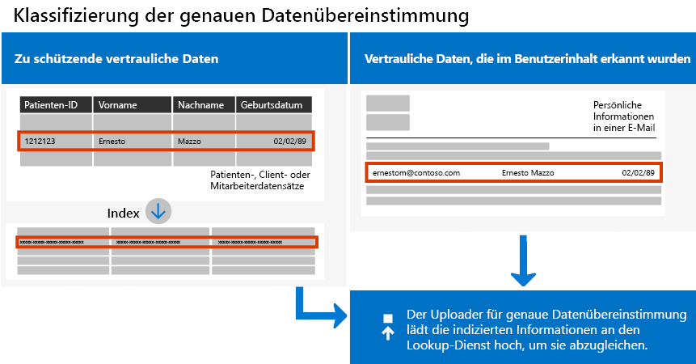
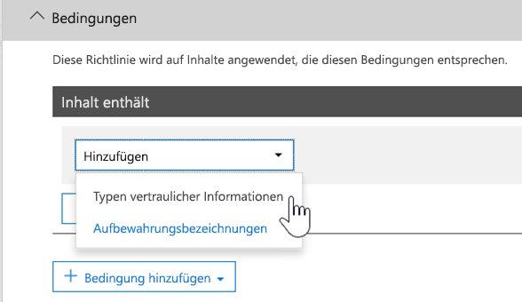

# <a name="create-custom-sensitive-information-types-with-exact-data-match-based-classification"></a>Erstellen von benutzerdefinierten vertraulichen Informationstypen mit genauer Datenübereinstimmungsklassifizierung

## <a name="overview"></a>Übersicht


  [Benutzerdefinierte vertrauliche Informationstypen](https://review.docs.microsoft.com/de-DE/office365/securitycompliance/custom-sensitive-info-types) werden verwendet, um zu verhindern, dass vertrauliche Informationen versehentlich oder in unangemessener Weise freigegeben werden. Als Administrator können Sie das [Security & Compliance Center](https://review.docs.microsoft.com/de-DE/office365/securitycompliance/create-a-custom-sensitive-information-type) oder [PowerShell](https://review.docs.microsoft.com/de-DE/office365/securitycompliance/create-a-custom-sensitive-information-type-in-scc-powershell) verwenden, um einen benutzerdefinierten vertraulichen Informationstyp basierend auf Mustern, Nachweisen (Stichwörtern wie  *Mitarbeiter*, *Abzeichen*, *ID* usw.), Zeichenabstand (wie nahe Nachweise sich an Zeichen in einem bestimmten Muster befinden) und Vertrauensstufen zu definieren. Solche benutzerdefinierten vertraulichen Informationstypen erfüllen die geschäftlichen Anforderungen vieler Organisationen.

Was aber, wenn Sie einen benutzerdefinierten vertraulichen Informationstyp nutzen möchten, der genaue Datenwerte verwendet, anstatt nur mit generischen Mustern übereinzustimmen? Mit einer EDM-basierten Klassifizierung (genaue Datenübereinstimmung) können Sie einen benutzerdefinierten Informationstyp mit den folgenden Merkmalen erstellen:

- dynamisch und aktualisierbar;
- höhere Skalierbarkeit;
- weniger falsch positive Ergebnisse;
- Arbeiten mit strukturierten vertraulichen Daten;
- vertrauliche Informationen sicherer behandeln; 
- Verwendbarkeit mit mehreren Microsoft Cloud Services.



Die EDM-basierte Klassifikation ermöglicht es Ihnen, benutzerdefinierte vertrauliche Informationstypen zu erstellen, die sich auf genaue Werte in einer Datenbank mit vertraulichen Informationen beziehen. Die Datenbank kann täglich oder wöchentlich aktualisiert werden und bis zu 10 Millionen Datenzeilen enthalten. Mitarbeiter, Patienten oder Kunden kommen und gehen und Datensätze ändern sich, aber Ihre benutzerdefinierten vertraulichen Informationstypen bleiben aktuell und anwendbar. Darüber hinaus können Sie EDM-basierte Klassifikation mit Richtlinien verwenden, z. B. [Richtlinien zur Verhinderung von Datenverlust](https://review.docs.microsoft.com/de-DE/office365/securitycompliance/data-loss-prevention-policies) (Data Loss Prevention, DLP) oder [Microsoft Cloud App Security-Dateirichtlinien](https://docs.microsoft.com/cloud-app-security/data-protection-policies).

## <a name="required-licenses-and-permissions"></a>Erforderliche Lizenzen und Berechtigungen

Sie müssen ein globaler, Compliance- oder Exchange Online-Administrator sein, um die in diesem Artikel beschriebenen Aufgaben auszuführen. Weitere Informationen über DLP-Berechtigungen finden Sie unter [Berechtigungen](https://review.docs.microsoft.com/de-DE/office365/securitycompliance/data-loss-prevention-policies#permissions).

Nach allgemeiner Verfügbarkeit wird die EDM-basierte Klassifikation in folgenden Abonnements berücksichtigt:

- Office 365 E5
- Microsoft 365 E5
- Microsoft 365 Informationsschutz und Compliance
- Office 365 Advanced Compliance

## <a name="the-work-flow-at-a-glance"></a>Der Workflow auf einen Blick

|Phase  |Anforderungen  |
|---------|---------|
|[Teil 1: Einrichten der EDM-basierten Klassifizierung](#part-1-set-up-edm-based-classification)<br/><br/>(je nach Bedarf)<br/>- [Bearbeiten des Datenbankschemas](#editing-the-schema-for-edm-based-classification) <br/>- [Entfernen des Schemas](#removing-the-schema-for-edm-based-classification) |– Lesezugriff auf vertrauliche Daten<br/>– Datenbankschema im XML-Format (Beispiel)<br/>– Regelpaket im XML-Format (Beispiel)<br/>– Administratorberechtigungen für das Security & Compliance Center (mithilfe von PowerShell) |
|[Teil 2: Indizieren und Hochladen vertraulicher Daten](#part-2-index-and-upload-the-sensitive-data)<br/><br/>(je nach Bedarf)<br/>[Aktualisieren der Daten](#refreshing-your-sensitive-information-database) |– Benutzerdefinierte Sicherheitsgruppe und Benutzerkonto<br/>– Lokaler Administratorzugriff auf den Computer mit dem EDM-Upload-Agent<br/>– Lesezugriff auf vertrauliche Daten<br/>– Prozess und Zeitplan für die Datenaktualisierung|
|[Teil 3: Verwenden der EDM-basierten Klassifizierung mit Ihren Microsoft Cloud Services](#part-3-use-edm-based-classification-with-your-microsoft-cloud-services) |– Office 365-Abonnement mit DLP<br/>– EDM-basiertes Klassifizierungsfeature aktiviert (in Vorschau) |

### <a name="part-1-set-up-edm-based-classification"></a>Teil 1: Einrichten der EDM-basierten Klassifizierung

Beim Einrichten und Konfigurieren der EDM-basierten Klassifizierung werden vertrauliche Daten im CSV-Format gespeichert, ein Schema für Ihre Datenbank mit vertraulichen Informationen definiert und ein Regelpaket erstellt. Anschließend werden das Schema und das Regelpaket hochgeladen.

#### <a name="define-the-schema-for-your-database-of-sensitive-information"></a>Definieren des Schemas für Ihre Datenbank mit vertraulichen Informationen

1. Identifizieren Sie die vertraulichen Informationen, die Sie verwenden möchten. Exportieren Sie die Daten in eine App, wie z. B. Microsoft Excel, und speichern Sie die Datei im CSV-Format. Die Datendatei kann maximal Folgendes umfassen:
      - bis zu 10 Millionen Zeilen vertraulicher Daten
      - bis zu 32 Spalten (Felder) pro Datenquelle
      - bis zu 5 als durchsuchbar markierte Spalten (Felder)

2. Strukturieren Sie die vertraulichen Daten in der CSV-Datei so, dass die erste Zeile die Namen der für die EDM-basierte Klassifizierung verwendeten Felder enthält. Möglicherweise gibt es in Ihrer CSV-Datei Feldnamen, wie z. B. "SSN", "Geburtsdatum", "Vorname", "Nachname" usw. Im Beispiel nennen wir unsere CSV-Datei *PatientRecords.csv*, und die Spalten beinhalten *PatientID*, *MRN*, *LastName*, *FirstName*, *SSN* und mehr.

3. Definieren Sie das Schema für die Datenbank mit vertraulichen Informationen im XML-Format (ähnlich wie in unserem Beispiel unten). Nennen Sie diese Schemadatei „edm.xml“ und konfigurieren Sie sie so, dass für jede Spalte in der Datenbank eine Zeile mit der Syntax \<Field name="" searchable=""/\> verwendet wird.

      - Verwenden Sie Spaltennamen für *Field name*-Werte.
      - Verwenden Sie *searchable="true* für maximal 5 Felder, die durchsuchbar sein sollen. Sie müssen mindestens ein Feld als durchsuchbar festlegen.

Im folgenden Beispiel definiert die XML-Datei das Schema für eine Datenbank mit Patientendatensätzen, wobei fünf Felder als durchsuchbar angegeben werden: *PatientID*, *MRN*, *SSN*, *Phone* und *DOB*.

(Sie können das Beispiel kopieren, ändern und verwenden.)

 ```xml
<EdmSchema xmlns="http://schemas.microsoft.com/office/2018/edm">
      <DataStore name="PatientRecords" description="Schema for patient records" version="1">
            <Field name="PatientID" searchable="true" />
            <Field name="MRN" searchable="true" />
            <Field name="FirstName" />
            <Field name="LastName" />
            <Field name="SSN" searchable="true" />
            <Field name="Phone" searchable="true" />
            <Field name="DOB" searchable="true" />
            <Field name="Gender" />
            <Field name="Address" />
      </DataStore>
</EdmSchema>
```

4. [Stellen Sie eine Verbindung mit Office 365 Security & Compliance Center PowerShell her](https://docs.microsoft.com/powershell/exchange/office-365-scc/connect-to-scc-powershell/connect-to-scc-powershell?view=exchange-ps).

5. Führen Sie die folgenden Cmdlets nacheinander aus, um das Datenbankschema hochzuladen:

```powershell
$edmSchemaXml=Get-Content .\\edm.xml -Encoding Byte -ReadCount 0
New-DlpEdmSchema -FileData $edmSchemaXml -Confirm:$true
```

Sie werden zu folgenden Bestätigungen aufgefordert:

> Bestätigen
>
> Möchten Sie diese Aktion wirklich ausführen?
>
> Das neue EDM-Schema für den Datenspeicher „patientrecords“ wird importiert.
>
> \[J\] Ja \[A\] Ja für alle \[N\] Nein \[L\] Nein für alle \[?\] Hilfe (Standard ist "J"):

> [!TIP]
> Wenn Sie möchten, dass Ihre Änderungen ohne Bestätigung durchgeführt werden, verwenden Sie in Schritt 5 stattdessen das folgende Cmdlet: New-DlpEdmSchema -FileData $edmSchemaXml

> [!NOTE]
> Es kann zwischen 10–60 Minuten dauern, bis das EDMSchema durch Ergänzungen aktualisiert wird. Das Update muss abgeschlossen sein, bevor Sie Schritte ausführen, die die Zusätze verwenden.

Nachdem das Schema für Ihre Datenbank mit vertraulichen Informationen definiert wurde, besteht der nächste Schritt darin, ein Regelpaket einzurichten. Fahren Sie mit dem Abschnitt [Einrichten eines Regelpakets](#set-up-a-rule-package) fort.

#### <a name="editing-the-schema-for-edm-based-classification"></a>Bearbeiten des Schemas für die EDM-basierte Klassifikation

Wenn Sie Änderungen an Ihrer edm.xml-Datei vornehmen und z. B. ändern möchten, welche Felder für die EDM-basierte Klassifikation verwendet werden, führen Sie die folgenden Schritte aus:

1. Bearbeiten Sie Ihre edm.mxl-Datei (die Datei, die im Abschnitt [Definieren des Schemas](#define-the-schema-for-your-database-of-sensitive-information) in diesem Artikel behandelt wird).

2. [Stellen Sie eine Verbindung mit Office 365 Security & Compliance Center PowerShell her](https://docs.microsoft.com/powershell/exchange/office-365-scc/connect-to-scc-powershell/connect-to-scc-powershell?view=exchange-ps).

3. Führen Sie die folgenden Cmdlets nacheinander aus, um Ihr Datenbankschema zu aktualisieren:

```powershell
$edmSchemaXml=Get-Content .\\edm.xml -Encoding Byte -ReadCount 0
Set-DlpEdmSchema -FileData $edmSchemaXml -Confirm:$true
```

Sie werden zu folgenden Bestätigungen aufgefordert:

> Bestätigen
>
> Möchten Sie diese Aktion wirklich ausführen?
>
> Das EDM-Schema für den Datenspeicher „patientrecords“ wird aktualisiert.
>
> \[J\] Ja \[A\] Ja für alle \[N\] Nein \[L\] Nein für alle \[?\] Hilfe (Standard ist "J"):

> [!TIP]
> Wenn Sie möchten, dass Ihre Änderungen ohne Bestätigung durchgeführt werden, verwenden Sie in Schritt 3 stattdessen das folgende Cmdlet: Set-DlpEdmSchema -FileData $edmSchemaXml

> [!NOTE]
> Es kann zwischen 10–60 Minuten dauern, bis das EDMSchema durch Ergänzungen aktualisiert wird. Das Update muss abgeschlossen sein, bevor Sie Schritte ausführen, die die Zusätze verwenden.

## <a name="removing-the-schema-for-edm-based-classification"></a>Entfernen des Schemas für die EDM-basierte Klassifikation

(Nach Bedarf) Wenn Sie das Schema entfernen möchten, das Sie für die EDM-basierte Klassifizierung verwenden, gehen Sie folgendermaßen vor:

1. [Stellen Sie eine Verbindung mit Office 365 Security & Compliance Center PowerShell her](https://docs.microsoft.com/powershell/exchange/office-365-scc/connect-to-scc-powershell/connect-to-scc-powershell?view=exchange-ps).

2. Führen Sie die folgenden PowerShell-Cmdlets aus, und ersetzen Sie dabei den Datenspeichernamen "patientrecords" durch den Namen, den Sie entfernen möchten:

```powershell
Remove-DlpEdmSchema -Identity patientrecords
```

Sie werden zu folgenden Bestätigungen aufgefordert:

> Bestätigen
>
> Möchten Sie diese Aktion wirklich ausführen?
>
> Das EDM-Schema für den Datenspeicher „patientrecords“ wird entfernt.
>
> \[J\] Ja \[A\] Ja für alle \[N\] Nein \[L\] Nein für alle \[?\] Hilfe (Standard ist "J"):

> [!TIP]
>  Wenn Sie möchten, dass Ihre Änderungen ohne Bestätigung durchgeführt werden, verwenden Sie in Schritt 2 stattdessen das folgende Cmdlet: Remove-DlpEdmSchema -Identity patientrecords -Confirm:$false

### <a name="set-up-a-rule-package"></a>Einrichten eines Regelpakets

1. Erstellen Sie ein Regelpaket im XML-Format (mit Unicode-Codierung), ähnlich wie im folgenden Beispiel. (Sie können das Beispiel kopieren, ändern und verwenden.)

Vergewissern Sie sich beim Einrichten des Regelpakets, dass Sie die CSV-Datei und die edm.xml-Datei korrekt referenzieren. Sie können das Beispiel kopieren, ändern und verwenden. In dieser XML-Beispieldatei müssen die folgenden Felder so angepasst werden, dass Sie Ihren vertraulichen EDM-Typ erstellen:

- 
  **RulePack id und ExactMatch id**: Verwenden Sie [New-GUID](https://docs.microsoft.com/de-DE/powershell/module/microsoft.powershell.utility/new-guid?view=powershell-6), um eine GUID zu generieren.

- **Datenspeicher**: Dieses Feld gibt den zu verwendenden EDM-Nachschlage-Datenspeicher an. Sie geben einen Datenquellennamen eines konfigurierten EDM-Schemas an.

- **idMatch**: Dieses Feld verweist auf das primäre Element für EDM.
  - Stimmt überein mit: gibt das Feld an, das in der exakten Suche verwendet werden soll. Sie geben den Namen eines durchsuchbaren Felds im EDM-Schema für den Datenspeicher an.
  - Klassifizierung: Dieses Feld gibt die Übereinstimmung für den vertraulichen Typ an, der EDM-Nachschlagevorgänge auslöst. Sie können den Namen oder die GUID einer vorhandenen integrierten oder benutzerdefinierten Klassifizierung angeben.

- **Übereinstimmung:** Dieses Feld verweist auf zusätzliche Nachweise, die sich in der Nähe von "idMatch" befinden.
  - Stimmt überein mit: Sie geben einen Feldnamen im EDM-Schema für den Datenspeicher an.
- **Ressource:** In diesem Abschnitt werden der Name und die Beschreibung für den vertraulichen Typ in mehreren Sprachversionen angegeben.
  - idRef: Sie geben die GUID für „ExactMatch id“ an.
  - Beschreibungen „Name“ und „Bearbeiten des Schemas“: Passen Sie nach Bedarf an.

```xml
<RulePackage xmlns="http://schemas.microsoft.com/office/2018/edm">
  <RulePack id="fd098e03-1796-41a5-8ab6-198c93c62b11">
    <Version build="0" major="2" minor="0" revision="0" />
    <Publisher id="eb553734-8306-44b4-9ad5-c388ad970528" />
    <Details defaultLangCode="en-us">
      <LocalizedDetails langcode="en-us">
        <PublisherName>IP DLP</PublisherName>
        <Name>Health Care EDM Rulepack</Name>
        <Description>This rule package contains the EDM sensitive type for health care sensitive types.</Description>
      </LocalizedDetails>
    </Details>
  </RulePack>
  <Rules>
    <ExactMatch id = "E1CC861E-3FE9-4A58-82DF-4BD259EAB371" patternsProximity = "300" dataStore ="PatientRecords" recommendedConfidence = "65" >
      <Pattern confidenceLevel="65">
        <idMatch matches = "SSN" classification = "U.S. Social Security Number (SSN)" />
      </Pattern>
      <Pattern confidenceLevel="75">
        <idMatch matches = "SSN" classification = "U.S. Social Security Number (SSN)" />
        <Any minMatches ="3" maxMatches ="100">
          <match matches="PatientID" />
          <match matches="MRN"/>
          <match matches="FirstName"/>
          <match matches="LastName"/>
          <match matches="Phone"/>
          <match matches="DOB"/>
        </Any>
      </Pattern>
    </ExactMatch>
    <LocalizedStrings>
      <Resource idRef="E1CC861E-3FE9-4A58-82DF-4BD259EAB371">
        <Name default="true" langcode="en-us">Patient SSN Exact Match.</Name>
        <Description default="true" langcode="en-us">EDM Sensitive type for detecting Patient SSN.</Description>
      </Resource>
    </LocalizedStrings>
  </Rules>
</RulePackage>
```

1. Laden Sie das Regelpaket hoch, indem Sie nacheinander die folgenden PowerShell-Cmdlets ausführen:

```powershell
$rulepack=Get-Content .\\rulepack.xml -Encoding Byte -ReadCount 0
New-DlpSensitiveInformationTypeRulePackage -FileData $rulepack
```

Sie haben die EDM-basierte Klassifizierung nun eingerichtet. Im nächsten Schritt werden die vertraulichen Daten indiziert und dann hochgeladen.

Wie Sie im vorherigen Verfahren erfahren haben, wurden im PatientRecords-Schema fünf Felder als durchsuchbar definiert: *PatientID*, *MRN*, *SSN*, *Phone* und *DOB*. Unser Beispiel für ein Regelpaket enthält diese Felder und verweist auf die Datenbankschemadatei (edm.xml), mit einem *ExactMatch*-Element pro durchsuchbarem Feld. Sehen Sie sich das folgende ExactMatch-Element an:

```xml
<ExactMatch id = "E1CC861E-3FE9-4A58-82DF-4BD259EAB371" patternsProximity = "300" dataStore ="PatientRecords" recommendedConfidence = "65" >
      <Pattern confidenceLevel="65">
        <idMatch matches = "SSN" classification = "U.S. Social Security Number (SSN)" />
      </Pattern>
      <Pattern confidenceLevel="75">
        <idMatch matches = "SSN" classification = "U.S. Social Security Number (SSN)" />
        <Any minMatches ="3" maxMatches ="100">
          <match matches="PatientID" />
          <match matches="MRN"/>
          <match matches="FirstName"/>
          <match matches="LastName"/>
          <match matches="Phone"/>
          <match matches="DOB"/>
        </Any>
      </Pattern>
    </ExactMatch>
```

Beachten Sie in diesem Beispiel Folgendes:

- Der dataStore-Name verweist auf die zuvor erstellte CSV-Datei: **dataStore = "PatientRecords"**.

- Der idMatch-Wert verweist auf ein durchsuchbares Feld, das in der Datenbankschema-Datei aufgelistet ist: **idMatch matches = "SSN"**.

- Der classification-Wert verweist auf einen vorhandenen oder benutzerdefinierten vertraulichen Informationstyp: **classification = "US-Sozialversicherungsnummer (SSN)"**. (In diesem Fall wird der vorhandene vertrauliche Informationstyp "US-Sozialversicherungsnummer" verwendet.)

> [!NOTE]
> Es kann zwischen 10–60 Minuten dauern, bis das EDMSchema durch Ergänzungen aktualisiert wird. Das Update muss abgeschlossen sein, bevor Sie Schritte ausführen, die die Zusätze verwenden.

### <a name="part-2-index-and-upload-the-sensitive-data"></a>Teil 2: Indizieren und Hochladen der vertraulichen Daten

In dieser Phase richten Sie eine benutzerdefinierte Sicherheitsgruppe, ein Benutzerkonto und das Tool EDM-Upload-Agent ein. Dann verwenden Sie das Tool, um die vertraulichen Daten zu indizieren und die indizierten Daten hochzuladen.

#### <a name="set-up-the-security-group-and-user-account"></a>Einrichten der Sicherheitsgruppe und des Benutzerkontos

1. Wechseln Sie als globaler Administrator zum Admin Center ([https://admin.microsoft.com](https://admin.microsoft.com/)) und [erstellen Sie eine Sicherheitsgruppe](https://docs.microsoft.com/office365/admin/email/create-edit-or-delete-a-security-group?view=o365-worldwide) mit dem Namen „EDM\_DataUploaders“.

2. Fügen Sie einen oder mehrere Benutzer zur *EDM\_DataUploaders*-Sicherheitsgruppe hinzu. (Diese Benutzer verwalten die Datenbank mit vertraulichen Informationen.)

3. Stellen Sie sicher, dass jeder Benutzer, der die vertraulichen Daten verwaltet, ein lokaler Administrator auf dem Computer ist, der für den EDM-Upload-Agent verwendet wird.

#### <a name="set-up-the-edm-upload-agent"></a>Einrichten des EDM-Upload-Agenten

>[!NOTE]
> Bevor Sie mit diesem Verfahren beginnen, stellen Sie sicher, dass Sie Mitglied der Sicherheitsgruppe *EDM\_DataUploaders* und lokaler Administrator auf Ihrem Computer sind.

1. Laden Sie den [EDM-Upload-Agenten](https://go.microsoft.com/fwlink/?linkid=2088639) herunter und installieren Sie ihn. Standardmäßig sollte der Installationsspeicherort C:\\Programme\\Microsoft\\EdmUploadAgent sein.

2. Wenn Sie den EDM-Upload-Agenten autorisieren möchten, öffnen Sie die Windows-Eingabeaufforderung (als Administrator), und führen Sie dann den folgenden Befehl aus:

    `EdmUploadAgent.exe /Authorize`

3. Melden Sie sich mit Ihrem Office 365-Geschäfts-, Schul- oder Unikonto an.

Im nächsten Schritt verwenden Sie den EDM-Upload-Agent, um die vertraulichen Daten zu indizieren und dann die indizierten Daten hochzuladen.

#### <a name="index-and-upload-the-sensitive-data"></a>Indizieren und Hochladen der vertraulichen Daten

Speichern Sie die Datei mit den vertraulichen Daten (unser Beispiel ist wie erwähnt *PatientRecords.csv*) auf dem lokalen Laufwerk Ihres Computers. (Die Beispieldatei *PatientRecords.csv* wurde in C:\\Edm\\Data gespeichert.)

Um die vertraulichen Daten zu indizieren und hochzuladen, führen Sie den folgenden Befehl in der Windows-Eingabeaufforderung aus:

`EdmUploadAgent.exe /UploadData /DataStoreName \<DataStoreName\> /DataFile \<DataFilePath\> /HashLocation \<HashedFileLocation\>`

Beispiel: **EdmUploadAgent.exe /UploadData /DataStoreName PatientRecords /DataFile C:\\Edm\\Hash\\PatientRecords.csv /HashLocation C:\\Edm\\Hash**

Wenn Sie das Indizieren vertraulicher Daten in einer isolierten Umgebung trennen und ausführen möchten, führen Sie die Schritte „Indizieren“ und „Hochladen“ separat aus.

Um die vertraulichen Daten zu indizieren, führen Sie den folgenden Befehl in der Windows-Eingabeaufforderung aus:

`EdmUploadAgent.exe /CreateHash /DataFile \<DataFilePath\> /HashLocation \<HashedFileLocation\>`

Beispiel: **EdmUploadAgent.exe /CreateHash /DataFile C:\\Edm\\Data\\PatientRecords.csv /HashLocation C:\\Edm\\Hash**

Um die vertraulichen Daten hochzuladen, führen Sie den folgenden Befehl in der Windows-Eingabeaufforderung aus:

`EdmUploadAgent.exe /UploadHash /DataStoreName \<DataStoreName\> /HashFile \<HashedSourceFilePath\>`

Beispiel: **EdmUploadAgent.exe /UploadHash /DataStoreName PatientRecords /HashFile C:\\Edm\\Hash\\PatientRecords.EdmHash**

Um zu überprüfen, ob Ihre vertraulichen Daten hochgeladen wurden, führen Sie den folgenden Befehl in der Windows-Eingabeaufforderung aus:

`EdmUploadAgent.exe /GetDataStore`

Sie sehen eine Liste der Datenspeicher mit dem Zeitpunkt der letzten Aktualisierung, die der folgenden Liste ähnelt:

Fahren Sie mit dem Einrichten des Prozesses und des Zeitplans für das [Aktualisieren der Datenbank für vertrauliche Informationen](#refreshing-your-sensitive-information-database) fort.

Sie können nun die EDM-basierte Klassifikation mit Ihren Microsoft Cloud Services verwenden. Sie können beispielsweise [eine DLP-Richtlinie mithilfe der EDM-basierten Klassifizierung einrichten](#to-create-a-dlp-policy-with-edm).

#### <a name="refreshing-your-sensitive-information-database"></a>Aktualisieren der Datenbank für vertrauliche Informationen

Sie können Ihre Datenbank für vertrauliche Informationen täglich oder wöchentlich aktualisieren, und das EDM-Upload-Tool kann die vertraulichen Daten neu indizieren und dann die indizierten Daten erneut hochladen.

1. Ermitteln Sie den Vorgang und die Häufigkeit (täglich oder wöchentlich) zum Aktualisieren der Datenbank mit vertraulichen Informationen.

2. Exportieren Sie die vertraulichen Daten erneut in eine App, wie z. B. Microsoft Excel, und speichern Sie die Datei im CSV-Format. Behalten Sie den Dateinamen und den Speicherort bei, den Sie beim Ausführen der unter [Indizieren und Hochladen vertraulicher Daten](#index-and-upload-the-sensitive-data) beschriebenen Schritte verwendet haben.

> [!NOTE]
> Wenn es keine Änderungen an der Struktur (Feldnamen) der CSV-Datei gibt, müssen Sie auch keine an der Datenbankschemadatei vornehmen, wenn Sie die Daten aktualisieren. Wenn Sie jedoch Änderungen vornehmen müssen, stellen Sie sicher, dass Sie das Datenbankschema und Ihr Regelpaket entsprechend bearbeiten.

3. Verwenden Sie die [Aufgabenplanung](https://docs.microsoft.com/windows/desktop/TaskSchd/task-scheduler-start-page), um die Schritte 2 und 3 im Verfahren [Indizieren und Hochladen vertraulicher Daten](#index-and-upload-the-sensitive-data) zu automatisieren. Sie können Aufgaben mithilfe verschiedener Methoden planen:

| **Methode**             | **Nächste Schritte**                                                                                                                                                                                                                                                                                                                                                                                                                     |
| ---------------------- | ---------------------------------------------------------------------------------------------------------------------------------------------------------------------------------------------------------------------------------------------------------------------------------------------------------------------------------------------------------------------------------------------------------------------------------- |
| Windows PowerShell     | Siehe die Dokumentation [Aufgabenplanung](https://docs.microsoft.com/powershell/module/scheduledtasks/?view=win10-ps) und das [PowerShell-Beispielskript](#example-powershell-script-for-task-scheduler) in diesem Artikel |
| Aufgabenplaner-API     | Lesen Sie die Dokumentation [Aufgabenplanung](https://docs.microsoft.com/windows/desktop/TaskSchd/using-the-task-scheduler)                                                                                                                                                                                                                                                                                |
| Windows-Benutzeroberfläche | Klicken Sie in Windows auf **Start**, und geben Sie „Aufgabenplanung“ ein. Klicken Sie dann in der Ergebnisliste mit der rechten Maustaste auf **Aufgabenplanung** und wählen Sie **Als Administrator ausführen** aus.                                                                                                                                                                                                                                                                           |

#### <a name="example-powershell-script-for-task-scheduler"></a>„PowerShell-Beispielskript“ für „Aufgabenplanung“

Dieser Abschnitt enthält ein Beispiel für ein PowerShell-Skript, das Sie verwenden können, um Ihre Aufgaben zum Indizieren von Daten und Hochladen der indizierten Daten zu planen:

##### <a name="to-schedule-index-and-upload-in-a-combined-step"></a>So planen Sie das Indizieren und Hochladen in einem kombinierten Schritt

```powershell
param(\[string\]$dataStoreName,\[string\]$fileLocation)
\# Assuming current user is also the user context to run the task
$user = "$env:USERDOMAIN\\$env:USERNAME"
$edminstallpath = 'C:\\Program Files\\Microsoft\\EdmUploadAgent\\'
$edmuploader = $edminstallpath + 'EdmUploadAgent.exe'
$csvext = '.csv'
\# Assuming CSV file name is same as data store name
$dataFile = "$fileLocation\\$dataStoreName$csvext"
\# Assuming location to store hash file is same as the location of csv file
$hashLocation = $fileLocation
$uploadDataArgs = '/UploadData /DataStoreName ' + $dataStoreName + ' /DataFile ' + $dataFile + ‘ /HashLocation’ + $hashLocation
\# Set up actions associated with the task
$actions = @()
$actions += New-ScheduledTaskAction -Execute $edmuploader -Argument $uploadDataArgs -WorkingDirectory $edminstallpath
\# Set up trigger for the task
$trigger = New-ScheduledTaskTrigger -Weekly -DaysOfWeek Sunday -At 2am
\# Set up task settings
$principal = New-ScheduledTaskPrincipal -UserId $user -LogonType S4U -RunLevel Highest
$settings = New-ScheduledTaskSettingsSet -RunOnlyIfNetworkAvailable -StartWhenAvailable -WakeToRun
\# Create the scheduled task
$scheduledTask = New-ScheduledTask -Action $actions -Principal $principal -Trigger $trigger -Settings $settings
\# Get credentials to run the task
$creds = Get-Credential -UserName $user -Message "Enter credentials to run the task"
$password=\[Runtime.InteropServices.Marshal\]::PtrToStringAuto(\[Runtime.InteropServices.Marshal\]::SecureStringToBSTR($creds.Password))
\# Register the scheduled task
$taskName = 'EDMUpload\_' + $dataStoreName
Register-ScheduledTask -TaskName $taskName -InputObject $scheduledTask -User $user -Password $password
```

#### <a name="to-schedule-index-and-upload-as-separate-steps"></a>So planen Sie das Indizieren und Hochladen als separate Schritte

```powershell
param(\[string\]$dataStoreName,\[string\]$fileLocation)
\# Assuming current user is also the user context to run the task
$user = "$env:USERDOMAIN\\$env:USERNAME"
$edminstallpath = 'C:\\Program Files\\Microsoft\\EdmUploadAgent\\'
$edmuploader = $edminstallpath + 'EdmUploadAgent.exe'
$csvext = '.csv'
$edmext = '.EdmHash'
\# Assuming CSV file name is same as data store name
$dataFile = "$fileLocation\\$dataStoreName$csvext"
$hashFile = "$fileLocation\\$dataStoreName$edmext"
\# Assuming location to store hash file is same as the location of csv file
$hashLocation = $fileLocation
$createHashArgs = '/CreateHash' + ' /DataFile ' + $dataFile + ' /HashLocation ' + $hashLocation
$uploadHashArgs = '/UploadHash /DataStoreName ' + $dataStoreName + ' /HashFile ' + $hashFile
\# Set up actions associated with the task
$actions = @()
$actions += New-ScheduledTaskAction -Execute $edmuploader -Argument $createHashArgs -WorkingDirectory $edminstallpath
$actions += New-ScheduledTaskAction -Execute $edmuploader -Argument $uploadHashArgs -WorkingDirectory $edminstallpath
\# Set up trigger for the task
$trigger = New-ScheduledTaskTrigger -Weekly -DaysOfWeek Sunday -At 2am
\# Set up task settings
$principal = New-ScheduledTaskPrincipal -UserId $user -LogonType S4U -RunLevel Highest
$settings = New-ScheduledTaskSettingsSet -RunOnlyIfNetworkAvailable -StartWhenAvailable -WakeToRun
\# Create the scheduled task
$scheduledTask = New-ScheduledTask -Action $actions -Principal $principal -Trigger $trigger -Settings $settings
\# Get credentials to run the task
$creds = Get-Credential -UserName $user -Message "Enter credentials to run the task"
$password=\[Runtime.InteropServices.Marshal\]::PtrToStringAuto(\[Runtime.InteropServices.Marshal\]::SecureStringToBSTR($creds.Password))
\# Register the scheduled task
$taskName = 'EDMUpload\_' + $dataStoreName
Register-ScheduledTask -TaskName $taskName -InputObject $scheduledTask -User $user -Password $password
```

### <a name="part-3-use-edm-based-classification-with-your-microsoft-cloud-services"></a>Teil 3: Verwenden der EDM-basierten Klassifizierung mit Ihren Microsoft Cloud Services

Office 365 DLP für Exchange Online (E-Mail-Adresse), OneDrive for Business (Dateien), Microsoft Teams (Unterhaltungen) und Microsoft Cloud App Security DLP-Richtlinien unterstützen vertrauliche EDM-Informationstypen.

Vertrauliche EDM-Informationstypen für die folgenden Szenarien sind derzeit in der Entwicklung, aber noch nicht verfügbar:

- Office 365 DLP für SharePoint (Dateien)
- automatische Klassifizierung von Vertraulichkeits- und Aufbewahrungsbezeichnungen

#### <a name="to-create-a-dlp-policy-with-edm"></a>Erstellen einer DLP-Richtlinie mit EDM

1. Wechseln Sie zum Security & Compliance Center ([https://protection.office.com](https://protection.office.com/)).

2. Klicken Sie auf die **Richtlinie** \> **zur Verhinderung von Datenverlust**.

3. Wählen Sie **Richtlinie erstellen** \> **Benutzerdefiniert** \> **Weiter** aus.

4. Geben Sie auf der Registerkarte **Richtlinie benennen** einen Namen und eine Beschreibung ein, und wählen Sie dann **Weiter** aus.

5. Wählen Sie auf der Registerkarte **Speicherorte auswählen**  **Bestimmte Speicherorte auswählen** und dann **Weiter** aus.

6. Wählen Sie in der Spalte **Status**  **Exchange-E-Mail, OneDrive-Konten, Teams-Chat und Kanalnachricht** und dann **Weiter** aus. (Hinweis: EDM wird von SharePoint-Websites derzeit nicht unterstützt, und DLP-Richtlinien erkennen keine Dateien in SharePoint durch EDM).

7. Wählen Sie auf der Registerkarte **Richtlinieneinstellungen**  **Erweiterte Einstellungen verwenden** und dann **Weiter** aus.

8. Wählen Sie **+ Neue Regel** aus.

9. Geben Sie im Abschnitt **Name** einen Namen und eine Beschreibung für die Regel ein.

10. Wählen Sie im Abschnitt **Bedingungen** in der Liste **+ Bedingung hinzufügen**  **Inhalt enthält vertraulichen Typ** aus.<br/><br/>

11. Suchen Sie den vertraulichen Informationstyp, den Sie beim Einrichten Ihres Regelpakets erstellt haben, und wählen Sie dann **+ Hinzufügen** aus.  
    Wählen Sie dann **Fertig** aus.

12. Wählen Sie Optionen für die Regel aus, wie z. B. **Benutzerbenachrichtigungen**, **Außerkraftsetzungen durch Benutzer**, **Schadensberichte** usw., und dann **Speichern** aus.

13. Überprüfen Sie auf der Registerkarte **Richtlinieneinstellungen** Ihre Regeln und wählen Sie dann **Weiter** aus.

14. Geben Sie an, ob Sie die Richtlinie sofort aktivieren, testen oder deaktivieren möchten. Wählen Sie dann **Weiter** aus.

15. Überprüfen Sie auf der Registerkarte **Überprüfen Sie Ihre Einstellungen** Ihre Richtlinie. Nehmen Sie alle nötigen Änderungen vor. Wenn Sie fertig sind, wählen Sie **Erstellen** aus.

> [!NOTE]
> Es kann ungefähr eine Stunde dauern, bis Ihre neue DLP-Richtlinie im Rechenzentrum erscheint.

## <a name="related-articles"></a>Verwandte Artikel


  [Integrierte vertrauliche Informationstypen und wonach diese suchen](https://review.docs.microsoft.com/de-DE/office365/securitycompliance/what-the-sensitive-information-types-look-for)


  [Benutzerdefinierte vertrauliche Informationstypen](https://review.docs.microsoft.com/de-DE/office365/securitycompliance/custom-sensitive-info-types)


  [Überblick über DLP-Richtlinien](https://review.docs.microsoft.com/de-DE/office365/securitycompliance/data-loss-prevention-policies)

[Microsoft Cloud App Security](https://docs.microsoft.com/cloud-app-security)


  [New-DlpEdmSchema](https://docs.microsoft.com/de-DE/powershell/module/exchange/policy-and-compliance-dlp/new-dlpedmschema?view=exchange-ps)

## <a name="feedback"></a>Feedback
GitHub-Feedback ist aktiviert, aber das Hinzufügen von Problemen ist nur auf der öffentlichen Website verfügbar.
