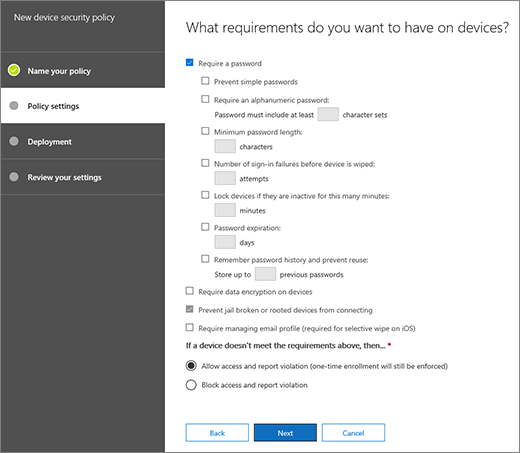

# Erstellen und Bereitstellen von GerätesicherheitsrichtlinienCreate and deploy device security policies

Mobile Device Management für Office 365 können Sie Sicherheitsrichtlinien erstellen, mit denen Ihre Organisation Informationen zu Office 365 vor nicht autorisiertem Zugriff geschützt. Sie können Richtlinien auf einem beliebigen mobilen Gerät in Ihrer Organisation anwenden, der Benutzer des Geräts verfügt über eine entsprechende Office 365-Lizenz und das Gerät im MDM für Office 365 registriert hat.You can use Mobile Device Management for Office 365 to create security policies that help protect your organization's information on Office 365 from unauthorized access. You can apply policies to any mobile device in your organization where the user of the device has an applicable Office 365 license and has enrolled the device in MDM for Office 365.
  
## Bevor Sie beginnenBefore you begin

- Informationen Sie zu den Geräten, Mobilgerät apps und Sicherheitseinstellungen, die für Office 365 MDM unterstützt. Finden Sie unter [Funktionen der Verwaltung von mobilen Geräten für Office 365](capabilities-of-mobile-device-management.md).Learn about the devices, mobile device apps, and security settings that MDM for Office 365 supports. See [Capabilities of Mobile Device Management for Office 365](capabilities-of-mobile-device-management.md).
    
- Erstellen von Sicherheitsgruppen, die Office 365-Benutzer enthalten, denen Sie Richtlinien zum bereitstellen möchten, und für Benutzer, dass verhindern ausschließen soll Zugriff auf Office 365 gesperrt. Es wird empfohlen, bevor Sie eine neue Richtlinie für Ihre Organisation bereitstellen, die Richtlinie zu testen, indem es eine kleine Anzahl von Benutzern bereitgestellt. Sie können erstellen und verwenden eine Sicherheitsgruppe, die enthält nur sich selbst oder eine kleine Zahl Office 365-Benutzer, die die Richtlinie für Sie testen können. Weitere Informationen zu Sicherheitsgruppen finden Sie unter [erstellen, bearbeiten oder Löschen einer Sicherheitsgruppe](https://go.microsoft.com/fwlink/p/?LinkId=518555).Create security groups that include Office 365 users that you want to deploy policies to and for users that you might want to exclude from being blocked access to Office 365. We recommend that before you deploy a new policy to your organization, you test the policy by deploying it to a small number of users. You can create and use a security group that includes just yourself or a small number Office 365 users that can test the policy for you. To learn more about security groups, see [Create, edit, or delete a security group](https://go.microsoft.com/fwlink/p/?LinkId=518555).
    
- **Wichtig:** Bevor Sie eine Richtlinie für mobile Geräte erstellen können, müssen Sie aktivieren und MDM für Office 365 einrichten. Finden Sie unter [Übersicht über die Verwaltung von mobilen Geräten für Office 365](overview-of-mdm.md).**Important:** Before you can create a mobile device policy, you must activate and set up MDM for Office 365. See [Overview of Mobile Device Management for Office 365](overview-of-mdm.md).
    
- Zum Erstellen und Bereitstellen von Richtlinien für mobile Geräte Management in Office 365, müssen Sie ein Office 365 Admin global. Finden Sie unter [Berechtigungen in der Office 365-Sicherheit &amp; Compliance Center](https://support.office.com/article/d10608af-7934-490a-818e-e68f17d0e9c1).To create and deploy mobile device management policies in Office 365, you need to be an Office 365 global admin. See [Permissions in the Office 365 Security &amp; Compliance Center](https://support.office.com/article/d10608af-7934-490a-818e-e68f17d0e9c1).
    
- Vor der Bereitstellung von Richtlinien können Sie Ihre Organisation die potenziellen Auswirkungen Registrieren eines Geräts in MDM für Office 365 kennen. Je nachdem, wie Sie die Richtlinien einrichten nicht konformer Geräte können aus den Zugriff auf Office 365 blockiert werden, und Daten, einschließlich der installierten Programme, Fotos und persönlichen Informationen auf einem Gerät registrierten, gelöscht werden.Before you deploy policies, let your organization know the potential impacts of enrolling a device in MDM for Office 365. Depending on how you set up the policies, noncompliant devices can be blocked from accessing Office 365 and data, including installed applications, photos, and personal information on an enrolled device, can be deleted.
    
> [!NOTE]
> Richtlinien und Zugriffsregeln für Office 365 in MDM erstellt werden Exchange ActiveSync-Postfachrichtlinien für mobile Geräte und in der Exchange-Verwaltungskonsole erstellt gerätezugriffsregeln außer Kraft setzen. Nachdem ein Gerät für Office 365, alle Exchange ActiveSync-Postfachrichtlinie Mobilgerät MDM registriert ist oder gerätezugriffsregel angewendet auf das Gerät wird ignoriert. Weitere Informationen zu Exchange ActiveSync finden Sie unter [Exchange ActiveSync in Exchange Online](https://go.microsoft.com/fwlink/p/?LinkId=524380).Policies and access rules created in MDM for Office 365 will override Exchange ActiveSync mobile device mailbox policies and device access rules created in the Exchange admin center. After a device is enrolled in MDM for Office 365, any Exchange ActiveSync mobile device mailbox policy or device access rule applied to the device will be ignored. To learn more about Exchange ActiveSync, see [Exchange ActiveSync in Exchange Online](https://go.microsoft.com/fwlink/p/?LinkId=524380). 
  
## Schritt 1: Erstellen einer Sicherheitsrichtlinie und Bereitstellen einer TestgruppeStep 1: Create a security policy and deploy to a test group

Bevor Sie beginnen können, stellen Sie sicher, dass Sie aktiviert und Einrichten von MDM für Office 365. Weitere Informationen finden Sie in der [Übersicht der Verwaltung mobiler Geräte für Office 365](overview-of-mdm.md) .Before you can start, make sure you have activated and set up MDM for Office 365. See [Overview of Mobile Device Management for Office 365](overview-of-mdm.md) for instructions. 
  
1. In Office 365 in das Wertpapier &amp; Compliance Center, navigieren Sie zur **Verhinderung von Datenverlust** \> **Sicherheitsrichtlinien für Geräte**.In Office 365, in the Security &amp; Compliance Center, go to **Data loss prevention** \> **Device security policies**.
    
    > [!NOTE]
    > Die **Sicherheitsrichtlinien für Geräte** wird im Menü angezeigt, nachdem Sie die Verwaltung von mobilen Geräten aktiviert haben.The **Device security policies** will appear in the menu only after you have activated Mobile device management. 
  
2. Wählen Sie **+ Richtlinie erstellen**.Choose **+ Create a policy**.
    
    
  
3. Geben Sie einen **Namen** und eine **Beschreibung** für die neue Richtlinie, und wählen Sie dann auf **Weiter**.Specify a **Name** and **Description** for the new policy, and then choose **Next**.
    
    
  
4. Klicken Sie auf die **welche Anforderungen möchten Sie, dass auf Geräten?** Seite, geben Sie die Anforderungen angewendet auf mobilen Geräten in Ihrer Organisation soll, und wählen Sie dann auf **Weiter**.On the **What requirements do you want to have on devices?** page, specify the requirements you want applied to mobile devices in your organization, and then choose **Next**.
    
    
  
5. Klicken Sie auf die **Was möchten Sie konfigurieren?** Seite, geben Sie zusätzlichen Anforderungen angewendet auf mobilen Geräten in Ihrer Organisation soll, und wählen Sie dann auf **Weiter**.On the **What do you want to configure?** page, specify any additional requirements you want applied to mobile devices in your organization, and then choose **Next**.
    
6. Klicken Sie auf die **möchten Sie diese Richtlinie jetzt anwenden?** Seite, wählen Sie **Ja**aus, und wählen Sie dann **+ Hinzufügen**.On the **Do you want to apply this policy now?** page, choose **Yes**, and then choose **+ Add**. 
    
    
  
7. Wählen Sie die Gruppe, die die Richtlinie testen wird, bevor Sie in Ihrer Organisation bereitzustellen, und wählen Sie dann auf **Hinzufügen**.Select the group(s) who will test the policy before you deploy it to your organization, and then choose **Add**.
    
8. Klicken Sie auf **Weiter**.Choose **Next**.
    
9. Überprüfen Sie und bestätigen Sie die Details der neuen Geräterichtlinie ein, und wählen Sie dann **diese Richtlinie erstellen**.Review and confirm the details of the new device policy, and then choose **Create this policy**.
    
    
  
10. Klicken Sie auf **Schließen**.Click **Close**.
    
Jeder Benutzer, die die Richtlinie gilt, muss die Richtlinie auf ihrem Gerät das nächste Mal Anmeldung bei Office 365 mit ihrem mobilen Gerät abgelegt. Wenn Benutzer eine Richtlinie auf ihrem mobilen Gerät vor angewendet wurde noch nicht, klicken Sie dann erhalten nach der Bereitstellung von Richtlinien für des sie eine Benachrichtigung auf ihrem Gerät, die die [Schritte zum Registrieren und Aktivieren des MDM für Office 365](https://go.microsoft.com/fwlink/?LinkId=615272)umfasst. Bis sie Registrierung abgeschlossen haben, werden Zugriff auf e-Mail, OneDrive und andere Dienste beschränkt werden. Nach Abschluss Registrierung mit Intune Unternehmensportal app werden die Dienste verwenden können, und auf ihrem Gerät die Richtlinie angewendet werden.Each user that the policy applies to will have the policy pushed to their device the next time they sign in to Office 365 using their mobile device. If users haven't had a policy applied to their mobile device before, then after you deploy the policy, they'll get a notification on their device that includes the [steps to enroll and activate MDM for Office 365](https://go.microsoft.com/fwlink/?LinkId=615272). Until they complete enrollment, access to email, OneDrive, and other services will be restricted. After they complete enrollment using the Intune Company Portal app, they'll be able to use the services and the policy will be applied to their device.
  
## Schritt 2: Überprüfen Sie Ihre Funktionsweise der GruppenrichtlinienStep 2: Verify your policy works

Nachdem Sie eine Sicherheitsrichtlinie erstellt haben, sollten Sie überprüfen, dass die Richtlinie funktioniert wie erwartet, bevor Sie ihn für Ihre Organisation bereitstellen.After you've created a security policy, you should check that the policy works as you expect before you deploy it to your organization.
  
1. In Office 365, wechseln Sie zur **Sicherheit &amp; Compliance Center** \> **Verhinderung von Datenverlust** \> **Gerätemanagement**.In Office 365, go to **Security &amp; Compliance Center** \> **Data loss prevention** \> **Device management**.
    
2. Überprüfen Sie den Status des Benutzers Geräte, die die Richtlinie angewendet haben, auf der Seite **Verwaltung der mobiler Geräte für Office 365** . Sie können filtern oder Sortieren von **Alle** Anzeigen aller Geräte oder **blockiert** , blockierte Geräte anzeigen.On the **Mobile Device Management for Office 365** page, Check the status of user devices that have the policy applied. You can filter or sort by **All** to view all devices, or **Blocked** to view blocked devices. 
    
    
  
3. Sie können auch eine vollständige oder eine selektive Remotegerätzurücksetzung auf dem Gerät ausführen. Anweisungen finden Sie unter [Löschen ein mobiles Geräts in Office 365](wipe-a-mobile-device.md).You can also do a full or selective wipe on the device. For instructions, see [Wipe a mobile device in Office 365](wipe-a-mobile-device.md).
    
## Schritt 3: Bereitstellen einer Richtlinie für Ihre OrganisationStep 3: Deploy a policy to your organization

Nachdem Sie eine Richtlinie für mobile Geräte erstellt und sichergestellt, dass diese wie erwartet funktioniert haben, stellen sie für Ihre Organisation bereit.After you've created a mobile device policy and verified that it works as expected, deploy it to your organization.
  
1. In Office 365, wechseln Sie zur **Sicherheit &amp; Compliance Center** \> **Verhinderung von Datenverlust** \> **Sicherheitsrichtlinien für Geräte**.In Office 365, go to **Security &amp; Compliance Center** \> **Data loss prevention**\> **Device security policies**.
    
2. Wählen Sie die Richtlinie, die Sie bereitstellen möchten, und wählen Sie **Richtlinie bearbeiten** in der \< _Richtlinienname_ \> Systemsteuerung.  Select the policy you want to deploy, and choose **Edit policy** in the \<  _policy name_\> panel.
    
3. Wählen Sie die Registerkarte **Bereitstellung** aus.Select the **Deployment** tab. 
    
4. Wählen Sie auf der Registerkarte **Bereitstellung** **Ja** oben **Wählen Sie eine oder mehrere Sicherheitsgruppen enthalten, die die Personen, die diese Richtlinie angewendet werden soll** , und klicken Sie dann **Hinzufügen**aus.In the **Deployment** tab, choose **Yes** above **Select one or more security groups that contain the people you want to apply this policy to** and then **Add**.
    
  - Klicken Sie im Bereich **Wählen Sie Gruppe** die Suche nach einer Gruppe hinzufügen können, können Sie durch Alias oder nach dem Anzeigenamen filtern. Sie können auch eine vorhandene Gruppe aus der Liste **Gruppen** hinzufügen.On the **Select Group** panel, you can search for a group to add, you can filter either by alias or by display name. You can also add an existing group from the **Groups** list. 
    
    Sie können mehrere Gruppen zum Anwenden der Richtlinie auf Hinzufügen.You can add multiple groups to apply the policy to.
    
    Wählen Sie **Add** am unteren Rand der Systemsteuerung.Choose **Add** on the bottom of the panel. 
    
5. Wählen Sie auf der Registerkarte **Bereitstellung** **Speichern** .Choose **Save** on the **Deployment** tab. 
    
    
  
Jeder Benutzer, die die Richtlinie gilt, muss die Richtlinie auf ihrem Gerät das nächste Mal zu Office 365 auf ihrem mobilen Gerät Anmeldung abgelegt. Wenn Benutzer eine Richtlinie auf ihrem mobilen Gerät angewendet wurde noch nicht, benötigen sie [erhalten eine Benachrichtigung auf ihrem Gerät](https://go.microsoft.com/fwlink/?LinkId=615272) mit Schritte zum Registrieren und für Office 365 für MDM zu aktivieren. Nachdem sie die Registrierung abgeschlossen haben, wird die Richtlinie auf ihrem Gerät angewendet werden.Each user that the policy applies to will have the policy pushed to their device the next time they sign in to Office 365 from their mobile device. If users haven't had a policy applied to their mobile device, they'll [get a notification on their device](https://go.microsoft.com/fwlink/?LinkId=615272) with steps to enroll and activate it for MDM for Office 365. After they've completed the enrollment, the policy will be applied to their device. 
  
## Schritt 4: E-Mail-Zugriff für nicht unterstützter Geräte blockierenStep 4: Block email access for unsupported devices

Zum Sichern sollten Informationen Ihres Unternehmens, Sie app-Zugriff auf Office 365-e-Mail für mobile Geräte blockieren, die von MDM für Office 365 nicht unterstützt werden. Eine Liste der unterstützten Geräte finden Sie unter [Funktionen der integrierten Verwaltung mobiler Geräte für Office 365](capabilities-of-mobile-device-management.md) . Dazu:To help secure your organization's information, you should block app access to Office 365 email for mobile devices that are not supported by MDM for Office 365. See [Capabilities of built-in Mobile Device Management for Office 365](capabilities-of-mobile-device-management.md) for a list of devices that are supported. To do this: 
  
1. Wechseln Sie zu Sicherheit &amp; Compliance Center\> **Verhinderung von Datenverlust** \> **Sicherheitsrichtlinien für Geräte**.Go to Security &amp; Compliance Center\> **Data loss prevention**\> **Device security policies**.
    
2. Wählen Sie **organisationsweiten Gerät Access-Einstellungen verwalten**.Select **Manage organization-wide device access settings**.
    
    
  
3. Um nicht unterstützter Geräte zu blockieren, wählen Sie im **Block** unter **Wenn ein Gerät nicht, durch MDM für Office 365 unterstützt wird, Sie möchten zulassen oder Blockieren von mit einem Exchange-Konto Zugriff auf Ihre Organisation e-Mail** \> **Speichern**.To block unsupported devices, choose **Block** under **If a device isn't supported by MDM for Office 365, do you want to allow or block it from using an Exchange account to access your organization's email** \> **Save**.
  
## Schritt 5: Auswählen von aus Überprüfungen für den bedingten Zugriff auszuschließenden SicherheitsgruppenStep 5: Choose security groups to be excluded from conditional access checks

Wenn Sie einige Personen aus den Überprüfungen für den bedingten Zugriff auf ihren Mobilgeräten ausschließen möchten und Sie mindestens eine Sicherheitsgruppe für diese Personen erstellt haben, fügen Sie die Sicherheitsgruppen hier hinzu. Bei den Personen in diesen Gruppen werden keine Richtlinien für ihre unterstützten Mobilgeräte erzwungen.If you want to exclude some people from conditional access checks on their mobile devices and you've created one or more security groups for those people, add the security groups here. The people in these groups will not have any policies enforced for their supported mobile devices.
  
1. Wechseln Sie zu Sicherheit &amp; Compliance Center\> **Verhinderung von Datenverlust** \> **Sicherheitsrichtlinien für Geräte**.Go to Security &amp; Compliance Center\> **Data loss prevention**\> **Device security policies**.
    
2. Wählen Sie **organisationsweiten Gerät Access-Einstellungen verwalten**.Select **Manage organization-wide device access settings**.
    
    
  
3. Wählen Sie **Hinzufügen** auf Hinzufügen, dass die Sicherheitsgruppe, die Benutzer, die verfügt ausgeschlossen werden sollen, Zugriff auf Office 365 blockiert. Wenn ein Benutzer zu dieser Liste hinzugefügt wurde, werden sie Office 365-e-Mail zuzugreifen, wenn Sie ein nicht unterstütztes Gerät verwenden werden.Select **Add** to add the security group that has users that you'd like to exclude from being blocked access to Office 365. When a user has been added to this list, they'll be able to access Office 365 email when using an unsupported device. 
    
4. Wählen Sie die Sicherheitsgruppe, den, die Sie im Bereich **Wählen Sie Gruppe** verwenden möchten.Select the security group you want to use in the **Select group** panel. 
    
5. Wählen Sie Namen ein, und klicken Sie dann **Hinzufügen** \> **Speichern**.Select the name, and then **Add** \> **Save**.
    
6. Wählen Sie im Bereich **Einstellungen für die Organisation geltende Gerät** **Speichern**aus.On the **Organization-wide device access settings** panel, choose **Save**.
  
## Wie wirken sich Sicherheitsrichtlinien auf verschiedene Gerätetypen aus?What is the impact of security policies on different device types?

Wenn Sie eine Richtlinie für Benutzergeräte anwenden, ist die Auswirkung je nach Gerätetyp leicht unterschiedlich. In der folgenden Tabelle finden Sie Beispiele für die Auswirkung von Richtlinien auf verschiedene Geräte.When you apply a policy to user devices, the impact on each device varies somewhat between different device types. See the following table for examples of the impact of policies on different devices.
  

|**Sicherheitsrichtlinie****Security Policy**|**Windows Phone 8.1 +****Windows Phone 8.1+**|**Android 4 und höher****Android 4+**|**Samsung Knox****Samsung Knox**|**IOS 6 +****IOS 6+**|**Hinweise****Notes**|
|:-----|:-----|:-----|:-----|:-----|:-----|
|Verschlüsselte Sicherung anfordernRequire encrypted backup    |✖✖    |✖✖    |✔✔    |✔✔    |IOS-verschlüsselte Sicherung erforderlich.IOS encrypted backup required.    |
|Cloud-Sicherung blockierenBlock cloud backup    |✖✖    |✔✔    |✔✔    |✔✔    |Google-Sicherung auf Android blockieren (abgeblendet), Cloud-Sicherung auf iOS.Block Google backup on Android (grayed out), cloud backup on iOS.    |
|Dokumentsynchronisierung blockierenBlock document synchronization    |✖✖    |✖✖    |✖✖    |✔✔    |iOS: Dokumente in der Cloud blockieren.iOS: Block documents in the cloud.    |
|Fotosynchronisierung blockierenBlock photo synchronization    |✖✖    |✖✖    |✖✖    |✔✔    |iOS (systemeigen): Fotodatenstrom blockieren.iOS (native): Block Photo Stream.    |
|Screenshots blockierenBlock screen capture    |✔✔    |XX    |✔✔    |✔✔    |Bei Versuch blockiert.Blocked when attempted.    |
|Videokonferenz blockierenBlock video conference    |✖✖    |✖✖    |✖✖    |✔✔    |FaceTime unter iOS blockiert, nicht Skype oder andere.FaceTime blocked on iOS, not Skype or others.    |
|Senden von Diagnosedaten blockierenBlock sending diagnostic data    |✖✖    |XX    |✔✔    |✔✔    |Senden von Google-Absturzbericht unter Android blockierenBlock sending Google crash report on Android.    |
|Zugriff auf den App-Store blockierenBlock access to app store    |✔✔    |XX    |✔✔    |✔✔    |App-Store-Symbol fehlt auf Android-Startseite, ist deaktiviert unter Windows, fehlt unter iOS.App store icon missing on Android home page, disabled on Windows, missing on iOS.    |
|Kennwort für den App-Store anfordernRequire password for app store    |✖✖    |✖✖    |✖✖    |✔✔    |iOS: Kennwort für iTunes-Käufe erforderlich.iOS: Password required for iTunes purchases.    |
|Verbindung mit Wechselmedien blockierenBlock connection to removable storage    |✔✔    |XX    |✔✔    |N/VNA    |Android: SD-Karte in Einstellungen abgeblendet, Windows benachrichtigt Benutzer, dort installierte Apps sind nicht verfügbarAndroid: SD card will be grayed out in settings, Windows notifies user, apps installed there are not available    |
|Bluetooth-Verbindung blockierenBlock Bluetooth connection    |✔✔    |\*\*\*    |\*\*\*    |✖✖    |\*\*\*Es kann nicht als eine Einstellung für Android BlueTooth deaktivieren. Wir deaktivieren Sie stattdessen die Transaktionen, die BlueTooth erfordern: Advanced Audio Distribution, Audio/Video-Remotesteuerung, Geräte Headset, Kopfhörer, Telefonbuch Zugriff und seriellen Anschlusses. Eine kleine Toast-Meldung wird am unteren Rand der Seite angezeigt, wenn diese verwendet werden.\*\*\*We can't disable BlueTooth as a setting on Android. Instead, we disable all the transactions that require BlueTooth: Advanced Audio Distribution, Audio/Video Remote Control, hands-free devices, headset, Phone Book Access, and Serial Port. A small toast message appears at the bottom of the page when any of these are used.    |
   
## Was geschieht beim Löschen einer Richtlinie oder beim Entfernen eines Benutzers aus der Richtlinie?What happens when you delete a policy or remove a user from the policy?

Wenn Sie eine Richtlinie löschen oder Entfernen eines Benutzers aus einer Gruppe, der die Richtlinie zu bereitgestellt wurde, können die Einstellungen für die Informationsverwaltungsrichtlinie, Office 365-e-Mail-Profil und Cache-e-Mails aus dem Gerät des Benutzers entfernt werden. Finden Sie in der folgenden Tabelle zu sehen, was für die verschiedenen Gerätetypen entfernt wird:When you delete a policy or remove a user from a group to which the policy was deployed to, the policy settings, Office 365 email profile and cached emails may be removed from the user's device. See the following table to see what is removed for the different device types:
  
|**Was entfernt wird****What's removed**|**Windows Phone 8.1 +****Windows Phone 8.1+**|**iOS 6 +****iOS 6+**|**Android 4 + (einschließlich Samsung Knox)****Android 4+ (including Samsung Knox)**|
|:-----|:-----|:-----|:-----|
|Verwaltete e-Mail-Profile\*Managed email profiles\*    |✖✖    |✔✔    |✖✖    |
|RichtlinieneinstellungenPolicy settings    |✔✔              Mit Ausnahme von **Senden von Diagnosedaten vom Gerät aus blockieren**.Except for **Block sending diagnostic data from device.**   |✔✔    |✖✖    |
   
> [!NOTE]
> \*Wenn die Richtlinie mit der Option bereitgestellt wurde **e-Mail-Profil wird verwaltet** ausgewählt haben, klicken Sie dann das verwaltete e-Mail-Profil und Cache-e-Mails, Profil aus dem Gerät des Benutzers gelöscht werden.\*If the policy was deployed with the option **Email profile is managed** selected, then the managed email profile and cached emails in that profile will be deleted from the user's device. 
  
Jeder Benutzer, die auf die entfernte Richtlinie angewendet wird die Richtlinie auf ihrem Gerät das nächste Mal, das Ihr mobile Gerät mit MDM für Office 365 überprüft, entfernt haben. Wenn Sie eine neue Richtlinie, die auf diese Benutzercomputern angewendet wird bereitstellen, werden sie aufgefordert, in MDM für Office 365 neu zu registrieren.Each user that the removed policy applied to will have the policy removed from their device the next time their mobile device checks in with MDM for Office 365 . If you deploy a new policy that applies to these users' devices, they'll be prompted to re-enroll in MDM for Office 365.
  
Sie können auch [ein Gerät](wipe-a-mobile-device.md), entweder vollständig, oder wählen Sie einzelne löschen Sie organisatorische Informationen aus dem Gerät.You can also [wipe a device](wipe-a-mobile-device.md), either completely, or selectively wipe organizational information from the device.
  
## Verwandte ThemenRelated Topics

[Übersicht der mobilen Geräteverwaltung für Office 365Overview of Mobile Device Management for Office 365](overview-of-mdm.md)
  
[Funktionen der mobilen Geräteverwaltung für Office 365Capabilities of Mobile Device Management for Office 365](capabilities-of-mobile-device-management.md)
  

