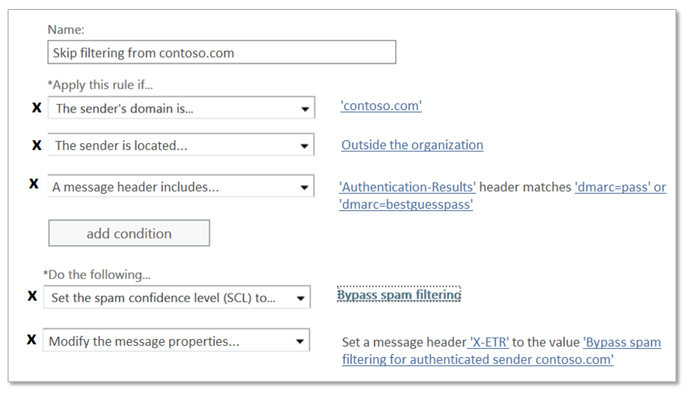

# Erstellen sicherer Absenderlisten in Office 365

Wenn Sie sicherstellen möchten, dass Benutzer e-Mails von einem bestimmten Absender oder Absender empfangen, weil Sie Ihnen und ihren Nachrichten Vertrauen, stehen Ihnen mehrere Methoden zur Verfügung, aus denen Sie auswählen können. Zu diesen Optionen gehören Exchange-Transport Regeln (ETRs), Outlook-sichere Absender, IP-Zulassungslisten, Absender-/Domänen Zulassungslisten für Spam Schutz.

> [!IMPORTANT]
> Zwar können Organisations Zulassungslisten verwendet werden, um falsch positive Ergebnisse zu beheben, dies sollte jedoch als vorübergehende Lösung betrachtet und nach Möglichkeit vermieden werden. Die Verwaltung von falsch positiven Ergebnissen mithilfe von Zulassungslisten wird nicht empfohlen, da Sie Ihre Organisation versehentlich bis hin zu Spoofing, Identitätswechsel und anderen Angriffen öffnen kann. Wenn Sie für diesen Zweck eine Zulassungsliste verwenden, müssen Sie wachsam sein und den Artikel zum [Senden von Spam-, nicht-Spam-und Phishing-Mails an Microsoft zur Analyse](https://docs.microsoft.com/en-us/office365/SecurityCompliance/submit-spam-non-spam-and-phishing-scam-messages-to-microsoft-for-analysis)parat halten.

Die empfohlene Methode zum Konfigurieren einer Liste sicherer Absender ist die Verwendung von Exchange-Transport Regeln (ETRs), da dies die meiste Flexibilität bietet, um sicherzustellen, dass nur die richtigen Nachrichten zugelassen werden. Die e-Mail-Adresse und *domänenbasierte Zulassungslisten* für *Anti-Spam-Richtlinien* sind nicht so sicher wie *IP-Adress basierte Listen* , da Domänen einfach gefälscht werden können. Aber auch die IP-basierten Listen für Anti-Spam-Richtlinien stellen Risiken dar, da Sie es allen Domänen ermöglichen, die über diese IP gesendet werden, um die Spamfilterung zu umgehen. Achten Sie darauf, dass *alle* getroffenen Ausnahmen sorgfältig überwacht werden.

> [!IMPORTANT]
> Informationen zum Erstellen einer **Liste blockierter Absender** finden Sie [hier](create-block-sender-lists-in-office-365.md).

## Optionen von den meisten zu den am wenigsten empfohlenen

Sie sollten ihre Zulassungslisten immer einschränken, da Sie viele Sicherheitsmaßnahmen umgehen. Sie müssen alle Zulassungslisten als Bestandteil ihrer Standardwartung erneut überprüfen, damit Sie wissen, wer umgehen darf. Die Empfehlung besteht darin, nach Möglichkeit restriktiven ETRs zu verwenden.

- Exchange-Transport Regeln (ETRs auch als Nachrichtenfluss Regeln bezeichnet)
- Outlook-sichere Absender
- Anti-Spam-Richtlinie: IP-Zulassungslisten
- Anti-Spam-Richtlinie: Zulassungslisten für Absender/Domänen

## Verwenden von Exchange-Transport Regeln (ETRs) zum Zulassen bestimmter Absender (empfohlen)

Um sicherzustellen, dass nur berechtigte Nachrichten in Ihrer Organisation zulässig sind, sollte die Bedingung einer der folgenden sein:

- Verwenden Sie den Absender Authentifizierungsstatus der sendenden Domäne. Hierzu überprüfen Sie die Kopfzeile der Authentifizierungsergebnisse, um sicherzustellen, dass Sie "dmarc = Pass" oder "dmarc = bestguesspass" enthält. Dadurch wird sichergestellt, dass die sendende Domäne authentifiziert wurde und nicht gefälscht ist. Klicken Sie hier, um weitere Informationen zur e-Mail-Authentifizierung [SPF](https://docs.microsoft.com/en-us/office365/SecurityCompliance/set-up-spf-in-office-365-to-help-prevent-spoofing), [DKIM](https://docs.microsoft.com/en-us/office365/SecurityCompliance/use-dkim-to-validate-outbound-email)und [DMARC](https://docs.microsoft.com/en-us/office365/SecurityCompliance/use-dmarc-to-validate-email) zu erhalten.

- Wenn die sendende Domäne keine Authentifizierung aufweist, verwenden Sie die sendende Domäne *sowie* eine sendende IP-Adresse (oder einen IP-Bereich). Stellen Sie sicher, dass Sie so *restriktiv wie möglich*sind, das Ziel ist, dass Sie dies so sicher wie möglich tun. Ein IP-Bereich größer als/24 wird *nicht* empfohlen. Vermeiden Sie das Hinzufügen von IP-Adressbereichen, die zu Consumer-Diensten oder gemeinsam genutzten Infrastrukturen gehören.

> [!IMPORTANT]
> Wenn Sie eine IP-Adresse zulassen, die NATted ist, sollten Sie die Computer kennen, die an diesem NAT-Pool beteiligt sind, um den Bereich ihrer Allow zu kennen. Beachten Sie, dass sich IP-Adressen möglicherweise ändern und NAT-Teilnehmer ebenfalls möglicherweise. Sie müssen alle Zulassungslisten erneut überprüfen, einschließlich der IP-Adresse, die als Teil ihrer Standardwartung zulässig ist.

- *Optional*können Sie eine Bedingung hinzufügen, dass die Nachricht von außerhalb der Organisation stammt (Dies ist implizit, aber es ist in Ordnung, Sie als Bedingung hinzuzufügen, um lokale Server zu berücksichtigen, die möglicherweise nicht ordnungsgemäß konfiguriert sind).

- Wenn Sie eindeutige Stichwörter oder Ausdrücke im e-Mail-Betreff oder-Textkörper identifizieren können, verwenden Sie diese Informationen *optional*als zusätzliche Bedingung, um die von der Nachrichtenfluss Regel zugelassenen e-Mail-Nachrichten weiter einzuschränken.

Die Aktion für die Regel muss diesem Muster entsprechen:

1. Legen Sie die SCL-Bewertung (Spam Confidence Level) auf-1 (Spamfilterung umgehen) fest.

2. Fügen Sie einen X-Header hinzu, um zu sagen, was die Regel bewirkt. Im folgenden Beispiel können Sie einen einfachen Header "X-ETR: Bypass Spam Filtering for authenticated Sender `contoso.com`" hinzufügen. Wenn Sie mehr als eine Domäne in dieser Regel haben, können Sie den Kopfzeilentext entsprechend ändern. **Wenn eine Nachricht die Filterung aufgrund eines ETR überspringt, stempelt Sie SFV: SKN im X-Forefront-Antispam-Report-Header** (**Wenn es sich um eine IP-Zulassungsliste handelt, stempelt es auch IPV: Cal**). Dies hilft bei der Problembehandlung.

> [!CAUTION]
> Konfigurieren Sie Nachrichtenfluss Regeln nur mit *der Absenderdomäne* als Bedingung zum Überspringen der Spamfilterung. Diese Methode erhöht erheblich das Risiko, dass Spammer die sendende Domäne spoofen können (oder die vollständige e-Mail-Adresse annehmen), alle Spamfilterung überspringen, Absender Authentifizierungsprüfungen und die Nachricht wird im Posteingang einer Person eingehen.

Fügen Sie keine Domänen, die Sie besitzen, oder beliebte Domänen ( `microsoft.com`beispielsweise) zur Nachrichtenfluss Regel als Bedingung hinzu. Dies wird als hohes Risiko betrachtet, da es Gelegenheiten für fehlerhafte Akteure schafft, Ihnen e-Mails zu senden, die andernfalls herausgefiltert würden.

[Klicken Sie für die Schritte zum Erstellen einer ETR, die auch als Nachrichtenfluss Regeln bezeichnet](https://docs.microsoft.com/en-us/office365/SecurityCompliance/use-mail-flow-rules-to-set-the-spam-confidence-level-scl-in-messages)werden.

## Verwenden von sicheren Outlook-Absendern (Endbenutzer verwaltet)

Anstatt eine Adresse, eine Domäne oder eine IP-Adresse Global zu autorisieren, können Endbenutzer auch das Senden von Adressen über Outlook-sichere Absender zulassen. Die Schritte zum Einrichten dieser Einstellung unterscheiden sich zwischen [Outlook Web App](https://support.office.com/en-us/article/block-or-allow-junk-email-settings-48c9f6f7-2309-4f95-9a4d-de987e880e46) und dem [Outlook-Client](https://support.office.com/en-us/article/overview-of-the-junk-email-filter-5ae3ea8e-cf41-4fa0-b02a-3b96e21de089). **Wenn Nachrichten aufgrund sicherer Absender erfolgreich autorisiert wurden, wird SFV: SFE im X-Forefront-Antispam-Report angezeigt** , der angibt, dass die Spam/Spoof/Phishing-Filterung umgangen wird.

## Verwenden von IP-Zulassungslisten für Anti-Spam-Richtlinien

Wenn es nicht möglich ist, ETRs zu verwenden, um einen bestimmten Absender Global zuzulassen, während die Absenderauthentifizierung überprüft wird, oder indem Sie eine Domäne und eine IP zusammenbinden, ist die nächste beste Option das Hinzufügen des Absenders zur *IP-Zulassungsliste für Anti-Spam-Richtlinien*. [Die detaillierten Schritte finden Sie unter Configure the Connection Filter Policy Document](https://docs.microsoft.com/en-us/office365/securitycompliance/configure-the-connection-filter-policy). Es ist wichtig, die Liste der zulässigen IP-Adressen möglichst gering zu halten und keine IP-Adressbereiche zu verwenden. Vermeiden Sie das Hinzufügen von IP-Adressbereichen, die zu Consumer-Diensten oder gemeinsam genutzten Infrastrukturen gehören, und stellen Sie außerdem *sicher* , dass Sie die Liste der zulässigen IP-Adressen regelmäßig überprüfen und die nicht mehr benötigten entfernen.

> [!CAUTION]
> Wenn Sie Anti-Spam Policies so konfigurieren, dass Sie nur basierend auf der IP-Adresse des Absenders zugelassen werden, wird die Spam Filterung für alle Nachrichten von dieser IP-Adresse in der Zulassungsregel übersprungen. Dies führt zu einem hohen Risiko, dass ungültige Akteure e-Mails senden, die andernfalls herausgefiltert würden. Diese Methode überspringt auch alle Spamfilterung, Absender Authentifizierungsprüfungen und die Nachricht landet im Posteingang eines Benutzers, wodurch das Risiko erhöht wird.

## Verwenden von Absender-/Domänen Zulassungslisten für Anti-Spam-Richtlinien

Die am wenigsten wünschenswerte Option besteht darin, nach Absender/Domäne zu autorisieren. Diese Option sollte möglichst vermieden ** werden, da Spam/Spoof/Phishing-Schutz vollständig umgangen wird und die Absenderauthentifizierung nicht ausgewertet wird. Diese Methode erhöht das Risiko, dass e-Mails von fehlerhaften Akteuren empfangen werden, und wird am besten vorübergehend und nur beim Testen empfohlen. Die detaillierten Schritte finden [Sie unter Configure your Spamfilter Policies](https://docs.microsoft.com/en-us/office365/securitycompliance/configure-your-spam-filter-policies) Document.

Der maximale Grenzwert für diese Listen beträgt ca. 1000 Einträge.

> [!CAUTION]
> Das Konfigurieren von Antispam-Policies zum *Zulassen der Absender-zuzulassen-Domäne* führt dazu, dass Nachrichten Spam Filterung für a) Nachrichten von Absendern in der Zulassungsliste oder b) alle Absender aus einer zulässigen Domäne überspringen. Diese Methode erhöht erheblich das Risiko, dass Spammer die sendende Domäne spoofen können (oder die vollständige e-Mail-Adresse imitieren), die alle Spamfilterung, Absender Authentifizierungsprüfungen überspringt und die Nachricht direkt an den Posteingang einer Person sendet.
> 
> Fügen Sie keine Domänen, die Sie besitzen oder beliebter `microsoft.com`Domänen (beispielsweise) zur Nachrichtenfluss Regel als Bedingung hinzu. Diese Methode wird als hohes Risiko betrachtet, da Sie Gelegenheiten für fehlerhafte Akteure schafft, Ihnen e-Mails zu senden, die andernfalls herausgefiltert würden, wodurch das Risiko erhöht würde.

> [!IMPORTANT]
> Informationen zum Erstellen einer **Liste blockierter Absender** finden Sie [hier](create-block-sender-lists-in-office-365.md).
