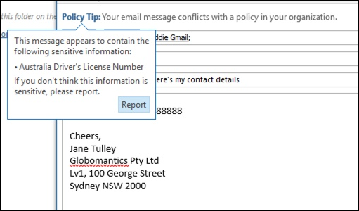
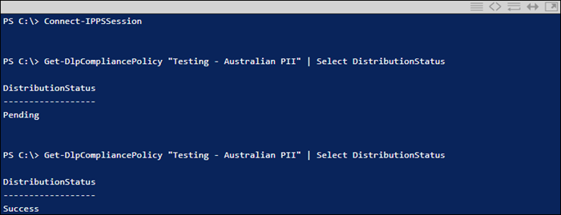

# Erstellen, Testen und Optimieren einer DLP-RichtlinieCreate, test, and tune a DLP policy

**Prinzipal Autor****Principal author**  
Paul Cunningham, Microsoft MVPPaul Cunningham, Microsoft MVP  
[Praktische 365Practical 365](https://practical365.com/)  
[@Practical365@Practical365](https://twitter.com/practical365) 
__________________________________________________

"Verhinderung von Datenverlust" ist ein Compliance-Feature von Office 365, mit dessen Hilfe Ihr Unternehmen verhindern kann, dass vertrauliche Informationen vorsätzlich oder versehentlich an unerwünschte Personen gerichtet werden.Data loss prevention is a compliance feature of Office 365 that is designed to help your organization prevent the intentional or accidental exposure of sensitive information to unwanted parties. DLP hat seine Wurzeln in Exchange Server und Exchange Online und ist auch in SharePoint Online und OneDrive for Business anwendbar.DLP has its roots in Exchange Server and Exchange Online, and is also applicable in SharePoint Online and OneDrive for Business.

DLP verwendet ein Inhaltsanalyse Modul, um den Inhalt von e-Mail-Nachrichten und Dateien zu untersuchen und nach vertraulichen Informationen wie Kreditkartennummern und personenbezogenen Informationen (PII) zu suchen.DLP uses a content analysis engine to examine the contents of email messages and files, looking for sensitive information such as credit card numbers and personally identifiable information (PII). Vertrauliche Informationen sollten in der Regel nicht per e-Mail oder in Dokumente gesendet werden, ohne zusätzliche Schritte wie das Verschlüsseln der e-Mail-Nachricht oder Dateien zu Unternehmen.Sensitive information should typically not be sent in email, or included in documents, without taking additional steps such as encrypting the email message or files. Mit DLP können Sie vertrauliche Informationen aufspüren und Maßnahmen ergreifen, wie beispielsweise:Using DLP you can detect sensitive information, and take action such as:

- Protokollieren des Ereignisses zu ÜberwachungszweckenLog the event for auditing purposes
- Anzeigen einer Warnung an den Endbenutzer, der die e-Mail sendet oder die Datei freigibtDisplay a warning to the end user who is sending the email or sharing the file
- Aktives Blockieren der e-Mail-oder DateifreigabeActively block the email or file sharing from taking place

Manchmal lehnen Kunden DLP ab, da Sie sich nicht für die Art von Daten halten, die geschützt werden müssen.Sometimes customers dismiss DLP because they don't consider themselves to have the type of data that needs protecting. Es wird davon ausgegangen, dass vertrauliche Daten wie medizinische Datensätze oder finanzielle Informationen nur für Branchen wie das Gesundheitswesen oder für Unternehmen mit Online Shops vorhanden sind.The assumption is that sensitive data, such as medical records or financial information, only exists for industries like health care or for companies that run online stores. Aber jedes Unternehmen kann vertrauliche Informationen regelmäßig behandeln, auch wenn Sie es nicht erkennen.But any business can handle sensitive information on a regular basis, even if they don't realize it. Eine Tabelle mit Mitarbeiternamen und Geburtsdaten ist ebenso vertraulich wie eine Tabelle mit Kundennamen und Kreditkartendetails.A spreadsheet of employee names and dates of birth is just as sensitive as a spreadsheet of customer names and credit card details. Und diese Art von Informationen neigt dazu, mehr zu bewegen, als Sie vielleicht erwarten, da Mitarbeiter ruhig über Ihre täglichen Aufgaben zu gehen, denken nichts der Export eine CSV-Datei aus einem System und per e-Mail an einen anderen.And this type of information tends to float around more than you might expect, as employees quietly go about their day to day tasks, thinking nothing of export a CSV file from a system and emailing it to someone. Sie können auch überrascht sein, wie oft Mitarbeiter e-Mails mit Kreditkarten-oder Bank Details senden, ohne die Konsequenzen zu berücksichtigen.You might also be surprised how often employees send emails containing credit card or banking details without considering the consequences.

## Erkennung vertraulicher Informationen durch DLPHow sensitive information is detected by DLP

Vertrauliche Informationen werden durch RegEx-Musterübereinstimmung (Regular Expression) in Kombination mit anderen Indikatoren wie der Nähe bestimmter Schlüsselwörter zu den übereinstimmenden Mustern identifiziert.Sensitive information is identified by regular expression (RegEx) pattern matching, in combination with with other indicators such as the proximity of certain keywords to the matching patterns. Ein Beispiel hierfür sind Kreditkartennummern.An example of this is credit card numbers. Eine VISA-Kreditkartennummer hat 16 Ziffern.A VISA credit card number has 16 digits. Diese Ziffern können jedoch auf unterschiedliche Weise geschrieben werden, beispielsweise 1111-1111-1111-1111, 1111 1111 1111 1111 oder 1111111111111111.However, those digits can be written in different ways, such as 1111-1111-1111-1111, 1111 1111 1111 1111, or 1111111111111111.

Jede 16-stellige Zeichenfolge ist nicht unbedingt eine Kreditkartennummer, es könnte eine Ticketnummer von einem Helpdesk-System oder eine Seriennummer eines Hardware Stücks sein.Any 16 digit string is not necessarily a credit card number, it could be a ticket number from a help desk system, or a serial number of a piece of hardware. Um den Unterschied zwischen einer Kreditkartennummer und einer harmlosen 16-stelligen Zeichenfolge zu erkennen, wird eine Berechnung durchgeführt (checksum), um zu bestätigen, dass die Zahlen mit einem bekannten Muster der verschiedenen Kreditkarten Marken übereinstimmen.To tell the difference between a credit card number and a harmless 16-digit string, a calculation is performed (checksum) to confirm that the numbers match a known pattern from the various credit card brands.

Darüber hinaus wird auch die Nähe von Stichwörtern wie "VISA" oder "AMEX" sowie die Nähe zu Datumswerten, die das Gültigkeitsdatum der Kreditkarte sein können, als Entscheidung getroffen, ob es sich bei den Daten um eine Kreditkartennummer handelt oder nicht.Furthermore, the proximity of keywords such as “VISA” or “AMEX”, along with the proximity to date values that might be the credit card expiry date, is also considered to make a decision about whether the data is a credit card number or not.

Mit anderen Worten ist DLP in der Regel intelligent genug, um den Unterschied zwischen diesen beiden Texten in einer e-Mail zu erkennen:In other words, DLP is usually smart enough to recognize the difference between these two texts in an email:

- "Können Sie mir einen neuen Laptop bestellen.“Can you order me a new laptop. Verwenden Sie meine VISA Nummer 1111-1111-1111-1111, Ablauf 11/22, und senden Sie mir das voraussichtliche Lieferdatum, wenn Sie es haben. "Use my VISA number 1111-1111-1111-1111, expiry 11/22, and send me the estimated delivery date when you have it.”
- "Meine Laptop-Seriennummer ist 2222-2222-2222-2222 und wurde am 11/2010 erworben.“My laptop serial number is 2222-2222-2222-2222 and it was purchased on 11/2010. Ist mein Reisevisum noch nicht genehmigt? "By the way, is my travel visa approved yet?”

In diesem [Thema zu vertraulichen Informationstypen](what-the-sensitive-information-types-look-for.md) wird erläutert, wie jeder Informationstyp erkannt wird.A good reference to keep bookmarked is this [topic on sensitive information types](what-the-sensitive-information-types-look-for.md) that explains how each information type is detected.

## Wo beginnen Sie mit der Verhinderung von DatenverlustWhere to start with data loss prevention

Wenn die Risiken von Datenlecks nicht ganz offensichtlich sind, ist es schwierig zu erarbeiten, wo genau Sie mit der Implementierung von DLP beginnen sollten.When the risks of data leakage aren't entirely obvious, it's difficult to work out where exactly you should start with implementing DLP. Zum Glück können DLP-Richtlinien im Testmodus ausgeführt werden, sodass Sie ihre Effektivität und Genauigkeit vor dem Aktivieren der Funktion messen.Fortunately, DLP policies can be run in “test mode”, allowing you to gauge their effectiveness and accuracy before you turn them on.

DLP-Richtlinien für Exchange Online können über das Exchange-Verwaltungskonsole verwaltet werden.DLP policies for Exchange Online can be managed through the Exchange admin center. Sie können jedoch DLP-Richtlinien für alle Arbeitsauslastungen über das Security & Compliance Center konfigurieren.But you can configure DLP policies for all workloads through the Security & Compliance Center, so that's what I'll use for demonstrations in this article. Im Security & Compliance Center finden Sie die DLP-Richtlinien unter **Data Loss Prevention** > **Policy**.In the Security & Compliance Center you'll find the DLP policies under **Data loss prevention** > **Policy**. Klicken Sie auf **Richtlinie erstellen** , um zu starten.Click on **Create a policy** to start.

Office 365 bietet eine Reihe von [DLP-Richtlinienvorlagen](what-the-dlp-policy-templates-include.md) , die Sie zum Erstellen von DLP-Richtlinien verwenden können.Office 365 provides a range of [DLP policy templates](what-the-dlp-policy-templates-include.md) you can use to create DLP policies. Angenommen, Sie sind ein australisches Unternehmen.Let's say that you're an Australian business. Sie können die Richtlinienvorlagen filtern, um nur diejenigen anzuzeigen, die für Australien relevant sind, die in die allgemeinen Kategorien finanzieller, medizinischer und gesundheitlicher Datenschutz fallen.You can filter the policy templates to display only those that are relevant to Australia, which fall into the general categories of Financial, Medical and Health, and Privacy.

Für diese Demonstration wähle ich australische personenbezogene Informationen (PII) aus, die die Informationstypen der australischen Steuer Dateinummer (TFN) und die Treiber Lizenznummer enthalten.For this demonstration I'll choose Australian Personally Identifiable Information (PII) Data, which includes the information types of Australian Tax File Number (TFN) and Driver's License Number.

Geben Sie Ihrer neuen DLP-Richtlinie einen Namen.Give your new DLP policy a name. Der Standardname stimmt mit der DLP-Richtlinienvorlage überein, Sie sollten jedoch einen aussagekräftigeren Namen für Ihre eigenen auswählen, da mehrere Richtlinien aus derselben Vorlage erstellt werden können.The default name will match the DLP policy template, but you should choose a more descriptive name of your own, because multiple policies can be created from the same template.

Wählen Sie die Speicherorte aus, auf die die Richtlinie angewendet werden soll.Choose the locations that the policy will apply to. DLP-Richtlinien können für Exchange Online, SharePoint Online und OneDrive for Business gelten.DLP policies can apply to Exchange Online, SharePoint Online, and OneDrive for Business. Ich möchte diese Richtlinie so konfigurieren, dass Sie auf alle Standorte angewendet wird.I am going to leave this policy configured to apply to all locations.

Akzeptieren Sie beim ersten Schritt der **Richtlinieneinstellungen** nur die Standardwerte für jetzt.At the first **Policy Settings** step just accept the defaults for now. Es gibt eine Vielzahl von Anpassungen, die Sie in DLP-Richtlinien ausführen können, aber die Standardwerte sind ein guter Ausgangspunkt.There is quite a lot of customization you can do in DLP policies, but the defaults are a fine place to start.

Nachdem Sie auf **weiter** geklickt haben, wird eine Seite mit zusätzlichen **Richtlinieneinstellungen** mit weiteren Anpassungsoptionen angezeigt.After clicking **Next** you'll be presented with an additional **Policy Settings** page with more customization options. Für eine Richtlinie, die Sie gerade testen, können Sie hier beginnen, einige Anpassungen vorzunehmen.For a policy that you are just testing, here's where you can start to make some adjustments.

- Ich habe die Richtlinien Tipps für jetzt deaktiviert, was ein angemessener Schritt ist, wenn Sie nur die Dinge testen und noch nichts für die Benutzer anzeigen möchten.I've turned off policy tips for now, which is a reasonable step to take if you're just testing things out and don't want to display anything to users yet. Richtlinien Tipps zeigen Warnungen für Benutzer an, die gegen eine DLP-Richtlinie verstoßen.Policy tips display warnings to users that they're about to violate a DLP policy. Ein Outlook-Benutzer sieht beispielsweise eine Warnung, dass die angefügte Datei Kreditkartennummern enthält und Ihre e-Mails zurückgewiesen wird.For example, an Outlook user will see a warning that the file they've attached contains credit card numbers and will cause their email to be rejected. Das Ziel von Richtlinien Tipps besteht darin, das nicht kompatible Verhalten zu beenden, bevor es geschieht.The goal of policy tips is to stop the non-compliant behaviour before it happens.
- Ich habe auch die Anzahl der Instanzen von 10 auf 1 verringert, sodass diese Richtlinie eine Freigabe von australischen PII-Daten ermittelt, nicht nur die Massenfreigabe der Daten.I've also decreased the number of instances from 10 to 1, so that this policy will detect any sharing of Australian PII data, not just bulk sharing of the data.
- Ich habe auch einen weiteren Empfänger zu der Vorfall Bericht-e-Mail hinzugefügt.I've also added another recipient to the incident report email.

Schließlich habe ich diese Richtlinie so konfiguriert, dass Sie zunächst im Testmodus ausgeführt wird.Finally, I've configured this policy to run in test mode initially. Beachten Sie, dass es hier auch eine Option gibt, um Richtlinien Tipps im Testmodus zu deaktivieren.Notice there's also an option here to disable policy tips while in test mode. Auf diese Weise haben Sie die Flexibilität, Richtlinien Tipps in der Richtlinie aktiviert zu haben, aber dann entscheiden, ob Sie während der Tests angezeigt oder unterdrückt werden sollen.This gives you the flexibility to have policy tips enabled in the policy, but then decide whether to show or suppress them during your testing.

Klicken Sie auf dem Bildschirm abschließende Überprüfung auf **Erstellen** , um die Erstellung der Richtlinie abzuschließen.On the final review screen click **Create** to finish creating the policy.

## Testen einer DLP-RichtlinieTest a DLP policy

Ihre neue DLP-Richtlinie wird innerhalb einer Stunde wirksam.Your new DLP policy will begin to take effect within about 1 hour. Sie können sitzen und warten, bis es von normaler Benutzeraktivität ausgelöst wird, oder Sie können versuchen, es selbst auszulösen.You can sit and wait for it to be triggered by normal user activity, or you can try to trigger it yourself. Zuvor habe ich mich mit diesem [Thema zu vertraulichen Informationstypen](what-the-sensitive-information-types-look-for.md)verknüpft, in dem Sie Informationen dazu erhalten, wie Sie DLP-Übereinstimmungen auslösen.Earlier I linked to this [topic on sensitive information types](what-the-sensitive-information-types-look-for.md), which provides you with information about how to trigger DLP matches.

Die für diesen Artikel erstellte DLP-Richtlinie ermittelt beispielsweise australische Steuerdatei Nummern (TFN).As an example, the DLP policy I created for this article will detect Australian tax file numbers (TFN). Gemäß der Dokumentation basiert die Übereinstimmung auf den folgenden Kriterien.According to the documentation, the match is based on the following criteria.

 
Um die TFN-Erkennung auf eine eher stumpfe Weise zu demonstrieren, wird eine e-Mail mit den Worten "Tax File Number" und eine 9-stellige Zeichenfolge in unmittelbarer Nähe ohne Probleme durchlaufen.To demonstrate TFN detection in a rather blunt manner, an email with the words “Tax file number” and a 9 digit string in close proximity will sail through without any issues. Der Grund dafür, dass die DLP-Richtlinie nicht ausgelöst wird, besteht darin, dass die 9-stellige Zeichenfolge die Prüfsumme passieren muss, die angibt, dass es sich um eine gültige TFN und nicht nur um eine harmlose Zahlenfolge handelt.The reason it does not trigger the DLP policy is that the 9-digit string must pass the checksum that indicates it is a valid TFN and not just a harmless string of numbers.

Im Vergleich dazu löst eine e-Mail mit dem Wort "Tax File Number" und einem gültigen TFN, das die Prüfsumme übergibt, die Richtlinie aus.In comparison, an email with the words “Tax file number” and a valid TFN that passes the checksum will trigger the policy. Für den Eintrag hier wurde die TFN, die ich verwende, von einer Website entnommen, die gültige, aber nicht echte TFNs generiert.For the record here, the TFN I'm using was taken from a website that generates valid, but not genuine, TFNs. Es gibt ähnliche Websites, die [gültige, aber gefälschte Kreditkartennummern](http://www.fakecreditcardgenerator.net/)generieren.There are similar sites that generate [valid but fake credit card numbers](http://www.fakecreditcardgenerator.net/). Solche Websites sind sehr nützlich, da eine der häufigsten Fehler beim Testen einer DLP-Richtlinie eine gefälschte Nummer verwendet wird, die ungültig ist und die Prüfsumme nicht weiter gibt (und daher die Richtlinie nicht auslöst).Such sites are very useful because one of the most common mistakes when testing a DLP policy is using a fake number that's not valid and won't pass the checksum (and therefore won't trigger the policy).

Die Vorfall Bericht-e-Mail enthält den Typ der vertraulichen Informationen, die erkannt wurden, wie viele Instanzen erkannt wurden, und die Zuverlässigkeitsstufe der Erkennung.The incident report email includes the type of sensitive information that was detected, how many instances were detected, and the confidence level of the detection.

Wenn Sie Ihre DLP-Richtlinie im Testmodus belassen und die Vorfall Berichts-e-Mails analysieren, können Sie sich über die Genauigkeit der DLP-Richtlinie und ihre Wirksamkeit bei der Erzwingung informieren.If you leave your DLP policy in test mode and analyze the incident report emails, you can start to get a feel for the accuracy of the DLP policy and how effective it will be when it is enforced. Zusätzlich zu den Vorfall Berichten können Sie [die DLP-Berichte verwenden](view-the-dlp-reports.md) , um eine aggregierte Ansicht der Richtlinien Übereinstimmungen in Ihrem Mandanten anzuzeigen.In addition to the incident reports, you can [use the DLP reports](view-the-dlp-reports.md) to see an aggregated view of policy matches across your tenant.

## Optimieren einer DLP-RichtlinieTune a DLP policy

Wenn Sie Ihre Richtlinien Treffer analysieren, können Sie einige Anpassungen an den Richtlinien vornehmen.As you analyze your policy hits you might want to make some adjustments to how the policies behave. Als einfaches Beispiel können Sie feststellen, dass ein TFN in einer e-Mail kein Problem darstellt (ich glaube, es ist immer noch, aber lassen Sie uns es um der Demonstration Willen gehen), aber zwei oder mehr Instanzen ist ein Problem.As a simple example, you might determine that one TFN in email is not a problem (I think it still is, but let's go with it for the sake of demonstration), but two or more instances is a problem. Bei mehreren Instanzen kann es sich um ein riskantes Szenario handeln, beispielsweise einen Mitarbeiter, der einen CSV-Export aus der HR-Datenbank an eine externe Person per e-Mail abgibt, beispielsweise einen externen Buchhaltungsdienst.Multiple instances could be a risky scenario such as an employee emailing a CSV export from the HR database to an external party, for example an external accounting service. Definitiv etwas, das Sie lieber aufspüren und blockieren möchten.Definitely something you would prefer to detect and block.

Im Security & Compliance Center können Sie eine vorhandene Richtlinie bearbeiten, um das Verhalten anzupassen.In the Security & Compliance Center you can edit an existing policy to adjust the behaviour.

 
Sie können die Standorteinstellungen so anpassen, dass die Richtlinie nur auf bestimmte Arbeitslasten oder auf bestimmte Websites und Konten angewendet wird.You can adjust the location settings so that the policy is applied only to specific workloads, or to specific sites and accounts.

Sie können auch die Richtlinieneinstellungen anpassen und die Regeln entsprechend Ihren Anforderungen bearbeiten.You can also adjust the policy settings and edit the rules to better suit your needs.

Beim Bearbeiten einer Regel in einer DLP-Richtlinie können Sie Folgendes ändern:When editing a rule within a DLP policy you can change:

- Die Bedingungen, einschließlich des Typs und der Anzahl der Instanzen von vertraulichen Daten, die die Regel auslösen.The conditions, including the type and number of instances of sensitive data that will trigger the rule.
- Die Aktionen, die ausgeführt werden, beispielsweise das Einschränken des Zugriffs auf den Inhalt.The actions that are taken, such as restricting access to the content.
- Benutzer Benachrichtigungen, die dem Benutzer in seinem e-Mail-Client oder Webbrowser angezeigt werden.User notifications, which are policy tips that are displayed to the user in their email client or web browser.
- Benutzerüberschreibungen, die festlegen, ob Benutzer Ihre e-Mail-oder Dateifreigabe trotzdem fortsetzen können.User overrides, which determines whether users can choose to proceed with their email or file sharing anyway.
- Vorfallberichte, um Administratoren zu benachrichtigen.Incident reports, to notify administrators.

Für diese Demo habe ich Benutzer Benachrichtigungen zu der Richtlinie hinzugefügt (seien Sie vorsichtig, dies ohne angemessene Benutzerschulung zu tun), und Benutzer können die Richtlinie mit einer geschäftlichen Begründung überschreiben oder als falsch positives Ergebnis kennzeichnen.For this demonstration I've added user notifications to the policy (be careful of doing this without adequate user awareness training), and allowed users to override the policy with a business justification or by flagging it as a false positive. Beachten Sie, dass Sie den e-Mail-und richtlinientipp Text auch anpassen können, wenn Sie zusätzliche Informationen zu den Richtlinien Ihrer Organisation hinzufügen möchten, oder Benutzer auffordern, den Support zu kontaktieren, wenn Sie Fragen haben.Note that you can also customize the email and policy tip text if you want to include any additional information about your organization's policies, or prompt users to contact support if they have questions.

Die Richtlinie enthält zwei Regeln für die Behandlung von hohem Volumen und geringem Volumen, achten Sie daher darauf, beide mit den gewünschten Aktionen zu bearbeiten.The policy contains two rules for handling of high volume and low volume, so be sure to edit both with the actions that you want. Dies ist eine Möglichkeit, die Fälle abhängig von ihren Merkmalen unterschiedlich zu behandeln.This is an opportunity to treat cases differently depending on their characteristics. Sie können beispielsweise Außerkraftsetzungen für geringste Verstöße zulassen, jedoch keine Außerkraftsetzungen für große Verstöße.For example, you might allow overrides for low volume violations, but not allow overrides for high volume violations.

Außerdem müssen Sie eine Aktion für die Regel konfigurieren, um den Zugriff auf Inhalte, die die Richtlinie verletzen, tatsächlich zu blockieren oder einzuschränken.Also, if you want to actually block or restrict access to content that is in violation of policy, you need to configure an action on the rule to do so.

Nachdem Sie diese Änderungen an den Richtlinieneinstellungen gespeichert haben, muss ich auch zur Seite mit den Haupteinstellungen für die Richtlinie zurückkehren und die Option zum Anzeigen von Richtlinien Tipps für Benutzer aktivieren, während sich die Richtlinie im Testmodus befindet.After saving those changes to the policy settings, I also need to return to the main settings page for the policy and enable the option to show policy tips to users while the policy is in test mode. Dies ist ein effektives Verfahren, um Ihren Endbenutzern DLP-Richtlinien einzuführen und Benutzerschulungen durchzuführen, ohne zu viele falsch positive Ergebnisse zu riskieren, die sich auf Ihre Produktivität auswirken.This is an effective way to introduce DLP policies to your end users, and do user awareness training, without risking too many false positives that impact their productivity.

Auf der Serverseite (oder auf der Cloud-Seite) wird die Änderung aufgrund verschiedener Verarbeitungsintervalle möglicherweise nicht sofort wirksam.On the server side (or cloud side if you prefer), the change may not take effect immediately, due to various processing intervals. Wenn Sie eine DLP-Richtlinienänderung vornehmen, die einem Benutzer neue Richtlinien Tipps anzeigt, werden die Änderungen möglicherweise nicht sofort in Ihrem Outlook-Client angezeigt, der alle 24 Stunden auf Richtlinienänderungen überprüft.If you're making a DLP policy change that will display new policy tips to a user, the user may not see the changes take effect immediately in their Outlook client, which checks for policy changes every 24 hours. Wenn Sie die Dinge zu Testzwecken beschleunigen möchten, können Sie diesen Registrierungs Fix verwenden, um [den Zeitstempel des letzten Downloads aus dem PolicyNudges-Schlüssel zu löschen](https://support.microsoft.com/en-au/help/2823261/changes-to-a-data-loss-prevention-policy-don-t-take-effect-in-outlook?__hstc=18650278.46377037dc0a82baa8a30f0ef07a7b2f.1538687978676.1538693509953.1540315763430.3&__hssc=18650278.1.1540315763430&__hsfp=3446956451).If you want to speed things up for testing, you can use this registry fix to [clear the last download time stamp from the PolicyNudges key](https://support.microsoft.com/en-au/help/2823261/changes-to-a-data-loss-prevention-policy-don-t-take-effect-in-outlook?__hstc=18650278.46377037dc0a82baa8a30f0ef07a7b2f.1538687978676.1538693509953.1540315763430.3&__hssc=18650278.1.1540315763430&__hsfp=3446956451). In Outlook werden die neuesten Richtlinieninformationen heruntergeladen, wenn Sie das nächste Mal neu gestartet werden, und mit dem Erstellen einer e-Mail-Nachricht beginnen.Outlook will download the latest policy information the next time you restart it and begin composing an email message.

Wenn Sie Richtlinien Tipps aktiviert haben, beginnt der Benutzer mit der Anzeige der Tipps in Outlook und kann Ihnen beim Auftreten falsch positive Ergebnisse melden.If you have policy tips enabled, the user will begin to see the tips in Outlook, and can report false positives to you when they occur.

## Untersuchen falsch positiver ErgebnisseInvestigate false positives

DLP-Richtlinienvorlagen sind direkt aus dem Feld nicht perfekt.DLP policy templates are not perfect straight out of the box. Es ist wahrscheinlich, dass Sie einige falsch positive Ergebnisse in Ihrer Umgebung finden, weshalb es so wichtig ist, ihren Weg in eine DLP-Bereitstellung zu erleichtern, sich die Zeit nehmen, Ihre Richtlinien adäquat zu testen und zu optimieren.It's likely that you'll find some false positives occurring in your environment, which is why it's so important to ease your way into a DLP deployment, taking the time to adequately test and tune your policies.

Hier ist ein Beispiel für ein falsch positives Ergebnis.Here's an example of a false positive. Diese e-Mail ist ziemlich harmlos.This email is quite harmless. Der Benutzer stellt seine Mobiltelefonnummer einer Person zur Verfügung, einschließlich der e-Mail-Signatur.The user is providing their mobile phone number to someone, and including their email signature.

 
Der Benutzer sieht jedoch einen richtlinientipp, der Sie warnt, dass die e-Mail vertrauliche Informationen enthält, insbesondere die Lizenznummer eines australischen Treibers.But the user sees a policy tip warning them that the email contains sensitive information, specifically, an Australian driver's license number.

Der Benutzer kann das falsch positive melden, und der Administrator kann sich ansehen, warum er aufgetreten ist.The user can report the false positive, and the administrator can look into why it has occurred. In der Vorfall Bericht-e-Mail wird die e-Mail als falsch positiv gekennzeichnet.In the incident report email, the email is flagged as a false positive.

Dieser Führerschein Fall ist ein gutes Beispiel dafür.This driver's license case is a good example to dig into. Der Grund für dieses falsch positive Ergebnis ist, dass der Typ "Australian Driver es License" von einer beliebigen 9-stelligen Zeichenfolge (sogar eine, die Teil einer 10-stelligen Zeichenfolge ist) ausgelöst wird, innerhalb von 300 Zeichen in der Nähe der Schlüsselwörter "Sydney NSW" (Groß-/Kleinschreibung nicht beachtet).The reason this false positive has occurred is that the “Australian Driver's License” type will be triggered by any 9-digit string (even one that is part of a 10-digit string), within 300 characters proximity to the keywords “sydney nsw” (not case sensitive). Es wird also durch die Telefonnummer und die e-Mail-Signatur ausgelöst, nur weil der Benutzer zufällig in Sydney ist.So it's triggered by the phone number and email signature, only because the user happens to be in Sydney.

Interessant ist, dass die DLP-Richtlinie nicht ausgelöst wird, wenn "Sydney, NSW" ein Komma hat.Interestingly, if “Sydney, NSW” has a comma, the DLP policy is not triggered. Ich habe keine Ahnung, warum ein Komma hier einen Unterschied macht, noch warum andere Städte und Staaten in Australien nicht in die Schlüsselwörter für den australischen Treiber Lizenz-Informationstyp eingeschlossen sind, aber es geht los.I have no idea why a comma makes any difference here, nor why other cities and states in Australia aren't included in the keywords for the Australian driver's license information type, but there you go. Was können wir dagegen tun?So, what can we do about it? Es gibt eine Reihe von Optionen.There's a couple of options.

Eine Option besteht darin, den Lizenz Informationstyp des australischen Treibers aus der Richtlinie zu entfernen.One option is to remove the Australian driver's license information type from the policy. Er ist da, weil er Teil der DLP-Richtlinienvorlage ist, aber nicht dazu gezwungen ist.It's in there because it's part of the DLP policy template, but we're not forced to use it. Wenn Sie nur an Steuerdatei Nummern und nicht an Treiber Lizenzen interessiert sind, können Sie Sie einfach entfernen.If you're only interested in Tax File Numbers and not driver's licenses, you can just remove it. Sie können Sie beispielsweise aus der Regel für niedrige Volumes in der Richtlinie entfernen, aber in der Regel für hohe Volumes belassen, sodass Listen mit mehreren Treiber Lizenzen weiterhin erkannt werden.For example, you can remove it from the low volume rule in the policy, but leave it in the high volume rule so that lists of multiple drivers licenses are still detected.

 
Eine weitere Möglichkeit besteht darin, die Anzahl der Instanzen einfach zu erweitern, sodass ein niedriger Umfang an Treiber Lizenzen nur erkannt wird, wenn mehrere Instanzen vorhanden sind.Another option is to simply increase the instance count, so that a low volume of driver's licenses is only detected when there are multiple instances.

Sie können nicht nur die Anzahl der Instanzen ändern, sondern auch die Übereinstimmungs Genauigkeit (oder Zuverlässigkeitsstufe) anpassen.In addition to changing the instance count, you can also adjust the match accuracy (or confidence level). Wenn der Typ vertraulicher Informationen mehrere Muster aufweist, können Sie die Übereinstimmungs Genauigkeit in der Regel anpassen, sodass die Regel nur bestimmten Mustern entspricht.If your sensitive information type has multiple patterns, you can adjust the match accuracy in your rule, so that your rule matches only specific patterns. Um beispielsweise falsch positive Ergebnisse zu vermeiden, können Sie die Übereinstimmungs Genauigkeit der Regel so festlegen, dass nur das Muster mit der höchsten Zuverlässigkeitsstufe übereinstimmt.For example, to help reduce false positives, you can set the match accuracy of your rule so that it matches only the pattern with the highest confidence level. Zu verstehen, wie die Zuverlässigkeitsstufe berechnet wird, ist ein wenig heikel (und jenseits des Bereichs dieses Beitrags), aber hier ist eine gute Erklärung dafür, wie Sie die [Vertraulichkeitsstufe verwenden, um ihre Regeln zu optimieren](https://docs.microsoft.com/en-us/office365/securitycompliance/data-loss-prevention-policies#match-accuracy).Understanding how confidence level is calculated is a bit tricky (and beyond the scope of this post), but here's a good explanation of [how to use confidence level to tune your rules](https://docs.microsoft.com/en-us/office365/securitycompliance/data-loss-prevention-policies#match-accuracy).

Schließlich können Sie einen beliebigen vertraulichen Informationstyp anpassen – beispielsweise "Sydney NSW" aus der Liste der Schlüsselwörter für [Australian Driver es License](https://docs.microsoft.com/en-us/office365/securitycompliance/what-the-sensitive-information-types-look-for#australia-drivers-license-number)entfernen, um das oben ausgelöste falsch positive Ergebnis zu vermeiden.Finally, if you want to get even a bit more advanced, you can customize any sensitive information type -- for example, you can remove "Sydney NSW" from the list of keywords for [Australian Driver's License](https://docs.microsoft.com/en-us/office365/securitycompliance/what-the-sensitive-information-types-look-for#australia-drivers-license-number), to eliminate the false positive triggered above. Informationen dazu, wie Sie dies mithilfe von XML und PowerShell tun können, finden Sie in diesem Thema unter [Anpassen eines integrierten vertraulichen Informationstyps](customize-a-built-in-sensitive-information-type.md).To learn how to do this by using XML and PowerShell, see this topic on [customizing a built-in sensitive information type](customize-a-built-in-sensitive-information-type.md).

## Deaktivieren einer DLP-RichtlinieTurn off a DLP policy

Wenn Sie sich darüber freuen, dass ihre DLP-Richtlinie vertrauliche Informationstypen genau und effektiv ermittelt und die Endbenutzer bereit sind, die Richtlinien zu behandeln, die vorhanden sind, können Sie die Richtlinie aktivieren.When you're happy that your DLP policy is accurately and effectively detecting sensitive information types, and that your end users are ready to deal with the policies being in place, then you can enable the policy.

 
Wenn Sie warten, bis die Richtlinie wirksam wird, stellen Sie [eine Verbindung mit der Office 365 Security _AMP_ Compliance Center PowerShell her](https://docs.microsoft.com/en-us/powershell/exchange/office-365-scc/connect-to-scc-powershell/connect-to-scc-powershell?view=exchange-ps) , und führen Sie das [Cmdlet Get-DlpCompliancePolicy](https://docs.microsoft.com/en-us/powershell/module/exchange/policy-and-compliance-dlp/get-dlpcompliancepolicy?view=exchange-ps) aus, um die Eigenschaften distributionstatus anzuzeigen.If you're waiting to see when the policy will take effect, [Connect to Office 365 Security & Compliance Center PowerShell](https://docs.microsoft.com/en-us/powershell/exchange/office-365-scc/connect-to-scc-powershell/connect-to-scc-powershell?view=exchange-ps) and run the [Get-DlpCompliancePolicy cmdlet](https://docs.microsoft.com/en-us/powershell/module/exchange/policy-and-compliance-dlp/get-dlpcompliancepolicy?view=exchange-ps) to see the DistributionStatus.

Nach dem Aktivieren der DLP-Richtlinie sollten Sie einige abschließende Tests durchführen, um sicherzustellen, dass die erwarteten Richtlinienaktionen ausgeführt werden.After turning on the DLP policy, you should run some final tests of your own to make sure that the expected policy actions are occurring. Wenn Sie versuchen, Dinge wie Kreditkartendaten zu testen, gibt es Websites online mit Informationen zum Generieren von Beispiel Kreditkarten oder anderen persönlichen Informationen, die Prüfsummen überschreiten und ihre Richtlinien auslösen.If you're trying to test things like credit card data, there are websites online with information on how to generate sample credit card or other personal information that will pass checksums and trigger your policies.

Durch Richtlinien, die Benutzerüberschreibungen zulassen, wird diese Option dem Benutzer als Teil des Richtlinien Tipps angezeigt.Policies that allow user overrides will present that option to the user as part of the policy tip.

Durch Richtlinien, die Inhalte einschränken, wird dem Benutzer die Warnung als Teil des Richtlinien Tipps angezeigt und verhindert, dass diese e-Mails gesendet werden.Policies that restrict content will present the warning to the user as part of the policy tip, and prevent them from sending the email.

## ZusammenfassungSummary

Richtlinien zur Verhinderung von Datenverlust sind für Organisationen aller Typen nützlich.Data loss prevention policies are useful for organizations of all types. Das Testen einiger DLP-Richtlinien ist aufgrund der Kontrolle, die Sie über die Richtlinien Tipps, Endbenutzer Überschreibungen und vorfallberichte haben, mit einem geringen Risiko verbunden.Testing some DLP policies is a low risk exercise due to the control you have over things like policy tips, end user overrides, and incident reports. Sie können einige DLP-Richtlinien ruhig testen, um zu sehen, welche Art von Verstößen bereits in Ihrer Organisation vorkommt, und dann Richtlinien mit niedrigen falsch positiven Raten durchführen, Ihre Benutzer über das erlaubte und nicht zugelassene informieren und dann ihre DLP-Richtlinien auf die Organisation.You can quietly test some DLP policies to see what type of violations are already occurring in your organization, and then craft policies with low false positive rates, educate your users on what is allowed and not allowed, and then roll out your DLP policies to the organization.
