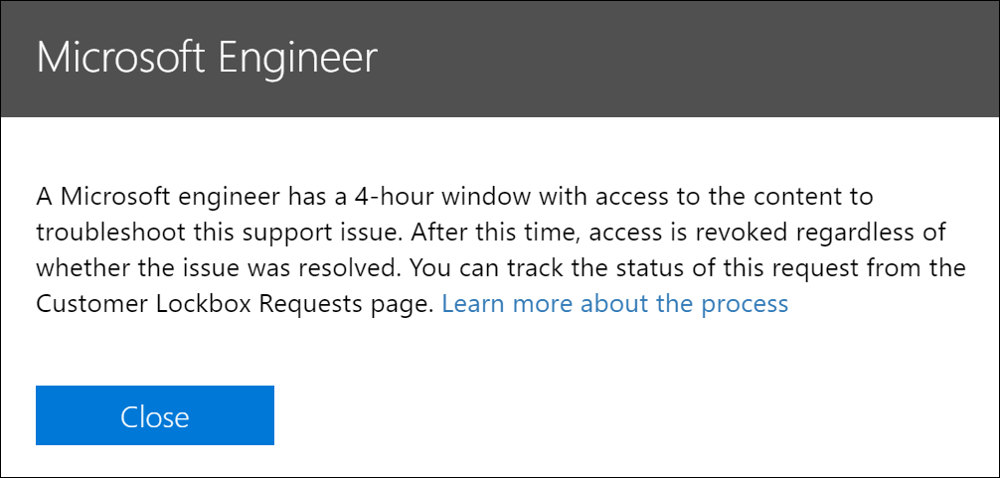

# Kunden-Lockbox in Office 365

> [!NOTE]
> In diesem Artikel werden Bereitstellungs-und Konfigurationsanleitungen für ein Feature bereitgestellt, das derzeit nur für Organisationen mit Microsoft 365 E5, Office 365 E5, Information Protection and Compliance oder Advanced Compliance Add-on-Abonnement zur Verfügung steht.

Kunden-Lockbox stellt sicher, dass Microsoft nicht auf Ihre Inhalte zugreifen kann, um einen Dienstvorgang ohne Ihre ausdrückliche Genehmigung auszuführen. Kunden-Lockbox bringt Sie in den Genehmigungsworkflow für Anforderungen für den Zugriff auf Ihre Inhalte.

Gelegentlich helfen Microsoft-Ingenieure bei der Problembehandlung und beim Beheben von vom Kunden gemeldeten Problemen im Support Prozess. In der Regel werden Probleme durch umfangreiche Telemetrie-und Debugging-Tools behoben, die Microsoft für seine Dienste implementiert hat. In einigen Fällen ist es jedoch erforderlich, dass ein Microsoft-Techniker auf Kunden Inhalte zugreift, um die Ursache zu ermitteln und das Problem zu beheben. Kunden-Lockbox erfordert, dass der Techniker Zugriff vom Kunden als letzten Schritt im Genehmigungsworkflow anfordert. Dadurch erhalten Organisationen die Möglichkeit, diese Anforderungen zu genehmigen oder abzulehnen und dem Kunden eine direkte Zugriffssteuerung bereitzustellen.

### Kunden-Lockbox – Übersichtsvideo

> [!VIDEO https://www.microsoft.com/videoplayer/embed/8fecf10b-1f03-4849-8b67-76d3d2a43f26?autoplay=false]

> [!NOTE]
> Kunden-Lockbox unterstützt Anforderungen für den Zugriff auf Daten in Exchange Online, SharePoint Online und OneDrive für Unternehmen. Um die Unterstützung für andere Office 365 Dienste zu empfehlen, senden Sie eine Anforderung an [Office 365 UserVoice](https://office365.uservoice.com/).

## Kunden-Lockbox-Workflow

Die folgenden Schritte beschreiben den typischen Workflow, wenn eine Kunden-Lockbox-Anforderung von einem Microsoft-Techniker initiiert wird:

1. Eine Person in einer Organisation hat ein Problem mit Ihrem Office 365 Postfach.

2. Nachdem der Benutzer das Problem behoben, aber nicht beheben kann, öffnen Sie eine Supportanfrage mit dem Microsoft-Support.

3. Ein Supporttechniker überprüft die Dienstanforderung und bestimmt die Notwendigkeit, auf die Exchange Online Inhalte des Kunden zuzugreifen, um das Problem zu beheben.

4. Der Supporttechniker meldet sich beim Kunden Lockbox-Anforderungs Tool an und erstellt eine Datenzugriffsanforderung, indem er den Mandantennamen, die Dienstanforderungsnummer des Kunden und die geschätzte Dauer angibt, für die der Zugriff auf die Daten erforderlich ist.

5. Nachdem ein Microsoft-Support Manager die Anforderung genehmigt hat, sendet Kunden-Lockbox die designierte genehmigende Person in der Organisation des Kunden eine e-Mail-Benachrichtigung über die ausstehende Zugriffsanforderung von Microsoft.

    

   > [!NOTE]
   > Jeder Benutzer, dem die Administratorrolle " [Customer Lockbox Access genehmigende](https://docs.microsoft.com/office365/admin/add-users/about-admin-roles) Person" im Microsoft 365 Admin Center zugewiesen ist, kann Kunden-Lockbox-Anforderungen genehmigen.

7. Die genehmigende Person meldet sich beim Microsoft 365 Admin Center an und genehmigt die Anforderung. In diesem Schritt wird die Erstellung eines Überwachungsdatensatzes ausgelöst, der durch Durchsuchen des Office 365 Überwachungsprotokolls verfügbar ist. Weitere Informationen finden Sie im Abschnitt [Auditing Customer Lockbox](#auditing-customer-lockbox-requests) Requests.

   Wenn der Kunde die Anforderung ablehnt oder die Anforderung nicht innerhalb von 12 Stunden genehmigt wurde, läuft die Anforderung ab, und dem Microsoft-Techniker wird kein Zugriff gewährt.

   > [!IMPORTANT]
   > Microsoft schließt keine Links in die Kunden-Lockbox-e-Mail-Benachrichtigungen ein, bei denen Sie sich bei Office 365 anmelden müssen.

8. Nachdem der Kunde die Anforderung genehmigt hat, erhält der Microsoft-Techniker die Genehmigungsnachricht, meldet sich an Exchange Online an und behebt das Problem des Kunden. Microsoft-Techniker haben die angeforderte Dauer, um das Problem zu beheben, nach dem der Zugriff automatisch aufgehoben wird.

> [!NOTE]
> Alle von einem Microsoft-Techniker ausgeführten Aktionen werden im Office 365 Überwachungsprotokoll protokolliert. Sie können diesen Überwachungseintrag suchen und überprüfen und können nach und überprüft werden.

## Aktivieren oder Deaktivieren von Kunden-Lockbox-Anforderungen

Ein Office 365 Administrator kann Kunden-Lockbox-Steuerelemente im Microsoft 365 Admin Center aktivieren. Wenn die Kunden-Lockbox aktiviert ist, muss Microsoft die Zustimmung einer Organisation erhalten, bevor Sie auf Ihre Inhalte zugreifen kann.

> [!NOTE]
> Um das folgende Verfahren ausführen zu können, müssen Sie ein globaler Administrator in Ihrer Microsoft 365-oder Office 365-Organisation sein oder der Administratorrolle " **Kunden Lockbox Access genehmigende Person** " zugewiesen sein.

1. Wechseln Sie [https://admin.microsoft.com](https://admin.microsoft.com) zu, und melden Sie sich mit ihrem geschäftlichen oder Schulkonto an.

2. Klicken Sie auf **Einstellungen > Security & Privacy**.

    

3. Klicken Sie auf der Kachel **kundensperre** auf **Bearbeiten**, und bewegen Sie dann die UMSCHALT **** Fläche an oder **aus** , um das Feature ein-oder auszuschalten.

    

## Genehmigen oder Verweigern einer Kunden-Lockbox-Anforderung

> [!NOTE]
> Um das folgende Verfahren ausführen zu können, müssen Sie ein globaler Administrator in Ihrer Microsoft 365-oder Office 365-Organisation sein oder der Administratorrolle " **Kunden Lockbox Access genehmigende Person** " zugewiesen sein.

1. Wechseln Sie [https://admin.microsoft.com](https://admin.microsoft.com) zu, und melden Sie sich mit ihrem geschäftlichen oder Schulkonto an.

2. Klicken Sie auf **Support > Kunden**-Lockbox-Anforderungen.

    

    Eine Liste der Kunden-Lockbox-Anforderungen wird angezeigt.

    

3. Wählen Sie eine Kunden-Lockbox-Anforderung aus **** , und klicken Sie dann auf genehmigen oder **verweigern**.

    

    Es wird eine Bestätigungsmeldung zur Genehmigung der Kunden-Lockbox-Anforderung angezeigt.

    

## Überwachen von Kunden-Lockbox-Anforderungen 

Überwachungsdatensätze, die den Kunden Lockbox-Anforderungen entsprechen, werden im Office 365 Überwachungsprotokoll protokolliert und können mithilfe des [Überwachungstools für die Überwachungsprotokollierung](https://docs.microsoft.com/office365/securitycompliance/search-the-audit-log-in-security-and-compliance) im Office 365 Security & Compliance Center abgerufen werden. Aktionen im Zusammenhang mit einem Kunden, der eine Lockbox-Anforderung für einen Kunden akzeptiert oder ablehnt und von Microsoft-Ingenieuren ausgeführte Aktionen (wenn Zugriffsanforderungen genehmigt werden) werden im Office 365 Überwachungsprotokoll protokolliert. Sie können diese Überwachungseinträge suchen und diese überprüfen.

> [!NOTE]
> Sie müssen in Exchange Online die Rolle "nur Ansichts Überwachungsprotokolle" oder "Überwachungsprotokolle" zugewiesen sein, um das Office 365 Überwachungsprotokoll durchsuchen zu können. Weitere Informationen finden Sie unter [Durchsuchen des Überwachungsprotokolls im Office 365 Security & Compliance Center](https://docs.microsoft.com/en-us/office365/securitycompliance/search-the-audit-log-in-security-and-compliance#before-you-begin).

### Durchsuchen des Überwachungsprotokolls nach Aktivitäten im Zusammenhang mit Kunden-Lockbox-Anforderungen

Hier erfahren Sie, wie Sie eine Überwachungsprotokoll-Suchabfrage erstellen, um Überwachungseinträge im Zusammenhang mit Customer Lockbox zurückzugeben:

1. Wechseln Sie zu [https://protection.office.com](https://protection.office.com).
  
2. Melden Sie sich bei Office 365 mit Ihrem Geschäfts-, Schul- oder Unikonto an.

3. Klicken Sie im linken Bereich des Security & Compliance Center auf **Search & Investigation** > **Audit Log Search**.

    Die Seite **Überwachungsprotokoll Suche** wird angezeigt.

    
  
4. Konfigurieren Sie die folgenden Suchkriterien:

    a. **Aktivitäten** : lassen Sie dieses Feld leer, damit die Suche Überwachungsdatensätze für alle Aktivitäten zurückgibt. Dies ist erforderlich, um alle Überwachungseinträge im Zusammenhang mit Kunden-Lockbox-Anforderungen und der entsprechenden von Microsoft-Ingenieuren ausgeführten Aktivitäten zurückzugeben.

    b. **Start Datum** und **Enddatum** – wählen Sie einen Datums-und Zeitbereich aus, um die Ereignisse anzuzeigen, die innerhalb dieses Zeitraums aufgetreten sind.

    c. **Benutzer** – lassen Sie dieses Feld leer.

    d. **Datei, Ordner oder Website** – lassen Sie dieses Feld leer.

5. Klicken Sie auf **Suchen** , um die Suche mit Ihren Suchkriterien auszuführen. 

    Die Suchergebnisse werden geladen, und nach ein paar Momenten werden Sie unter **Ergebnisse** auf der Seite **Überwachungsprotokoll Suche** angezeigt.

6. Klicken Sie auf der Suchergebnisseite auf **Filter Ergebnisse** , und führen Sie eine der folgenden Aktionen aus:

   - So zeigen Sie Überwachungseinträge im Zusammenhang mit einer genehmigenden Person in Ihrer Organisation an, die eine Kunden-Lockbox-Anforderung genehmigt oder ablehnt: Geben Sie in das Feld unter der Spalte **Aktivität** den Text **Satz-AccessToCustomerDataRequest**ein.

   - So zeigen Sie Überwachungseinträge im Zusammenhang mit einem Microsoft Engineer an, der Aktionen als Reaktion auf eine zugelassene Kunden-Lockbox-Anforderung ausführt: Geben Sie in das Feld unter der Spalte **Benutzer** den Eintrag **Microsoft-Operator**ein. Beachten Sie, dass die vom Techniker ausgeführte Aktion int in der Spalte " **Aktivität** " angezeigt wird.

      

7. Klicken Sie in der Ergebnisliste auf einen Überwachungseintrag, um ihn anzuzeigen.

### Überwachungseintrag für eine Kunden-Lockbox-Zugriffsanforderung

Wenn eine Person in Ihrer Organisation eine Kunden-Lockbox-Anforderung genehmigt oder ablehnt, wird ein Überwachungseintrag im Office 365 Überwachungsprotokoll protokolliert. Dieser Datensatz enthält die folgenden Informationen. 

| Audit Record-Eigenschaft| Beschreibung|
|:---------- |:----------|
| Datum       | Das Datum und die Uhrzeit, zu der die Kunden-Lockbox-Anforderung genehmigt oder verweigert wurde.
| IP-Adresse | Die IP-Adresse des Computers, den die genehmigende Person verwendet hat, um eine Anforderung zu genehmigen oder zu verweigern. |
| Benutzer       | Das Dienstkonto BOXServiceAccount @\[customerforest\]. Prod.Outlook.com.            |
| Aktivität   | Festlegen-AccessToCustomerDataRequest; Dies ist die Überwachungsaktivität, die protokolliert wird, wenn Sie eine Kunden-Lockbox-Anforderung genehmigen oder verweigern.                                |
| Element       | Die GUID der Kunden-Lockbox-Anforderung                             |

Der folgende Screenshot zeigt ein Beispiel für einen Überwachungsprotokolleintrag, der einer genehmigten Kunden-Lockbox-Anforderung entspricht. Wenn eine Kunden-Lockbox-Anforderung verweigert wurde, lautet der Wert des **ApprovalDecision** -Parameters **Deny**.

> [!TIP]
> Wenn Sie ausführlichere Informationen in einem Überwachungseintrag anzeigen möchten, klicken Sie auf **Weitere Informationen**.

### Überwachungseintrag für eine von einem Microsoft-Techniker ausgeführte Aktion

Wie bereits erläutert, werden die Aktionen, die von einem Microsoft-Techniker ausgeführt werden, nachdem eine Kunden-Lockbox-Anforderung genehmigt wurde (und die möglicherweise zum Zugriff auf Kunden Inhalte führen können) im Überwachungsprotokoll protokolliert. Diese Einträge enthalten die folgenden Informationen.

| Audit Record-Eigenschaft| Beschreibung|
|:---------- |:----------|
| Datum       | Datum Uhrzeit, zu der die Aktion ausgeführt wurde. Beachten Sie, dass die Zeit, für die diese Aktion ausgeführt wurde, innerhalb von 4 Stunden nach der Genehmigung der Kunden-Lockbox-Anforderung erfolgt.              |
| IP-Adresse | Die IP-Adresse des Computers, den Microsoft-Techniker verwendet hat. |
| Benutzer       | Microsoft-Operator; Dieser Wert gibt an, dass dieser Datensatz mit einer Kunden-Lockbox-Anforderung verknüpft ist.                                  |
| Aktivität   | Name der Aktivität, die von Microsoft Engineer ausgeführt wird.|
| Element       | \<leer\>                                             |

## Häufig gestellte Fragen

#### Für welche Office 365 Dienste wird die Kunden-Lockbox verwendet?

Kunden-Lockbox wird derzeit in Exchange Online, SharePoint Online und OneDrive für Unternehmen unterstützt.

#### Ist die Kunden-Lockbox für alle Office 365 Kunden verfügbar?

Kunden-Lockbox ist in den Microsoft 365-oder Office 365 E5-Abonnements enthalten und kann mit einem Add-on für Informationsschutz und Compliance oder mit einem Advanced Compliance-Add-on-Abonnement zu anderen Plänen hinzugefügt werden. Weitere Informationen finden Sie unter [Pläne und Preise](https://products.office.com/business/office-365-enterprise-e5-business-software) .

#### Was sind Kunden Inhalte?

Kunden Inhalte sind die Daten, die von Benutzern Office 365 Diensten und Anwendungen erstellt wurden. Beispiele für Kunden Inhalte sind:

- E-Mail-Text oder e-Mail-Anhänge

- SharePoint-Websiteinhalt

- Informationen im Textkörper einer SharePoint-Datei

- Skype for Business-Präsentationsdatei Text

- Sofortnachrichten (Chat) oder sprach Unterhaltungen

- Vom kundengenerierte BLOB-oder strukturierte Speicherdaten (beispielsweise SQL-Container)

- Kundeneigene Sicherheitsinformationen (beispielsweise Zertifikate, Verschlüsselungsschlüssel und Kennwörter)

- Schlussfolgerungen und alle nachfolgenden Rückschlüsse, wenn der Inhalt des Kunden bleibt

Weitere Informationen zu Kundeninhalten in Office 365 finden Sie im [Office 365 Trust Center](https://products.office.com/en-US/business/office-365-trust-center-privacy/).

#### Wer wird benachrichtigt, wenn eine Anforderung für den Zugriff auf meine Inhalte vorliegt?

Globale Administratoren und alle Benutzer, denen die Administratorrolle "Customer Lockbox Access genehmigende Person" zugewiesen wurde, werden benachrichtigt. Dabei handelt es sich auch um dieselben Benutzer, die für Kunden-Lockbox-Anforderungen genehmigen können.

#### Wer kann diese Anforderungen in meiner Organisation genehmigen oder ablehnen?

Globale Administratoren und alle Benutzer, denen die Administratorrolle "Kunden Lockbox Access genehmigende Person" zugewiesen ist, können Kunden-Lockbox-Anforderungen genehmigen. Kunden steuern diese Rollenzuweisungen in ihren Organisationen.

#### Wie aktiviere ich die Kunden-Lockbox?

Ein globaler Administrator kann Kunden-Lockbox im Microsoft 365-oder Microsoft 365 Admin Center aktivieren und konfigurieren.

#### Was kann der Techniker tun, wenn ich eine Kunden-Lockbox-Anfrage genehmige, und woher weiß ich, was der Microsoft-Techniker getan hat?

Nachdem Sie eine Kunden-Lockbox-Anforderung genehmigt haben, hat der Microsoft-Techniker diese erforderlichen Berechtigungen für den Zugriff auf Kunden Inhalte mithilfe von vorab genehmigten Cmdlets erteilt. Von Microsoft-Ingenieuren als Reaktion auf Kunden-Lockbox-Anforderungen ausgeführte Aktionen werden im Überwachungsprotokoll im Office 365 Security & Compliance Center protokolliert und zugänglich gemacht.

#### Woher weiß ich, dass Microsoft den Genehmigungsprozess befolgt?

Sie können die e-Mail-Genehmigungsbenachrichtigungen, die an Administratoren und genehmigende Personen in Ihrer Organisation gesendet werden, mit dem Kunden sperrbox-Anforderungsverlauf im Microsoft 365 Admin Center Querverweisen.

Kunden-Lockbox ist im neuesten [SOC 1 SSAE 16-Überwachungsbericht](https://servicetrust.microsoft.com/ViewPage/MSComplianceGuide?command=Download&downloadType=Document&downloadId=91592749-e86a-43ac-801e-121382614681&docTab=4ce99610-c9c0-11e7-8c2c-f908a777fa4d_SOC%20%2F%20SSAE%2016%20Reports)enthalten. Weitere Informationen finden Sie im [Microsoft-Dienst Vertrauensstellungs Portal](https://servicetrust.microsoft.com/ViewPage/MSComplianceGuide?command=Download&downloadType=Document&downloadId=91592749-e86a-43ac-801e-121382614681&docTab=4ce99610-c9c0-11e7-8c2c-f908a777fa4d_SOC%20%2F%20SSAE%2016%20Reports), um die neuesten Berichte zu erhalten.

#### Kann Microsoft die Liste der genehmigenden Personen für meinen Mandanten ändern? Wenn nicht, wie wird es verhindert?

Nur ein globaler Administrator in Ihrer Organisation kann angeben, wer Kunden-Lockbox-Anforderungen genehmigen kann. Das bedeutet, dass nur die Mitglieder der globalen Administratorgruppe in Azure Active Directory angeben können, wer die Anforderung genehmigen kann. Die Mitgliedschaft in der globalen Administratorgruppe in Azure Active Directory wird nur von Ihrer Organisation verwaltet.

#### Was ist, wenn ich weitere Informationen zu einer Inhalts Zugriffsanforderung benötige, um Sie zu genehmigen?

Jede Customer Lockbox-Anforderung enthält eine Office 365 Dienstanforderungsnummer. Sie können sich an den Microsoft-Support wenden und auf diese Servicenummer verweisen, um weitere Informationen zur Anforderung zu erhalten.

#### Wie lange sind die Berechtigungen gültig, wenn eine Kunden-Lockbox-Anforderung genehmigt wird?

Derzeit beträgt der maximale Zeitraum für die dem Microsoft-Techniker gewährten Zugriffsberechtigungen 4 Stunden. Der Microsoft-Techniker kann auch einen kürzeren Zeitraum anfordern.

#### Wie erhalte ich einen Verlauf aller Kunden-Lockbox-Anfragen?

Alle Kunden-Lockbox-Anforderungen werden im Microsoft 365 Admin Center angezeigt.

#### Wie kann ich die Inhalts Zugriffsanforderungen mit den zugehörigen Überwachungsprotokollen korrelieren?

Der Compliance Center-Aktivitäts Feed enthält Protokoll Aktivitäten von Customer Lockbox. Kunden können die Aktivitäten des Kunden-Lockbox-Protokolls aus dem Aktivitätsfeed auf die empfangene e-Mail-Anforderung Querverweisen.

#### Was geschieht, wenn ein Kunde nicht auf eine Kunden-Lockbox-Anforderung antwortet?

Kunden-Lockbox-Anforderungen haben eine Standarddauer von 12 Stunden. Wenn Sie auf eine Anforderung nicht innerhalb von 12 Stunden antworten, läuft die Anforderung ab.

#### Was bedeutet Microsoft, wenn ein Kunde eine Kunden-Lockbox-Anforderung ablehnt?

Wenn ein Kunde eine Kunden-Lockbox-Anforderung ablehnt, erfolgt kein Zugriff auf Kunden Inhalte. Wenn ein Benutzer in Ihrer Organisation weiterhin ein Dienst Problem auftritt, das Microsoft benötigt, um auf Kunden Inhalte zuzugreifen, um das Problem zu beheben, kann das Dienst Problem weiterhin bestehen, und Microsoft informiert den Benutzer hierüber.

#### Schützt die Kunden-Lockbox vor Daten Anfragen von Strafverfolgungsbehörden oder anderen Drittanbietern?

Nein. Microsoft nimmt Anfragen von Drittanbietern für Kundendaten ernst. Als Cloud-Dienstanbieter plädiert Microsoft immer für den Schutz von Kundendaten. Für den Fall, dass eine Vorladung vorliegt, versucht Microsoft immer, den Drittanbieter an den Kunden umzuleiten, um die Informationen zu erhalten. (Lesen Sie den Blog von Brad Smith: [Schützen von Kundendaten vor Regierungs snoopings](https://blogs.microsoft.com/blog/2013/12/04/protecting-customer-data-from-government-snooping/)). Wir veröffentlichen regelmäßig [detaillierte Informationen](https://www.microsoft.com/en-us/corporate-responsibility/lerr) zu den von Microsoft empfangenen Strafverfolgungs Anforderungen.

Weitere Informationen finden Sie im [Microsoft Trust Center](https://www.microsoft.com/en-us/trustcenter/default.aspx) in Bezug auf Datenanforderungen von Drittanbietern und im Abschnitt "Offenlegung von Kundendaten" in den [Online Dienstbedingungen](https://www.microsoft.com/Licensing/product-licensing/products.aspx) .

#### Wie gewährleistet Microsoft, dass ein Mitglied seiner Mitarbeiter in Office 365 Anwendungen keinen ständigen Zugriff auf Kunden Inhalte hat?

Microsoft implementiert umfassende vorbeugende Maßnahmen durch Zugriffs Kontrollsysteme und Detektiv Maßnahmen, um Versuche zur Umgehung dieser Zugriffs Steuerungssysteme zu identifizieren und zu beheben. Office 365 arbeitet mit den Grundsätzen der geringsten Rechte und des Just-in-Time-Zugriffs. Daher verfügen keine Microsoft-Mitarbeiter über die Berechtigung für den regelmäßigen Zugriff auf Kunden Inhalte. Wenn die Berechtigung erteilt wird, ist Sie für eine beschränkte Dauer. 

Office 365 verwendet ein Zugriffs Steuerungssystem namens *Lockbox* , um Anforderungen für Berechtigungen zu verarbeiten, die die Möglichkeit zum Ausführen von Betriebs-und Verwaltungsfunktionen innerhalb des Diensts ermöglichen. Ein Operator muss mithilfe von Lockbox Zugriff auf Kunden Inhalte anfordern, der dann eine zweite Person benötigt, um Maßnahmen für die Anforderung zu ergreifen (beispielsweise genehmigen), bevor der Zugriff erteilt wird. Diese zweite Person kann nicht der Anforderer sein und muss für die Genehmigung des Zugriffs auf Kunden Inhalte festgelegt werden. Nur wenn die Anforderung genehmigt wird, erwirbt der Operator temporären Zugriff auf Kunden Inhalte. Nach Ablauf des Höhen Zeitraums widerruft Lockbox den Zugriff.

Weitere Informationen zu allgemeinen Sicherheitsmethoden in Microsoft finden Sie in den [Online-Dienstbedingungen](https://www.microsoft.com/licensing/product-licensing/products) .

#### Unter welchen Umständen benötigen Microsoft-Techniker Zugriff auf meine Inhalte?

Das häufigste Szenario, in dem Microsoft-Ingenieure Zugriff auf Kunden Inhalte benötigen, besteht darin, dass der Kunde eine Supportanforderung für die Problembehandlung stellt. Ein grundlegendes Prinzip der Office 365 besteht darin, dass der Dienst ohne Microsoft-Zugriff auf Kunden Inhalte arbeitet. Fast alle von Microsoft ausgeführten Dienstvorgänge sind vollständig automatisiert, und die menschliche Beteiligung wird streng kontrolliert und von den Kundeninhalten abstrahiert. Das Ziel für Office 365 ist, dass der Zugriff auf Kunden Inhalte zur Unterstützung des Diensts erst dann erforderlich ist, wenn der Kunde eine bestimmte Anforderung für Microsoft Access genehmigt.

#### Ich habe bereits gedacht, dass meine Daten mit der Microsoft-Cloud gesichert wurden, weshalb benötige ich die Kunden-Lockbox?

Kunden-Lockbox bietet eine zusätzliche Kontrollschicht, indem Kunden die Möglichkeit bieten, explizite Zugriffsautorisierung für Dienstvorgänge zu erteilen. Durch den Nachweis, dass Verfahren für die explizite Datenzugriffs Autorisierung vorhanden sind, hilft Kunden-Lockbox auch Kunden bei der Erfüllung bestimmter Compliance-Verpflichtungen wie HIPAA und FEDRAMP.
