# Übersicht über die Verhinderung von Datenverlust

> [!NOTE]
> Die Funktionen zur Verhinderung von Datenverlust wurden kürzlich Microsoft Teams in Office 365 E5 und Office 365 Advanced Compliance hinzugefügt. Weitere Informationen zur Verfügbarkeit von Features finden Sie unter [Office 365 Service descriptions: Office 365 Security #a0 Compliance Center](https://docs.microsoft.com/office365/servicedescriptions/office-365-platform-service-description/office-365-securitycompliance-center).

Zur Einhaltung von Geschäftsstandards und Branchenvorschriften müssen Organisationen vertrauliche Informationen schützen und ihre unbeabsichtigte Offenlegung verhindern. Vertrauliche Informationen können Finanzdaten oder personenbezogene Informationen (PII) wie Kreditkartennummern, Sozialversicherungsnummern oder Integritätsdaten Sätze enthalten. Mit einer Richtlinie zur Verhinderung von Datenverlust (Data &amp; Loss Prevention, DLP) im Office 365 Security Compliance Center können Sie vertrauliche Informationen über Office 365 identifizieren, überwachen und automatisch schützen.
  
Mit einer DLP-Richtlinie haben Sie die folgenden Möglichkeiten:
  
- **Identifizieren vertraulicher Informationen an vielen Orten, zum Beispiel Exchange Online, SharePoint Online, OneDrive for Business und Microsoft Teams.**
    
    Sie können beispielsweise jedes Dokument identifizieren, das eine Kreditkartennummer enthält, die in einer beliebigen OneDrive für Unternehmen Website gespeichert ist, oder Sie können nur die OneDrive-Websites bestimmter Personen überwachen.
    
- **Verhindern, dass vertrauliche Informationen unbeabsichtigt weitergegeben werden**. 
    
    Sie können beispielsweise jedes Dokument oder jede e-Mail-Nachricht mit einem Integritäts Eintrag identifizieren, der für Personen außerhalb Ihrer Organisation freigegeben ist, und dann den Zugriff auf dieses Dokument automatisch blockieren oder das Senden von e-Mails blockieren.
    
- **Überwachen und Schützen von vertraulichen Informationen in den Desktopversionen von Excel, PowerPoint und Word.**
    
    Genau wie in Exchange Online, SharePoint Online und OneDrive für Unternehmen bieten diese Office-Desktop Programme dieselben Funktionen zum Identifizieren vertraulicher Informationen und zum Anwenden von DLP-Richtlinien. DLP bietet eine kontinuierliche Überwachung, wenn Personen Inhalte in diesen Office-Programmen freigeben.
    
- **Helfen Sie den Benutzern dabei, zu erfahren, wie sie die Anforderungen erfüllen, ohne dabei ihren Arbeitsablauf unterbrechen zu müssen.**
    
    Sie können die Benutzer über DLP-Richtlinien informieren und sie dabei unterstützen, den Anforderungen gerecht zu werden, ohne dass dies ihre Arbeit beeinträchtigt. Wenn ein Benutzer z. B. versucht, ein Dokument mit vertraulichen Informationen freizugeben, kann eine DLP-Richtlinie eine E-Mail-Benachrichtigung senden und dem Benutzer einen Richtlinientipp im Kontext der Dokumentbibliothek anzeigen, welche ihm das Außerkraftsetzen erlaubt, wenn er über eine geschäftliche Rechtfertigung verfügt. Die gleichen Richtlinien Tipps werden auch in Outlook im Internet, Outlook, Excel, PowerPoint und Word angezeigt.
    
- **Anzeigen von DLP-Berichten mit Inhalten, die mit den DLP-Richtlinien Ihrer Organisation übereinstimmen.**
    
    Um die Einhaltung einer DLP-Richtlinie in Ihrer Organisation zu beurteilen, können Sie ermitteln, wie viele Übereinstimmungen jede Richtlinie und Regel in einem Zeitraum aufweist. Wenn eine DLP-Richtlinie es Benutzern ermöglicht, einen richtlinientipp außer Kraft zu setzen und ein falsch positives Ergebnis zu melden, können Sie auch anzeigen, welche Benutzer gemeldet haben.
    
Sie erstellen und verwalten DLP-Richtlinien auf der Seite zur Verhinderung von &amp; Datenverlust im Office 365 Security Compliance Center.
  
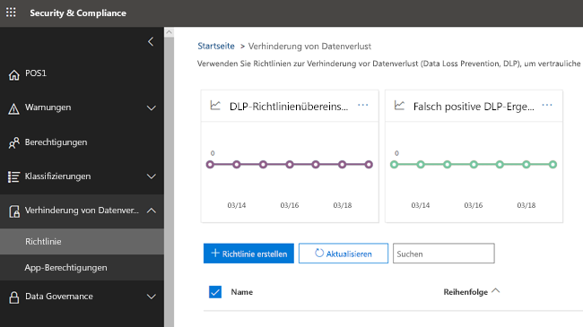
  
## Inhalt einer DLP-Richtlinie

Eine DLP-Richtlinie enthält einige grundlegende Punkte:
  
- Wo der Inhalt geschützt werden soll: **Speicherorte** wie Exchange Online, SharePoint Online und OneDrive für Unternehmen Websites sowie Microsoft Teams-Chats und-Kanäle. 
    
- Wann und wie die Inhalte durch Durchsetzen von **Regeln** geschützt werden sollen, die Folgendes umfassen: 
    
  - **Bedingungen** , die der Inhalt erfüllen muss, bevor die Regel erzwungen wird. Beispielsweise kann eine Regel so konfiguriert werden, dass Sie nur nach Inhalten sucht, die Sozialversicherungsnummern enthalten, die für Personen außerhalb Ihrer Organisation freigegeben wurden. 
    
  - **Aktionen** , die die Regel automatisch ausführen soll, wenn Inhalte gefunden werden, die mit den Bedingungen übereinstimmen. Beispielsweise kann eine Regel so konfiguriert werden, dass der Zugriff auf ein Dokument blockiert wird und der Benutzer und der Compliance-Beauftragte eine e-Mail-Benachrichtigung erhalten. 
    
Sie können eine Regel verwenden, um eine bestimmte Schutzanforderung zu erfüllen, und dann eine DLP-Richtlinie verwenden, um gemeinsame Schutzanforderungen zu gruppieren, beispielsweise alle Regeln, die für die Einhaltung einer bestimmten Verordnung erforderlich sind.
  
Möglicherweise verfügen Sie über eine DLP-Richtlinie, mit der Sie das vorhanden sein von Informationen ermitteln können, die dem Krankenversicherungs-und dem Verantwortlichkeits Gesetz (HIPAA) unterliegen. Diese DLP-Richtlinie kann dazu beitragen, HIPAA-Daten (was) auf allen SharePoint Online-Websites und allen OneDrive für Unternehmen-Websites (wobei) zu schützen, indem Sie ein Dokument finden, das diese vertraulichen Informationen enthält, die für Personen außerhalb Ihrer Organisation freigegeben sind (der Bedingungen) und dann den Zugriff auf das Dokument blockieren und eine Benachrichtigung (Aktionen) senden. Diese Anforderungen werden als einzelne Regeln gespeichert und als DLP-Richtlinie zusammengefasst, um die Verwaltung und Berichterstellung zu vereinfachen.
  
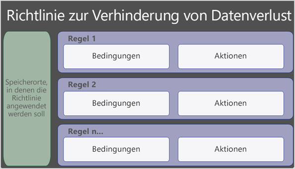
  
### Standorte

Eine DLP-Richtlinie kann vertrauliche Informationen in Office 365 suchen und schützen, unabhängig davon, ob sich diese Informationen in Exchange Online, SharePoint Online, OneDrive für Unternehmen oder Microsoft Teams befinden. Sie können Inhalte in Exchange-e-Mails, Microsoft Teams-Chats und-Kanälen sowie in allen SharePoint-oder OneDrive-Bibliotheken schützen oder bestimmte Speicherorte für eine Richtlinie auswählen.
  
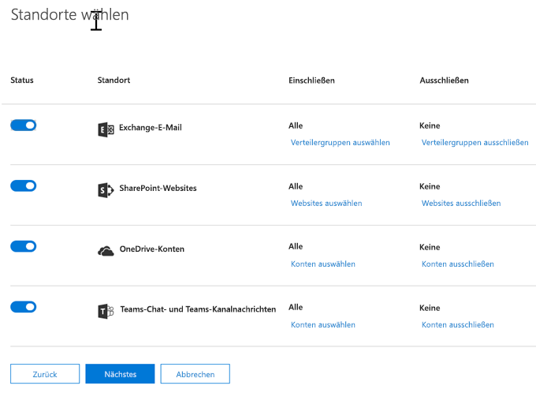
  
Wenn Sie bestimmte SharePoint-Websites oder OneDrive-Konten einschließen oder ausschließen möchten, kann eine DLP-Richtlinie nicht mehr als 100 solcher Inklusionen und Ausschlüsse enthalten. Obwohl dieser Grenzwert vorhanden ist, können Sie diesen Grenzwert überschreiten, indem Sie entweder eine organisationsweite Richtlinie oder eine Richtlinie anwenden, die für ganze Standorte gilt.
  
### Regeln

Durch Regeln werden Ihre geschäftlichen Anforderungen an die Inhalte Ihrer Organisation erzwungen. Eine Richtlinie enthält eine oder mehrere Regeln, und jede Regel besteht aus Bedingungen und Aktionen. Wenn die Bedingungen der einzelnen Regeln erfüllt sind, werden automatisch die entsprechenden Aktionen ausgeführt. Regeln werden sequenziell ausgeführt, beginnend mit der Regel mit der höchsten Priorität in jeder Richtlinie.
  
Eine Regel bietet auch Optionen, um Benutzer (mit Richtlinien Tipps und e-Mail-Benachrichtigungen) und Administratoren (mit e-Mail-Vorfall Berichten) zu benachrichtigen, dass der Inhalt mit der Regel übereinstimmt.
  
Im folgenden finden Sie die Komponenten einer Regel, die nachfolgend erläutert werden.
  
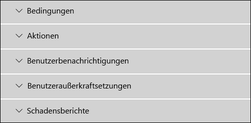
  
#### Bedingungen

Bedingungen sind wichtig, da Sie bestimmen, welche Arten von Informationen Sie suchen und wann Sie eine Aktion durchführen möchten. Sie können beispielsweise festlegen, dass Inhalte, die Passport-Nummern enthalten, ignoriert werden, es sei denn, der Inhalt enthält mehr als 10 solcher Nummern und wird für Personen außerhalb Ihrer Organisation freigegeben.
  
Die Bedingungen konzentrieren sich auf den **Inhalt**, beispielsweise auf welche Arten von vertraulichen Informationen Sie suchen, und auch auf den **Kontext**, beispielsweise die Person, für die das Dokument freigegeben ist. Sie können Bedingungen verwenden, um verschiedene Aktionen verschiedenen Risikostufen zuzuweisen. Vertrauliche Inhalte, die intern freigegeben werden, können beispielsweise ein geringeres Risiko darstellen und erfordern weniger Aktionen als vertrauliche Inhalte, die für Personen außerhalb der Organisation freigegeben sind. 
  
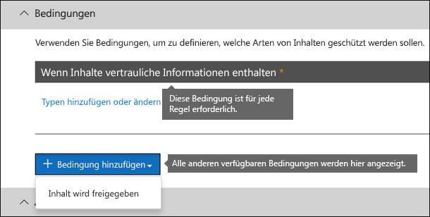
  
Mit den derzeit verfügbaren Bedingungen können Sie ermitteln, ob:
  
- Inhalt enthält eine Art vertraulicher Informationen.
    
- Inhalt enthält eine Bezeichnung. Weitere Informationen finden Sie im folgenden Abschnitt [Verwenden einer Bezeichnung als Bedingung in einer DLP-Richtlinie](#using-a-label-as-a-condition-in-a-dlp-policy).
    
- Inhalte für Personen außerhalb oder innerhalb der Organisation freigegeben werden.
    
#### Arten von vertraulichen Informationen

Eine DLP-Richtlinie kann dazu beitragen, vertrauliche Informationen zu schützen ****, die als vertraulicher Informationstyp definiert sind. Office 365 enthält Definitionen für viele allgemeine vertrauliche Informationstypen in vielen verschiedenen Regionen, die Sie verwenden können, beispielsweise eine Kreditkartennummer, Bank Kontonummern, nationale ID-Nummern und Passport-Nummern. 
  
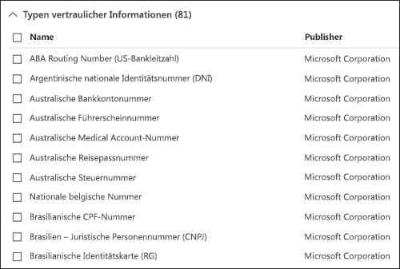
  
Wenn eine DLP-Richtlinie nach einem vertraulichen Informationstyp wie einer Kreditkartennummer sucht, sucht Sie nicht einfach nach einer 16-stelligen Zahl. Jede Art vertraulicher Informationen wird durch eine Kombination der folgenden Elemente definiert und anhand dieser ermittelt:
  
- Schlüsselwörter
    
- Interne Funktionen zur Überprüfung der Prüfsummen oder Zusammensetzung
    
- Auswertung regulärer Ausdrücke zum Suchen von Musterübereinstimmungen
    
- Andere Inhaltsuntersuchungsmethoden
    
Auf diese Weise kann die DLP-Erkennung ein hohes Maß an Genauigkeit erreichen und gleichzeitig die Anzahl falsch positiver Ergebnisse verringern, die die Arbeit von Völkern unterbrechen können.
  
#### Aktionen

Wenn Inhalt eine Bedingung in einer Regel erfüllt, können Sie Aktionen anwenden, um den Inhalt automatisch zu schützen.
  
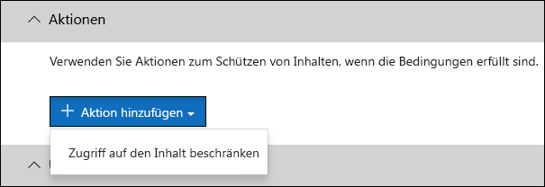
  
Wenn die Aktionen jetzt verfügbar sind, haben Sie folgende Möglichkeiten:
  
- **Einschränken des Zugriffs auf den Inhalt** Für Websiteinhalte bedeutet dies, dass Berechtigungen für das Dokument für alle Benutzer eingeschränkt sind, mit Ausnahme des primären Websitesammlungsadministrators, des Dokumentbesitzers und der Person, die das Dokument zuletzt geändert hat. Diese Personen können die vertraulichen Informationen aus dem Dokument entfernen oder eine andere Aktion ausführen. Wenn das Dokument übereinstimmt, werden die ursprünglichen Berechtigungen automatisch wiederhergestellt. Wenn der Zugriff auf ein Dokument gesperrt ist, wird das Dokument in der Bibliothek auf der Website mit einem speziellen Richtlinientipp-Symbol angezeigt. 
    
    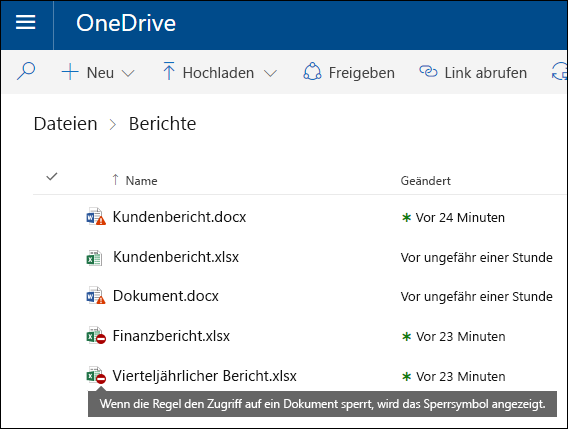
  
    Bei e-Mail-Inhalten wird durch diese Aktion verhindert, dass die Nachricht gesendet wird. Je nachdem, wie die DLP-Regel konfiguriert ist, sieht der Absender einen NDR oder (wenn die Regel eine Benachrichtigung verwendet) einen richtlinientipp und/oder eine e-Mail-Benachrichtigung.
    
    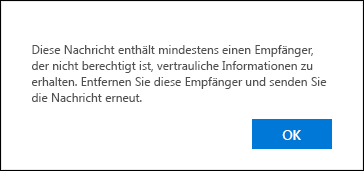
  
#### Benutzer Benachrichtigungen und Benutzerüberschreibungen

Sie können Benachrichtigungen und Außerkraftsetzungen verwenden, um Ihre Benutzer über DLP-Richtlinien zu informieren und Sie zu verbleiben, ohne Ihre Arbeit zu blockieren. Wenn ein Benutzer z. B. versucht, ein Dokument mit vertraulichen Informationen freizugeben, kann eine DLP-Richtlinie eine E-Mail-Benachrichtigung senden und dem Benutzer einen Richtlinientipp im Kontext der Dokumentbibliothek anzeigen, welche ihm das Außerkraftsetzen erlaubt, wenn er über eine geschäftliche Rechtfertigung verfügt.
  

  
Die e-Mail kann die Person, die den Inhalt gesendet, freigegeben oder zuletzt geändert hat, sowie für Websiteinhalte den primären Websitesammlungsadministrator und den Dokumentbesitzer benachrichtigen. Darüber hinaus können Sie hinzufügen oder entfernen, wen Sie aus der e-Mail-Benachrichtigung auswählen.
  
Zusätzlich zum Senden einer e-Mail-Benachrichtigung wird in einer Benutzerbenachrichtigung ein richtlinientipp angezeigt:
  
- In Outlook und Outlook im Internet.
    
- Für das Dokument auf einer SharePoint Online-oder OneDrive für Unternehmen-Website.
    
- In Excel, PowerPoint und Word, wenn das Dokument auf einer Website gespeichert ist, die in einer DLP-Richtlinie enthalten ist.
    
Die e-Mail-Benachrichtigung und der richtlinientipp erläutern, warum Inhalte mit einer DLP-Richtlinie in Konflikt stehen. Wenn Sie möchten, können die E-Mail-Benachrichtigung und der Richtlinientipp Benutzern das Außerkraftsetzen einer Regel erlauben, indem sie ein falsch positives Ergebnis melden oder eine geschäftliche Begründung angeben. Dadurch können Sie Benutzer über Ihre DLP-Richtlinien informieren und diese umsetzen, ohne dass Benutzer bei der Arbeit behindert werden. Informationen zu Außerkraftsetzungen und falsch positiven Ergebnissen werden auch für Berichte (siehe Hinweise unten zu den DLP-Berichten) protokolliert und in die Schadensberichte (im nächsten Abschnitt) aufgenommen, sodass der Compliance-Beauftragte diese Informationen regelmäßig prüfen kann.
  
Hier sehen Sie, wie ein richtlinientipp in einem OneDrive für Unternehmen Konto aussieht.
  
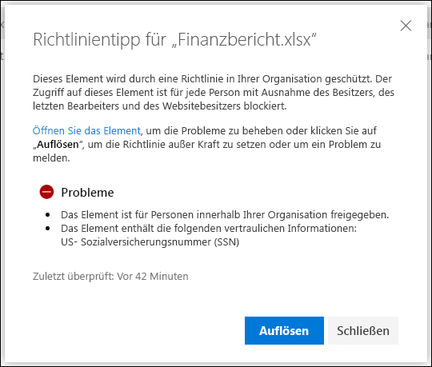
  
#### Schadensberichte

Wenn eine Regel übereinstimmt, können Sie einen Vorfall Bericht an Ihren Compliance Officer (oder an von Ihnen ausgewählte Personen) mit Details des Ereignisses senden. Dieser Bericht enthält Informationen zu dem Element, das abgeglichen wurde, den tatsächlichen Inhalt, der mit der Regel übereinstimmt, und den Namen der Person, die den Inhalt zuletzt geändert hat. Bei e-Mail-Nachrichten enthält der Bericht auch als Anlage die ursprüngliche Nachricht, die mit einer DLP-Richtlinie übereinstimmt.
  
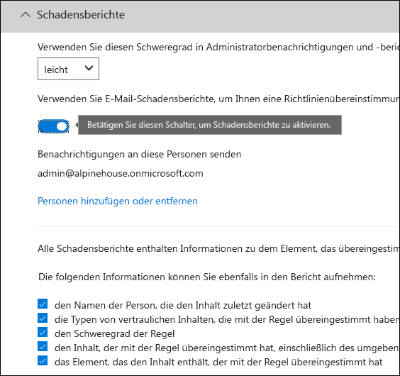
  
## Gruppieren und logische Operatoren

Ihre DLP-Richtlinie hat häufig eine einfache Anforderung, beispielsweise zum Identifizieren des gesamten Inhalts, der eine Sozialversicherungsnummer der USA enthält. In anderen Szenarien muss ihre DLP-Richtlinie jedoch möglicherweise mehr lose definierte Daten identifizieren.
  
Um beispielsweise Inhalte zu identifizieren, die dem U.S. Health Insurance Act (HIPAA) unterliegen, müssen Sie Folgendes suchen:
  
- Inhalte, die bestimmte Typen vertraulicher Informationen enthalten, beispielsweise eine US-Sozialversicherungsnummer oder eine DEA-Nummer (Drug Enforcement Agency).
    
    UND
    
- Inhalte, die schwieriger zu erkennen sind, beispielsweise die Kommunikation über die Pflege eines Patienten oder Beschreibungen medizinischer Dienste. Zum Identifizieren dieses Inhalts sind passende Stichwörter aus sehr großen Stichwortlisten erforderlich, beispielsweise die internationale Klassifikation von Krankheiten (ICD-9-cm oder ICD-10-cm).
    
Solche Lose definierten Daten können Sie problemlos mithilfe von Gruppierungs-und logischen Operatoren (und, oder) identifizieren. Wenn Sie eine DLP-Richtlinie erstellen, haben Sie folgende Möglichkeiten:
  
- Gruppen vertrauliche Informationstypen.
    
- Wählen Sie den logischen Operator zwischen den Typen vertraulicher Informationen innerhalb einer Gruppe und zwischen den Gruppen selbst aus.
    
### Auswählen des Operators in einer Gruppe

Innerhalb einer Gruppe können Sie auswählen, ob eine oder alle Bedingungen in dieser Gruppe erfüllt sein müssen, damit der Inhalt mit der Regel übereinstimmt.
  
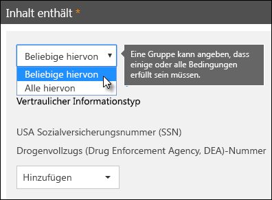
  
### Hinzufügen einer Gruppe

Sie können schnell eine Gruppe hinzufügen, die in dieser Gruppe eigene Bedingungen und Operatoren haben kann.
  
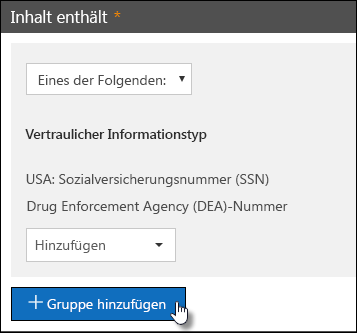
  
### Auswählen des Operators zwischen Gruppen

Zwischen Gruppen können Sie auswählen, ob die Bedingungen nur in einer Gruppe oder in allen Gruppen erfüllt sein müssen, damit der Inhalt mit der Regel übereinstimmt.
  
Beispielsweise verfügt die integrierte US- **HIPAA** -Richtlinie über eine Regel, die einen **and-** Operator zwischen den Gruppen verwendet, sodass der Inhalt identifiziert wird, der Folgendes enthält: 
  
- aus der Gruppe **PII-IDs** (mindestens eine SSN-Nummer **oder** eine DEA-Nummer) 
    
    **AND**
    
- aus der Gruppe **Medical Terms** (mindestens ein ICD-9-cm-Stichwort **oder** ICD-10-cm-Schlüsselwort) 
    

  
## Die Priorität, mit der Regeln verarbeitet werden

Wenn Sie Regeln in einer Richtlinie erstellen, erhält jede Regel eine Priorität in der Reihenfolge, in der Sie erstellt wurde, d. h., die zuerst erstellte Regel hat die erste Priorität, die zweite Regel zweite Priorität usw. 
  
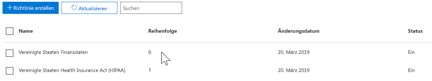
  
Nachdem Sie mehr als eine DLP-Richtlinie eingerichtet haben, können Sie die Priorität einer oder mehrerer Richtlinien ändern. Wählen Sie dazu eine Richtlinie aus, wählen Sie **Richtlinie bearbeiten**aus, und geben Sie die Priorität in der Liste **Priorität** an.

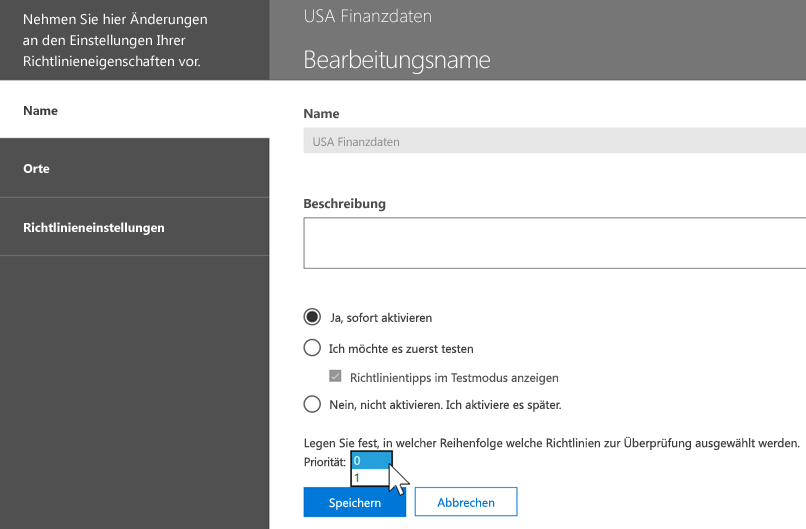

Wenn Inhalte anhand von Regeln ausgewertet werden, werden die Regeln in der Reihenfolge der Priorität verarbeitet. Wenn Inhalte mehreren Regeln entsprechen, werden die Regeln in der Reihenfolge der Priorität verarbeitet, und die restriktivste Aktion wird erzwungen. Wenn der Inhalt beispielsweise mit allen folgenden Regeln übereinstimmt, wird Regel 3 erzwungen, da es sich um die höchste Priorität, die restriktivste Regel handelt:
  
- Regel 1: benachrichtigt Benutzer nur
    
- Regel 2: benachrichtigt Benutzer, schränkt den Zugriff ein und ermöglicht Benutzerüberschreibungen
    
- Regel 3: benachrichtigt Benutzer, schränkt den Zugriff ein und lässt keine Überschreibungen von Benutzern zu.
    
- Regel 4: benachrichtigt Benutzer nur
    
- Regel 5: beschränkt den Zugriff
    
- Regel 6: benachrichtigt Benutzer, schränkt den Zugriff ein und lässt keine Überschreibungen von Benutzern zu.
    
Beachten Sie in diesem Beispiel, dass Übereinstimmungen für alle Regeln in den Überwachungsprotokollen aufgezeichnet und in den DLP-Berichten angezeigt werden, obwohl nur die restriktivste Regel erzwungen wird.
  
Beachten Sie in Bezug auf Richtlinien Tipps Folgendes:
  
- Nur der richtlinientipp von der höchsten Priorität, die restriktivste Regel wird angezeigt. Beispielsweise wird ein richtlinientipp von einer Regel, die den Zugriff auf Inhalte blockiert, über einen richtlinientipp aus einer Regel angezeigt, die einfach eine Benachrichtigung sendet. Dadurch wird verhindert, dass Benutzer eine Kaskade von Richtlinien Tipps sehen.
    
- Wenn die Richtlinien Tipps in der restriktivsten Regel es Benutzern ermöglichen, die Regel außer Kraft zu setzen, setzt das Überschreiben dieser Regel auch andere Regeln außer Kraft, die mit dem Inhalt übereinstimmten.
    
## Optimieren von Regeln, damit diese leichter oder schwieriger zu erfüllen sind

Nachdem Benutzer ihre DLP-Richtlinien erstellt und aktiviert haben, führen Sie manchmal folgende Probleme aus:
  
- Zu viele Inhalte, bei denen **es sich nicht um** vertrauliche Informationen handelt, stimmen mit den Regeln überein – mit anderen Worten: zu viele falsch positive Ergebnisse. 
    
- Zu wenig Inhalte, **bei denen es sich um** vertrauliche Informationen handelt, entsprechen den Regeln. Mit anderen Worten: die Schutzaktionen werden nicht für die vertraulichen Informationen erzwungen. 
    
Um diese Probleme zu beheben, können Sie Ihre Regeln optimieren, indem Sie die Anzahl von Instanzen und die Übereinstimmungs Genauigkeit anpassen, damit die Inhalte schwieriger oder einfacher für die Übereinstimmung mit den Regeln sind. Jeder vertrauliche Informationstyp, der in einer Regel verwendet wird, weist sowohl eine instanzenanzahl als auch eine Übereinstimmungs Genauigkeit auf.
  
### Instanzenanzahl

Die Anzahl der Instanzen bedeutet einfach, wie viele Vorkommen eines bestimmten Typs von vertraulichen Informationen vorhanden sein müssen, damit der Inhalt der Regel entspricht. Der Inhalt entspricht beispielsweise der unten gezeigten Regel, wenn zwischen 1 und 9 eindeutige U.S. oder U.K. Passport-Nummern werden identifiziert.
  
Beachten Sie, dass die Anzahl der Instanzen nur **eindeutige** Übereinstimmungen für vertrauliche Informationstypen und Schlüsselwörter enthält. Wenn eine e-Mail beispielsweise 10 Vorkommen der gleichen Kreditkartennummer enthält, werden diese 10 vorkommen als einzelne Instanz einer Kreditkartennummer gezählt. 
  
Um die instanzenanzahl zum Optimieren von Regeln zu verwenden, ist die Anleitung einfach:
  
- Um die Übereinstimmung der Regel zu vereinfachen, verringern Sie die Anzahl der **Minuten** und/oder erhöht die **Maximale** Anzahl. Sie können **Max** auch auf **any** festlegen, indem Sie den numerischen Wert löschen. 
    
- Um die Übereinstimmung der Regel zu erschweren, müssen Sie die Anzahl **Min** . erweitern. 
    
Normalerweise verwenden Sie weniger restriktive Aktionen wie das Senden von Benutzer Benachrichtigungen in einer Regel mit einer niedrigeren instanzenanzahl (beispielsweise 1-9). Und Sie verwenden restriktivere Aktionen, beispielsweise das Einschränken des Zugriffs auf Inhalte, ohne Benutzerüberschreibungen zuzulassen, in einer Regel mit einer höheren instanzenanzahl (beispielsweise 10-any).
  
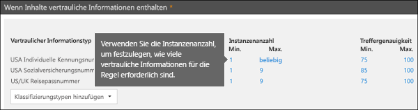
  
### Übereinstimmungs Genauigkeit

Wie oben beschrieben, wird ein vertraulicher Informationstyp mithilfe einer Kombination aus unterschiedlichen Beweistypen definiert und erkannt. Im Allgemeinen wird ein vertraulicher Informationstyp durch mehrere solcher Kombinationen definiert, die als Muster bezeichnet werden. Ein Muster, das weniger Beweise erfordert, hat eine niedrigere Genauigkeit (oder Konfidenz Stufe), während ein Muster, das mehr Beweise erfordert, eine höhere Genauigkeit (oder Konfidenz Stufe) aufweist. Weitere Informationen zu den tatsächlichen Mustern und Konfidenz Stufen, die von jedem Typ vertraulicher Informationen verwendet werden, finden Sie unter [was die Typen vertraulicher Informationen suchen](what-the-sensitive-information-types-look-for.md).
  
Beispielsweise wird der vertrauliche Informationstyp mit dem Namen "Kreditkartennummer" durch zwei Muster definiert:
  
- Ein Muster mit 65% Vertrauen, das Folgendes erfordert:
    
  - Eine Nummer im Format einer Kreditkartennummer.
    
  - Eine Zahl, die die Prüfsumme übergibt.
    
- Ein Muster mit 85% Vertrauen, das Folgendes erfordert:
    
  - Eine Nummer im Format einer Kreditkartennummer.
    
  - Eine Zahl, die die Prüfsumme übergibt.
    
  - Ein Schlüsselwort oder ein Ablaufdatum im richtigen Format.
    
Sie können diese Konfidenz Stufen (oder die Übereinstimmungs Genauigkeit) in ihren Regeln verwenden. Normalerweise verwenden Sie weniger restriktive Aktionen wie das Senden von Benutzer Benachrichtigungen in einer Regel mit niedrigerer Übereinstimmungs Genauigkeit. Und Sie verwenden restriktivere Aktionen, beispielsweise das Einschränken des Zugriffs auf Inhalte, ohne dass Benutzer Außerkraftsetzungen zulassen, in einer Regel mit einer höheren Übereinstimmungs Genauigkeit.
  
Beachten Sie, dass bei der Identifizierung eines bestimmten Typs vertraulicher Informationen, beispielsweise einer Kreditkartennummer, nur eine einzige Konfidenz Stufe zurückgegeben wird:
  
- Wenn alle Übereinstimmungen für ein einzelnes Muster gelten, wird die Konfidenz Stufe für dieses Muster zurückgegeben.
    
- Wenn Übereinstimmungen für mehrere Muster vorhanden sind (d. h., es gibt Übereinstimmungen mit zwei unterschiedlichen Konfidenz Stufen), wird eine Konfidenz Stufe höher als die einzelnen Muster zurückgegeben. Dies ist der schwierige Abschnitt. Wenn beispielsweise für eine Kreditkarte sowohl die Muster 65% als auch 85% übereinstimmen, ist die Zuverlässigkeitsstufe, die für diesen vertraulichen Informationstyp zurückgegeben wird, größer als 90%, da mehr Beweise mehr Vertrauen bedeuten.
    
Wenn Sie also zwei gegenseitig ausschließende Regeln für Kreditkarten erstellen möchten, eine für die Übereinstimmungs Genauigkeit von 65% und eine für die Übereinstimmungs Genauigkeit von 85%, würden die Bereiche für die Übereinstimmungs Genauigkeit wie folgt aussehen. Die erste Regel nimmt nur Übereinstimmungen des 65%-Musters auf. Die zweite Regel nimmt Übereinstimmungen mit mindestens **einer** 85%-Übereinstimmung auf und **kann möglicherweise** andere weniger vertrauenswürdige Übereinstimmungen haben. 
  
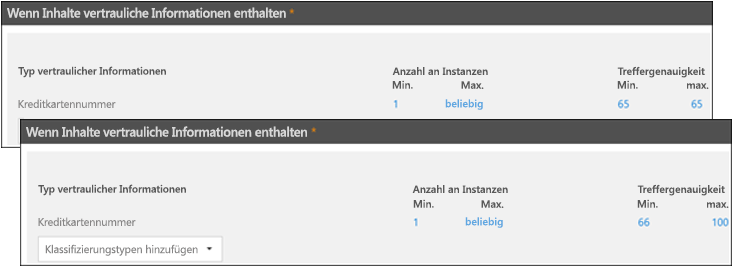
  
Aus diesen Gründen ist die Anleitung zum Erstellen von Regeln mit unterschiedlichen Übereinstimmungs Genauigkeiten:
  
- Der niedrigste Konfidenz Grad verwendet in der Regel den gleichen Wert für **Min** und **Max** (kein Bereich). 
    
- Die höchste Konfidenz Stufe ist normalerweise ein Bereich von knapp oberhalb der niedrigeren Zuverlässigkeitsstufe bis 100.
    
- Alle zwischen Konfidenz Stufen reichen normalerweise von knapp oberhalb des niedrigeren Konfidenz Grads bis knapp unter dem höheren Konfidenzniveau.
    
## Verwenden einer Bezeichnung als Bedingung in einer DLP-Richtlinie

Sie können eine Bezeichnung erstellen und dann:
  
- **Veröffentlichen** Sie es, sodass Endbenutzer die Bezeichnung auf Inhalte anzeigen und manuell anwenden können. 
    
- **Automatisch** auf Inhalte anwenden, die den von Ihnen ausgewählten Bedingungen entsprechen. 
    
Weitere Informationen zu Bezeichnungen finden Sie unter [Übersicht über Aufbewahrungs Bezeichnungen](labels.md).
  
Nachdem Sie eine Bezeichnung erstellt haben, können Sie diese Bezeichnung als Bedingung in ihren DLP-Richtlinien verwenden. Möglicherweise möchten Sie dies tun, da:
  
- Sie haben ein Label namens " **Confidential**" veröffentlicht, damit Personen in Ihrer Organisation die Bezeichnung manuell auf vertrauliche e-Mails und Dokumente anwenden können. Wenn Sie diese Bezeichnung als Bedingung in ihrer DLP-Richtlinie verwenden, können Sie die **Vertraulichkeit** von Inhalten einschränken, die für Personen außerhalb Ihrer Organisation freigegeben werden. 
    
- Sie haben für ein Projekt mit diesem Namen eine Bezeichnung namens " **Alpine House** " erstellt und diese Bezeichnung automatisch auf Inhalte angewendet, die die Schlüsselwörter "Alpine House" enthalten. Wenn Sie diese Bezeichnung als Bedingung in ihrer DLP-Richtlinie verwenden, können Sie Endbenutzern einen richtlinientipp anzeigen, wenn diese Inhalte für Personen außerhalb Ihrer Organisation freigegeben werden sollen. 
    
- Sie haben eine Bezeichnung namens " **Steuersatz**" veröffentlicht, damit Ihr Records Manager die Bezeichnung manuell auf Inhalte anwenden kann, die als Datensatz klassifiziert werden müssen. Wenn Sie diese Bezeichnung als Bedingung in ihrer DLP-Richtlinie verwenden, können Sie nach Inhalten mit dieser Bezeichnung zusammen mit anderen Typen vertraulicher Informationen wie ITINs oder Sozialversicherungsnummern suchen; Anwenden von Schutzaktionen auf Inhalte mit dem Namen " **Steuersatz**"; und detaillierte Aktivitätsberichte über die DLP-Richtlinie aus den DLP-Berichten und Überwachungsprotokolldaten abrufen. 
    
- Sie haben ein Label mit dem Namen **Executive Leadership Team-sensitive** für die Exchange-Postfächer und OneDrive-Konten einer Gruppe von Führungskräften veröffentlicht. Wenn Sie diese Bezeichnung als Bedingung in ihrer DLP-Richtlinie verwenden, können Sie sowohl Aufbewahrungs-als auch Schutzaktionen für dieselbe Teilmenge von Inhalten und Benutzern erzwingen. 
    
Wenn Sie Bezeichnungen als Bedingung in ihren DLP-Regeln verwenden, können Sie Schutzaktionen für eine bestimmte Gruppe von Inhalten, Speicherorten oder Benutzern selektiv erzwingen.
  
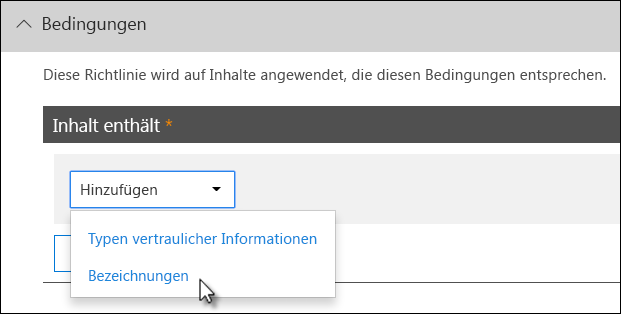

### Unterstützung für Sensitivitäts Beschriftungen kommt

Sie können derzeit nur eine Aufbewahrungs Bezeichnung als Bedingung und keine Vertraulichkeits [Bezeichnung](sensitivity-labels.md)verwenden. Wir arbeiten derzeit an der Unterstützung für die Verwendung einer Sensitivitäts Bezeichnung in dieser Bedingung.
  
### Bezieht sich dieses Feature auf andere Features

Es können mehrere Features auf Inhalte angewendet werden, die vertrauliche Informationen enthalten:
  
- Eine [Aufbewahrungs Bezeichnung](labels.md#applying-a-retention-label-automatically-based-on-conditions) und eine [Aufbewahrungsrichtlinie](retention-policies.md) können beide **Aufbewahrungs** Aktionen für diese Inhalte erzwingen. 
    
- Eine DLP-Richtlinie kann **Schutz** Aktionen für diese Inhalte erzwingen. Vor dem Erzwingen dieser Aktionen kann für eine DLP-Richtlinie zusätzlich zu den Inhalten, die eine Bezeichnung enthalten, weitere Bedingungen erfüllt sein. 
    
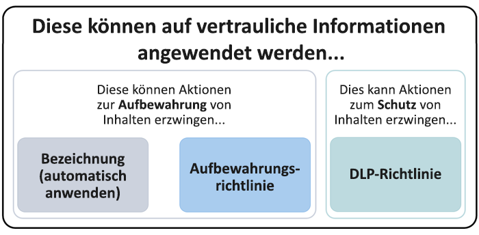
  
Beachten Sie, dass eine DLP-Richtlinie eine umfangreichere Erkennungsfunktion als eine auf vertrauliche Informationen angewendete Bezeichnung oder Aufbewahrungsrichtlinie besitzt. Eine DLP-Richtlinie kann Schutzaktionen für Inhalte erzwingen, die vertrauliche Informationen enthalten, und wenn die vertraulichen Informationen aus dem Inhalt entfernt werden, werden diese Schutzaktionen beim nächsten Scannen des Inhalts rückgängig gemacht. Wenn jedoch eine Aufbewahrungsrichtlinie oder Bezeichnung auf Inhalte angewendet wird, die vertrauliche Informationen enthalten, handelt es sich um eine einmalige Aktion, die auch dann nicht rückgängig gemacht werden kann, wenn die vertraulichen Informationen entfernt werden.
  
Durch die Verwendung einer Bezeichnung als Bedingung in einer DLP-Richtlinie können Sie sowohl Aufbewahrungs-als auch Schutzaktionen für Inhalte mit dieser Bezeichnung erzwingen. Sie können sich einen Inhalt vorstellen, der eine Bezeichnung genau wie Inhalte enthält, die vertrauliche Informationen enthalten – sowohl eine Bezeichnung als auch ein vertraulicher Informationstyp sind Eigenschaften, die zum Klassifizieren von Inhalten verwendet werden, sodass Sie Aktionen für diese Inhalte erzwingen können.
  
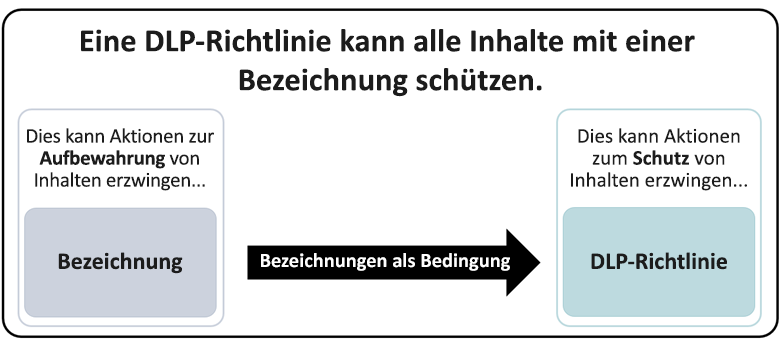
  
## Einfache Einstellungen im Vergleich zu erweiterten Einstellungen

Wenn Sie eine DLP-Richtlinie erstellen, wählen Sie zwischen einfachen oder erweiterten Einstellungen:
  
- **Einfache Einstellungen** vereinfachen das Erstellen der häufigsten DLP-Richtlinie, ohne den Regel-Editor zum Erstellen oder Ändern von Regeln zu verwenden. 
    
- **Erweiterte Einstellungen** verwenden Sie den Regel-Editor, um Ihnen die vollständige Kontrolle über jede Einstellung für ihre DLP-Richtlinie zu geben. 
    
Keine Sorge, unter den Abdeckungen funktionieren einfache Einstellungen und erweiterte Einstellungen genau gleich, indem Sie Regeln mit Bedingungen und Aktionen erzwingen – nur mit einfachen Einstellungen wird der Regel-Editor nicht angezeigt. Dies ist eine schnelle Möglichkeit zum Erstellen einer DLP-Richtlinie.
  
### Einfache Einstellungen

Bei weitem ist das häufigste DLP-Szenario das Erstellen einer Richtlinie zum Schutz von Inhalten, die vertrauliche Informationen enthalten, für Personen außerhalb Ihrer Organisation freigegeben werden, und für die automatische Abhilfemaßnahmen wie das Einschränken der Personen, die auf den Inhalt zugreifen können. Senden von Endbenutzer-oder Administratorbenachrichtigungen und Überwachen des Ereignisses zur späteren Untersuchung. Personen verwenden DLP, um die unbeabsichtigte Offenlegung vertraulicher Informationen zu verhindern.
  
Um das Erreichen dieses Ziels zu vereinfachen, können Sie beim Erstellen einer DLP-Richtlinie die Option **einfache Einstellungen verwenden**auswählen. Diese Einstellungen bieten alles, was Sie zum Implementieren der gängigsten DLP-Richtlinie benötigen, ohne in den Regel-Editor wechseln zu müssen.
  
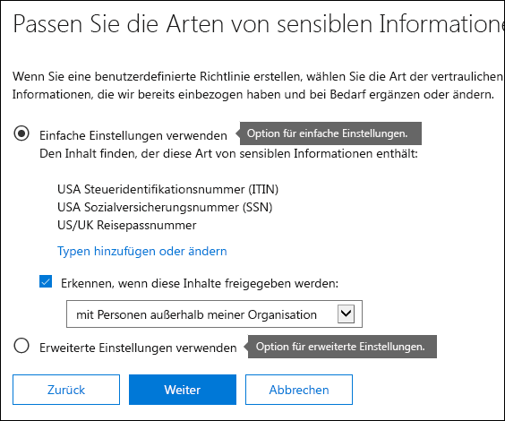
  
### Erweiterte Einstellungen

Wenn Sie mehr angepasste DLP-Richtlinien erstellen müssen, können Sie **Erweiterte Einstellungen verwenden**auswählen.
  
Die erweiterten Einstellungen bieten Ihnen den Regel-Editor, mit dem Sie Vollzugriff auf jede mögliche Option haben, einschließlich der Anzahl der Instanzen und der Genauigkeit der Übereinstimmung (Konfidenz Stufe) für jede Regel.
  
Wenn Sie schnell zu einem Abschnitt wechseln möchten, klicken Sie auf ein Element in der oberen Navigationsleiste des Regel-Editors, um zu diesem Abschnitt weiter unten zu wechseln.
  
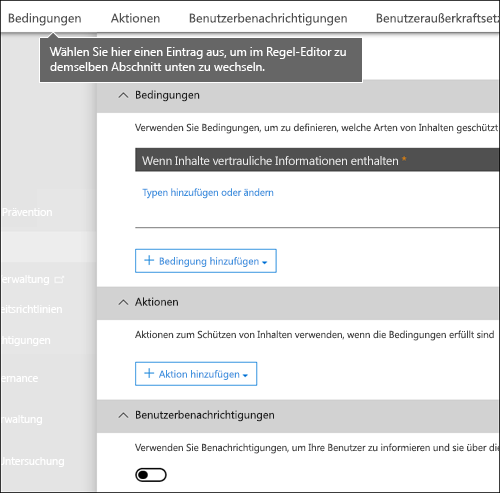
  
## DLP-Richtlinienvorlagen

Der erste Schritt beim Erstellen einer DLP-Richtlinie ist das Auswählen der zu schützenden Informationen. Wenn Sie mit einer DLP-Vorlage beginnen, speichern Sie die Arbeit zum Erstellen eines neuen Regelsatzes von Grund auf und ermitteln, welche Informationstypen standardmäßig enthalten sein sollen. Anschließend können Sie diese Anforderungen hinzufügen oder ändern, um die Regel entsprechend den spezifischen Anforderungen Ihrer Organisation abzustimmen.
  
Eine vorkonfigurierte DLP-Richtlinienvorlage kann Ihnen dabei helfen, bestimmte Typen vertraulicher Informationen wie HIPAA-Daten, PCI-DSS-Daten, Gramm-Leach-Bliley Act-Daten oder sogar gebietsschemaspezifische personenbezogene Informationen (P.I.) zu ermitteln. Um Ihnen das Auffinden und Schützen gängiger Typen von vertraulichen Informationen zu erleichtern, enthalten die Vorlagen in Office 365 bereits die am häufigsten verwendeten vertraulichen Informationstypen, die Sie zum Einstieg benötigen.
  
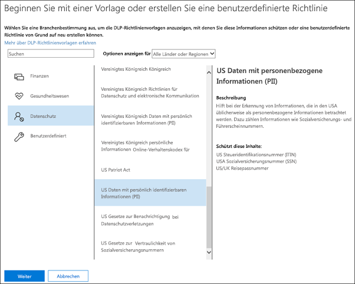
  
Ihre Organisation kann auch eigene spezifische Anforderungen haben, in diesem Fall können Sie eine DLP-Richtlinie von Grund auf neu erstellen, indem Sie die Option **benutzerdefinierte Richtlinie** auswählen. Eine benutzerdefinierte Richtlinie ist leer und enthält keine vordefinierten Regeln. 
  
## Allmähliches Bereitstellen von DLP-Richtlinien im Testmodus

Wenn Sie DLP-Richtlinien erstellen, sollten Sie sie erst einmal nach und nach bereitstellen, um die Auswirkungen beurteilen und ihre Effektivität testen zu können, bevor Sie sie vollständig durchsetzen. Sie möchten beispielsweise nicht, dass eine neue DLP-Richtlinie versehentlich den Zugriff auf Tausende von Dokumenten blockiert, für die Benutzer Zugriff benötigen, damit Sie Ihre Arbeit erledigen können.
  
Wenn Sie DLP-Richtlinien mit einer großen potenziellen Auswirkung erstellen, wird empfohlen, diese Sequenz zu folgen:
  
1. **Starten Sie im Testmodus ohne Richtlinien Tipps** , und verwenden Sie dann die DLP-Berichte und alle vorfallberichte, um die Auswirkungen zu bewerten. In den DLP-Berichten werden die Anzahl von Richtlinienübereinstimmungen, der Ort des Vorkommens, der Typ und der Schweregrad aufgeführt. Auf Grundlage der Ergebnisse können Sie die Regeln nach Bedarf genauer anpassen. Im Testmodus haben DLP-Richtlinien keinen Einfluss auf die Produktivität der Mitarbeiter in Ihrer Organisation. 
    
2. **Fahren Sie im Testmodus mit Benachrichtigungen und Richtlinientipps fort**, sodass Sie die Benutzer über die Einhaltungsrichtlinien in Kenntnis setzen und auf die Anwendung der Regeln vorbereiten können. In dieser Phase können Sie die Benutzer auch bitte, Sie über falsche Positivmeldungen zu benachrichtigen, damit Sie die Regeln noch besser abstimmen können. 
    
3. **Starten Sie die vollständige Erzwingung für die Richtlinien** , sodass die Aktionen in den Regeln angewendet werden und der Inhalt geschützt ist. Überwachen Sie weiterhin die DLP-Berichte und alle Schadensberichte oder Benachrichtigungen, um sicherzustellen, dass die von Ihnen gewünschten Ergebnisse erzielt werden. 
    

  
Sie können eine DLP-Richtlinie jederzeit deaktivieren, was alle Regeln in der Richtlinie betrifft. Jede Regel kann jedoch auch einzeln durch Umschalten des Status im Regel-Editor deaktiviert werden.
  
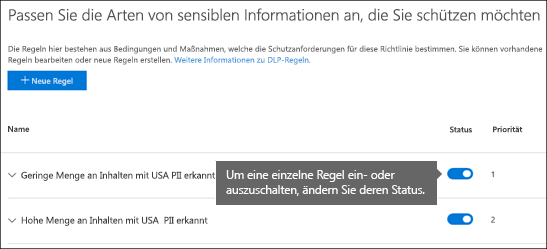

Sie können auch die Priorität mehrerer Regeln in einer Richtlinie ändern. Öffnen Sie dazu eine Richtlinie zur Bearbeitung. Wählen Sie in einer Zeile für eine Regel die Ellipsen (**...**) aus, und wählen Sie dann eine Option aus, beispielsweise nach unten oder nach **unten** oder **zuletzt**.

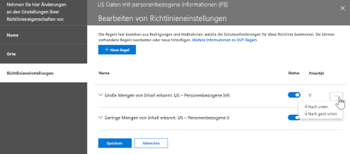
  
## DLP-Berichte

Nachdem Sie Ihre DLP-Richtlinien erstellt und aktiviert haben, sollten Sie überprüfen, ob Sie wie beabsichtigt arbeiten und Ihnen dabei helfen, die Kompatibilität zu verbleiben. Mit DLP-Berichten können Sie schnell die Anzahl der Übereinstimmungen mit DLP-Richtlinien und Regeln in einem Zeitraum sowie die Anzahl von falsch positiven Ergebnissen und Außerkraftsetzungen anzeigen. Bei jedem Bericht können Sie diese Übereinstimmungen nach Speicherort und Zeitraum filtern und sogar auf eine bestimmte Richtlinie, Regel oder Aktion einschränken.
  
Mit den DLP-Berichten können Sie geschäftliche Einblicke erhalten und von folgenden Vorteilen profitieren:
  
- Sie können sich auf bestimmte Zeiträume konzentrieren und so mehr über die Gründe für Spitzen und Trends erfahren.
    
- Ermitteln Sie Geschäftsprozesse, die die Konformitätsrichtlinien Ihrer Organisation verletzen.
    
- Sie können die geschäftlichen Auswirkungen der DLP-Richtlinien besser nachvollziehen.
    
Darüber hinaus können Sie die DLP-Berichte verwenden, um Ihre DLP-Richtlinien optimieren, wenn sie ausgeführt werden.
  
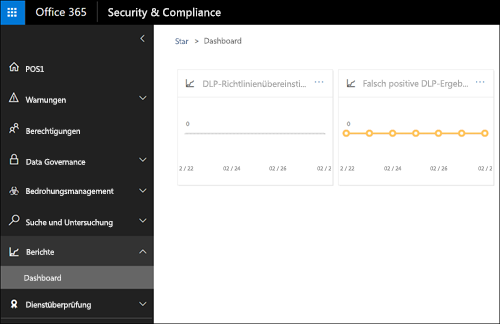
  
## Funktionsweise von DLP-Richtlinien

DLP erkennt vertrauliche Informationen mithilfe einer eingehenden Inhaltsanalyse (nicht nur einer einfachen Textprüfung). Bei dieser eingehenden Inhaltsanalyse werden Schlüsselwortübereinstimmung, Wörterbuchübereinstimmungen, die Auswertung regulärer Ausdrücke, interne Funktionen sowie weitere Inhaltsuntersuchungsmethoden herangezogen, um Inhalte zu erkennen, welche die DLP-Richtlinien erfüllen. Möglicherweise gilt nur ein kleiner Prozentsatz Ihrer Daten als vertraulich. Eine DLP-Richtlinie kann nur diese Daten bestimmen, überwachen und automatisch schützen, ohne Personen zu behindern, die mit den restlichen Inhalten arbeiten.
  
### Richtlinien werden synchronisiert

Nachdem Sie eine DLP-Richtlinie im Security &amp; Compliance Center erstellt haben, wird Sie in einem zentralen Richtlinienspeicher gespeichert und dann mit den verschiedenen Inhaltsquellen synchronisiert, einschließlich:
  
- Exchange Online und von dort zu Outlook im Internet und Outlook
    
- OneDrive for Business-Websites
    
- SharePoint Online-Websites
    
- Office-Desktop Programme (Excel, PowerPoint und Word)

- Microsoft Teams-Kanäle und -Chats.
    
Nachdem die Richtlinie mit den richtigen Speicherorten synchronisiert wurde, wird der Inhalt ausgewertet und Aktionen durchgesetzt.
  
### Richtlinienauswertung in OneDrive for Business- und SharePoint Online-Websites

In allen Ihren SharePoint Online Websites und OneDrive für Unternehmen Websites werden Dokumente ständig geändert – Sie werden ständig erstellt, bearbeitet, freigegeben usw. Dies bedeutet, dass Dokumente zu jedem Zeitpunkt gegen eine DLP-Richtlinie verstoßen können oder im Gegensatz dazu die DLP-Richtlinie erfüllen können. So kann es zum Beispiel sein, dass eine Person ein Dokument auf die Teamwebsite hochlädt, das keine vertraulichen Informationen enthält, zu einem späteren Zeitpunkt eine andere Person dasselbe Dokument jedoch bearbeitet und vertrauliche Informationen einfügt.
  
Aus diesem Grund überprüfen DLP-Richtlinien Dokumente häufig im Hintergrund auf Richtlinienübereinstimmungen. Sie können sich dies als asynchrone Richtlinienauswertung vorstellen.
  
#### Funktionsweise
 
Wenn Benutzer Dokumente in ihren Websites hinzufügen oder ändern, scannt die Suchmaschine den Inhalt, sodass Sie später danach suchen können. Während dies geschieht, wird der Inhalt auch auf vertrauliche Informationen überprüft und überprüft, ob er freigegeben ist. Vertrauliche Informationen, die gefunden werden, werden sicher im Suchindex gespeichert, sodass nur das Compliance-Team darauf zugreifen kann, jedoch keine typischen Benutzer. Jede DLP-Richtlinie, die Sie aktiviert haben, wird im Hintergrund ausgeführt (asynchron), wobei die Suche häufig auf Inhalte überprüft wird, die mit einer Richtlinie übereinstimmen, und durch das Anwenden von Aktionen, um Sie vor versehentlichen Lecks zu schützen.
  
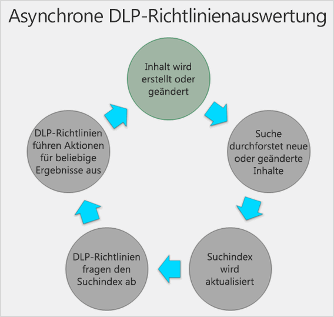
  
Dokumente können jedoch nicht nur mit einer DLP-Richtlinie in Konflikt stehen, sondern es können auch Änderungen vorgenommen werden, die dazu führen, dass sie nun einer DLP-Richtlinie entsprechen. Wenn eine Person zum Beispiel einem Dokument Kreditkartennummern hinzufügt, kann dies dazu führen, dass die DLP-Richtlinie den Zugriff auf das Dokument automatisch sperrt. Wenn die Person jedoch später die vertraulichen Informationen entfernt, wird die Aktion (in diesem Fall die Sperre) automatisch entfernt, wenn das Dokument das nächste Mal anhand der Richtlinie ausgewertet wird.
  
DLP bewertet alle Inhalte, die indiziert werden können. Weitere Informationen darüber, welche Dateitypen standardmäßig gecrawlt werden, finden Sie unter standardmäßig durch [forstete Dateinamenerweiterungen und analysierte Dateitypen in SharePoint Server](https://docs.microsoft.com/SharePoint/technical-reference/default-crawled-file-name-extensions-and-parsed-file-types).
  
### Richtlinienauswertung in Exchange Online, Outlook und Outlook im Internet

Wenn Sie eine DLP-Richtlinie erstellen, die Exchange Online als Standort enthält, wird die Richtlinie vom Office 365 Security &amp; Compliance Center mit Exchange Online und dann von Exchange Online zu Outlook im Internet und Outlook synchronisiert.
  
Wenn eine Nachricht in Outlook verfasst wird, kann der Benutzerrichtlinien Tipps sehen, wenn der erstellte Inhalt anhand von DLP-Richtlinien ausgewertet wird. Nachdem eine Nachricht gesendet wurde, wird Sie als normaler Teil des Nachrichtenflusses anhand von DLP-Richtlinien ausgewertet, zusammen mit Exchange-Nachrichtenfluss Regeln (auch bekannt als Transportregeln) und DLP-Richtlinien, die im Exchange Admin Center erstellt wurden. DLP-Richtlinien überprüfen sowohl die Nachricht als auch alle Anlagen.
  
### Richtlinienauswertung in den Office-Desktop Programmen

Excel, PowerPoint und Word bieten die gleiche Möglichkeit, vertrauliche Informationen zu identifizieren und DLP-Richtlinien als SharePoint Online und OneDrive für Unternehmen anzuwenden. Diese Office-Programme synchronisieren ihre DLP-Richtlinien direkt aus dem zentralen Richtlinienspeicher und Werten den Inhalt anschließend kontinuierlich anhand der DLP-Richtlinien aus, wenn Personen mit Dokumenten arbeiten, die von einer in einer DLP-Richtlinie enthaltenen Website geöffnet sind.
  
Die Evaluierung der DLP-Richtlinie in Office zielt darauf ab, die Leistung der Programme oder die Produktivität von Personen, die an Inhalten arbeiten, nicht zu beeinflussen. Wenn Sie an einem großen Dokument arbeiten oder der Computer des Benutzers ausgelastet ist, kann es einige Sekunden dauern, bis ein richtlinientipp angezeigt wird.

### Richtlinienauswertung in Microsoft Teams
 
Wenn Sie eine DLP-Richtlinie erstellen, die Microsoft Teams als Standort umfasst, wird die Richtlinie vom Office 365 Security &amp; Compliance Center mit Benutzerkonten und Microsoft Teams-Kanälen und-Chats synchronisiert. Je nachdem, wie DLP-Richtlinien konfiguriert sind, kann die Nachricht blockiert oder widerrufen werden, wenn jemand versucht, vertrauliche Informationen in einem Microsoft Teams-Chat oder-Kanal freizugeben. Außerdem werden Dokumente, die vertrauliche Informationen enthalten und für Gäste (externe Benutzer) freigegeben werden, nicht für diese Benutzer geöffnet. Weitere Informationen finden Sie unter Verhinderung von [Datenverlust und Microsoft Teams](dlp-microsoft-teams.md).
 
## Berechtigungen

Mitglieder Ihres Compliance Teams, die DLP-Richtlinien erstellen, benötigen Berechtigungen für &amp; das Security Compliance Center. Standardmäßig hat ihr mandantenadministrator Zugriff auf diesen Speicherort und kann Compliance-Verantwortlichen und anderen Personen Zugriff auf das Security &amp; Compliance Center gewähren, ohne dass Ihnen alle Berechtigungen eines Mandanten Administrators erteilt werden. Dazu empfehlen wir Ihnen Folgendes:
  
1. Erstellen Sie eine Gruppe in Office 365, und fügen Sie ihr Compliance Officers hinzu.
    
2. Erstellen Sie auf der Seite **Berechtigungen** des Security &amp; Compliance Center eine Rollengruppe. 
    
3. Fügen Sie die Office 365-Gruppe der Rollengruppe hinzu.
    
Weitere Informationen finden Sie unter [Give users access to the Office 365 Compliance Center](grant-access-to-the-security-and-compliance-center.md).
  
Diese Berechtigungen sind nur erforderlich, um eine DLP-Richtlinie zu erstellen und anzuwenden. Für die Durchsetzung von Richtlinien ist kein Zugriff auf Inhalte erforderlich.
  
## Suchen nach den DLP-Cmdlets

Um die meisten Cmdlets für das Security &amp; Compliance Center verwenden zu können, müssen Sie Folgendes tun:
  
1. [Eine Verbindung zum Office 365 Security &amp; Compliance Center mithilfe von Remote-PowerShell herstellen](https://docs.microsoft.com/powershell/exchange/office-365-scc/connect-to-scc-powershell/connect-to-scc-powershell?view=exchange-ps)
    
2. Verwenden aller dieser [Richtlinien und Compliance-DLP-Cmdlets](https://docs.microsoft.com/powershell/module/exchange/policy-and-compliance-dlp/export-dlppolicycollection?view=exchange-ps)
    
DLP-Berichte benötigen jedoch Pull-Daten aus Across Office 365, einschließlich Exchange Online. Aus diesem Grund **sind die Cmdlets für die DLP-Berichte in Exchange Online PowerShell verfügbar – nicht in Security &amp; Compliance Center PowerShell**. Um die Cmdlets für die DLP-Berichte verwenden zu können, müssen Sie daher Folgendes tun:
  
1. [Connect to Exchange Online using remote PowerShell](https://docs.microsoft.com/powershell/exchange/exchange-online/connect-to-exchange-online-powershell/connect-to-exchange-online-powershell?view=exchange-ps)
    
2. Verwenden Sie eines der folgenden Cmdlets für die DLP-Berichte:
    
  - [Get-DlpDetectionsReport](https://docs.microsoft.com/powershell/module/exchange/policy-and-compliance-dlp/Get-DlpDetectionsReport?view=exchange-ps)
    
  - [Get-DlpDetailReport](https://docs.microsoft.com/powershell/module/exchange/policy-and-compliance-dlp/Get-DlpDetailReport?view=exchange-ps)
    
## Weitere Informationen

- [Erstellen einer DLP-Richtlinie aus einer Vorlage](create-a-dlp-policy-from-a-template.md)
    
- [Senden von Benachrichtigungen und Anzeigen von Richtlinientipps für DLP-Richtlinien](use-notifications-and-policy-tips.md)
    
- [Erstellen einer DLP-Richtlinie zum Schützen von Dokumenten mit FCI oder anderen Eigenschaften](protect-documents-that-have-fci-or-other-properties.md)
    
- [Inhalt der DLP-Richtlinienvorlagen](what-the-dlp-policy-templates-include.md)
    
- [Wonach die Typen von vertraulichen Informationen suchen](what-the-sensitive-information-types-look-for.md)
    
- [Wonach die DLP-Funktionen suchen](what-the-dlp-functions-look-for.md)
    
- [Erstellen eines benutzerdefinierten vertraulichen Informationstyps](create-a-custom-sensitive-information-type.md)
    

