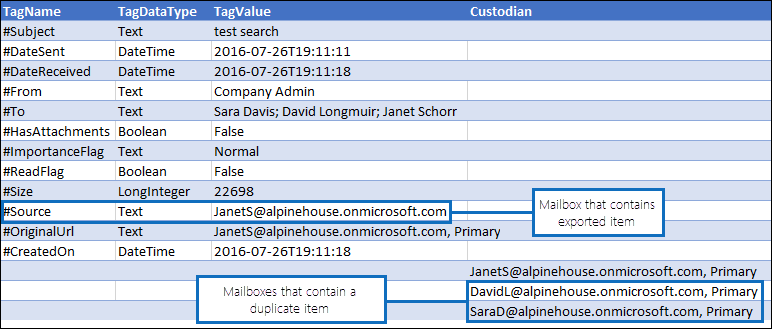

# Deduplizierung in eDiscovery-SuchergebnissenDe-duplication in eDiscovery search results

Dieser Artikel beschreibt die Funktionsweise von eDiscovery-Suchergebnissen Deduplizierung und erläutert die Einschränkungen des Algorithmus Deduplizierung.This article describes how de-duplication of eDiscovery search results works and explains the limitations of the de-duplication algorithm.
  
Wenn Sie eDiscovery-Tools für Office 365 mit der Ergebnisse einer eDiscovery-Suche exportiert werden, müssen Sie die Option aus, um die Ergebnisse Entfernung von Duplikaten, die exportiert werden. Was bedeutet das? Wenn Sie die Deduplizierung aktivieren (standardmäßig Deduplizierung ist nicht aktiviert), nur eine Kopie einer e-Mail-Nachricht wird exportiert, auch wenn mehrere Instanzen derselben Nachricht Postfächer gefunden wurden möglicherweise, die durchsucht wurden. Deduplizierung können Sie die Zeitersparnis durch Verringern der Anzahl der Elemente, die Sie überprüfen und analysieren, nachdem die Suchergebnisse exportiert werden müssen. Aber es ist wichtig, zu verstehen, wie Deduplizierung und beachten Sie, dass sind Einschränkungen des Algorithmus, die ein eindeutiges Element als ein Duplikat gekennzeichnet werden, während des Exportvorgangs verursachen können.When using Office 365 eDiscovery tools to export the results of an eDiscovery search, you have the option to de-duplicate the results that are exported. What does this mean? When you enable de-duplication (by default, de-duplication isn't enabled), only one copy of an email message is exported even though multiple instances of the same message might have been found in the mailboxes that were searched. De-duplication helps you save time by reducing the number of items that you have to review and analyze after the search results are exported. But it's important to understand how de-duplication works and be aware that there are limitations to the algorithm that might cause a unique item to be marked as a duplicate during the export process.
  
## Wie doppelte Nachrichten identifiziert werdenHow duplicate messages are identified

Office 365 eDiscovery Tools verwenden eine Kombination der folgenden e-Mail-Eigenschaften bestimmt, ob eine Nachricht ein Duplikat ist:Office 365 eDiscovery tools use a combination of the following email properties to determine whether a message is a duplicate:
  
- **InternetMessageId** - diese Eigenschaft gibt die Internetnachricht-ID einer e-Mail-Nachricht, die einen global eindeutigen Bezeichner ist, der auf eine bestimmte Version von einer bestimmten Nachricht verweist. Diese ID wird generiert, indem der Adresse des Absenders e-Mail-Clientprogramm oder Host-e-Mail-System, die die Nachricht sendet. Wenn eine Person eine Nachricht an mehrere Empfänger sendet, wird die Internetnachrichten-ID für jede Instanz der Nachricht identisch sein. Nachfolgende Überarbeitungen auf die ursprüngliche Nachricht erhalten einen andere Meldung-Bezeichner.**InternetMessageId** - This property specifies the Internet message identifier of an email message, which is a globally unique identifier that refers to a specific version of a specific message. This ID is generated by the sender's email client program or host email system that sends the message. If a person sends a message to more than one recipient, the Internet message ID will be the same for each instance of the message. Subsequent revisions to the original message will receive a different message identifier. 
    
- **ConversationTopic** - Eigenschaftswert gibt den Betreff des Unterhaltungsthreads einer Nachricht an. Der Wert der **ConversationTopic** -Eigenschaft ist die Zeichenfolge, die im allgemeine Thema der Unterhaltung beschreibt. Eine Erhaltung umfasst eine anfängliche Nachricht und alle Nachrichten, die in der Antwort auf die ursprüngliche Nachricht gesendet. Nachrichten innerhalb der gleichen Unterhaltung haben den gleichen Wert für die **ConversationTopic** -Eigenschaft. Der Wert dieser Eigenschaft ist in der Regel die Betreffzeile aus der ursprünglichen Nachricht, die die Unterhaltung erzeugt.**ConversationTopic** - his property specifies the subject of the conversation thread of a message. The value of the **ConversationTopic** property is the string that describes the overall topic of the conversation. A conservation consists of an initial message and all messages sent in reply to the initial message. Messages within the same conversation have the same value for the **ConversationTopic** property. The value of this property is typically the Subject line from the initial message that spawned the conversation. 
    
- **BodyTagInfo** - Dies ist eine interne Exchange-Speicher-Eigenschaft. Der Wert dieser Eigenschaft wird durch die Überprüfung auf verschiedene Attribute im Textkörper der Nachricht berechnet. Diese Eigenschaft wird verwendet, um Unterschiede im Textkörper der Nachrichten zu identifizieren.**BodyTagInfo** - This is an internal Exchange store property. The value of this property is calculated by checking various attributes in the body of the message. This property is used to identify differences in the body of messages. 
    
Während des Exportvorgangs eDiscovery werden diese drei Eigenschaften für jede Nachricht verglichen, die den Suchkriterien entspricht. Wenn diese Eigenschaften für zwei (oder mehrere) Nachrichten identisch sind, werden diese Nachrichten werden Duplikate bestimmt und das Ergebnis ist, dass nur eine Kopie der Nachricht exportiert werden sollen, wenn die Deduplizierung aktiviert ist. Die Nachricht, die exportiert wird, wird als "Quellelement" bezeichnet. Informationen zu doppelten Nachrichten ist in der **Results.csv** und die **Datei Manifest.xml** Berichte enthalten, die mit der exportierten Suchergebnisse enthalten sind. In der Datei **Results.csv** wird eine doppelte Nachricht durch einen Wert in der Spalte **doppelte Element** identifiziert. Der Wert in dieser Spalte entspricht dem Wert in der Spalte **Elementidentität** für die Nachricht, die exportiert wurde.During the eDiscovery export process, these three properties are compared for every message that matches the search criteria. If these properties are identical for two (or more) messages, those messages are determined to be duplicates and the result is that only one copy of the message will be exported if de-duplication is enabled. The message that is exported is known as the "source item". Information about duplicate messages is included in the **Results.csv** and **Manifest.xml** reports that are included with the exported search results. In the **Results.csv** file, a duplicate message is identified by having a value in the **Duplicate to Item** column. The value in this column matches the value in the **Item Identity** column for the message that was exported. 
  
In der folgenden Grafik anzeigen wie doppelte Nachrichten werden in den **Results.csv** und die **Datei Manifest.xml** -Berichten, die mit den Suchergebnissen exportiert werden angezeigt. Diese Berichte umfassen keine e-Mail-Eigenschaften, die zuvor beschrieben, die in der Deduplizierung-Algorithmus verwendet werden. Stattdessen können die Berichte die **Element-Identity** -Eigenschaft, die vom Exchange-Informationsspeicher Elementen zugewiesen ist.The following graphics show how duplicate messages are displayed in the **Results.csv** and **Manifest.xml** reports that are exported with the search results. These reports don't include the email properties previously described, which are used in the de-duplication algorithm. Instead, the reports include the **Item Identity** property that is assigned to items by the Exchange store. 
  
 ### Results.csv Bericht (in Excel angezeigt)Results.csv report (viewed in Excel)
  

  
 ### Manifest.XML-Bericht (in Excel angezeigt)Manifest.xml report (viewed in Excel)
  

  
Darüber hinaus sind andere Eigenschaften von doppelten Nachrichten in der Export-Berichte enthalten. Dazu gehört das Postfach-doppelte Nachrichten in, befindet sich, ob die Nachricht an eine Verteilergruppe gesendet wurde und ob die Nachricht war, würde der Cc oder Bcc'd an einen anderen Benutzer.Additionally, other properties from duplicate messages are included in the export reports. This includes the mailbox the duplicate message is located in, whether the message was sent to a distribution group, and whether the message was Cc'd or Bcc'd to another user.
  
## Einschränkungen des Algorithmus DeduplizierungLimitations of the de-duplication algorithm

Es gibt einige bekannten Einschränkungen des Algorithmus Deduplizierung, der eindeutige Elemente als Duplikate gekennzeichnet abrufen verursachen können. Es ist wichtig, diese Grenzen verstehen, sodass Sie entscheiden können, ob das optionale Deduplizierung-Feature verwenden.There are some known limitations of the de-duplication algorithm that might cause unique items to get marked as duplicates. It's important to understand these limitations so you can decide whether or not to use the optional de-duplication feature.
  
Es gibt eine Situation, in dem das Feature Deduplizierung möglicherweise versehentlich Identifizieren einer Nachricht als ein Duplikat und nicht zu exportieren (jedoch nennen es weiterhin als Duplikat in den Export-Berichten). Hierbei handelt es sich um Nachrichten, die ein Benutzer bearbeitet, aber nicht senden. Nehmen wir beispielsweise an einen Benutzer wählt eine Nachricht in Outlook, kopiert den Inhalt der Nachricht und fügt sie anschließend in einer neuen Nachricht. Ändert sich der Benutzer eine Kopien durch Entfernen oder Hinzufügen einer Anlage oder ändern die Betreffzeile oder dem Nachrichtentext selbst. Wenn die beiden Nachrichten der Abfrage einer eDiscovery-Suche übereinstimmen, wird nur eine der Nachrichten exportiert werden, wenn Deduplizierung aktiviert wird, wenn die Suchergebnisse exportiert werden. Also, obwohl die ursprüngliche Nachricht oder die kopierte Nachricht geändert wurde, keines der überarbeiteten Nachrichten gesendet wurden und daher die Werte der Eigenschaften **InternetMessageId**, **ConversationTopic** und **BodyTagInfo** waren nicht aktualisiert. Aber wie bereits erklärt, werden beide Nachrichten in den Export-Berichten angezeigt werdenThere's one situation where the de-duplication feature might mistakenly identify a message as a duplicate and not export it (but still cite it as a duplicate in the export reports). These are messages that a user edits but doesn't send. For example, let's say a user selects a message in Outlook, copies the contents of the message, and then pastes it in a new message. Then the user changes one of the copies by removing or adding an attachment, or changing the subject line or the body itself. If these two messages match the query of an eDiscovery search, only one of the messages will be exported if de-duplication is enabled when the search results are exported. So even though the original message or the copied message was changed, neither of the revised messages were sent and therefore the values of **InternetMessageId**, **ConversationTopic** and **BodyTagInfo** properties weren't updated. But as previously explained, both messages will be listed in the export reports 
  
Beachten Sie, dass eindeutige Nachrichten auch als Duplikate gekennzeichnet werden können, wenn das Kopie bei Schreibvorgang Seite Protection-Feature aktiviert ist, wie die Groß-/Kleinschreibung eines Postfachs, Beweissicherungsverfahren oder Compliance-Archiv. Das Feature Kopie bei Schreibvorgang kopiert die ursprüngliche Nachricht (und speichert ihn im Ordner Versionen des Benutzerordner wiederherstellbare Elemente), bevor die Überarbeitung ursprünglichen Element gespeichert wird. In diesem Fall der überarbeiteten Kopie und der ursprünglichen Nachricht (im Ordner "wiederherstellbare Elemente") als doppelte Nachrichten betrachtet werden können, und daher nur eine von ihnen exportiert werden würde.Note that unique messages can also be marked as duplicates when the Copy-on-Write page protection feature is enabled, as in the case of a mailbox being on Litigation Hold or In-Place Hold. The Copy-on-Write feature copies the original message (and saves it in the Versions folder of the user's Recoverable Items folder) before the revision to original item is saved. In this case, the revised copy and the original message (in the Recoverable Items folder) might be considered as duplicate messages and therefore only one of them would be exported.
  
> [!IMPORTANT]
> Wenn die Einschränkungen des Algorithmus Deduplizierung für die Qualität Ihrer Suchergebnisse beeinträchtigen könnten, sollte nicht Sie beim Exportieren Deduplizierung aktivieren. Wenn Sie die in diesem Abschnitt beschriebenen Situationen sind wahrscheinlich keinen Faktor in den Suchergebnissen angezeigt werden, und die Anzahl der Elemente, die am ehesten Duplikate reduziert werden soll, sollten Sie erwägen, Deduplizierung aktivieren.If the limitations of the de-duplication algorithm might impact the quality of your search results, then you shouldn't enable de-duplication when you export items. If the situations described in this section are unlikely to be a factor in your search results, and you want to reduce the number of items most likely to be duplicates, then you should consider enabling de-duplication. 
  
## Weitere InformationenMore information

- Die Informationen in diesem Artikel gilt beim Exportieren von Suchergebnissen mithilfe eines der folgenden eDiscovery-Tools:The information in this article is applicable when exporting search results using one of the following eDiscovery tools:
    
  - Content-Suche in der Office 365-Sicherheit &amp; Compliance CenterContent search in the Office 365 Security &amp; Compliance Center
    
  - Compliance-eDiscovery in Exchange OnlineIn-Place eDiscovery in Exchange Online
    
  - Das eDiscovery Center in SharePoint OnlineThe eDiscovery Center in SharePoint Online
    
- Weitere Informationen zum Exportieren von Suchergebnissen finden Sie unter:For more information about exporting search results, see:
    
  - [Exportieren von Suchergebnissen aus der Office 365-Sicherheit &amp; Compliance CenterExport search results from the Office 365 Security &amp; Compliance Center](export-search-results.md)
    
  - [Exportieren ein Berichts Inhaltssuche aus der Office 365-Sicherheit &amp; Compliance CenterExport a Content Search report from the Office 365 Security &amp; Compliance Center](export-a-content-search-report.md)
    
  - [Exportieren von Compliance-eDiscovery-Suchergebnisse in eine PST-DateiExport In-Place eDiscovery search results to a PST file](https://go.microsoft.com/fwlink/p/?linkid=832671)
    
  - [Exportieren von Inhalten und Erstellen von Berichten im eDiscovery CenterExport content and create reports in the eDiscovery Center](https://support.office.com/article/7b2ea190-5f9b-4876-86e5-4440354c381a)
