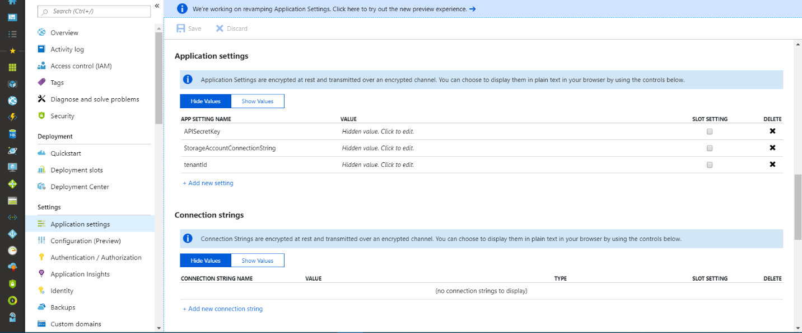
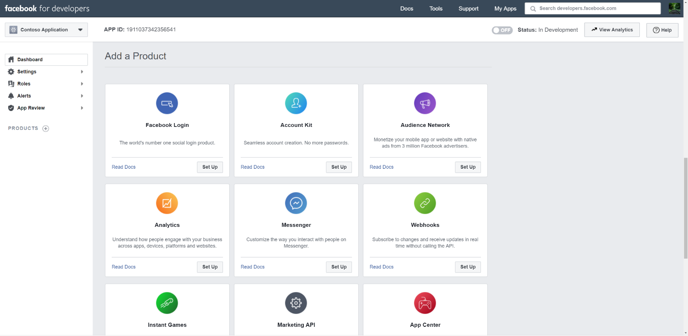
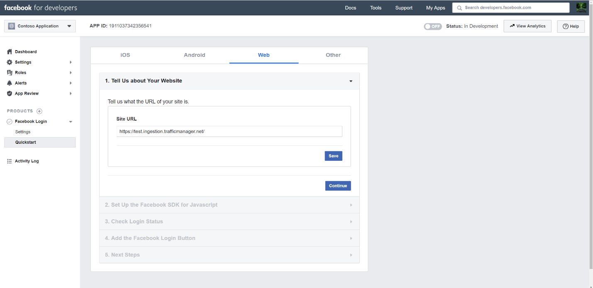
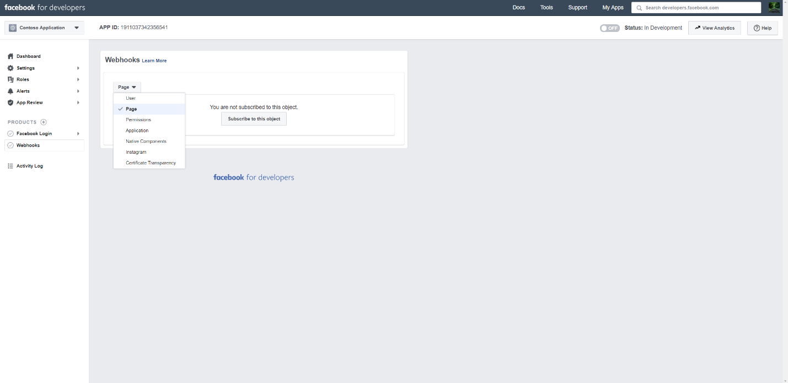
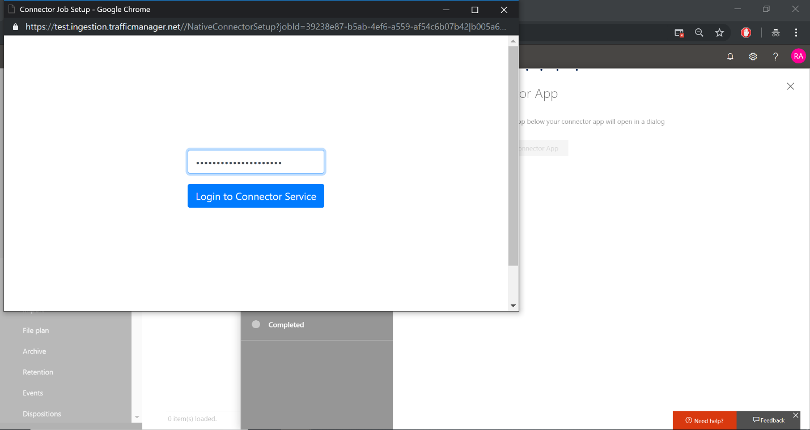
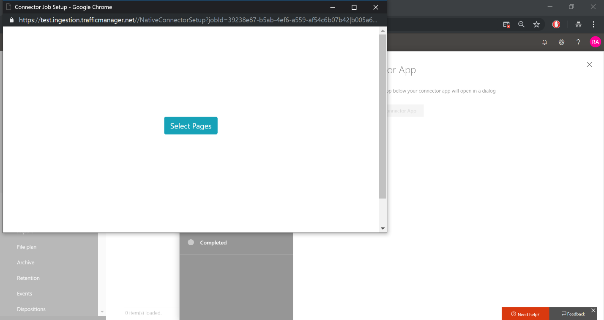
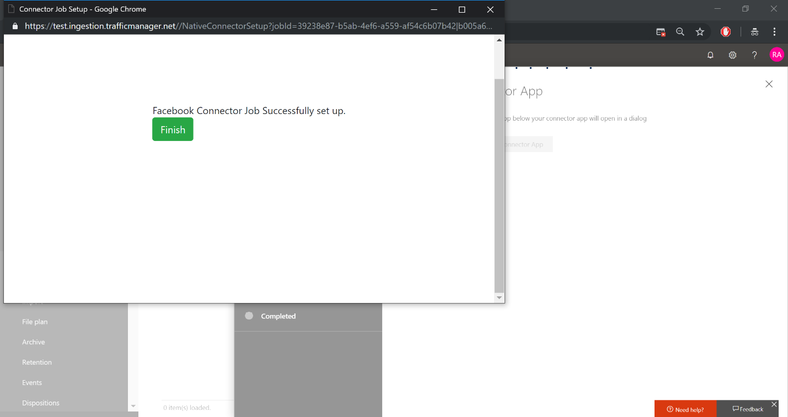

# Bereitstellen eines Connectors zum Archivieren von Facebook-Daten in Office 365Deploy a connector to archive Facebook data in Office 365

Dieser Artikel enthält den schrittweisen Prozess zur Bereitstellungeines Connectors, der den Office 365-Import Dienst zum Importieren von Daten aus Facebook-Geschäfts Seiten in Office 365 verwendet.This article contains the step-by-step process to deploy a connector that uses the Office 365 Import service to import data from Facebook Business pages to Office 365. Eine allgemeine Übersicht über diesen Prozess und eine Liste der Voraussetzungen, die für die Bereitstellungeines Facebook-Connectors erforderlich sind, finden Sie unter [Verwenden von Beispiel-Konnektoren zum Archivieren von drittanbieterdaten in Office 365](archive-third-party-data-with-sample-connector.md).For a high-level overview of this process and a list of prerequisites required to deploy a Facebook connector, see [Use sample connectors to archive third-party data in Office 365](archive-third-party-data-with-sample-connector.md). 

## Schritt 1: Herunterladen des PaketsStep 1: Download the package

Laden Sie das vordefinierte Paket aus dem Release- <https://github.com/Microsoft/m365-sample-connector-csharp-aspnet/releases>Abschnitt des Repository unter herunter.Download the prebuilt package from repository’s Release section at <https://github.com/Microsoft/m365-sample-connector-csharp-aspnet/releases>. Laden Sie die ZIP-Datei mit dem Namen **SampleConnector. zip**unter der aktuellen Version herunter.Under the latest release, download the zip file named **SampleConnector.zip**. Sie werden diese ZIP-Datei in Schritt 4 in Azure hochladen.You will upload this zip file to Azure in Step 4.

## Schritt 2: Erstellen einer APP in Azure Active DirectoryStep 2: Create an app in Azure Active Directory

1. Wechseln Sie <https://portal.azure.com> zu, und melden Sie sich mit den Anmeldeinformationen eines globalen Office 365-Administratorkontos an.Go to <https://portal.azure.com> and sign in using the credentials of an Office 365 global admin account.

    

2. Klicken Sie im linken Navigationsbereich auf **Azure Active Directory**.In the left navigation pane, click **Azure Active Directory**.

    

3. Klicken Sie im linken Navigationsbereich auf **App-Registrierungen (Vorschau)** , und klicken Sie dann auf **neue Registrierung**.In the left navigation pane, click **App registrations (Preview)** and then click **New registration**.

    

4. Registrieren Sie die Anwendung.Register the application. Wählen Sie unter umLeitungs-URI in der Dropdownliste Anwendungstyp die <https://portal.azure.com> Option Web aus, und geben Sie dann in das Feld für den URI ein.Under Redirect URI, select Web in the application type dropdown list and then type <https://portal.azure.com> in the box for the URI.

   

5. Kopieren Sie die **Anwendungs-(Client-) ID** und die **Verzeichnis (Mandanten)-ID** , und speichern Sie Sie in einer Textdatei oder an einem anderen sicheren Ort.Copy the **Application (client) ID** and **Directory (tenant) ID** and save them to a text file or other safe location. Sie verwenden diese IDs in späteren Schritten.You’ll use these IDs in later steps.

   

6. Wechseln Sie zu **Zertifikate & Secrets for the New app.**Go to **Certificates & secrets for the new app.**

   

7. Klicken Sie auf **neuer Client Schlüssel**Click **New client secret**

   

8. Erstellen Sie einen neuen Schlüssel.Create a new secret. Geben Sie im Feld Beschreibung den Schlüssel ein, und wählen Sie dann einen Ablaufzeitraum aus.In the description box, type the secret and then choose an expiration period. 

    

9. Kopieren Sie den Wert des geheimen Schlüssels, und speichern Sie ihn in einer Textdatei oder einem anderen Speicherort.Copy the value of the secret and save it to a text file or other storage location. Dies ist der AAD-Anwendungsschlüssel, den Sie in späteren Schritten verwenden werden.This is the AAD application secret that you will use in later steps.

   

10. Wechseln Sie zu **Manifest** , und kopieren Sie die identifierUris (die auch als Aad-Anwendungs-URI bezeichnet wird), wie im folgenden Screenshot hervorgehoben.Go to **Manifest** and copy the identifierUris (which is also called the AAD application Uri) as highlighted in the following screenshot. Kopieren Sie den AAD-Anwendungs-URI in eine Textdatei oder einen anderen Speicherort.Copy the AAD application Uri to a text file or other storage location. Sie werden es in Schritt 6 verwenden.You’ll use it in Step 6.

   

## Schritt 3: Erstellen eines Azure-speicherkontosStep 3: Create an Azure storage account

1. Wechseln Sie zur Azure-Startseite für Ihre Organisation.Go to the Azure home page for your organization.

    

2. Klicken Sie auf **Ressource erstellen** , und geben Sie **Speicherkonto** in das Suchfeld ein.Click **Create a resource** and they type **storage account** in the search box.

    

3. Klicken Sie auf **Speicher**, und klicken Sie dann auf **Speicherkonto**.Click **Storage**, and then click **Storage account**.

    

4. Wählen Sie auf der Seite **Speicherkonto erstellen** im Feld Abonnement die Option **Pay-as-you-go** oder **Kostenlose Testversion** je nach Typ des Azure-Abonnements aus.On the **Create storage account** page, in the Subscription box, select **Pay-As-You-Go** or **Free Trial** depending on which type of Azure subscription you have. Wählen Sie dann eine Ressourcengruppe aus, oder erstellen Sie diese.Then select or create a resource group.

    

5. Geben Sie einen Namen für das Speicherkonto ein.Type a name for the storage account.

    

6. Klicken Sie auf **Erstellen** , um das Speicherkonto zu erstellen.Review and then click **Create** to create the storage account.

    

7. Klicken Sie nach einigen Momenten auf **Aktualisieren** , und klicken Sie dann auf **zur Ressource wechseln** , um zum Speicherkonto zu navigieren.After a few moments, click **Refresh** and then click **Go to resource** to navigate to the storage account.

    

8. Klicken Sie im linken Navigationsbereich auf **Zugriffstasten** .Click **Access keys** in the left navigation pane.

    

9. Kopieren Sie eine **Verbindungszeichenfolge** , und speichern Sie Sie in einer Textdatei oder einem anderen Speicherort.Copy a **Connection string** and save it to a text file or other storage location. Sie werden dies beim Erstellen einer Web-App-Ressource verwenden.You’ll use this when creating a web app resource.

    

## Schritt 4: Erstellen einer neuen Web App-Ressource in AzureStep 4: Create a new web app resource in Azure

1. Klicken Sie auf der **Start** Seite im Azure-Portal auf **Ressource \> alles \> Web-App erstellen**.On the **Home** page in the Azure portal, click **Create a resource \> Everything \> Web app**. Klicken Sie auf der Seite **Web App** auf **Erstellen**.On the **Web app** page, click **Create**. 

   

2. Geben Sie die Details ein (siehe unten), und erstellen Sie dann die Web-App.Fill in the details (as shown below) and then create the Web app. Beachten Sie, dass der Name, den Sie im Feld **App-Name** eingeben, zum Erstellen der Azure-App-Dienst-URL verwendet wird. Beispiel FBconnector.azurewebsites.net.Note that the name that you enter in the **App name** box will be used to create the Azure app service URL; for example fbconnector.azurewebsites.net.

   

3. Wechseln Sie zur neu erstellten Web App-Ressource, und klicken Sie im linken Navigationsbereich auf **Anwendungseinstellungen** .Go to the newly created web app resource, click **Application Settings** in the left navigation pane. Klicken Sie unter Anwendungseinstellungen auf neue Einstellung hinzufügen, und fügen Sie die folgenden drei Einstellungen hinzu.Under Application settings, click Add new setting and add the following three settings. Verwenden Sie die Werte (die Sie aus den vorherigen Schritten in die Textdatei kopiert haben):Use the values (that you copied to the text file from the previous steps): 

    - **APISecretKey** – Sie können einen beliebigen Wert als Geheimnis eingeben.**APISecretKey** – You can type any value as the secret. Dieser wird verwendet, um in Schritt 7 auf die Connector-Web-App zuzugreifen.This will be used to access the connector web app in Step 7.

    - **StorageAccountConnectionString** – der Verbindungszeichenfolgen-URI, den Sie nach dem Erstellen des Azure-speicherkontos in Schritt 3 kopiert haben.**StorageAccountConnectionString** – The connection string Uri that you copied after creating the Azure storage account in Step 3.

    - **mandantEN** Kennung – die Mandanten-ID ihrer Office 365-Organisation, die Sie nach der Erstellung der Facebook-Connector-app in Azure Active Directory in Schritt 2 kopiert haben.**tenantId** – The tenant ID of your Office 365 organization that you copied after creating the Facebook connector app in Azure Active Directory in Step 2.

    

4. Klicken Sie unter **Allgemeine Einstellungen** **auf** neben **immer ein**.Under **General settings**, click **On** next to the **Always On**. Klicken Sie oben auf der Seite auf **Speichern** , um die Applicaton-Einstellungen zu speichern.Click **Save** at the top of the page to save applicaton settings.

   

5. Der letzte Schritt besteht darin, den Connector-App-Quellcode in Azure hochzuladen, den Sie in Schritt 1 heruntergeladen haben.The final step is to upload the connector app source code to Azure that you downloaded in Step 1. Wechseln Sie in einem Webbrowser zu https://<AzureAppResourceName>. SCM.azurewebsites.net/ZipDeployUi.In a web browser, go to https://<AzureAppResourceName>.scm.azurewebsites.net/ZipDeployUi. Wenn beispielsweise der Name Ihrer Azure-App-Ressource (die Sie in Schritt 2 in diesem Abschnitt genannt haben) **FBconnector**lautet, wechseln Sie zu https://fbconnector.scm.azurewebsites.net/ZipDeployUi.For example, if the name of your Azure app resource (which you named in step 2 in this section) is **fbconnector**, then you would go to https://fbconnector.scm.azurewebsites.net/ZipDeployUi. 

6. Ziehen Sie die SampleConnector. zip (die Sie in Schritt 1 heruntergeladen haben) auf diese Seite.Drag and drop the SampleConnector.zip (that you downloaded in Step 1) to this page. Nachdem die Dateien hochgeladen wurden und die Bereitstellung erfolgreich war, sieht die Seite ähnlich wie im folgenden Screenshot aus.After the files are uploaded and the deployment is successful, the page will look similar to the following screenshot.

   

## Schritt 5: Registrieren der Facebook-AppStep 5: Register the Facebook app

1. Wechseln Sie <https://developers.facebook.com> zu, melden Sie sich mit den Anmeldeinformationen für das Konto für die Facebook-Geschäfts Seiten Ihrer Organisation an, und klicken Sie dann auf **neue APP hinzufügen**.Go to <https://developers.facebook.com> , log in using the credentials for the account for your organization’s Facebook Business pages, and then click **Add New App**.

   

2. Erstellen Sie eine neue APP-ID.Create a new app ID.

   

3. Klicken Sie im linken Navigationsbereich auf **Produkte hinzufügen** , und klicken Sie dann auf der Kachel **Facebook-Anmeldung** auf **Einrichten** .In the left navigation pane, click **Add Products** and then click **Set Up** in the **Facebook Login** tile.

   

4. Klicken Sie auf der Seite Facebook-Anmeldung integrieren auf **Web**.On the Integrate Facebook Login page, click **Web**.

   

5. Hinzufügen der Azure-App-Dienst-URL Beispiel https://fbconnector.azurewebsites.net.Add the Azure app service URL; for example https://fbconnector.azurewebsites.net.

   

6. Schließen Sie den Abschnitt Schnellstart des Facebook-Anmelde Setups ab.Complete the QuickStart section of the Facebook Login setup.

   

7. Klicken Sie im linken Navigationsbereich unter **Facebook-Anmeldung**auf **Einstellungen**, und fügen Sie den OAuth-Umleitungs-URI im Feld **gültige OAuth** -Umleitungs-URIs hinzu. Verwenden Sie das Format \*\* \<connectorserviceuri>/views/FacebookOAuth\*\*, wobei der Wert für connectorserviceuri die Azure-App-Dienst-URL für Ihre Organisation ist. Beispiel https://fbconnector.azurewebsites.net.In the left navigation pane under **Facebook Login**, click **Settings**, and add the OAuth redirect URI in the **Valid OAuth Redirect URIs** box; use the format **\<connectorserviceuri>/Views/FacebookOAuth**, where the value for connectorserviceuri is the Azure app service URL for your organization; for example https://fbconnector.azurewebsites.net.

   

8. Klicken Sie im linken Navigationsbereich auf **Produkte hinzufügen** und dann auf webhooks **.**In the left navigation pane, click **Add Products** and then click **Webhooks.** Klicken Sie im Pulldown-Menü **Seite** auf **Seite**.In the **Page** pull-down menu, click **Page**. 

   

9. Fügen Sie webhooks-Rückruf-URL hinzu, und fügen Sie ein Verify-Token hinzu.Add Webhooks Callback URL and add a verify token. Das Format der Rückruf-URL, verwenden Sie das Format \*\* <connectorserviceuri>/API/FbPageWebhook\*\*, wobei der Wert für connectorserviceuri die Azure-App-Dienst-URL für Ihre Organisation ist. Beispiel https://fbconnector.azurewebsites.net.The format of the callback URL, use the format **<connectorserviceuri>/api/FbPageWebhook**, where the value for connectorserviceuri is the Azure app service URL for your organization; for example https://fbconnector.azurewebsites.net. 

    Das Verify-Token sollte einem starken Kennwort ähneln.The verify token should similar to a strong password. Kopieren Sie das Verify-Token in eine Textdatei oder einen anderen Speicherort.Copy the verify token to a text file or other storage location.

     

10. Testen Sie und abonnieren Sie den Endpunkt für Feed.Test and subscribe to the endpoint for feed.

    

11. Fügen Sie eine Datenschutz-URL, ein App-Symbol und eine geschäftliche Verwendung hinzu.Add a privacy URL, app icon, and business use. Kopieren Sie außerdem die APP-ID und den App-Schlüssel in eine Textdatei oder einen anderen Speicherort.Also, copy the app ID and app secret to a text file or other storage location.

    

12. Machen Sie die APP öffentlich.Make the app public.

    

13. Hinzufügen eines Benutzers zur Administrator-oder Tester-Rolle.Add user to the admin or tester role.

    

14. Fügen Sie die Zugriffsberechtigung für die **Seite Public Content** hinzu.Add the **Page Public Content Access** permission.

    

15. Berechtigung zum Hinzufügen von Seiten verwalten.Add Manage Pages permission.

    

16. Die Anwendung wird von Facebook überprüft.Get the application reviewed by Facebook.

    

## Schritt 6: Konfigurieren der Connector-Web-AppStep 6: Configure the connector web app

1. Wechseln Sie zu\<https://AzureAppResourceName>. azurewebsites. net (wobei AzureAppResourceName der Name Ihrer Azure-App-Ressource ist, die Sie in Schritt 4 benannt haben), wenn beispielsweise der Name **FBconnector**lautet, wechseln Sie zu https://fbconnector.azurewebsites.net.Go to https://\<AzureAppResourceName>.azurewebsites.net (where AzureAppResourceName is the name of your Azure app resource that you named in Step 4) For example, if the name is **fbconnector**, go to https://fbconnector.azurewebsites.net. Die Startseite der APP sieht wie im folgenden Screenshot aus.The home page of the app will look like the following screenshot.

  

2. Klicken Sie auf **Konfigurieren** , um eine Anmeldeseite anzuzeigen.Click **Configure** to display a sign in page.
 
   

3. Geben Sie in das Feld Mandanten-ID Ihre Mandanten-ID ein, oder fügen Sie Sie ein (die Sie in Schritt 2 erhalten haben).In the Tenant Id box, type or paste your tenant Id (that you obtained in Step 2). Geben Sie in das Feld Kennwort den APISecretKey (den Sie in Schritt 2 abgerufen haben) ein, oder fügen Sie ihn ein, und klicken Sie dann auf **Konfigurationseinstellungen festlegen** , um die Seite **Konfigurations Details** anzuzeigen.In the password box, type or paste the APISecretKey (that you obtained in Step 2), and then click **Set Configuration Settings** to display the **Configuration Details** page.

    

4. Geben Sie unter **Konfigurations Details**die folgenden Konfigurationseinstellungen ein.Under **Configuration Details**, enter the following configuration settings 

   - **Facebook-Anwendungs-ID** – die APP-ID für die Facebook-Anwendung, die Sie in Schritt 5 abgerufen haben.**Facebook application ID** - The app ID for the Facebook application that you obtained in Step 5.
   - **Facebook Application Secret** -das App-Geheimnis für die Facebook-Anwendung, die Sie in Schritt 5 erhalten haben.**Facebook application secret** - The app secret for the Facebook application that you obtained in Step 5.
   - **Facebook-webhooks überprüfen Token** – das Verify-Token, das Sie in Schritt 5 erstellt haben.**Facebook webhooks verify token** - The verify token that you created in Step 5.
   - **Aad-Anwendungs** -ID – die Anwendungs-ID für die Azure Active Directory-APP, die Sie in Schritt 2 erstellt haben**AAD application ID** - The application ID for the Azure Active Directory app that you created in Step 2
   - **Aad Application Secret** – der Wert für den APISecretKey-Schlüssel, den Sie in Schritt 4 erstellt haben.**AAD application secret** - The value for the APISecretKey secret that you created in Step 4.
   - **Aad-Anwendungs-URI** – der in Schritt 2 abgerufene Aad-Anwendungs-URI; Beispiel: https://microsoft.onmicrosoft.com/2688yu6n-12q3-23we-e3ee-121111123213.**AAD application Uri** - The AAD application Uri obtained in Step 2; for example, https://microsoft.onmicrosoft.com/2688yu6n-12q3-23we-e3ee-121111123213.
   - **App** -Einblicke-Instrumentations Schlüssel – lassen Sie dieses Feld leer.**App insights instrumentation key** - Leave this box blank.

5. Klicken Sie auf **Speichern** , um die Connectoreinstellungen zu speichern.Click **Save** to save the connector settings.

## Schritt 7: Einrichten eines benutzerdefinierten Connectors im Security & Compliance CenterStep 7: Set up a custom connector in the Security & Compliance Center

1. Wechseln Sie <https://protection.office.com> zu, und klicken Sie dann auf \*\* \> Data Governance-Import \> Archiv-drittanbieterdaten\*\*.Go to <https://protection.office.com> and then click **Data governance \> Import \> Archive third-party data**.

   

2.  Klicken Sie auf **Connector hinzufügen** , und klicken Sie dann auf **Benutzerdefiniert**.Click **Add a connector** and then click **Custom**.

    

3.  Geben Sie auf der Seite **Connector-app hinzufügen** die folgenden Informationen ein, und klicken Sie dann auf **weiter**.On the **Add Connector App** page, enter the following information and then click **Next**.

    - Geben Sie im ersten Feld einen Namen für den Connector ein, beispielsweise **Facebook**.In the first box, type a name for the connector, such as **Facebook**.
    - Geben Sie im zweiten Feld den Wert des APISecretKey ein, oder fügen Sie ihn ein, den Sie in Schritt 4 hinzugefügt haben.In the second box, type or paste the value of the APISecretKey that you added in Step 4.
    - Geben Sie im dritten Feld die URL des Azure-App-Diensts ein. Beispiel **https://fbconnector.azurewebsites.net**.In the third box, type of paste the Azure app service URL; for example **https://fbconnector.azurewebsites.net**.
    
    

4.  Klicken Sie auf **Login mit Connector-App**.Click **Login with Connector App**.

    

5. Geben Sie den APISecretKey erneut ein, oder fügen Sie ihn ein, und klicken Sie dann auf **für connectorDienst anmelden**.Type or paste the APISecretKey again and then click  **Login to Connector Service**.

   

6. Klicken Sie auf **mit Facebook anmelden.**Click **Login with Facebook.**

   

7. Melden Sie sich auf der Seite **Anmelden bei Facebook** mit den Anmeldeinformationen für das Konto für die Facebook-Geschäfts Seiten Ihrer Organisation an.On the **Log in to Facebook** page, log in using the credentials for the account for your organization’s Facebook Business pages. Stellen Sie sicher, dass das Facebook-Konto, mit dem Sie angemeldet sind, der Administratorrolle für die Facebook-Geschäfts Seiten Ihrer Organisation zugewiesen ist.Make sure the Facebook account you logged in to is assigned the admin role for your organization’s Facebook Business pages

   

8. Klicken Sie auf **Seiten auswählen** , um die Geschäfts Seiten Ihrer Organisation auszuwählen, die Sie in Office 365 archivieren möchten.Click **Select Pages** to choose your organization’s business pages that you want to archive in Office 365.

   

9. Eine Liste der Geschäfts Seiten, die vom Facebook-Konto verwaltet werden, mit dem Sie sich angemeldet haben, wird angezeigt.A list of the Business pages managed by the Facebook account that you logged in to is displayed. Wählen Sie die zu archivierende Seite aus, und klicken Sie dann auf **Speichern**.Select the page to archive and then click **Save**.

    

10. Klicken Sie auf **Fertig stellen** , um das Setup der Connector-Dienst-APP zu beenden.Click **Finish** to exit the setup of the connector service app.

    

11. Auf der Seite **Filter festlegen** können Sie einen Filter anwenden, um Elemente zu importieren (und zu archivieren), die ein bestimmtes Alter aufweisen.On the **Set Filters** page, you can apply a filter to import (and archive) items that are a certain age. Klicken Sie auf **Weiter**.Click **Next**.

    

12. Wählen Sie auf der Seite " **Speicherkonto festlegen** " das Office 365-Postfach aus, das die Elemente aus den Facebook-Geschäfts Seiten, die Sie zuvor ausgewählt haben, in importiert werden.On the **Set Storage Account** page, select the Office 365 mailbox that the items from the Facebook Business pages that you previously selected will be imported to.

    

13. Überprüfung der Einstellungen und klicken Sie dann auf **Fertig stellen** , um das Connector-Setup im Security _AMP_ Compliance Center abzuschließen.Review your settings and then click **Finish** to complete the connector setup in the Security & Compliance Center.

    

14. Wechseln Sie zur Seite **Archiv-drittanbieterdaten** , um den Fortschritt des Importvorgangs anzuzeigen.Go to the **Archive third-party data** page to see the progress of the import process.

    
