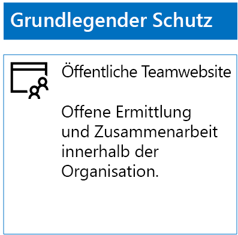
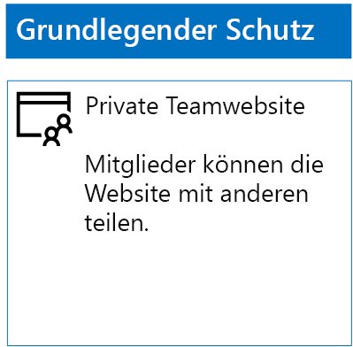
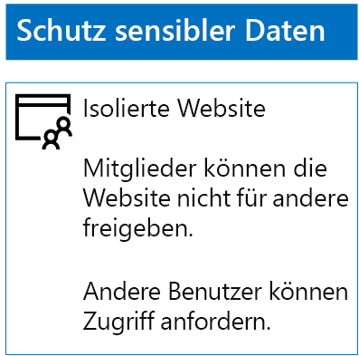
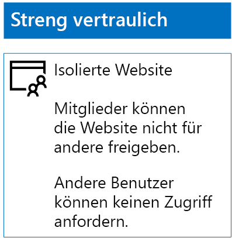

# Bereitstellen von SharePoint Online-Websites für drei Schutzebenen

 **Zusammenfassung:** Erstellen und Konfigurieren von SharePoint Online-Teamwebsites für verschiedene Ebenen des Informationsschutzes.
  
Verwenden Sie die Schritte in diesem Artikel, um Richtlinien für grundlegende, vertrauliche und streng vertrauliche SharePoint Online-Teamwebsites zu entwerfen. Weitere Informationen zu diesen drei Schutzebenen finden Sie unter [Sichern von SharePoint Online-Websites und -Dateien](secure-sharepoint-online-sites-and-files.md).
  
## Grundlegende SharePoint Online-Teamwebsites

Der grundlegende Schutz enthält jeweils öffentliche und private Teamwebsites. Öffentliche Teamwebsites können von allen Benutzern in der Organisation ermittelt werden und alle haben Zugriff auf diese. Nur Mitglieder der Office 365-Gruppe, die mit der Teamwebsite verknüpft sind, können die privaten Websites ermitteln und auf diese zugreifen. Diese beiden Arten von Teamwebsites erlauben Mitgliedern, die Website für andere Personen freizugeben.
  
### Öffentlich

Um eine grundlegende SharePoint Online-Teamwebsite mit öffentlichem Zugriff und Berechtigungen zu erstellen, tun Sie Folgendes:
  
1. Melden Sie sich beim Admin Center mit einem Konto an, das auch zum Verwalten der SharePoint Online-Teamwebsite verwendet wird (SharePoint Online-Administrator). Hilfe finden Sie unter [Where to sign in to Office 365 (Wo kann ich mich bei Office 365 anmelden?)](https://support.office.com/Article/Where-to-sign-in-to-Office-365-e9eb7d51-5430-4929-91ab-6157c5a050b4).
    
2. Klicken Sie in der Liste der Kacheln auf **SharePoint**.
    
3. Klicken Sie in der neuen Registerkarte **SharePoint** in Ihrem Browser auf **+ Website erstellen**.
    
4. Klicken Sie auf der Seite **Website erstellen** auf **Teamwebsite**.
    
5. Geben Sie unter **Name der Website** einen Namen für die öffentliche Teamwebsite ein. 
    
6. Geben Sie im Feld **Beschreibung der Teamwebsite** eine Beschreibung der Website ein.
    
7. Wählen Sie unter **Datenschutzeinstellungen** die Option **Öffentlich - Alle Benutzer in der Organisation können auf diese Website zugreifen** aus, und klicken Sie dann auf **Weiter**.
    
8. Klicken Sie im Bereich **Wer soll hinzugefügt werden?** auf **Fertig stellen**.
    
Nachfolgend sehen Sie die daraus resultierende Konfiguration.
  

  
### Private

Um eine grundlegende SharePoint Online-Teamwebsite mit privatem Zugriff und Berechtigungen zu erstellen, tun Sie Folgendes:
  
1. Melden Sie sich beim Admin Center mit einem Konto an, das auch zum Verwalten der SharePoint Online-Teamwebsite verwendet wird (SharePoint Online-Administrator). Hilfe finden Sie unter [Where to sign in to Office 365 (Wo kann ich mich bei Office 365 anmelden?)](https://support.office.com/Article/Where-to-sign-in-to-Office-365-e9eb7d51-5430-4929-91ab-6157c5a050b4).
    
2. Klicken Sie in der Liste der Kacheln auf **SharePoint**.
    
3. Klicken Sie in der neuen Registerkarte **SharePoint** in Ihrem Browser auf **+ Website erstellen**.
    
4. Klicken Sie auf der Seite **Website erstellen** auf **Teamwebsite**.
    
5. Geben Sie unter **Name der Website** einen Namen für die private Teamwebsite ein. 
    
6. Geben Sie unter **Beschreibung der Teamwebsite** eine Beschreibung des Zwecks der Website ein.
    
7. Wählen Sie unter **Datenschutzeinstellungen** die Option **Privat - nur Mitglieder können auf diese Website zugreifen** aus, und klicken Sie dann auf **Weiter**.
    
8. Geben Sie im Bereich **Who do you want to add?** (Wen möchten Sie hinzufügen?) unter **Mitglieder hinzufügen** die Namen der Benutzerkonten ein, die über Zugriff auf diese private Teamwebsite verfügen.
    
9. Wenn Sie mit dem Hinzufügen der ersten Gruppe von Mitgliedern zur Website fertig sind, klicken Sie auf **Fertig stellen**.
    
Nachfolgend sehen Sie die daraus resultierende Konfiguration.
  

  
## Vertrauliche SharePoint Online-Teamwebsites

Eine vertrauliche SharePoint Online-Teamwebsite ist eine isolierte Teamwebsite. Das heißt, dass die Berechtigungen über die Mitgliedschaft in SharePoint-Gruppen statt der Mitgliedschaft in der Office 365-Gruppe, die der Teamwebsite zugeordnet ist, gesteuert werden.
  
Beim Erstellen einer isolierten Teamwebsite gibt es zwei Hauptschritte.
  
### Schritt 1: Entwerfen Ihrer isolierten Website

Um eine isolierte Teamwebsite zu erstellen, müssen Sie Folgendes festlegen:
  
- Ihre SharePoint-Gruppen und -Berechtigungsstufen.
    
- Der Satz der Zugriffsgruppen, die Mitglieder Ihrer SharePoint-Gruppen sein werden.
    
     Der empfohlene Satz von Zugriffsgruppen ist einer für Websitemitglieder, einer für Website-Viewer und einer für Websiteadministratoren.
    
- Ob Sie verschachtelte Gruppen innerhalb Ihrer Zugriffsgruppen verwenden.
    
Beispielsweise sehen die empfohlene Gruppenstruktur und Berechtigungsstufen wie folgt aus:
  
|**SharePoint-Gruppe**|**Berechtigungsstufe**|**Zugriffsgruppe (Beispiele)**|
|:-----|:-----|:-----|
|[Websitename] Mitglieder    |Bearbeiten    |[Websitename] Mitglieder    |
|[Websitename] Besucher    |Überwachungsdaten    |[Websitename] Viewer    |
|[Websitename] Besitzer    |Vollzugriff    |[Websitename] Administratoren    |
   
Die SharePoint-Gruppen und -Berechtigungsstufen werden standardmäßig für eine Teamwebsite erstellt. Sie müssen die Namen Ihrer Zugriffsgruppen bestimmen.
  
Informationen zum Entwurfsprozess finden Sie unter [Entwerfen einer isolierten SharePoint Online-Teamwebsite](design-an-isolated-sharepoint-online-team-site.md).
  
### Schritt 2: Bereitstellen Ihrer isolierten Website

Um Ihre isolierte Website bereitzustellen, müssen Sie zunächst Folgendes tun:
  
- Bestimmen Sie die Benutzerkonten und -gruppen, die jeder Zugriffsgruppe hinzugefügt werden soll.
    
- Erstellen Sie die Zugriffsgruppen, und fügen Sie die Benutzer und Gruppenmitglieder hinzu.
    
Detaillierte Schritte finden Sie in **Phase 1** unter [Bereitstellen einer isolierten SharePoint Online-Teamwebsite](deploy-an-isolated-sharepoint-online-team-site.md).
  
Erstellen Sie als Nächstes mit den folgenden Schritten die SharePoint Online-Teamwebsite.
  
1. Melden Sie sich beim Admin Center mit einem Konto an, das auch zum Verwalten der SharePoint Online-Teamwebsite verwendet wird (SharePoint Online-Administrator). Hilfe finden Sie unter [Where to sign in to Office 365 (Wo kann ich mich bei Office 365 anmelden?)](https://support.office.com/Article/Where-to-sign-in-to-Office-365-e9eb7d51-5430-4929-91ab-6157c5a050b4).
    
2. Klicken Sie in der Liste von Kacheln auf **SharePoint**.
    
3. Klicken Sie auf der neuen Registerkarte **SharePoint** in Ihrem Browser auf **+ Website erstellen**.
    
4. Klicken Sie auf der Seite **Website erstellen** auf **Teamwebsite**.
    
5. Geben Sie unter **Name der Website** einen Namen für die private Teamwebsite ein.
    
6. Geben Sie in der Beschreibung für die **Teamwebsite** eine optionale Beschreibung ein.
    
7. Wählen Sie unter **Datenschutzeinstellungen** die Option **Privat - nur Mitglieder können auf diese Website zugreifen** aus, und klicken Sie dann auf **Weiter**.
    
8. Klicken Sie im Bereich **Wer soll hinzugefügt werden?** auf **Fertig stellen**.
    
Konfigurieren Sie als Nächstes auf der neuen SharePoint Online-Teamwebsite die gewünschten Berechtigungen anhand der folgenden Schritte.
  
1. Ermitteln Sie den UPN (User Principal Name) des IT-Administrators oder der anderen Person, die für das Beantworten und Bearbeiten von Anfragen hinsichtlich des Zugriffs auf die Website zuständig ist (Beispiel für einen UPN: belindan@contoso.com). 
    
2. Klicken Sie in der Symbolleiste auf das Symbol „Einstellungen“ und anschließend auf **Websiteberechtigungen**.
    
3. Klicken Sie im Bereich **Websiteberechtigungen** auf **Erweiterte Berechtigungseinstellungen**.
    
4. Klicken Sie auf der neuen Registerkarte **Berechtigungen** in Ihrem Browser auf **Zugriffseinstellungen anfordern**.
    
5. Im Dialogfeld **Einstellungen für Zugriffsanforderungen**:
    
  - Deaktivieren Sie die Kontrollkästchen **Mitgliedern das Freigeben der Website sowie einzelner Dateien und Ordner erlauben** und **Mitgliedern erlauben, andere Benutzer der Gruppe "Websitemitglieder" einzuladen**.
    
  - Geben Sie den UPN Ihres IT-Administrators aus Schritt 1 unter **Alle Zugriffsanforderungen senden**.
    
  - Klicken Sie auf **OK**.
    
6. Klicken Sie auf der Registerkarte **Berechtigungen** Ihres Browsers auf **[Websitename] Mitglieder** in der Liste.
    
7. Klicken Sie unter **Benutzer und Gruppen** auf **Neu**.
    
8. Geben Sie im Dialogfeld **Freigeben** den Namen der Zugriffsgruppe Ihrer Websitemitglieder für diese Website an, wählen Sie ihn aus, und klicken Sie dann auf **Freigeben**.
    
9. Klicken Sie auf die Schaltfläche „Zurück“ in Ihrem Browser.
    
10. Klicken Sie auf **Besitzer von [Websitename]** in der Liste.
    
11. Klicken Sie auf der Seite **Benutzer und Gruppen** auf **Neu**.
    
12. Geben Sie im Dialogfeld **Freigeben** den Namen der Zugriffsgruppe des Websiteadministrators für diese Website an, wählen Sie ihn aus, und klicken Sie dann auf **Freigeben**.
    
13. Klicken Sie auf die Schaltfläche „Zurück“ in Ihrem Browser.
    
14. Klicken Sie auf **Besucher von [Websitename]** in der Liste.
    
15. Klicken Sie auf der Seite **Benutzer und Gruppen** auf **Neu**.
    
16. Geben Sie im Dialogfeld **Freigeben** den Namen der Zugriffsgruppe der Websiteviewer für diese Website an, wählen Sie ihn aus, und klicken Sie dann auf **Freigeben**.
    
17. Schließen Sie die Registerkarte **Berechtigungen** Ihres Browsers.
    
Die Ergebnisse dieser Berechtigungseinstellungen sehen folgendermaßen aus:
  
- Die SharePoint-Gruppe **Besitzer von [Websitename]** enthält die Zugriffsgruppe des Websiteadministrators, in der alle Mitglieder über die Berechtigungsstufe **Vollzugriff** verfügen.
    
- Die SharePoint-Gruppe **[Websitename] Mitglieder** enthält die Zugriffsgruppe der Websitemitglieder, in der alle Mitglieder über die Berechtigungsstufe **Bearbeiten** verfügen.
    
- Die SharePoint-Gruppe **[Websitename] Besucher** enthält die Zugriffsgruppe der Websitebesucher, in der alle Mitglieder über die Berechtigungsstufe **Lesen** verfügen.
    
- Die Möglichkeit, dass Mitglieder andere Mitglieder einladen, ist deaktiviert.
    
- Die Möglichkeit, dass Nicht-Mitglieder Zugriff anfordern, ist aktiviert.
    
Nachfolgend sehen Sie die daraus resultierende Konfiguration.
  

  
Die Mitglieder der Website können nun über Gruppenmitgliedschaft in einer der Zugriffsgruppen sicher an den Ressourcen der Website zusammenarbeiten.
  
## Streng vertrauliche SharePoint Online-Teamwebsites

Eine streng vertrauliche SharePoint Online-Teamwebsite ist eine isolierte Teamwebsite, was bedeutet, dass Berechtigungen über die Mitgliedschaft in SharePoint-Gruppen und nicht über die Mitgliedschaft in der Office 365-Gruppe gesteuert werden, die mit der Teamwebsite verknüpft ist.
  
Für die Erstellung einer isolierten Teamwebsite für streng vertrauliche Informationen und Kollaboration sind zwei Schritte nötig.
  
### Schritt 1: Entwerfen Ihrer isolierten Website

Um eine isolierte Teamwebsite zu erstellen, müssen Sie Folgendes festlegen:
  
- Ihre SharePoint-Gruppen und -Berechtigungsstufen.
    
- Der Satz der Zugriffsgruppen, die Mitglieder Ihrer SharePoint-Gruppen sein werden.
    
     Der empfohlene Satz von Zugriffsgruppen ist einer für Websitemitglieder, einer für Website-Viewer und einer für Websiteadministratoren.
    
- Ob Sie verschachtelte Gruppen innerhalb Ihrer Zugriffsgruppen verwenden.
    
Beispielsweise sehen die empfohlene Gruppenstruktur und Berechtigungsstufen wie folgt aus:
  
|**SharePoint-Gruppe**|**Berechtigungsstufe**|**Zugriffsgruppe (Beispiele)**|
|:-----|:-----|:-----|
|[Websitename] Mitglieder    |Bearbeiten    |[Websitename] Mitglieder    |
|[Websitename] Besucher    |Überwachungsdaten    |[Websitename] Viewer    |
|[Websitename] Besitzer    |Vollzugriff    |[Websitename] Administratoren    |
   
Die SharePoint-Gruppen und -Berechtigungsstufen werden standardmäßig für eine Teamwebsite erstellt. Sie müssen die Namen Ihrer Zugriffsgruppen bestimmen.
  
Informationen zum Entwurfsprozess finden Sie unter [Entwerfen einer isolierten SharePoint Online-Teamwebsite](design-an-isolated-sharepoint-online-team-site.md).
  
### Schritt 2: Bereitstellen Ihrer isolierten Website

Um Ihre isolierte Website bereitzustellen, müssen Sie zunächst Folgendes tun:
  
- Ermitteln Sie die Benutzer und Gruppenmitglieder der einzelnen Zugriffsgruppen.
    
- Erstellen Sie die Zugriffsgruppen, und fügen Sie die Benutzer und Gruppenmitglieder hinzu.
    
- Erstellen einer isoliertem Teamwebsite, die Ihre Zugriffsgruppen verwendet
    
Detaillierte Schritte finden Sie unter [Bereitstellen einer isolierten SharePoint Online-Teamwebsite](deploy-an-isolated-sharepoint-online-team-site.md).
  
Nachfolgend sind die Ergebnisse dieser Berechtigungseinstellungen aufgeführt:
  
- Die SharePoint-Gruppe **Besitzer von [Websitename]** enthält die Zugriffsgruppe des Websiteadministrators, in der alle Mitglieder über die Berechtigungsstufe **Vollzugriff** verfügen.
    
- Die SharePoint-Gruppe **[Websitename] Mitglieder** enthält die Zugriffsgruppe der Websitemitglieder, in der alle Mitglieder über die Berechtigungsstufe **Bearbeiten** verfügen.
    
- Die SharePoint-Gruppe **[Websitename] Besucher** enthält die Zugriffsgruppe der Websitebesucher, in der alle Mitglieder über die Berechtigungsstufe **Lesen** verfügen.
    
- Die Möglichkeit, dass Mitglieder andere Mitglieder einladen, ist deaktiviert.
    
- Die Möglichkeit, dass Nicht-Mitglieder Zugriff anfordern, ist deaktiviert.
    
Nachfolgend sehen Sie die daraus resultierende Konfiguration.
  

  
Die Mitglieder der Website können nun über Gruppenmitgliedschaft in einer der Zugriffsgruppen sicher an den Ressourcen der Website zusammenarbeiten.
  
## Nächster Schritt

[Schützen von SharePoint Online-Dateien mit Office 365-Bezeichnungen und Verhindern von Datenverlust](protect-sharepoint-online-files-with-office-365-labels-and-dlp.md)

## Siehe auch

[Sichern von SharePoint Online-Websites und -Dateien](secure-sharepoint-online-sites-and-files.md)
  
[Microsoft-Sicherheitsleitfaden für politische Kampagnen, gemeinnützige Organisationen und andere agile Organisationen](microsoft-security-guidance-for-political-campaigns-nonprofits-and-other-agile-o.md)
  
[Cloudakzeptanz und Hybridlösungen](https://docs.microsoft.com/office365/enterprise/cloud-adoption-and-hybrid-solutions)
