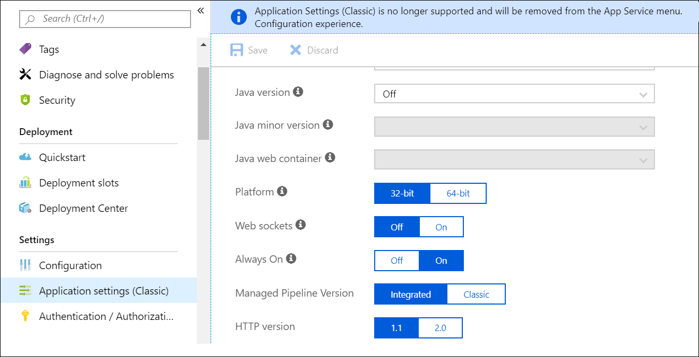

# Bereitstellen eines Connectors zum Archivieren von Twitter-Daten in Office 365Deploy a connector to archive Twitter data in Office 365

Dieser Artikel enthält den schrittweisen Prozess zur Bereitstellungeines Connectors, der den Office 365 Import Dienst verwendet, um Daten aus dem Twitter-Konto Ihrer Organisation in Office 365 zu importieren.This article contains the step-by-step process to deploy a connector that uses the Office 365 Import service to import data from your organization's Twitter account to Office 365. Eine allgemeine Übersicht über diesen Prozess und eine Liste der erforderlichen Voraussetzungen für die Bereitstellungeines Twitter-Konnektors finden Sie unter [Verwenden eines Beispiel-Konnektors zum Archivieren von Twitter-Daten in Office 365 (Preview)](archive-twitter-data-with-sample-connector.md).For a high-level overview of this process and a list of prerequisites required to deploy a Twitter connector, see [Use a sample connector to archive Twitter data in Office 365 (Preview)](archive-twitter-data-with-sample-connector.md). 

## Schritt 1: Herunterladen des PaketsStep 1: Download the package

Laden Sie das vorgefertigte Paket aus dem Abschnitt Release im GitHub-Repository unter [https://github.com/microsoft/m365-sample-twitter-connector-csharp-aspnet/releases](https://github.com/microsoft/m365-sample-twitter-connector-csharp-aspnet/releases)herunter.Download the prebuilt package from the Release section in the GitHub repository at [https://github.com/microsoft/m365-sample-twitter-connector-csharp-aspnet/releases](https://github.com/microsoft/m365-sample-twitter-connector-csharp-aspnet/releases). Laden Sie die ZIP-Datei mit dem Namen **SampleConnector. zip**unter der neuesten Version herunter.Under the latest release, download the zip file named **SampleConnector.zip**. Sie werden diese ZIP-Datei in Schritt 4 in Azure hochladen.You will upload this zip file to Azure in Step 4.

## Schritt 2: Erstellen einer APP in Azure Active DirectoryStep 2: Create an app in Azure Active Directory

1. Wechseln Sie <https://portal.azure.com> zu, und melden Sie sich mit den Anmeldeinformationen eines Office 365 globalen Administratorkontos an.Go to <https://portal.azure.com> and sign in using the credentials of an Office 365 global admin account.

   

2. Klicken Sie im linken Navigationsbereich auf **Azure Active Directory**.In the left navigation pane, click **Azure Active Directory**.

   

3. Klicken Sie im linken Navigationsbereich auf **App-Registrierungen (Vorschau)** , und klicken Sie dann auf **neue Registrierung**.In the left navigation pane, click **App registrations (Preview)** and then click **New registration**.

   

4. Registrieren Sie die Anwendung.Register the application. Wählen Sie unter Umleitungs- **URI (optional)** in der Dropdownliste Anwendungstyp die <https://portal.azure.com> Option Webseite aus, und geben Sie dann in das Feld für den URI ein.Under **Redirect URI (optional)**, select Web in the application type dropdown list and then type <https://portal.azure.com> in the box for the URI.

   

5. Kopieren Sie die Anwendungs-ID **(Client) ID** und **Verzeichnis (Mandanten)** , und speichern Sie Sie in einer Textdatei oder an einem anderen sicheren Ort.Copy the **Application (client) ID** and **Directory (tenant) ID** and save them to a text file or other safe location. Sie verwenden diese IDs in späteren Schritten.You’ll use these IDs in later steps.

    

6. Wechseln Sie zu **Certificates & Secrets for the New App** und unter **Client Secrets** auf **New Client Secret**.Go to **Certificates & secrets for the new app** and under **Client secrets** click **New client secret**.

   

7. Erstellen Sie einen neuen geheimen Schlüssel.Create a new secret. Geben Sie im Feld Beschreibung den geheimen Schlüssel ein, und wählen Sie dann einen Ablaufzeitraum aus.In the description box, type the secret and then choose an expiration period. 

   

8. Kopieren Sie den Wert des geheimen Schlüssels, und speichern Sie ihn in einer Textdatei oder an einem anderen Speicherort.Copy the value of the secret and save it to a text file or other storage location. Dies ist der geheime Aad-Anwendungsschlüssel, den Sie in späteren Schritten verwenden werden.This is the AAD application secret that you will use in later steps.

   

9. Wechseln Sie zu **Manifest** , und kopieren Sie die identifierUris (die auch als Aad Application URI bezeichnet wird) wie im folgenden Screenshot hervorgehoben.Go to **Manifest** and copy the identifierUris (which is also called the AAD application Uri) as highlighted in the following screenshot. Kopieren Sie den Aad-Anwendungs-URI in eine Textdatei oder einen anderen Speicherort.Copy the AAD application Uri to a text file or other storage location. Sie verwenden Sie in Schritt 6.You’ll use it in Step 6.

    

## Schritt 3: Erstellen eines Azure-speicherkontosStep 3: Create an Azure storage account

1.  Wechseln Sie zur Azure-Startseite für Ihre Organisation.Go to the Azure home page for your organization.

    

2. Klicken Sie auf **Ressource erstellen** , und geben Sie **Speicherkonto** in das Suchfeld ein.Click **Create a resource** and they type **storage account** in the search box.

   

3. Klicken Sie auf **Speicher**, und klicken Sie dann auf **Speicherkonto**.Click **Storage**, and then click **Storage account**.

   

4. Wählen Sie auf der Seite **Speicherkonto erstellen** im Feld Abonnement die Option **Pay-as-you-go** oder **Kostenlose Testversion** je nach Typ des Azure-Abonnements aus.On the **Create storage account** page, in the Subscription box, select **Pay-As-You-Go** or **Free Trial** depending on which type of Azure subscription you have. 

   

5. Wählen oder erstellen Sie eine Ressourcengruppe.Select or create a resource group.

   

6. Geben Sie einen Namen für das Speicherkonto ein.Type a name for the storage account.

   

7. Überprüfen Sie, und klicken Sie dann auf **Erstellen** , um das Speicherkonto zu erstellen.Review and then click **Create** to create the storage account.

   

8. Klicken Sie nach einigen Momenten auf **Aktualisieren** , und klicken Sie dann auf **Ressource wechseln** , um zum Speicherkonto zu navigieren.After a few moments, click **Refresh** and then click **Go to resource** to navigate to the storage account.

   

9. Klicken Sie im linken Navigationsbereich auf **Zugriffstasten** .Click **Access keys** in the left navigation pane.

   

10. Kopieren Sie eine **Verbindungszeichenfolge** , und speichern Sie Sie in einer Textdatei oder an einem anderen Speicherort.Copy a **Connection string** and save it to a text file or other storage location. Verwenden Sie diese Option, wenn Sie in Schritt 4 eine Webanwendungs Ressource erstellen.You’ll use this when creating a web app resource in Step 4.

    

## Schritt 4: Erstellen einer neuen webapp-Ressource in AzureStep 4: Create a new web app resource in Azure

1. Klicken Sie auf der **Start** Seite im Azure-Portal auf **Ressource \> : alles \> -Webanwendung erstellen**.On the **Home** page in the Azure portal, click **Create a resource \> Everything \> Web app**. Klicken Sie \*\*\*\* auf der Seite Webanwendung auf **Erstellen**.On the **Web app** page, click **Create**.

   

2. Geben Sie die Details ein (wie unten dargestellt), und erstellen Sie dann die Webanwendung.Fill in the details (as shown below) and then create the Web app. Beachten Sie, dass der Name, den Sie in das Feld **App-Name** eingeben, zum Erstellen der Azure-App-Dienst-URL verwendet wird. Beispiel twitterconnector.azurewebsites.net.Note that the name that you enter in the **App name** box will be used to create the Azure app service URL; for example twitterconnector.azurewebsites.net.

   

3. Wechseln Sie zur neu erstellten Webanwendungs-Ressource, und klicken Sie im linken Navigationsbereich auf **Anwendungseinstellungen** .Go to the newly created web app resource, click **Application Settings** in the left navigation pane. Klicken Sie unter **Anwendungseinstellungen**auf **neue Einstellung hinzufügen** , und fügen Sie die folgenden drei Einstellungen hinzu.Under **Application settings**, click **Add new setting** and add the following three settings. Verwenden Sie die Werte (die Sie in die Textdatei aus den vorherigen Schritten kopiert haben):Use the values (that you copied to the text file from the previous steps): 

    - **APISecretKey** – Sie können einen beliebigen Wert als geheimen Schlüssel eingeben.**APISecretKey** – You can type any value as the secret. Dieser wird für den Zugriff auf die Connector-Webanwendung in Schritt 7 verwendet.This will be used to access the connector web app in Step 7.

    - **StorageAccountConnectionString** – der Verbindungszeichenfolgen-URI, den Sie nach dem Erstellen des Azure-speicherkontos in Schritt 3 kopiert haben.**StorageAccountConnectionString** – The connection string Uri that you copied after creating the Azure storage account in Step 3.

    - **Mandanten** Kennung – die Mandanten-ID Ihrer Office 365 Organisation, die Sie nach dem Erstellen der Twitter Connector-app in Azure Active Directory in Schritt 2 kopiert haben.**tenantId** – The tenant ID of your Office 365 organization that you copied after creating the Twitter connector app in Azure Active Directory in Step 2.

    

4. Klicken Sie unter **Allgemeine Einstellungen**auf neben dem **immer ein**. \*\*\*\*Under **General settings**, click **On** next to the **Always On**. Klicken Sie oben auf der Seite auf **Speichern** , um die Anwendungseinstellungen zu speichern.Click **Save** at the top of the page to save the application settings.

   

5. Der letzte Schritt besteht darin, den Quellcode der Connector-app in Azure hochzuladen, den Sie in Schritt 1 heruntergeladen haben.The final step is to upload the connector app source code to Azure that you downloaded in Step 1. Wechseln Sie in einem Webbrowser zu https://<AzureAppResourceName>. SCM.azurewebsites.net/ZipDeployUi.In a web browser, go to https://<AzureAppResourceName>.scm.azurewebsites.net/ZipDeployUi. Wenn beispielsweise der Name Ihrer Azure-App-Ressource (die Sie in Schritt 2 in diesem Abschnitt genannt haben) **twitterconnector**lautet, gehen Sie zu https://twitterconnector.scm.azurewebsites.net/ZipDeployUi.For example, if the name of your Azure app resource (which you named in step 2 in this section) is **twitterconnector**, then you would go to https://twitterconnector.scm.azurewebsites.net/ZipDeployUi.

6. Ziehen Sie das SampleConnector. zip-Menü (das Sie in Schritt 1 heruntergeladen haben) auf diese Seite.Drag and drop the SampleConnector.zip (that you downloaded in Step 1) to this page. Nachdem die Dateien hochgeladen wurden und die Bereitstellung erfolgreich war, sieht die Seite wie im folgenden Screenshot aus.After the files are uploaded and the deployment is successful, the page will look similar to the following screenshot.

   

## Schritt 5: Erstellen der Twitter-APPStep 5: Create the Twitter app

1. Wechseln Sie https://developer.twitter.comzu, melden Sie sich mit den Anmeldeinformationen für das Entwicklerkonto für Ihre Organisation an, und klicken Sie dann auf **apps**.Go to https://developer.twitter.com, log in using the credentials for the developer account for your organization, and then click **Apps**.

   
2. Klicken Sie auf **app erstellen**.Click **Create an app**.
   
   

3. Fügen Sie unter **App-Details**Informationen zur Anwendung hinzu.Under **App details**, add information about the application.

   

4. Wählen Sie im Twitter Developer Dashboard die soeben erstellte App aus, und kopieren Sie die angezeigte APP-ID, und speichern Sie Sie in einer Textdatei oder an einem anderen Speicherort.On the Twitter developer dashboard, select the app that you just created and copy the App ID that's displayed  and save it to a text file or other storage location. Klicken Sie dann auf **Details**.Then click **Details**.
   
   

5. Kopieren Sie auf der Registerkarte **Schlüssel und Token** unter **Consumer-API-Schlüssel** den geheimen Schlüssel der API, und speichern Sie ihn in einer Textdatei oder an einem anderen Speicherort.On the **Keys and tokens** tab, under **Consumer API keys** copy the API secret key and save it to a text file or other storage location. Klicken Sie dann auf **Erstellen** , um ein Zugriffstoken und einen Zugriffstoken Schlüssel zu generieren, und kopieren Sie diese in eine Textdatei oder einen anderen Speicherort.Then click **Create** to generate an access token and an access token secret, and copy these to a text file or other storage location.
   
   

   Klicken Sie dann auf **Erstellen** , um ein Zugriffstoken und einen Zugriffstoken Schlüssel zu generieren, und kopieren Sie diese in eine Textdatei oder einen anderen Speicherort.Then click **Create** to generate an access token and an access token secret, and copy these to a text file or other storage location.

6. Klicken Sie auf die Registerkarte **Berechtigungen** , und konfigurieren Sie die Berechtigungen wie im folgenden Screenshot dargestellt:Click the **Permissions** tab and configure the permissions as shown in the following screenshot:

   

7. Nachdem Sie die Berechtigungseinstellungen gespeichert haben, klicken Sie auf die Registerkarte **App-Details** , und klicken Sie dann auf **> Bearbeiten Details bearbeiten**.After you save the permission settings, click the **App details** tab, and then click **Edit > Edit details**.

   

8. Führen Sie die folgenden Aufgaben aus:Do the following tasks:

   - Aktivieren Sie das Kontrollkästchen, damit sich die Connector-App bei Twitter anmelden kann.Select the checkbox to allow the connector app to sign in to Twitter.
   
   - Fügen Sie den OAuth-Umleitungs-URI mit dem folgenden Format hinzu: \*\* \<connectorserviceuri>/views/TwitterOAuth\*\*, wobei der Wert von *connectorserviceuri* die Azure-App-Dienst-URL für Ihre Organisation ist. zum Beispiel https://twitterconnector.azurewebsites.net/Views/TwitterOAuth.Add the OAuth redirect Uri using the following format: **\<connectorserviceuri>/Views/TwitterOAuth**, where the value of *connectorserviceuri* is the Azure app service URL for your organization; for example https://twitterconnector.azurewebsites.net/Views/TwitterOAuth.

   

Die Twitter-Entwickler-App ist jetzt einsatzfähig.The Twitter developer app is now ready to use.

## Schritt 6: Konfigurieren der Connector-WebanwendungStep 6: Configure the connector web app 

1. Wechseln Sie zu\<https://AzureAppResourceName>. azurewebsites. net (wobei **AzureAppResourceName** der Name Ihrer Azure-App-Ressource ist, die Sie in Schritt 4 benannt haben) Wenn beispielsweise der Name **twitterconnector**lautet https://twitterconnector.azurewebsites.net, wechseln Sie zu.Go to https://\<AzureAppResourceName>.azurewebsites.net (where **AzureAppResourceName** is the name of your Azure app resource that you named in Step 4) For example, if the name is **twitterconnector**, go to https://twitterconnector.azurewebsites.net. Die Startseite der APP wird wie im folgenden Screenshot dargestellt.The home page of the app will look like the following screenshot.

   

2. Klicken Sie auf **Konfigurieren** , um eine Anmeldeseite anzuzeigen.Click **Configure** to display a sign in page.

   

3. Geben Sie in das Feld Mandanten-ID die Mandanten-ID ein, die Sie in Schritt 2 erhalten haben, oder fügen Sie Sie ein.In the Tenant Id box, type or paste your tenant Id (that you obtained in Step 2). Geben Sie in das Feld Kennwort den APISecretKey (den Sie in Schritt 2 erhalten haben) ein, oder fügen Sie ihn ein, und klicken Sie dann auf **Konfigurationseinstellungen festlegen** , um die Seite **Konfigurations Details** anzuzeigen.In the password box, type or paste the APISecretKey (that you obtained in Step 2), and then click **Set Configuration Settings** to display the **Configuration Details** page.

   

4. Geben Sie unter **Konfigurations Details**die folgenden Konfigurationseinstellungen ein:Under **Configuration Details**, enter the following configuration settings 

   - **Twitter API Key** – die APP-ID für die Twitter-Anwendung, die Sie in Schritt 5 erstellt haben.**Twitter Api Key** - The app ID for the Twitter application that you created in Step 5.
   - **Twitter-API** -geheimer Schlüssel-der geheime API-Schlüssel für die Twitter-Anwendung, die Sie in Schritt 5 erstellt haben.**Twitter Api Secret Key** - The API secret key for the Twitter application that you created in Step 5.
   - **Twitter-Zugriffstoken** : das Zugriffstoken, das Sie in Schritt 5 erstellt haben.**Twitter Access Token** - The access token that you created in Step 5.
   - **Twitter-Zugriffstoken Secret** – der geheime Zugriffstoken-Schlüssel, den Sie in Schritt 5 erstellt haben.**Twitter Access Token Secret** - The access token secret that you created in Step 5.
   - **Aad-Anwendungs-ID** – die Anwendungs-ID für die Azure Active Directory-APP, die Sie in Schritt 2 erstellt haben**AAD Application ID** - The application ID for the Azure Active Directory app that you created in Step 2
   - **Aad-Anwendungs Geheimnis** – der Wert für den geheimen Schlüssel "APISecretKey", den Sie in Schritt 4 erstellt haben.**AAD Application Secret** - The value for the APISecretKey secret that you created in Step 4.
   - **Aad-Anwendungs-URI** – der in Schritt 2 abgerufene Aad-Anwendungs-URI; Beispiel: https://microsoft.onmicrosoft.com/2688yu6n-12q3-23we-e3ee-121111123213.**AAD Application Uri** - The AAD application Uri obtained in Step 2; for example, https://microsoft.onmicrosoft.com/2688yu6n-12q3-23we-e3ee-121111123213.
   - **App Insights Instrumentation Key** – lassen Sie dieses Feld leer.**App Insights Instrumentation Key** - Leave this box blank.

5. Klicken Sie auf **Speichern** , um die Verbindungseinstellungen zu speichern.Click **Save** to save the connector settings.

## Schritt 7: Einrichten eines benutzerdefinierten Connectors im Security and Compliance CenterStep 7: Set up a custom connector in the security and compliance center

1.  Wechseln Sie <https://protection.office.com> zu, und klicken Sie dann auf **Data Governance \> Import \> Archivieren von drittanbieterdaten**.Go to <https://protection.office.com> and then click **Data governance \> Import \> Archive third-party data**.

    

2. Klicken Sie auf **Connector hinzufügen** , und klicken Sie dann auf **Twitter**.Click **Add a connector** and then click **Twitter**.

   

3. Geben Sie auf der Seite " **Connector-app hinzufügen** " die folgenden Informationen ein, und klicken Sie dann auf **Connector überprüfen**.On the **Add Connector App** page, enter the following information and then click **Validate connector**.

    - Geben Sie im ersten Feld einen Namen für den Connector ein, beispielsweise **Twitter**.In the first box, type a name for the connector, such as **Twitter**.
    - Geben Sie im zweiten Feld den Wert des APISecretKey ein, den Sie in Schritt 4 hinzugefügt haben, oder fügen Sie ihn ein.In the second box, type or paste the value of the APISecretKey that you added in Step 4.
    - Geben Sie im dritten Feld die Azure-App-Dienst-URL ein, oder fügen Sie Sie ein. zum Beispiel **https://twitterconnector.azurewebsites.net**.In the third box, type or paste the Azure app service URL; for example **https://twitterconnector.azurewebsites.net**.

   Nachdem der Connector erfolgreich überprüft wurde, klicken Sie auf **weiter**.After the connector is successfully validated, click **Next**.

   

4. Klicken Sie auf **Anmeldung mit der Connector-App**.Click **Login with Connector App**.

   

5. Geben Sie den APISecretKey erneut ein, oder fügen Sie ihn ein, und klicken Sie dann auf **Login to Connector Service**.Type or paste the APISecretKey again and then click  **Login to Connector Service**.

   

6. Klicken Sie auf **weiter mit Twitter**.Click **Continue with Twitter**.

7. Melden Sie sich auf der Twitter-Anmeldeseite mit den Anmeldeinformationen für das Konto für das Twitter-Konto Ihrer Organisation an.On the Twitter sign in page, sign in using the credentials for the account for your organization’s Twitter account.

   

   Nachdem Sie sich angemeldet haben, wird auf der Twitter-Seite die folgende Meldung angezeigt: "Twitter Connector-Auftrag erfolgreich eingerichtet."After you sign in, the Twitter page will display the following message, "Twitter Connector Job Successfully set up."

8. Klicken Sie auf **Fertig stellen** , um die Einrichtung des Twitter-Konnektors abzuschließen.Click **Finish** to complete setting up the Twitter connector.

9. Auf der Seite **Filter festlegen** können Sie einen Filter anwenden, um Elemente zu importieren (und archivieren), die ein bestimmtes Alter aufweisen.On the **Set Filters** page, you can apply a filter to import (and archive) items that are a certain age. Klicken Sie auf **Weiter**.Click **Next**.

   

10. Wählen Sie auf der Seite **Speicherkonto festlegen** das Office 365 Postfach aus, in das die Twitter-Elemente importiert werden sollen.On the **Set Storage Account** page, select the Office 365 mailbox that the Twitter items will be imported to.

    

11. Überprüfen Sie Ihre Einstellungen, und klicken Sie dann auf **Fertig stellen** , um das Connector-Setup im Security & Compliance Center abzuschließen.Review your settings and then click **Finish** to complete the connector setup in the Security & Compliance Center.

    

    

12. Wechseln Sie zur Seite Archivieren von **drittanbieterdaten** , um den Fortschritt des Importvorgangs anzuzeigen.Go to the **Archive third-party data** page to see the progress of the import process.

    
