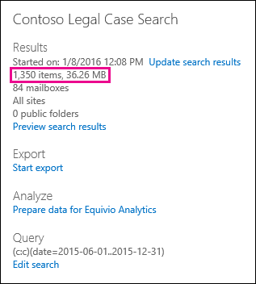

# Unterschiede zwischen geschätzten und tatsächlichen eDiscovery-Suchergebnissen in Office 365

Dieses Thema bezieht sich auf Suchvorgänge, die Sie mit einem der folgenden Microsoft eDiscovery-Tools ausführen können: 

- Inhaltssuche im Security & Compliance Center     
- In-Place eDiscovery im Exchange Admin Center (EAC)     
- Das eDiscovery Center in SharePoint Online    
   
Wenn Sie eine eDiscovery-Suche ausführen, gibt das von Ihnen verwendete Tool eine Schätzung der Anzahl der Elemente (und deren Gesamtgröße) zurück, die den Suchkriterien entsprechen. Wenn Sie beispielsweise eine Suche im Security & Compliance Center ausführen, werden die geschätzten Suchergebnisse im Detailbereich für die ausgewählte Suche angezeigt.
  

  
Dabei handelt es sich um die gleiche Schätzung der Gesamtgröße und Anzahl der Elemente, die im eDiscovery-Export Tool angezeigt werden, wenn Sie Ergebnisse auf einen lokalen Computer exportieren und im Zusammenfassungsbericht exportieren, der mit den Suchergebnissen heruntergeladen wird.
  
**Geschätzte Ergebnisse im eDiscovery-Export Tool**

  
**Geschätzte Ergebnisse in Export Zusammenfassungsbericht**

  
Wie Sie jedoch im vorherigen Screenshot des Zusammenfassungsberichts für den Export feststellen, unterscheiden sich die Größe und die Anzahl der tatsächlichen Suchergebnisse, die tatsächlich heruntergeladen werden, von der Größe und der Anzahl der geschätzten Suchergebnisse. 
  

  
Hier sind einige Gründe für diese Unterschiede:
  
- **Die Art und Weise, wie Ergebnisse geschätzt werden** – eine Schätzung der Suchergebnisse ist nur eine Schätzung (und keine tatsächliche Anzahl) der Elemente, die den Suchabfrage Kriterien entsprechen. Um die Schätzung von Exchange-Elementen zu kompilieren, wird eine Liste der Nachrichten-IDs, die den Suchkriterien entsprechen, aus der Exchange-Datenbank über das eDiscovery-Tool angefordert, das Sie verwenden. Wenn Sie jedoch die Suchergebnisse exportieren, wird die Suche erneut ausgeführt, und die tatsächlichen Nachrichten werden aus der Exchange-Datenbank abgerufen. Daher können diese Unterschiede dadurch entstehen, dass die geschätzte Anzahl von Elementen und die tatsächliche Anzahl von Elementen bestimmt werden. 
    
- **Änderungen zwischen dem Zeitpunkt der Schätzung und dem Export von Suchergebnissen** : Wenn Sie Suchergebnisse exportieren, wird die Suche erneut gestartet, um die neuesten Elemente im Suchindex zu sammeln, die den Suchkriterien entsprechen. Es ist möglich, dass zusätzliche Elemente erstellt, gesendet oder empfangen wurden, die den Suchkriterien in der Zeit entsprechen, in der die geschätzten Suchergebnisse gesammelt wurden und wenn die Suchergebnisse exportiert wurden. Es ist auch möglich, dass Elemente, die im Suchindex waren, als die Suchergebnisse geschätzt wurden, nicht mehr vorhanden sind, da Sie vom Inhaltsspeicherort gelöscht wurden, bevor die Suchergebnisse exportiert wurden. Eine Möglichkeit, dieses Problem zu beheben, besteht darin, einen Datumsbereich für eine eDiscovery-Suche anzugeben. Eine andere Möglichkeit besteht darin, inhaltsspeicherorte so zu speichern, dass Elemente beibehalten werden und nicht gelöscht werden können. 
    
- Nicht **indizierte Elemente** -Elemente, die für die Suche nicht indiziert sind, können Unterschiede zwischen geschätzten und tatsächlichen Suchergebnissen verursachen. In-Place eDiscovery in Exchange und im eDiscovery Center in SharePoint sind beispielsweise keine nicht indizierten Elemente (die nicht den Suchkriterien entsprechen) beim Ausführen einer Suche, um die Suchergebnisse zu schätzen. Sie können jedoch nicht indizierte Elemente einbeziehen, wenn Sie die Suchergebnisse exportieren. Wenn Sie beim Exportieren von Suchergebnissen nicht indizierte Elemente einbeziehen, werden möglicherweise weitere Elemente exportiert. Dies führt zu einem Unterschied zwischen den geschätzten und den exportierten Suchergebnissen. 
    
    Wenn Sie das Tool für die Inhaltssuche im Security & Compliance Center verwenden, haben Sie die Möglichkeit, nicht indizierte Elemente in die Such Schätzung einzubeziehen. Die Anzahl der nicht indizierten Elemente, die von der Suche zurückgegeben werden, wird im Detailbereich zusammen mit den anderen geschätzten Suchergebnissen aufgeführt. Alle nicht indizierten Elemente würden ebenfalls in die Gesamtgröße der geschätzten Suchergebnisse eingeschlossen. Wenn Sie Suchergebnisse exportieren, haben Sie die Möglichkeit, nicht indizierte Elemente einzubeziehen oder nicht einzubeziehen. Die Konfiguration dieser Optionen kann zu Unterschieden zwischen geschätzten und tatsächlichen Suchergebnissen führen, die heruntergeladen werden. 
    
- **Exportieren der Ergebnisse einer Inhaltssuche, die alle inhaltsspeicherorte enthält** – wenn die Suche, aus der Sie Ergebnisse exportieren, eine Suche nach allen Inhaltsspeicherorten in Ihrer Organisation war, werden nur die nicht indizierten Elemente aus Inhaltsspeicherorten angezeigt, die Elemente, die den Suchkriterien entsprechen, werden exportiert. In other words, if no search results are found in a mailbox or site, then any unindexed items in that mailbox or site won't be exported. Nicht indizierte Elemente aller inhaltsspeicherorte (auch solche, die keine Elemente enthalten, die mit der Suchabfrage übereinstimmen) werden in die geschätzten Suchergebnisse eingeschlossen. 
    
    Wenn die Suche, von der aus Sie Ergebnisse exportieren, auch aus bestimmten Inhaltsspeicherorten stammt, werden nicht indizierte Elemente (die nicht durch die Suchkriterien ausgeschlossen werden) aus allen in der Suche angegebenen Inhaltsspeicherorten exportiert. In diesem Fall sollte die geschätzte Anzahl der nicht indizierten Elemente und die Anzahl der nicht indizierten Elemente, die tatsächlich exportiert werden, identisch sein.
    
    Der Grund für das Exportieren nicht indizierter Elemente von jedem Speicherort in der Organisation liegt darin, dass die Wahrscheinlichkeit von Exportfehlern erhöht und die Zeit für das Exportieren und Herunterladen der Suchergebnisse erhöht werden kann.
    
- **RAW-Dateiformate im Vergleich zu exportierten Dateiformaten** – für Exchange-Elemente wird die geschätzte Größe der Suchergebnisse mithilfe der unformatierten Exchange-Nachrichtengrößen berechnet. E-Mail-Nachrichten werden jedoch in einer PST-Datei oder als einzelne Nachrichten exportiert (die als EML-Dateien formatiert sind). Beide Exportoptionen verwenden ein anderes Dateiformat als RAW-Nachrichten, was dazu führt, dass die Gesamtzahl der exportierten Dateien sich von der geschätzten Dateigröße unterscheidet. 
    
- **Dokumentversionen** – für SharePoint-Dokumente sind mehrere Versionen eines Dokuments nicht in den geschätzten Suchergebnissen enthalten. Sie haben jedoch die Möglichkeit, beim Exportieren der Suchergebnisse alle Dokumentversionen einzuschließen, wodurch die tatsächliche Anzahl (und Gesamtgröße) der exportierten Dokumente erhöht wird. 
    
- **** Deduplizierungs-für Exchange-Elemente reduziert Deduplizierung die Anzahl der exportierten Elemente. Sie haben die Möglichkeit, die Suchergebnisse zu duplizieren, wenn Sie Sie exportieren. Bei Exchange-Nachrichten bedeutet dies, dass nur eine einzelne Instanz einer Nachricht exportiert wird, obwohl diese Nachricht in mehreren Postfächern gefunden werden kann. Die geschätzten Suchergebnisse schließen alle Instanzen einer Nachricht ein. Wenn Sie also beim Exportieren von Suchergebnissen die Option Deduplizierung auswählen, kann die tatsächliche Anzahl der exportierten Elemente deutlich niedriger sein als die geschätzte Anzahl von Elementen. 
    
    Wenn Sie die Option Deduplizierung auswählen, sollten Sie auch Bedenken, dass alle Exchange-Elemente in einer einzelnen PST-Datei exportiert werden und die Ordnerstruktur aus den Quellpostfächern nicht erhalten bleibt. Die exportierte PST-Datei enthält nur die e-Mail-Elemente. Ein Suchergebnisbericht enthält jedoch einen Eintrag für jede exportierte Nachricht, die das Quellpostfach identifiziert, in dem sich die Nachricht befindet. Auf diese Weise können Sie alle Postfächer identifizieren, die eine doppelte Nachricht enthalten. Wenn Sie Deduplizierung nicht aktivieren, wird für jedes durchsuchte Postfach eine separate PST-Datei exportiert. 
    
## Exportieren von nicht indizierten Elementen aus dem eDiscovery Center in SharePoint Online

Im eDiscovery Center in SharePoint Online haben Sie die Möglichkeit, beim Exportieren der Ergebnisse einer eDiscovery-Suche nicht indizierte Inhalte (aus Exchange und SharePoint) einzuschließen. Wählen Sie dazu die Option **Elemente einbeziehen, die verschlüsselt sind oder eine nicht erkannte Formatierung aufweisen** aus. Nicht indizierte Elemente (auch als nicht crawlbar in SharePoint bezeichnet) sind Elemente in Exchange und SharePoint, die aus irgendeinem Grund nicht für die Suche indiziert wurden. Nicht indizierte Exchange-Elemente werden im Exchange- **Indexfehler** Bericht aufgeführt, der beim Exportieren von Suchergebnissen enthalten ist. Entsprechend werden nicht indizierte SharePoint-Elemente im **SharePoint-Indexfehler** Bericht aufgeführt. Wenn Sie nicht indizierte Elemente exportieren, werden Sie in einen Ordner mit dem Namen ****"uncrawlable" heruntergeladen. Nicht indizierte Exchange-Elemente sind in einer PST-Datei enthalten; jedes nicht indizierte Dokument aus SharePoint wird ebenfalls heruntergeladen. Die Anzahl der nicht indizierten Elemente (sofern vorhanden) sind in jedem Indexfehler Bericht aufgeführt. Die Anzahl der nicht indizierten Elemente in den Berichten sollte mit der Anzahl der nicht indizierten Elemente übereinstimmen, die heruntergeladen werden. 
  
 **Was sind einige Gründe, wenn die Anzahl der exportierten nicht indizierten Elemente nicht mit der Anzahl der Elemente im Indexfehler Bericht übereinstimmt?** Wie bereits erläutert, ist es möglich, dass Elemente zwischen dem Zeitpunkt, zu dem die Such Schätzung ausgeführt wurde, und dem Zeitpunkt, zu dem die Suchergebnisse exportiert wurden, aus Office 365 gelöscht wurden. Eine ähnliche Diskrepanz kann für nicht indizierte Elemente auftreten. Beispielsweise kann der Suchindex veraltet sein, wenn Suchergebnisse exportiert werden. Dies würde bedeuten, dass ein nicht indiziertes Element, das mit den Suchergebnissen exportiert wurde, möglicherweise nicht im Indexfehler Bericht aufgeführt wird, da das Element beim Exportieren der Suchergebnisse nicht indiziert wurde. Dies würde dazu führen, dass mehr nicht indizierte Elemente exportiert werden, als im Index-Fehlerbericht aufgeführt sind. Entsprechend könnte ein nicht indiziertes Element, das im Indexfehler Bericht aufgeführt ist, aus Office 365 gelöscht worden sein, bevor der Suchindex aktualisiert wurde. Dies würde dazu führen, dass weniger nicht indizierte Elemente exportiert werden, als im Indexfehler Bericht aufgeführt sind. 
  
> [!NOTE]
> Wenn Sie beim Exportieren von Suchergebnissen oder beim Herunterladen der Berichte nicht die Option **Elemente einbeziehen, die verschlüsselt sind oder eine unbekannte Formatvorlage aufweisen** ausgewählt haben, werden die Indexfehler Berichte heruntergeladen, aber Sie haben keine Einträge. Dies bedeutet nicht, dass es keine Indizierungsfehler gibt. Dies führt lediglich dazu, dass nicht indizierte Elemente nicht im Export enthalten waren. 
  

