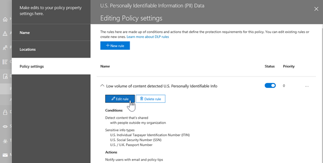

# Verhinderung von Datenverlust und Microsoft Teams

> [!NOTE]
> Die Funktionen zur Verhinderung von Datenverlust wurden kürzlich Microsoft Teams in Office 365 E5 und Office 365 Advanced Compliance hinzugefügt. Weitere Informationen zur Verfügbarkeit von Features finden Sie unter [Office 365 Service descriptions: Office 365 Security #a0 Compliance Center](https://docs.microsoft.com/office365/servicedescriptions/office-365-platform-service-description/office-365-securitycompliance-center).

## Übersicht über DLP für Microsoft Teams

Vor kurzem wurden die Funktionen zur Verhinderung von [Datenverlust (Data Loss Prevention](data-loss-prevention-policies.md) , DLP) erweitert und umfassen Microsoft Teams. Wenn Ihre Organisation über DLP verfügt, können Sie jetzt Richtlinien definieren, die verhindern, dass Personen vertrauliche Informationen in einem Microsoft Teams-Kanal oder in einer Chatsitzung freigeben. Im folgenden finden Sie einige Beispiele für die Funktionsweise dieses Schutzes:

- **Beispiel 1: Schützen vertraulicher Informationen in Nachrichten**. Angenommen, jemand versucht, vertrauliche Informationen in einem Microsoft Teams-Chat oder-Kanal mit Gästen (externe Benutzer) freizugeben. Wenn Sie eine DLP-Richtlinie definiert haben, um dies zu verhindern, werden Nachrichten mit vertraulichen Informationen, die an externe Benutzer gesendet werden, gelöscht. Dies geschieht automatisch und innerhalb von Sekunden, je nachdem, wie ihre DLP-Richtlinie konfiguriert ist.

    > [!NOTE]
    > DLP für Microsoft Teams blockiert vertrauliche Inhalte, wenn Sie für Benutzer freigegeben werden, die über [Gastzugriff](https://docs.microsoft.com/MicrosoftTeams/guest-access) in Teams und Kanälen verfügen, sowie mit Benutzern mit [externem Zugriff](https://docs.microsoft.com/MicrosoftTeams/manage-external-access) in Besprechungen und Chatsitzungen. Wenn Sie [Microsoft Teams zusammen mit Skype for Business](https://docs.microsoft.com/microsoftteams/migration-interop-guidance-for-teams-with-skype)verwenden, denken Sie daran, dass DLP for Teams Nachrichten in Interop-oder Federated-Chatsitzungen nicht blockiert.

- **Beispiel 2: Schützen vertraulicher Informationen in Dokumenten**. Angenommen, jemand versucht, ein Dokument für Gäste in einem Microsoft Teams-Kanal oder Chat freizugeben, und das Dokument enthält vertrauliche Informationen. Wenn Sie eine DLP-Richtlinie definiert haben, um dies zu verhindern, wird das Dokument nicht für diese Benutzer geöffnet. Beachten Sie, dass in diesem Fall SharePoint und OneDrive in ihrer DLP-Richtlinie enthalten sein müssen, damit der Schutz vorhanden ist. (Dies ist ein Beispiel für DLP für SharePoint, das in Microsoft Teams angezeigt wird.)

## Richtlinien Tipps helfen Benutzern bei der Schulung

Ähnlich wie DLP in [Exchange, Outlook und Outlook im Internet](data-loss-prevention-policies.md#policy-evaluation-in-exchange-online-outlook-and-outlook-on-the-web), [SharePoint-und OneDrive für Unternehmen-Websites](data-loss-prevention-policies.md#policy-evaluation-in-onedrive-for-business-and-sharepoint-online-sites)und Office- [Desktop Clients](data-loss-prevention-policies.md#policy-evaluation-in-the-office-desktop-programs)funktioniert, werden Richtlinien Tipps angezeigt, wenn eine Aktion mit einer DLP-Richtlinie in Konflikt steht. Im folgenden finden Sie ein Beispiel für einen richtlinientipp:

In diesem Fall hat der Absender versucht, eine Sozialversicherungsnummer in einem Microsoft Teams-Kanal freizugeben. Der Link **Was kann ich tun?** öffnet ein Dialogfeld, in dem Optionen für den Absender zum Beheben des Problems bereitgestellt werden. Beachten Sie, dass der Absender in diesem Fall entscheiden kann, die Richtlinie außer Kraft zu setzen oder einen Administrator zu benachrichtigen, um ihn zu überprüfen und zu beheben.

In Ihrer Organisation können Sie auswählen, ob Benutzern das außer Kraft setzen einer DLP-Richtlinie gestattet werden soll. Wenn Sie Ihre DLP-Richtlinien konfigurieren, können Sie die Standardrichtlinien Tipps verwenden oder [Richtlinien Tipps](#to-customize-policy-tips) für Ihre Organisation anpassen. 

Zurück zu unserem Beispiel, in dem ein Absender eine Sozialversicherungsnummer in einem Teams-Kanal freigegeben hat, sehen Sie hier, was der Empfänger gesehen hat:

Der Link " **Was ist das?** " öffnet einen [Artikel](data-loss-prevention-policies.md) über DLP-Richtlinien, der erklärt, warum die Nachricht blockiert wurde.

### So passen Sie Richtlinien Tipps an

Um diese Aufgabe ausführen zu können, muss Ihnen eine Rolle zugewiesen sein, die über Berechtigungen zum Bearbeiten von DLP-Richtlinien verfügt. Weitere Informationen hierzu finden Sie unter [Berechtigungen](data-loss-prevention-policies.md#permissions).

1. Wechseln Sie zum Office 365 Security #a0 Compliance Center ([https://protection.office.com](https://protection.office.com)), und melden Sie sich an.

2. Wählen Sie > **Richtlinie**zur Verhinderung von **Datenverlust**aus. 

3. Wählen Sie eine Richtlinie aus, und wählen Sie neben **Richtlinieneinstellungen**die Option **Bearbeiten**aus.

4. Erstellen Sie entweder eine neue Regel, oder bearbeiten Sie eine vorhandene Regel für die Richtlinie.  

5. Wählen Sie auf der Registerkarte **Benutzer Benachrichtigungen** die Option **e-Mail-Text anpassen** und/oder **die Textoptionen richtlinientipp anpassen** aus.    

6. Geben Sie den Text an, der für e-Mail-Benachrichtigungen und/oder Richtlinien Tipps verwendet werden soll, und klicken Sie dann auf **Speichern**. 

7. Wählen Sie auf der Registerkarte **Richtlinieneinstellungen** die Option **Speichern**aus.

Lassen Sie ungefähr eine Stunde zu, bis sich Ihre Änderungen durch Ihr Rechenzentrum durchlaufen und mit Benutzerkonten synchronisiert werden.
 
## Hinzufügen von Microsoft Teams als Standort zu vorhandenen DLP-Richtlinien

Um diese Aufgabe ausführen zu können, muss Ihnen eine Rolle zugewiesen sein, die über Berechtigungen zum Bearbeiten von DLP-Richtlinien verfügt. Weitere Informationen hierzu finden Sie unter [Berechtigungen](data-loss-prevention-policies.md#permissions).

1. Wechseln Sie zum Office 365 Security #a0 Compliance Center ([https://protection.office.com](https://protection.office.com)), und melden Sie sich an.

2. Wählen Sie > **Richtlinie**zur Verhinderung von **Datenverlust**aus. 

3. Wählen Sie eine Richtlinie aus, und sehen Sie sich die Werte unter **Standorte**an. Wenn Sie Microsoft **Teams-Chat und Kanal Nachrichten**sehen, sind Sie alle festgelegt. Klicken Sie andernfalls auf **Bearbeiten**.  

4. Aktivieren Sie in der Spalte **Status** die Richtlinie für Microsoft **Teams-Chat und Kanal Nachrichten**.  

5. Behalten Sie die Standardeinstellungen aller Konten bei, oder geben Sie an, welche Konten einbezogen oder ausgeschlossen werden sollen.

6. Klicken Sie auf **Speichern**.

Lassen Sie ungefähr eine Stunde zu, bis sich Ihre Änderungen durch Ihr Rechenzentrum durchlaufen und mit Benutzerkonten synchronisiert werden.

## Definieren einer neuen DLP-Richtlinie für Microsoft Teams

Um diese Aufgabe ausführen zu können, muss Ihnen eine Rolle zugewiesen sein, die über Berechtigungen zum Bearbeiten von DLP-Richtlinien verfügt. Weitere Informationen hierzu finden Sie unter [Berechtigungen](data-loss-prevention-policies.md#permissions).

1. Wechseln Sie zum Office 365 Security #a0 Compliance Center ([https://protection.office.com](https://protection.office.com)), und melden Sie sich an.

2. Wählen Sie **Datenverlust** > -Verhinderung-**Richtlinie** > **+ Richtlinie erstellen**. 

3. Wählen Sie eine [Vorlage](data-loss-prevention-policies.md#dlp-policy-templates)aus, und klicken Sie dann auf **weiter**. In unserem Beispiel haben wir die Datenvorlage "U.S. persönlich identifizierbare Informationen" ausgewählt.  

4. Geben Sie auf der Registerkarte **Name Ihrer Richtlinie** einen Namen und eine Beschreibung für die Richtlinie ein, und klicken Sie dann auf **weiter**. 

5. Behalten Sie auf der Registerkarte **Speicherorte** die Standardeinstellung alle Speicherorte bei, oder wählen Sie die Option **bestimmte Speicherorte**auswählen aus, und klicken Sie dann auf **weiter**. Wenn Sie bestimmte Standorte ausgewählt haben, wählen Sie die Speicherorte für ihre DLP-Richtlinie aus, und klicken Sie dann auf **weiter**.  
    > [!NOTE]
    > Wenn Sie sicherstellen möchten, dass Dokumente, die vertrauliche Informationen enthalten, nicht ungeeignet freigegeben werden, stellen Sie sicher, dass **SharePoint-Websites** und **OneDrive-Konten** zusammen mit Microsoft **Teams-Chat und Kanal Nachrichten**aktiviert sind.
 

6. Behalten Sie auf der Registerkarte **Richtlinieneinstellungen** unter **Anpassen des Inhaltstyps, den Sie schützen möchten**, die standardmäßigen einfachen Einstellungen bei, oder wählen Sie **Erweiterte Einstellungen verwenden**aus, und klicken Sie dann auf **weiter**. Wenn Sie erweiterte Einstellungen auswählen, können Sie Regeln für Ihre Richtlinie erstellen oder bearbeiten. (Informationen dazu finden Sie unter [einfache Einstellungen im Vergleich zu erweiterten Einstellungen](data-loss-prevention-policies.md#simple-settings-vs-advanced-settings).)

7.  Überprüfen Sie auf der Registerkarte **Richtlinieneinstellungen** unter **Was möchten Sie tun, wenn vertrauliche Informationen erkannt werden?** die Einstellungen. (Hier können Sie auswählen, ob Standard [Richtlinien Tipps und e-Mail-Benachrichtigungen](use-notifications-and-policy-tips.md)beibehalten oder angepasst werden sollen.)  Wenn Sie die Überprüfung oder Bearbeitung von Einstellungen abgeschlossen haben, wählen Sie **weiter**aus.

8. Wählen Sie auf der Registerkarte **Richtlinieneinstellungen** unter soll **die Richtlinie aktiviert oder zuerst getestet werden?** aus, ob die Richtlinie aktiviert, [zuerst getestet](data-loss-prevention-policies.md#roll-out-dlp-policies-gradually-with-test-mode)oder für jetzt deaktiviert werden soll, und wählen Sie dann **weiter**aus.  

9. Überprüfen Sie auf der Registerkarte **Einstellungen überprüfen** die Einstellungen für die neue Richtlinie. Wählen Sie **Bearbeiten** aus, um Änderungen vorzunehmen. Wenn Sie fertig sind, wählen Sie **Erstellen**aus. 

Lassen Sie die neue Richtlinie ungefähr eine Stunde lang durch Ihr Rechenzentrum arbeiten und mit Benutzerkonten synchronisieren.

## Verwandte Artikel

[Erstellen, Testen und Optimieren einer DLP-Richtlinie](create-test-tune-dlp-policy.md)

[Senden von E-Mail-Benachrichtigungen und Anzeigen von Richtlinientipps für DLP-Richtlinien](use-notifications-and-policy-tips.md)
