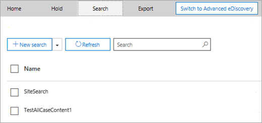

# <a name="ediscovery-cases-in-the-office-365-security-amp-compliance-center"></a>eDiscovery-Fälle in die Office 365-Sicherheit &amp; Compliance Center

Sie können die eDiscovery-Fälle verwenden, in die Office 365-Sicherheit &amp; Compliance Center steuern, wer erstellen, Zugriff und eDiscovery-Fälle in Ihrer Organisation verwalten können. Wenn Ihre Organisation ein E5 für Office 365-Abonnement umfasst, können Sie auch eDiscovery-Fälle zum Analysieren von Suchergebnissen mithilfe von Office 365 erweiterte eDiscovery verwenden.
  
EDiscovery-Fall können Sie zum Hinzufügen von Mitgliedern zu einer Anfrage, die steuern, welche Arten von Aktionen, dass bestimmte Groß-/Kleinschreibung Mitglieder durchführen, platzieren Sie einen Haltestatus auf Speicherorte für Inhalte in eine rechtliche Anfrage relevant und ordnen Sie einen einzelnen Case mehrere Inhalten suchen können. Sie können auch Exportieren der Suchergebnisse in Content, die eine Anfrage zugeordnet ist oder Vorbereiten von Suchergebnissen für die Analyse in erweiterten eDiscovery. eDiscovery-Fälle sind eine empfehlenswerte Methode zum einschränken, wer Zugriff auf Content-Suche und die Suchergebnisse für eine bestimmte rechtliche Anfrage in Ihrer Organisation hat.
  
Verwenden Sie den folgenden Workflow zum Einrichten und Verwenden von eDiscovery-Fälle in das Wertpapier &amp; eDiscovery Compliance Center und erweitert.

[Schritt 1: Zuweisen von eDiscovery-Berechtigungen zu potenziellen Fallmitgliedern](#step-1-assign-ediscovery-permissions-to-potential-case-members)

[Schritt 2: Erstellen einer neuen Anfrage](#step-2-create-a-new-case)

[Schritt 3: Hinzufügen von Mitgliedern zu einer Anfrage](#step-3-add-members-to-a-case)

[Schritt 4: Platzieren Speicherorte für Inhalte auf](#step-4-place-content-locations-on-hold)

[Schritt 5: Erstellen Sie und führen Sie einer eine Anfrage zugeordnete Inhaltssuche aus](#step-5-create-and-run-a-content-search-associated-with-a-case)

[Schritt 6: Exportieren Sie die Ergebnisse einer Inhaltssuche eine Anfrage zugeordnete](#step-6-export-the-results-of-a-content-search-associated-with-a-case)

[Schritt 7: Vorbereiten der Suchergebnisse für erweiterte eDiscovery](#step-7-prepare-search-results-for-advanced-ediscovery)

[Schritt 8: Wechseln Sie zu der erweiterten eDiscovery-Fall](#step-8-go-to-the-case-in-advanced-ediscovery)

[(Optional) Schritt 9: Schließen Sie eine Anfrage](#optional-step-9-close-a-case)

[(Optional) Schritt 10: Eine geschlossene Anfrage erneut öffnen](#optional-step-10-re-open-a-closed-case)

[Weitere Informationen](#more-information)
  
## <a name="step-1-assign-ediscovery-permissions-to-potential-case-members"></a>Schritt 1: Zuweisen von eDiscovery-Berechtigungen zu potenziellen Fallmitgliedern

Der erste Schritt besteht die entsprechenden Berechtigungen eDiscovery-bezogene an Personen zuweisen, damit Sie sie zu einem eDiscovery-Fall in Schritt2 hinzufügen können. Sie müssen ein Mitglied der Rollengruppe "Organisationsverwaltung" (oder die Verwaltungsrolle Rolle zugewiesen werden) in die Office 365-Sicherheit &amp; Compliance Center, eDiscovery-Berechtigungen zuzuweisen. Die folgende Liste beschreibt die eDiscovery-bezogene Rollengruppen in das Wertpapier &amp; Compliance Center. 
  
- **Reviewer** - dieser Rollengruppe hat die restriktivsten eDiscovery-bezogene Berechtigungen. Der primäre Zweck der dieser Rollengruppe wird zum Anzeigen und Zugriff Mitglieder können Daten in Office 365 erweiterte eDiscovery case. Mitglieder dieser Gruppe können nur finden und öffnen Sie die Liste der auf der Seite **eDiscovery** -Fälle in das Wertpapier &amp; Compliance Center, die sie Mitglieder sind. Nachdem der Benutzer eine Anfrage in den & Security Compliance Center zugreift, kann er **Schalter, mit dem erweiterten eDiscovery** Zugriff und zum Analysieren der Groß-/Kleinschreibung Daten in erweiterten eDiscovery klicken. Hinzufügen von Mitgliedern zu einer Anfrage Fällen erstellt werden kann, Erstellen von Haltestatus, Suchvorgänge erstellen, eine Vorschau der Suchergebnisse, Exportieren von Suchergebnissen oder Ergebnisse für erweiterte eDiscovery vorbereiten. 
    
- **eDiscovery-Manager** - Mitglieder dieser Rollengruppe können erstellen und Verwalten von eDiscovery-Fällen. Sie können hinzufügen und Entfernen von Mitgliedern, platzieren Sie Inhalte Speicherorte auf halten, erstellen und bearbeiten eine Anfrage zugeordnete Inhalte durchsucht, exportieren Sie die Ergebnisse einer Suche Inhalte und Vorbereiten von Suchergebnissen für die Analyse in erweiterten eDiscovery. Es gibt zwei Untergruppen in dieser Rollengruppe. Der Unterschied zwischen diesen Untergruppen basiert auf Bereich.
    
  - **eDiscovery-Manager** - anzeigen und verwalten sie erstellen oder ein Mitglied der eDiscovery-Fälle. Eine andere eDiscovery-Manager erstellt eine Anfrage, jedoch keine zweite eDiscovery-Manager als Mitglied in diesem Fall hinzufügen, die zweite eDiscovery-Manager nicht möglich, anzeigen oder öffnen die Groß-/Kleinschreibung auf der Seite **eDiscovery** in das Wertpapier &amp; Compliance Center. eDiscovery-Manager kann auch ihre Fällen in erweiterten eDiscovery Analysis Aufgaben zugreifen. 
    
  - **eDiscovery-Administrator** - können eine eDiscovery-Manager tun kann alle Groß-/Kleinschreibung Verwaltungsaufgaben ausführen. Darüber hinaus können eine eDiscovery-Administrator:
    
    - Anzeigen aller Fälle, die auf der Seite **eDiscovery-Fälle** aufgeführt sind. 
    
    - Verwalten Sie jedem Fall in der Organisation, nachdem sie sich als Mitglied der Groß-/Kleinschreibung hinzufügen.
    
    - Groß-/Kleinschreibung Zugriff auf Daten in erweiterten eDiscovery für alle Fall in der Organisation.
    
    Überlegungen dazu, warum Sie ggf. einen eDiscovery-Administrator in Ihrer Organisation benötigen, finden Sie im Abschnitt [More information](#more-information). 
    
> [!IMPORTANT]
> Wenn eine Person kein Mitglied einer dieser eDiscovery-bezogene Rollengruppen ist oder ist kein Mitglied einer Rollengruppe, die die Prüfer-Rolle zugewiesen hat, können nicht Sie sie als Mitglied einer eDiscovery-Fall hinzufügen. 

Weitere Informationen zu eDiscovery-Berechtigungen finden Sie unter [Zuweisen von eDiscovery-Berechtigungen in der Office 365-Sicherheit &amp; Compliance Center](assign-ediscovery-permissions.md).
  
 **So weisen Sie eDiscovery-Berechtigungen zu**
  
1. Wechseln Sie zu [https://protection.office.com](https://protection.office.com).
    
2. Melden Sie sich bei Office 365 mit Ihrem Geschäfts-, Schul- oder Unikonto an.
    
3. In das Wertpapier &amp; Compliance Center, klicken Sie auf **Berechtigungen**, und führen Sie dann eine der folgenden basierend auf den eDiscovery-Berechtigungen, die Sie zuweisen möchten.
    
    - Leseberechtigungen zuweisen, indem Sie wählen Sie aus der Rollengruppe " **Reviewer** ", und klicken Sie neben **Mitglieder**, klicken Sie dann auf **Bearbeiten**. Klicken Sie auf **Elemente auswählen**, klicken Sie auf **Bearbeiten**, klicken Sie auf  **Hinzufügen**, wählen Sie den Benutzer, die Sie an der Rollengruppe Reviewer hinzufügen möchten, und klicken Sie dann auf **Hinzufügen**.
    
    - EDiscovery-Manager-Berechtigungen zuweisen, indem Sie wählen Sie aus der Rollengruppe **eDiscovery-Manager** , und klicken Sie neben **eDiscovery-Manager**, klicken Sie dann auf **Bearbeiten**. Klicken Sie auf **auswählen, eDiscovery-Manager**, klicken Sie auf **Bearbeiten**, klicken Sie auf  ** hinzufügen **, wählen Sie den Benutzer, die Sie als ein eDiscovery-Manager hinzufügen möchten, und klicken Sie dann auf **Hinzufügen**.
    
    - EDiscovery-Administratorberechtigungen zuweisen, indem Sie wählen Sie aus der Rollengruppe **eDiscovery-Manager** , und klicken Sie neben **eDiscovery-Administrator**, klicken Sie dann auf **Bearbeiten**. Klicken Sie auf **Choose eDiscovery-Administrator**, klicken Sie auf **Bearbeiten**, klicken Sie auf  **Hinzufügen**, wählen Sie den Benutzer, die Sie als einer eDiscovery-Administrator hinzufügen möchten, und klicken Sie dann auf **Hinzufügen**.
    
4. Nachdem Sie alle Benutzer hinzugefügt haben, klicken Sie auf **Fertig**, klicken Sie auf **Speichern** , um die Änderungen an der Rollengruppe zu speichern, und klicken Sie dann auf **Schließen**.

## <a name="step-2-create-a-new-case"></a>Schritt 2: Erstellen einer neuen Anfrage

Im nächste Schritt ist erstellen Sie einen neue eDiscovery-Fall. Sie müssen ein Mitglied der Rollengruppe eDiscovery-Manager zum Erstellen von eDiscovery-Fälle sein. Wie bereits erläutert, nach dem Erstellen eines neuen Vorgangs in das Wertpapier &amp; Compliance Center, Sie (und Mitgliedern der Groß-/Kleinschreibung) sein, dass dieselbe Groß-/Kleinschreibung im erweiterten eDiscovery, wenn Sie die Organisation sind ein Abonnement von Office 365 E5 hat zugreifen können.
  
1. Wechseln Sie zu [https://protection.office.com](https://protection.office.com).
    
2. Melden Sie sich bei Office 365 mit Ihrem Geschäfts-, Schul- oder Unikonto an.
    
3. In das Wertpapier &amp; Compliance Center, klicken Sie auf **Suche &amp; Untersuchung** \> **eDiscovery**, und klicken Sie dann auf  **Erstellen einer Anfrage**.
    
4. Benennen Sie auf der Seite **Neue Anfrage** der Groß-/Kleinschreibung, geben Sie eine optionale Beschreibung ein, und klicken Sie dann auf **Speichern**. Beachten Sie, dass die Groß-/Kleinschreibung Name in Ihrer Organisation eindeutig sein muss.
    
    
  
    Die neue Groß-/Kleinschreibung wird in der Liste der Anfragen auf der Seite **eDiscovery** angezeigt. Beachten Sie, dass Sie den Cursor über einen Groß-/Kleinschreibung Namen zum Anzeigen von Informationen über die Groß-/Kleinschreibung, einschließlich des Status der Anfrage ( **aktiv** oder **geschlossen**), bewegen können die Beschreibung der die Groß-/Kleinschreibung (die im vorherigen Schritt erstellt wurde), und wenn die Groß-/Kleinschreibung zuletzt geändert wurde und Wer es geändert.
    
    > [!TIP]
    > Nachdem Sie einen neuen Vorgang erstellen, können Sie sie jederzeit umbenennen. Klicken Sie einfach auf den Namen der Anfrage auf der Seite **eDiscovery** . Klicken Sie auf der Seite flyoutmenü **Verwalten in diesem Fall** ändern Sie den Namen in das Feld unter **Name**angezeigt, und speichern Sie die Änderung. 
  
## <a name="step-3-add-members-to-a-case"></a>Schritt 3: Hinzufügen von Mitgliedern zu einer Anfrage

Nachdem Sie eine neue Anfrage erstellt haben, besteht der nächste Schritt, um die Groß-/Kleinschreibung Mitglieder hinzuzufügen. Wie vorherige erläutert, nur Benutzer, die Mitglieder des Bearbeiters sind oder eDiscovery-Manager Rollengruppen können als Mitglieder der Anfrage hinzugefügt werden. Beachten Sie, dass die eDiscovery-Manager, die die Groß-/Kleinschreibung erstellt automatisch als Mitglied hinzugefügt wird.
  
1. Klicken Sie im Security &amp; Compliance Center auf **Suche &amp; Untersuchung** \> **eDiscovery**, um die Liste der Fälle in Ihrem Unternehmen anzuzeigen. 
    
2. Klicken Sie auf den Namen der Anfrage, der Sie Mitglieder hinzufügen möchten.
    
    Seite flyoutmenü **Verwalten in diesem Fall** wird angezeigt. 
    
    
  
3. Klicken Sie unter **Manage Mitglieder**, klicken Sie auf  **Hinzufügen** , um die Groß-/Kleinschreibung Mitglieder hinzuzufügen. 
    
    Sie können auch die Groß-/Kleinschreibung eine Rollengruppe hinzufügen. Klicken Sie unter **Manage Rollengruppen**auf  **Hinzufügen**.
    
    > [!NOTE]
    > Rolle Gruppen steuern Sie, wer Mitglieder zu einem eDiscovery-Fall zuweisen kann. Dies bedeutet, dass Sie nur die Rollengruppen zuweisen können, die ein Mitglied einer Anfrage sind.
    
4. Klicken Sie in der Liste der Personen oder Rolle Gruppen, die als Mitglieder der Anfrage hinzugefügt werden können auf das Kontrollkästchen neben den Namen der Personen oder Rolle Gruppen, die Sie hinzufügen möchten.
    
    > [!TIP]
    > Wenn Sie haben eine umfangreiche Liste mit Personen, die Sie als Mitglieder hinzugefügt werden, verwenden Sie das Feld **Suchen** nach einer bestimmten Person in der Liste suchen. 
  
5. Nachdem Sie die Personen oder Rolle Gruppen als Mitglieder der Gruppe hinzufügen ausgewählt haben, klicken Sie auf **Hinzufügen**.
    
    Klicken Sie in **diesem Fall verwalten**auf **Speichern** , um die neue Liste der Groß-/Kleinschreibung Elemente zu speichern. 
    
6. Klicken Sie auf **Speichern** , um die neue Liste der Groß-/Kleinschreibung Elemente zu speichern. 
  
## <a name="step-4-place-content-locations-on-hold"></a>Schritt 4: Platzieren Speicherorte für Inhalte auf

EDiscovery-Fall können zum Erstellen von Haltestatus, um Inhalte zu erhalten, die für die Groß-/Kleinschreibung relevant sein könnten. Sie können einen Haltestatus auf Postfächer und OneDrive für Websites mit Geschäftsdaten von Personen tätigen, die in der Groß-/Kleinschreibung Verwalter sind. Sie können auch einen Haltestatus auf die Gruppe Postfach-, SharePoint-Website und OneDrive for Business-Site für eine Office 365-Gruppe platzieren. In ähnlicher Weise können Sie einen Haltestatus platzieren, auf das Postfach und die Website, die Microsoft-Teams zugeordnet sind. Wenn Sie die Speicherorte für Inhalte in der Warteschleife einleiten, wird Inhalt gespeichert, bis aus der Inhaltsspeicherort oder, bis Sie den Haltestatus löschen, entfernen den Haltestatus.

> [!NOTE]
> Nachdem Sie einen Inhaltsspeicherort in der Warteschleife platziert, dauert bis zu 24 Stunden für den Haltebereich wirksam wird. 
>   
Wenn Sie einen Haltestatus erstellen, müssen Sie die folgenden Optionen aus, um den Inhalt zu begrenzen, der in der angegebenen Speicherorte für Inhalte gehalten wird:
  
- Sie erstellen eine unendliche halten, in dem alle Inhalte in der Warteschleife platziert wird. Alternativ können Sie eine abfragebasierte Aufbewahrung erstellen, in dem nur auf Inhalte, die eine Suchabfrage entspricht in der Warteschleife platziert wird.
    
- Sie können angeben, einen Datumsbereich nur die Inhalte enthalten, die gesendet, empfangen oder innerhalb des Datumsbereichs erstellt wurde. Alternativ können Sie alle Inhalte unabhängig davon Wenn es gesendet, empfangen oder erstellt wurde, halten.
    
> [!NOTE]
> Sie können maximal 10.000 Richtlinien halten Sie über alle eDiscovery-Fälle in Ihrer Organisation haben. 
  
Zum Erstellen eines Haltestatus für einen eDiscovery-Fall:
  
1. Klicken Sie im Security &amp; Compliance Center auf **Suche &amp; Untersuchung** \> **eDiscovery**, um die Liste der Fälle in Ihrem Unternehmen anzuzeigen. 
    
2. Klicken Sie auf **Öffnen** neben der Groß-/Kleinschreibung, die Sie dem Haltestatus in erstellen möchten. 
    
3. Klicken Sie auf **der Homepage für den Fall** auf der Registerkarte **halten** . 
    
    
  
4. Klicken Sie auf der Seite **halten** auf  **Erstellen**.
    
5. Benennen Sie auf der Seite **Name der Warteschleife** dem Haltestatus. Der Name des Haltestatus muss in Ihrer Organisation eindeutig sein. 
    
    
  
6. (Optional) Fügen Sie in das Feld **Beschreibung** eine Beschreibung des Haltestatus hinzu. 
    
7. Klicken Sie auf **Weiter**.
    
8. Wählen Sie halten Sie die Speicherorte für Inhalte, denen Sie einfügen möchten. Sie können die Postfächer, Websites und Öffentliche Ordner in der Warteschleife platzieren.
    
    
  
   a: **Exchange-e-Mail** - klicken Sie auf **Wählen Sie Benutzer, Gruppen oder Teams** und klicken Sie dann auf **Wählen Sie Benutzer, Gruppen oder Teams** erneut. Postfächer in der Warteschleife platziert angeben. Verwenden Sie das Suchfeld, um die Benutzerpostfächer und Verteilergruppen (in einem Haltestatus auf die Postfächer von Gruppenmitgliedern platzieren) Hier finden Sie in der Warteschleife platziert. Sie können auch einen Haltestatus auf das zugeordnete Postfach für eine Office 365-Gruppe oder ein Team Microsoft platzieren. Wählen Sie die Benutzer, die Gruppe, die Kontrollkästchen Team, klicken Sie auf **auswählen**, und klicken Sie dann auf **Fertig**.
    
    > [!NOTE]
    > Wenn Sie **Wählen Sie Benutzer, Gruppen oder Teams** an Postfächer in die Warteschleife stellen klicken, wird das Postfach Auswahltool, das angezeigt wird leer. Dies ist entwurfsbedingt zur Verbesserung der Leistung. Wenn Sie Personen zu dieser Liste hinzufügen möchten, geben Sie einen Namen (mindestens 3 Zeichen) in das Suchfeld. 
  
   b. **SharePoint-Websites** - klicken Sie auf **Websites auswählen** und dann auf **Choose Websites** erneut aus, um anzugeben, dass SharePoint und OneDrive for Business-Websites auf halten. Geben Sie die URL für die einzelnen Standorte, die Sie in die Warteschleife stellen möchten. Sie können auch die URL für die SharePoint-Website für eine Office 365-Gruppe oder einem Microsoft-Team hinzufügen. Klicken Sie auf **auswählen**, und klicken Sie dann auf **Fertig**.
    
    Finden Sie [Weitere Informationen](#more-information) im Abschnitt Tipps zum Bereitstellen von Office 365-Gruppen und Microsoft-Teams, in der Warteschleife an. 
    
    > [!NOTE]
    > In seltenen Fällen einer Person für Benutzerprinzipalnamen (UPN) geändert wird wird die URL für ihr Konto OneDrive auch geändert werden, um den neuen UPN einzubinden. In diesem Fall müssen Sie den Haltestatus zu ändern, indem Sie neue OneDrive-URL des Benutzers hinzufügen und Entfernen von der alte Datenbankserver. 
  
   c. **Öffentliche Ordner von Exchange** - verschieben die Umschaltfläche  an der Position **Alle** , um alle öffentlichen Ordner in Ihrer Exchange Online-Organisation in der Warteschleife zu platzieren. Notiz, die Sie bestimmte Öffentliche Ordner zu hinzufügen auswählen können nicht halten. Lassen Sie die Umschaltfläche auf **keine** festgelegt, wenn Sie nicht, um einem Haltestatus für Öffentliche Ordner zu platzieren möchten.
    
9. Wenn Sie dem Haltestatus hinzufügen Inhaltsspeicherorte fertig sind, klicken Sie auf **Weiter**.
    
10. Führen Sie die folgenden Schritte aus, um eine abfragebasierte Aufbewahrung mit Bedingungen zu erstellen. Andernfalls, klicken Sie einfach auf **Weiter**
    
    
  
    
       a. unter im Feld **Stichwörter**eine Suchabfrage im Feld Typ, sodass nur die Inhalte, die die Suchkriterien erfüllt platziert wird halten. Sie können Schlüsselwörter, Nachrichteneigenschaften oder Dokumenteigenschaften, wie Dateinamen angeben. Sie können auch komplexere Abfragen, die einen booleschen Operators, wie **AND**, **OR**oder **nicht**verwenden. Wenn Sie lassen halten Sie das Schlüsselwort Feld leer ist, und klicken Sie dann auf alle Inhalte befindet sich in der angegebenen Speicherorte für Inhalte platziert wird.
    
    b. Klicken Sie auf  **Hinzufügen Bedingungen** an einen oder mehrere Bedingungen einschränken die Suchabfrage für den Haltestatus hinzuzufügen. Jede Bedingung hinzugefügt der KQL Search-Abfrage, die erstellt und ausgeführt, wenn Sie den Haltestatus erstellen eine-Klausel. Beispielsweise können Sie einen Datumsbereich angeben, sodass e-Mail oder Website Dokumente, die in dem Bereich Datum erstellt wurden, in die Warteschleife gestellt werden. Eine Bedingung ist logisch mit der Stichwortabfrage (im Schlüsselwort angegeben) durch den **AND** -Operator verbunden. Das bedeutet, die Elemente beide erfüllen müssen halten die Stichwortabfrage und die Bedingung auf platziert werden.

    Weitere Informationen zum Erstellen einer Suchabfrage und Bedingungen verwenden finden Sie unter [Stichwortabfragen und Suchkriterien für die Inhaltssuche](keyword-queries-and-search-conditions.md).
    
11. Halten Sie nach der Konfiguration einer abfragebasierte, und klicken Sie auf **Weiter**.
    
12. Überprüfen Sie die Einstellungen, und klicken Sie dann auf **diesem Haltestatus erstellen**.
    
### <a name="hold-statistics"></a>Halten Sie Statistiken

Informationen zu den neuen Haltestatus wird nach einer gewissen im Detailbereich auf der Seite **enthält** , für die ausgewählte Warteschleife angezeigt. Hierzu gehören die Anzahl von Postfächern Websites auf halten, und halten Sie Statistiken zu den Inhalt, der auf getätigt wurde, wie die gesamte Anzahl und Größe der Elemente in der Warteschleife platziert und der letzten Ausführung den Haltestatus, die Statistik berechnet wurden. Diese Dateien enthalten Statistiken Hilfe, die Sie ermitteln, wie viel Inhalt, die auf den eDiscovery-Fall zusammenhängt gehalten wird. 
  

  
Beachten Sie die folgenden Punkte berücksichtigen zu halten Statistiken:
  
- Die Gesamtzahl der Elemente in der Warteschleife gibt die Anzahl von Elementen aus allen Inhaltsquellen, die in der Warteschleife platziert werden. Wenn Sie erstellt haben halten eine abfragebasierte, diese Statistik gibt die Anzahl der Elemente an, die mit die Abfrage übereinstimmen.
    
- Die Anzahl der Elemente in der Warteschleife enthält auch nicht indizierten Elemente in die Speicherorte für Inhalte gefunden. Beachten Sie, wenn Sie eine abfragebasierte Aufbewahrung erstellen, werden alle nicht-indizierten Elemente in die Speicherorte für Inhalte in die Warteschleife gestellt. Dazu gehören nicht indizierten Elementen, die nicht die Suchkriterien des eine abfragebasierte Aufbewahrung entsprechen und nicht-indizierten Elementen, die außerhalb von Bereich Bedingung Datum liegen möglicherweise. Dies unterscheidet sich was geschieht, wenn Sie eine Inhaltssuche ausführen, in dem nicht indizierte Elementen, die die Suchabfrage stimmen nicht überein oder durch eine Datum Bereich Bedingung ausgeschlossen werden in den Suchergebnissen enthalten sind. Weitere Informationen zu nicht indizierten Elementen finden Sie unter [teilweise indizierte Elemente in Inhaltssuche in Office 365](partially-indexed-items-in-content-search.md).
    
- Sie können die neuesten abrufen halten, schätzen Sie Statistiken, indem Sie auf eine Suche erneut ausführen, um **Statistiken zu aktualisieren** , die die aktuelle Anzahl von Elementen in der Warteschleife berechnet. Klicken Sie auf **Aktualisieren**, falls erforderlich, in der Symbolleiste auf die Warteschleife Statistiken im Detailbereich zu aktualisieren. 
    
- Normal für die Anzahl der Elemente auf halten über einen Zeitraum zu erhöhen, da Benutzer, dessen Postfach oder Website in der Warteschleife ist, in der Regel senden oder Empfangen von neuen e-Mail-Nachricht und erstellen neue SharePoint- und OneDrive für Geschäftsdokumente.
    
> [!NOTE]
> Wenn eine SharePoint-Website oder OneDrive-Konto zu einem anderen Bereich in einer Umgebung mit mehreren geografisch verschoben wurde, nicht die Statistiken für diese Website in die Warteschleife Statistik berücksichtigt. Die Inhalte der Website werden jedoch weiterhin in der Warteschleife. Darüber hinaus wird eine Website in einer anderen Region verschoben wird die URL, die in der Warteschleife angezeigt wird nicht aktualisiert werden. Sie müssen den Haltestatus bearbeiten und aktualisieren Sie die URL. 
  
## <a name="step-5-create-and-run-a-content-search-associated-with-a-case"></a>Schritt 5: Erstellen Sie und führen Sie einer eine Anfrage zugeordnete Inhaltssuche aus

Nach ein eDiscovery-Fall erstellt wird und alle Verwalter im Zusammenhang mit der Groß-/Kleinschreibung in die Warteschleife gestellt werden, können Sie erstellen und Ausführen von mindestens einen Content-Suche, die die Groß-/Kleinschreibung zugeordnet sind. Sucht eine Anfrage zugeordnet werden nicht angezeigt, auf **der Seite in das Wertpapier** Content &amp; Compliance Center. Dies bedeutet, die eine Anfrage Content-Suche zugeordnet kann nur von Groß-/Kleinschreibung Membern zugegriffen werden, die auch Mitglieder der Rollengruppe eDiscovery-Manager sind. 
  
1. Klicken Sie im Security &amp; Compliance Center auf **Suche &amp; Untersuchung** \> **eDiscovery**, um die Liste der Fälle in Ihrem Unternehmen anzuzeigen. 
    
2. Klicken Sie neben die Groß-/Kleinschreibung, die Sie erstellen eine Inhaltssuche in möchten **Öffnen** . 
    
3. Klicken Sie auf **der Homepage für den Fall** auf die Registerkarte **Suchen** . 
    
    
  
4. Klicken Sie auf der Seite **Suche** auf  **neue Suche**. 
    
5. Auf der Seite **Neue Suche** können Sie Schlüsselwörter und Bedingungen zum Erstellen der Suchabfrage hinzufügen. 
    
    
  
6. Sie können angeben, Schlüsselwörter, Nachricht Eigenschaften, wie etwa gesendet und empfangen, Datumsangaben oder Dokumenteigenschaften, wie Dateinamen oder das Datum, das ein Dokument zuletzt geändert wurde. Sie können komplexere Abfragen verwenden, die einen booleschen Operators, wie **und**, **oder**, **nicht**, **NEAR**oder **ONEAR**verwenden. Sie können auch suchen für vertrauliche Informationen (wie Sozialversicherungsnummern) in Dokumenten, oder suchen Sie nach Dokumenten, die extern freigegeben haben. Wenn Sie das Schlüsselwort Feld leer lassen, werden alle Inhalte, die in der angegebenen Speicherorte für Inhalte befindet sich in den Suchergebnissen enthalten sein. 
    
7. Sie können das Kontrollkästchen **Schlüsselwortliste anzeigen** und den Typ ein Schlüsselworts in jede Zeile klicken. Wenn Sie dies tun, werden die Schlüsselwörter für jede Zeile der **oder** -Operator in der Suchabfrage vorhanden, die erstellt wird. 
    
    
  
    Gründe für die Verwendung der Schlüsselwortliste Sie können Statistiken abrufen, die zeigen, wie viele Elemente jedes Schlüsselwort überein. Dadurch können Sie schnell erkennen, welche Schlüsselwörter der am häufigsten (und mindestens) wirksam werden. Sie können auch eine Stichwortbegriff (in Klammern eingeschlossen sind) in einer Zeile. Weitere Informationen zu Suchstatistik finden Sie unter [schlüsselwortstatistiken für die Inhaltssuche Ergebnisse anzeigen](view-keyword-statistics-for-content-search.md).
    
    Weitere Informationen zur Verwendung der Liste Schlüsselwörter finden Sie unter [Erstellen einer Suchabfrage](content-search.md#building-a-search-query).
    
8. Fügen Sie unter **Conditions**Bedingungen auf eine Suchabfrage aus, um eine Suche einzugrenzen und eine genauere Ergebnisse zurückgeben. Jede Bedingung hinzugefügt der KQL Search-Abfrage, die erstellt und ausgeführt werden, wenn Sie die Suche starten eine-Klausel. Eine Bedingung ist logisch mit der Stichwortabfrage (im Schlüsselwort angegeben) durch den **AND** -Operator verbunden. Dies bedeutet, dass Elemente erfüllen der Stichwortabfrage und die Bedingung, die in den Ergebnissen enthalten sein müssen. Dies ist die Bedingungen wie helfen, um Ihre Suchergebnisse einzuschränken. 
    
    Weitere Informationen zum Erstellen einer Suchabfrage sowie zur Verwendung von Bedingungen finden Sie unter [Keyword queries for Content Search](keyword-queries-and-search-conditions.md).
    
9. Klicken Sie unter **Speicherorte: Speicherorten in der Warteschleife**, wählen Sie die Speicherorte für Inhalte, die Sie suchen möchten. Sie können die Postfächer, Websites und Öffentliche Ordner in derselben Suche suchen.
    
    
  
    - **Alle Speicherorte** - wählen Sie diese Option, um alle Speicherorte für Inhalte in Ihrer Organisation zu suchen. Wenn Sie diese Option auswählen, Sie können festlegen, dass alle Exchange-Postfächer gesucht (enthält auch die Postfächer für alle Office 365-Gruppen und Microsoft-Teams), alle SharePoint und OneDrive for Business-Websites (einschließlich der Websites für alle Office 365-Gruppen und Microsoft Teams), und alle öffentlichen Ordner.
    
    - **Halten Sie alle Standorte über** - wählen Sie diese Option, um alle Speicherorte für die Inhalte zu suchen, die für erteilt wurden in die Groß-/Kleinschreibung zu halten. Wenn die Groß-/Kleinschreibung mehrere enthält enthält, den Inhalt, den Speicherorten alle Haltestatus durchsucht werden, wenn Sie diese Option auswählen. Darüber hinaus wurde auf eine abfragebasierte Aufbewahrung ein Inhaltsspeicherort eingefügt, werden nur die Elemente, die in der Warteschleife sind durchsucht, wenn Sie die Inhaltssuche ausführen, die Sie in diesem Schritt erstellen. Wenn ein Benutzer abfragebasierter Groß-/Kleinschreibung gehalten wurde, die Elemente beibehält, die gesendet oder vor einem bestimmten Datum erstellt wurden, würde beispielsweise nur die Elemente durchsucht werden mithilfe von die Suchkriterien für die Inhaltssuche. Dies geschieht durch Herstellen einer Verbindung mit der Groß-/Kleinschreibung Haltestatus Abfrage und die Inhaltssuche Abfrage nach einem **AND** -Operator. Finden Sie [Weitere Informationen](ediscovery-cases.md#moreinfo_1) im Abschnitt am Ende dieses Artikels ausführliche Informationen zum Suchen von Inhalten Groß-/Kleinschreibung. 
    
    - **Bestimmte Orte** - wählen Sie diese Option auswählen, die Postfächer und die Websites, die Sie suchen möchten. Wenn Sie diese Option auswählen, und klicken Sie auf **Ändern**, wird eine Liste der Speicherorte angezeigt. Sie können auswählen, um einige oder alle Benutzer, Gruppen, Teams oder Standorten zu suchen.
    
      
  
      Sie können auch alle öffentlichen Ordner in Ihrer Organisation zu suchen, aber Sie wählen Sie diese Option aus, und suchen Sie alle Inhaltsspeicherort, die auf halten, eine Abfrage aus einer Groß-/Kleinschreibung abfragebasierte Aufbewahrung zur Suchabfrage wird nicht angewendet. Anders ausgedrückt, alle Inhalte an einem Speicherort wird durchsucht, nicht nur die Inhalte, die von einer Groß-/Kleinschreibung abfragebasierte Aufbewahrung beibehalten wird.
    
      Sie können das bereits ausgefüllte Groß-/Kleinschreibung Speicherorte für Inhalte zu entfernen oder neue hinzufügen. Wenn Sie diese Option auswählen, müssen Sie auch Flexibilität, um alle Speicherorte für Inhalte für einen bestimmten Dienst (beispielsweise Durchsuchen aller Exchange-Postfächer) zu suchen, oder Sie können bestimmte Speicherorte für Inhalte für einen Dienst suchen. Sie können auch auswählen, ob er die öffentlichen Ordner in Ihrer Organisation zu suchen.
    
      Beachten Sie folgende Punkte beachten Sie beim Hinzufügen von Speicherorte für Inhalte zu suchen:
    
      - Wenn Sie **Wählen Sie Benutzer, Gruppen oder Teams** an Postfächern zu durchsuchen klicken, ist das Postfach Auswahltool, das angezeigt wird leer. Dies ist entwurfsbedingt zur Verbesserung der Leistung. Um Empfänger zu dieser Liste hinzuzufügen, klicken Sie auf **Wählen Sie Benutzer, Gruppen oder Teams**, geben Sie einen Namen (mindestens 3 Zeichen) in das Suchfeld, aktivieren Sie das Kontrollkästchen neben dem Namen, und klicken Sie dann auf **auswählen**. 
    
      - Sie können die Liste der Postfächer Suchen inaktiver Postfächer, Gruppen von Office 365, Microsoft-Teams und Verteilergruppen hinzufügen. Dynamische Verteilergruppen werden nicht unterstützt. Wenn Sie Office 365 Gruppen oder Microsoft-Teams, hinzufügen, wird das Postfach Gruppe oder ein Team durchsucht; die Postfächer der Mitglieder der Gruppe werden nicht durchsucht.
    
      - Hinzufügen von Websites klicken Sie auf **Wählen Sie Websites**, klicken Sie erneut auf **Websites** , und geben Sie die URL für die einzelnen Standorte, die Sie suchen möchten. Sie können auch die URL für die SharePoint-Website für Office 365-Gruppen und Microsoft-Teams hinzufügen. 
    
10. Klicken Sie nach Auswahl der Speicherorte für Inhalte zu suchen, klicken Sie auf **Fertig** , und klicken Sie dann auf **Speichern**.
    
11. Klicken Sie auf der Seite **neue Suche** klicken Sie auf **Speichern** , und geben Sie einen Namen für die Suche. Content-Suche eine Anfrage zugeordnete müssen Namen aufweisen, die in Office 365-Organisation eindeutig sind. 
    
12. Klicken Sie auf **Speichern &amp; ausführen** auf die Suche Einstellungen zu speichern. 
    
13. Geben Sie einen eindeutigen Namen für die Suche, und klicken Sie auf **Speichern** , um die Suche zu starten. 
    
    Die Suche beginnt. Nach einer gewissen wird eine Schätzung der Suchergebnisse im Detailfenster angezeigt. Die Schätzung für das enthält die Gesamtgröße und die Anzahl der Elemente, die die Suchkriterien entsprechen. Die Schätzung für das Search enthält auch die Anzahl der nicht-indizierten Elemente in die Speicherorte für Inhalte, die durchsucht wurden. In die Suchstatistik im Detailbereich angezeigt wird die Anzahl der nicht-indizierten Elemente, die den Suchkriterien entsprechen nicht enthalten sein. Wenn ein nicht-indizierten Element entspricht die Suche Abfragen (da es sich um eine andere Nachricht oder ein Dokument Eigenschaften den Suchkriterien entsprechen), werden nicht es in die geschätzte Anzahl der nicht-indizierten Elementen enthalten sein. Wenn ein nicht-indizierten Element durch die Suchkriterien ausgeschlossen wird, wird nicht in die Schätzung des nicht-indizierten Elementen eingeschlossen werden.
    
  Nachdem die Suche abgeschlossen ist, können Sie eine Vorschau der Suchergebnisse anzuzeigen. Klicken Sie auf **Aktualisieren**, falls erforderlich, zum Aktualisieren der Informationen im Detailbereich. 
    
## <a name="step-6-export-the-results-of-a-content-search-associated-with-a-case"></a>Schritt 6: Exportieren Sie die Ergebnisse einer Inhaltssuche eine Anfrage zugeordnete

Nachdem eine Suche erfolgreich ausgeführt wurde, können Sie die Suchergebnisse exportieren. Beim Exportieren von Suchergebnissen werden Postfachelemente in PST-Dateien oder als einzelne Nachrichten heruntergeladen. Beim Exportieren von Inhalt aus SharePoint und OneDrive for Business-Websites werden Kopien der systemeigenen Office-Dokumente und andere Dokumente exportiert. Eine Manifestdatei (im XML-Format), die Informationen über jedes Suchergebnis enthält, wird auch exportiert.
  
Sie können die Ergebnisse einer [Exportieren Sie die Ergebnisse von einem einzelnen Suchvorgang eine Anfrage zugeordnete](ediscovery-cases.md#singlesearch_1) exportieren, oder Sie können die Ergebnisse der [Exportieren Sie die Ergebnisse von mehreren Suchvorgängen eine Anfrage zugeordnete](ediscovery-cases.md#multiplesearches_1)exportieren.
  
### <a name="export-the-results-of-a-single-search-associated-with-a-case"></a>Exportieren Sie die Ergebnisse einer einzelnen zugeordneten Suche dem Fall

1. Klicken Sie im Security &amp; Compliance Center auf **Suche &amp; Untersuchung** \> **eDiscovery**, um die Liste der Fälle in Ihrem Unternehmen anzuzeigen. 
    
2. Klicken Sie neben die Groß-/Kleinschreibung, der Sie Exportieren von durchsuchen möchten **Öffnen** . 
    
3. Klicken Sie auf **der Homepage für den Fall** auf **Suchen**.
    
4. Klicken Sie in der Liste der Suche für die Groß-/Kleinschreibung, auf die Suche Sie Exportieren von Suchergebnissen aus, klicken Sie auf den gewünschten  **Weitere**, und wählen Sie dann **Exportergebnisse** aus der Dropdown Liste. 
    
    Die Seite **Ergebnisse exportieren** wird angezeigt. 
    
    
  
    Der Workflow So exportieren Sie die Ergebnisse aus einer Inhaltssuche zugeordnet sind Fall exportieren die Suchergebnisse für eine Suche auf der Seite für die **Inhaltssuche** identisch ist. Schrittweise Anweisungen finden Sie unter [Exportieren der Suchergebnisse aus der Office 365-Sicherheit &amp; Compliance Center](export-search-results.md).
    
    > [!NOTE]
    > Wenn Sie die Suchergebnisse exportieren, müssen Sie die Option zum Deduplizierung aktivieren, sodass nur eine Kopie einer e-Mail-Nachricht exportiert werden, auch wenn mehrere Instanzen derselben Nachricht Postfächer gefunden wurden möglicherweise, die durchsucht wurden. Weitere Informationen zu Deduplizierung und wie doppelte Elemente erkannt werden, finden Sie unter [Deduplizierung in eDiscovery-Suchergebnissen](de-duplication-in-ediscovery-search-results.md). 
  
5. Klicken Sie auf die Registerkarte **Exportieren** , um die Liste der Exportaufträge anzuzeigen, die für diese Anfrage vorhanden sind. 
    
    
  
    Möglicherweise müssen Sie auf **Aktualisieren**klicken die Liste der Exportaufträge aktualisieren, damit es dem Exportauftrag zeigt an, dass Sie gerade erstellt haben. Beachten Sie, dass Exportaufträge denselben Namen wie die entsprechenden Inhalte suchen mit **_Export** bis zum Ende des Suchbegriff angefügt haben. 
    
6. Klicken Sie auf den Exportauftrag, den Sie gerade erstellt haben, um Statusinformationen im Detailbereich anzuzeigen. Hierzu gehören den Prozentsatz der Elemente, die in einen Bereich Azure-Speicher in der Microsoft-Cloud übertragen wurden.
    
    Nachdem alle Elemente übertragen worden sind, klicken Sie auf **Ergebnisse herunterladen** , um die Suchergebnisse auf den lokalen Computer herunterzuladen. Weitere Informationen finden Sie unter Schritt2 im [Exportieren der Suchergebnisse aus der Office 365-Sicherheit &amp; Compliance Center](export-search-results.md)
    
### <a name="export-the-results-of-multiple-searches-associated-with-a-case"></a>Exportieren Sie die Ergebnisse von mehreren Suchvorgängen Fall zugeordnet

Als Alternative zum Exportieren Sie die Ergebnisse einer einzelnen Content Suche eine Anfrage zugeordnet sind, können Sie die Ergebnisse von mehreren Suchvorgängen aus die gleiche Groß-/Kleinschreibung in einem einzelnen Export exportieren. Exportieren Sie die Ergebnisse von mehreren Suchvorgängen ist schneller und einfacher, als die Ergebnisse einer Suche zu einem Zeitpunkt exportieren.
  
> [!NOTE]
> Sie können nicht die Ergebnisse von mehreren Suchvorgängen zu exportieren, wenn eine die Suchvorgänge konfiguriert wurde, um alle Inhalte Groß-/Kleinschreibung zu suchen. Exportieren Sie nur die Ergebnisse von mehreren Suchvorgängen für Suchvorgänge, die einem eDiscovery-Fall zugeordnet sind. Können nicht exportiert werden die Ergebnisse von mehreren Suchvorgängen auf der Seite **Inhaltssuche** in das Wertpapier aufgeführten &amp; Compliance Center. 
  
1. Klicken Sie im Security &amp; Compliance Center auf **Suche &amp; Untersuchung** \> **eDiscovery**, um die Liste der Fälle in Ihrem Unternehmen anzuzeigen. 
    
2. Klicken Sie neben die Groß-/Kleinschreibung, der Sie Exportieren von Suchergebnissen aus möchten **Öffnen** . 
    
3. Klicken Sie auf **der Homepage für den Fall** auf **Suchen**.
    
4. Wählen Sie in der Liste der Suche für die Groß-/Kleinschreibung zwei oder mehr Suchvorgänge an, denen Sie von Suchergebnissen aus exportieren möchten.
    
    > [!NOTE]
    > Um mehrere Suchvorgänge auszuwählen, drücken Sie STRG, während Sie jeder Suche klicken. Oder Sie können mehrere benachbarte Suchvorgänge auswählen, indem auf der ersten suchen Sie die UMSCHALTTASTE gedrückt halten und dann auf die zuletzt durchgeführte Suche. 
  
5. Nachdem Sie die Suche ausgewählt haben, wird die Seite **Massenaktionen** angezeigt. 
    
    
  
    
6. Klicken Sie auf  **Ergebnisse exportieren**.

7. Geben Sie auf der Seite **Ergebnisse exportieren** dem Export einen eindeutigen Namen, wählen Sie Ausgabeoptionen aus, und wählen Sie, wie Ihre Inhalte exportiert werden sollen. Klicken Sie auf **Exportieren**.
    
    Der Workflow So exportieren Sie die Ergebnisse aus mehreren Content-Suche eine Anfrage zugeordnet ist dieselbe wie die Suchergebnisse für einen einzelnen Suchvorgang exportieren. Schrittweise Anweisungen finden Sie unter [Exportieren der Suchergebnisse aus der Office 365-Sicherheit &amp; Compliance Center](export-search-results.md).
    
    > [!NOTE]
    > Beim Exportieren von Suchergebnissen aus mehreren Suchvorgängen Fall zugeordnet haben Sie auch die Option zum Deduplizierung aktivieren, sodass nur eine Kopie einer e-Mail-Nachricht exportiert werden, auch wenn mehrere Instanzen derselben Nachricht gefunden wurden möglicherweise die Postfächer, die in einem oder mehreren der Suchvorgänge durchsucht wurden. Weitere Informationen zu Deduplizierung und wie doppelte Elemente erkannt werden, finden Sie unter [Deduplizierung in eDiscovery-Suchergebnissen](de-duplication-in-ediscovery-search-results.md). 
  
8. Nachdem Sie den Export starten, klicken Sie auf die Registerkarte **Exportieren** , um die Liste der Exportaufträge für diese Anfrage anzuzeigen. 
    
    
  
    Möglicherweise müssen Sie auf **Aktualisieren** klicken  so aktualisieren Sie die Liste der Aufträge exportieren, um den Exportauftrag anzuzeigen, die Sie gerade erstellt haben. Beachten Sie, dass die suchen, die in den Exportauftrag enthalten waren in der Spalte **Suchvorgänge** aufgeführt sind. 
    
8. Klicken Sie auf den Exportauftrag, den Sie gerade erstellt haben, um Statusinformationen im Detailbereich anzuzeigen. Hierzu gehören den Prozentsatz der Elemente, die in einen Bereich Azure-Speicher in der Microsoft-Cloud übertragen wurden.
    
9. Nachdem alle Elemente übertragen worden sind, klicken Sie auf **Ergebnisse herunterladen** , um die Suchergebnisse auf den lokalen Computer herunterzuladen. Weitere Informationen finden Sie unter Schritt2 im [Export-Suchergebnisse aus der Office 365-Sicherheit &amp; Compliance Center](export-search-results.md)
    
#### <a name="more-information-about-exporting-the-results-of-multiple-searches"></a>Weitere Informationen zum Exportieren die Ergebnisse von mehreren Suchvorgängen

- Wenn Sie die Ergebnisse von mehreren Suchvorgängen exportieren, die Suchabfragen aus allen Suchvorgängen mithilfe von **oder** -Operatoren kombiniert werden, und klicken Sie dann die Kombinierte Suche gestartet wird. Die geschätzte kombinierte Suchergebnisse werden im Detailbereich des Auftrags für ausgewählte Export angezeigt. Die Suchergebnisse werden in der Azure-Speicher-Bereich in der Microsoft-Cloud übertragen. Der Status der Übertragung wird auch im Detailbereich angezeigt. Wie bereits zuvor erwähnt nachdem die Suchergebnisse übertragen worden sind, können Sie diese auf den lokalen Computer herunterladen. 
    
- Die maximale Anzahl von Stichwörtern aus der Suchabfragen für alle Suchvorgänge, die Sie exportieren möchten, beträgt 500. (Dies ist die gleiche Grenzwert für eine einzelne Inhaltssuche). Dies liegt daran des Exportvorgangs die Suchabfragen mithilfe des Operators **OR** kombiniert. Wenn Sie diesen Grenzwert überschreiten, wird ein Fehler zurückgegeben. In diesem Fall müssen Sie die Ergebnisse aus weniger Suchvorgänge exportieren oder vereinfachen die Suchabfragen der Suchvorgänge, die Sie exportieren möchten. 
    
- Die Suchergebnisse, die exportiert werden sind von der Inhaltsquelle organisiert, die, denen in das Element gefunden wurde. Dies bedeutet, dass eine Inhaltsquelle in die Exportergebnisse möglicherweise mit anderen Suche zurückgegebenen Elemente muss. Angenommen, wenn Sie e-Mail-Nachrichten in eine PST-Datei für jedes Postfach exportieren möchten, haben die PST-Datei Ergebnisse aus mehreren Suchvorgänge.
    
- Wenn das gleiche e-Mail-Element oder Dokument aus der gleichen Speicherort des Inhalts von mehr als einer der Suchvorgänge, die Sie exportieren zurückgegeben wird, wird nur eine Kopie des Elements exportiert werden.
    
- Sie können für mehrere Suchvorgänge nach exportieren nach ihrer Erstellung nicht bearbeiten. Sie können nicht beispielsweise hinzufügen oder Entfernen von Suchvorgänge vom Export. Sie müssen zum Erstellen eines neuen Auftrags Export zum Ändern der Suchergebnisse exportiert werden. Nach dem Erstellen eines Auftrags exportieren können Sie nur die Ergebnisse auf einen Computer herunterladen, starten den Export oder Löschen des Exportvorgangs.
    
- Wenn Sie den Export neu starten, werden nicht Änderungen an der Abfragen der Suchvorgänge, die den Exportauftrag bilden die Suchergebnisse, die abgerufen werden sollen. Wenn Sie einen Export neu starten, werden der gleichen kombinierten Search-Abfrage Auftrag, der ausgeführt wurde, bei der Erstellung des Exportvorgangs erneut ausgeführt.
    
- Wenn Sie einen Export aus der Seite **Exporte** in einem eDiscovery-Fall neu starten, werden die Suchergebnisse, die in den Bereich der Azure-Speicher übertragen werden die vorherigen Ergebnisse überschrieben; die vorherigen Ergebnisse gab es übertragen nicht verfügbar heruntergeladen werden. 
    
- Die Ergebnisse von mehreren Suchvorgängen für die Analyse in erweiterten eDiscovery vorbereitet ist nicht verfügbar. Sie können nur die Ergebnisse von einem einzelnen Suchvorgang für die Analyse in erweiterten eDiscovery vorbereiten.

## <a name="step-7-prepare-search-results-for-advanced-ediscovery"></a>Schritt 7: Vorbereiten der Suchergebnisse für erweiterte eDiscovery

Wenn Ihre Organisation ein E5 für Office 365-Abonnement umfasst, können Sie die Ergebnisse der Content-Suche eine Anfrage für die Analyse in erweiterten eDiscovery zugeordnete vorbereiten. Nachdem Sie die Suchergebnisse vorbereitet haben, können Sie zu erweiterten eDiscovery wechseln (finden Sie unter [Schritt 8: Wechseln Sie zu der erweiterten eDiscovery-Fall](#step-8-go-to-the-case-in-advanced-ediscovery)) und die Suche Ergebnisdaten zur weiteren Analyse in erweiterten eDiscovery verarbeiten können.
  
Wenn Sie die Suchergebnisse für erweiterte eDiscovery vorbereiten, extrahiert optischen zeichenerkennung (OCR)-Funktionalität Text automatisch von Bildern. OCR wird unterstützt für lose Dateien, e-Mail-Anlagen und eingebettete Bilder. Dadurch können Sie die Text-Analysefunktionen der erweiterten eDiscovery (in der Nähe Duplikate, e-Mail-threading, Designs und vorhersehbare codieren) auf Text, der im Bilddateien anwenden.
  
> [!NOTE]
> Um eine erweiterte eDiscovery mit Benutzerdaten zu analysieren, muss der Benutzer (der Verwaltungsberechtigte der Daten) eine Lizenz für Office 365 E5 zugewiesen werden. Alternativ können der Benutzer mit einer Lizenz für Office 365 E1 oder E3 eine erweiterte eDiscovery eigenständige Lizenz zugewiesen werden. Administratoren und Compliance Officer, die zugewiesenen Fällen und erweiterte eDiscovery verwenden, um Daten zu analysieren erforderlich keine E5-Lizenz. 
  
1. Klicken Sie im Security &amp; Compliance Center auf **Suche &amp; Untersuchung** \> **eDiscovery**, um die Liste der Fälle in Ihrem Unternehmen anzuzeigen. 
    
2. Klicken Sie neben die Groß-/Kleinschreibung, die Sie Suchergebnisse für die Analyse in erweiterten eDiscovery vorbereiten möchten **Öffnen** . 
    
3. Klicken Sie auf **der Homepage für den Fall** auf **Suchen**, und wählen Sie dann Suche aus.
    
4. Klicken Sie im Detailbereich auf  **Weitere**, und klicken Sie dann auf **Erweiterte eDiscovery zur Vorbereitung der**.
    
    
  
5. Wählen Sie auf der Seite **für erweiterte eDiscovery die Freigabe vorbereiten** um eine der folgenden vorzubereiten: 
    
    - Alle Elemente mit Ausnahme derjenigen mit unbekanntes Format verschlüsselt werden, oder aus anderen Gründen indiziert wurden nicht.
    
    - Alle Elemente, einschließlich der Format, unbekannte haben verschlüsselt werden, oder aus anderen Gründen indiziert wurden nicht.
    
    - Nur Elemente mit einem Format nicht erkannt werden verschlüsselt oder aus anderen Gründen indiziert wurden nicht.
    
6. (Optional) Klicken Sie auf das Kontrollkästchen **Include-Versionen für Dateien in SharePoint** . 
    
7. Klicken Sie auf **Vorbereiten**.
    
    Die Suchergebnisse sind für die Analyse mit erweiterten eDiscovery vorbereitet.
    
8. Klicken Sie auf **Schließen** , um den Detailbereich zu schließen. 
    
## <a name="step-8-go-to-the-case-in-advanced-ediscovery"></a>Schritt 8: Wechseln Sie zu der erweiterten eDiscovery-Fall

Nach dem Erstellen einer Anfrage in das Wertpapier &amp; Compliance Center, können Sie auf die gleiche Groß-/Kleinschreibung im erweiterten eDiscovery wechseln.
  
So navigieren Sie zu einem Fall in Advanced eDiscovery:
  
1. Klicken Sie im Security &amp; Compliance Center auf **Suche &amp; Untersuchung** \> **eDiscovery**, um die Liste der Fälle in Ihrem Unternehmen anzuzeigen. 
    
2. Klicken Sie neben die Groß-/Kleinschreibung, die Sie in der erweiterten eDiscovery wechseln möchten **Öffnen** . 
    
3. Klicken Sie auf **der Homepage für den Fall** **Schalter, mit dem erweiterten eDiscovery**auf.
    
    
  
    **Herstellen einer Verbindung mit erweiterten eDiscovery** Statusanzeige wird angezeigt. Wenn Sie erweiterte eDiscovery verbunden sind, wird eine Liste der Container auf der Seite angezeigt. 
    
    
  
    Diese Container darstellen der Suchergebnisse, die Sie für die Analyse in erweiterten eDiscovery in Schritt 7 vorbereitet haben. Beachten Sie, dass der Name des Containers den gleichen Namen wie Inhaltssuche im Fall in das Wertpapier hat &amp; Compliance Center. Der Container in der Liste sind diejenigen aus, denen Sie vorbereitet haben. Wenn ein anderer Benutzer die Suchergebnisse für die erweiterte eDiscovery vorbereitet, wird nicht die entsprechenden Container in der Liste enthalten.
    
4. Wählen Sie einen Container, und klicken Sie auf **Fortsetzen**, um die Suche Ergebnisdaten aus einem Container zu der erweiterten eDiscovery-Fall zu laden.
    
    Informationen zum Prozess Containern finden Sie unter [Ausführen des Moduls Prozess und Laden von Daten in Office 365 erweiterte eDiscovery](run-the-process-module-and-load-data-in-advanced-ediscovery.md).
    
> [!TIP]
> Klicken Sie auf **Schalter, mit dem eDiscovery** , um die gleiche Groß-/Kleinschreibung in das Wertpapier wieder zu &amp; Compliance Center. 
  
## <a name="optional-step-9-close-a-case"></a>(Optional) Schritt 9: Schließen Sie eine Anfrage

Wenn der Fall, rechtliche oder von einem eDiscovery-Fall unterstützt Untersuchung abgeschlossen ist, können Sie die Groß-/Kleinschreibung schließen. Hier ist, was geschieht, wenn Sie eine Anfrage abschließen:
  
- Wenn die Groß-/Kleinschreibung alle Speicherorte für Inhalte in der Warteschleife enthält, werden dieser Aufbewahrungspflichten deaktiviert werden. Content wird dadurch kann dauerhaft gelöscht oder bereinigt, durch den Benutzer oder durch ein automatisierter Prozess, wie eine Richtlinie löschen.
    
- Schließen nur eine Anfrage wird deaktiviert den Haltestatus an, die diesem Vorgang zugeordnet sind. Wenn andere Aufbewahrungen auf einen Inhaltsspeicherort (beispielsweise eine Aufbewahrung für eventuelle Haltestatus. eine Beibehaltung der Richtlinie oder für ein Archiv aus einem anderen eDiscovery-Fall) sind, werden dieser Aufbewahrungspflichten weiterhin verwaltet werden.
    
- Die Groß-/Kleinschreibung wird weiterhin auf der Seite eDiscovery in das Wertpapier aufgeführt &amp; Compliance Center. Die Details, Haltestatus, Suchvorgänge und Mitglieder der Fall geschlossen werden beibehalten.
    
- Sie können eine Anfrage bearbeiten, nachdem er geschlossen wurde. Beispielsweise können Sie hinzufügen oder beim Entfernen von Mitgliedern Suchvorgänge erstellen, Exportieren von Suchergebnissen und Analysen in erweiterten eDiscovery Suchergebnis vorbereiten. Der Hauptunterschied zwischen aktiven und geschlossenen Fällen ist, dass Haltestatus deaktiviert sind, wenn eine Anfrage geschlossen wird.
    
So schließen Sie eine Anfrage:
  
1. Klicken Sie im Security &amp; Compliance Center auf **Suche &amp; Untersuchung** \> **eDiscovery**, um die Liste der Fälle in Ihrem Unternehmen anzuzeigen. 
    
2. Klicken Sie auf den Namen der Anfrage, die Sie löschen möchten.
    
    Seite flyoutmenü **Verwalten in diesem Fall** wird angezeigt. 
    
3. Klicken Sie unter **Manage Anfragestatus**auf  **Fall schließen**.
    
    Eine Warnung besagt, dass die Aufbewahrungspflichten zugeordnete die Groß-/Kleinschreibung deaktiviert angezeigt.
    
4. Klicken Sie auf **Ja,** um die Groß-/Kleinschreibung zu schließen. 
    
    Der Status auf der Seite **Verwalten in diesem Fall** flyoutmenü wird von **aktiv** in **geschlossen**geändert.
    
5. Schließen Sie die Seite **in diesem Fall verwalten** . 
    
6. Klicken Sie auf der Seite **eDiscovery** auf  zum Aktualisieren des Status von den geschlossenen Fall **Aktualisieren** . Es kann bis zu 60 Minuten für die Durchführung der Schließvorgang dauern. 
    
    Wenn der Vorgang abgeschlossen ist, wird der Status der Anfrage auf der Seite **eDiscovery** in **geschlossen** geändert. Klicken Sie auf den Namen der Groß-/Kleinschreibung erneut aus, um die Seite **Verwalten in diesem Fall** flyoutmenü anzuzeigen, die Informationen zu enthält die Groß-/Kleinschreibung geschlossen wurde und, die es geschlossen. 
     
## <a name="optional-step-10-re-open-a-closed-case"></a>(Optional) Schritt 10: Eine geschlossene Anfrage erneut öffnen

Wenn Sie eine Anfrage erneut öffnen, werden nicht automatisch alle Haltestatus an, die vorhanden waren, wenn die Groß-/Kleinschreibung geschlossen wurde reaktiviert werden. Nachdem die Groß-/Kleinschreibung wieder geöffnet wird, müssen Sie wechseln Sie zur Seite **halten** , und aktivieren Sie in der vorherigen enthalten sind. Um einem Haltestatus zu aktivieren, wählen Sie sie aus, und klicken Sie im Detailbereich auf **schalten Sie es** . 
  
1. Klicken Sie im Security &amp; Compliance Center auf **Suche &amp; Untersuchung** \> **eDiscovery**, um die Liste der Fälle in Ihrem Unternehmen anzuzeigen. 
    
2. Klicken Sie auf den Namen der Anfrage, die Sie öffnen möchten.
    
    Seite flyoutmenü **Verwalten in diesem Fall** wird angezeigt. 
    
3. Klicken Sie unter **Verwalten von Anfragestatus**klicken Sie auf **Fall erneut zu öffnen**.
    
    Eine Warnung besagt, dass der Haltestatus an, die die Groß-/Kleinschreibung zugeordnet wurden, wenn es geschlossen wurde automatisch aktiviert werden nicht angezeigt.
    
4. Klicken Sie auf **Ja,** um die Groß-/Kleinschreibung erneut zu öffnen. 
    
    Der Status auf der Seite **Verwalten in diesem Fall** flyoutmenü wird von **geschlossen** in **aktiv**geändert.
    
5. Schließen Sie die Seite **in diesem Fall verwalten** . 
    
6. Klicken Sie auf der Seite **eDiscovery** auf  zum Aktualisieren des Status der Anfrage erneut geöffnete **Aktualisieren** . Es kann bis zu 60 Minuten für den reopening Prozess für die Durchführung dauern. 
    
    Wenn der Vorgang abgeschlossen ist, wird der Status der Anfrage auf der Seite **eDiscovery** in **aktiv** geändert. 
  
## <a name="more-information"></a>Weitere Informationen

- **Gibt es Grenzwerte für eDiscovery-Fälle oder enthält, die einem eDiscovery-Fall zugeordnet?** Die folgende Tabelle enthält die Grenzwerte für eDiscovery-Fälle und Groß-/Kleinschreibung enthält.
    
  |**Beschreibung der Beschränkung**|**Grenzwert**|
  |:-----|:-----|
  |Maximale Anzahl von Fällen für eine Organisation  <br/> |Keine Begrenzung  <br/> |
  |Maximale Anzahl der Fall enthält für eine Organisation  <br/> |10,000  <br/> |
  |Maximale Anzahl von Postfächern in einem einzelnen Groß-/Kleinschreibung Haltestatus  <br/> |1,000  <br/> |
  |Maximale Anzahl von SharePoint- und OneDrive for Business-Websites in einem einzigen Groß-/Kleinschreibung Haltestatus  <br/> |100  <br/> |
   
- **Wie sieht Anfragen, die auf der Seite Fallmanagement in erweiterten eDiscovery erstellten?** Sie können eine Liste der älteren erweiterte eDiscovery-Fälle zugreifen, indem Sie auf den Link klicken Sie unten auf der Seite **eDiscovery** in das Wertpapier &amp; Compliance Center. Klicken Sie dazu sämtliche Ressourcen in einem älteren Fall müssen Sie jedoch Kontaktieren des Supports für Office 365 und anfordern, dass die Groß-/Kleinschreibung zu einer neuen eDiscovery-Fall in das Wertpapier verschoben werden &amp; Compliance Center. 
    
- **Gründe für das Erstellen einer eDiscovery-Administrator?** Wie bereits erläutert, eine eDiscovery, den Administrator Mitglied der Gruppe der eDiscovery-Manager-Rolle ist, anzeigen und alle eDiscovery-Fälle in Ihrer Organisation zugreifen kann. Diese Möglichkeit zum Zugriff auf die eDiscovery-Fälle hat zwei wichtige Funktionen:
    
  - Wenn eine Person, die das einzige Mitglied einer eDiscovery-Fall ist Ihre Organisation verlässt, kann niemand (einschließlich Mitglieder der Rollengruppe "Organisationsverwaltung" oder ein anderes Mitglied der Rollengruppe eDiscovery-Manager), eDiscovery-Fall zugreifen, da der Mitglied sind nicht der Fall. In diesem Fall würde keine Möglichkeit, den Zugriff auf die Groß-/Kleinschreibung vorhanden sein. Da eine eDiscovery-Administrator alle eDiscovery-Fälle, in der Organisation zugreifen kann, können sie die Groß-/Kleinschreibung in das Wertpapier anzeigen, aber &amp; Compliance Center und Hinzufügen von sich selbst oder einem anderen eDiscovery-Manager als Mitglied der Groß-/Kleinschreibung.
    
  - Da eine eDiscovery-Administrator kann anzeigen und Zugriff auf alle eDiscovery-Fälle, können sie überwachen und überwachen alle Anfragen und zugehörige Content-Suche. Dies hilft um Missbrauch des Content-Suche oder eDiscovery-Fälle zu verhindern. Und da eDiscovery Administratoren möglicherweise vertraulichen Informationen in den Ergebnissen einer Inhaltssuche zugreifen kann, sollten Sie die Anzahl der Personen, die eDiscovery-Administratoren sind beschränken.
    
    Schließlich wie vorherige erläutert, eDiscovery-Administratoren in das Wertpapier &amp; Compliance Center werden automatisch als Administratoren in erweiterten eDiscovery hinzugefügt. Dies bedeutet, dass eine Person, die einer eDiscovery-Administrator ist in erweiterten eDiscovery, wie Einrichten von Benutzern, Erstellen von Fällen und Hinzufügen von Daten zu Fällen administrative Aufgaben ausführen kann.
    
- **Was lizenzierungsanforderungen Speicherorte für Inhalte in der Warteschleife platziert werden?** Im Allgemeinen Organisationen benötigen ein Abonnement von Office 365 E3 oder höher, um die Speicherorte für Inhalte in die Warteschleife stellen. Um Postfächer im Archiv zu platzieren, ist eine Lizenz für Exchange Online – Plan 2 erforderlich für das Postfach, den, das Sie in die Warteschleife stellen möchten.
    
- **Was sollten Sie wissen, zur Suche alle Groß-/Kleinschreibung Inhalte in Schritt 5?** Wie bereits erklärt können Sie die Speicherorte für Inhalte suchen, die in der Warteschleife im Fall erteilt wurden. Wenn Sie dies tun, wird nur die Inhalte, die den Haltestatus Kriterien entspricht suchen. Ist keine Haltekriterien, wird alle Inhalte durchsucht. Wenn Inhalt auf eine abfragebasierte halten, nur die Inhalte, halten Sie beide Übereinstimmungen Kriterien (aus dem Haltestatus platziert in Schritt 4), und die Suchkriterien (von der Suche in Schritt 5) wird mit den Suchergebnissen zurückgegeben.
    
    Es folgen einige andere Dinge im Hinterkopf behalten, alle Inhalte Groß-/Kleinschreibung zu suchen:
    
  - Wenn ein Inhaltsspeicherort Teil der verschiedenen Archiven innerhalb der gleichen Fall ist, werden die Warteschleife Abfragen durch einen Operator **oder** kombiniert bei der Suche, mit der alle Groß-/Kleinschreibung Content Option Inhaltsspeicherort. In ähnlicher Weise ein Inhaltsspeicherort ist Teil zwei enthält verschiedene, in dem eine abfragebasierte ist und der andere eine unendliche Warteschleife (wobei alle Inhalte in die Warteschleife gestellt wird), und klicken Sie dann alle Inhalte aufgrund unendlichen Haltebereich Suche durchgeführt wird. 
    
  - Wenn eine Inhaltssuche für eine Anfrage ist und konfiguriert haben, um alle Inhalte Groß-/Kleinschreibung zu suchen, und ändern Sie einen Haltestatus (durch Hinzufügen oder entfernen einen Inhaltsspeicherort oder Ändern der Abfrage Haltestatus), wird die Konfiguration mit diesen Änderungen aktualisiert. Sie müssen jedoch erneut ausführen der Suche nach der Haltebereich geändert wird, um die Suchergebnisse zu aktualisieren.
    
  - Wenn mehrere Groß-/Kleinschreibung Haltestatus auf einen Inhaltsspeicherort in einem eDiscovery-Fall platziert werden und Sie auswählen, dass um alle Inhalte Groß-/Kleinschreibung zu suchen, ist die maximale Anzahl von Stichwörtern für diese Suchabfrage 500. Dies liegt daran die Inhaltssuche alle abfragebasierter Haltestatus mithilfe des Operators **OR** kombiniert. Wenn vorhanden, dass mehr als 500 Schlüsselwörter in der kombinierten Abfragen und die Abfrage für die Inhaltssuche halten sind, enthält klicken Sie dann im Postfach alle Inhalte durchsucht wird, nicht nur, dass Inhalte, die mit einer abfragebasierte Groß-/Kleinschreibung übereinstimmt. 
    
  - Weist ein Groß-/Kleinschreibung Haltestatus Status **Einschalten**, können Sie weiterhin die Groß-/Kleinschreibung Speicherorte für Inhalte durchsuchen zwar der Haltestatus eingeschaltet.
    
  - Wie bereits erwähnt, wenn eine Suche konfiguriert ist, um alle Inhalte zu diesem Fall, suchen Sie, dass die Suche aufnehmen können nicht, wenn Sie die Ergebnisse von mehreren Suchvorgängen exportieren möchten. Wenn eine Suche konfiguriert ist, um alle Inhalte Groß-/Kleinschreibung zu suchen, müssen Sie die Ergebnisse dieser einzelnen Suche exportiert werden.
    
- **Wenn ein Postfach, eine SharePoint-Website oder eine OneDrive-Konto, das in der Warteschleife ist in einer anderen Region in einer Umgebung mit mehreren geografisch verschoben wird, wird die Sperre weiterhin angewendet?** In allen Fällen wird der Inhalt in einem Postfach, einer Website oder einer OneDrive-Konto weiterhin beibehalten. Die Statistiken Haltestatus werden jedoch nicht mehr Elemente aus einen Inhaltsspeicherort enthalten, die zu einem anderen Bereich verschoben wurde. Haltestatus Statistiken für einen Inhaltsspeicherort aufnehmen möchten, die verschoben wurde, müssen Sie den Haltestatus bearbeiten und aktualisieren Sie die URL (oder SMTP-Adresse eines Postfachs), damit der Inhaltsspeicherort erneut in die Warteschleife Statistiken enthalten ist. 
    
- **Wie sieht es aus einen Haltestatus auf Office 365-Gruppen und Microsoft-Teams, platzieren?** Microsoft-Teams, basieren auf Office 365-Gruppen. Ordnen sie in der Warteschleife in einem eDiscovery-Fall ist daher sehr ähnlich. Berücksichtigen Sie die folgenden Punkte berücksichtigen, bei der platzieren Office 365-Gruppen und Microsoft-Teams auf halten. 
    
  - Um Inhalt befindet sich im Office 365-Gruppen und Microsoft-Teams, in der Warteschleife zu platzieren, müssen Sie das Postfach angeben und SharePoint-Website, die eine Gruppe oder ein Team zugeordnet.
    
  - Führen Sie das Cmdlet **Get-UnifiedGroup** in Exchange Online zum Anzeigen von Eigenschaften für ein Office 365-Gruppe oder ein Team von Microsoft. Dies ist eine empfehlenswerte Methode zum Abrufen der URL für die Website, die ein Office 365-Gruppe oder ein Microsoft-Team zugeordnet ist. Beispielsweise wird mit der folgende Befehl ausgewählte Eigenschaften für ein Office 365-Gruppe mit dem Namen Senior führende Team angezeigt: 
    
     ```
    Get-UnifiedGroup "Senior Leadership Team" | FL DisplayName,Alias,PrimarySmtpAddress,SharePointSiteUrl

     DisplayName            : Senior Leadership Team
     Alias                  : seniorleadershipteam
     PrimarySmtpAddress     : seniorleadershipteam@contoso.onmicrosoft.com
     SharePointSiteUrl      : https://contoso.sharepoint.com/sites/seniorleadershipteam
    ```

    > [!NOTE]
    > Um das Cmdlet **Get-UnifiedGroup** ausführen, müssen Sie die Rolle des Kontaktobjekts Empfänger in Exchange Online zugewiesen werden, oder ein Mitglied einer Rollengruppe sein hat, die die Rolle des Kontaktobjekts Empfänger zugewiesen. 
  
  - Wenn dem Postfach eines Benutzers durchsucht wird, werden keine Office 365-Gruppe oder der Microsoft-Teams, die der Benutzer Mitglied ist gesucht werden soll. Wenn Sie eine Office 365-Gruppe platzieren oder Microsoft Team halten, nur die Gruppenpostfach und Gruppenseite platziert werden auf ähnliche Weise, halten Sie; Postfächer und OneDrive for Business-Websites Gruppenmitglieder werden nicht in die Warteschleife gestellt, es sei denn, Sie explizit dem Haltestatus hinzufügen. Wenn Sie die Notwendigkeit, setzen Sie ein Office 365-Gruppe oder der Microsoft-Teams auf halten rechtlichen Gründen sollten Sie Postfächer und OneDrive for Business-Websites für Gruppe und Team Mitglieder auf demselben hinzufügen daher zu halten.
    
  - Wenn Sie eine Liste der Mitglieder einer Gruppe von Office 365 oder Microsoft-Teams erhalten möchten, können Sie die Eigenschaften anzeigen, auf die **Home \> Gruppen** Seite im Office 365 Administrationscenter. Alternativ können Sie in Exchange Online PowerShell den folgenden Befehl ausführen: 
    
      ```
      Get-UnifiedGroupLinks <group or team name> -LinkType Members | FL DisplayName,PrimarySmtpAddress 
      ```

    > [!NOTE]
    > Um das Cmdlet **Get-UnifiedGroupLinks** ausführen, müssen Sie die Rolle des Kontaktobjekts Empfänger in Exchange Online zugewiesen werden, oder ein Mitglied einer Rollengruppe sein hat, die die Rolle des Kontaktobjekts Empfänger zugewiesen. 
  
  - Unterhaltungen, die Teil eines Microsoft-Teams Kanals sind werden im Postfach gespeichert, die mit dem Microsoft-Team zugeordnet ist. In ähnlicher Weise werden Dateien, die in einem Kanal Teammitglieder freigeben auf das Team SharePoint-Website gespeichert. Daher müssen Sie das Microsoft-Teams Postfach platzieren und SharePoint-Website auf halten, um Unterhaltungen und Dateien in einem Kanal beibehalten werden.
    
    Alternativ werden Unterhaltungen, die Teil der Liste der Chat in Microsoft-Teams, sind in das Postfach des Benutzers, die im Chat teilnehmen gespeichert. Und Dateien, die ein Benutzer in Chat Unterhaltungen gemeinsam in die OneDrive for Business-Website des Benutzers, der die Dateifreigaben gespeichert werden. Daher müssen Sie die einzelnen Benutzerpostfächer platzieren und OneDrive for Business-Websites auf halten, um Unterhaltungen und Dateien in der Liste Chat beibehalten werden. Deshalb ist es ratsam, eine Aufbewahrung legen Sie für die Postfächer der Elemente von einem Microsoft-Team zusätzlich zum Platzieren der teampostfächer (und die Website) in der Warteschleife ist.
    
    > [!IMPORTANT]
    > Exchange Online (Cloud-basierten)-Postfach benötigen Benutzer, die Unterhaltungen teilnehmen, die Teil der Liste der Chat in Microsoft-Teams sind, um Chat Unterhaltungen beibehalten, wenn das Postfach eine eDiscovery gehalten wird. Dies liegt daran Unterhaltungen, die Teil der Liste der Chat sind in der Cloud-basierten Postfächern Chat Teilnehmer gespeichert sind. Wenn ein Teilnehmer Chat ein Exchange Online-Postfach besitzt, werden Sie kann nicht Chat Unterhaltungen beibehalten. Beispielsweise können in einer Exchange-hybridbereitstellung Benutzer mit einem lokalen Postfach möglicherweise zur Teilnahme an Unterhaltungen, die Teil der Liste der Chat in Microsoft-Teams sind. Jedoch kann nicht in diesem Fall-Inhalten in dieser Unterhaltung beibehalten, da der Benutzer nicht über cloudbasierten Postfächer verfügen. 
  
  - Jede Microsoft-Teams oder ein Team Kanal enthält ein Wiki für Notizen und die Zusammenarbeit. Der Wiki-Inhalt wird automatisch in eine Datei mit einem MHT-Format gespeichert. Diese Datei ist in der Dokumentbibliothek Teams Wiki-Daten auf SharePoint-Teamwebsite gespeichert. Sie können den Inhalt im Wiki in der Warteschleife tätigen, indem Sie das Team SharePoint-Website in der Warteschleife platziert.
    
    > [!NOTE]
    > Die Möglichkeit zum Beibehalten von Wiki-Inhalten für einen Microsoft-Teams oder ein Team-Kanal (Wenn Sie das Team SharePoint-Website in die Warteschleife stellen) wurde am 22 Juni 2017 veröffentlicht. Wenn auf eine Teamwebsite ist halten Sie, das Wiki Inhalte an diesem Datum starten aufbewahrt werden. Jedoch wurde Wenn eine Teamwebsite in der Warteschleife wird und die Wiki-Inhalte vor dem 22 Juni 2017 gelöscht wurde nicht der Inhalt Wiki beibehalten. 
  
- **Wie finde ich heraus die URL für OneDrive for Business-Websites?** Eine Liste der URLs von Websites mit Geschäftsdaten in Ihrer Organisation, sodass Sie diese einem Haltebereich hinzufügen oder suchen können mit einem eDiscovery-Fall verknüpften finden Sie unter [Erstellen einer Liste der OneDrive Positionen in Ihrer Organisation](https://support.office.com/article/8e200cb2-c768-49cb-88ec-53493e8ad80a)für die OneDrive erfassen möchten. Dieses Skript in diesem Artikel erstellt eine Textdatei, die eine Liste aller OneDrive-Websites enthält. Wenn Sie dieses Skript ausführen, müssen Sie zum Installieren und Verwenden von SharePoint Online-Verwaltungsshell. Achten Sie darauf, dass Sie die URL für die MySite Domäne Ihrer Organisation an jedem Standort OneDrive angefügt werden soll, die Sie suchen möchten. Dies ist die Domäne, die alle Ihre OneDrive enthält. beispielsweise `https://contoso-my.sharepoint.com`. Es folgt ein Beispiel für die URL der Website eines Benutzers OneDrive: `https://contoso-my.sharepoint.com/personal/sarad_contoso_onmicrosoft.com`.
