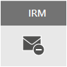

# E-Mail-Verschlüsselung in Office 365Email encryption in Office 365

In diesem Artikel werden Verschlüsselungsoptionen in Office 365, einschließlich Office-Nachrichtenverschlüsselung (OM), S/MIME, Information Rights Management (IRM), und Einführung in Transport Layer Security (TLS), verglichen.This article compares encryption options in Office 365 including Office Message Encryption (OME), S/MIME, Information Rights Management (IRM), and introduces Transport Layer Security (TLS).
  
Office 365 bietet mehrere Verschlüsselungsoptionen, die Ihnen dabei helfen, Ihre geschäftlichen Anforderungen für E-Mail-Sicherheit zu erfüllen.Office 365 delivers multiple encryption options to help you meet your business needs for email security. In diesem Artikel werden drei Methoden zum Verschlüsseln von e-Mails in Office 365 vorgestellt.This article presents three ways to encrypt email in Office 365. Wenn Sie mehr über alle Sicherheitsfeatures in Office 365 erfahren möchten, besuchen Sie das [Office 365 Trust Center](http://go.microsoft.com/fwlink/p/?LinkID=282470).If you want to learn more about all security features in Office 365, visit the [Office 365 Trust Center](http://go.microsoft.com/fwlink/p/?LinkID=282470). In diesem Artikel werden die drei Verschlüsselungstypen vorgestellt, die für Office 365 Administratoren zur Verfügung stehen, um e-Mails in Office 365 zu schützen:This article introduces the three types of encryption available for Office 365 administrators to help secure email in Office 365:
  
- Office-Nachrichtenverschlüsselung (Office Message Encryption, OME)Office Message Encryption (OME).
    
- Secure/Multipurpose Internet Mail Extensions (S/MIME)Secure/Multipurpose Internet Mail Extensions (S/MIME).
    
- Information Rights Management (IRM).Information Rights Management (IRM).
    
## Was ist E-Mail-Verschlüsselung, und wie wird sie in Office 365 verwendet?What is email encryption and how does Office 365 use it?

Verschlüsselung ist der Vorgang, bei dem Informationen so codiert werden, dass nur ein autorisierter Empfänger die Informationen decodieren und nutzen kann.Encryption is the process by which information is encoded so that only an authorized recipient can decode and consume the information. Office 365 verwendet Verschlüsselung auf zweierlei Weise: im Dienst und als Kunden Steuerelement.Office 365 uses encryption in two ways: in the service, and as a customer control. Im Dienst wird die Verschlüsselung standardmäßig in Office 365 verwendet; Sie müssen nichts konfigurieren.In the service, encryption is used in Office 365 by default; you don't have to configure anything. Beispielsweise verwendet Office 365 Transport Layer Security (TLS), um die Verbindung oder Sitzung zwischen zwei Servern zu verschlüsseln.For example, Office 365 uses Transport Layer Security (TLS) to encrypt the connection, or session, between two servers. 
  
So funktioniert die e-Mail-Verschlüsselung normalerweise:Here's how email encryption typically works:
  
- Eine Nachricht wird verschlüsselt oder aus nur-Text in unlesbaren verschlüsselten Text, entweder auf dem Computer des Absenders oder von einem zentralen Server transformiert, während sich die Nachricht in der Übertragung befindet.A message is encrypted, or transformed from plain text into unreadable ciphertext, either on the sender's machine, or by a central server while the message is in transit.
    
- Die Nachricht verbleibt während der Übertragung in verschlüsselter Reihenfolge, um Sie vor dem Lesen zu schützen, falls die Nachricht abgefangen wird.The message remains in ciphertext while it's in transit in order to protect it from being read in case the message is intercepted.
    
- Nachdem die Nachricht vom Empfänger empfangen wurde, wird sie mit einer der folgenden zwei Methoden wieder in lesbaren Nur-Text umgewandelt:Once the message is received by the recipient, the message is transformed back into readable plain text in one of two ways:
    
  - Der Computer des Empfängers verwendet einen Schlüssel, um die Nachricht zu entschlüsseln, oderThe recipient's machine uses a key to decrypt the message, or
    
  - Ein zentraler Server entschlüsselt die Nachricht im Namen des Empfängers, nachdem die Identität des Empfängers überprüft wurde.A central server decrypts the message on behalf of the recipient, after validating the recipient's identity.
    
Weitere Informationen darüber, wie Office 365 die Kommunikation zwischen Servern, beispielsweise zwischen Organisationen innerhalb Office 365 oder zwischen Office 365 und einem vertrauenswürdigen Geschäftspartner außerhalb von Office 365 sichert, finden Sie unter [how Exchange Online uses TLS to Secure Email Verbindungen in Office 365](exchange-online-uses-tls-to-secure-email-connections.md).For more information on how Office 365 secures communication between servers, such as between organizations within Office 365 or between Office 365 and a trusted business partner outside of Office 365, see [How Exchange Online uses TLS to secure email connections in Office 365](exchange-online-uses-tls-to-secure-email-connections.md).
  
Sehen Sie sich dieses Video für eine Einführung in die [Verschlüsselung in Office 365](https://www.youtube.com/watch?v=KmfxCd5ublI)an.Watch this video for an introduction to [Encryption in Office 365](https://www.youtube.com/watch?v=KmfxCd5ublI).
  
## Vergleichen der in Office 365 verfügbaren E-Mail-VerschlüsselungsoptionenComparing email encryption options available in Office 365

|||||
|:-----|:-----|:-----|:-----|
|Was ist das?What is it?|Office 365-Nachrichtenverschlüsselung (Office Message Encryption, OME) ist ein Dienst, der auf Azure Rights Management (Azure RMS) aufbaut und mit dem Sie verschlüsselte E-Mails an Personen innerhalb oder außerhalb Ihrer Organisation senden können, unabhängig von der E-Mail-Zieladresse (Gmail, Yahoo! Mail, Outlook.com usw.).Office 365 Message Encryption (OME) is a service built on Azure Rights Management (Azure RMS) that lets you send encrypted email to people inside or outside your organization, regardless of the destination email address (Gmail, Yahoo! Mail, Outlook.com, etc.).    Als Administrator können Sie Transportregeln einrichten, die die Bedingungen für die Verschlüsselung definieren. Wenn ein Benutzer eine Nachricht sendet, die mit einer Regel übereinstimmt, wird die Verschlüsselung automatisch angewendet.As an admin, you can set up transport rules that define the conditions for encryption. When a user sends a message that matches a rule, encryption is applied automatically.    Zum Anzeigen verschlüsselter Nachrichten können Empfänger entweder eine einmalige Kennung abrufen, sich mit einem Microsoft-Konto anmelden oder sich mit einem Geschäfts- oder Schulkonto anmelden, das Office 365 zugeordnet ist.To view encrypted messages, recipients can either get a one-time passcode, sign in with a Microsoft account, or sign in with a work or school account associated with Office 365. Empfänger können auch verschlüsselte Antworten senden.Recipients can also send encrypted replies. Sie benötigen kein Office 365-Abonnement, um verschlüsselte Nachrichten anzuzeigen oder verschlüsselte Antworten zu senden.They don't need an Office 365 subscription to view encrypted messages or send encrypted replies.|IRM ist eine Verschlüsselungslösung, die auch Nutzungseinschränkungen auf E-Mail-Nachrichten anwendet. Mit dieser Lösung können Sie verhindern, dass vertrauliche Informationen von nicht autorisierten Personen gedruckt, weitergeleitet oder kopiert werden.IRM is an encryption solution that also applies usage restrictions to email messages. It helps prevent sensitive information from being printed, forwarded, or copied by unauthorized people.    IRM-Funktionen in Office 365 verwenden Azure Rights Management (Azure RMS).IRM capabilities in Office 365 use Azure Rights Management (Azure RMS).|S/MIME ist eine zertifikatbasierte Verschlüsselungslösung, mit der Sie Nachrichten sowohl verschlüsseln als auch digital signieren können.S/MIME is a certificate-based encryption solution that allows you to both encrypt and digitally sign a message. Durch die Nachrichtenverschlüsselung kann sichergestellt werden, dass nur der vorgesehene Empfänger die Nachricht öffnen und lesen kann.The message encryption helps ensure that only the intended recipient can open and read the message. Mithilfe einer digitalen Signatur kann den Empfänger die Identität des Absenders überprüfen.A digital signature helps the recipient validate the identity of the sender.    Digitale Signaturen und Nachrichtenverschlüsselung werden durch Verwendung eindeutiger digitaler Zertifikate ermöglicht, die die Schlüssel für das Überprüfen von digitalen Signaturen und das Verschlüsseln oder Entschlüsseln von Nachrichten enthalten.Both digital signatures and message encryption are made possible through the use of unique digital certificates that contain the keys for verifying digital signatures and encrypting or decrypting messages.    Um S/MIME verwenden zu können, müssen Sie über gespeicherte öffentliche Schlüssel für jeden Empfänger verfügen.To use S/MIME, you must have public keys on file for each recipient. Empfänger müssen ihre eigenen privaten Schlüssel verwalten, die dauerhaft gesichert sein müssen.Recipients have to maintain their own private keys, which must remain secure. Wenn die privaten Schlüssel eines Empfängers gefährdet sind, muss der Empfänger einen neuen privaten Schlüssel abrufen und öffentliche Schlüssel an alle potenziellen Absender weiterverteilen.If a recipient's private keys are compromised, the recipient needs to get a new private key and redistribute public keys to all potential senders.|
|Vorhandene FunktionenWhat does it do?|OmeOME:     Verschlüsselt Nachrichten, die an interne oder externe Empfänger gesendet werden.Encrypts messages sent to internal or external recipients.     Ermöglicht Benutzern das Senden verschlüsselter Nachrichten an beliebige E-Mail-Adressen, einschließlich Outlook.com, Yahoo! Mail und Gmail.Allows users to send encrypted messages to any email address, including Outlook.com, Yahoo! Mail, and Gmail.     Ermöglicht es Ihnen als Administrator, das e-Mail-Anzeige Portal so anzupassen, dass es die Marke Ihrer Organisation widerspiegelt.Allows you, as an admin, to customize the email viewing portal to reflect your organization's brand.     Die Schlüssel werden von Microsoft sicher verwaltet und gespeichert, daher müssen Sie dies nicht tun.Microsoft securely manages and stores the keys, so you don't have to.     Es ist keine spezielle clientseitige Software erforderlich, sofern die verschlüsselte Nachricht (als HTML-Anlage gesendet) in einem Browser geöffnet werden kann.No special client side software is needed as long as the encrypted message (sent as an HTML attachment) can be opened in a browser.|IRMIRM:     Verwendet Verschlüsselung und Nutzungsbeschränkungen, um Online- und Offlineschutz für E-Mail-Nachrichten und Anlagen bereitzustellen.Uses encryption and usage restrictions to provide online and offline protection for email messages and attachments.     Gibt Ihnen als Administrator die Möglichkeit, Transportregeln oder Outlook-Schutzregeln einzurichten, um IRM automatisch auf ausgewählte Nachrichten anzuwenden.Gives you, as an admin, the ability to set up transport rules or Outlook protection rules to automatically apply IRM to select messages.     Ermöglicht Benutzern das manuelle Anwenden von Vorlagen in Outlook oder Outlook im Internet (früher bekannt als Outlook Web App).Lets users manually apply templates in Outlook or Outlook on the web (formerly known as Outlook Web App).|In S/MIME erfolgt die Absenderauthentifizierung durch digitale Signaturen, und die Vertraulichkeit von Nachrichten wird durch Verschlüsselung sichergestellt.S/MIME addresses sender authentication with digital signatures, and message confidentiality with encryption.|
|Nicht vorhandene FunktionenWhat does it not do?|Mit OM können Sie keine Nutzungseinschränkungen auf Nachrichten anwenden.OME doesn't let you apply usage restrictions to messages. Sie können ihn beispielsweise nicht verwenden, um zu verhindern, dass ein Empfänger eine verschlüsselte Nachricht weiterleitet oder druckt.For example, you can't use it to stop a recipient from forwarding or printing an encrypted message.|Einige Anwendungen unterstützen IRM-E-Mails möglicherweise nicht auf allen Geräten.Some applications may not support IRM emails on all devices. Weitere Informationen zu diesen und anderen Produkten, die IRM-e-Mails unterstützen, finden Sie unter [Client-Gerätefunktionen](https://technet.microsoft.com/library/dn655136.aspx#BKMK_ClientCapabilities).For more information about these and other products that support IRM email, see [Client device capabilities](https://technet.microsoft.com/library/dn655136.aspx#BKMK_ClientCapabilities).|S/MIME lässt nicht zu, dass verschlüsselte Nachrichten auf Schadsoftware, Spam oder Richtlinien überprüft werden.S/MIME doesn't allow encrypted messages to be scanned for malware, spam, or policies.|
|Empfehlungen und BeispielszenarienRecommendations and example scenarios|Wir empfehlen die Verwendung von OM, wenn Sie vertrauliche Geschäftsinformationen an Personen außerhalb Ihrer Organisation senden möchten, unabhängig davon, ob es sich um Verbraucher oder andere Unternehmen handelt.We recommend using OME when you want to send sensitive business information to people outside your organization, whether they're consumers or other businesses. Beispiel:For example:     Ein Bankangestellter sendet Kreditkartenabrechnungen an Kunden.A bank employee sending credit card statements to customers     Das Büro eines Arztes, der medizinische Aufzeichnungen an einen Patienten sendetA doctor's office sending medical records to a patient     Ein Anwalt sendet vertrauliche Rechtsinformationen an einen anderen Anwalt.An attorney sending confidential legal information to another attorney|Die Verwendung von IRM wird empfohlen, wenn Sie Nutzungseinschränkungen und Verschlüsselung anwenden möchten. Beispiel:We recommend using IRM when you want to apply usage restrictions as well as encryption. For example:     Ein Manager, der vertrauliche Details zu einem neuen Produkt an das Team sendet, wendet die Option "nicht weiterleiten" an.A manager sending confidential details to her team about a new product applies the "Do Not Forward" option.     Eine Führungskraft muss ein Angebot für ein anderes Unternehmen freigeben, das eine Anlage von einem Partner enthält, der Office 365 verwendet, und sowohl die E-Mail als auch die Anlage müssen geschützt werden.An executive needs to share a bid proposal with another company, which includes an attachment from a partner who is using Office 365, and require both the email and the attachment to be protected.|Wir empfehlen die Verwendung von S/MIME, wenn entweder Ihre Organisation oder die Organisation des Empfängers echte Peer-to-Peer-Verschlüsselung erfordert.We recommend using S/MIME when either your organization or the recipient's organization requires true peer-to-peer encryption.     S/MIME wird am häufigsten in den folgenden Szenarien verwendet:S/MIME is most commonly used in the following scenarios:     Kommunikation zwischen BehördenGovernment agencies communicating with other government agencies     Kommunikation zwischen einem Unternehmen und einer BehördeA business communicating with a government agency|
   
## Welche Verschlüsselungsoptionen sind für mein Office 365-Abonnement verfügbar?What encryption options are available for my Office 365 subscription?

Informationen zu e-Mail-Verschlüsselungsoptionen für Ihr Office 365-Abonnement finden Sie in der [Exchange Online-Dienstbeschreibung](https://technet.microsoft.com/en-us/library/exchange-online-service-description.aspx).For information about email encryption options for your Office 365 subscription see the [Exchange Online service description](https://technet.microsoft.com/en-us/library/exchange-online-service-description.aspx). Hier finden Sie Informationen zu den folgenden Verschlüsselungsfeatures:Here, you can find information about the following encryption features:
  
- Azure RMS, einschließlich IRM-Funktionen und OMEAzure RMS, including both IRM capabilities and OME
    
- S/MIMES/MIME
    
- TLSTLS
    
- Verschlüsselung von Daten im Ruhezustand (über BitLocker)Encryption of data at rest (through BitLocker)
    
## Wissenswertes zur Verschlüsselung von Daten im RuhezustandWhat about encryption for data at rest?

"Daten im Ruhezustand" bezieht sich auf Daten, die nicht aktiv unterwegs sind."Data at rest" refers to data that isn't actively in transit. In Office 365 werden E-Mail-Daten im Ruhezustand mit der BitLocker-Laufwerkverschlüsselung verschlüsselt.In Office 365, email data at rest is encrypted using BitLocker Drive Encryption. BitLocker verschlüsselt die Festplatten in Office 365-Datencentern, um verbesserten Schutz vor nicht autorisiertem Zugriff bereitzustellen.BitLocker encrypts the hard drives in Office 365 datacenters to provide enhanced protection against unauthorized access. Weitere Informationen finden Sie unter [Übersicht über BitLocker](https://go.microsoft.com/fwlink/p/?LinkId=394737).To learn more, see [BitLocker Overview](https://go.microsoft.com/fwlink/p/?LinkId=394737).
  
## Weitere Informationen zu E-Mail-Verschlüsselungsoptionen in Office 365More information about email encryption options in Office 365

Weitere Informationen zu den in diesem Artikel vorgestellten E-Mail-Verschlüsselungsoptionen sowie zu TLS finden Sie in den folgenden Artikeln:For more information about the email encryption options in this article as well as TLS, see these articles:
  
 **Ome****OME**
  
[Office 365-Nachrichtenverschlüsselung (OME)Office 365 Message Encryption (OME)](ome.md)
  
 **IRM****IRM**
  
[Verwaltung von Informationsrechten in Exchange OnlineInformation Rights Management in Exchange Online](https://technet.microsoft.com/en-us/library/jj983436%28v=exchg.150%29.aspx)
  
[Was ist Azure Rights Management?What is Azure Rights Management?](https://technet.microsoft.com/library/jj585026)
  
 **S/MIME****S/MIME**
  
[S/MIME für die Nachrichtensignierung und -verschlüsselungS/MIME for message signing and encryption](https://technet.microsoft.com/library/dn626158)
  
[Grundlegendes zu S/MIMEUnderstanding S/MIME](https://technet.microsoft.com/library/aa995740%28v=exchg.65%29.aspx)
  
[Grundlegendes zur Kryptografie mit öffentlichen SchlüsselnUnderstanding Public Key Cryptography](https://technet.microsoft.com/library/aa998077%28v=exchg.65%29.aspx)
  
 **TLS****TLS**
  
[Konfigurieren benutzerdefinierter e-Mail-Fluss mithilfe von Connectors in Office 365Configure custom mail flow by using connectors in Office 365](https://technet.microsoft.com/en-us/library/jj723138%28v=exchg.150%29.aspx)
  

