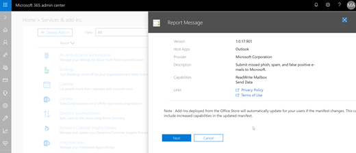

# Aktivieren des Berichtsnachrichts-Add-InsEnable the Report Message add-in

## ÜbersichtOverview

Der Bericht-add-in für Outlook und Outlook im Web ermöglicht Personen auf einfache Weise falsch klassifizierte e-Mail, ob die sichere oder böswilliges, in der Regel für die Analyse Unwichtigstes. Microsoft verwendet diese Informationen, um die Effektivität des e-Mail-Schutz Technologien verbessern. Darüber hinaus Wenn Ihre Organisation [Office 365 erweiterte Threat Protection](office-365-atp.md) oder [Office 365 Bedrohungsanalyse](office-365-ti.md)verwendet wird, enthält das Bericht-add-in Ihrer Organisation Security Team nützliche Informationen, die sie verwenden können, um zu prüfen und aktualisieren Sicherheitsrichtlinien.The Report Message add-in for Outlook and Outlook on the Web enables people to easily report misclassified email, whether safe or malicious, to Microsoft and its affiliates for analysis. Microsoft uses these submissions to improve the effectiveness of email protection technologies. In addition, if your organization is using [Office 365 Advanced Threat Protection](office-365-atp.md) or [Office 365 Threat Intelligence](office-365-ti.md), the Report Message add-in provides your organization's security team with useful information they can use to review and update security policies. 

Nehmen wir beispielsweise bei Personen viele Nachrichten als Phishing melden möchten. Diese Informationen Flächen in das [Dashboard Sicherheit](security-dashboard.md) und sonstige Berichte. Security-Team Ihrer Organisation können diese Informationen als eine Angabe, die Anti-Phishing-Richtlinien möglicherweise aktualisiert werden. Oder wenn Personen viele Nachrichten protokolliert werden, die als Junk-e-Mail Junk gekennzeichnet wurden, mithilfe des Bericht-add-Ins, Security-Team Ihrer Organisation müssen möglicherweise passen Sie die [Anti-Spam-Richtlinien](configure-the-anti-spam-policies.md).For example, suppose that people are reporting a lot of messages as phishing. This information surfaces in the [Security Dashboard](security-dashboard.md) and other reports. Your organization's security team can use this information as an indication that anti-phishing policies might need to be updated. Or, if people are reporting a lot of messages that were flagged as junk mail as Not Junk by using the Report Message add-in, your organization's security team might need to adjust [anti-spam policies](configure-the-anti-spam-policies.md). 

Das Add-in Berichtnachricht funktioniert mit Ihrem Office 365-Abonnement und die folgenden Produkte:The Report Message add-in works with your Office 365 subscription and the following products:
 - Outlook im WebOutlook on the Web
 - Outlook 2013 SP1Outlook 2013 SP1
 - Outlook 2016Outlook 2016
 - Outlook 2016 für MacOutlook 2016 for Mac
 - Outlook im Lieferumfang von Office 365 ProPlusOutlook included with Office 365 ProPlus
  
Wenn Sie einen einzelnen Benutzer sind, können Sie [den Bericht-add-in für sich selbst zu aktivieren](#get-the-report-message-add-in-for-yourself).If you're an individual user, you can [enable the Report Message add-in for yourself](#get-the-report-message-add-in-for-yourself). 
  
Wenn Sie Exchange Online-Administrator sind, können Sie [den Bericht-add-in für Ihre Organisation zu aktivieren](#get-and-enable-the-report-message-add-in-for-your-organization).If you're an Exchange Online administrator, you can [enable the Report Message add-in for your organization](#get-and-enable-the-report-message-add-in-for-your-organization).
    
## Die Meldung Bericht-add-in für sich selbstGet the Report Message add-in for yourself

1. Suchen Sie in [Microsoft Elemente verwenden](https://appsource.microsoft.com/marketplace/apps)für den [Bericht-add-in](https://appsource.microsoft.com/product/office/wa104381180).In [Microsoft AppSource](https://appsource.microsoft.com/marketplace/apps), search for the [Report Message add-in](https://appsource.microsoft.com/product/office/wa104381180).
    
2. Wählen Sie **erhalten IT jetzt**.Choose **GET IT NOW**.   
    
3. Beachten Sie die Bestimmungen der Verwendung und der Datenschutzrichtlinie. Wählen Sie dann **Weiter**aus.Review the terms of use and privacy policy. Then choose **Continue**. 
    
4. Melden Sie sich bei Ihrem Office 365-e-Mail mit Ihrer Arbeit oder Schule-Konto (zur Verwendung von Business) oder Ihrem Microsoft-Konto (zur persönlichen Verwendung).Sign in to your Office 365 email using your work or school account (for business use) or your Microsoft account (for personal use).
    

Nachdem das Add-in installiert und aktiviert ist, sehen Sie die folgenden Symbole:After the add-in is installed and enabled, you'll see the following icons: 

- In Outlook sieht das Symbol:In Outlook the icon looks like this:    
- In Outlook Web App sieht das Symbol:In Outlook Web App the icon looks like this:  

Als nächsten Schritt erfahren Sie, wie Sie zur [Verwendung des Berichtnachricht-add-ins](https://support.office.com/article/b5caa9f1-cdf3-4443-af8c-ff724ea719d2).As a next step, learn how to [Use the Report Message add-in](https://support.office.com/article/b5caa9f1-cdf3-4443-af8c-ff724ea719d2).
  
## Abrufen und das Bericht-add-in für Ihre Organisation zu aktivierenGet and enable the Report Message add-in for your organization

> [!IMPORTANT]
> Sie müssen ein globaler Office 365-Administrator oder Exchange Online-Administrator, zum Abschließen dieser Aufgabe sein.You must be an Office 365 global administrator or an Exchange Online Administrator to complete this task.

1. Wechseln Sie zu [https://portal.office.com](https://portal.office.com) und melden Sie sich mit Ihrem Konto arbeiten oder Schule.Go to [https://portal.office.com](https://portal.office.com) and sign in using your work or school account. 
    
2. Wählen Sie **Admin** , fahren Sie mit der Verwaltungskonsole.Choose **Admin** to go to the Admin center. 
    
3. Wählen Sie **Admin zentriert** \> **Exchange** fahren Sie mit der Exchange-Verwaltungskonsole (EAC).Choose **Admin centers** \> **Exchange** to go to the Exchange admin center (EAC). 
    
4. Wählen Sie die **Organisation** \> **-add-ins**.Choose **organization** \> **add-ins**. 
    
5. Wählen Sie **+**  >  **aus dem Office Store hinzufügen**.Choose **+** > **Add from the Office Store**.  Dadurch wird der Office Store in Ihrem Webbrowser geöffnet.This opens the Office Store in your web browser.
    
6. Suchen nach einer Berichtnachricht.Search for Report Message.  
    
7. Wählen Sie in der Liste **Apps** **Berichtnachricht aus**, und wählen Sie dann **Sofort erhalten möchten**.In the **Apps** list, select **Report Message**, and then choose **GET IT NOW**.   
    
8. Beachten Sie die Bestimmungen der Verwendung und der Datenschutzrichtlinie. Wählen Sie dann **Weiter**aus.Review the terms of use and privacy policy. Then choose **Continue**. 
    
    
  
9. Ein Assistent wird geöffnet, mit denen Sie Konfigurieren der Überprüfung der Bericht-add-in die Informationen, und wählen Sie **Weiter** , um den Vorgang fortzusetzen.A wizard opens to help you configure the Report Message add-in. Review the information, and choose **Next** to continue.   

10. Geben Sie die Standardeinstellung, die Sie für den Bericht-add-in Benutzern zugewiesen werden sollen.Specify the default setting you want users to have for the Report Message add-in.  
    
11. Geben Sie an, wer die Berichtnachricht-add-in.Specify who gets the Report Message add-in.   

12. Klicken Sie auf **Save**.Choose **Save**.  
> [!TIP]
> [Einrichten einer Regel zum Abrufen einer Kopie der e-Mail-Nachrichten von den Benutzern gemeldet](#set-up-a-rule-to-get-a-copy-of-email-messages-reported-by-your-users) werden solltenWe recommend [setting up a rule to get a copy of email messages reported by your users](#set-up-a-rule-to-get-a-copy-of-email-messages-reported-by-your-users)

Je nachdem, was Sie mit dem Assistenten ausgewählt müssen die Personen in Ihrer Organisation des [Berichtnachricht-add-in](https://support.office.com/article/b5caa9f1-cdf3-4443-af8c-ff724ea719d2) zur Verfügung. Personen in Ihrer Organisation werden die folgenden Symbole angezeigt:Depending on what you selected using the wizard, people in your organization will have the [Report Message add-in](https://support.office.com/article/b5caa9f1-cdf3-4443-af8c-ff724ea719d2) available. People in your organization will see the following icons: 

- In Outlook sieht das Symbol:In Outlook the icon looks like this:    
- In Outlook Web App sieht das Symbol:In Outlook Web App the icon looks like this:  

## Richten Sie eine Regel zum Abrufen einer Kopie der e-Mail-Nachrichten von den Benutzern gemeldetSet up a rule to get a copy of email messages reported by your users

> [!IMPORTANT]
> Sie müssen Exchange Online-Administrator zum Ausführen dieser Aufgabe sein.You must be an Exchange Online Administrator to perform this task.
  
Sie können eine Regel einrichten, um eine Kopie der e-Mail-Nachrichten von Benutzern in Ihrer Organisation gemeldet abzurufen. Sie führen Sie diesen, nachdem Sie heruntergeladen und des Berichtnachricht-add-Ins für Ihre Organisation aktiviert haben.You can set up a rule to get a copy of email messages reported by users in your organization. You do this after you have downloaded and enabled the Report Message add-in for your organization.
  
1. Wählen Sie in der Exchange-Verwaltungskonsole, **e-Mail-Fluss** \> **Regeln**.In the EAC, choose **mail flow** \> **rules**. 
    
2. Wählen Sie **+** \> **neue Regel erstellen**.Choose **+** \> **Create a new rule**. 
    
3. Geben Sie im Feld **Name** einen Namen, beispielsweise Übermittlungen.In the **Name** box, type a name, such as Submissions.
    
4. Wählen Sie in der Liste **diese Regel anwenden, wenn** **die Empfängeradresse enthält...** aus.In the **Apply this rule if** list, choose **The recipient address includes...**. 
    
5. Klicken Sie im Bildschirm **Wörter oder Ausdrücke angeben** fügen Sie junk@office365.microsoft.com und phish@office365.microsoft.com hinzu, und wählen Sie dann auf **OK**.In the **specify words or phrases** screen, add junk@office365.microsoft.com and phish@office365.microsoft.com, and then choose **OK**. 
    
    
  
6. Wählen Sie in der Liste **die folgenden Schritte aus...** **Bcc der Nachricht an...**.In the **Do the following...** list, choose **Bcc the message to...**. 
    
7. Fügen Sie ein globaler Administrator, Sicherheitsadministrator und/oder Sicherheit Leser, die eine Kopie der einzelnen Personen an Microsoft gemeldet e-Mail-Nachricht erhalten sollen, und wählen Sie dann auf **OK**.Add a global administrator, security administrator, and/or security reader who should receive a copy of each email message that people report to Microsoft, and then choose **OK**. 
    
    
  
8. Wählen Sie **diese Regel mit Schweregrad**aus, und wählen Sie **Mittel**.Select **Audit this rule with severity level**, and choose **Medium**. 
    
9. Wählen Sie unter **Wählen Sie einen Modus für diese Regel** **erzwingen**.Under **Choose a mode for this rule**, choose **Enforce**. 
    
    
  
10. Klicken Sie auf **Save**.Choose **Save**. 
    
Mit dieser Regel vorhanden Wenn eine Person in Ihrer Organisation eine e-Mail-Nachricht mit dem Bericht add-in, meldet erhalten Ihrer globaler Administrator, Sicherheitsadministrator und/oder Sicherheit Reader eine Kopie der Nachricht. Diese Informationen können Sie festlegen oder Richtlinien, wie [Links zu Office 365 ATP sicherer](atp-safe-links.md) Richtlinien anpassen.With this rule in place, whenever someone in your organization reports an email message using the Report Message add-in, your global administrator, security administrator, and/or security reader will receive a copy of that message. This information can enable you to set up or adjust policies, such as [Office 365 ATP Safe Links](atp-safe-links.md) policies. 

## Überprüfen Sie oder bearbeiten Sie die Standardeinstellungen für den Bericht-add-inReview or edit the default settings for the Report Message add-in

Sie können überprüfen und bearbeiten die Standardeinstellungen für den Bericht-add-in im Admin Center.You can review and edit the default settings for the Report Message add-in using the Admin Center. 

> [!IMPORTANT]
> Sie müssen ein globaler Office 365-Administrator oder Exchange Online-Administrator, zum Abschließen dieser Aufgabe sein.You must be an Office 365 global administrator or an Exchange Online Administrator to complete this task.
    
1. Wenn Sie nur das Bericht-add-in für Ihre Organisation installiert haben, müssen Sie bereits auf der Seite Dienste & -add-ins sein. Andernfalls, fahren Sie [hier](https://portal.office.com/adminportal/home#/Settings/ServicesAndAddIns) und melden Sie sich mit Ihrem arbeiten oder Schule-Konto für Office 365.If you've just installed the Report Message add-in for your organization, you'll already be on the Services & add-ins page. Otherwise, go [here](https://portal.office.com/adminportal/home#/Settings/ServicesAndAddIns) and sign in using your work or school account for Office 365.

2. Suchen Sie **Bericht**zu, und wählen Sie dann aus.Search for **Report Message**, and then select it.   
    
3. Ein Bereich wird geöffnet, in dem die Einstellungen angezeigt, die für den Bericht-add-in während der Bereitstellung ausgewählt wurden.A pane opens that displays the settings that were selected for the Report Message add-in during deployment.   

4. Überprüfen Sie und bei Bedarf Bearbeiten der Einstellungen für den Bericht-add-in, und klicken Sie dann Ihre Änderungen zu speichern.Review and if needed, edit settings for the Report Message add-in, and then save your changes.
    
## Informationen Sie zur Verwendung des Berichtnachricht-add-InsLearn how to use the Report Message add-in

Finden Sie unter [Verwenden des Berichtnachricht-add-ins](https://support.office.com/article/b5caa9f1-cdf3-4443-af8c-ff724ea719d2).See [Use the Report Message add-in](https://support.office.com/article/b5caa9f1-cdf3-4443-af8c-ff724ea719d2).
  
## Verwandte ThemenRelated topics

[Verwenden des Add-Ins Nachricht meldenUse the Report Message add-in](https://support.office.com/article/b5caa9f1-cdf3-4443-af8c-ff724ea719d2)
  
[Anzeigen von e-Mail-Sicherheitsberichte in das Wertpapier &amp; Compliance CenterView email security reports in the Security &amp; Compliance Center](view-email-security-reports.md)

[Anzeigen von Berichten für Office 365 erweiterte Threat ProtectionView reports for Office 365 Advanced Threat Protection](view-reports-for-atp.md)

[Verwenden Sie in das Wertpapier Explorer &amp; Compliance CenterUse Explorer in the Security &amp; Compliance Center](use-explorer-in-security-and-compliance.md)
  

