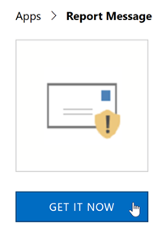

# Aktivieren des Berichtsnachrichts-Add-Ins

## Übersicht

Der Bericht-add-in für Outlook und Outlook im Web ermöglicht Personen auf einfache Weise falsch klassifizierte e-Mail, ob die sichere oder böswilliges, in der Regel für die Analyse Unwichtigstes. Microsoft verwendet diese Informationen, um die Effektivität des e-Mail-Schutz Technologien verbessern. Darüber hinaus Wenn Ihre Organisation [Office 365 erweiterte Threat Protection](office-365-atp.md) oder [Office 365 Bedrohungsanalyse](office-365-ti.md)verwendet wird, enthält das Bericht-add-in Ihrer Organisation Security Team nützliche Informationen, die sie verwenden können, um zu prüfen und aktualisieren Sicherheitsrichtlinien. 

Nehmen wir beispielsweise bei Personen viele Nachrichten als Phishing melden möchten. Diese Informationen Flächen in das [Dashboard Sicherheit](security-dashboard.md) und sonstige Berichte. Security-Team Ihrer Organisation können diese Informationen als eine Angabe, die Anti-Phishing-Richtlinien möglicherweise aktualisiert werden. Oder wenn Personen viele Nachrichten protokolliert werden, die als Junk-e-Mail Junk gekennzeichnet wurden, mithilfe des Bericht-add-Ins, Security-Team Ihrer Organisation müssen möglicherweise passen Sie die [Anti-Spam-Richtlinien](configure-the-anti-spam-policies.md). 

Das Add-in Berichtnachricht funktioniert mit Ihrem Office 365-Abonnement und die folgenden Produkte:
 - Outlook im Web
 - Outlook 2013 SP1
 - Outlook 2016
 - Outlook 2016 für Mac
 - Outlook im Lieferumfang von Office 365 ProPlus

> [!NOTE]
> Der Bericht-add-in für Outlook und Outlook im Web ist dasselbe wie die [Junk-e-Mail-Filter für Outlook](https://support.office.com/article/Overview-of-the-Junk-Email-Filter-5ae3ea8e-cf41-4fa0-b02a-3b96e21de089)nicht genau über wenngleich beide e-Mail als Junk, keine Junk-e- oder Phishing-Versuch markiert verwendet werden können. Der Bericht-add-in für Outlook und Outlook im Web benachrichtigt Microsoft Informationen zu falsch klassifizierte e-Mail während der Junk-e-Mail-Filter für Outlook zum Organisieren von e-Mail-Nachrichten im Postfach des Benutzers verwendet wird. 
  
Wenn Sie einen einzelnen Benutzer sind, können Sie [den Bericht-add-in für sich selbst zu aktivieren](#get-the-report-message-add-in-for-yourself). 
  
Wenn Sie ein globaler Office 365-Administrator oder Exchange Online-Administrator sind und Exchange so konfiguriert ist, dass OAuth-Authentifizierung verwenden, können Sie [den Bericht-add-in für Ihre Organisation zu aktivieren](#get-and-enable-the-report-message-add-in-for-your-organization). Die Nachricht-Add-In für Berichts ist nun durch [Zentralisierte Bereitstellung](https://docs.microsoft.com/office365/admin/manage/centralized-deployment-of-add-ins)verfügbar.
    
## Die Meldung Bericht-add-in für sich selbst

1. Suchen Sie in [Microsoft Elemente verwenden](https://appsource.microsoft.com/marketplace/apps)für den [Bericht-add-in](https://appsource.microsoft.com/product/office/wa104381180).
    
2. Wählen Sie **erhalten IT jetzt**.   
    
3. Beachten Sie die Bestimmungen der Verwendung und der Datenschutzrichtlinie. Wählen Sie dann **Weiter**aus. 
    
4. Melden Sie sich bei Office 365 mit Ihrer Arbeit oder Schule Konto (zur Verwendung von Business) oder Ihrem Microsoft-Konto (zur persönlichen Verwendung).
    
Nachdem das Add-in installiert und aktiviert ist, sehen Sie die folgenden Symbole: 

- In Outlook sieht das Symbol:    
- In Outlook Web App (oder in Outlook im Web) sieht das Symbol:  

> [!TIP]
> Als nächsten Schritt erfahren Sie, wie Sie zur [Verwendung des Berichtnachricht-add-ins](https://support.office.com/article/b5caa9f1-cdf3-4443-af8c-ff724ea719d2).
  
## Abrufen und das Bericht-add-in für Ihre Organisation zu aktivieren

> [!IMPORTANT]
> Sie müssen ein globaler Office 365-Administrator oder Exchange Online-Administrator, zum Abschließen dieser Aufgabe sein. Darüber hinaus muss Exchange konfiguriert sein, um OAuth-Authentifizierung zum Weitere Informationen finden Sie unter [Anforderungen an Exchange (zentralisierte Bereitstellung von add-ins)](https://docs.microsoft.com/office365/admin/manage/centralized-deployment-of-add-ins&view=o365-worldwide#exchange-requirements)zu verwenden. 

1. Wechseln Sie zur [Seite für Dienste &-add-ins](https://admin.microsoft.com/AdminPortal/Home#/Settings/ServicesAndAddIns) in der Microsoft-365-Verwaltungskonsole.   
    
2. Wählen Sie **+ -Add-in bereitstellen**.   
    
3. Überprüfen Sie die Informationen im Fenster **Neues Add-In** , und wählen Sie dann auf **Weiter**.  
    
4. Wählen Sie **ich ein Add-in aus dem Office Store hinzufügen möchten**, und wählen Sie dann auf **Weiter**.   
    
5. Durchsuchen Sie und in der Liste der Ergebnisse, neben dem **Bericht Nachricht-Add-In**für **Berichts-Nachricht**, wählen Sie **Hinzufügen**.  
    
6. Überprüfen Sie die Informationen auf dem Bildschirm **Bericht** , und wählen Sie dann auf **Weiter**.  

7. Geben Sie die Standardeinstellungen für Benutzer für Outlook, und wählen Sie dann auf **Weiter**.  

8. Geben Sie wer das Bericht-Add-in, und wählen Sie dann auf **Speichern**.   

> [!TIP]
> Wir empfehlen [eine Regel zum Abrufen einer Kopie der e-Mail-Nachrichten von den Benutzern gemeldet einrichten](#set-up-a-rule-to-get-a-copy-of-email-messages-reported-by-your-users).

Personen in Ihrer Organisation müssen je nachdem, was Sie ausgewählt haben, wenn Sie das Add-in (Schritte 7-8 oben), Einrichten des [Berichtnachricht-Add-in](https://support.office.com/article/b5caa9f1-cdf3-4443-af8c-ff724ea719d2) zur Verfügung. Personen in Ihrer Organisation werden die folgenden Symbole angezeigt: 

- In Outlook sieht das Symbol:    
- In Outlook Web App (oder in Outlook im Web) sieht das Symbol:  

> [!TIP]
> Wenn Sie Benutzer über das Add-in Bericht darüber informieren, fügen Sie einen Hyperlink zum [Verwenden des Berichtnachricht-add-ins](https://support.office.com/article/b5caa9f1-cdf3-4443-af8c-ff724ea719d2).

## Richten Sie eine Regel zum Abrufen einer Kopie der e-Mail-Nachrichten von den Benutzern gemeldet

> [!IMPORTANT]
> Sie müssen Exchange Online-Administrator zum Ausführen dieser Aufgabe sein.
  
Sie können eine Regel einrichten, um eine Kopie der e-Mail-Nachrichten von Benutzern in Ihrer Organisation gemeldet abzurufen. Sie führen Sie diesen, nachdem Sie heruntergeladen und des Berichtnachricht-add-Ins für Ihre Organisation aktiviert haben.
  
1. Wählen Sie in der Exchange-Verwaltungskonsole, **e-Mail-Fluss** \> **Regeln**. 
    
2. Wählen Sie **+** \> **neue Regel erstellen**. 
    
3. Geben Sie im Feld **Name** einen Namen, beispielsweise Übermittlungen.
    
4. Wählen Sie in der Liste **diese Regel anwenden, wenn** **die Empfängeradresse enthält...** aus. 
    
5. Klicken Sie im Bildschirm **Wörter oder Ausdrücke angeben** hinzufügen `junk@office365.microsoft.com` und `phish@office365.microsoft.com`, und klicken Sie dann auf **OK**.  
  
6. Wählen Sie in der Liste **die folgenden Schritte aus...** **Bcc der Nachricht an...**. 
    
7. Fügen Sie ein globaler Administrator, Sicherheitsadministrator und/oder Sicherheit Leser, die eine Kopie der einzelnen Personen an Microsoft gemeldet e-Mail-Nachricht erhalten sollen, und wählen Sie dann auf **OK**.  
  
8. Wählen Sie **diese Regel mit Schweregrad**aus, und wählen Sie **Mittel**. 
    
9. Wählen Sie unter **Wählen Sie einen Modus für diese Regel** **erzwingen**.  
  
10. Klicken Sie auf **Save**. 
    
Mit dieser Regel vorhanden Wenn eine Person in Ihrer Organisation eine e-Mail-Nachricht mit dem Bericht add-in, meldet erhalten Ihrer globaler Administrator, Sicherheitsadministrator und/oder Sicherheit Reader eine Kopie der Nachricht. Diese Informationen können Sie festlegen oder Richtlinien, wie [Links zu Office 365 ATP sicherer](atp-safe-links.md) Richtlinien oder Ihre [Anti-Spam-](anti-spam-protection.md) Einstellungen anpassen. 

## Informationen Sie zur Verwendung des Berichtnachricht-add-Ins

Finden Sie unter [Verwenden des Berichtnachricht-add-ins](https://support.office.com/article/b5caa9f1-cdf3-4443-af8c-ff724ea719d2).

## Überprüfen Sie oder bearbeiten Sie der Einstellungen für den Bericht-add-in

Sie können überprüfen und bearbeiten die Standardeinstellungen für den Bericht-add-in auf der [Seite für Dienste &-Add-Ins](https://admin.microsoft.com/AdminPortal/Home#/Settings/ServicesAndAddIns). 

> [!IMPORTANT]
> Sie müssen ein globaler Office 365-Administrator oder Exchange Online-Administrator, zum Abschließen dieser Aufgabe sein.
    
1. Wechseln Sie zur [Seite für Dienste &-add-ins](https://admin.microsoft.com/AdminPortal/Home#/Settings/ServicesAndAddIns) in der Microsoft-365-Verwaltungskonsole.  

2. Suchen Sie und wählen Sie die Add-in-Bericht.   
    
3. Überprüfen Sie auf dem Bildschirm Berichtnachricht und bearbeiten Sie der Einstellungen entsprechend den Anforderungen Ihrer Organisation.   
  
## Verwandte Themen

[Verwenden des Add-Ins Nachricht melden](https://support.office.com/article/b5caa9f1-cdf3-4443-af8c-ff724ea719d2)
  
[Anzeigen von e-Mail-Sicherheitsberichte in das Wertpapier &amp; Compliance Center](view-email-security-reports.md)

[Anzeigen von Berichten für Office 365 erweiterte Threat Protection](view-reports-for-atp.md)

[Verwenden Sie in das Wertpapier Explorer &amp; Compliance Center](use-explorer-in-security-and-compliance.md)
  

