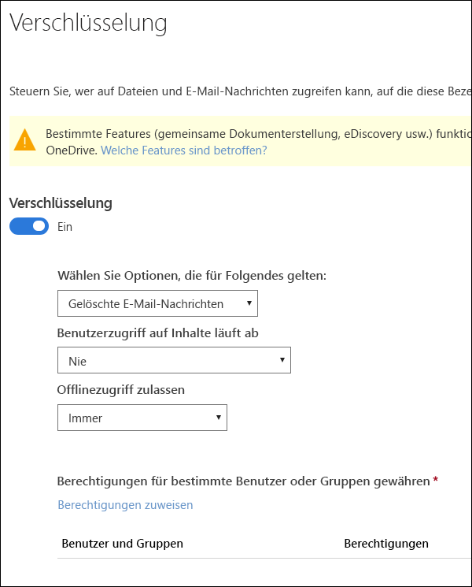
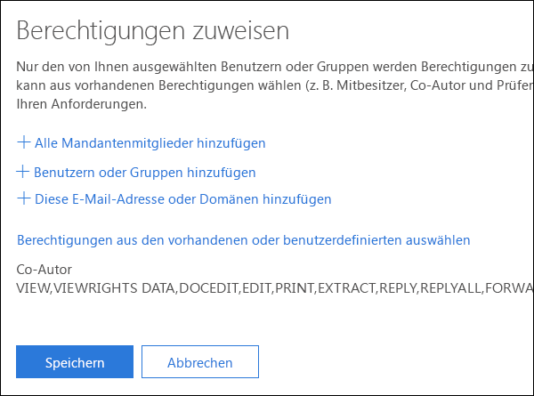
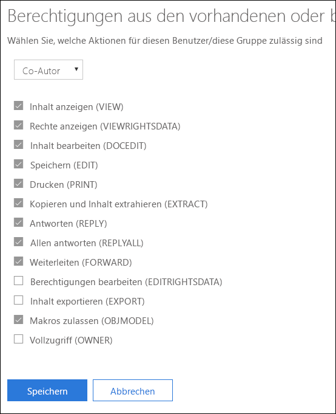
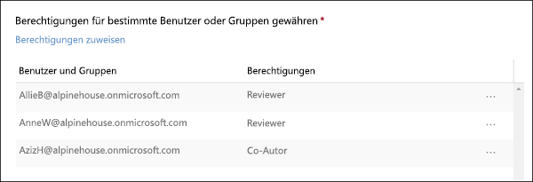

# Einschränken des Zugriffs auf Inhalte mithilfe der Verschlüsselung in Vertraulichkeitsbezeichnungen

Wenn Sie eine Vertraulichkeitsbezeichnung erstellen, können Sie den Zugriff auf Inhalte beschränken, auf die die Bezeichnung angewendet wird. Mit den Verschlüsselungseinstellungen für eine Vertraulichkeitsbezeichnung können Sie beispielsweise Inhalte so schützen, dass:

- Nur Benutzer in Ihrer Organisation ein vertrauliches Dokument oder vertrauliche E-Mails öffnen können.
- Nur Benutzer in der Marketingabteilung das Ankündigungsdokument oder die Ankündigungs-E-Mail für die Werbeaktion bearbeiten und drucken können, während alle anderen Benutzer in der Organisation dieses Dokument oder diese E-Mail nur lesen können.
- Benutzer eine E-Mail nicht weiterleiten oder Informationen daraus kopieren können, die Neuigkeiten zur internen Neuorganisation enthalten.
- Die aktuelle Preisliste, die an Geschäftspartner gesendet wird, kann nach einem angegebenen Datum nicht geöffnet werden.

Wenn ein Dokument oder eine E-Mail verschlüsselt ist, wird Zugriff auf den Inhalt so eingeschränkt, dass:

- Er nur von Benutzern entschlüsselt werden kann, die durch die Verschlüsselungseinstellungen der Bezeichnung dazu autorisiert sind.
- Er immer verschlüsselt bleibt, unabhängig davon, wo er sich befindet (innerhalb oder außerhalb der Organisation), auch dann, wenn die Datei umbenannt wird.
- Er sowohl im Ruhezustand (z. B. in einem OneDrive-Konto) als auch während der Übertragung (z. B. eine gesendete E-Mail) verschlüsselt ist.

Die Verschlüsselungseinstellungen stehen in Office 365 Security & Compliance Center > Seite **Bezeichnungen** > Registerkarte **Vertraulichkeit** > **Bezeichnung erstellen** zur Verfügung.

## Funktionsweise der Verschlüsselung

Die Verschlüsselung verwendet Azure Rights Management (Azure RMS). Azure RMS verwendet Verschlüsselungs-, Identitäts- und Autorisierungsrichtlinien. Weitere Informationen hierzu finden Sie unter [Was ist Azure Rights Management?](https://docs.microsoft.com/de-DE/azure/information-protection/what-is-azure-rms)

## Aktivieren der Verschlüsselung für eine Vertraulichkeitsbezeichnung

Um zu beginnen, schalten Sie einfach die Option **Verschlüsselung** auf **Ein**, und verwenden Sie dann die folgenden Optionen, um zu steuern, wer auf E-Mails oder Dokumente zugreifen kann, auf die diese Bezeichnung angewendet wurde. Es gibt folgende Möglichkeiten:

1. **Verschlüsselung sowohl auf E-Mails als auch auf Dokumente oder nur auf E-Mails anwenden** Wenn Sie sich nur für E-Mails entscheiden, werden Nachrichten mit dieser Bezeichnung in Outlook verschlüsselt, aber Dokumente mit dieser Bezeichnung werden in anderen Apps wie Word oder PowerPoint nicht verschlüsselt. 
2. **Zulassen, dass Zugriff auf gekennzeichnete Inhalte abläuft**, entweder an einem bestimmten Datum oder nach einer bestimmten Anzahl von Tagen, nachdem die Bezeichnung angewendet wurde. Nach dieser Zeit können Benutzer das gekennzeichnete Element nicht mehr öffnen. Wenn Sie ein Datum angeben, gilt dieses ab Mitternacht an diesem Tag in Ihrer aktuellen Zeitzone. 
3. **Offlinezugriff zulassen** entweder „niemals“, „immer“ oder für eine bestimmte Anzahl von Tagen, nachdem die Bezeichnung angewendet wurde. Wenn Sie den Offlinezugriff jedoch auf „nie“ oder eine Anzahl von Tagen einschränken, müssen Benutzer erneut authentifiziert werden, und ihr Zugriff wird protokolliert. Weitere Informationen finden Sie im nächsten Abschnitt zur Verwendungslizenz von Rights Management.

### Rights Management-Verwendungslizenz für den Offlinezugriff

Wenn ein Benutzer ein Dokument oder eine E-Mail, das bzw. die durch eine Vertraulichkeitsbezeichnung geschützt ist, offline öffnet, wird dem Benutzer eine Rights Management-Verwendungslizenz für diese Inhalte gewährt. Diese Verwendungslizenz ist ein Zertifikat, das die Nutzungsrechte des Benutzers für das Dokument oder die E-Mail sowie den Verschlüsselungsschlüssel enthält, der für die Verschlüsselung des Inhalts verwendet wurde. Die Verwendungslizenz enthält auch ein Ablaufdatum, wenn eines festgelegt wurde, und eine Angabe, wie lange die Verwendungslizenz gültig ist.

Wenn kein Ablaufdatum festgelegt wurde, beträgt die Standardeinstellung für die Gültigkeitsdauer der Verwendungslizenz für einen Mandanten 30 Tage. Für die Dauer der Verwendungslizenz muss der Benutzer nicht erneut authentifiziert oder für den Inhalt erneut autorisiert werden. Auf diese Weise kann der Benutzer das geschützte Dokument oder die geschützte E-Mail weiterhin ohne Internetverbindung öffnen. Wenn der Gültigkeitszeitraum für die Verwendungslizenz abläuft, muss der Benutzer beim nächsten Zugriff auf das geschützte Dokument oder die geschützte E-Mail erneut authentifiziert und erneut autorisiert werden.

Neben der erneuten Authentifizierung wird auch die Richtlinien- und die Benutzergruppenmitgliedschaft erneut bewertet. Dies bedeutet, dass bei Benutzern unterschiedliche Zugriffsergebnisse für dasselbe Dokument oder dieselbe E-Mail auftreten könnten, wenn es seit dem letzten Zugriff auf den Inhalt Änderungen in der Richtlinien- oder Gruppenmitgliedschaft gab.

Informationen zum Ändern der Standardeinstellung von 30 Tagen finden Sie unter [Rights Management-Verwendungslizenz](https://docs.microsoft.com/de-DE/azure/information-protection/configure-usage-rights#rights-management-use-license).

## Zuweisen von Berechtigungen für bestimmte Benutzer oder Gruppen

Sie können bestimmten Personen Berechtigungen erteilen, sodass nur sie mit dem gekennzeichneten Inhalt interagieren können.

Dies ist ein schneller und einfacher Prozess in zwei Schritten:

1. Zuerst fügen Sie Benutzer oder Gruppen hinzu, denen Berechtigungen für gekennzeichnete Inhalte erteilt werden.
2. Dann wählen Sie die Berechtigungen aus, die diese Benutzer für die gekennzeichneten Inhalte haben.

### Hinzufügen von Benutzern und Gruppen

Wenn Sie Berechtigungen zuweisen, können Sie folgende Optionen auswählen:

- Jeder in Ihrem Unternehmen (alle Mandantenmitglieder). Diese Einstellung schließt Gastkonten aus.
- Bestimmte Benutzer oder E-Mail-aktivierte Sicherheitsgruppen, Verteilergruppen, Office 365-Gruppen oder dynamische Verteilergruppen. 
- Eine E-Mail-Adresse oder Domäne außerhalb Ihrer Organisation, z. B. gmail.com, outlook.com oder hotmail.com.

Wenn Sie alle Mandantenmitglieder auswählen oder das Verzeichnis durchsuchen, müssen die Benutzer oder Gruppe eine E-Mail-Adresse aufweisen.

Als bewährte Methode sollten Sie besser Gruppen anstelle von Benutzern verwenden. Dadurch wird die Konfiguration einfacher.

### Berechtigungen auswählen

Wenn Sie die Berechtigungen für diese Benutzer oder Gruppen auswählen, können Sie folgende Optionen auswählen:

- Eine [vordefinierte Berechtigungsstufe](https://docs.microsoft.com/de-DE/azure/information-protection/configure-usage-rights#rights-included-in-permissions-levels) mit einer bereits festgelegten Gruppen von Rechten, z. B. Mitverfasser oder Überprüfer.
- Eine benutzerdefinierte Gruppe von Berechtigungen, aus der Sie beliebige Berechtigungen auswählen können.

Weitere Informationen zu den einzelnen Berechtigungen finden Sie unter [Nutzungsrechte und Beschreibungen](https://docs.microsoft.com/de-DE/azure/information-protection/configure-usage-rights#usage-rights-and-descriptions).  

Beachten Sie, dass dieselbe Bezeichnung unterschiedlichen Benutzern unterschiedliche Berechtigungen erteilen kann. Eine einzelne Bezeichnung kann beispielsweise einige Benutzer als „Überprüfer“ und einen anderen Benutzer als „Mitverfasser“ zuweisen, wie nachfolgend dargestellt.

Weisen Sie hierfür Benutzern und Gruppen Berechtigungen zu, und speichern Sie die Einstellungen. Wiederholen Sie dann diese Schritte, und fügen Sie jedes Mal Benutzer hinzu, weisen diesen Berechtigungen zu, und speichern die Einstellungen. Sie können dies so oft wie erforderlich wiederholen, um unterschiedliche Berechtigungen für unterschiedliche Benutzer zu definieren.

### Rights Management-Aussteller (Benutzer, der die Vertraulichkeitsbezeichnung anwendet) hat immer Vollzugriff

Die Verschlüsselung für eine Vertraulichkeitsbezeichnung verwendet Azure RMS. Wenn ein Benutzer eine Vertraulichkeitsbezeichnung anwendet, um ein Dokument oder eine E-Mail mithilfe von Azure RMS zu schützen, wird dieser Benutzer der Rights Management-Aussteller für diesen Inhalt.

Der Rights Management-Aussteller erhält immer Vollzugriff für das Dokument oder die E-Mail. Außerdem gilt:

- Wenn die Schutzeinstellungen ein Ablaufdatum umfassen, kann der Rights Management-Aussteller das Dokument oder die E-Mail nach diesem Datum immer noch öffnen und bearbeiten.
- Der Rights Management-Aussteller kann immer offline auf das Dokument oder die E-Mail zugreifen.
- Der Rights Management-Aussteller kann ein Dokument weiterhin öffnen, nachdem es gesperrt wurde.

Weitere Informationen finden Sie unter [Rights Management-Aussteller und Rights Management-Besitzer](https://docs.microsoft.com/de-DE/azure/information-protection/configure-usage-rights#rights-management-issuer-and-rights-management-owner).

## Speichern von verschlüsselten Inhalten in OneDrive und SharePoint

Wenn Verschlüsselung auf Dateien in OneDrive und SharePoint angewendet wird, kann der Dienst den Inhalt dieser Dateien nicht verarbeiten. Dies bedeutet, das Features wie Gemeinsame Dokumenterstellung, eDiscovery, Suche, Delve und andere Features für die Zusammenarbeit nicht funktionieren. DLP-Richtlinien können nur für Metadaten (einschließlich Office 365-Bezeichnungen) angewendet werden, aber nicht für den Inhalt verschlüsselter Dateien (z. B. Kreditkartennummern in Dateien) verwendet werden.

Dies gilt nur für Inhalte, die in OneDrive und SharePoint gespeichert sind. In Exchange Online verwenden Transportregeln das [Administratorkonto](https://docs.microsoft.com/de-DE/azure/information-protection/configure-super-users), damit sie verschlüsselte Inhalte überprüfen und DLP-Richtlinien erzwingen können.

## Wichtige Voraussetzungen

Bevor Sie Verschlüsselung verwenden können, müssen Sie möglicherweise die folgenden Aufgaben ausführen.

### Aktivieren von Azure Rights Management

Um die Verschlüsselung in Vertraulichkeitbezeichnungen zu verwenden, muss in Ihrem Mandanten Azure Rights Management aktiviert werden. In neuen Mandanten ist dieser Dienst standardmäßig aktiviert, aber Sie müssen ihn möglicherweise manuell einschalten. Weitere Informationen finden Sie unter [Aktivieren von Azure Rights Management](https://docs.microsoft.com/de-DE/azure/information-protection/activate-service).

### Konfigurieren von Exchange für Azure Information Protection

Exchange muss nicht für Azure Information Protection konfiguriert werden, damit Benutzer Bezeichnungen in Outlook anwenden können, um E-Mails zu schützen. Bis Exchange aber für Azure Information Protection konfiguriert ist, können Sie nicht den vollen Funktionsumfang des Azure Information Protection-Schutzes in Exchange nutzen.
 
Benutzer können beispielsweise geschützte E-Mails nicht auf Mobiltelefonen oder mit Outlook im Web anzeigen, geschützte E-Mails können nicht für die Suche indexiert werden, und Sie können Exchange Online DLP nicht für den Rights Management-Schutz konfigurieren. 

Um sicherzustellen, dass Exchange diese zusätzlichen Szenarien unterstützt, lesen Sie die folgenden Informationen:

- Für Exchange Online lesen Sie die Anweisungen für [Exchange Online: Konfigurieren von IRM](https://docs.microsoft.com/de-DE/azure/information-protection/configure-office365#exchange-online-irm-configuration).
- For das lokale Exchange müssen Sie den [RMS-Connector bereitstellen und Ihre Exchange-Server konfigurieren](https://docs.microsoft.com/de-DE/azure/information-protection/deploy-rms-connector). 
