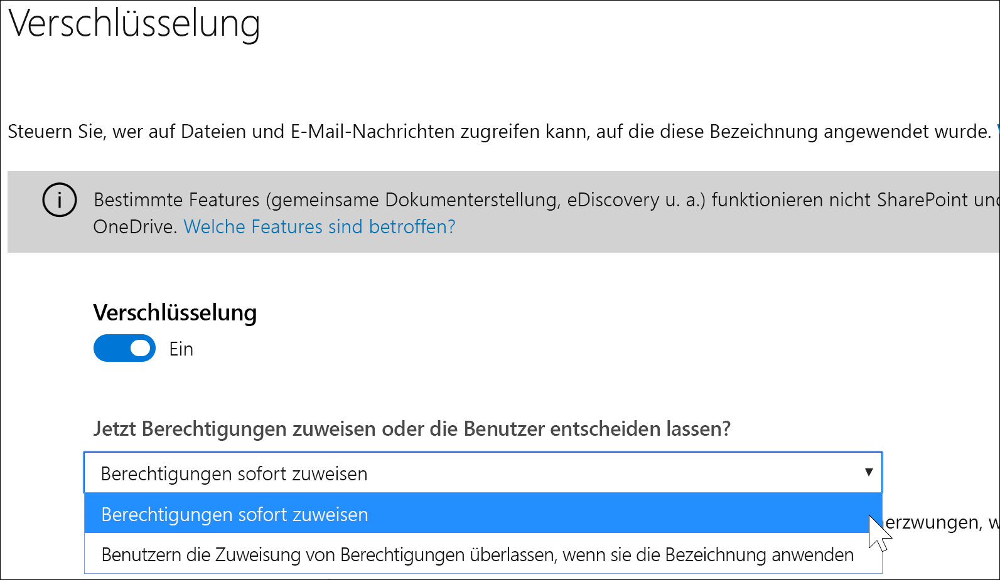
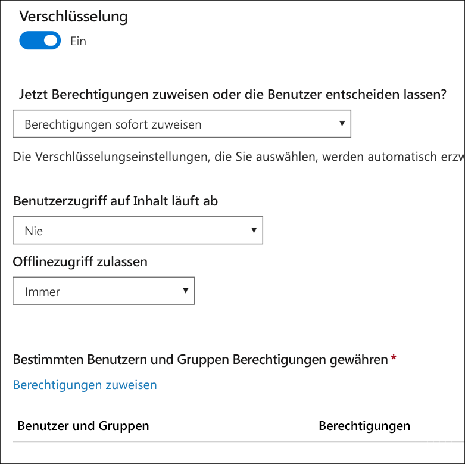
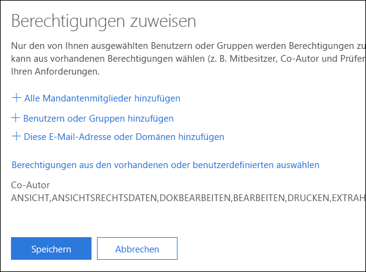
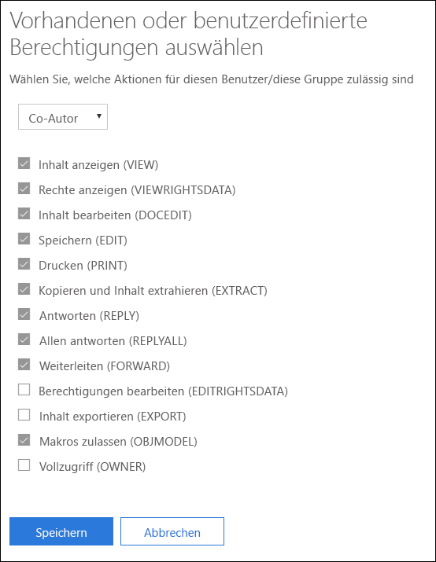
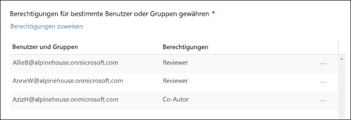
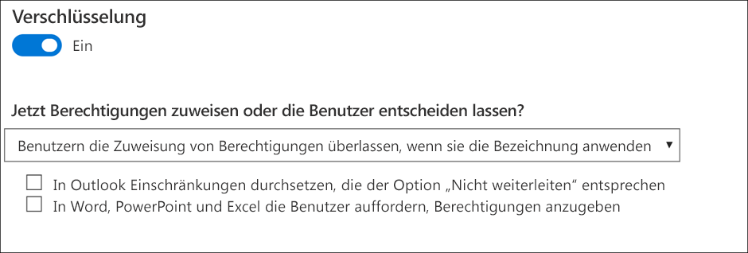
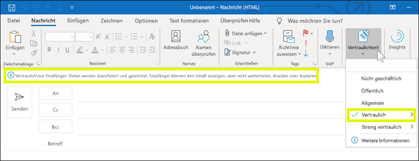
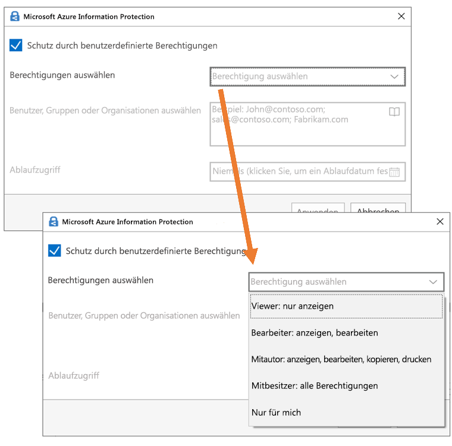

# Einschränken des Zugriffs auf Inhalte mithilfe der Verschlüsselung in VertraulichkeitsbezeichnungenRestrict access to content by using encryption in sensitivity labels

Wenn Sie eine Vertraulichkeitsbezeichnung erstellen, können Sie den Zugriff auf Inhalte beschränken, auf die die Bezeichnung angewendet wird. Mit den Verschlüsselungseinstellungen für eine Vertraulichkeitsbezeichnung können Sie beispielsweise Inhalte so schützen, dass:When you create a sensitivity label, you can restrict access to content that the label will be applied to. For example, with the encryption settings for a sensitivity label, you can protect content so that:

- Nur Benutzer in Ihrer Organisation ein vertrauliches Dokument oder vertrauliche E-Mails öffnen können.Only users within your organization can open a confidential document or email.
- Nur Benutzer in der Marketingabteilung das Ankündigungsdokument oder die Ankündigungs-E-Mail für die Werbeaktion bearbeiten und drucken können, während alle anderen Benutzer in der Organisation dieses Dokument oder diese E-Mail nur lesen können.Only users in the marketing department can edit and print the promotion announcement document or email, while all other users in your organization can only read it.
- Benutzer eine E-Mail nicht weiterleiten oder Informationen daraus kopieren können, die Neuigkeiten zur internen Neuorganisation enthalten.Users cannot forward an email or copy information from it that contains news about an internal reorganization.
- Die aktuelle Preisliste, die an Geschäftspartner gesendet wird, kann nach einem angegebenen Datum nicht geöffnet werden.The current price list that is sent to business partners cannot be opened after a specified date.

Wenn ein Dokument oder eine E-Mail verschlüsselt ist, wird Zugriff auf den Inhalt so eingeschränkt, dass:When a document or email is encrypted, access to the content is restricted, so that it:

- Er nur von Benutzern entschlüsselt werden kann, die durch die Verschlüsselungseinstellungen der Bezeichnung dazu autorisiert sind.Can be decrypted only by users authorized by the label’s encryption settings.
- Er immer verschlüsselt bleibt, unabhängig davon, wo er sich befindet (innerhalb oder außerhalb der Organisation), auch dann, wenn die Datei umbenannt wird.Remains encrypted no matter where it resides, inside or outside your organization, even if the file’s renamed.
- Er sowohl im Ruhezustand (z. B. in einem OneDrive-Konto) als auch während der Übertragung (z. B. eine gesendete E-Mail) verschlüsselt ist.Is encrypted both at rest (for example, in a OneDrive account) and in transit (for example, a sent email).

Als Administrator können Sie beim Erstellen einer Vertraulichkeitsbezeichnung eine der folgenden Optionen auswählen:Finally, as an admin, when you create a sensitivity label, you can choose either to:

- **Berechtigungen sofort zuweisen**, um genau zu bestimmen, welche Benutzer welche Berechtigungen für Inhalte mit dieser Bezeichnung erhalten.**Assign permissions now**, so that you determine exactly which users get which permissions to content with that label.
- **Benutzern die Zuweisung von Berechtigungen überlassen**, wenn sie die Bezeichnung auf Inhalte anwenden.**Let users assign permissions** when they apply the label to content. Auf diese Weise ermöglichen Sie Personen in Ihrer Organisation eine gewisse Flexibilität, die sie möglicherweise benötigen, um untereinander zusammenarbeiten und ihre Aufgaben erfüllen zu können.This way, you can allow people in your organization some flexibility that they might need to collaborate and get their work done.

Die Verschlüsselungseinstellungen sind verfügbar, wenn Sie eine Vertraulichkeitzbezeichnung im Microsoft 365 Compliance Center, Microsoft 365 Security Center oder Office 365 Security & Compliance Center erstellen.The encryption settings are available when you create a sensitivity label in the Microsoft 365 compliance center, Microsoft 365 security center, or Office 365 Security & Compliance Center. Wählen Sie im linken Navigationsbereich **Klassifizierung** > **Vertraulichkeitsbezeichnung** > **Bezeichnung erstellen** aus.In the left nav, choose **Classification** > **Sensitivity label** > **Create a label**.

## Funktionsweise der VerschlüsselungHow encryption works

Die Verschlüsselung verwendet Azure Rights Management (Azure RMS). Azure RMS verwendet Verschlüsselungs-, Identitäts- und Autorisierungsrichtlinien. Weitere Informationen hierzu finden Sie unter [Was ist Azure Rights Management?](https://docs.microsoft.com/de-DE/azure/information-protection/what-is-azure-rms)Encryption uses Azure Rights Management (Azure RMS). Azure RMS uses encryption, identity, and authorization policies. To learn more, see [What is Azure Rights Management?](https://docs.microsoft.com/de-DE/azure/information-protection/what-is-azure-rms)

## Aktivieren der Verschlüsselung für eine VertraulichkeitsbezeichnungHow to turn on encryption for a sensitivity label

Setzen Sie zunächst **Verschlüsselung** auf **Ein**, und wählen Sie dann eine der folgenden Optionen aus:To begin, simply toggle **Encryption** to **On**, and then choose whether to:

- **Berechtigungen sofort zuweisen**, damit Sie genau bestimmen können, welche Benutzer welche Berechtigungen für Inhalte mit dieser Bezeichnung erhalten.**Assign permissions now**, so that you can determine exactly which users get which permissions to content with that label. Weitere Informationen hierzu finden Sie im nächsten Abschnitt [Berechtigungen sofort zuweisen](#assign-permissions-now).For more information, see the next section.
- **Benutzern die Zuweisung von Berechtigungen überlassen**, wenn sie die Bezeichnung auf Inhalte anwenden.**Let users assign permissions** when they apply the label to content. Auf diese Weise ermöglichen Sie Personen in Ihrer Organisation eine gewisse Flexibilität, die sie möglicherweise benötigen, um untereinander zusammenarbeiten und ihre Aufgaben erfüllen zu können.This way, you can allow people in your organization some flexibility that they might need to collaborate and get their work done. Weitere Informationen hierzu finden Sie weiter unten im Abschnitt [Benutzern die Zuweisung von Berechtigungen überlassen](#let-users-assign-permissions).For more information, see the below section [Let users assign permissions](#let-users-assign-permissions).

Liegt beispielsweise eine Vertraulichkeitsbezeichnung namens **Streng vertraulich** vor, die auf Ihre vertraulichsten Inhalte angewendet wird, können Sie jetzt festlegen, wer welche Art von Berechtigungen für diese Inhalte erhält.For example, if you have a sensitivity label named **Highly Confidential** that will be applied to your most sensitive content, you may want to decide now who gets what type of permissions to that content.

Wenn Sie hingegen über eine Vertraulichkeitsbezeichnung namens **Geschäftsverträge** verfügen und der Workflow in Ihrer Organisation erfordert, dass Ihre Mitarbeiter mit anderen Personen auf Ad-hoc-Basis an diesen Inhalten zusammenarbeiten, können Sie zulassen, dass Ihre Benutzer jeweils entscheiden, wer eine Berechtigung erhält, wenn sie diese Bezeichnung zuweisen.Alternatively, if you have a sensitivity label named **Business Contracts**, and your organization's workflow requires that your people collaborate on this content with different people on an ad hoc basis, you may want to allow your users to decide who gets permissions when they assign the label. Diese Flexibilität fördert die Produktivität Ihrer Benutzer und verringert die Anfragen an Ihre Administratoren, Vertraulichkeitsbezeichnungen für spezifische Szenarios zu erstellen oder zu aktualisieren.This flexibility both helps your users' productivity and reduces the requests for your admins to update or create new sensitivity labels to address specific scenarios.

## Berechtigungen sofort zuweisenAssign permissions now

Steuern Sie über die folgenden Optionen, wer auf E-Mails oder Dokumente zugreifen kann, auf die eine bestimmte Bezeichnung angewendet wurde.To begin, simply toggle Encryption to On, and then use the options below to control who can access email or documents to which this label is applied. You can: Sie haben folgende Möglichkeiten:You can:

1. **Verschlüsselung sowohl auf E-Mails als auch auf Dokumente oder nur auf E-Mails anwenden** Wenn Sie sich nur für E-Mails entscheiden, werden Nachrichten mit dieser Bezeichnung in Outlook verschlüsselt, aber Dokumente mit dieser Bezeichnung werden in anderen Apps wie Word oder PowerPoint nicht verschlüsselt.**Apply encryption to both email and documents, or just email.** If you choose just email, messages with this label will be encrypted in Outlook, but documents with this label won't be encrypted in other apps, such as Word or PowerPoint. 
2. **Zulassen, dass Zugriff auf gekennzeichnete Inhalte abläuft**, entweder an einem bestimmten Datum oder nach einer bestimmten Anzahl von Tagen, nachdem die Bezeichnung angewendet wurde. Nach dieser Zeit können Benutzer das gekennzeichnete Element nicht mehr öffnen. Wenn Sie ein Datum angeben, gilt dieses ab Mitternacht an diesem Tag in Ihrer aktuellen Zeitzone. (Beachten Sie, dass einige E-Mail-Clients aufgrund ihrer Cachingmechanismen den Ablauf nicht durchsetzen können und E-Mails anzeigen, deren Ablaufdatum überschritten ist.)**Allow access to labeled content to expire**, either on a specific date or after a specific number of days after the label is applied. After this time, users won’t be able to open the labeled item. If you specify a date, it is effective midnight on that date in your current time zone. (Note that some email clients may not enforce expiration and show emails past their expiration date, due to their caching mechanisms.)
3. **Offlinezugriff zulassen** entweder „niemals“, „immer“ oder für eine bestimmte Anzahl von Tagen, nachdem die Bezeichnung angewendet wurde. Wenn Sie den Offlinezugriff jedoch auf „nie“ oder eine Anzahl von Tagen einschränken, müssen Benutzer erneut authentifiziert werden, und ihr Zugriff wird protokolliert. Weitere Informationen finden Sie im nächsten Abschnitt zur Verwendungslizenz von Rights Management.**Allow offline access** never, always, or for a specific number of days after the label is applied. If you restrict offline access to never or a number of days, when that threshold is reached, users must be reauthenticated and their access is logged. For more information, see the next section on the Rights Management use license.

### Rights Management-Verwendungslizenz für den OfflinezugriffRights Management use license for offline access

Wenn ein Benutzer ein Dokument oder eine E-Mail, das bzw. die durch eine Vertraulichkeitsbezeichnung geschützt ist, offline öffnet, wird dem Benutzer eine Rights Management-Verwendungslizenz für diese Inhalte gewährt. Diese Verwendungslizenz ist ein Zertifikat, das die Nutzungsrechte des Benutzers für das Dokument oder die E-Mail sowie den Verschlüsselungsschlüssel enthält, der für die Verschlüsselung des Inhalts verwendet wurde. Die Verwendungslizenz enthält auch ein Ablaufdatum, wenn eines festgelegt wurde, und eine Angabe, wie lange die Verwendungslizenz gültig ist.When a user opens a document or email offline that’s been protected by a sensitivity label, an Azure Rights Management use license for that content is granted to the user. This use license is a certificate that contains the user's usage rights for the document or email, and the encryption key that was used to encrypt the content. The use license also contains an expiration date if this has been set, and how long the use license is valid.

Wenn kein Ablaufdatum festgelegt wurde, beträgt die Standardeinstellung für die Gültigkeitsdauer der Verwendungslizenz für einen Mandanten 30 Tage. Für die Dauer der Verwendungslizenz muss der Benutzer nicht erneut authentifiziert oder für den Inhalt erneut autorisiert werden. Auf diese Weise kann der Benutzer das geschützte Dokument oder die geschützte E-Mail weiterhin ohne Internetverbindung öffnen. Wenn der Gültigkeitszeitraum für die Verwendungslizenz abläuft, muss der Benutzer beim nächsten Zugriff auf das geschützte Dokument oder die geschützte E-Mail erneut authentifiziert und erneut autorisiert werden.If no expiration date has been set, the default use license validity period for a tenant is 30 days. For the duration of the use license, the user is not reauthenticated or reauthorized for the content. This lets the user continue to open the protected document or email without an Internet connection. When the use license validity period expires, the next time the user accesses the protected document or email, the user must be reauthenticated and reauthorized.

Neben der erneuten Authentifizierung wird auch die Richtlinien- und die Benutzergruppenmitgliedschaft erneut bewertet. Dies bedeutet, dass bei Benutzern unterschiedliche Zugriffsergebnisse für dasselbe Dokument oder dieselbe E-Mail auftreten könnten, wenn es seit dem letzten Zugriff auf den Inhalt Änderungen in der Richtlinien- oder Gruppenmitgliedschaft gab.In addition to reauthentication, the policy and user group membership is reevaluated. This means that users could experience different access results for the same document or email if there are changes in the policy or group membership from when they last accessed the content.

Informationen zum Ändern der Standardeinstellung von 30 Tagen finden Sie unter [Rights Management-Verwendungslizenz](https://docs.microsoft.com/de-DE/azure/information-protection/configure-usage-rights#rights-management-use-license).To learn how to change the default 30-day setting, see [Rights Management use license](https://docs.microsoft.com/de-DE/azure/information-protection/configure-usage-rights#rights-management-use-license).

### Zuweisen von Berechtigungen für bestimmte Benutzer oder GruppenAssign permissions to specific users or groups

Sie können bestimmten Personen Berechtigungen erteilen, sodass nur sie mit dem gekennzeichneten Inhalt interagieren können.You can grant permissions to specific people so that only they can interact with the labeled content.

Dies ist ein schneller und einfacher Prozess in zwei Schritten:Doing so is a straightforward two-step process:

1. Zuerst fügen Sie Benutzer oder Gruppen hinzu, denen Berechtigungen für gekennzeichnete Inhalte erteilt werden.First you add users or groups that will be assigned permissions to the labeled content.
2. Dann wählen Sie die Berechtigungen aus, die diese Benutzer für die gekennzeichneten Inhalte haben.Then you choose which permissions those users have for the labeled content.

#### Hinzufügen von Benutzern und GruppenAdd users or groups

Wenn Sie Berechtigungen zuweisen, können Sie folgende Optionen auswählen:When you assign permissions, you can choose:

- Jeder in Ihrem Unternehmen (alle Mandantenmitglieder). Diese Einstellung schließt Gastkonten aus.Everyone in your organization (all tenant members). This setting excludes guest accounts.
- Bestimmte Benutzer oder E-Mail-aktivierte Sicherheitsgruppen, Verteilergruppen, Office 365-Gruppen oder dynamische Verteilergruppen.Any specific user or email-enabled security group, distribution group, Office 365 group, or dynamic distribution group. 
- Eine E-Mail-Adresse oder Domäne außerhalb Ihrer Organisation, z. B. gmail.com, outlook.com oder hotmail.com.Any email address or domain outside your organization, such as gmail.com, hotmail.com, or outlook.com.

Wenn Sie alle Mandantenmitglieder auswählen oder das Verzeichnis durchsuchen, müssen die Benutzer oder Gruppe eine E-Mail-Adresse aufweisen.When you choose all tenant members or browse the directory, the users or groups must have an email address.

Als bewährte Methode sollten Sie besser Gruppen anstelle von Benutzern verwenden. Dadurch wird die Konfiguration einfacher.As a best practice, use groups rather than users. This strategy keeps your configuration simpler.

#### Berechtigungen auswählenChoose permissions

Wenn Sie die Berechtigungen für diese Benutzer oder Gruppen auswählen, können Sie folgende Optionen auswählen:When you choose which permissions to allow for those users or groups, you can select either:

- Eine [vordefinierte Berechtigungsstufe](https://docs.microsoft.com/de-DE/azure/information-protection/configure-usage-rights#rights-included-in-permissions-levels) mit einer bereits festgelegten Gruppen von Rechten, z. B. Mitverfasser oder Überprüfer.A [predefined permissions level](https://docs.microsoft.com/de-DE/azure/information-protection/configure-usage-rights#rights-included-in-permissions-levels) with a preset group of rights, such as Co-Author or Reviewer.
- Eine benutzerdefinierte Gruppe von Berechtigungen, aus der Sie beliebige Berechtigungen auswählen können.A Custom group of rights, where you choose whichever permissions you want.

Weitere Informationen zu den einzelnen Berechtigungen finden Sie unter [Nutzungsrechte und Beschreibungen](https://docs.microsoft.com/de-DE/azure/information-protection/configure-usage-rights#usage-rights-and-descriptions).For more information on each specific permission, see [Usage rights and descriptions](https://docs.microsoft.com/de-DE/azure/information-protection/configure-usage-rights#usage-rights-and-descriptions).  

Beachten Sie, dass dieselbe Bezeichnung unterschiedlichen Benutzern unterschiedliche Berechtigungen erteilen kann. Eine einzelne Bezeichnung kann beispielsweise einige Benutzer als „Überprüfer“ und einen anderen Benutzer als „Mitverfasser“ zuweisen, wie nachfolgend dargestellt.Note that the same label can grant different permissions to different users. For example, a single label can assign some users as Reviewer and a different user as Co-author, as shown below.

Weisen Sie hierfür Benutzern und Gruppen Berechtigungen zu, und speichern Sie die Einstellungen. Wiederholen Sie dann diese Schritte, und fügen Sie jedes Mal Benutzer hinzu, weisen diesen Berechtigungen zu, und speichern die Einstellungen. Sie können dies so oft wie erforderlich wiederholen, um unterschiedliche Berechtigungen für unterschiedliche Benutzer zu definieren.To do this, add users or groups, assign them permissions, and save those settings. Then repeat these steps, adding users and assigning them permissions, saving the settings each time. You can do this as often as necessary, to define different permissions for different users.

#### Rights Management-Aussteller (Benutzer, der die Vertraulichkeitsbezeichnung anwendet) hat immer VollzugriffRights Management issuer (user applying the sensitivity label) always has Full Control

Die Verschlüsselung für eine Vertraulichkeitsbezeichnung verwendet Azure RMS. Wenn ein Benutzer eine Vertraulichkeitsbezeichnung anwendet, um ein Dokument oder eine E-Mail mithilfe von Azure RMS zu schützen, wird dieser Benutzer der Rights Management-Aussteller für diesen Inhalt.Encryption for a sensitivity label uses Azure RMS. When a user applies a sensitivity label to protect a document or email by using Azure RMS, that user becomes the Rights Management issuers for that content.

Der Rights Management-Aussteller erhält immer Vollzugriff für das Dokument oder die E-Mail. Außerdem gilt:The Rights Management issuer is always granted Full Control permissions for the document or email, and in addition:

- Wenn die Schutzeinstellungen ein Ablaufdatum umfassen, kann der Rights Management-Aussteller das Dokument oder die E-Mail nach diesem Datum immer noch öffnen und bearbeiten.If the protection settings include an expiration date, the Rights Management issuer can still open and edit the document or email after that date.
- Der Rights Management-Aussteller kann immer offline auf das Dokument oder die E-Mail zugreifen.The Rights Management issuer can always access the document or email offline.
- Der Rights Management-Aussteller kann ein Dokument weiterhin öffnen, nachdem es gesperrt wurde.The Rights Management issuer can still open a document after it is revoked.

Weitere Informationen finden Sie unter [Rights Management-Aussteller und Rights Management-Besitzer](https://docs.microsoft.com/de-DE/azure/information-protection/configure-usage-rights#rights-management-issuer-and-rights-management-owner).For more information, see [Rights Management issuer and Rights Management owner](https://docs.microsoft.com/de-DE/azure/information-protection/configure-usage-rights#rights-management-issuer-and-rights-management-owner).

## Benutzern die Zuweisung von Berechtigungen überlassenLet users assign permissions

Sie können mithilfe dieser Optionen Benutzern erlauben, Berechtigungen zuzuweisen, wenn sie eine Vertraulichkeitsbezeichnung manuell auf Inhalte anwenden:You can use these options to let users assign permissions when they manually apply a sensitivity label to content:

- In Outlook kann ein Benutzer Einschränkungen durchsetzen, die der Option **Nicht weiterleiten** entsprechen.In Outlook, a user can enforce restrictions equivalent to the **Do Not Forward** option. Diese Option wird in Outlook unter Windows systemintern unterstützt und erfordert keine Installation des Azure Information Protection-Clients für einheitliche Bezeichnungen.This option is supported natively in Outlook on Windows, and does not require you to install the Azure Information Protection unified labeling client.
- In Word, PowerPoint und Excel wird ein Benutzer aufgefordert, eine Berechtigungsstufe für bestimmte Benutzer, Gruppen oder Organisationen auszuwählen.In Word, PowerPoint, and Excel, a user is prompted to select a permission level for specific users, groups, or organizations. Diese Option wird in diesen Office-Apps nicht systemintern unterstützt, Ihre Benutzer müssen deshalb den Azure Information Protection-Client für einheitliche Bezeichnungen installieren.This option is not supported natively in these Office apps, so your users must install the Azure Information Protection unified labeling client.

Durch diese Optionen wird festgelegt, in welchen Apps die Vertraulichkeitsbezeichnung angezeigt wird:These options determine in which apps the sensitivity label will appear:

- Wenn für die Vertraulichkeitsbezeichnung nur die Option "Outlook" aktiviert ist, wird die Bezeichnung den Benutzern nur in Outlook angezeigt.If the sensitivity label has only the Outlook option enabled, the label will appear to users only in Outlook.
- Wenn für die Vertraulichkeitsbezeichnung nur die Optionen "Word", "PowerPoint" und "Excel" aktiviert sind, wird die Bezeichnung nur in diesen Apps angezeigt.If the sensitivity label has only the Word, PowerPoint, and Excel option enabled, the label will appear to users only in those apps.
- Wenn für die Vertraulichkeitsbezeichnung beide Optionen aktiviert sind, wird die Bezeichnung den Benutzern in allen verfügbaren Apps angezeigt: Outlook, Word, PowerPoint und Excel.If the sensitivity label has both options enabled, the label will appear to users in all of the available apps: Outlook, Word, PowerPoint, and Excel.

Eine Vertraulichkeitsbezeichnung, bei der Benutzer Berechtigungen zuweisen können, kann nur manuell von Benutzern angewendet werden. Sie kann nicht automatisch angewendet oder als empfohlene Bezeichnung genutzt werden.A sensitivity label that lets users assign permissions can be applied to content only manually by users; it can't be auto-applied or used as a recommended label.

> [!NOTE]
> Das Zulassen der Zuweisung von Berechtigungen durch Benutzer erfordert ein Azure Information Protection-Abonnement.Letting users assign permissions requires an Azure Information Protection subscription. Wenn Sie dieses Feature in Word, PowerPoint und Excel verwenden möchten, müssen Sie den [Azure Information Protection-Client für einheitliche Bezeichnungen](https://docs.microsoft.com/azure/information-protection/rms-client/install-unifiedlabelingclient-app) herunterladen und installieren.To use this feature in Word, PowerPoint, and Excel, you must download and install the [Azure Information Protection unified labeling client](https://docs.microsoft.com/azure/information-protection/rms-client/install-unifiedlabelingclient-app). Wir arbeiten an der systeminternen Unterstützung dieses Features in diesen Office-Apps, sodass Sie dafür nicht den Azure Information Protection-Client benötigen.We're working on native support for this feature in these Office apps, so that they won't require the Azure Information Protection client. Außerdem kann der Client nur unter Windows ausgeführt werden, sodass dieses Feature unter Mac, iOS, Android oder Office im Web noch nicht unterstützt wird.Also, the client runs only on Windows, so this feature is not yet supported on Mac, iOS, Android, or Office for the web.

### Einschränkungen in OutlookOutlook restrictions

Wenn ein Benutzer in Outlook eine Vertraulichkeitsbezeichnung anwendet, die ihm das Zuweisen von Berechtigungen für eine Nachricht gestattet, entsprechen die Einschränkungen der Option "Nicht weiterleiten".In Outlook, when a user applies a sensitivity label that lets them assign permissions to a message, the restrictions are the same as the Do Not Forward option. Der Benutzer sieht oben in der Nachricht den Namen und die Beschreibung der Bezeichnung, die den Inhalt als geschützt ausweist.The user will see the label name and description at the top of the message, which indicates the content's being protected. Anders als in Word, PowerPoint und Excel (mehr dazu im [nächsten Abschnitt](#word-powerpoint-and-excel-permissions)) werden die Benutzer hier nicht aufgefordert, bestimmte Berechtigungen auszuwählen.Unlike Word, PowerPoint, and Excel (see the [next section](#word-powerpoint-and-excel-permissions)), users aren't prompted to select specific permissions.

Wenn die Option "Nicht weiterleiten" auf eine E-Mail angewendet wird, wird diese E-Mail verschlüsselt und die Empfänger müssen authentifiziert werden.When the Do Not Forward option is applied to an email, the email is encrypted and recipients must be authenticated. Die Empfänger können dann die Nachricht nicht weiterleiten, drucken oder kopieren.Then, the recipients cannot forward it, print it, or copy from it. Wenn beispielsweise im Outlook-Client die Schaltfläche "Weiterleiten" nicht verfügbar ist, sind die Menüoptionen "Speichern unter" und "Drucken" ebenfalls nicht verfügbar, und Sie können in den Feldern "An", CC oder Bcc keine Empfänger hinzufügen oder ändern.For example, in the Outlook client, the Forward button is not available, the Save As and Print menu options are not available, and you cannot add or change recipients in the To, Cc, or Bcc boxes.

Für ungeschützte Office-Dokumente, die sich im Anhang der E-Mail befinden, werden automatisch die gleichen Beschränkungen übernommen.Unprotected Office documents that are attached to the email automatically inherit the same restrictions. Die für diese Dokumente geltenden Nutzungsrechte sind "Inhalt bearbeiten", "Bearbeiten", "Speichern", "Anzeigen", "Öffnen", "Lesen" und "Makros zulassen".The usage rights applied to these documents are Edit Content, Edit; Save; View, Open, Read; and Allow Macros. Wenn der Benutzer andere Nutzungsrechte für eine Anlage wünscht, oder wenn es sich bei der Anlage nicht um ein Office-Dokument handelt, das die Vererbung des Schutzes unterstützt, muss der Benutzer die Datei schützen, bevor er sie an die E-Mail anfügt.If the user wants different usage rights for an attachment, or the attachment is not an Office document that supports this inherited protection, the user needs to protect the file before attaching it to the email.

### Berechtigungen in Word, PowerPoint und ExcelWord, PowerPoint, and Excel permissions

Wenn ein Benutzer in Word, PowerPoint oder Excel eine Vertraulichkeitsbezeichnung anwendet, die ihm das Zuweisen von Berechtigungen für ein Dokument gestattet, wird er aufgefordert, den Inhalt wie nachstehend beschrieben zu schützen.In Word, PowerPoint, and Excel, when a user applies a sensitivity label that lets them assign permissions to a document, they are prompted to protect the content as shown below.

Er hat folgende Möglichkeiten:The user can modify records.

- Er kann eine Berechtigungsstufe auswählen, z. B. "Betrachter" (dadurch wird nur die Berechtigung "Nur anzeigen" zugewiesen) oder "Mitautor" (mit Berechtigungen zum "Anzeigen", "Bearbeiten", "Kopieren" und "Drucken").Select a permission level, such as Viewer (which assigns View Only permission) or Co-Author (which assigns View, Edit, Copy, and Print permissions).
- Er kann Benutzer, Gruppen oder Organisationen auswählen.Select users, groups, or organizations. Dies kann Personen innerhalb und außerhalb Ihrer Organisation umfassen.This can include people both inside or outside your organizations.
- Er kann ein Ablaufdatum festlegen, nach dem die ausgewählten Benutzer nicht mehr auf die betreffenden Inhalte zugreifen können.Set an expiration date, after which the selected users cannot access the content. Weitere Informationen finden Sie im vorstehenden Abschnitt [Rights Management-Verwendungslizenz für den Offlinezugriff](#rights-management-use-license-for-offline-access).For more information, see the above section [Rights Management use license for offline access](#rights-management-use-license-for-offline-access).

## Was mit einer vorhandenen Verschlüsselung geschieht, wenn eine Bezeichnung angewendet wirdWhat happens to existing encryption when a label's applied

Bevor eine Vertraulichkeitsbezeichnung auf Inhalte angewendet wird, ist es möglich, dass ein Benutzer die Inhalte durch Anwenden einer anderen Schutzeinstellung bereits verschlüsselt hat.Before a sensitivity label is applied to content, it's possible that a user already encrypted the content by applying some other protection setting. Ein Benutzer kann beispielsweise Folgendes angewendet haben:For example, a user might have applied:

- Die Option **Nicht weiterleiten**.The **Do Not Forward** option.
- Benutzerdefinierten Schutz mithilfe des Azure Information Protection-Clients mit einheitlichen Bezeichnungen.Custom protection by using the Azure Information Protection unified labeling client.
- Eine RMS-Vorlage (Rights Management Service), die die Inhalte verschlüsselt, aber keiner Bezeichnung zugewiesen ist.An Azure Rights Management Service (RMS) template that encrypts the content but is not associated with a label.

In dieser Tabelle wird beschrieben, was mit einer vorhandenen Verschlüsselung geschieht, wenn eine Vertraulichkeitsbezeichnung auf diese Inhalte angewendet wird.This table describe what happens to existing encyption when a sensitivity label is applied to that content.
 
 

| |**Benutzer wendet eine Vertraulichkeitsbezeichnung bei deaktivierter Verschlüsselung an****User applies a sensitivity label with encryption turned off**|**Benutzer wendet eine Vertraulichkeitsbezeichnung bei aktivierter Verschlüsselung an****User applies a sensitivity label with encryption turned on**|**Benutzer wendet eine Bezeichnung mit „Schutz entfernen“ an**1**User applies a label with Remove Protection**1|
|:-----|:-----|:-----|:-----|
|**Nicht weiterleiten****Do Not Forward**|E-Mail – Schutz wird entfernt.Email - Protection is removed Dokument – Schutz wird beibehalten.Document - Protection is preserved|Bezeichnungsschutz wird angewendet.Label protection is applied|**Nicht weiterleiten** wird entfernt.**Do Not Forward** is removed|
|**Benutzerdefinierter Schutz**1**Custom protection**1|Schutz wird beibehalten.Protection is preserved|Bezeichnungsschutz wird angewendet.Label protection is applied|Benutzerdefinierter Schutz wird entfernt.Custom protection is removed|
|**Azure RMS-Vorlage****Azure RMS template**|Schutz wird beibehalten.Protection is preserved|Bezeichnungsschutz wird angewendet.Label protection is applied|Benutzerdefinierter Schutz wird entfernt.Custom protection is removed|

1Dies wird nur im Azure Information Protection-Bezeichnungsclient unterstützt.1This is supported only in the Azure Information Protection labeling client.

## Speichern von verschlüsselten Inhalten in OneDrive und SharePointStoring encrypted content in OneDrive and SharePoint

Wenn Verschlüsselung auf Dateien in OneDrive und SharePoint angewendet wird, kann der Dienst den Inhalt dieser Dateien nicht verarbeiten. Dies bedeutet, das Features wie Gemeinsame Dokumenterstellung, eDiscovery, Suche, Delve und andere Features für die Zusammenarbeit nicht funktionieren. DLP-Richtlinien können nur für Metadaten (einschließlich Office 365-Bezeichnungen) angewendet werden, aber nicht für den Inhalt verschlüsselter Dateien (z. B. Kreditkartennummern in Dateien) verwendet werden.Be aware that when encryption is applied to files stored in OneDrive and SharePoint, the service cannot process the contents of these files. This means that features such as co-authoring, eDiscovery, search, Delve, and other collaborative features do not work. Also, data loss prevention (DLP) policies can work only with the metadata (including Office 365 labels) but not the contents of encrypted files (such as credit card numbers within files).

Dies gilt nur für Inhalte, die in OneDrive und SharePoint gespeichert sind. In Exchange Online verwenden E-Mail-Flussregeln (auch als Transportregeln bezeichnet) das [Administratorkonto](https://docs.microsoft.com/de-DE/azure/information-protection/configure-super-users), damit sie verschlüsselte Inhalte überprüfen und DLP-Richtlinien erzwingen können.This applies only to content stored in OneDrive and SharePoint. In Exchange Online, mail flow rules (also known as transport rules) use the [super user account](https://docs.microsoft.com/de-DE/azure/information-protection/configure-super-users) so that they can scan encrypted content and enforce DLP policies.

## Wichtige VoraussetzungenImportant prerequisites

Bevor Sie Verschlüsselung verwenden können, müssen Sie möglicherweise die folgenden Aufgaben ausführen.Before you can use encryption, you might need to perform these tasks.

### Aktivieren von Azure Rights ManagementActivating Azure Rights Management

Um die Verschlüsselung in Vertraulichkeitbezeichnungen zu verwenden, muss in Ihrem Mandanten Azure Rights Management aktiviert werden. In neuen Mandanten ist dieser Dienst standardmäßig aktiviert, aber Sie müssen ihn möglicherweise manuell einschalten. Weitere Informationen finden Sie unter [Aktivieren von Azure Rights Management](https://docs.microsoft.com/de-DE/azure/information-protection/activate-service).To use encryption in sensitivity labels, the Azure Rights Management service needs to be activated in your tenant. In newer tenants, the service is on by default, but you might need to manually activate the service. For more information, see [Activating Azure Rights Management](https://docs.microsoft.com/de-DE/azure/information-protection/activate-service).

### Konfigurieren von Exchange für Azure Information ProtectionConfigure Exchange for Azure Information Protection

Exchange muss nicht für Azure Information Protection konfiguriert werden, damit Benutzer Bezeichnungen in Outlook anwenden können, um E-Mails zu schützen. Bis Exchange aber für Azure Information Protection konfiguriert ist, können Sie nicht den vollen Funktionsumfang des Azure Information Protection-Schutzes in Exchange nutzen.Exchange does not have to be configured for Azure Information Protection before users can apply labels in Outlook to protect their emails. However, until Exchange is configured for Azure Information Protection, you do not get the full functionality of using Azure Rights Management protection with Exchange.
 
Benutzer können beispielsweise geschützte E-Mails nicht auf Mobiltelefonen oder mit Outlook im Web anzeigen, geschützte E-Mails können nicht für die Suche indexiert werden, und Sie können Exchange Online DLP nicht für den Rights Management-Schutz konfigurieren.For example, users cannot view protected emails on mobile phones or with Outlook on the web, protected emails cannot be indexed for search, and you cannot configure Exchange Online DLP for Rights Management protection. 

Um sicherzustellen, dass Exchange diese zusätzlichen Szenarien unterstützt, lesen Sie die folgenden Informationen:To ensure that Exchange can support these additional scenarios, see the following:

- Für Exchange Online lesen Sie die Anweisungen für [Exchange Online: Konfigurieren von IRM](https://docs.microsoft.com/de-DE/azure/information-protection/configure-office365#exchange-online-irm-configuration).For Exchange Online, see the instructions for [Exchange Online: IRM Configuration](https://docs.microsoft.com/de-DE/azure/information-protection/configure-office365#exchange-online-irm-configuration).
- For das lokale Exchange müssen Sie den [RMS-Connector bereitstellen und Ihre Exchange-Server konfigurieren](https://docs.microsoft.com/de-DE/azure/information-protection/deploy-rms-connector).For Exchange on-premises, you must deploy the [RMS connector and configure your Exchange servers](https://docs.microsoft.com/de-DE/azure/information-protection/deploy-rms-connector). 
