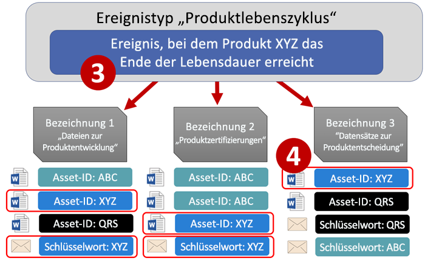
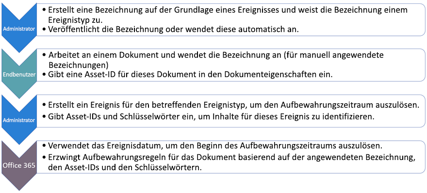
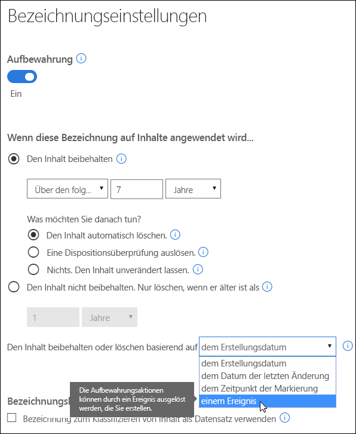
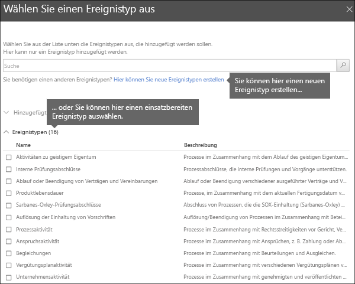
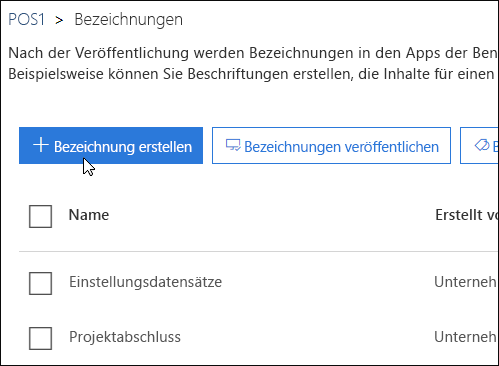
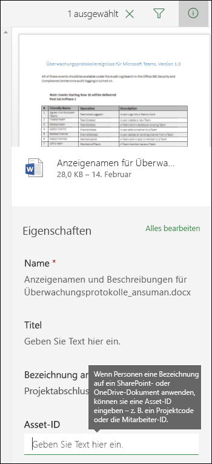
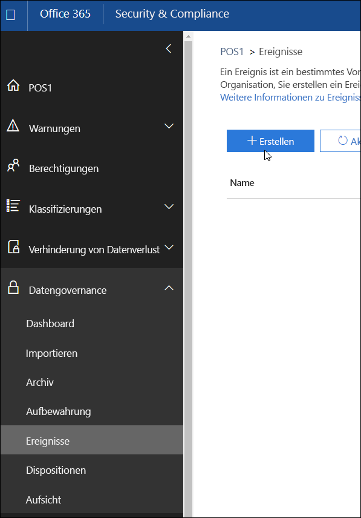
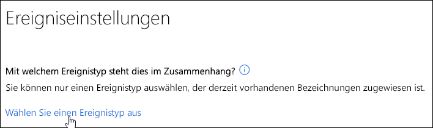
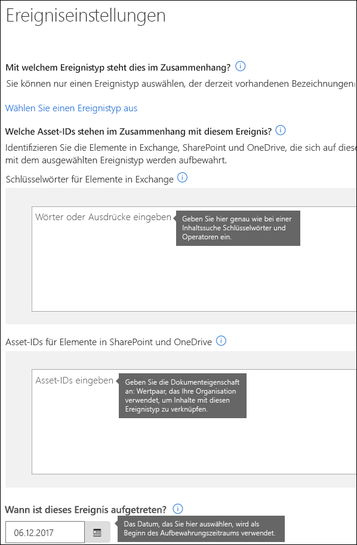

# Übersicht über die ereignisgesteuerte Aufbewahrung

Wenn Sie Inhalte aufbewahren, basiert der Aufbewahrungszeitraum häufig auf dem Alter des Inhalts. Sie bewahren Dokumente beispielsweise für sieben Jahre nach der Erstellung auf, und anschließend werden sie gelöscht. Mit Bezeichnungen in Office 365 können Sie jedoch auch einen Aufbewahrungszeitraum festlegen, der auf das Auftreten eines bestimmten Ereignistyps basiert. Das Ereignis löst den Beginn des Aufbewahrungszeitraums aus, und auf alle Inhalte, denen eine Bezeichnung für diesen Ereignistyp zugewiesen wurde, werden die Aufbewahrungsaktionen angewendet.
  
Sie können Bezeichnungen mit ereignisgesteuerter Aufbewahrung zum Beispiel in den folgenden Szenarien verwenden:
  
- **Mitarbeiter verlässt das Unternehmen** – Angenommen, dass Mitarbeiterdatensätze für 10 Jahre ab dem Zeitpunkt aufbewahrt werden müssen, an dem ein Mitarbeiter das Unternehmen verlässt. Nach Ablauf von 10 Jahren müssen alle Dokumente im Zusammenhang mit der Einstellung, der Leistung und der Beendigung des Arbeitsverhältnisses für diesen Mitarbeiter vernichtet werden. Das Ereignis, das den Aufbewahrungszeitraum von 10 Jahren auslöst, ist der Zeitpunkt, zu dem der Mitarbeiter die Organisation verlässt. 
    
- **Vertragsablauf** – Angenommen, alle Datensätze im Zusammenhang mit Verträgen müssen für fünf Jahre ab dem Zeitpunkt aufbewahrt werden, an dem der Vertrag abläuft. Das Ereignis, das den Aufbewahrungszeitraum von fünf Jahren auslöst, ist das Ablaufdatum des Vertrags. 
    
- **Produktlebensdauer** – Ihre Organisation hat möglicherweise Aufbewahrungspflichten, die sich auf das letzte Fertigungsdatum von Produkten für Inhalte wie technische Daten beziehen. In diesem Fall ist das Datum der letzte Fertigung das Ereignis, das den Aufbewahrungszeitraum auslöst. 
    
Die ereignisgesteuerte Aufbewahrung wird in der Regel als Teil eines Prozesses für die Datensatzverwaltung verwendet. Dies bedeutet:
  
- Bezeichnungen, die auf Ereignissen basieren, klassifizieren den Inhalt in der Regel auch als einen Datensatz. Weitere Informationen finden Sie unter [Verwenden der Inhaltssuche zum Suchen des gesamten Inhalts, auf den eine bestimmte Aufbewahrungsbezeichnung angewendet wurde](labels.md#using-content-search-to-find-all-content-with-a-specific-retention-label-applied-to-it).
    
- Ein Dokument, das als Datensatz deklariert wurde, dessen Ereignisauslöser jedoch noch nicht ausgelöst wurde, wird auf unbegrenzte Zeit beibehalten (Datensätze können nicht dauerhaft gelöscht werden), bis ein Ereignis den Aufbewahrungszeitraum des Dokuments auslöst.
    
- Bezeichnungen, die auf einem Ereignis basieren, lösen in der Regel am Ende des Aufbewahrungszeitraums eine Dispositionsprüfung aus, damit ein Datensatzverwalter den Inhalt manuell überprüfen und vernichten kann. Weitere Informationen finden Sie unter [Übersicht über Dispositionsprüfungen](disposition-reviews.md).
    
Eine ereignisbasierte Bezeichnung hat die gleichen Funktionen wie jede andere Bezeichnung in Office 365. Weitere Informationen hierzu finden Sie unter [Übersicht über Bezeichnungen](labels.md).
    
## Grundlegendes zur Beziehung zwischen Ereignistypen, Bezeichnungen, Ereignissen und Asset-IDs

Um die ereignisgesteuerte Aufbewahrung erfolgreich zu verwenden, müssen Sie die Beziehung zwischen Ereignistypen, Bezeichnungen, Ereignissen und Asset-IDs verstehen, wie hier gezeigt. Es folgt eine Erläuterung des Diagramms.
  

  

  
1. Sie erstellen Bezeichnungen für unterschiedliche Arten von Inhalten und ordnen sie dann einem Ereignistyp zu. Bezeichnungen für verschiedene Arten von Produktdateien und Datensätzen werden beispielsweise einem Ereignistyp mit der Bezeichnung „Product Lifetime“ zugeordnet, da diese Datensätze ab dem Ende des Produktlebenszyklus für zehn Jahre aufbewahrt werden müssen.
    
2. Benutzer (in der Regel Datensatzverwalter) wenden diese Bezeichnungen auf Inhalte an und geben für jedes Element eine Asset-ID ein (bei SharePoint- und OneDrive-Dokumenten). In diesem Beispiel ist die Asset-ID ein Produktname oder Code, der von der Organisation verwendet wird. So wird den Datensätzen der einzelnen Produkte eine Bezeichnung zugewiesen, und jeder Datensatz verfügt über eine Eigenschaft, die eine Asset-ID enthält. Das Diagramm stellt **alle Inhalte** für alle Produktdatensätze in einer Organisation dar, wobei jedes Element die Asset-ID des Produkts hat, dessen Datensatz es ist. 
    
3. „Product Lifetime“ ist der Ereignistyp. Ein bestimmtes Produkt, das das Ende seines Lebenszyklus erreicht, ist ein Ereignis. Wenn ein Ereignis dieses Typs auftritt (in diesem Fall, wenn ein Produkt das Ende seiner Lebensdauer erreicht), erstellen Sie ein Ereignis, das Folgendes angibt:
    
  - Eine Asset-ID (für SharePoint- und OneDrive-Dokumente)
    
  - Stichwörter (für Exchange-Elemente). In diesem Beispiel verwendet die Organisation einen Produktcode in Nachrichten, die Produktdatensätze beinhalten, sodass das Stichwort für Exchange-Elemente mit der Asset-ID für SharePoint- und OneDrive-Dokumente übereinstimmt.
    
  - Das Datum, an dem das Ereignis aufgetreten ist. Dieses Datum wird als Beginn des Aufbewahrungszeitraums verwendet. Dieses Datum kann nur das aktuelle Datum oder ein zukünftiges Datum sein, jedoch kein zurückliegendes Datum.
    
4. Nach dem Erstellen eines Ereignisses wird das Ereignisdatum mit den gesamten Inhalten synchronisiert, die über eine Bezeichnung mit diesem Ereignistyp verfügen und die die angegebene Asset-ID oder das Stichwort enthalten. Wie bei jeder anderen Bezeichnung kann diese Synchronisierung bis zu sieben Tage dauern. Im oben aufgeführten Diagramm wird für alle Elemente, die rot eingekreist sind, der Aufbewahrungszeitraum durch dieses Ereignis ausgelöst. Anderes ausgedrückt: Wenn dieses Produkt das Ende seiner Lebensdauer erreicht hat, löst das Ereignis den Aufbewahrungszeitraum für die Datensätze dieses Produkts aus.
    
Es ist wichtig, dass Sie Folgendes verstehen: Wenn Sie keine Asset-ID oder kein Stichwort für ein Ereignis angeben, wird für den **gesamten Inhalt** mit einer Bezeichnung für diesen Ereignistyp der Aufbewahrungszeitraums durch das Ereignis ausgelöst. Dies bedeutet, dass für alle Inhalte im oben aufgeführten Diagramm der Aufbewahrungszeitraum beginnen würde. Dies möglicherweise nicht das, was Sie beabsichtigen. 
  
Denken Sie zum Schluss auch daran, dass jede Bezeichnung eigene Aufbewahrungseinstellungen hat. In diesem Beispiel geben sie alle 10 Jahre an, es kann jedoch sein, dass ein Ereignis Bezeichnungen auslöst, die alle über einen anderen Aufbewahrungszeitraum verfügen.
  
## So richten Sie die ereignisgesteuerte Aufbewahrung ein

Nachfolgend ist der allgemeine Arbeitsablauf für eine ereignisgesteuerte Aufbewahrung aufgeführt. Ausführlichere Schritte finden Sie weiter unten.
  

  
### Schritt 1: Eine Bezeichnung erstellen, deren Aufbewahrungszeitraum auf einem Ereignis basiert

Wählen Sie im Security &amp; Compliance Center im linken Navigationsbereich unter **Klassifizierungen** die Option **Bezeichnungen** \> **Bezeichnung erstellen**.
  
Wenn Sie die Bezeichnung erstellen, aktivieren Sie die Aufbewahrung und wählen Sie die unten aufgeführte Option zum Beibehalten oder Löschen von Inhalt basierend auf einem Ereignis. Dies bedeutet, dass die Aufbewahrungseinstellungen erst in Schritt 5 wirksam werden, wenn Sie auf der Seite **Ereignisse** ein Ereignis erstellen. 
  
Beachten Sie, dass die ereignisgesteuerte Aufbewahrung in der Regel für Inhalte verwendet wird, die als Datensatz klassifiziert sind. Aus diesem Grund wählen Sie beim Erstellen von Bezeichnungen, die auf einem Ereignis basieren, in der Regel die Option **Bezeichnung zum Klassifizieren von Inhalt als "Datensatz" verwenden**.
  
Beachten Sie außerdem, dass für die ereignisgesteuerte Aufbewahrung Aufbewahrungseinstellungen erforderlich sind, die:
  
- den Inhalt beibehalten,
    
- den Inhalt automatisch löschen oder eine Dispositionsprüfung am Ende des Aufbewahrungszeitraums auslösen.
    

  
### Schritt 2: Einen Ereignistyps für die Bezeichnung auswählen

Nachdem Sie die Option ausgewählt haben, dass die Bezeichnung auf **einem Ereignis** basieren soll, wird in den Bezeichnungseinstellungen die Option zum **Auswählen eines Ereignistyps** angezeigt. Ein Ereignistyp ist einfach eine allgemeine Beschreibung eines Ereignisses, das Sie der Bezeichnung zuordnen möchten.
  
Wenn Sie zum Beispiel einen Ereignistyp mit dem Namen „Product Lifetime“ haben, erstellen Sie ereignisbasierte Bezeichnungen mit Namen, die beschreiben, auf welchen Inhaltstyp die Bezeichnungen angewendet werden sollen, z. B. „Produktentwicklungsdateien“ oder „Aufzeichnungen zu Produkt-Geschäftsentscheidungen“.
  
Beachten Sie, dass der Ereignistyp nicht mehr geändert werden kann, sobald Sie einen Ereignistyp ausgewählt und die Bezeichnung erstellt haben.
  

  
### Schritt 3: Bezeichnung veröffentlichen oder automatisch anwenden

Genau wie jede andere Bezeichnung müssen Sie auch eine ereignisbasierte Bezeichnung veröffentlichen oder automatisch anwenden, damit sie manuell oder automatisch auf Inhalte angewendet werden kann. Dies nehmen Sie auf der Seite **Bezeichnungen** vor. Beachten Sie, dass Bezeichnungen, die Inhalte als Datensatz klassifizieren, nur veröffentlicht und manuell auf Inhalte angewendet werden können. Sie können nicht automatisch auf Inhalte angewendet werden. 
  

  
### Schritt 4: Eine Asset-ID eingeben

Nachdem eine ereignisgesteuerte Bezeichnung auf Inhalt angewendet wurde, können Sie für jedes Element eine Asset-ID eingeben. Ihre Organisation verwendet möglicherweise Folgendes:
  
- Produktcodes, die Sie zum Aufbewahren von Inhalten für ein bestimmtes Produkt verwenden können.
    
- Projektcodes, die Sie zum Aufbewahren von Inhalten für ein bestimmtes Projekt verwenden können.
    
- Mitarbeiter-IDs, die Sie zum Aufbewahren von Inhalten für eine bestimmte Person verwenden können.
    
Vergessen Sie nicht, dass die Asset-ID einfach eine weitere Dokumenteigenschaft in SharePoint und OneDrive for Business ist. Ihre Organisation verwendet möglicherweise bereits andere Dokumenteigenschaften und IDs zum Klassifizieren von Inhalten. Wenn dies der Fall ist, können Sie auch diese Eigenschaften und Werte beim Erstellen eines Ereignisses verwenden, siehe Schritt 6 weiter unten. Der entscheidende Punkt ist, dass Ihre Organisation irgendeine Kombinationen aus Eigenschaft und Wert in den Dokumenteigenschaften verwenden muss, damit dieses Element einem Ereignistyp zugeordnet werden kann.
  

  
### Schritt 5: Erstellen eines Ereignisses

Wenn eine bestimmte Instanz dieses Ereignistyps eintritt (ein Produkt erreicht z. B. das Ende seiner Lebensdauer), gehen Sie zur Seite „Ereignisse“ im Security &amp; Compliance Center, und erstellen Sie ein Ereignis. Sie müssen ein Ereignis manuell auslösen, indem Sie es erstellen.
  

  
### Schritt 6: Auswählen des gleichen Ereignistyps, der von der Bezeichnung in Schritt 2 verwendet wird

Wenn Sie das Ereignis erstellen, wählen Sie den gleichen Ereignistyp aus, der von der Bezeichnung in Schritt 2 verwendet wird, z. B. „Product Lifetime“. Der Aufbewahrungszeitraum wird nur für Inhalt ausgelöst, auf den Bezeichnungen mit diesem Ereignistyp angewendet wurde.
  

  
### Schritt 7: Stichwörter oder Asset-ID eingeben

Jetzt können Sie den Umfang der Inhalte eingrenzen, indem Sie Asset-IDs für SharePoint- und OneDrive-Inhalte oder Stichwörter für Exchange-Inhalte angeben. Bei Asset IDs wird die Aufbewahrung nur für Inhalte mit dem angegebenen Eigenschaft-Wert-Paar erzwungen. Wenn keine Asset-ID eingegeben wird, wird der **gesamte Inhalt**, der Bezeichnungen dieses Ereignistyps aufweist, mit dem gleichen Aufbewahrungsdatum versehen. 
  
Beachten Sie, dass die Asset-ID einfach eine weitere Dokumenteigenschaft in SharePoint und OneDrive for Business ist. Wenn Sie die Asset-ID-Eigenschaft verwenden, geben Sie in das Feld für die Asset-ID „ComplianceAssetID:\<Wert\>“ ein, wie unten dargestellt.
  
Ihre Organisation hat möglicherweise andere Eigenschaften und IDs auf die Dokumente angewendet, die sich auf diesen Ereignistyp beziehen. Wenn Sie zum Beispiel die Datensatz eines bestimmten Produkts ermitteln müssen, kann die ID eine Kombination aus Ihrer benutzerdefinierten ProductID-Eigenschaft und den Wert „XYZ“ sein. In diesem Fall würden Sie „ProductID:XYZ“ in das Feld für die Asset-IDs eingeben.
  
Für Exchange-Elemente können Sie Stichwörter verwenden. Sie können Ihre Abfrage mithilfe von Suchoperatoren wie AND, OR und NOT verfeinern. Weitere Informationen zu Operatoren finden Sie unter [Stichwortabfragen und Suchbedingungen für die Inhaltssuche](keyword-queries-and-search-conditions.md).
  
Zum Schluss wählen Sie das Datum aus, an dem das Ereignis aufgetreten ist. Dieses Datum wird als Beginn des Aufbewahrungszeitraums verwendet. Nachdem Sie ein Ereignis erstellt haben, wird dieses Ereignisdatum für alle Inhalte mit einer Bezeichnung für den entsprechenden Ereignistyp, einer Asset-ID und Stichwörtern synchronisiert. Wie bei jeder anderen Bezeichnung kann die Synchronisierung bis zu sieben Tage dauern.
  

  
## Verwenden der Inhaltssuche zum Suchen des gesamten Inhalts, dem eine bestimmte Bezeichnung oder Asset-ID zugewiesen ist

Nachdem Bezeichnungen Inhalten zugewiesen wurden, können Sie die Inhaltssuche im Security &amp; Compliance Center verwenden, um alle Inhalte zu suchen, die durch eine bestimmte Bezeichnung klassifiziert wurden oder eine bestimmte Asset-ID enthalten.
  
Beachten Sie beim Erstellen einer Inhaltssuche Folgendes:
  
- Um alle Inhalte mit einer bestimmten Bezeichnung zu finden, wählen Sie die Bedingung **Compliancetag**, und geben Sie dann den vollständigen oder teilweisen Bezeichnungsnamen ein, oder verwenden Sie ein Platzhalterzeichen. 
    
- Um alle Inhalte mit einer bestimmten Asset-ID zu finden, geben Sie die **ComplianceAssetID**-Eigenschaft und einen Wert ein, und zwar im Format „ComplianceAssetID:\<Wert\>“. 
    
Weitere Informationen finden Sie unter [Stichwortabfragen und Suchbedingungen für die Inhaltssuche](keyword-queries-and-search-conditions.md).
  
## Berechtigungen

Um Zugriff auf die Seite **Ereignisse** zu erhalten, müssen Prüfer Mitglied einer Rollengruppe sein, die die Rolle **Disposition Management** und die Rolle **View-Only Audit Logs** hat. Es wird empfohlen, eine neue Rollengruppe namens „Disposition Reviewers“ zu erstellen, diese beiden Rollen zu dieser Rollengruppe hinzuzufügen und anschließend Mitglieder zur Rollengruppe hinzuzufügen. 
  
Weitere Informationen finden Sie unter [Freigeben des Benutzerzugriffs auf das Office 365 Security &amp; Compliance Center](grant-access-to-the-security-and-compliance-center.md).
  
## Automatisieren von Ereignissen mit PowerShell

Im Office 365 Security &amp; Compliance Center können Sie Ereignisse nur manuell erstellen. Es ist nicht möglich, ein Ereignis bei seinem Auftreten automatisch auszulösen. Sie können jedoch ein PowerShell-Skript verwenden, um die ereignisbasierte Aufbewahrung über Ihre Geschäftsanwendungen zu automatisieren.
  
Wir arbeiten derzeit an APIs, damit Sie Ihre Geschäftsanwendungen (z. B. die der Personalabteilung, CRM oder Finanzanwendungen) mit der ereignisgesteuerten Aufbewahrung verknüpfen können. Sie werden beispielsweise in der Lage sein, Ihr HR-System mit der ereignisgesteuerten Aufbewahrung zu verbinden, damit automatisch ein entsprechendes Ereignis ausgelöst wird, wenn ein Mitarbeiter das Unternehmen verlässt.
  
Bis dahin können Sie die nachfolgend aufgeführten PowerShell-Cmdlets für die ereignisgesteuerte Aufbewahrung nutzen:
  
- [Get-ComplianceRetentionEventType](https://go.microsoft.com/fwlink/?linkid=873002)
    
- [New-ComplianceRetentionEventType](https://go.microsoft.com/fwlink/?linkid=873004)
    
- [Remove-ComplianceRetentionEventType](https://go.microsoft.com/fwlink/?linkid=873005)
    
- [Set-ComplianceRetentionEventType](https://go.microsoft.com/fwlink/?linkid=873006)
    
- [Get-ComplianceRetentionEvent](https://go.microsoft.com/fwlink/?linkid=873001)
    
- [New-ComplianceRetentionEvent](https://go.microsoft.com/fwlink/?linkid=873003)
    

