# Übersicht über den Dateiplan-ManagerOverview of file plan manager

Der Dateiplan-Manager bietet erweiterte Verwaltungsfunktionen für Aufbewahrungsbezeichnungen, Aufbewahrungsbezeichnungsrichtlinien und bietet eine integrierte Möglichkeit, Bezeichnungen und Bezeichnung-zu-Inhalt-Aktivitäten in Ihrem gesamten Inhaltslebenszyklus zu durchlaufen – von der Erstellung über die Zusammenarbeit, die Datensatzdeklaration, die Aufbewahrung hin zur Disposition.File plan manager provides advanced management capabilities for retention labels and policies, and provides an integrated way to traverse label and label-to-content activity for your entire content lifecycle – from creation, through collaboration, record declaration, retention, and finally disposition.

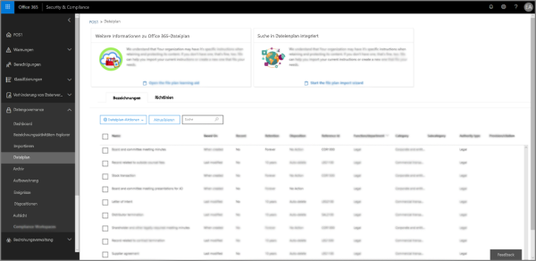

## Zugriff auf den Dateiplan-ManagerAccessing file plan manager

Es gibt die folgenden beiden Anforderungen für den Zugriff auf den Dateiplan-Manager:There are two requirements to access file plan manager, they are:
- Ein Office 365 Enterprise E5-Abonnement.An Office 365 Enterprise E5 subscription.
- Der Benutzer wurde einer der folgenden Rollen des Security &amp; Compliance Centers zugewiesen:The user has been in assigned one of the following roles of the Security &amp; Compliance Center:
    - Aufbewahrungs-ManagerRetention Manager
    - Aufbewahrungs-Manager (schreibgeschützt)View-only Retention Manager

## Standardmäßige Aufbewahrungsbezeichnung und BezeichnungsrichtlinieDefault retention labels and label policy

Wenn keine Aufbewahrungsbezeichnungen im Security & Compliance Center vorhanden sind, wird, wenn Sie im linken Navigationsbereich **Dateiplan** auswählen, eine Bezeichnungsrichtlinie mit dem Namen **Standardmäßige Veröffentlichungsrichtlinie für Datengovernance** erstellt.If there are no retention labels in the Security & Compliance Center, the first time you choose **File plan** in the left nav, this creates a label policy called **Default Data Governance Publishing Policy**. 

Diese Bezeichnungsrichtlinie enthält drei Aufbewahrungsbezeichnungen:This label policy contains three retention labels:

- **Operative Prozesse****Operational procedure**
- **Allgemeines Geschäft****Business general**
- **Vertragliche Vereinbarung****Contract agreement**

Diese Aufbewahrungsbezeichnungen sind so konfiguriert, dass Inhalte nur aufbewahrt, aber nicht gelöscht werden.These retention labels are configured only to retain content, not delete content. Diese Bezeichnungsrichtlinie wird in der gesamten Organisation veröffentlicht und kann deaktiviert oder entfernt werden.This label policy will be published to the entire organization and can be disabled or removed. 

Sie können feststellen, wer den Dateiplan-Manager geöffnet und den Eindruck beim ersten Ausführen gestartet hat, indem Sie das Überwachungsprotokoll für die Aktivitäten **Erstellte Aufbewahrungsrichtlinie** und **Erstellte Konfiguration für eine Aufbewahrungsrichtlinie** überprüfen.You can determine who opened file plan manager and kicked off the first-run experience by reviewing the audit log for the activities **Created retention policy** and **Created retention configuration for a retention policy**.

> [!NOTE]
> Aufgrund von Kundenfeedback haben wir dieses Feature entfernt, durch das die standardmäßigen Aufbewahrungsbezeichnungen und die oben genannte Aufbewahrungsbezeichnungsrichtlinie erstellt wurden.Due to customer feedback, we have removed this feature that creates the default retention labels and label policy mentioned above. Diese Aufbewahrungsbezeichnungen und Aufbewahrungsbezeichnungsrichtlinien werden Ihnen nur dann angezeigt, wenn Sie den Datei-Plan-Manager vor dem 11. April 2019 geöffnet haben.You will only see this policy and labels if you used file plan manager before April 11, 2019.

## Navigieren in Ihrem DateiplanNavigating your file plan

Mit dem Dateiplan-Manager können Sie leichter die Einstellungen aller Aufbewahrungsbezeichnungen und Richtlinien aus einer Ansicht anzeigen.File plan manager makes it easier see into and across the settings of all your retention labels and policies from one view.

Beachten Sie, dass Aufbewahrungsbezeichnungen, die außerhalb des Dateiplans erstellt wurden, im Dateiplan verfügbar sind und umgekehrt.Note that retention labels created outside of the file plan will be available in the file plan and vice versa.

Auf den Registerkarten für die **Dateiplanbezeichnungen** sind die folgenden zusätzlichen Informationen und Funktionen verfügbar:On the **file plan labels** tab, the following additional information and capabilities are available:

### Spalten mit BezeichnungseinstellungenLabel settings columns

- **Basierend auf** gibt den Typ des Auslösers an, der den Aufbewahrungszeitraum starten kann. Gültige Werte sind:**Based on** identifies the type of trigger that will start the retention period. Valid values are:
    - EreignisEvent
    - Zeitpunkt der ErstellungWhen created
    - Zeitpunkt der letzten ÄnderungWhen last modified
    - Zeitpunkt der BezeichnungWhen labeled
- **Datensatz** gibt an, ob das Element ein deklarierter Datensatz werden kann, wenn die Bezeichnung angewendet wurde. Gültige Werte sind:**Record** identifies if the item will become a declared record when the label is applied. Valid values are:
    - NeinNo
    - JaYes
    - Yes (Vorgeschrieben)Yes(Regulatory)
- **Aufbewahrung** gibt den Aufbewahrungstyp an. Gültige Werte sind:**Retention** identifies the retention type. Valid values are:
    - BeibehaltenKeep
    - Beibehalten und löschenKeep and delete
    - LöschenDelete
- **Disposition** gibt an, was mit dem Inhalt am Ende des Aufbewahrungszeitraums geschieht. Gültige Werte sind:**Disposition** identifies what will happen to the content at the end of the retention period. Valid values are:
    - Nullnull
    - Keine AktionNo action
    - Automatisch löschenAuto-delete
    - Überprüfung erforderlich (auch bezeichnet als Dispositionsprüfung)Review required (aka Disposition review)

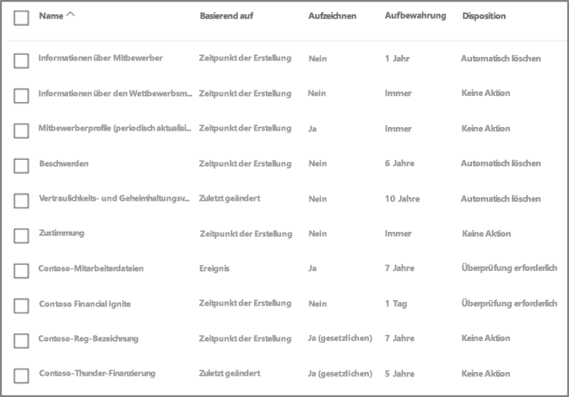

### Spalten mit Dateiplanbeschreibungen für AufbewahrungsbezeichnungenLabel file plan descriptors columns

Sie können nun mehr Informationen in die Konfiguration Ihrer Aufbewahrungsbezeichnungen einschließen. Durch Einfügen von Dateiplanbeschreibungen in Aufbewahrungsbezeichnungen können Sie die Verwaltbarkeit und Organisation Ihres Dateiplans verbessern.You can now include more information in the configuration of your retention labels. Inserting file plan descriptors into labels will improve the manageability and organization of your file plan.

Für den Einstieg stellt Dateiplan-Manager einige einsatzbereite Werte für Folgendes bereit: Funktion/Abteilung, Kategorie, Autoritätstyp und Bereitstellung. Sie können neue Werte für die Dateiplanbeschreibung hinzufügen, wenn Sie eine Aufbewahrungsbezeichnung erstellen oder bearbeiten.To get you started, file plan manager provides some out-of-box values for: Function/department, Category, Authority type and Provision/citation. You can add new file plan descriptor values when creating or editing a retention label.

Nachfolgend finden Sie eine Übersicht der Dateiplanbeschreibungen beim Erstellen oder Bearbeiten einer Aufbewahrungsbezeichnung.Here's a view of the file plan descriptors step when creating or editing a retention label.

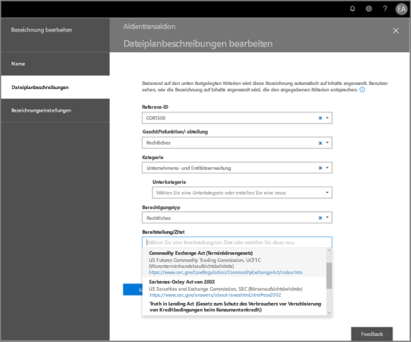

Nachfolgend finden Sie eine Übersicht über die Spalten mit Dateiplanbeschreibungen auf der Registerkarte „Bezeichnungen“ des Dateiplan-Managers.Here's a view of the file plan descriptors columns on the labels tab of file plan manager.

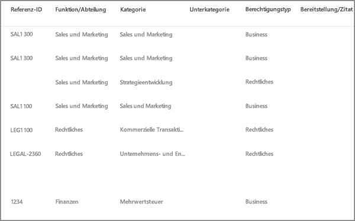

## Exportieren aller vorhandenen Aufbewahrungsbezeichnungen zum Analysieren und/oder Durchführen von Offline ÜberprüfungenExport all existing retention labels to analyze and/or perform offline reviews

Aus dem Dateiplan-Manager können Sie die Details aller Aufbewahrungsbezeichnungen in eine CSV-Datei exportieren, mit deren Hilfe Sie regelmäßige Complianceüberprüfungen mit den Beteiligten an der Datengovernance in Ihrer Organisation durchführen können.From file plan manager, you can export the details of all retention labels into a .csv file to assist you in facilitating periodic compliance reviews with data governance stakeholders in your organization.

Um alle Aufbewahrungsbezeichnungen zu exportieren, gehen Sie zu **Dateiplan-Manager** \> **Dateiplanaktionen** \> **Bezeichnungen exportieren**.To export all retention labels, go to **file plan manager** \> **file plan actions** \> **export labels**.

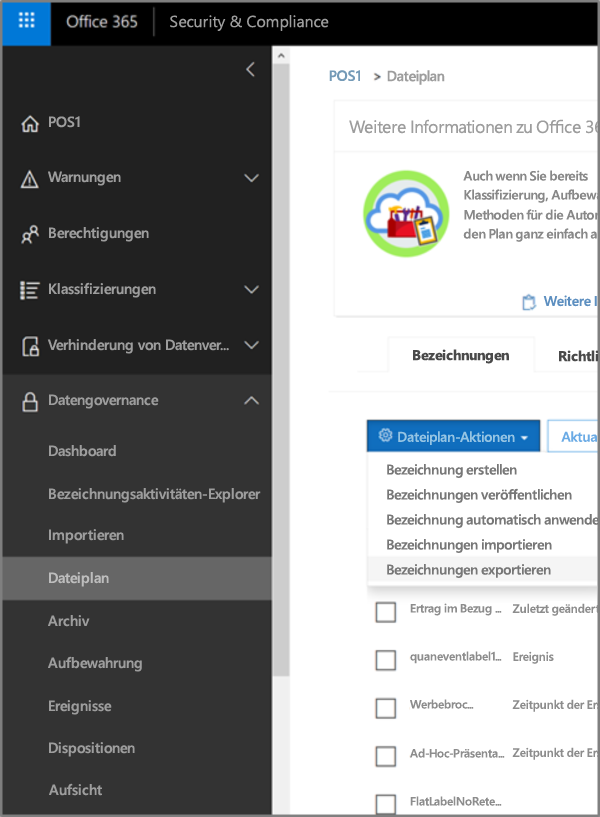

Es wird eine CSV-Datei mit allen vorhandenen Aufbewahrungsbeschriftungen geöffnet.A \*.csv file containing all existing retention labels will open.

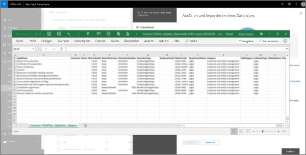

## Importieren von Aufbewahrungsbezeichnungen in Ihren DateiplanImport labels into your file plan

Aus dem Dateiplan-Manager können Sie neue Aufbewahrungsbezeichnungen massenimportieren und vorhandene Aufbewahrungsbezeichnungen ändern.From file plan manager, you can bulk import new labels as well as modify existing retention labels.

Zum Importieren von neuen Aufbewahrungsbeschriftungen und zum Aktualisieren von vorhandenen Aufbewahrungsbezeichnungen gehen Sie zu **Dateiplan-Manager** \> **Dateiplanaktionen** \> **Bezeichnungen importieren**.To import new retention labels and make updates existing retention labels, go to **file plan manager** \> **file plan actions** \> **import labels**.

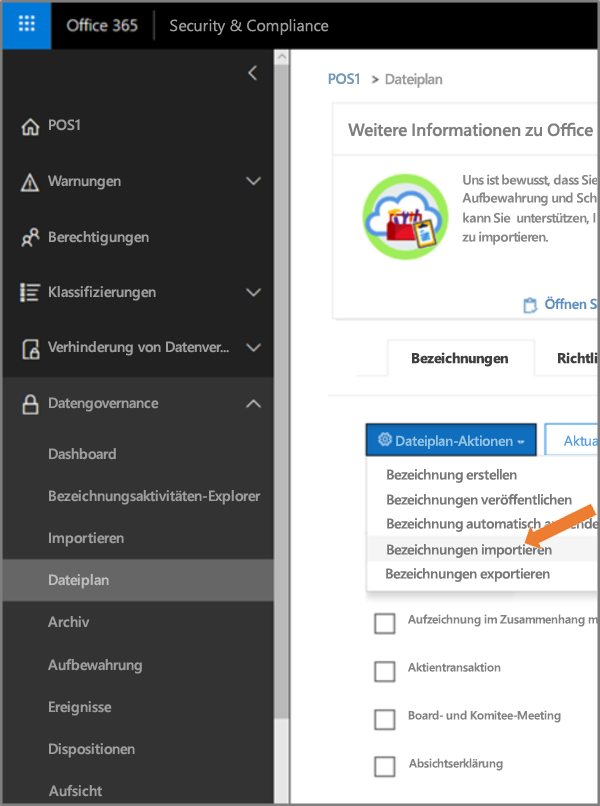

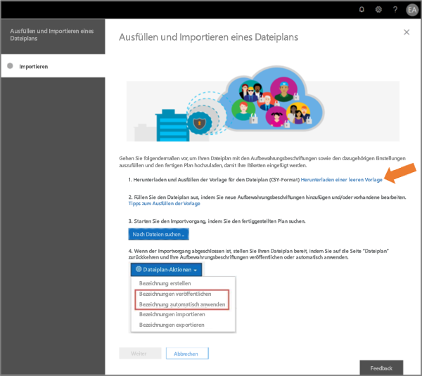

Laden Sie eine leere Vorlage herunter (oder beginnen Sie mit einem Export Ihres aktuellen Dateiplans).Download a blank template (or start from an export of your current file plan).

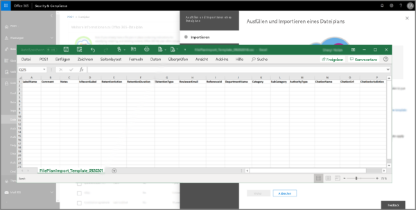

Füllen Sie die Vorlage aus.Fill-out the template. Diese Tabelle enthält gültige Werte.This table provides valid values.

|**Eigenschaft****Property**|**Typ****Type**|**Gültige Werte****Valid values**|
|:-----|:-----|:-----|
|LabelNameLabelName|ZeichenfolgeString|Wenn der Wert Leerzeichen enthält, setzen Sie ihn in Anführungszeichen (").If the value contains spaces, enclose the value in quotation marks (").|
|CommentComment|ZeichenfolgeString|Wenn der Wert Leerzeichen enthält, setzen Sie ihn in Anführungszeichen (").If the value contains spaces, enclose the value in quotation marks ("). |
|NotesNotes|ZeichenfolgeString|CustomCustom|
|IsRecordLabelIsRecordLabel|ZeichenfolgeString|$true: Die Bezeichnung ist eine Datensatzbezeichnung.The label is a record label. $false: Die Bezeichnung ist keine Datensatzbezeichnung.The label isn't a record label. Dies ist der Standardwert.This is the default value.|
|RetentionActionRetentionAction|ZeichenfolgeString|DeleteDelete KeepKeep KeepAndDeleteKeepAndDelete |
|RetentionDurationRetentionDuration|ZeichenfolgeString|Die Eigenschaft gibt die Anzahl der Tage an, die der Inhalt aufbewahrt werden soll.The RetentionDuration parameter specifies the number of days to retain the content. Gültige Werte sind:Valid values are: Positive Ganzzahl.A positive integer. Der Wert ist unbegrenzt.The default value is unlimited.|
|RetentionTypeRetentionType|ZeichenfolgeString|Diese Eigenschaft gibt an, ob die Aufbewahrungsdauer aus dem Erstellungsdatum des Inhalts, dem Datum der Bezeichnung (Markierung) oder aus dem Datum der letzten Änderung berechnet wird.The RetentionType parameter specifies whether the retention duration is calculated  from the content creation date, tagged date, or last modification date. Gültige Werte sind:Valid values are: CreationAgeInDaysCreationAgeInDays EventAgeInDaysEventAgeInDays ModificationAgeInDaysModificationAgeInDays TaggedAgeInDaysTaggedAgeInDays |
|ReviewerEmailReviewerEmail|SmtpAddress[]SmtpAddress|Diese Eigenschaft gibt die E-Mail-Adresse des Bearbeiters für Aufbewahrungsaktionen vom Typ "Delete" und "KeepAndDelete" an.The ReviewerEmail parameter specifies the email address of a reviewer for Delete and KeepAndDelete retention actions. Mehrere E-Mail-Adressen können durch Kommas getrennt angegeben werden.You can specify multiple email addresses separated by commas.|
|ReferenceIdReferenceId|ZeichenfolgeString|CustomCustom|
|DepartmentNameDepartmentname|ZeichenfolgeString|CustomCustom|
|KategorieCategory|ZeichenfolgeString|CustomCustom|
|SubCategorySubCategory|ZeichenfolgeString|CustomCustom|
|AuthorityTypeAuthorityType|ZeichenfolgeString|CustomCustom|
|CitationNameCitationName|ZeichenfolgeString|CustomCustom|
|CitationUrlCitationUrl|ZeichenfolgeString|CustomCustom|
|CitationJurisdictionCitationJurisdiction|ZeichenfolgeString|CustomCustom|
|RegulatoryRegulatory|ZeichenfolgeString|CustomCustom|
|EventTypeEventType|ZeichenfolgeString|Diese Eigenschaft gibt die Aufbewahrungsregel an, die der Bezeichnung zugeordnet ist.The 
                EventType
              specifies the retention rule that's associated with the label. Sie können einen beliebigen Wert verwenden, der die Regel eindeutig identifiziert.You can use any value that uniquely identifies the rule. Beispiel:For example: NameName Distinguished Name (DN)Distinguished name (DN) GUIDGUID  Mit dem Cmdlet [Get-RetentionComplianceRule](https://docs.microsoft.com/de-DE/powershell/module/exchange/policy-and-compliance-retention/get-retentioncompliancerule?view=exchange-ps) können Sie die verfügbaren Aufbewahrungsregeln anzeigen.You can use the [Get-RetentionComplianceRule](https://docs.microsoft.com/en-us/powershell/module/exchange/policy-and-compliance-retention/get-retentioncompliancerule?view=exchange-ps) cmdlet to view the available retention rules.|

Laden Sie die ausgefüllte Vorlage hoch; die Einträge werden dann vom Dateiplan-Manager überprüft, und es werden Importstatistiken angezeigt.Upload the filled-out template, and file plan manager will validate the entries and display import statistics.

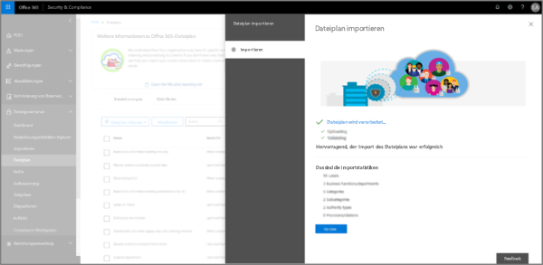

Für den Fall, dass ein Überprüfungsfehler vorliegt, überprüft der Dateiplanimport weiterhin jeden Eintrag in der Importdatei und zeigt alle Fehler an, wobei er die Zeilen-/Reihennummern in der Importdatei referenziert und die angezeigten Fehlerergebnisse kopiert, damit Sie einfach zur Importdatei zurückkehren und die Fehler korrigieren können.In the event there is a validation error, file plan import will continue to validate every entry in the import file and display all errors referencing line/row numbers in the import file, copy the displayed error results so that you can easilly return to the import file and correct the errors. 

Wenn der Importvorgang abgeschlossen ist, kehren Sie zum Dateiplan-Manager zurück, um neuen oder vorhandenen Aufbewahrungsbezeichnungsrichtlinien neue Aufbewahrungsbezeichnungen zuzuweisen.When the import is complete, return to file plan manager to assign new labels to new or existing policies.

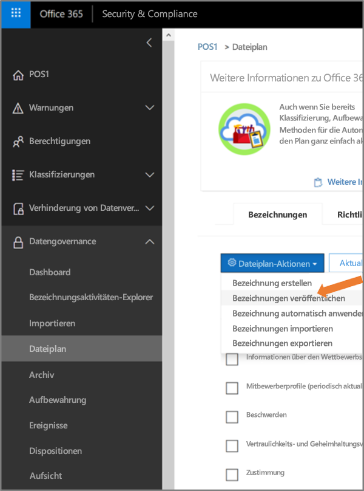

