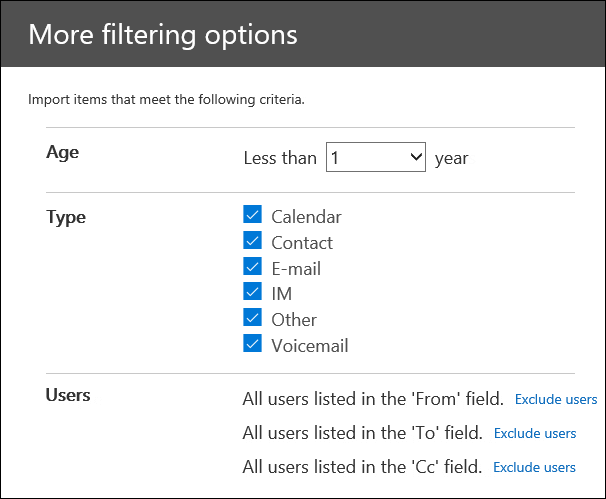

# Filtern von Daten beim Importieren von PST-Dateien in Office 365

Verwenden Sie die neue intelligente Importfunktion im Office 365-Import Dienst, um die Elemente in PST-Dateien zu filtern, die tatsächlich in die Zielpostfächer importiert werden. So funktioniert es:
  
- Nachdem Sie einen PST-Importauftrag erstellt und übermittelt haben, werden PST-Dateien in einen Azure-Speicherbereich in der Microsoft-Cloud hochgeladen.
    
- Office 365 analysiert die Daten in den PST-Dateien auf sichere und sichere Weise, indem das Alter der Postfachelemente und die verschiedenen Nachrichtentypen in den PST-Dateien angegeben werden.
    
- Wenn die Analyse abgeschlossen ist und die Daten importiert werden können, haben Sie die Möglichkeit, alle Daten in den PST-Dateien zu importieren, oder die importierten Daten zu trimmen, indem Sie Filter festlegen, die Steuern, welche Daten importiert werden. Sie können beispielsweise Folgendes auswählen:
    
  - Nur Elemente eines bestimmten Alters importieren.
    
  - Importiert ausgewählte Nachrichtentypen.
    
  - Ausschließen von Nachrichten, die von bestimmten Personen gesendet oder empfangen werden.
    
- Nachdem Sie die Filtereinstellungen konfiguriert haben, importiert Office 365 nur die Daten, die den Filterkriterien entsprechen, auf die im Importauftrag angegebenen Zielpostfächer.
    
Die folgende Grafik zeigt den intelligenten Import Prozess und hebt die Aufgaben, die Sie ausführen, und die Aufgaben, die von Office 365 ausgeführt werden.
  

  
## Bevor Sie beginnen

- Bei den Schritten in diesem Thema wird davon ausgegangen, dass Sie einen PST-Importauftrag im Office 365-Import Dienst mithilfe des Netzwerk-Uploads oder des Laufwerk Versands erstellt haben. Schrittweise Anleitungen finden Sie in einem der folgenden Themen:
    
  - [Verwenden des Netzwerkuploads zum Importieren von PST-Dateien in Office 365](use-network-upload-to-import-pst-files.md)
    
  - [Verwenden des Laufwerkversands zum Importieren von PST-Dateien in Office 365](use-drive-shipping-to-import-pst-files-to-office-365.md)
    
- Nachdem Sie einen Importauftrag mithilfe des Netzwerk Uploads erstellt haben, ist der Status für den Importauftrag auf der Seite "Importieren &amp; " in Office 365 Security Compliance Center auf " **Analyse wird ausgeführt**" festgelegt, was bedeutet, dass Office 365 die Daten in den PST-Dateien analysiert, die Sie geladen. Klicken Sie auf](media/165fb3ad-38a8-4dd9-9e76-296aefd96334.png) Refresh aktualisieren, um den Status für den Importauftrag zu aktualisieren. ****![ 
    
- Bei Import Aufträgen für den Laufwerk Versand werden die Daten von Office 365 analysiert, nachdem Microsoft-Rechenzentrumsmitarbeiter Ihre Festplatte erhalten und die PST-Dateien in den Azure-Speicherbereich für Ihre Organisation hochgeladen haben.
  
## Filtern von Daten, die in Postfächer importiert werden

Nachdem Sie einen PST-Importauftrag erstellt haben, führen Sie die folgenden Schritte aus, um die Daten zu filtern, bevor Sie Sie in Office 365 importieren.
  
1. Wechseln Sie [https://protection.office.com/](https://protection.office.com/) zu, und melden Sie sich mit den Anmeldeinformationen für ein Administratorkonto in ihrer Office 365-Organisation an. 
    
2. klicken sie im linken bereich des Office 365 Security &amp; Compliance centers auf **Data governance** \> - **Import**.
    
    Die Importaufträge für Ihre Organisation werden auf der Seite **importieren** aufgeführt. Beachten Sie, dass der Wert **Analyse abgeschlossen** in der Spalte **Status** die Importaufträge angibt, die von Office 365 analysiert wurden und für den Import bereit sind. 
    
    
  
3. Klicken Sie auf bereit, um den Importauftrag, den Sie abschließen möchten, **in Office 365 zu importieren** . 
    
    Eine Fly-Out-Seite wird mit Informationen zu den PST-Dateien und weiteren Informationen zum Importauftrag angezeigt.
    
4. Klicken Sie auf **in Office 365 importieren**.
    
    Die Seite **Filter Ihre Daten** wird angezeigt. Sie enthält Daten Einblicke in die Daten in den PST-Dateien für den Importauftrag, einschließlich Informationen zum Alter der Daten. 
    
    
  
5. Führen Sie eine der folgenden Aktionen aus, je nachdem, ob Sie die Daten, die in Office 365 importiert werden, kürzen möchten **.**
    
    a. Klicken Sie auf **Ja, ich möchte Sie vor dem Importieren Filtern** , um die importierten Daten zu trimmen, und klicken Sie dann auf **weiter**.
    
    Die **Seite Daten in office 365 importieren** wird mit detaillierten Daten Einblicken aus der Analyse angezeigt, die von Office 365 ausgeführt wurde. 
    
    
  
    Das Diagramm auf dieser Seite zeigt die Menge der Daten an, die importiert werden. Informationen zu den einzelnen Nachrichtentypen in den PST-Dateien werden im Diagramm angezeigt. Sie können den Mauszeiger über die einzelnen Balken bewegen, um bestimmte Informationen zu diesem Nachrichtentyp anzuzeigen. Es gibt auch eine Dropdownliste mit unterschiedlichen Alters Werten basierend auf der Analyse der PST-Dateien. Wenn Sie in der Dropdownliste ein Alter auswählen, wird das Diagramm aktualisiert, um anzuzeigen, wie viele Daten für das ausgewählte Alter importiert werden. 
    
    b. zum Konfigurieren von Zusatz Filtern zum Verringern der importierten Datenmenge klicken Sie auf **Weitere Filteroptionen**.
    
    
  
    Sie können diese Filter konfigurieren:
    
      - **Age** – wählen Sie ein Alter aus, sodass nur Elemente importiert werden, die neuer als das angegebene Alter sind. Im Abschnitt [Weitere Informationen](filter-data-when-importing-pst-files.md#moreinfo) finden Sie eine Beschreibung dazu, wie Office 365 die Age-Buckets für den **Age** -Filter bestimmt. 
    
      - **Type** -dieser Abschnitt enthält alle Nachrichtentypen, die in den PST-Dateien für den Importauftrag gefunden wurden. Sie können das Kontrollkästchen neben einem Nachrichtentyp deaktivieren, den Sie ausschließen möchten. Beachten Sie, dass Sie den anderen Nachrichtentyp nicht ausschließen können. Im Abschnitt [Weitere Informationen](filter-data-when-importing-pst-files.md#moreinfo) finden Sie eine Liste der Postfachelemente, die in der anderen Kategorie enthalten sind. 
    
      - **Benutzer** – Sie können Nachrichten ausschließen, die von bestimmten Personen gesendet oder empfangen werden. Wenn Sie Personen ausschließen möchten, die im Feld from:, to: Field oder im Feld CC: von Nachrichten angezeigt werden, klicken Sie neben diesem Empfängertyp auf **Benutzer ausschließen** . Geben Sie die e-Mail-Adresse (SMTP-Adresse) der Person ein](media/457cd93f-22c2-4571-9f83-1b129bcfb58e.gif) , klicken Sie auf neues Symbol **Hinzufügen**![, um Sie der Liste der ausgeschlossenen Benutzer für diesen Empfängertyp hinzuzufügen, und klicken Sie dann auf **Speichern** , um die Liste der ausgeschlossenen Benutzer zu speichern. 
    
        > [!NOTE]
        > In Office 365 werden keine Daten Einblicke angezeigt, die sich aus dem Festlegen des **Personen** Filters ergeben. Wenn Sie diesen Filter jedoch so festlegen, dass Nachrichten, die von bestimmten Personen gesendet oder empfangen werden, ausgeschlossen werden, werden diese Nachrichten während des tatsächlichen Importvorgangs ausgeschlossen. 
  
    c. Klicken Sie in der Seite **Weitere Filteroptionen** fliegen auf über **nehmen** , um die Filtereinstellungen zu speichern. 
    
    Die Daten Einblicke auf die Seite **Import Data to Office 365** werden basierend auf Ihren Filtereinstellungen aktualisiert, einschließlich der Gesamtmenge der Daten, die basierend auf den Filtereinstellungen importiert werden. Beachten Sie, dass auch eine Zusammenfassung der Filtereinstellungen angezeigt wird. Sie können neben einem Filter auf **Bearbeiten** klicken, um die Einstellung bei Bedarf zu ändern. 
    
    
  
    d. Klicken Sie auf **weiter**.
    
    Eine Statusseite mit den Filtereinstellungen wird angezeigt. Sie können auch die Filtereinstellungen bearbeiten.
    
    e. Klicken Sie auf **Daten importieren** , um den Import zu starten. Beachten Sie, dass die Gesamtmenge der importierten Daten angezeigt wird. 
    
    Oder
    
    a. Klicken Sie auf **Nein, ich möchte alles importieren** , um alle Daten in den PST-Dateien in Office 365 zu importieren, und klicken Sie dann auf **weiter**.
    
    b. Klicken Sie auf der Seite **Daten in Office 365 importieren** auf **Daten importieren** , um den Import zu starten. Beachten Sie, dass die Gesamtmenge der importierten Daten angezeigt wird. 
    
6. Klicken Sie auf der Seite **importieren** auf **** aktualisieren. Der Status für den Importauftrag wird in der Spalte **Status** angezeigt. 
    
7. Klicken Sie auf den Auftrag importieren, um detailliertere Informationen anzuzeigen, beispielsweise den Status für jede PST-Datei und die Filtereinstellungen, die Sie konfiguriert haben.

  
## Weitere Informationen

- Wie ermittelt Office 365 die Inkremente für den Age-Filter? Wenn Office 365 eine PST-Datei analysiert, sieht es den gesendeten oder empfangenen Zeitstempel der einzelnen Elemente aus (wenn ein Element sowohl einen gesendeten als auch einen empfangenen Timestamp hat, ist das älteste Datum ausgewählt). Dann sucht Office 365 den Year-Wert für diesen Zeitstempel und vergleicht ihn mit dem aktuellen Datum, um das Alter des Elements zu bestimmen. Diese Ages werden dann als Werte in der Dropdownliste für den **Age** -Filter verwendet. Wenn eine PST-Datei beispielsweise Nachrichten von 2016, 2015 und 2014 enthält, wären Werte im **Age** -Filter **1 Jahr**, **2 Jahre**und **3 Jahre**.
    
- In der folgenden Tabelle sind die Nachrichtentypen aufgeführt, die in der **anderen** Kategorie im **** Feld Typfilter auf der Seite **Weitere Optionen** fliegen enthalten sind (siehe Schritt 5B im vorherigen Verfahren). Derzeit können Sie Elemente in der Kategorie "Sonstiges" nicht ausschließen, wenn Sie PST in Office 365 importieren. 
    
    |**Nachrichtenklassen-ID**|**Postfachelemente, die diese Nachrichtenklasse verwenden**|
    |:-----|:-----|
    |IPM. Aktivität    |Journal Einträge    |
    |IPM. Dokument    |Dokumente und Dateien (nicht an eine e-Mail-Nachricht angefügt)    |
    |IPM. Datei    |(identisch mit IPM. Dokument    |
    |IPM. Hinweis. IMC. Notification    |Von Internet Mail Connect gesendete Berichte, die das Exchange Server-Gateway zum Internet sind    |
    |IPM. Hinweis. Microsoft. Fax    |Faxnachrichten    |
    |IPM. Hinweis. Rules. OOF. Template. Microsoft    |Abwesenheitsnachrichten für automatische Antworten    |
    |IPM. Hinweis. Rules. ReplyTemplate. Microsoft    |Von einer Posteingangsregel gesendete Antworten    |
    |IPM. OLE. Klasse    |Ausnahmen für eine wiederkehrende Serie    |
    |IPM. ReCall. Report    |Nachrichtenrückruf Berichte    |
    |IPM. Remote    |Remote-e-Mail-Nachrichten    |
    |IPM. Bericht    |Elementstatus Berichte    |
