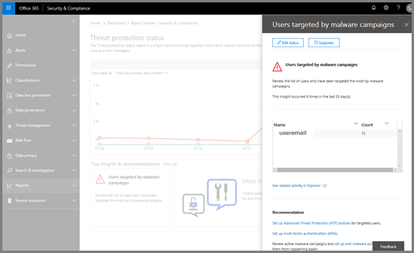

# Exemplarische Vorgehensweise – Vom detaillierten Bericht zum Einblick

Wenn Sie zum ersten Mal [Berichte und Einblicke in die Office 365-Sicherheit &amp; Compliance Center](reports-and-insights-in-security-and-compliance.md), es kann Hilfe, um festzustellen, wie Sie auf einfache Weise einen detaillierten Bericht auf einen Einblick navigieren können und empfohlenen Aktionen. 
  
Dies ist eine von mehreren exemplarischen Vorgehensweisen für die Sicherheit &amp; Compliance Center. Weitere exemplarische Vorgehensweisen finden Sie im Abschnitt [Siehe auch](#related-topics) . 
  
## Exemplarische Vorgehensweise: aus einen detaillierten Bericht zu einer insight

Betrachten wir den Ablauf von einen detaillierten Bericht einen Einblick und Aktionen. (Dies ist ein Beispiel für kurze [Antispam- und Anti-Malware](anti-spam-and-anti-malware-protection.md) .) 
  
1. Wir beginnen mit [Sicherheit &amp; Compliance Center](https://protection.office.com) Berichte. (Gehe zu **Berichten** \> **Dashboard**.) 
  
2. Wir wählen Sie einen Bericht auf eine ausführlichere Ansicht zu erhalten. (Wählen Sie einen Bericht, wie die **Threat Protection** Statusbericht.) 
  
3. Wir beachten Einblicke in die Indikator im Diagramm und unterhalb des Berichts. Positionieren den Mauszeiger auf Einblicke in die Markierung bietet einige zusätzliche Details. (Bewegen Sie den Mauszeiger über die Einblicke in die Markierung auf Weitere Details finden Sie unter.)
    
4. Durch Klicken auf die Einblicke in die Markierung im Diagramm oder das Widget Insights über Schadsoftware unterhalb des Diagramms wird einen Detailbereich geöffnet. (Unterhalb des Diagramms, wählen Sie das Widget Insights.)  Detailbereich enthält Informationen und Empfehlungen zu berücksichtigen sind, einschließlich Überprüfen von Richtlinien, Durchführung von weiteren Untersuchung und Bearbeiten von Status. ([Erfahren Sie mehr über Antispam- und Anti-Malware Protection in Office 365](anti-spam-and-anti-malware-protection.md)).
    
Auf diese Weise werden können Verschieben von einen detaillierten Bericht auf einen Einblick und empfohlenen Aktionen. 
  
## Verwandte Themen

[Exemplarische Vorgehensweise: aus einen Einblick in einen detaillierten Bericht](from-an-insight-to-a-detailed-report.md)
  
[Exemplarische Vorgehensweise: aus einem Dashboard, um einen Einblick](from-a-dashboard-to-an-insight.md)
  

