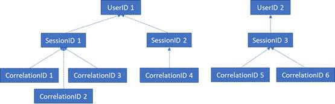

# DSGVO für Office Web Apps Server und Office Online Server

Telemetriedaten von Office Online Server und Office Web Apps Server werden in Form von ULS-Protokollen gespeichert. Sie können ULS-Protokolle von Ihrem lokalen Mandanten mit [ULS Viewer](https://www.microsoft.com/en-us/download/details.aspx?id=44020) anzeigen.

Jede Protokollzeile enthält eine CorrelationID. Verwandte Protokollzeilen teilen sich die gleiche CorrelationID. Jede CorrelationID ist mit einer einzelnen SessionID verknüpft, und eine SessionID kann mit vielen CorrelationIDs zusammenhängen. Jede SessionID kann mit einer einzelnen UserID verknüpft sein, wobei einige Sitzungen anonym sein können und daher keine zugehörige UserID besitzen. Um zu bestimmen, welche Daten einem bestimmten Benutzer zugeordnet sind, ist es daher möglich, Zuordnungen vorzunehmen von einer einzelnen UserID zu den diesem Benutzer zugeordneten SessionIDs, von diesen SessionIDs zu den zugehörigen CorrelationIDs und von diesen CorrelationIDs zu allen Protokollen in diesen Korrelationen. Im nachstehenden Diagramm sind die Beziehungen zwischen den unterschiedlichen IDs dargestellt.

## Erfassen von Protokollen

Um alle Protokolle zu erfassen, die beispielsweise UserID 1 zugeordnet sind, müssen zunächst alle Sitzungen erfasst werden, die UserID 1 zugeordnet sind (d. h. SessionID 1 und SessionID 2). Der nächste Schritt wäre das Erfassen aller Korrelationen, die SessionID 1 (d. h. CorrelationIDs 1, 2 und 3) und SessionID 2 (d. h. CorrelationID 4) zugeordnet sind. Zum Schluss müssen alle Protokolle erfasst werden, die den einzelnen Korrelationen in der Liste zugeordnet sind.

1.  ULS Viewer starten

2.  Öffnen Sie das ULS-Protokoll für den gewünschten Zeitrahmen; ULS-Protokolle werden gespeichert unter %PROGRAMDATA%\\Microsoft\\OfficeWebApps\\Data\\Logs\\ULS

3.  Bearbeiten | Filter ändern

4.  Wenden Sie einen Filter folgender Art an:

    -   EventID ist gleich apr3y oder

    -   EventID ist gleich bp2d6

5.  Gehashte UserIDs werden sich in der Nachricht eines dieser beiden Ereignisse befinden.

6.  Für apr3y wird die Nachricht einen Wert "UserID" und einen Wert "PUID" enthalten.

7.  Für bp2d6 wird die Nachricht ziemlich viele Informationen enthalten. Das Feld für den Wert "LoggableUserId" enthält die gehashte UserID.

8.  Nachdem die gehashte UserID aus einem der beiden Tags abgerufen wurde, enthält der Wert "WacSessionId" dieser Zeile in ULS Viewer die diesem Benutzer zugeordnete WacSessionId.

9.  Erfassen Sie alle Werte "WacSessionId" für den betreffenden Benutzer.

10. Filtern Sie nach allen EventId gleich "xmnv", Nachrichten gleich "UserSessionId =\<WacSessionId\>" für die erste WacSessionId in der Liste (ersetzen Sie den \<WacSessionId\>-Teil des Filters durch Ihre WacSessionId).

11. Erfassen Sie alle Korrelationswerte, die mit dieser WacSessionId übereinstimmen.

12. Wiederholen Sie die Schritte 10 bis 11 für alle Werte "WacSessionId" in der Liste für den betreffenden Benutzer.

13. Filtern Sie nach allen Korrelationen, die der ersten Korrelation in Ihrer Liste entsprechen.

14. Erfassen Sie alle Protokolle, die mit dieser Korrelation übereinstimmen.

15. Wiederholen Sie die Schritte 13 bis 14 für alle Korrelationswerte in der Liste für den betreffenden Benutzer.

## Arten von Daten

Office Online-Protokolle enthalten eine Vielzahl von verschiedenen Arten von Daten. Nachfolgend finden Sie Beispiele für die Daten, die in ULS-Protokollen enthalten sein können:

-   Fehlercodes für Probleme, die während der Nutzung des Produkts auftreten

-   Klicks auf Schaltflächen und andere Daten zur App-Verwendung

-   Leistungsdaten über die App und/oder bestimmte Features der App

-   Allgemeine Informationen zum Standort des Computers des Benutzers (z. B. Land/Region, Bundesland und Stadt, die aus der IP-Adresse abgeleitet werden), jedoch keine präzise Geolocation

-   Grundlegende Metadaten zum Browser, z. B. Browsername und Version, und zum Computer, z. B. Betriebssystemtyp und Version

-   Fehlermeldungen aus dem Dokumenthost (z. B. OneDrive, SharePoint, Exchange)

-   Informationen zu App-internen Prozessen, die mit keiner Aktion des Benutzers zusammenhängen
