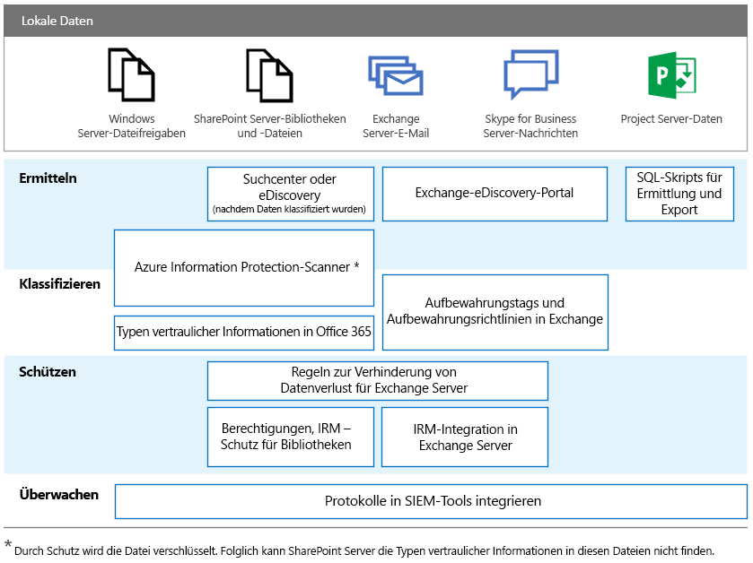

# DSGVO für lokale Office-Server

Im Rahmen der Datenschutz-Grundverordnung (DSGVO) werden Anforderungen für Unternehmen zum Schutz personenbezogener Daten und zur angemessenen Reaktion auf Datensubjektanforderungen eingeführt. Diese Artikelreihe bietet empfohlene Ansätze für lokale Workloads:

-   [SharePoint Server](gdpr-for-sharepoint-server.md)

-   [Exchange Server](gdpr-for-exchange-server.md)

-   [Skype for Business Server](gdpr-for-skype-for-business-server.md)

-   [Project Server](gdpr-for-project-server.md)

-   [Office Web Apps Server und Office Online Server](gdpr-for-office-online-server.md)

-   [Lokale Dateifreigaben](gdpr-for-on-premises-file-shares.md)

Weitere Informationen zu der DSGVO und dazu, wie Microsoft Ihnen helfen kann, finden Sie im [Microsoft Trust Center](https://www.microsoft.com/en-us/TrustCenter/Privacy/gdpr/default.aspx).

Vor der Arbeit mit lokalen Daten wenden Sie sich an die Teams Ihrer Rechts- und Compliance-Abteilung, um Hilfestellung und Informationen zu vorhandenen Klassifizierungsschemata und Ansätzen für die Arbeit mit personenbezogenen Daten zu erhalten. Microsoft bietet Empfehlungen für die Entwicklung und Erweiterung von Klassifizierungsschemata im DSGVO-bezogenen Data Discovery Toolkit von Microsoft unter [ http://aka.ms/gdprpartners ](<http://aka.ms/gdprpartners>). In diesem Toolkit werden auch Vorgehensweisen beschrieben, mit denen Sie lokale Daten in die Cloud verschieben können, wo Sie bei Bedarf komplexere Daten-Governance-Funktionen verwenden können. In den Artikeln in diesem Abschnitt werden Empfehlungen für Daten gegeben, die lokal gespeichert bleiben sollen.

In der folgenden Abbildung werden empfohlene Funktionen aufgeführt, die in jedem dieser Workloads zum Ermitteln, Klassifizieren, Schützen und Überwachen personenbezogener Daten verwendet werden können. Weitere Informationen finden Sie in den Artikeln in diesem Abschnitt.

## Beschreibung der Abbildung

Für Zwecke der Barrierefreiheit enthält die folgende Tabelle die gleichen Beispiele wie die Abbildung.

|             |Windows Server-Dateifreigaben|SharePoint Server|Exchange Server|Skype for Business|Project Server|
|:------------|:-------------------------|:----------------|:--------------|:-----------------|:-------------|
|Ermitteln|Azure Information Protection-Scanner*|Suchcenter oder eDiscovery (nachdem Daten klassifiziert wurden); Azure Information Protection-Scanner*|Exchange-eDiscovery-Portal|Exchange-eDiscovery-Portal|SQL-Skripts für Ermittlung und Export|
|Klassifizieren|Azure Information Protection-Scanner*; Typen vertraulicher Informationen in Office 365|Azure Information Protection-Scanner*; Typen vertraulicher Informationen in Office 365|Aufbewahrungstags und Aufbewahrungsrichtlinien in Exchange|Aufbewahrungstags und Aufbewahrungsrichtlinien in Exchange||
|Schützen||Regeln zur Verhinderung von Datenverlust für Exchange Server; Berechtigungen, IRM-Schutz für Bibliotheken|Regeln zur Verhinderung von Datenverlust für Exchange Server; IRM-Integration in Exchange Server|||
|Überwachen|Protokolle in SIEM-Tools integrieren|Protokolle in SIEM-Tools integrieren|Protokolle in SIEM-Tools integrieren|Protokolle in SIEM-Tools integrieren|Protokolle in SIEM-Tools integrieren|

*Durch Schutz wird die Datei verschlüsselt. Folglich kann SharePoint Server die Typen vertraulicher Informationen in diesen Dateien nicht finden.
