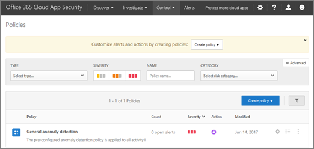

# Einstieg in Office 365 Cloud App Security
  
|Auswertung * *\>**|Planung * *\>**|Bereitstellung * *\>**|Auslastung * * * *|
|:-----|:-----|:-----|:-----|
|[Evaluierung starten](office-365-cas-overview.md)   |Sie sind hier!    [Nächster Schritt](turn-on-office-365-cas.md)   |[Starten der Bereitstellung](turn-on-office-365-cas.md)   |[Verwendung beginnen](utilization-activities-for-ocas.md)   |
   
Bei der Vorbereitung der Aktivierung und Implementierung von Office 365 Cloud App Security für Ihr Unternehmen müssen einige Aspekte berücksichtigt werden. Verwenden Sie diesen Artikel als Leitfaden für die Planung von Office 365 Cloud App Security.
    
## Schritt 1: identifizieren und schützen globaler und Sicherheitsadministrator Konten

Globale Administratoren, Sicherheitsadministratoren und Sicherheits Leser können auf das Office 365 Cloud App-Sicherheitsportal zugreifen, um Richtlinien anzuzeigen, Benachrichtigungen zu überprüfen und Berichte zu verwenden. Globale Administratoren und Sicherheitsadministratoren können Richtlinien definieren und andere Maßnahmen zum Schutz Ihrer Organisation ergreifen. (Weitere Informationen finden Sie unter [Permissions in the Office 365 &amp; Security Compliance Center](permissions-in-the-security-and-compliance-center.md).) Überdenken Sie die Benutzerkonten Ihrer Organisation, die über erhöhte Berechtigungen verfügen. 
  
 **[Schützen Sie Ihre globalen Administratorkonten in Office 365](https://docs.microsoft.com/office365/enterprise/protect-your-global-administrator-accounts)**. 
  
## Schritt 2: Aktivieren der Überwachungsprotokollierung für Ihre Organisation

Damit Office 365 Cloud App Security korrekt funktioniert, muss die Überwachungsprotokollierung aktiviert sein. Dies wird in der Regel von einem Exchange Online-Administrator oder einem globalen Administrator ausgeführt.
  
 **[Aktivieren oder Deaktivieren der Office 365-Überwachungsprotokoll Suche](turn-audit-log-search-on-or-off.md)**. 
  
## Schritt 3: Wechseln zum Sicherheitsportal der Office 365 Cloud-App

Sie können das Office 365 Cloud App-Sicherheitsportal aufrufen, indem Sie [https://portal.cloudappsecurity.com](https://portal.cloudappsecurity.com) sich anmelden. 

Sie können auch über das Office 365 Security &amp; Compliance Center dorthin gelangen. Hier ist eine gute Möglichkeit, dies zu tun:

1. Wechseln Sie [https://protection.office.com](https://protection.office.com) zu, und melden Sie sich an. (Dadurch gelangen Sie zum Security &amp; Compliance Center.)
    
2. Wechseln Sie zu **Warnungen** \> **Verwalten erweiterter Warnungen**.
    
3. Wählen Sie **Gehe zu office 365 Cloud App Security** , um zum Office 365 Cloud App Security Portal zu wechseln.   Wenn Sie das Sicherheitsportal der Office 365 Cloud-App aufrufen, wird die Seite Richtlinien angezeigt, die der folgenden Abbildung ähnelt:  
  
## Schritt 4: Definieren von Richtlinien und einrichten &amp; von Warnungsaktionen

Globale Administratoren und Sicherheitsadministratoren definieren Richtlinien in Office 365 Cloud App Security. Während des Definierens von Richtlinien werden auch Warnungen und Aktionen festgelegt. Eine Warnung ist eine auf Kriterien basierende Benachrichtigung, die in einer Ansicht angezeigt wird oder per e-Mail gesendet wird. 
  
In Office 365 Cloud App Security gibt es zwei Arten von Warnungen: Anomalie-Erkennungs Warnungen, die verdächtige Aktivitäten erkennen, und Aktivitäts Warnungen, die für Aktivitäten definiert sind, die für Ihre Organisation atypisch sein können. Warnungen informieren globale Administratoren und Sicherheitsadministratoren über eine Aktivität in Ihrer Office 365-Umgebung, die für Ihre Organisation ungewöhnlich ist.
  
Weitere Informationen finden Sie in den folgenden Ressourcen:
  
- [Aktivitätsrichtlinien und Warnungen in Office 365 Cloud App Security](activity-policies-and-alerts.md)
    
- [Anomalieerkennungsrichtlinien in Office 365 Cloud App Security](anomaly-detection-policies-in-ocas.md)
    
- [Überwachen und Aktionen für Office 365 Cloud App Security Alerts](review-office-365-cas-alerts.md)
    

## Schritt 5: Einrichten der APP-Steuerung für den bedingten Zugriff

Einrichten und Erzwingen von Steuerelementen in den Apps ihrer Organisation basierend auf bestimmten Bedingungen, wie beispielsweise, welche Benutzer welche apps verwenden können, und wo. Definieren Sie Benutzer-App-Zugriffs-und-Sitzungs Richtlinien, um zu bestimmen, ob vertrauliche Dokumente heruntergeladen und verschlüsselt werden können, den Zugriff auf bestimmte apps zu blockieren, den schreibgeschützten Modus für bestimmte Apps einzurichten und Benutzersitzungen von nicht-Unternehmensnetzwerken einzuschränken.

Weitere Informationen finden Sie in den folgenden Ressourcen:

- [Schützen von Apps mit der App-Steuerung für bedingten Zugriff in Office 365 Cloud App Security](ocas-conditional-access-app-control.md)

- [Bereitstellen der App-Steuerung für bedingten Zugriff für Office 365-Apps](ocas-deploy-conditional-access-app-control.md)

## Schritt 6: Informationen zur Cloud-Nutzung in Ihrer Organisation

Als globaler Administrator, Sicherheitsadministrator oder Sicherheits-Lesegerät erfahren Sie mehr über die Cloud-Nutzung Ihrer Organisation über Berichte und ein Cloud Discovery-Dashboard (auch als Produktivitäts-App-Erkennung bezeichnet). In diesem Dashboard werden Informationen zu Benutzern, apps, Webdatenverkehr und Risikostufen angezeigt.
  

  
um zum dashboard zur produktivitäts-app-suche zu wechseln, wählen sie im Office 365 cloud app Security portal **Discover** \> **cloud Discovery dashboard**aus.
  

  
Um Berichte mit den benötigten Informationen aufzufüllen, laden Sie Ihre Protokolldateien aus den Firewalls und Proxys Ihrer Organisation hoch. Weitere Informationen finden Sie in den folgenden Ressourcen:
  
- [Erstellen von App-Ermittlungs Berichten in Office 365 Cloud App Security](create-app-discovery-reports-in-ocas.md)
    
- [Erstellen von App-Ermittlungsergebnissen mit Office 365 Cloud App Security](review-app-discovery-findings-in-ocas.md)
    
## Schritt 7: Verwalten von apps, die Ihre Organisation für den Zugriff auf Office 365 verwendet

Als globaler Administrator oder Sicherheitsadministrator können Sie apps wie benutzerdefinierte Apps oder Drittanbieter-apps verwalten, die Personen in Ihrer Organisation auf Ihren Geräten mit Office 365 verwenden. Nehmen Sie beispielsweise an, dass jemand eine benutzerdefinierte App heruntergeladen hat, die Sie mit Office 365 verwenden möchten. Sie können die apps überwachen, die von Benutzern verwendet werden, nicht vertrauenswürdige apps ausschließen oder Apps als genehmigt für Ihre Tracking-Zwecke markieren. [Verwalten von OAuth-apps mit Office 365 Cloud App Security](manage-app-permissions-in-ocas.md).
  
## Schritt 8: Erstellen eines Wartungsplans

Nachdem Sie Office 365 Cloud App Security eingerichtet und konfiguriert haben, sollten Sie bestimmte Nutzungs Aufgaben als globaler Office 365-Administrator oder Sicherheitsadministrator für Ihre Organisation ausführen.
Durch Ausführen dieser Aufgaben können Sie sicherstellen, dass die Office 365 Cloud App-Sicherheit ordnungsgemäß konfiguriert ist, Ihre Richtlinien auf dem neuesten Stand sind und Ihre Organisation Wert aus Office 365 realisiert. Verwenden Sie diesen Artikel als Leitfaden für die Planung dieser Aufgaben. Siehe [Nutzungsaktivitäten nach der Einführung von Office 365 Cloud App Security](utilization-activities-for-ocas.md).

## Optional Schritt 9: Verwenden Sie Ihren SIEM-Server mit Office 365 Cloud App Security

Verwendet Ihr Unternehmen einen SIEM-Server (Security Information and Event Management)? Office 365 Cloud App Security kann jetzt mit Ihrem SIEM-Server integriert werden, um eine zentralisierte Überwachung von Warnungen zu ermöglichen. Die Integration in einen SIEM-Dienst ermöglicht es Ihnen, Ihre Cloud-Anwendungen besser zu schützen und gleichzeitig ihren üblichen Sicherheits Workflow beizubehalten, Sicherheitsverfahren zu automatisieren und zwischen Cloud-basierten und lokalen Ereignissen zu korrelieren. Der SIEM-Agent wird auf dem Server ausgeführt, sendet Warnungen aus der Office 365 Cloud-App-Sicherheit und leitet diese Warnungen in ihren SIEM-Server ein. Weitere Informationen finden Sie unter [Siem Integration with Office 365 Cloud App Security](integrate-your-siem-server-with-office-365-cas.md).
  
## Nächste Schritte

- [Aktivieren der Office 365 Cloud-App-Sicherheit](turn-on-office-365-cas.md)
    
- Probieren Sie in unserem [Test Lab Guide](https://docs.microsoft.com/office365/enterprise/cloud-app-security-for-your-office-365-dev-test-environment) eine praktische Erfahrung aus, in der Sie die leistungsstarken Funktionen von Office 365 Cloud App Security demonstrieren und einen Machbarkeitsnachweis erstellen können. 
    

