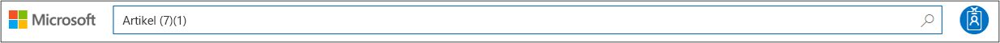
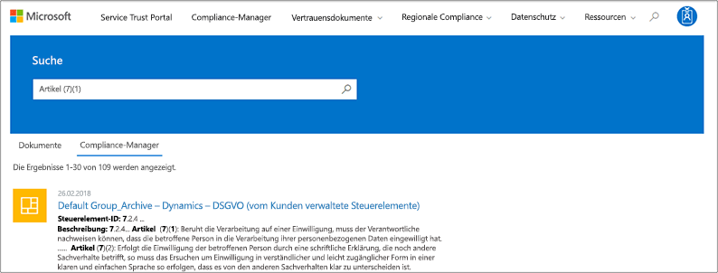
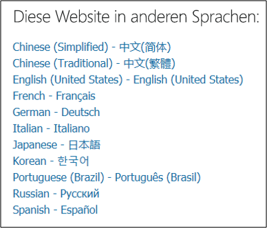

# Erste Schritte mit dem Microsoft Service Trust Portal

Das Microsoft Service Trust Portal bietet eine Vielzahl von Inhalten, Tools und anderen Ressourcen zu Microsoft-Sicherheits-, Datenschutz-und Compliance-Verfahren.
  
## Zugreifen auf das Dienst Vertrauensstellungs Portal

Das Dienst Vertrauensstellungs Portal enthält Details zur Implementierung von Steuerelementen und Prozessen von Microsoft, mit denen unsere Cloud-Dienste und die darin enthaltenen Kundendaten geschützt werden. Um auf einige Ressourcen im Dienst Vertrauensstellungs Portal zuzugreifen, müssen Sie sich mit Ihrem Microsoft Cloud Services-Konto als authentifizierter Benutzer anmelden (entweder ein Azure Active Directory-organisationskonto oder ein Microsoft-Konto) und die Microsoft GeheimhaltungsVereinbarung für Compliance-Materialien.
  
**Bestehende Kunden können auf das Service Trust** -Portal [https://aka.ms/STP](https://aka.ms/STP) bei einem der folgenden Online-Abonnements (Trial or Paid) zugreifen: 
  
- Office 365

- Dynamics 365

- Azure
    
 > [!NOTE]
 > Azure Active Directory-Konten, die Organisationen zugeordnet sind, haben Zugriff auf die gesamte Bandbreite von Dokumenten und Features wie Compliance-Manager. Microsoft-Konten, die für den persönlichen Gebrauch erstellt wurden, haben begrenzten Zugriff auf Inhalte des Service Trust-Portals. 
  
**Neue Kunden und Kunden, die Microsoft Online Services evaluieren**
  
Wenn Sie ein neues Konto erstellen oder ein Test Konto erstellen möchten, verwenden Sie eines der folgenden Anmeldeformulare (auch für Testkonten), um Zugriff auf STP zu erhalten.
  
- Registrieren Sie sich für ein neues [office 365 Business-Test Konto](https://go.microsoft.com/fwlink/p/?LinkID=507653) oder ein neues [Office 365 Enterprise-Test Konto](https://go.microsoft.com/fwlink/p/?LinkID=698279) .

- Registrieren Sie sich für ein neues [Dynamics 365-Test Konto](https://go.microsoft.com/fwlink/?LinkId=252780) .

- Registrieren Sie sich für ein neues [Azure](https://go.microsoft.com/fwlink/?LinkId=722737)-Testkonto. 
    
Wenn Sie sich für eine kostenlose Testversion oder ein Abonnement registrieren, müssen Sie Azure Active Directory aktivieren, um den Zugriff auf STP zu unterstützen.
  
## Verwenden des Dienst Vertrauensstellungs Portals

Auf die Features und Inhalte des Service Trust Portals kann über das Hauptmenü zugegriffen werden.
  

In den folgenden Abschnitten werden die einzelnen Elemente im Hauptmenü beschrieben.
  
### Vertrauensstellungsportal (STP)

Der Link **Service Trust Portal** zeigt die Homepage an. Es bietet eine schnelle Möglichkeit, zur Homepage zurückzukehren.

### Compliance

Stellt die folgenden Tools und Ressourcen zur Kompatibilität bereit:

- **Überwachungsberichte** : eine Liste unabhängiger Überwachungs-und Bewertungsberichte zu Microsoft-Cloud-Diensten wird angezeigt. Diese Berichte enthalten Informationen zur Einhaltung von Datenschutzstandards und behördlichen Vorschriften für Microsoft Cloud Services, wie zum Beispiel:
  
    - Internationale Organisation für Standardisierung (ISO)
    - Dienst Organisations-Steuerelemente (SOC)
    - National Institute of Standards and Technology (NIST)
    - Federal Risk and Authorization Management Program (FedRAMP)
    - Allgemeine Datenschutzverordnung (DSGVO)

  Informationen zu Überwachungsberichten und einem Link zur Seite **Überwachungsberichte** werden auch auf der Startseite des Dienst Vertrauensstellungs Portals angezeigt. 
  
- **Compliance** -Manager – Compliance-Manager ist ein Workflow basiertes Risiko Bewertungstool, mit dem Sie die behördlichen Compliance-Aktivitäten Ihrer Organisation im Zusammenhang mit Microsoft-Cloud-Diensten wie Office 365, Dynamics 365 und Azure. Verwenden Sie Compliance-Manager, um die Einhaltung gesetzlicher Vorschriften im gemeinsamen Verantwortungs Modell der Cloud zu verwalten. Weitere Informationen finden Sie unter [use Compliance Manager zur Erfüllung von Datenschutz-und behördlichen Anforderungen bei der Verwendung von Microsoft Cloud Services](meet-data-protection-and-regulatory-reqs-using-microsoft-cloud.md).

### Branchen & Regionen

Bietet Branchen-und regionsspezifische Kompatibilitätsinformationen zu Microsoft Cloud Services.

- **Industries** – bietet branchenspezifische Zielseiten für Informationen und darüber, wie Microsoft Cloud Services Ihre Organisation bei der Einhaltung von Standards und Vorschriften für diese Branchen unterstützt:

    - Schulung und Weiterbildung
    - Finanzdienstleistungen
    - Regierung
    - Integrität
    - Fertigung
    - Einzelhandel

- **Regionen** – bietet Rechtsgutachten zu Microsoft Cloud Services Compliance mit verschiedenen Gesetzen verschiedener Länder. Zu den einzelnen Ländern gehört Australien, Tschechien, Deutschland, Polen, Rumänien, Spanien und das Vereinigte Königreich.
  
### Dokumente & Ressourcen

Bietet eine Fülle von Sicherheits Implementierungs-und-Entwurfsinformationen mit dem Ziel, die Einhaltung gesetzlicher Vorgaben zu vereinfachen, indem Sie verstehen, wie Microsoft Cloud Services Ihre Daten sicher halten. Zum Überarbeiten von Inhalten wählen Sie eine der Optionen auf der Seite **Documents _AMP_ Resources** aus.

- Whitepapers, FAQs und vorGehensWeisen
- Compliance-Leitfäden
- Pen-Tests und Sicherheitsbewertungen
- Sicheres Ergebnis
- Azure-Sicherheits-und Konformitäts Pläne
- ÜberWachte Steuerelemente
  
### Sicherheitscenter

Links zum [Microsoft Trust Center](https://www.microsoft.com/trustcenter), das weitere Informationen zu Sicherheit, Compliance und Datenschutz in der Microsoft-Cloud bereitstellt. Hierzu gehören Informationen zu den Funktionen in Microsoft Cloud Services, die Sie verwenden können, um bestimmte Anforderungen des DSGVO zu erfüllen, Dokumentationen, die für Ihre DSGVO-Verantwortlichkeit und Ihr Verständnis der technischen und organisatorischen Maßnahmen hilfreich sind. Microsoft hat die DSGVO unterstützt.
  
### Meine Bibliothek

Mit diesem neuen Feature können Sie Dokumente speichern (oder *anheften*), sodass Sie auf Ihrer Seite Meine Bibliothek schnell darauf zugreifen. Sie können Benachrichtigungen auch einrichten, sodass Microsoft Ihnen eine e-Mail-Nachricht sendet, wenn Dokumente in ihrer meine-Bibliothek aktualisiert werden. Weitere Informationen finden Sie im Abschnitt [Meine Bibliothek](#my-library-1) in diesem Artikel.

### Administrator

Verwaltungsfunktionen, die nur für das globale Administratorkonto zur Verfügung stehen. Diese Option ist nur sichtbar, wenn Sie als globaler Administrator angemeldet sind.
  
 Auf der Seite " **Einstellungen** " können Sie dem Compliance-Manager den rollenbasierten Zugriff zuweisen. Weitere Informationen finden Sie im Abschnitt "Berechtigungen und rollenbasierte Zugriffssteuerung" unter [use Compliance Manager zur Erfüllung von Datenschutz-und behördlichen Anforderungen bei der Verwendung von Microsoft Cloud Services](meet-data-protection-and-regulatory-reqs-using-microsoft-cloud.md#permissions-and-role-based-access-control).
  
### Suche

Klicken Sie auf die Lupe in der oberen rechten Ecke der Seite Service Trust Portal, um das Feld zu erweitern, Ihre Suchbegriffe einzugeben und die **Eingabe**Taste zu drücken.

  
 Die **** Suchseite wird angezeigt, wobei der Suchbegriff im Suchfeld und die unten aufgeführten Suchergebnisse angezeigt werden.
  

Standardmäßig gibt die Suche Dokument Ergebnisse zurück. Sie können die Ergebnisse mithilfe von Dropdownlisten zum Verfeinern der angezeigten Dokumentliste verwenden. Sie können mehrere Filter verwenden, um die Liste der Dokumente einzuschränken. Zu den Filtern gehört die spezifische Cloud-Dienste, Kategorien von Konformitäts-oder Sicherheitsmethoden, Regionen und Branchen. Klicken Sie auf den Link Dokumentname, um das Dokument herunterzuladen.
  
Klicken Sie auf **Compliance-Manager**, um die Steuerelemente aus Bewertungen im Compliance-Manager aufzulisten. Die Suchergebnisse zeigen das Datum, an dem die Bewertung erstellt wurde, den Namen der Bewertungs Gruppierung, den entsprechenden Microsoft-Clouddienst und ob das Steuerelement von Microsoft oder vom Kunden verwaltet wird. Klicken Sie auf den Namen des Steuerelements, um das Steuerelement im Assessment im Compliance-Manager anzuzeigen.
  

  
> [!NOTE]
> Berichte und Dokumente des Service Trust Portals stehen mindestens 12 Monate nach der Veröffentlichung oder bis eine neue Version von Document verfügbar ist, zum Download bereit.
  
## Meine Bibliothek

Verwenden Sie das Feature Meine Bibliothek, um der Seite Meine Bibliothek Dokumente und Ressourcen im Dienst Vertrauensstellungs Portal hinzuzufügen. Auf diese Weise können Sie auf Dokumente zugreifen, die für Sie an einem zentralen Ort relevant sind.  Klicken Sie zum Hinzufügen eines Dokuments zu Ihrer Bibliothek auf das Menü **...** rechts neben einem Dokument, und wählen Sie dann **zu Bibliothek hinzufügen**aus. Sie können Ihrer meine Bibliothek mehrere Dokumente hinzufügen, indem Sie auf das Kontrollkästchen neben einem oder mehreren Dokumenten klicken und dann oben auf der Seite **auf in Bibliothek speichern** klicken.

Darüber hinaus können Sie mit der Benachrichtigungsfunktion Ihre meine Bibliothek so konfigurieren, dass eine e-Mail-Nachricht an Sie gesendet wird, wenn Microsoft ein Dokument aktualisiert, das Sie Ihrer meine Bibliothek hinzugefügt haben. Um Benachrichtigungen einzurichten, wechseln Sie zu "Meine Bibliothek", und klicken Sie auf **Benachrichtigungseinstellungen**. Sie können die Häufigkeit von Benachrichtigungen auswählen und eine e-Mail-Adresse in Ihrer Organisation angeben, an die Benachrichtigungen gesendet werden sollen. E-Mail-Benachrichtigungen enthalten Links zu den Dokumenten, die aktualisiert wurden, sowie eine kurze Beschreibung des Updates.

Beachten Sie, dass alle Dokumente in ihrer meine-Bibliothek identifiziert werden, die innerhalb der letzten 30 Tage aktualisiert wurden, unabhängig davon, ob Sie Benachrichtigungen aktivieren oder nicht. Eine kurze Beschreibung des Updates wird auch in einer QuickInfo angezeigt. 

## Starter Packs

Starter Packs sind eine von Microsoft kuratierte Dokumentation zu Microsoft Cloud Services für bestimmte Branchen. Derzeit bietet das Service Trust-Portal die folgenden drei Starter Packs für Finanzdienstleister. Diese Starter Packs helfen Organisationen bei der Bewertung und Bewertung von Sicherheit, Compliance und Datenschutz in der Microsoft-Cloud und bieten Hinweise zur Implementierung von Microsoft Cloud Services in der hoch regulierten Finanzdienstleistungsbranche.

- **Evaluation Starter Pack** -verwenden Sie für eine frühe Bewertung der Microsoft-Cloud für Finanzdienstleister.

- **Assessment-Starter Pack** – verwenden Sie nach der Evaluierung die Prüflisten und andere Anweisungen in diesem Starter Pack, damit Ihre Organisation Risiken im Zusammenhang mit Sicherheit, Compliance und Datenschutz bewerten kann.

- ÜberWachen des **Starter** Pack-users dieses Starter Paket für Hilfe bei der Verwendung von Überwachungs Steuerelementen und anderen Tools, die die Implementierung von Microsoft Cloud Services in einer Art und Weise unterstützen, die die Risikoanfälligkeit Ihrer Organisation reduziert.

Um auf diese Starter Packs zuzugreifen, wechseln Sie zu **Service Trust Portal _GT_ Industries _AMP_ Regionen _GT_ Industry Solutions _GT_ Financial Services**. Sie können Dokumente aus einem Starter Pack öffnen oder herunterladen oder in ihrer meine Bibliothek speichern.

## Unterstützung der Lokalisierung

Mit dem Dienst Vertrauensstellungs Portal können Sie den Seiteninhalt in verschiedenen Sprachen anzeigen. Um die Sprache der Seite zu ändern, klicken Sie einfach auf das Globussymbol in der unteren linken Ecke der Seite und wählen Sie die Sprache Ihrer Wahl aus. 
  

  
## Feedback

Wir helfen Ihnen bei Fragen zum Service Trust Portal oder bei Fehlern bei der Verwendung des Portals. Sie können sich auch mit Fragen und Feedback zu Kompatibilitätsberichten für Service Trust Portals und zu vertrauenswürdigen Ressourcen über den Link Feedback am unteren Rand der STP-Seiten in Verbindung setzen.
  
Ihr Feedback ist uns sehr wichtig. Klicken Sie unten auf der Seite auf die Schaltfläche Feedback, um uns Kommentare darüber zu senden, was Sie getan oder nicht gemocht haben, oder Vorschläge zur Verbesserung unserer Produkte oder Produktfeatures.
  

