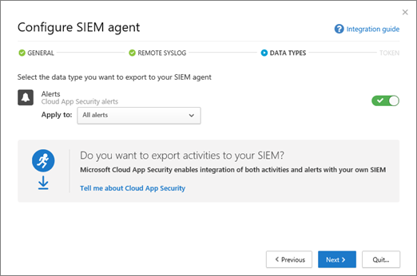

# <a name="integrate-your-siem-server-with-office-365-cloud-app-security"></a>Integrieren Ihres SIEM-Servers in Office 365 Cloud App Security
  
|Auswertung * *\>**|Planung * *\>**|Bereitstellung * *\>**|Auslastung * * * *|
|:-----|:-----|:-----|:-----|
|[Evaluierung starten](office-365-cas-overview.md) <br/> |[Planung starten](get-ready-for-office-365-cas.md) <br/> |Sie sind hier!  <br/> [Nächster Schritt](utilization-activities-for-ocas.md) <br/> |[Verwendung beginnen](utilization-activities-for-ocas.md) <br/> |
   
## <a name="overview-and-prerequisites"></a>Übersicht und Voraussetzungen

Sie können [Office 365 Cloud App Security](get-ready-for-office-365-cas.md) in ihren Security Information and Event Management (SIEM)-Server integrieren, um eine zentralisierte Überwachung von Warnungen zu ermöglichen. Dies gilt insbesondere für Organisationen, die Cloud-Dienste und lokale Serveranwendungen verwenden. Sie können Ihren SIEM-Server integrieren, um Warnungen und Aktivitäten von Office 365 Cloud App Security auf Ihren SIEM-Server zu überführen. Die Integration mit einem SIEM-Server ermöglicht es Ihrem Sicherheitsteam, Ihre Office 365-Anwendungen besser zu schützen und gleichzeitig ihren üblichen Sicherheits Workflow beizubehalten, indem Sie bestimmte Sicherheitsverfahren automatisieren und zwischen Cloud-basierten und lokalen Ereignissen korrelieren.  
  
Wenn Sie Ihren SIEM-Server zunächst mit der Office 365 Cloud App-Sicherheit integrieren, werden Warnungen der letzten beiden Tage an den SIEM-Server und alle Warnungen von dann an weitergeleitet (basierend auf den von Ihnen ausgewählten Filtern). Wenn Sie dieses Feature über einen längeren Zeitraum hinweg deaktivieren, werden Sie darüber hinaus die letzten zwei Tage mit Warnungen und dann alle Benachrichtigungen weiterleiten.

### <a name="siem-integration-architecture"></a>SIEM-Integrationsarchitektur

Ein SIEM-Agent ist im Netzwerk Ihrer Organisation eingerichtet. Bei der Bereitstellung und Konfiguration zieht der SIEM-Agent die konfigurierten Datentypen (Warnungen) mithilfe von Office 365 Cloud App Security RESTFUL-APIs. Der Datenverkehr wird dann über einen verschlüsselten HTTPS-Kanal an der Schnittstelle 443 gesendet.
  
Wenn ein SIEM-Agent Daten aus Office 365 Cloud App Security abruft, sendet er die Syslog-Nachrichten mithilfe der Netzwerkkonfigurationen, die während des Setups bereitgestellt werden (TCP oder UDP mit einem benutzerdefinierten Port).


### <a name="supported-siem-servers"></a>Unterstützte SIEM-Server

Office 365 Cloud App Security unterstützt derzeit die folgenden SIEM-Server:
- Micro Focus ArcSight
- Generisches CEF

### <a name="prerequisites"></a>Voraussetzungen

- Sie müssen ein globaler Administrator oder Sicherheitsadministrator sein, um die in diesem Artikel beschriebenen Aufgaben ausführen zu können. Weitere Informationen finden Sie unter [Permissions &amp; in the Office 365 Security Compliance Center](permissions-in-the-security-and-compliance-center.md)

- Sie müssen [Office 365 Cloud App Security](turn-on-office-365-cas.md) für Ihre Organisation aktiviert haben.

- Die [Überwachungsprotokollierung](turn-audit-log-search-on-or-off.md) muss für Office 365 aktiviert sein.

- Zum Konfigurieren der SIEM-Server Integration benötigen Sie einen Standardserver, der die folgenden Anforderungen erfüllt:
    - Betriebssystem: Windows oder Linux (Dies kann ein virtueller Computer sein)
    - CPU: 2
    - Speicherplatz: 20 GB
    - RAM: 2 GB
    - [Oracle Java 8](http://www.oracle.com/technetwork/java/javase/downloads/index.html) installiert
    - Firewall gemäß der Beschreibung unter [Netzwerkanforderungen](https://docs.microsoft.com/cloud-app-security/network-requirements)

- Sie benötigen Details zu Ihrem **Remote-syslog-Host** und zur Syslot-Portierungs **Nummer**. Ein Netzwerkadministrator oder Sicherheitsadministrator sollte Ihnen bei der Lokalisierung dieser Informationen behilflich sein. 

- Sie müssen den [Software-Lizenzbedingungen](https://go.microsoft.com/fwlink/?linkid=862491) zustimmen, um die [JAR-Datei](https://go.microsoft.com/fwlink/?linkid=838596) herunterzuladen, die Sie für die Integration Ihres Siem-Servers benötigen.
 
## <a name="step-1-set-it-up-a-siem-agent-in-office-365-cloud-app-security"></a>Schritt 1: Einrichten eines SIEM-Agents in Office 365 Cloud App Security

1. Wechseln Sie zum Cloud App Security Portal ([https://portal.cloudappsecurity.com](https://portal.cloudappsecurity.com)), und melden Sie sich an.
  
2. Klicken Sie auf **Sicherheitserweiterungen**für **Einstellungen** \> und dann auf Siem-Agents.<br/>


3. Wählen Sie **Add Siem Agent**aus.<br/>
    
4. Wählen Sie **Start-Assistent**aus.<br/> 
    
5. Geben Sie im Abschnitt **Allgemein** einen Namen ein, und **Wählen Sie Ihr Siem-Format** aus, und legen Sie alle für dieses Format relevanten **erweiterten Einstellungen** fest. Klicken Sie dann auf **weiter**.<br/>
    
6. Geben Sie im **Remote-syslog** -Schritt die IP-Adresse oder den Hostnamen des Remote-syslog- **Hosts** und die syslog- **Portierungs Nummer**an. Wählen Sie TCP oder UDP als Remote-syslog-Protokoll aus. (Sie können mit Ihrem Netzwerkadministrator oder Sicherheitsadministrator zusammenarbeiten, um diese Details zu erhalten, wenn Sie diese nicht haben.) Klicken Sie dann auf **weiter**.<br/>
  
7. Führen Sie im Schritt **Datentypen** einen der folgenden Schritte aus, und klicken Sie dann auf **weiter**:
    - Standardeinstellung **aller Warnungen** beibehalten<br/>ODER
    - Klicken Sie auf **alle Warnungen**, und wählen Sie dann **bestimmte Filter**aus. Definieren Sie Filter, um die Arten von Warnungen auszuwählen, die Sie an Ihren SIEM-Server senden möchten.
<br/>
  
8. Kopieren Sie auf dem Bildschirm Glückwünsche das Token, und speichern Sie es für später.<br/> 

> [!IMPORTANT]
> Zu diesem Zeitpunkt haben Sie einen SIEM-Agent in Office 365 Cloud App Security eingerichtet, aber ihre SIEM-Server Integration ist noch nicht abgeschlossen. Fahren Sie mit dem nächsten Schritt fort, um Ihre SIEM-Server Integration weiterzuführen.

Nachdem Sie auf Schließen und den Assistenten verlassen haben, können Sie auf dem Bildschirm Sicherheitserweiterungen den SIEM-Agent sehen, den Sie in der Tabelle hinzugefügt haben. Er zeigt den Status **erstellt** an, bis er später verbunden wird.


    
## <a name="step-2-download-a-jar-file-and-run-it-on-your-siem-server"></a>Schritt 2: Herunterladen einer JAR-Datei und ausführen auf Ihrem SIEM-Server

1. Laden Sie den [Microsoft Cloud App Security Siem-Agent](https://go.microsoft.com/fwlink/?linkid=838596) herunter, und entpacken Sie den Ordner. (Sie müssen den [Software-Lizenzbedingungen](https://go.microsoft.com/fwlink/?linkid=862491) zustimmen, um fortzufahren.) 
    
2. Extrahieren Sie die JAR-Datei aus dem gezippten Ordner, und führen Sie Sie auf Ihrem SIEM-Server aus.
    
3. Führen Sie nach dem Ausführen der Datei den folgenden Befehl aus:<br/>
  ```
  java -jar mcas-siemagent-0.87.20-signed.jar [--logsDirectory DIRNAME] [--proxy ADDRESS[:PORT]] --token TOKEN
  ```
### <a name="important-notes"></a>Wichtige Hinweise:

- Der Dateiname kann je nach der Version des SIEM-Agents unterschiedlich sein. 

- Es wird empfohlen, dass Sie die JAR-Datei auf Ihrem SIEM-Server während des Server Setups ausführen.

    - **Windows**: Ausführen als geplante Aufgabe, indem Sie sicherstellen, dass Sie die Aufgabe so konfigurieren, dass Sie **ausgeführt wird, unabhängig davon, ob der Benutzer angemeldet ist** , und die **Aufgabe beenden, wenn Sie länger als Option ausgeführt** wird.

    - **Linux**: Fügen Sie den Befehl ausführen mit **&** der `rc.local` Datei hinzu. <br/>Beispiel:<br/> 
    ```
    java -jar mcas-siemagent-0.87.20-signed.jar [--logsDirectory DIRNAME] [--proxy ADDRESS[:PORT]] --token TOKEN &
    ```

- Parameter in eckigen Klammern [] sind optional und sollten nur verwendet werden, wenn relevant. Verwenden Sie die folgenden Variablen:

    - **Dirname** ist der Pfad zu dem Verzeichnis, das Sie für lokale Agent-Debug-Protokolle verwenden möchten.

    - **Address [:P Ort]** ist die Proxyserveradresse und-Portierung, die der Server für die Verbindung mit dem Internet verwendet.

    - **Token** ist das Siem-Agent-Token, das Sie im ersten Verfahren kopiert haben.

    - Um Hilfe zu erhalten, `-h`geben Sie. 
  
## <a name="step-3-validate-that-the-siem-agent-is-working"></a>Schritt 3: überPrüfen, ob der SIEM-Agent funktioniert

1. Stellen Sie sicher, dass der Status des SIEM-Agents im Sicherheitsportal der Office 365 Cloud-APP nicht als **Verbindungsfehler** angezeigt wird und keine Agent-Benachrichtigungen vorhanden sind. ****<br/>Beispielsweise können wir hier sehen, ob der SIEM-Server verbunden ist:<br/><br/>Und hier sehen wir, dass der SIEM-Server getrennt ist:<br/> 
  
2. Stellen Sie sicher, dass in Ihrem syslog/SIEM-Server Warnungen aus Office 365 Cloud App Security angezeigt werden.
  
## <a name="what-the-logfiles-look-like"></a>Wie die Logfiles aussehen

Es folgt ein Beispiel für Warnungs-Logfiles, die an einen SIEM-Server gesendet werden:

```
2017-07-15T20:42:30.531Z CEF:0|MCAS|SIEM_Agent|0.102.17|ALERT_CABINET_EVENT_MATCH_AUDIT|myPolicy|3|externalId=596a7e360c204203a335a3fb start=1500151350531 end=1500151350531 msg=Activity policy ''myPolicy'' was triggered by ''admin@box-contoso.com'' suser=admin@box-contoso.com destinationServiceName=Box cn1Label=riskScore cn1= cs1Label=portalURL cs1=https://cloud-app-security.com/#/alerts/596a7e360c204203a335a3fb cs2Label=uniqueServiceAppIds cs2=APPID_BOX cs3Label=relatedAudits cs3=1500151288183_acc891bf-33e1-424b-a021-0d4370789660 cs4Label=policyIDs cs4=59f0ab82f797fa0681e9b1c7

2017-07-16T09:36:26.550Z CEF:0|MCAS|SIEM_Agent|0.102.17|ALERT_CABINET_EVENT_MATCH_AUDIT|test-activity-policy|3|externalId=596b339b0c204203a33a51ae start=1500197786550 end=1500197786550 msg=Activity policy ''test-activity-policy'' was triggered by ''user@contoso.com'' suser=user@contoso.com destinationServiceName=Salesforce cn1Label=riskScore cn1= cs1Label=portalURL cs1=https://cloud-app-security.com/#/alerts/596b339b0c204203a33a51ae cs2Label=uniqueServiceAppIds cs2=APPID_SALESFORCE cs3Label=relatedAudits cs3=1500197720691_b7f6317c-b8de-476a-bc8f-dfa570e00349 cs4Label=policyIDs cs4=

2017-07-16T09:17:03.361Z CEF:0|MCAS|SIEM_Agent|0.102.17|ALERT_CABINET_EVENT_MATCH_AUDIT|test-activity-policy3|3|externalId=596b2fd70c204203a33a3eeb start=1500196623361 end=1500196623361 msg=Activity policy ''test-activity-policy3'' was triggered by ''admin@contoso.com'' suser=admin@contoso.com destinationServiceName=Office 365 cn1Label=riskScore cn1= cs1Label=portalURL cs1=https://cloud-app-security.com/#/alerts/596b2fd70c204203a33a3eeb cs2Label=uniqueServiceAppIds cs2=APPID_O365 cs3Label=relatedAudits cs3=1500196549157_a0e01f8a-e29a-43ae-8599-783c1c11597d cs4Label=policyIDs cs4=

2017-07-16T09:17:15.426Z CEF:0|MCAS|SIEM_Agent|0.102.17|ALERT_CABINET_EVENT_MATCH_AUDIT|test-activity-policy|3|externalId=596b2fd70c204203a33a3eec start=1500196635426 end=1500196635426 msg=Activity policy ''test-activity-policy'' was triggered by ''admin@contoso.com'' suser=admin@contoso.com destinationServiceName=Microsoft Office 365 admin center cn1Label=riskScore cn1= cs1Label=portalURL cs1=https://cloud-app-security.com/#/alerts/596b2fd70c204203a33a3eec cs2Label=uniqueServiceAppIds cs2=APPID_O365_PORTAL cs3Label=relatedAudits cs3=1500196557398_3e102b20-d9fa-4f66-b550-8c7a403bb4d8 cs4Label=policyIDs cs4=59f0ab35f797fa9811e9b1c7

2017-07-16T09:17:46.290Z CEF:0|MCAS|SIEM_Agent|0.102.17|ALERT_CABINET_EVENT_MATCH_AUDIT|test-activity-policy4|3|externalId=596b30200c204203a33a4765 start=1500196666290 end=1500196666290 msg=Activity policy ''test-activity-policy4'' was triggered by ''admin@contoso.com'' suser=admin@contoso.com destinationServiceName=Microsoft Exchange Online cn1Label=riskScore cn1= cs1Label=portalURL cs1=https://cloud-app-security.com/#/alerts/596b30200c204203a33a4765 cs2Label=uniqueServiceAppIds cs2=APPID_OUTLOOK cs3Label=relatedAudits cs3=1500196587034_a8673602-7e95-46d6-a1fe-c156c4709c5d cs4Label=policyIDs cs4=

2017-07-16T09:41:04.369Z CEF:0|MCAS|SIEM_Agent|0.102.17|ALERT_CABINET_EVENT_MATCH_AUDIT|test-activity-policy2|3|externalId=596b34b10c204203a33a5240 start=1500198064369 end=1500198064369 msg=Activity policy ''test-activity-policy2'' was triggered by ''user2@test15-adallom.com'' suser=user2@test15-adallom.com destinationServiceName=Google cn1Label=riskScore cn1= cs1Label=portalURL cs1=https://cloud-app-security.com/#/alerts/596b34b10c204203a33a5240 cs2Label=uniqueServiceAppIds cs2=APPID_33626 cs3Label=relatedAudits cs3=1500197996117_fd71f265-1e46-4f04-b372-2e32ec874cd3 cs4Label=policyIDs cs4=
```

Und hier ein weiteres Beispiel, diesmal im CEF-Format:


|CEF-Feldname  | Beschreibung  |
|---------|---------|
|start     | Warnungszeit Stempel        |
|end     | Warnungszeit Stempel        |
|RT     | Warnungszeit Stempel        |
|msg     | Warnungsbeschreibung im Office 365 Cloud App Security Portal        |
|suser     | Warnungs Betreff-Benutzer        |
|destinationServiceName     | Warnungs Absender-APP, wie Office 365, SharePoint oder OneDrive        |
|csLabel     | Variiert (Bezeichnungen haben unterschiedliche Bedeutungen). Beschriftungen sind in der Regel selbsterklärend, wie targetObjects.        |
|cs     | Informationen, die einer Bezeichnung entsprechen (beispielsweise der Zielbenutzer einer Warnung gemäß dem Bezeichnungs Beispiel)        |

## <a name="additional-tasks-as-needed"></a>Zusätzliche Aufgaben (je nach Bedarf)

Nachdem Sie Ihren SIEM-Server konfiguriert und mit Office 365 Cloud App Security integriert haben, müssen Sie möglicherweise ein Token erneut generieren, einen SIEM-Agent bearbeiten oder einen SIEM-Agent löschen. In den folgenden Abschnitten wird beschrieben, wie Sie diese Aufgaben ausführen.

### <a name="regenerate-a-token"></a>Erneutes Generieren eines Tokens

Wenn Sie Ihr Token verlieren, können Sie es erneut generieren. 

1. wählen sie im Office 365 Cloud App security portal[https://portal.cloudappsecurity.com](https://portal.cloudappsecurity.com)() die option**sicherheitserweiterungen**für **einstellungen** > aus.

2. Suchen Sie in der Tabelle die Zeile für den SIEM-Agent. 

3. Klicken Sie auf die Ellipsen, und wählen Sie dann **Token erneut generieren**aus.<br/>
  
### <a name="edit-a-siem-agent"></a>Bearbeiten eines SIEM-Agents

1. wählen sie im Office 365 Cloud App security portal[https://portal.cloudappsecurity.com](https://portal.cloudappsecurity.com)() die option**sicherheitserweiterungen**für **einstellungen** > aus.

2. Suchen Sie die Zeile für den SIEM-Agent. 

3. Klicken Sie auf die Ellipsen, und wählen Sie dann **Bearbeiten**aus. (Wenn Sie den SIEM-Agent bearbeiten, müssen Sie die JAR-Datei nicht erneut ausführen; Sie wird automatisch aktualisiert.) <br/>
  
### <a name="delete-a-siem-agent"></a>Löschen eines SIEM-Agents

1. wählen sie im Office 365 Cloud App security portal[https://portal.cloudappsecurity.com](https://portal.cloudappsecurity.com)() die option**sicherheitserweiterungen**für **einstellungen** > aus.

2. Suchen Sie die Zeile für den SIEM-Agent. 

3. Klicken Sie auf die Ellipsen, und wählen Sie dann **Löschen**aus.<br/>

  
## <a name="next-steps"></a>Nächste Schritte

- [Nutzungsaktivitäten nach der Einführung von Office 365 Cloud App Security](utilization-activities-for-ocas.md)
    
- [Überarbeiten und Aktionen für Warnungen](review-office-365-cas-alerts.md)
    
- [Gruppieren Ihrer IP-Adressen zur Vereinfachung der Verwaltung](group-your-ip-addresses-in-ocas.md)
    

