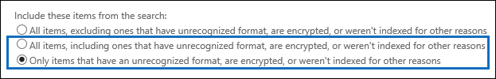

# <a name="investigating-partially-indexed-items-in-office-365-ediscovery"></a>Untersuchen von teilweise indizierten Elementen in Office 365 eDiscovery

Content-Suche, die Sie über die Office 365-Sicherheit ausführen &amp; Compliance Center enthält teilweise indizierte Elemente automatisch in der geschätzten Suchergebnisse, wenn Sie eine Suche ausführen. Teilweise indizierte Elemente sind Exchange Postfachelemente und Dokumenten auf SharePoint und OneDrive for Business-Websites, die aus irgendeinem Grund für die Suche vollständig indiziert wurden nicht. Die meisten e-Mail-Nachrichten und Dokumente werden erfolgreich indiziert, da sie innerhalb der [Grenzwerte für die Indizierung für e-Mail-Nachrichten](limits-for-content-search.md#indexing-limits-for-email-messages)liegen. Einige Elemente möglicherweise diese Indizierung Grenzwerte überschreiten und teilweise indiziert werden. Hier sind andere Gründe, warum Elemente können nicht für die Suche indiziert werden und werden als teilweise indizierte Elemente zurückgegeben, bei der Ausführung einer Inhaltssuche:
  
- E-Mail-Nachrichten müssen eine angefügte Datei einen Dateityp, die nicht indiziert werden kann. in den meisten Fällen wird der Dateityp [nicht erkannte oder für die Indizierung wird nicht unterstützt](partially-indexed-items-in-content-search.md#file-types-not-indexed-for-search)
    
- E-Mail-Nachrichten haben eine angefügte Datei ohne einen gültigen Handler, beispielsweise Bilddateien. Dies ist die häufigste Ursache teilweise indizierten e-Mail-Elemente
    
- Zu viele Dateien, die an eine e-Mail-Nachricht angehängt
    
- Eine Datei an eine e-Mail-Nachricht angehängt ist zu groß
    
- Der Dateityp ist für die Indizierung unterstützt, aber für eine bestimmte Datei ist ein Indizierung Fehler aufgetreten.
    
Obwohl variiert, haben die meisten Kunden von Office 365-Organisationen kleiner als 1 % des Inhalts und weniger als 12 % des Inhalts nach Größe, die teilweise indiziert ist. Der Grund für die Differenz zwischen der Lautstärke im Vergleich zur Größe ist, dass größere Dateien steigt die Wahrscheinlichkeit eines mit Inhalten, die nicht vollständig indiziert werden kann.
  
## <a name="why-does-the-partially-indexed-item-count-change-for-a-search"></a>Warum wird die Anzahl der teilweise indizierte Elemente für eine Suche geändert?

Nach dem Ausführen einer Inhaltssuche in die Office 365-Sicherheit &amp; Compliance Center, die gesamte Anzahl und Größe der teilweise indizierte Elemente in die Speicherorte, die durchsucht wurden aufgelisteten in das Ergebnis Suchstatistik, die in die ausführlichen Statistiken für angezeigt werden die Suche. Beachten Sie, dass diese *nicht indizierten Elemente* in die Suchstatistik aufgerufen werden. Hier sind einige Punkte, die die Anzahl der teilweise indizierte Elemente auswirken, die in den Suchergebnissen zurückgegeben werden: 
  
- Wenn ein Element teilweise indiziert wird und die Suchabfrage entspricht, ist es in der Anzahl von Elementen (und die Größe) der Suchergebnisse und teilweise indizierte Elemente enthalten. Wenn die Ergebnisse dieser Suche gleichen exportiert werden, ist das Element jedoch nur mit den Suchergebnissen enthalten. Es ist nicht als teilweise indizierte Element enthalten.
    
- Wenn Sie einen Datumsbereich für eine Suchabfrage (einschließlich es in der Stichwortabfrage) oder mit einer Bedingung angeben, ist nicht in der Anzahl der teilweise indizierte Elemente aller teilweise indizierte Elemente, die nicht den Datumsbereich entspricht enthalten. Nur die teilweise indizierte Elemente, die im Datumsbereich liegen sind in der Anzahl der teilweise indizierte Elemente enthalten.
    
 **Hinweis:** Teilweise indizierte Elemente befindet sich im SharePoint und OneDrive Websites *sind nicht* enthalten, die in der Schätzung der teilweise indizierte Elemente, die in die ausführlichen Statistiken für die Suche angezeigt wird. Teilweise indizierte Elemente können jedoch exportiert werden, wenn Sie die Ergebnisse einer Inhaltssuche exportieren. Wenn Sie nur Websites in einer Inhaltssuche die geschätzte Anzahl teilweise gesucht werden beispielsweise indizierte Elemente NULL sein. 
  
## <a name="calculating-the-ratio-of-partially-indexed-items-in-your-organization"></a>Er das Verhältnis von teilweise indizierte Elemente in Ihrer Organisation

Um Ihre Organisation die Angriffsfläche teilweise indizierte Elemente zu verstehen, können Sie eine Suche für den gesamten Inhalt in allen Postfächern (mithilfe einer schlüsselwortabfrage leere) ausführen. Im folgenden Beispiel werden 56,208 (4,830 MB) vollständig indizierte Elemente und 470 (316 MB) teilweise indizierte Elemente.
  

  
Sie können den Prozentsatz der teilweise indizierte Elemente bestimmen, mithilfe der folgenden Berechnungen verwendet.
  
 **Um das Verhältnis von teilweise indizierte Elemente in Ihrer Organisation zu berechnen:**

`(Total number of partially indexed items/Total number of items) x 100`


`(470/56,208) x 100 = 0.84%`
 
Mit den Suchergebnissen aus dem vorherigen Beispiel,. 84 % aller Postfächer Elemente sind teilweise indiziert.
  
 **Um den Prozentsatz der Größe des teilweise indizierte Elemente in Ihrer Organisation zu berechnen:**

`(Size of all partially indexed items/Size of all items) x 100`

`(316 MB/4830 MB) x 100 = 6.54%`

Damit im vorherigen Beispiel 6.54 % der Gesamtgröße der Postfachelemente teilweise indizierte Elemente gelten. Wie bereits erwähnt, die meisten Office 365-Organisationen, die Kunden weniger als 1 % des Inhalts vom Datenträger und weniger als 12 % des Inhalts nach Größe haben, die teilweise indiziert ist.

## <a name="working-with-partially-indexed-items"></a>Arbeiten mit teilweise indizierte Elemente

In Fällen, wenn Sie teilweise untersuchen Elemente, um zu überprüfen, dass sie nicht die relevanten Informationen enthalten, können Sie [einen Bericht Inhaltssuche exportieren](export-a-content-search-report.md) müssen enthält, Informationen zu teilweise indizierte Elemente. Wenn Sie einen Bericht Inhaltssuche exportieren, müssen Sie wählen eine der Exportoptionen, die teilweise indizierte Elemente enthält. 
  

  
Beim Exportieren von Suchergebnissen oder eines Inhaltssuche-Berichts mithilfe einer dieser Optionen enthält der Export ein Berichts mit dem Namen nicht indizierten Items.csv. Dieser Bericht enthält die meisten die gleichen Informationen wie die Datei ResultsLog.csv; die Datei nicht indizierten Items.csv enthält jedoch auch zwei Felder im Zusammenhang mit teilweise indizierte Elemente: **Fehler Tags** und **Fehler-Eigenschaften**. Diese Felder enthalten Informationen über die Indizierung Fehler für jedes teilweise indizierten Element. Mithilfe der Informationen in dieser beiden Felder kann Ihnen bestimmen, ob der Indizierung Fehler für einen bestimmten wirkt sich die Untersuchung auf. Wenn dies der Fall ist, können eine gezielte Inhaltssuche Sie und Abrufen und Ausführen Exportieren bestimmter e-Mail-Nachrichten und SharePoint oder OneDrive-Dokumente, sodass Sie überprüfen können, um zu bestimmen, wenn sie für Ihre Untersuchung relevant sind. Schrittweise Anweisungen finden Sie unter [Vorbereiten einer CSV-Datei für eine gezielte Inhaltssuche in Office 365](csv-file-for-an-id-list-content-search.md).
  
 **Hinweis:** Die Datei nicht indizierten Items.csv enthält auch Felder mit dem Namen **Fehlertyp** und eine **Fehlermeldung**. Dies sind ältere Felder, die Informationen enthalten, die mit den Informationen in den Feldern **Fehler Tags** und **Eigenschaften Fehler** , aber mit weniger detaillierte Informationen ähnlich ist. Sie können diese Vorversion Felder ignorieren. 
  
## <a name="errors-related-to-partially-indexed-items"></a>Fehler im Zusammenhang mit teilweise indizierte Elemente

Fehler Tags bestehen aus zwei Teilen Informationen, die Fehlernummer und den Dateityp. Beispielsweise in diesem Fehler/Filetype-Paar:

```
 parseroutputsize_xls
```

   
 `parseroutputsize`ist der Fehler und `xls` ist der Dateityp, der der Fehler aufgetreten ist, klicken Sie auf Datei. Der Dateityp wurde nicht erkannt, oder der Dateityp wurde Fällen waren gilt nicht auf den Fehler, sehen Sie den Wert `noformat` anstelle des Dateityps. 
  
Es folgt eine Liste der Indizierung Fehler und eine Beschreibung für die Ursache des Fehlers.
  
|**Fehlertag**|**Beschreibung**|
|:-----|:-----|
| `attachmentcount` <br/> |Eine e-Mail-Nachricht hat zu viele Anlagen, und einige dieser Anlagen werden nicht verarbeitet.  <br/> |
| `attachmentdepth` <br/> |Der Inhalte Suchfunktion und Dokument-Parser gefunden zu viele Ebenen von Anlagen in anderen Anlagen geschachtelt. Einige dieser Anlagen wurden nicht verarbeitet.  <br/> |
| `attachmentrms` <br/> |Eine Anlage konnte nicht Decodierung, da es RMS-geschützten wurde.  <br/> |
| `attachmentsize` <br/> |An eine e-Mail-Nachricht angefügte Datei war zu groß und nicht verarbeitet werden konnte.  <br/> |
| `indexingtruncated` <br/> |Beim Schreiben der verarbeiteten e-Mail-Nachricht in den Index der indizierbaren Eigenschaften war zu groß und wurde abgeschnitten. Die abgeschnittenen Eigenschaften sind im Feld Fehlereigenschaften aufgelistet.  <br/> |
| `invalidunicode` <br/> |Eine e-Mail-Nachricht enthält Text, der konnte nicht als gültige Unicode verarbeitet werden. Die Indizierung für dieses Element möglicherweise unvollständig.  <br/> |
| `parserencrypted` <br/> |Der Inhalt der Anlage oder ein e-Mail-Nachricht wird verschlüsselt, und Office 365 konnte nicht Decodieren der Inhalte.  <br/> |
| `parsererror` <br/> |Während der Analyse ist ein Unbekannter Fehler aufgetreten. Dies führt in der Regel aus einem Software-Fehler oder einem Dienst Absturz.  <br/> |
| `parserinputsize` <br/> |Eine Anlage war zu groß für den Parser behandelt, und die Analyse von dieser Anlage nicht erfolgen oder wurde nicht abgeschlossen.  <br/> |
| `parsermalformed` <br/> |Eine Anlage war ungültig und konnte nicht vom Parser behandelt werden. Dieses Ergebnis aus alten Datei kann formatiert, vom inkompatible Software oder Viren vorgeben, etwas andere als angefordert sein erstellte Dateien.  <br/> |
| `parseroutputsize` <br/> |Die Ausgabe aus der Analyse eines Anlage war zu lang und mussten gekürzt werden.  <br/> |
| `parserunknowntype` <br/> |Eine Anlage hat einen Dateityp, den Office 365 erkennen konnte nicht.  <br/> |
| `parserunsupportedtype` <br/> |Eine Anlage hat einen Dateityp, den Office-365could erkennen, aber Analysieren von diesem Dateityp wird nicht unterstützt.  <br/> |
| `propertytoobig` <br/> |Der Wert einer e-Mail-Eigenschaft im Exchange Store war zu groß abgerufen werden sollen, und die Nachricht konnte nicht verarbeitet werden. Dies geschieht in der Regel nur auf die Body-Eigenschaft einer e-Mail-Nachricht.  <br/> |
| `retrieverrms` <br/> |Die Suchfunktion Content zum Decodieren einer Nachricht RMS-geschützten ist fehlgeschlagen.  <br/> |
| `wordbreakertruncated` <br/> |Zu viele Wörter wurden während der Indizierung in das Dokument identifiziert. Verarbeitung der-Eigenschaft angehalten, wenn den Grenzwert erreicht und die Eigenschaft abgeschnitten wird.  <br/> |
   
Fehler Felder wird beschrieben, welche Felder von der im Feld Fehler Tags aufgeführte Verarbeitungsfehler betroffen sind. Wenn Sie eine Eigenschaft wie Suchen `subject` oder `participants`, Fehler im Textkörper der Nachricht wird nicht die Ergebnisse der Suche auswirkt. Dies kann hilfreich sein, wenn genau die teilweise indizierte Elemente bestimmen Sie möglicherweise weiter zu untersuchen.
  
## <a name="using-a-powershell-script-to-determine-your-organizations-exposure-to-partially-indexed-email-items"></a>Verwenden eines PowerShell-Skripts zum Ermitteln Ihrer Organisation die Angriffsfläche teilweise indizierten e-Mail-Elemente

Die folgenden Schritten wird gezeigt, wie Sie ein PowerShell-Skript ausführen, sucht nach allen Elementen in alle Exchange-Postfächer, und klicken Sie dann generiert einen Bericht zu Ihrer Organisation Verhältnis teilweise indizierten e-Mail-Elemente (nach Anzahl und Größe) und zeigt die Anzahl der Elemente (und der Dateityp) für jeden Indizierung aufgetretenen. Verwenden Sie die Beschreibung der Fehler Tag im vorherigen Abschnitt, um die Indizierung Fehler zu identifizieren.
  
1. Speichern Sie den folgenden Text in einer Windows PowerShell-Skriptdatei, mithilfe der Dateiname Suffix. ps1; beispielsweise `PartiallyIndexedItems.ps1`.

```
  write-host "**************************************************"
  write-host "     Office 365 Security &amp; Compliance Center      " -foregroundColor yellow -backgroundcolor darkgreen
  write-host "   eDiscovery Partially Indexed Item Statistics   " -foregroundColor yellow -backgroundcolor darkgreen
  write-host "**************************************************"
  " " 
  # Create a search with Error Tags Refinders enabled
  Remove-ComplianceSearch "RefinerTest" -Confirm:$false -ErrorAction 'SilentlyContinue'
  New-ComplianceSearch -Name "RefinerTest" -ContentMatchQuery "size>0" -RefinerNames ErrorTags -ExchangeLocation ALL
  Start-ComplianceSearch "RefinerTest"
  # Loop while search is in progress
  do{
      Write-host "Waiting for search to complete..."
      Start-Sleep -s 5
      $complianceSearch = Get-ComplianceSearch "RefinerTest"
  }while ($complianceSearch.Status -ne 'Completed')
  $refiners = $complianceSearch.Refiners | ConvertFrom-Json
  $errorTagProperties = $refiners.Entries | Get-Member -MemberType NoteProperty
  $partiallyIndexedRatio = $complianceSearch.UnindexedItems / $complianceSearch.Items
  $partiallyIndexedSizeRatio = $complianceSearch.UnindexedSize / $complianceSearch.Size
  " "
  "===== Partially indexed items ====="
  "         Total          Ratio"
  "Count    {0:N0}{1:P2}" -f $complianceSearch.Items.ToString("N0").PadRight(15, " "), $partiallyIndexedRatio
  "Size(GB) {0:N2}{1:P2}" -f ($complianceSearch.Size / 1GB).ToString("N2").PadRight(15, " "), $partiallyIndexedSizeRatio
  " "
  Write-Host ===== Reasons for partially indexed items =====
  foreach($errorTagProperty in $errorTagProperties)
  {
      $name = $refiners.Entries.($errorTagProperty.Name).Name
      $count = $refiners.Entries.($errorTagProperty.Name).TotalCount
      $frag = $name.Split("{_}")
      $errorTag = $frag[0]
      $fileType = $frag[1]
      if ($errorTag -ne $lastErrorTag)
      {
          $errorTag
      }
      "    " + $fileType + " => " + $count
      $lastErrorTag = $errorTag
  }
  
```
   
2. [Verbinden mit Office 365-Sicherheit &amp; Compliance Center PowerShell](https://go.microsoft.com/fwlink/p/?linkid=627084).
    
3. Sicherheit &amp; Compliance Center PowerShell, wechseln Sie zu dem Ordner, in dem Sie das Skript in Schritt 1 gespeichert, und führen Sie das Skript; Zum Beispiel:

    ```
    .\PartiallyIndexedItems.ps1
    ```
   
Es folgt ein Beispiel fo die Ausgabe vom Skript zurückgegeben.
  

  
Beachten Sie Folgendes:
  
1. Total Anzahl und Größe von e-Mail-Elementen und Ihrer Organisation Verhältnis teilweise indizierten e-Mail-Elemente (nach Anzahl und Größe)
    
2. Eine Liste Fehler-Tags und die entsprechenden Dateitypen, bei denen der Fehler aufgetreten ist.
  
## <a name="see-also"></a>Siehe auch

[Teilweise indizierte Elemente in der Inhaltssuche in Office 365](partially-indexed-items-in-content-search.md)
