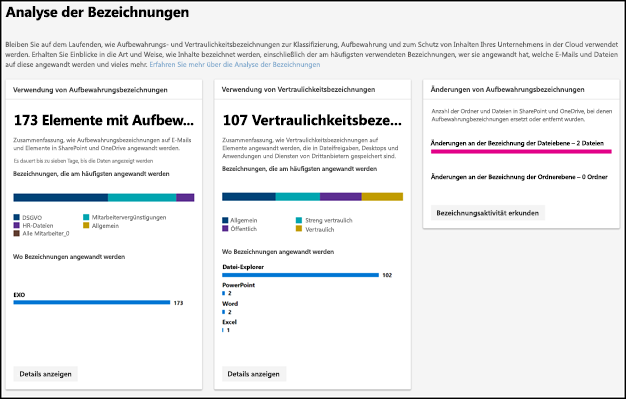
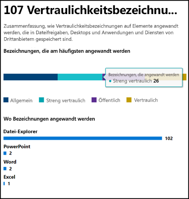
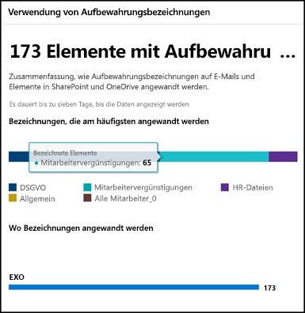
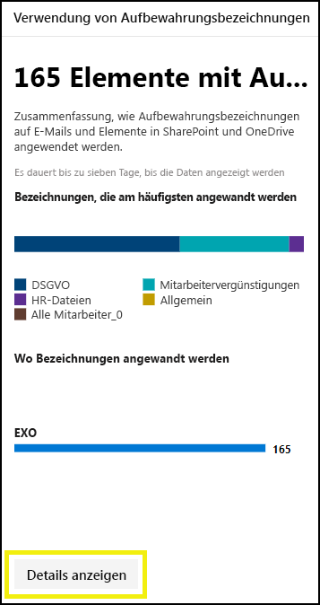
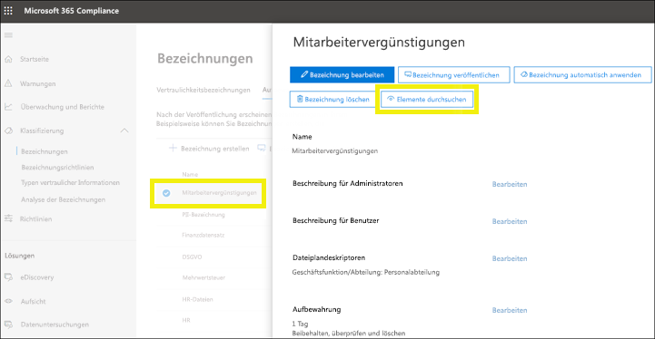
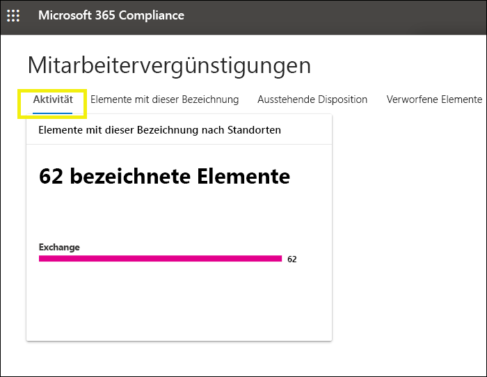
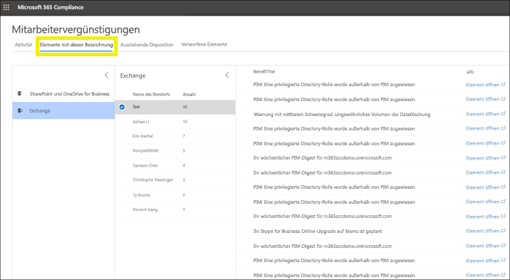

# Anzeigen der Bezeichnungsnutzung mit der Analyse der Bezeichnungen

Nachdem Sie Ihre Aufbewahrungsbezeichnungen und Vertraulichkeitsbezeichnungen erstellt haben, können Sie überprüfen, wie sie mandantenübergreifend verwendet werden. Mithilfe der Analyse der Bezeichnungen im Microsoft 365 Compliance Center und Microsoft 365 Security Center können Sie schnell sehen, welche Bezeichnungen am häufigsten verwendet werden und wo sie angewendet werden.

Mit der Analyse der Bezeichnungen können Sie beispielsweise Folgendes anzeigen:

- Gesamtzahl der Aufbewahrungsbezeichnungen und Vertraulichkeitsbezeichnungen, die auf Inhalte angewandt wurden.
- Topbezeichnungen und die Anzahl der Anwendungen jeder Bezeichnung.
- Stellen, an denen Bezeichnungen angewendet werden, und die Anzahl jeder Stelle.
- Anzahl der Dateien und Ordner, bei denen die Aufbewahrungsbezeichnung geändert oder entfernt wurde.

Sie finden die Analyse der Bezeichnungen im [Microsoft 365 Compliance Center](https://compliance.microsoft.com/labelanalytics) oder [Microsoft 365 Security Center](https://security.microsoft.com/labelanalytics) > **Klassifizierung** > **Analyse der Bezeichnungen**.

## Vertraulichkeitsbezeichnungsnutzung

Die Daten zur Verwendung der Vertraulichkeitsbezeichnung werden aus den Berichten für Azure Information Protection abgerufen. Weitere Informationen hierzu finden Sie unter [Zentrale Berichterstellung für Azure Information Protection](https://docs.microsoft.com/de-DE/azure/information-protection/reports-aip).

Beachten Sie, dass für die Azure Information Protection-Berichte [Voraussetzungen](https://docs.microsoft.com/de-DE/azure/information-protection/reports-aip#prerequisites-for-azure-information-protection-analytics) gelten, die auch für die Analyse der Bezeichnungen im Hinblick auf Vertraulichkeitsbezeichnungen im Microsoft 365 Compliance Center und Microsoft 365 Security Center gelten. Sie benötigen z. B. ein Azure-Abonnement, das die Protokollanalyse enthält, da diese Berichte durch das Senden von Informationen zu Überwachungsereignissen von Azure Information Protection-Clients und -Scannern an einen zentralen Speicherort basierend auf dem Azure Log Analytics-Dienst entstehen.

Für die Vertraulichkeitsbezeichnungsnutzung:

- Es gibt keine Latenz in den Daten. Dies ist ein Echtzeitbericht.
- Wenn Sie die Anzahl für jede Topbezeichnung anzeigen möchten, zeigen Sie auf das Balkendiagramm und lesen Sie die QuickInfo, die angezeigt wird.
- Der Bericht zeigt, wo Vertraulichkeitsbezeichnungen pro App angewendet werden (während Aufbewahrungsbezeichnungen pro Standort angezeigt werden).

## Aufbewahrungsbezeichnungsnutzung

Dieser Bericht zeigt einen schnellen Überblick über die Topbezeichnungen und darüber, wo sie angewendet werden. Weitere Informationen zur Bezeichnung von Inhalten in SharePoint und OneDrive finden Sie unter [Anzeigen der Bezeichnungsaktivität für Dokumente](view-label-activity-for-documents.md).

Für die Aufbewahrungsbezeichnungsnutzung:

- Daten werden wöchentlich aggregiert, sodass es bis zu sieben Tage dauern kann, bis Daten im Bericht angezeigt werden.
- Wenn Sie die Anzahl für jede Topbezeichnung anzeigen möchten, zeigen Sie auf das Balkendiagramm und lesen Sie die QuickInfo, die angezeigt wird.
- Der Bericht zeigt, wo Aufbewahrungsbezeichnungen pro Standort angewendet werden (während Vertraulichkeitsbezeichnungen pro Standort angezeigt werden).
- Bei Aufbewahrungsbezeichnungen ist dies eine Zusammenfassung der Daten in Ihrem Mandanten. Es wird nicht nach einem bestimmten Datumsbereich gefiltert. Im Gegensatz dazu zeigt der [Bezeichnungsaktivitäten-Explorer](view-label-activity-for-documents.md) nur Daten aus den letzten 30 Tagen.

## Anzeigen aller Inhalte mit einer bestimmten Aufbewahrungsbezeichnung

Im Nutzungsbericht für Aufbewahrungsbezeichnungen können Sie schnell alle Inhalte mit dieser Bezeichnung anzeigen. (Beachten Sie, dass wir derzeit an diesem Feature arbeiten, damit weniger Schritte erforderlich sind, um alle beschrifteten Inhalte anzuzeigen.)

Wählen Sie zuerst **Details anzeigen** unten im Bericht aus.

Wählen Sie dann eine Aufbewahrungsbezeichnung > **Elemente erkunden** im rechten Bereich.

Für diese Bezeichnung können Sie die Registerkarte **Aktivität** auswählen, um die Anzahl der Elemente mit dieser Bezeichnung nach Standort anzuzeigen.

Sie können auch die Registerkarte **Elemente mit dieser Bezeichnung** auswählen. Dann können Sie eine Aufschlüsselung bestimmter Standorte anzeigen:

- Bei Exchange Online sehen Sie eine Liste der Postfächer mit der Anzahl der bezeichneten Elemente in jedem Postfach.
- Bei SharePoint Online und OneDrive for Business wird eine Liste der Websitesammlungen und OneDrive-Konten mit der Anzahl der bezeichneten Elemente an jedem Standort angezeigt.

Wenn Sie ein Postfach oder eine Websitesammlung auswählen, können Sie eine Liste mit Elementen mit dieser Aufbewahrungsbezeichnung an diesem Standort anzeigen.

## Berechtigungen

Wenn Sie die Analyse der Bezeichnungen anzeigen möchten, muss Ihnen eine der folgenden Rollen in Azure Active Directory zugewiesen sein:

- Globaler Administrator
- Compliance-Administrator
- Sicherheitsadministrator
- Benutzer mit Leseberechtigung für Sicherheitsfunktionen

Beachten Sie außerdem, dass diese Berichte Azure Monitor verwenden, um die Daten in einem Protokollanalysearbeitsbereich Ihres Unternehmens zu speichern. Aus diesem Grund sollte der Benutzer als Benutzer mit Leseberechtigung zum Azure Monitoring-Arbeitsbereich hinzugefügt werden, der die Daten enthält. Weitere Informationen finden Sie unter [Erforderliche Berechtigungen für Azure Information Protection-Analysen](https://docs.microsoft.com/de-DE/azure/information-protection/reports-aip#permissions-required-for-azure-information-protection-analytics).

