# <a name="overview-of-retention-labels"></a><span data-ttu-id="9321a-105">Übersicht über Aufbewahrungsbezeichnungen</span><span class="sxs-lookup"><span data-stu-id="9321a-105">Overview of retention labels</span></span>

<span data-ttu-id="9321a-p102">In Ihrer Organisation verwenden Sie wahrscheinlich verschiedene Arten von Inhalten, für die unterschiedliche Aktionen ausgeführt werden müssen, um branchenspezifische Vorschriften und interne Richtlinien einzuhalten. Dies kann zum Beispiel die folgenden Inhalte umfassen:</span><span class="sxs-lookup"><span data-stu-id="9321a-p102">Across your organization, you probably have different types of content that require different actions taken on them in order to comply with industry regulations and internal policies. For example, you might have:</span></span>
  
- <span data-ttu-id="9321a-108">Steuerformulare, die für einen bestimmten Zeitraum **aufbewahrt** werden müssen.</span><span class="sxs-lookup"><span data-stu-id="9321a-108">Tax forms that need to be **retained** for a minimum period of time.</span></span> 
    
- <span data-ttu-id="9321a-109">Pressematerialien, die nach dem Erreichen eines bestimmten Alters **dauerhaft gelöscht** werden müssen.</span><span class="sxs-lookup"><span data-stu-id="9321a-109">Press materials that need to be **permanently deleted** when they reach a certain age.</span></span> 
    
- <span data-ttu-id="9321a-110">Im Wettbewerb stehende Forschungen, die sowohl **aufbewahrt** als auch anschließend **dauerhaft gelöscht** werden müssen.</span><span class="sxs-lookup"><span data-stu-id="9321a-110">Competitive research that needs to be both **retained** and then **permanently deleted**.</span></span> 
    
- <span data-ttu-id="9321a-111">Arbeitsvisa, die **als Datensatz gekennzeichnet** werden müssen, damit sie nicht bearbeitet oder gelöscht werden.</span><span class="sxs-lookup"><span data-stu-id="9321a-111">Work visas that must be **marked as a record** so that they can't be edited or deleted.</span></span> 
    
<span data-ttu-id="9321a-p103">In all diesen Fällen können Aufbewahrungsbezeichnungen in Office 365 Ihnen dabei helfen, die richtigen Maßnahmen für die entsprechenden Inhalte zu treffen. Mit Aufbewahrungsbezeichnungen können Sie Daten organisationsweit für Governance klassifizieren und Aufbewahrungsregeln basierend auf dieser Klassifizierung durchsetzen.</span><span class="sxs-lookup"><span data-stu-id="9321a-p103">In all of these cases, retention labels in Office 365 can help you take the right actions on the right content. With retention labels, you can classify data across your organization for governance, and enforce retention rules based on that classification.</span></span>
  
<span data-ttu-id="9321a-114">Mit Aufbewahrungsbezeichnungen können Sie Folgendes:</span><span class="sxs-lookup"><span data-stu-id="9321a-114">With retention labels, you can:</span></span>
  
- <span data-ttu-id="9321a-p104">**Sie können Personen in Ihrer Organisation ermöglichen, eine Aufbewahrungsbezeichnungen manuell** auf einen Inhalt in Outlook im Web, Outlook 2010 und höher, OneDrive, SharePoint und Office 365-Gruppen anzuwenden. Benutzer wissen häufig am besten, mit welcher Art von Inhalt sie arbeiten. Sie können den Inhalt somit klassifizieren und die entsprechende Richtlinie anwenden lassen.</span><span class="sxs-lookup"><span data-stu-id="9321a-p104">**Enable people in your organization to apply a retention label manually** to content in Outlook on the web, Outlook 2010 and later, OneDrive, SharePoint, and Office 365 groups. Users often know best what type of content they're working with, so they can classify it and have the appropriate policy applied.</span></span> 
    
- <span data-ttu-id="9321a-117">**Sie können Aufbewahrungsbezeichnungen automatisch** auf Inhalt anwenden, wenn er bestimmten Bedingungen entspricht:</span><span class="sxs-lookup"><span data-stu-id="9321a-117">**Apply retention labels to content automatically** if it matches specific conditions, such as when the content contains:</span></span> 
    
  - <span data-ttu-id="9321a-118">Der Inhalt enthält bestimmte vertrauliche Informationen.</span><span class="sxs-lookup"><span data-stu-id="9321a-118">Specific types of sensitive information.</span></span>
    
  - <span data-ttu-id="9321a-119">Der Inhalt enthält bestimmte Stichwörter, die einer von Ihnen erstellten Abfrage entsprechen.</span><span class="sxs-lookup"><span data-stu-id="9321a-119">Specific keywords that match a query you create.</span></span>
    
    <span data-ttu-id="9321a-120">Die Möglichkeit, Aufbewahrungsbezeichnungen automatisch auf Inhalte anzuwenden, ist aus den folgenden Gründen wichtig:</span><span class="sxs-lookup"><span data-stu-id="9321a-120">The ability to apply retention labels to content automatically is important because:</span></span>
    
  - <span data-ttu-id="9321a-121">Sie müssen die Benutzer nicht schulen, damit sie alle Ihre Klassifizierungen kennen.</span><span class="sxs-lookup"><span data-stu-id="9321a-121">You don't need to train your users on all of your classifications.</span></span>
    
  - <span data-ttu-id="9321a-122">Sie müssen sich nicht darauf verlassen, dass die Benutzer alle Inhalte richtig klassifizieren.</span><span class="sxs-lookup"><span data-stu-id="9321a-122">You don't need to rely on users to classify all content correctly.</span></span>
    
  - <span data-ttu-id="9321a-123">Benutzer müssen nicht mehr über Governance-Richtlinien Bescheid wissen, sondern können sich stattdessen auf ihre Arbeit konzentrieren.</span><span class="sxs-lookup"><span data-stu-id="9321a-123">Users no longer need to know about data governance policies - they can instead focus on their work.</span></span>
    
    <span data-ttu-id="9321a-124">Beachten Sie, dass für automatisch angewendete Bezeichnungen ein Office 365 Enterprise E5-Abonnement erforderlich ist.</span><span class="sxs-lookup"><span data-stu-id="9321a-124">Note that auto-apply labels require an Office 365 Enterprise E5 subscription.</span></span>
    
- <span data-ttu-id="9321a-125">**Wenden Sie eine Standardaufbewahrungsbezeichnung auf eine Dokumentbibliothek** in SharePoint- und Office 365-Gruppenwebsites an, sodass alle Dokumente in dieser Bibliothek mit der Standardaufbewahrungsbezeichnung versehen werden.</span><span class="sxs-lookup"><span data-stu-id="9321a-125">**Apply a default retention label to a document library** in SharePoint and Office 365 group sites, so that all documents in that library get the default retention label.</span></span> 
    
- <span data-ttu-id="9321a-p105">**Implementieren Sie die Datensatzverwaltung im gesamten Office 365**, darunter E-Mails und Dokumente. Sie können eine Aufbewahrungsbezeichnung verwenden, um Inhalt als Datensatz zu klassifizieren. In diesem Fall kann die Bezeichnung nicht geändert oder entfernt werden, und der Inhalt kann nicht bearbeitet oder gelöscht werden.</span><span class="sxs-lookup"><span data-stu-id="9321a-p105">**Implement records management across Office 365**, including both email and documents. You can use a retention label to classify content as a record. When this happens, the label can't be changed or removed, and the content can't be edited or deleted.</span></span> 
    
<span data-ttu-id="9321a-129">Sie erstellen und verwalten Aufbewahrungsbezeichnungen auf der Registerkarte **Aufbewahrung** auf der Seite \*\*Bezeichnungen \*\*im Office 365 Security &amp; Compliance Center.</span><span class="sxs-lookup"><span data-stu-id="9321a-129">You create and manage retention labels on the **Retention** tab on the **Labels** page in the Office 365 Security &amp; Compliance Center.</span></span> 
  
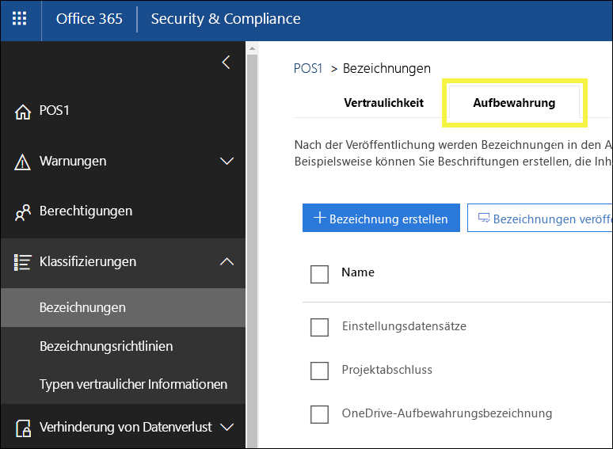
 
## <a name="how-retention-labels-work-with-label-policies"></a><span data-ttu-id="9321a-131">Funktionsweise von Aufbewahrungsbezeichnungen bei Bezeichnungsrichtlinien</span><span class="sxs-lookup"><span data-stu-id="9321a-131">How retention labels work with label policies</span></span>

<span data-ttu-id="9321a-p106">Das Bereitstellen von Aufbewahrungsbezeichnungen für Personen in Ihrer Organisation, damit sie Inhalte klassifizieren können, ist ein zweistufiger Vorgang: Zuerst erstellen Sie die Bezeichnungen, und dann veröffentlichen Sie die Bezeichnungen an den von Ihnen ausgewählten Speicherorten. Wenn Sie Aufbewahrungsbezeichnungen veröffentlichen, wird eine Bezeichnungsrichtlinie erstellt.</span><span class="sxs-lookup"><span data-stu-id="9321a-p106">Making retention labels available to people in your organization so that they can classify content is a two-step process: first you create the labels, and then you publish them to the locations you choose. When you publish retention labels, a label policy gets created.</span></span>
  
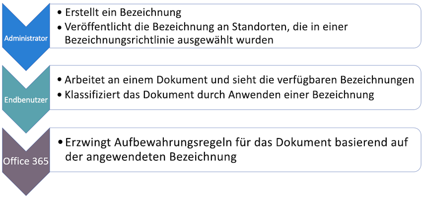
  
<span data-ttu-id="9321a-p107">Aufbewahrungsbezeichnungen sind unabhängige, wiederverwendbare Bausteine, die in einer Bezeichnungsrichtlinie enthalten sind und an verschiedenen Orten veröffentlicht werden. Aufbewahrungsbezeichnungen können in vielen Richtlinien wiederverwendet werden. Der Hauptzweck der Bezeichnungsrichtlinie ist es, eine Reihe von Aufbewahrungsbezeichnungen zu gruppieren und die Speicherorte anzugeben, an denen die Bezeichnungen verfügbar sein sollen.</span><span class="sxs-lookup"><span data-stu-id="9321a-p107">Retention labels are independent, reusable building blocks that are included in a label policy and published to different locations. Retention labels can be reused across many policies. The primary purpose of the label policy is to group a set of retention labels and specify the locations where you want those labels to appear.</span></span>
  
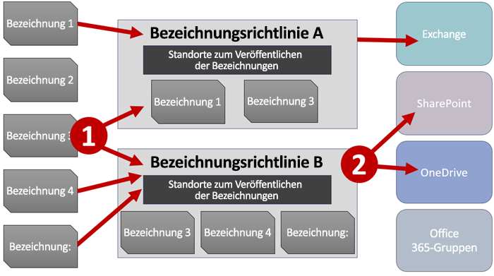
  
1. <span data-ttu-id="9321a-p108">Wenn Sie Aufbewahrungsbezeichnungen veröffentlichen, sind sie in einer Bezeichnungsrichtlinie enthalten. Eine einzelne Aufbewahrungsbezeichnung kann in vielen Richtlinien enthalten sein.</span><span class="sxs-lookup"><span data-stu-id="9321a-p108">When you publish retention labels, they're included in a label policy. A single retention label can be included in many policies.</span></span>
    
2. <span data-ttu-id="9321a-141">Bezeichnungsrichtlinien geben die Speicherorte zum Veröffentlichen der Aufbewahrungsbezeichnungen an.</span><span class="sxs-lookup"><span data-stu-id="9321a-141">Label policies specify the locations to publish the retention labels.</span></span>
    
## <a name="only-one-retention-label-at-a-time"></a><span data-ttu-id="9321a-142">Jeweils nur eine Aufbewahrungsbezeichnung</span><span class="sxs-lookup"><span data-stu-id="9321a-142">Only one retention label at a time</span></span>

<span data-ttu-id="9321a-143">Es ist wichtig zu wissen, dass ein Inhalt wie eine E-Mail-Nachricht oder ein Dokument jeweils nur über eine Aufbewahrungsbezeichnung verfügen kann:</span><span class="sxs-lookup"><span data-stu-id="9321a-143">It's important to know that content like an email or document can have only a single retention label assigned to it at a time:</span></span>
  
- <span data-ttu-id="9321a-144">Aufbewahrungsbezeichnungen, die von den Endbenutzern manuell zugewiesen wurden, können entfernt oder geändert werden.</span><span class="sxs-lookup"><span data-stu-id="9321a-144">For labels assigned manually by end users, people can remove or change the retention label that's assigned.</span></span>
    
- <span data-ttu-id="9321a-145">Wenn eine Bezeichnung einem Inhalt automatisch zugewiesen wurde, kann diese automatisch zugewiesene Aufbewahrungsbezeichnung durch eine vom Endbenutzer manuell zugewiesene Bezeichnung ersetzt werden.</span><span class="sxs-lookup"><span data-stu-id="9321a-145">If content has an auto-apply label assigned, an auto-apply label can be replaced by a retention label assigned manually by an end user.</span></span>
    
- <span data-ttu-id="9321a-146">Wenn einem Inhalt eine Aufbewahrungsbezeichnung manuell von einem Endbenutzer zugewiesen wurde, kann diese manuell zugewiesene Aufbewahrungsbezeichnung nicht durch eine automatisch zugewiesene Bezeichnung ersetzt werden.</span><span class="sxs-lookup"><span data-stu-id="9321a-146">If content has a retention label assigned manually by an end user, an auto-apply label cannot replace the manually assigned retention label.</span></span>
    
- <span data-ttu-id="9321a-147">Wenn es mehrere Regeln gibt, durch die eine Bezeichnung automatisch zugewiesen wird, und ein Inhalt die Bedingungen verschiedener Regeln erfüllt, wird die Aufbewahrungsbezeichnung für die älteste Regel angewendet.</span><span class="sxs-lookup"><span data-stu-id="9321a-147">If there are multiple rules that assign an auto-apply label and content meets the conditions of multiple rules, the retention label for the oldest rule is assigned.</span></span>
    
<span data-ttu-id="9321a-p109">Manuelle Bezeichnungen werden explizit zugewiesen, automatische Bezeichnungen hingegen implizit. Eine explizite Aufbewahrungsbezeichnung hat Vorrang vor einer impliziten Bezeichnung. Weitere Informationen finden Sie weiter unten im Abschnitt [Die Grundsätze der Aufbewahrung, oder was hat Vorrang?](labels.md#principles).</span><span class="sxs-lookup"><span data-stu-id="9321a-p109">Manually assigned labels are explicitly assigned; auto-apply labels are implicitly assigned; an explicit retention label takes precedence over an implicit label. For more information, see the below section on [The principles of retention, or what takes precedence?](labels.md#principles).</span></span>

<span data-ttu-id="9321a-p110">Alle Informationen in diesem Abschnitt gelten nur für Aufbewahrungsbezeichnungen. Beachten Sie, dass zusätzlich zu einer Aufbewahrungsbezeichnung auf ein Inhaltselement auch eine Vertraulichkeitsbezeichnung angewendet werden kann.</span><span class="sxs-lookup"><span data-stu-id="9321a-p110">All of the information in this section applies only to retention labels. Note that an item of content can also have one sensitivity label applied to it, in addition to one retention label.</span></span>
  
## <a name="how-long-it-takes-for-retention-labels-to-take-effect"></a><span data-ttu-id="9321a-152">Wie lange es dauert, bis Aufbewahrungsbezeichnungen wirksam werden</span><span class="sxs-lookup"><span data-stu-id="9321a-152">How long it takes for retention labels to take effect</span></span>

<span data-ttu-id="9321a-153">Wenn Sie Aufbewahrungsbezeichnungen veröffentlichen oder automatisch anwenden, werden sie nicht sofort wirksam:</span><span class="sxs-lookup"><span data-stu-id="9321a-153">When you publish or auto-apply retention labels, they don't take effect immediately:</span></span>
  
1. <span data-ttu-id="9321a-154">Zuerst einmal muss die Bezeichnungsrichtlinie über das Security &amp; Compliance Center mit den Speicherorten der Richtlinie synchronisiert werden.</span><span class="sxs-lookup"><span data-stu-id="9321a-154">First the label policy needs to be synced from the Security &amp; Compliance Center to the locations in the policy.</span></span>
    
2. <span data-ttu-id="9321a-p111">Anschließend benötigt der Speicherort möglicherweise etwas Zeit, um den Endbenutzern die manuellen Bezeichnungen bereitzustellen oder die Bezeichnungen automatisch auf den Inhalt anzuwenden. Wie lange dies dauert, hängt vom Speicherort der Art der Bezeichnung ab.</span><span class="sxs-lookup"><span data-stu-id="9321a-p111">Then the location may require time to make manual labels available to end users or auto-apply labels to content. How long this takes depends on the location and type of label.</span></span>
    
### <a name="manual-retention-labels"></a><span data-ttu-id="9321a-157">Manuelle Aufbewahrungsbezeichnungen</span><span class="sxs-lookup"><span data-stu-id="9321a-157">Manual retention labels</span></span>

<span data-ttu-id="9321a-p112">Wenn Sie Aufbewahrungsbezeichnungen auf SharePoint oder OneDrive veröffentlichen, kann es bis zu einem Tag dauern, bevor diese Aufbewahrungsbezeichnungen den Endbenutzern angezeigt werden. Darüber hinaus kann es, wenn Sie Aufbewahrungsbezeichnungen auf Exchange veröffentlichen, bis zu sieben Tage dauern, bevor sie den Endbenutzern zur Verfügung stehen. Außerdem muss das Postfach mindestens 10 MB Daten enthalten.</span><span class="sxs-lookup"><span data-stu-id="9321a-p112">If you publish retention labels to SharePoint or OneDrive, it can take one day for those retention labels to appear for end users. In addition, if you publish retention labels to Exchange, it can take 7 days for those retention labels to appear for end users, and the mailbox needs to contain at least 10 MB of data.</span></span>
  
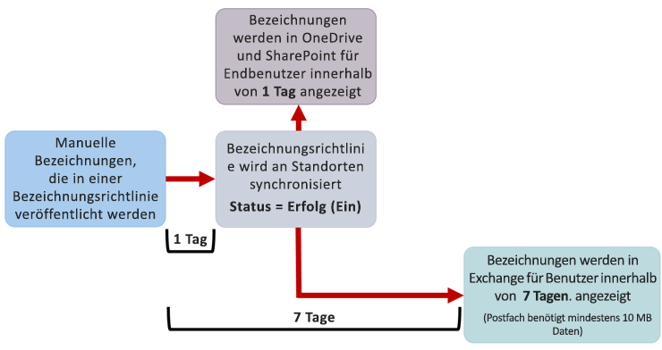
  
### <a name="auto-apply-retention-labels"></a><span data-ttu-id="9321a-161">Automatisch angewendete Aufbewahrungsbezeichnungen</span><span class="sxs-lookup"><span data-stu-id="9321a-161">Auto-apply retention labels</span></span>

<span data-ttu-id="9321a-162">Wenn Sie Aufbewahrungsbezeichnungen automatisch auf Inhalte anwenden, die bestimmte Bedingungen erfüllen, kann es bis zu sieben Tage dauern, bevor die Aufbewahrungsbezeichnungen auf alle Inhalte angewendet werden, die diesen Kriterien entsprechen.</span><span class="sxs-lookup"><span data-stu-id="9321a-162">If you auto-apply retention labels to content matching specific conditions, it can take seven days for the retention labels to be applied to all content that matches the conditions.</span></span>
  
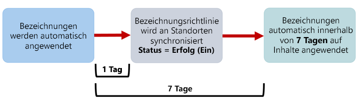
  
### <a name="how-to-check-on-the-status-of-exchange-labels"></a><span data-ttu-id="9321a-164">So prüfen Sie den Status von Exchange-Bezeichnungen</span><span class="sxs-lookup"><span data-stu-id="9321a-164">How to check on the status of Exchange labels</span></span>

<span data-ttu-id="9321a-p113">In Exchange Online werden Aufbewahrungsbezeichnungen Endbenutzern anhand eines Prozesses bereitgestellt, die alle sieben Tage ausgeführt wird. Mit PowerShell können Sie sehen, wann dieser Prozess zuletzt ausgeführt wurde, und so ermitteln, wann er erneut ausgeführt wird.</span><span class="sxs-lookup"><span data-stu-id="9321a-p113">In Exchange Online, retention labels are made available to end users by a process that runs every seven days. By using Powershell, you can see when this process last ran and thus determine when it will run again.</span></span>
  
1. <span data-ttu-id="9321a-167">[Stellen Sie eine Verbindung mit Exchange Online PowerShell her](https://go.microsoft.com/fwlink/?linkid=799773).</span><span class="sxs-lookup"><span data-stu-id="9321a-167">[Connect to Exchange Online PowerShell](https://go.microsoft.com/fwlink/?linkid=799773).</span></span>
    
2. <span data-ttu-id="9321a-168">Führen Sie die folgenden Befehle aus:</span><span class="sxs-lookup"><span data-stu-id="9321a-168">Run these commands.</span></span>
    
  ```
  $logProps = Export-MailboxDiagnosticLogs <user> -ExtendedProperties
  ```

  ```
  $xmlprops = [xml]($logProps.MailboxLog)
  ```

  ```
  $xmlprops.Properties.MailboxTable.Property | ? {$_.Name -like "ELC*"}
  ```

<span data-ttu-id="9321a-p114">In den Ergebnissen zeigt die Eigenschaft `ELCLastSuccessTimeStamp` (UTC) an, wann das System Ihr Postfach das letzte Mal verarbeitet hat. Wenn dies nicht mehr geschehen ist, seit Sie die Richtlinie erstellt haben, werden die Bezeichnungen nicht angezeigt. Um die Verarbeitung zu erzwingen, führen Sie `Start-ManagedFolderAssistant -Identity <user>` aus.</span><span class="sxs-lookup"><span data-stu-id="9321a-p114">In the results, the  `ELCLastSuccessTimeStamp` (UTC) property shows when the system last processed your mailbox. If it has not happened since the time you created the policy, the labels are not going to appear. To force processing, run  `Start-ManagedFolderAssistant -Identity <user>`.</span></span>
    
<span data-ttu-id="9321a-172">Wenn die Bezeichnungen nicht in Outlook im Web angezeigt werden und Sie denken, dass sie angezeigt werden sollten, müssen Sie den Cache des Browsers leeren (STRG + F5).</span><span class="sxs-lookup"><span data-stu-id="9321a-172">If labels aren't appearing in Outlook on the web and you think they should be, make sure to clear the cache in your browser (CTRL+F5).</span></span>
    
## <a name="label-policies-and-locations"></a><span data-ttu-id="9321a-173">Bezeichnungsrichtlinien und Speicherorte</span><span class="sxs-lookup"><span data-stu-id="9321a-173">Label policies and locations</span></span>

<span data-ttu-id="9321a-174">Verschiedene Arten von Aufbewahrungsbezeichnungen können an verschiedenen Speicherorten veröffentlicht werden, je nach Funktion der Aufbewahrungsbezeichnung.</span><span class="sxs-lookup"><span data-stu-id="9321a-174">Different types of retention labels can be published to different locations, depending on what the retention label does.</span></span>
  
|<span data-ttu-id="9321a-175">**Wenn für die Aufbewahrungsbezeichnung Folgendes gilt:**</span><span class="sxs-lookup"><span data-stu-id="9321a-175">**If the retention label is…**</span></span>|<span data-ttu-id="9321a-176">**So kann die Bezeichnungsrichtlinie angewendet werden auf...**</span><span class="sxs-lookup"><span data-stu-id="9321a-176">**Then the label policy can be applied to…**</span></span>|
|:-----|:-----|
|<span data-ttu-id="9321a-177">für Endbenutzer veröffentlicht</span><span class="sxs-lookup"><span data-stu-id="9321a-177">Published to end users</span></span>  <br/> |<span data-ttu-id="9321a-178">Gruppen in Exchange, SharePoint, OneDrive, Office 365</span><span class="sxs-lookup"><span data-stu-id="9321a-178">Exchange, SharePoint, OneDrive, Office 365 groups</span></span>  <br/> |
|<span data-ttu-id="9321a-179">basierend auf Typen vertraulicher Informationen automatisch angewendet</span><span class="sxs-lookup"><span data-stu-id="9321a-179">Auto-applied based on sensitive information types</span></span>  <br/> |<span data-ttu-id="9321a-180">Exchange (nur alle Postfächer), SharePoint, OneDrive</span><span class="sxs-lookup"><span data-stu-id="9321a-180">Exchange (all mailboxes only), SharePoint, OneDrive</span></span>  <br/> |
|<span data-ttu-id="9321a-181">basieren auf einer Abfrage automatisch angewendet</span><span class="sxs-lookup"><span data-stu-id="9321a-181">Auto-applied based on a query</span></span>  <br/> |<span data-ttu-id="9321a-182">Gruppen in Exchange, SharePoint, OneDrive, Office 365</span><span class="sxs-lookup"><span data-stu-id="9321a-182">Exchange, SharePoint, OneDrive, Office 365 groups</span></span>  <br/> |
   
<span data-ttu-id="9321a-p115">Beachten Sie, dass automatisch angewendete Aufbewahrungsbezeichnungen in Exchange (für Abfragen und Arten vertraulicher Informationen) nur auf neu gesendete Nachrichten angewendet werden (Daten bei der Übertragung), und nicht auf alle Elemente, die sich derzeit im Postfach befinden (ruhende Daten). Außerdem werden automatisch angewendete Aufbewahrungsbezeichnungen für Arten von vertraulichen Informationen immer auf alle Postfächer angewendet. Es können keine bestimmten Postfächer ausgewählt werden.</span><span class="sxs-lookup"><span data-stu-id="9321a-p115">Note that in Exchange, auto-apply retention labels (for both queries and sensitive information types) are applied only to messages newly sent (data in transit), not to all items currently in the mailbox (data at rest). Also, auto-apply retention labels for sensitive information types can apply only to all mailboxes; you can't select the specific mailboxes.</span></span>
  
<span data-ttu-id="9321a-185">Beachten Sie, dass öffentliche Ordner in Exchange und Skype Bezeichnungen nicht unterstützen.</span><span class="sxs-lookup"><span data-stu-id="9321a-185">Note that Exchange public folders and Skype do not support labels.</span></span>
  
## <a name="how-retention-labels-enforce-retention"></a><span data-ttu-id="9321a-186">So erzwingen Aufbewahrungsbezeichnungen die Aufbewahrung</span><span class="sxs-lookup"><span data-stu-id="9321a-186">How retention labels enforce retention</span></span>

<span data-ttu-id="9321a-p116">Aufbewahrungsbezeichnungen können genau die gleichen Aufbewahrungsaktionen erzwingen wie eine Aufbewahrungsrichtlinie. Sie können Aufbewahrungsbezeichnungen verwenden, um einen komplexen Inhaltsplan (oder Dateiplan) zu implementieren. Weitere Informationen zur Funktionsweise der Aufbewahrung finden Sie unter [Übersicht über Aufbewahrungsrichtlinien](retention-policies.md).</span><span class="sxs-lookup"><span data-stu-id="9321a-p116">Retention labels can enforce exactly the same retention actions that a retention policy can. You can use retention labels to implement a sophisticated content plan (or file plan). For more information on how retention works, see [Overview of retention policies](retention-policies.md).</span></span>
  
<span data-ttu-id="9321a-p117">Darüber hinaus hat eine Aufbewahrungsbezeichnung zwei Aufbewahrungsoptionen, die nur für eine Aufbewahrungsbezeichnung und nicht in einer Aufbewahrungsrichtlinie verfügbar sind. Aufbewahrungsbezeichnungen bieten Ihnen die folgenden Möglichkeiten:</span><span class="sxs-lookup"><span data-stu-id="9321a-p117">In addition, a retention label has two retention options that are available only in a retention label and not in a retention policy. With a retention label, you can:</span></span>
  
- <span data-ttu-id="9321a-p118">Auslösen einer Dispositionsprüfung am Ende des Aufbewahrungszeitraums, damit SharePoint- und OneDrive-Dokumente überprüft werden müssen, bevor sie gelöscht werden können. Weitere Informationen finden Sie unter [Übersicht über Dispositionsprüfungen](disposition-reviews.md).</span><span class="sxs-lookup"><span data-stu-id="9321a-p118">Trigger a disposition review at the end of the retention period, so that SharePoint and OneDrive documents must be reviewed before they can be deleted. For more information, see [Overview of disposition reviews](disposition-reviews.md).</span></span>
    
- <span data-ttu-id="9321a-194">Beginnen des Aufbewahrungszeitraums zu dem Zeitpunkt, an dem der Inhalt mit der Bezeichnung versehen wurde, und nicht ausgehend vom Alter des Inhalts oder dem Zeitpunkt, zu dem er zuletzt geändert wurde.</span><span class="sxs-lookup"><span data-stu-id="9321a-194">Start the retention period from when the content was labeled, instead of the age of the content or when it was last modified.</span></span>
    
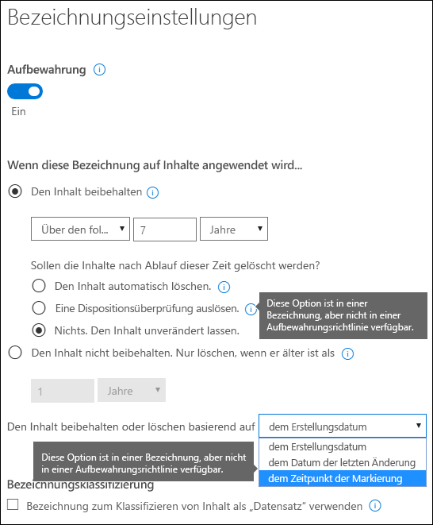
  
## <a name="where-published-retention-labels-can-appear-to-end-users"></a><span data-ttu-id="9321a-196">Wo veröffentlichte Aufbewahrungsbezeichnungen Endbenutzern verfügbar gemacht werden können</span><span class="sxs-lookup"><span data-stu-id="9321a-196">Where published retention labels can appear to end users</span></span>

<span data-ttu-id="9321a-197">Wenn Endbenutzer Aufbewahrungsbezeichnungen auf Inhalte anwenden, können Sie die Bezeichnungen an den folgenden Speicherorten veröffentlichen:</span><span class="sxs-lookup"><span data-stu-id="9321a-197">If your retention label will be assigned to content by end users, you can publish it to:</span></span>
  
- <span data-ttu-id="9321a-198">Outlook im Web</span><span class="sxs-lookup"><span data-stu-id="9321a-198">Outlook on the web</span></span>
    
- <span data-ttu-id="9321a-199">Outlook 2010 und höher</span><span class="sxs-lookup"><span data-stu-id="9321a-199">Outlook 2010 and later</span></span>
    
- <span data-ttu-id="9321a-200">OneDrive</span><span class="sxs-lookup"><span data-stu-id="9321a-200">OneDrive</span></span>
    
- <span data-ttu-id="9321a-201">SharePoint</span><span class="sxs-lookup"><span data-stu-id="9321a-201">SharePoint</span></span>
    
- <span data-ttu-id="9321a-202">Office 365-Gruppen (sowohl die Gruppenwebsite als auch das Gruppenpostfach in Outlook im Web)</span><span class="sxs-lookup"><span data-stu-id="9321a-202">Office 365 groups (both the group site and group mailbox in Outlook on the web)</span></span>
    
<span data-ttu-id="9321a-203">Die folgenden Abschnitte zeigen, wie Bezeichnungen den Endbenutzern in Ihrer Organisation in verschiedenen Apps angezeigt werden.</span><span class="sxs-lookup"><span data-stu-id="9321a-203">The sections below show how labels will appear in different apps to people in your organization.</span></span>
  
### <a name="outlook-on-the-web"></a><span data-ttu-id="9321a-204">Outlook im Web</span><span class="sxs-lookup"><span data-stu-id="9321a-204">Outlook on the web</span></span>

<span data-ttu-id="9321a-205">Um ein Element in Outlook im Web mit einer Bezeichnung zu versehen: Mit der rechten Maustaste auf das Element klicken \> **Richtlinie zuweisen** \> Aufbewahrungsbezeichnung auswählen.</span><span class="sxs-lookup"><span data-stu-id="9321a-205">To label an item in Outlook on the web, right-click the item \> **Assign policy** \> choose the retention label.</span></span> 
  
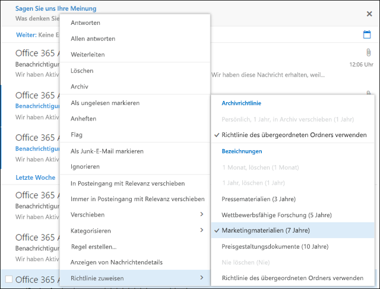
  
<span data-ttu-id="9321a-p119">Nachdem die Aufbewahrungsbezeichnung zugewiesen wurde, können Sie oben im Element diese Aufbewahrungsbezeichnung anzeigen und sehen, welche Aktion sie durchführt. Wenn eine E-Mail klassifiziert ist, der ein Aufbewahrungszeitraum zugeordnet wurde, sehen Sie auf einen Blick, wann die E-Mail abläuft.</span><span class="sxs-lookup"><span data-stu-id="9321a-p119">After the retention label is applied, you can view that retention label and what action it takes at the top of the item. If an email is classified and has an associated retention period, you can know at a glance when the email will expire.</span></span>
  

  
<span data-ttu-id="9321a-210">Sie können Aufbewahrungsbezeichnungen auch auf Ordner anwenden. Hierbei gilt Folgendes:</span><span class="sxs-lookup"><span data-stu-id="9321a-210">You can also apply retention labels to folders, in which case:</span></span>
  
- <span data-ttu-id="9321a-p120">Allen Elementen im Ordner wird automatisch dieselbe Aufbewahrungsbezeichnung zugewiesen, **mit Ausnahme von** Elementen, denen eine Aufbewahrungsbezeichnung explizit zugewiesen wurde. Explizit bezeichnete Elemente behalten diese Aufbewahrungsbezeichnung. Weitere Informationen finden Sie weiter unter im Abschnitt zu den Grundsätzen der Aufbewahrung.</span><span class="sxs-lookup"><span data-stu-id="9321a-p120">All items in the folder automatically get the same retention label, **except** for items that have had a retention label applied explicitly to them. Explicitly labeled items keep their existing retention label. For more information, see the below section on the principles of retention.</span></span> 
    
- <span data-ttu-id="9321a-214">Wenn Sie die Standardaufbewahrungsbezeichnung eines Ordners ändern oder entfernen, wird die Aufbewahrungsbezeichnung ebenfalls für alle Elemente in dem Ordner geändert oder entfernt, **mit Ausnahme von** Elementen, die über explizit zugewiesene Aufbewahrungsbezeichnungen verfügen.</span><span class="sxs-lookup"><span data-stu-id="9321a-214">If you change or remove the default retention label for a folder, the retention label's also changed or removed for all items in the folder, **except** items with explicit retention labels.</span></span> 
    
- <span data-ttu-id="9321a-215">Wenn Sie ein Element mit einer Standardaufbewahrungsbezeichnung von einem Ordner in einen anderen Ordner mit einer anderen Standardaufbewahrungsbezeichnung verschieben, erhält das Element die neue Standardaufbewahrungsbezeichnung.</span><span class="sxs-lookup"><span data-stu-id="9321a-215">If you move an item with a default retention label from one folder to another folder with a different default retention label, the item will get the new default retention label.</span></span>
    
- <span data-ttu-id="9321a-216">Wenn Sie ein Element mit einer Standardaufbewahrungsbezeichnung von einem Ordner in einen anderen Ordner ohne Standardaufbewahrungsbezeichnung verschieben, wird die alte Standardaufbewahrungsbezeichnung entfernt.</span><span class="sxs-lookup"><span data-stu-id="9321a-216">If you move an item with a default retention label from one folder to another folder with no default retention label, the old default retention label is removed.</span></span>
    
### <a name="outlook-2010-and-later"></a><span data-ttu-id="9321a-217">Outlook 2010 und höher</span><span class="sxs-lookup"><span data-stu-id="9321a-217">Outlook 2010 and later</span></span>

<span data-ttu-id="9321a-218">Um ein Element in Outlook im Web mit einer Bezeichnung zu versehen: Mit der rechten Maustaste auf das Element klicken \> auf dem **Menüband** \> **Richtlinie zuweisen** \> Aufbewahrungsbezeichnung auswählen.</span><span class="sxs-lookup"><span data-stu-id="9321a-218">To label an item in Outlook on the web, right-click the item \> on the **Ribbon** \> **Assign Policy** \> choose the retention label.</span></span> 
  
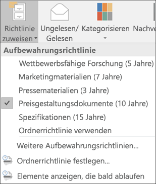
  
<span data-ttu-id="9321a-p121">Nachdem die Aufbewahrungsbezeichnung zugewiesen wurde, können Sie oben im Element diese Aufbewahrungsbezeichnung anzeigen und sehen, welche Aktion sie durchführt. Wenn eine E-Mail klassifiziert ist, der ein Aufbewahrungszeitraum zugeordnet wurde, sehen Sie auf einen Blick, wann die E-Mail abläuft.</span><span class="sxs-lookup"><span data-stu-id="9321a-p121">After the retention label is applied, you can view that retention label and what action it takes at the top of the item. If an email is classified and has an associated retention period, you can know at a glance when the email will expire.</span></span>
  
<span data-ttu-id="9321a-p122">Sie können Aufbewahrungsbezeichnungen auch auf Ordner anwenden. Dies funktioniert in Outlook 2010 und höher genauso wie in Outlook im Web – weitere Informationen finden Sie im vorherigen Abschnitt.</span><span class="sxs-lookup"><span data-stu-id="9321a-p122">You can also apply retention labels to folders. This works the same in Outlook 2010 and later as it does in Outlook on the web -- see the previous section for more info.</span></span>
  
### <a name="onedrive-and-sharepoint"></a><span data-ttu-id="9321a-224">OneDrive und SharePoint</span><span class="sxs-lookup"><span data-stu-id="9321a-224">OneDrive and SharePoint</span></span>

<span data-ttu-id="9321a-225">Um ein Dokument mit einer Bezeichnung zu versehen (einschließlich OneNote-Dateien), wählen Sie in OneDrive oder SharePoint das Element \> in der oberen rechten Ecke aus, wählen Sie **Detailfenster öffnen** \> **Bezeichnung anwenden** \> Aufbewahrungsbezeichnung auswählen.</span><span class="sxs-lookup"><span data-stu-id="9321a-225">To label a document (including OneNote files) in OneDrive or SharePoint, select the item \> in the upper-right corner, choose **Open the details pane** \> **Apply label** \> choose the retention label.</span></span> 
  
<span data-ttu-id="9321a-226">Beachten Sie, dass Sie eine Aufbewahrungsbezeichnung auch auf einen Ordner- oder Dokumentensatz anwenden können. Sie können auch eine Standardaufbewahrungsbezeichnung für eine Dokumentbibliothek festlegen. Weitere Informationen finden Sie in Abschnitt weiter unten.</span><span class="sxs-lookup"><span data-stu-id="9321a-226">Note that you can also apply a retention label to a folder or document set, and you can set a default retention label for a document library - see the section below for more information.</span></span>
  
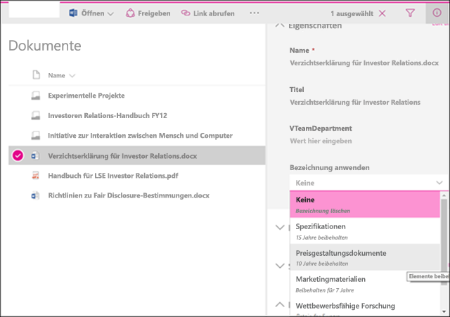
  
<span data-ttu-id="9321a-228">Nachdem eine Aufbewahrungsbezeichnung auf ein Element angewendet wurde, wird sie im Detailbereich angezeigt, wenn das Element ausgewählt wird.</span><span class="sxs-lookup"><span data-stu-id="9321a-228">After a retention label is applied to an item, you can view it in the details pane when that item's selected.</span></span>
  
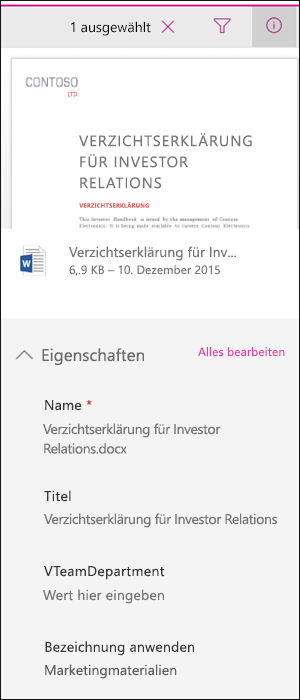
  
<span data-ttu-id="9321a-p123">Sie können auch eine Ansicht der Bibliothek erstellen, die die Spalte **Bezeichnungen** oder die Spalte **Element ist ein Datensatz** enthält. Auf diese Weise können Sie auf einen Blick alle Aufbewahrungsbezeichnungen sehen, die Elementen zugewiesen sind, und Sie können sehen, welche Elemente Datensätze sind. Beachten Sie jedoch, dass Sie die Ansicht nicht anhand der Spalte **Element ist ein Datensatz** filtern können.</span><span class="sxs-lookup"><span data-stu-id="9321a-p123">You can also create a view of the library that contains the **Labels** column or **Item is a Record** column, so that you can see at a glance the retention labels assigned to all items and which items are records. Note, however, that you can't filter the view by the **Item is a Record** column.</span></span> 
  
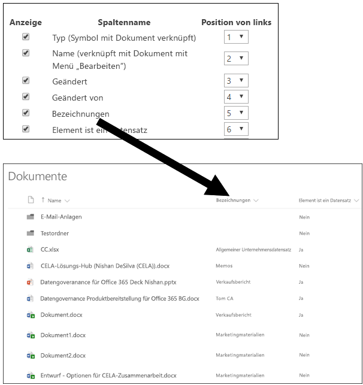
  
### <a name="office-365-groups"></a><span data-ttu-id="9321a-233">Office 365-Gruppen</span><span class="sxs-lookup"><span data-stu-id="9321a-233">Office 365 groups</span></span>

<span data-ttu-id="9321a-p124">Wenn Sie Aufbewahrungsbezeichnungen in einer Office 365-Gruppe veröffentlichen, werden sie sowohl auf der Gruppenwebsite als auch im Gruppenpostfach in Outlook im Web angezeigt. Das Vorgehen zum Zuweisen einer Aufbewahrungsbezeichnung zu Inhalten ist mit dem weiter oben für E-Mails und Dokumente aufgeführten Vorgang identisch.</span><span class="sxs-lookup"><span data-stu-id="9321a-p124">When you publish retention labels to an Office 365 group, the retention labels appear in both the group site and group mailbox in Outlook on the web. The experience of applying a retention label to content is identical to that shown above for email and documents.</span></span>
  
## <a name="applying-a-retention-label-automatically-based-on-conditions"></a><span data-ttu-id="9321a-236">Automatisches Zuweisen einer Aufbewahrungsbezeichnung basierend auf Bedingungen</span><span class="sxs-lookup"><span data-stu-id="9321a-236">Applying a retention label automatically based on conditions</span></span>

<span data-ttu-id="9321a-p125">Eines der leistungsstärksten Features von Aufbewahrungsbezeichnungen ist die Möglichkeit, sie automatisch auf Inhalte anzuwenden, die bestimmte Kriterien erfüllen. In diesem Fall müssen Personen in Ihrer Organisation die Aufbewahrungsbezeichnungen nicht selbst anwenden – Office 365 erledigt dies für sie.</span><span class="sxs-lookup"><span data-stu-id="9321a-p125">One of the most powerful features of retention labels is the ability to apply them automatically to content that matches certain conditions. In this case, people in your organization don't need to apply the retention labels - Office 365 does the work for them.</span></span>
  
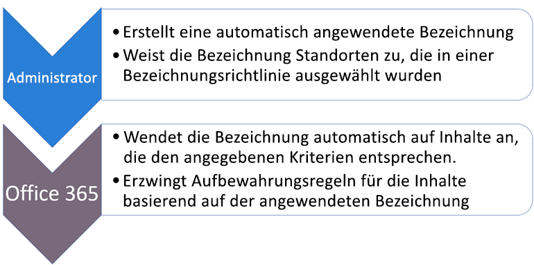
  
<span data-ttu-id="9321a-240">Das automatische Anwenden von Aufbewahrungsbezeichnungen ist aus den folgenden Gründen besonders leistungsstark:</span><span class="sxs-lookup"><span data-stu-id="9321a-240">Auto-apply retention labels are powerful because:</span></span>
  
- <span data-ttu-id="9321a-241">Sie müssen die Benutzer nicht schulen, damit sie alle Ihre Klassifizierungen kennen.</span><span class="sxs-lookup"><span data-stu-id="9321a-241">You don't need to train your users on all of your classifications.</span></span>
    
- <span data-ttu-id="9321a-242">Sie müssen sich nicht darauf verlassen, dass die Benutzer alle Inhalte richtig klassifizieren.</span><span class="sxs-lookup"><span data-stu-id="9321a-242">You don't need to rely on users to classify all content correctly.</span></span>
    
- <span data-ttu-id="9321a-243">Benutzer müssen nicht mehr über Governance-Richtlinien Bescheid wissen, sondern können sich stattdessen auf ihre Arbeit konzentrieren.</span><span class="sxs-lookup"><span data-stu-id="9321a-243">Users no longer need to know about data governance policies - they can focus on their work.</span></span>
    
<span data-ttu-id="9321a-244">Sie können Aufbewahrungsbezeichnungen automatisch auf Inhalte anwenden, wenn diese folgende Bedingungen erfüllen:</span><span class="sxs-lookup"><span data-stu-id="9321a-244">You can choose to apply retention labels to content automatically when that content contains:</span></span>
  
- <span data-ttu-id="9321a-245">Der Inhalt enthält bestimmte vertrauliche Informationen.</span><span class="sxs-lookup"><span data-stu-id="9321a-245">Specific types of sensitive information.</span></span>
    
- <span data-ttu-id="9321a-246">Der Inhalt enthält bestimmte Stichwörter, die einer von Ihnen erstellten Abfrage entsprechen.</span><span class="sxs-lookup"><span data-stu-id="9321a-246">Specific keywords that match a query you create.</span></span>
    
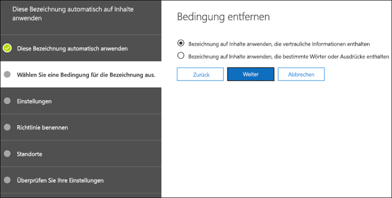
  
<span data-ttu-id="9321a-248">Beachten Sie, dass für automatisch angewendete Aufbewahrungsbezeichnungen ein Office 365 Enterprise E5-Abonnement erforderlich ist. Es kann bis zu sieben Tage dauern, bevor automatisch angewendete Aufbewahrungsbezeichnungen auf alle Inhalte angewendet werden, die die Bedingungen erfüllen, wie oben beschrieben.</span><span class="sxs-lookup"><span data-stu-id="9321a-248">Note that auto-apply retention labels require an Office 365 Enterprise E5 subscription, and that it can take up to seven days for auto-apply retention labels to be applied to all content that matches the conditions, as described above.</span></span>
  
### <a name="auto-apply-retention-labels-to-content-with-specific-types-of-sensitive-information"></a><span data-ttu-id="9321a-249">Automatisches Anwenden von Aufbewahrungsbezeichnungen auf Inhalte mit bestimmten Typen von vertraulichen Informationen</span><span class="sxs-lookup"><span data-stu-id="9321a-249">Auto-apply retention labels to content with specific types of sensitive information</span></span>

<span data-ttu-id="9321a-p126">Beim Erstellen von automatisch angewendeten Aufbewahrungsbezeichnungen für vertrauliche Informationen wird dieselbe Liste von Richtlinienvorlagen wie beim Erstellen einer Richtlinie zur Verhinderung von Datenverlust (Data Loss Prevention, DLP) angezeigt. Jede Richtlinienvorlage ist so vorkonfiguriert, dass sie nach bestimmten Arten von vertraulichen Informationen sucht. So sucht die hier dargestellte Vorlage zum Beispiel nach US-ITIN, SSN und Passnummern. Weitere Informationen zu DLP finden Sie unter [Überblick über DLP-Richtlinien](data-loss-prevention-policies.md).</span><span class="sxs-lookup"><span data-stu-id="9321a-p126">When you create auto-apply retention labels for sensitive information, you see the same list of policy templates as when you create a data loss prevention (DLP) policy. Each policy template is preconfigured to look for specific types of sensitive information - for example, the template shown here looks for U.S. ITIN, SSN, and passport numbers. To learn more about DLP, see [Overview of data loss prevention policies](data-loss-prevention-policies.md).</span></span>
  
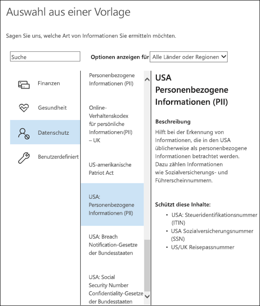
  
<span data-ttu-id="9321a-p127">Nach der Auswahl einer Richtlinienvorlage können Sie alle Arten von vertraulichen Informationen hinzufügen oder entfernen, und Sie können die Instanzenanzahl ändern und die Genauigkeit abgleichen. Im hier gezeigten Beispiel wird eine Aufbewahrungsbezeichnung nur dann automatisch angewendet, wenn Folgendes zutrifft:</span><span class="sxs-lookup"><span data-stu-id="9321a-p127">After you select a policy template, you can add or remove any types of sensitive information, and you can change the instance count and match accuracy. In the example shown here, a retention label will be auto-applied only when:</span></span>
  
- <span data-ttu-id="9321a-p128">Der Inhalt besteht aus 1 bis 9 Instanzen einer der drei folgenden Typen von vertraulichen Informationen. Sie können den **max**-Wert löschen, sodass er sich in **any** ändert.</span><span class="sxs-lookup"><span data-stu-id="9321a-p128">The content contains between 1 and 9 instances of any of these three sensitive information types. You can delete the **max** value so that it changes to **any**.</span></span>
    
- <span data-ttu-id="9321a-p129">Der Typ der vertraulichen Informationen, der erkannt wird, hat eine Übereinstimmungsgenauigkeit (oder Vertrauensstufe) von mindestens 75. Viele Typen vertraulicher Informationen werden mit mehreren Mustern definiert, wobei ein Muster mit einer höheren Übereinstimmungsgenauigkeit mehr Nachweise (z. B. Stichwörter, Datumsangaben oder Adressen) erfordert, während ein Muster mit einer niedrigeren Übereinstimmungsgenauigkeit weniger Nachweise erfordert. Einfach ausgedrückt: Je niedriger die **min**-Übereinstimmungsgenauigkeit, desto einfacher ist es für den Inhalt, die Bedingung zu erfüllen.</span><span class="sxs-lookup"><span data-stu-id="9321a-p129">The type of sensitive information that's detected has a match accuracy (or confidence level) of at least 75. Many sensitive information types are defined with multiple patterns, where a pattern with a higher match accuracy requires more evidence to be found (such as keywords, dates, or addresses), while a pattern with a lower match accuracy requires less evidence. Simply put, the lower the **min** match accuracy, the easier it is for content to match the condition.</span></span> 
    
    <span data-ttu-id="9321a-261">Wenn Sie die Übereinstimmungsgenauigkeit (oder Vertrauensstufe) ändern, sollten Sie eine der Vertrauensstufen verwenden, die in einem Muster für diese Art von vertraulichen Informationen verwendet wird. Dies ist in [Danach suchen die Typen vertraulicher Informationen](what-the-sensitive-information-types-look-for.md) definiert.</span><span class="sxs-lookup"><span data-stu-id="9321a-261">If you change the match accuracy (or confidence level), you should use one of confidence levels used in a pattern for that type of sensitive information, as defined in [What the sensitive information types look for](what-the-sensitive-information-types-look-for.md).</span></span>
    
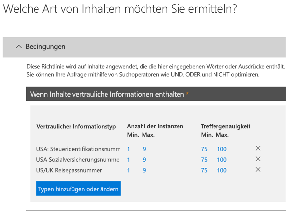
  
### <a name="auto-apply-retention-labels-to-content-with-keywords"></a><span data-ttu-id="9321a-263">Automatisches Anwenden von Aufbewahrungsbezeichnungen auf Inhalte mit Stichwörtern</span><span class="sxs-lookup"><span data-stu-id="9321a-263">Auto-apply retention labels to content with keywords</span></span>

<span data-ttu-id="9321a-p130">Sie können automatisch angewendete Aufbewahrungsbezeichnungen auf Inhalte anwenden, die bestimmte Kriterien erfüllen. Die derzeit verfügbaren Bedingungen unterstützen das Anwenden einer Aufbewahrungsbezeichnung auf Inhalte, die bestimmte Wörter oder Ausdrücke enthalten. Sie können Ihre Abfrage mithilfe von Suchoperatoren wie UND, ODER und NICHT verfeinern.</span><span class="sxs-lookup"><span data-stu-id="9321a-p130">You can auto-apply retention labels to content that satisfies certain conditions. The conditions now available support applying a retention label to content that contains specific words or phrases. You can refine your query by using search operators like AND, OR, and NOT.</span></span> 

<span data-ttu-id="9321a-267">Weitere Informationen zur Abfragesyntax finden Sie unter:</span><span class="sxs-lookup"><span data-stu-id="9321a-267">For more information on query syntax, see:</span></span>

- [<span data-ttu-id="9321a-268">Syntaxreferenz für die Keyword Query Language (KQL)</span><span class="sxs-lookup"><span data-stu-id="9321a-268">Keyword Query Language (KQL) syntax reference</span></span>](https://docs.microsoft.com/sharepoint/dev/general-development/keyword-query-language-kql-syntax-reference)

<span data-ttu-id="9321a-269">Abfragebasierte Aufbewahrungsbezeichnungen verwenden den Suchindex, um Inhalte zu identifizieren.</span><span class="sxs-lookup"><span data-stu-id="9321a-269">Query-based retention labels use the search index to identify content.</span></span>
  

  
## <a name="applying-a-default-retention-label-to-all-content-in-a-sharepoint-library-folder-or-document-set"></a><span data-ttu-id="9321a-271">Anwenden einer Standardaufbewahrungsbezeichnung auf alle Inhalte in einer SharePoint-Bibliothek, einem Ordner oder einer Dokumentenmappe</span><span class="sxs-lookup"><span data-stu-id="9321a-271">Applying a default retention label to all content in a SharePoint library, folder, or document set</span></span>

<span data-ttu-id="9321a-272">Sie können es Personen nicht nur ermöglichen, eine Aufbewahrungsbezeichnung auf einzelne Dokumente anzuwenden, sondern Sie können eine Standardaufbewahrungsbezeichnung auf eine SharePoint-Bibliothek, einen Ordner oder eine Dokumentenmappe anwenden, sodass alle Dokumente in diesem Speicherort diese Standardaufbewahrungsbezeichnung erhalten.</span><span class="sxs-lookup"><span data-stu-id="9321a-272">In addition to enabling people to apply a retention label to individual documents, you can also apply a default retention label to a SharePoint library, folder, or document set, so that all documents in that location get the default retention label.</span></span>
  
<span data-ttu-id="9321a-p131">Bei einer Dokumentenbibliothek erfolgt dies auf der Seite **Bibliothekseinstellungen**. Wenn Sie die Standardaufbewahrungsbezeichnung auswählen, können Sie auch auswählen, dass sie auf alle vorhandenen Elemente in der Bibliothek angewendet wird.</span><span class="sxs-lookup"><span data-stu-id="9321a-p131">For a document library, this is done on the **Library settings** page for a document library. When you choose the default retention label, you can also choose to apply it to any existing items in the library.</span></span> 
  
<span data-ttu-id="9321a-275">Wenn Sie zum Beispiel über ein Tag für Marketingmaterial verfügen und wissen, dass eine bestimmte Dokumentenbibliothek nur diese Art von Inhalt enthält, können Sie das Marketingmaterial-Tag als Standard für alle Dokumente in dieser Bibliothek festlegen.</span><span class="sxs-lookup"><span data-stu-id="9321a-275">For example, if you have a tag for marketing materials, and you know a specific document library will contain only that type of content, you can make the Marketing Materials tag the default for all documents in that library.</span></span>
  
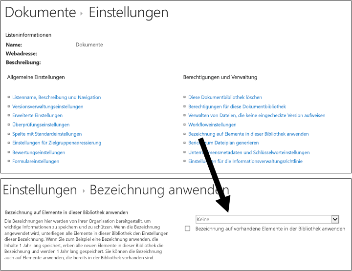
  
<span data-ttu-id="9321a-277">Wenn Sie eine Standardaufbewahrungsbezeichnung auf vorhandene Elemente in der Bibliothek, im Ordner oder in der Dokumentenmappe anwenden:</span><span class="sxs-lookup"><span data-stu-id="9321a-277">If you apply a default retention label to existing items in the library, folder, or document set:</span></span>
  
- <span data-ttu-id="9321a-p132">Allen Elementen in der Bibliothek, im Ordner oder in der Dokumentenmappe wird automatisch dieselbe Aufbewahrungsbezeichnung zugewiesen, **mit Ausnahme von** Elementen, denen eine Aufbewahrungsbezeichnung explizit zugewiesen wurde. Explizit bezeichnete Elemente behalten diese Bezeichnung. Weitere Informationen finden Sie weiter unter im Abschnitt zu den [Grundsätzen der Aufbewahrung, oder was hat Vorrang?](#the-principles-of-retention-or-what-takes-precedence)</span><span class="sxs-lookup"><span data-stu-id="9321a-p132">All items in the library, folder, or document set automatically get the same retention label, **except** for items that have had a retention label applied explicitly to them. Explicitly labeled items keep their existing label. For more information, see the below section on [The principles of retention, or what takes precedence?](#the-principles-of-retention-or-what-takes-precedence).</span></span>
    
- <span data-ttu-id="9321a-281">Wenn Sie die Standardaufbewahrungsbezeichnung einer Bibliothek, eines Ordners oder einer Dokumentenmappe ändern oder entfernen, wird die Aufbewahrungsbezeichnung ebenfalls für alle Elemente in der Bibliothek, im Ordner oder in der Dokumentenmappe geändert oder entfernt, **mit Ausnahme von** Elementen, die über explizit zugewiesene Aufbewahrungsbezeichnungen verfügen.</span><span class="sxs-lookup"><span data-stu-id="9321a-281">If you change or remove the default retention label for a library, folder, or document set, the retention label's also changed or removed for all items in the library, folder, or document set, **except** items with explicit retention labels.</span></span> 
    
- <span data-ttu-id="9321a-282">Wenn Sie ein Element mit einer Standardaufbewahrungsbezeichnung aus einer Bibliothek, einem Ordner oder einer Dokumentenmappe in eine andere Bibliothek, einen Ordner oder eine Dokumentenmappe verschieben, behält das Element die vorhandene Standardaufbewahrungsbezeichnung auch dann, wenn der neue Speicherort eine andere Standardaufbewahrungsbezeichnung hat.</span><span class="sxs-lookup"><span data-stu-id="9321a-282">If you move an item with a default retention label from one library, folder, or document set to another library, folder, or document set, the item keeps its existing default retention label, even if the new location has a different default retention label.</span></span>
    
## <a name="applying-a-retention-label-to-email-by-using-rules"></a><span data-ttu-id="9321a-283">Anwenden einer Aufbewahrungsbezeichnung auf E-Mails mithilfe von Regeln</span><span class="sxs-lookup"><span data-stu-id="9321a-283">Applying a retention label to email by using rules</span></span>

<span data-ttu-id="9321a-284">In Outlook 2010 oder höher können Sie Regeln zum Anwenden einer Aufbewahrungsbezeichnung oder Aufbewahrungsrichtlinie erstellen.</span><span class="sxs-lookup"><span data-stu-id="9321a-284">In Outlook 2010 or later, you can create rules to apply a retention label or retention policy.</span></span>
  
<span data-ttu-id="9321a-285">Sie können zum Beispiel eine Regel erstellen, die eine bestimmte Aufbewahrungsbezeichnung auf alle Nachrichten anwendet, die an eine oder von einer bestimmten Verteilergruppe gesendet werden.</span><span class="sxs-lookup"><span data-stu-id="9321a-285">For example, you can create a rule that applies a specific retention label to all messages sent to or from a specific distribution group.</span></span>
  
<span data-ttu-id="9321a-286">So erstellen Sie eine Regel: Rechtsklick auf ein Element \> **Regeln** \> **Regel erstellen** \> **Erweiterte Optionen** \> **Regel-Assistent** \> **Aufbewahrungsrichtlinie anwenden**.</span><span class="sxs-lookup"><span data-stu-id="9321a-286">To create a rule, right-click an item \> **Rules** \> **Create Rule** \> **Advanced Options** \> **Rules Wizard** \> **apply retention policy**.</span></span>
  
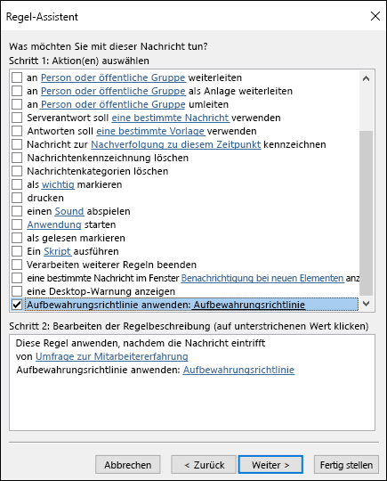
  
## <a name="classifying-content-without-applying-any-actions"></a><span data-ttu-id="9321a-288">Klassifizieren von Inhalten ohne Anwendung von Aktionen</span><span class="sxs-lookup"><span data-stu-id="9321a-288">Classifying content without applying any actions</span></span>

<span data-ttu-id="9321a-p133">Wenn Sie eine Aufbewahrungsbezeichnung erstellen, müssen Sie keine Aufbewahrungsaktion oder anderen Aktionen aktivieren, wie unten dargestellt. In diesem Fall können Sie eine Aufbewahrungsbezeichnung einfach als Textbeschriftung verwenden, ohne Aktionen zu erzwingen.</span><span class="sxs-lookup"><span data-stu-id="9321a-p133">When you create a retention label, you can do so without turning on any retention or other actions, as shown below. In this case, you can use a retention label simply as a text label, without enforcing any actions.</span></span>
  
<span data-ttu-id="9321a-291">Sie können beispielsweise die Aufbewahrungsbezeichnung „Später überprüfen“ ohne Aktionen erstellen und diese Aufbewahrungsbezeichnung dann automatisch auf Inhalte mit vertraulichen Informationen oder auf abgefragte Inhalte anwenden.</span><span class="sxs-lookup"><span data-stu-id="9321a-291">For example, you can create a retention label named "Review later" with no actions, and then auto-apply that retention label to content with sensitive information types or queried content.</span></span>
  
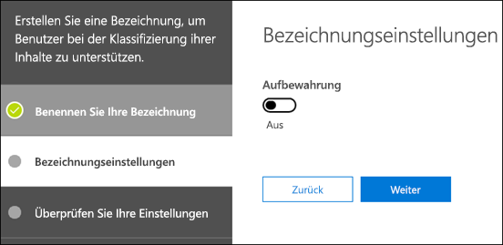
  
## <a name="using-retention-labels-for-records-management"></a><span data-ttu-id="9321a-293">Verwenden von Aufbewahrungsbezeichnungen für die Datensatzverwaltung</span><span class="sxs-lookup"><span data-stu-id="9321a-293">Using retention labels for records management</span></span>

<span data-ttu-id="9321a-294">Im Allgemeinen bedeutet die Datensatzverwaltung Folgendes:</span><span class="sxs-lookup"><span data-stu-id="9321a-294">At a high level, records management means that:</span></span>
  
- <span data-ttu-id="9321a-295">Wichtiger Inhalt wird von Benutzern als Datensatz klassifiziert.</span><span class="sxs-lookup"><span data-stu-id="9321a-295">Important content is classified as a record by users.</span></span>
    
- <span data-ttu-id="9321a-296">Ein Datensatz kann nicht geändert oder gelöscht werden.</span><span class="sxs-lookup"><span data-stu-id="9321a-296">A record can't be modified or deleted.</span></span>
    
- <span data-ttu-id="9321a-297">Datensätze werden gelöscht, wenn die festgelegte Lebensdauer endet.</span><span class="sxs-lookup"><span data-stu-id="9321a-297">Records are finally disposed of after their stated lifetime is past.</span></span>
    
<span data-ttu-id="9321a-p134">Sie können Aufbewahrungsbezeichnungen verwenden, um eine einheitliche Datensatzverwaltungsstrategie in Office 365 zu implementieren, während andere Funktionen für die Verwaltung von Datensätzen, z. B. das Datenarchiv, nur für SharePoint-Inhalte gelten. Darüber hinaus können Sie auch Aufbewahrungsaktionen für Datensätze erzwingen, damit sie am Ende ihres Lebenszyklus automatisch gelöscht werden.</span><span class="sxs-lookup"><span data-stu-id="9321a-p134">You can use retention labels to implement a single, consistent records-management strategy across Office 365, whereas other records-management features such as the Record Center apply only to SharePoint content. And you can enforce retention actions on records, so that they're disposed of automatically at the end of their lifecycle.</span></span>
  
<span data-ttu-id="9321a-300">Wenn Sie eine Aufbewahrungsbezeichnung erstellen, haben Sie die Möglichkeit, die Aufbewahrungsbezeichnung zum Klassifizieren des Inhalts als Datensatz zu verwenden.</span><span class="sxs-lookup"><span data-stu-id="9321a-300">When you create a retention label, you have the option to use the retention label to classify the content as a record.</span></span>
  
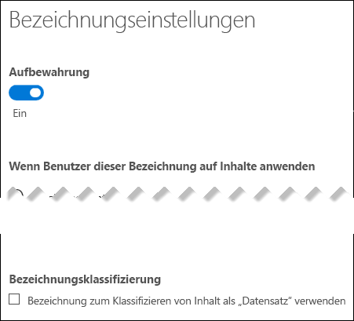
  
<span data-ttu-id="9321a-302">Wenn ein Element als Datensatz bezeichnet wird, geschehen vier Dinge:</span><span class="sxs-lookup"><span data-stu-id="9321a-302">When an item is labeled as a record, four things happen:</span></span>
  
- <span data-ttu-id="9321a-303">Das Element kann nicht endgültig gelöscht werden.</span><span class="sxs-lookup"><span data-stu-id="9321a-303">The item can't be permanently deleted.</span></span>
    
- <span data-ttu-id="9321a-304">Das Element kann nicht bearbeitet werden.</span><span class="sxs-lookup"><span data-stu-id="9321a-304">The item can't be edited.</span></span>
    
- <span data-ttu-id="9321a-305">Die Bezeichnung kann nicht geändert werden.</span><span class="sxs-lookup"><span data-stu-id="9321a-305">The label can't be changed.</span></span>
    
- <span data-ttu-id="9321a-306">Die Bezeichnung kann nicht entfernt werden.</span><span class="sxs-lookup"><span data-stu-id="9321a-306">The label can't be removed.</span></span>
    
### <a name="who-can-classify-content-as-a-record"></a><span data-ttu-id="9321a-307">Wer Inhalt als Datensatz klassifizieren kann</span><span class="sxs-lookup"><span data-stu-id="9321a-307">Who can classify content as a record</span></span>

<span data-ttu-id="9321a-p135">Bei SharePoint-Inhalten kann jeder Benutzer in der Standardgruppe „Mitglieder“ (Berechtigungsstufe „Mitwirken“) eine Datensatzbezeichnung auf Inhalte anwenden. Nur der Adminstrator der Websitesammlung kann diese Aufbewahrungsbezeichnung entfernen oder ändern, nachdem sie angewendet wurde. Darüber hinaus muss eine Aufbewahrungsbezeichnung, die Inhalt als Datensatz klassifiziert, manuell angewendet werden. Sie kann nicht automatisch angewendet werden.</span><span class="sxs-lookup"><span data-stu-id="9321a-p135">For SharePoint content, any user in the default Members group (the Contribute permission level) can apply a record label to content. Only the site collection administrator can remove or change that retention label after it's been applied. In addition, a retention label that classifies content as a record needs to be applied manually; it can't be auto-applied.</span></span>
  
### <a name="records-and-folders"></a><span data-ttu-id="9321a-311">Datensätze und Ordner</span><span class="sxs-lookup"><span data-stu-id="9321a-311">Records and folders</span></span>

<span data-ttu-id="9321a-p136">Sie können eine Aufbewahrungsbezeichnung auf einen Ordner in Exchange, SharePoint oder OneDrive anwenden. Wenn Sie einen Ordner als Datensatz bezeichnen und Sie ein Element in den Ordner verschieben, wird das Element als Datensatz gekennzeichnet. Wenn Sie das Element aus dem Ordner verschieben, bleibt es weiterhin als Datensatz gekennzeichnet.</span><span class="sxs-lookup"><span data-stu-id="9321a-p136">You can apply a retention label to a folder in Exchange, SharePoint, or OneDrive. If a folder is labeled as a record, and you move an item into the folder, the item is labeled as a record. When you move the item out of the folder, the item will continue to be labeled as a record.</span></span>
  
### <a name="records-cant-be-deleted"></a><span data-ttu-id="9321a-315">Datensätze können nicht gelöscht werden</span><span class="sxs-lookup"><span data-stu-id="9321a-315">Records can't be deleted</span></span>

<span data-ttu-id="9321a-316">Wenn Sie versuchen, einen Datensatz in Exchange zu löschen, wird das Element in den Ordner „Wiederherstellbare Elemente“ verschoben, entsprechend der Beschreibung in [Funktionsweise einer Aufbewahrungsrichtlinie mit Inhalten am Speicherort](retention-policies.md#how-a-retention-policy-works-with-content-in-place).</span><span class="sxs-lookup"><span data-stu-id="9321a-316">If you attempt to delete a record in Exchange, the item is moved to the Recoverable Items folder as described in [How a retention policy works with content in place](retention-policies.md#how-a-retention-policy-works-with-content-in-place).</span></span>
  
<span data-ttu-id="9321a-317">Wenn Sie versuchen, einen Datensatz in SharePoint zu löschen, wird eine Fehlermeldung angezeigt, dass das Element nicht gelöscht wurde, und das Element verbleibt in der Bibliothek.</span><span class="sxs-lookup"><span data-stu-id="9321a-317">If you attempt to delete a record in a SharePoint, you see an error that the item wasn't deleted, and the item remains in the library.</span></span>
  

  
<span data-ttu-id="9321a-319">Wenn Sie versuchen, einen Datensatz in OneDrive zu löschen, wird das Element in das permanentes Dokumentarchiv verschoben, entsprechend der Beschreibung in [Funktionsweise einer Aufbewahrungsrichtlinie mit Inhalten am Speicherort](retention-policies.md#how-a-retention-policy-works-with-content-in-place).</span><span class="sxs-lookup"><span data-stu-id="9321a-319">If you attempt to delete a record in OneDrive, the item is moved to the Preservation Hold library as described in [How a retention policy works with content in place](retention-policies.md#how-a-retention-policy-works-with-content-in-place).</span></span>
  
## <a name="using-a-retention-label-as-a-condition-in-a-dlp-policy"></a><span data-ttu-id="9321a-320">Verwenden einer Aufbewahrungsbezeichnung als Bedingung in einer DLP-Richtlinie</span><span class="sxs-lookup"><span data-stu-id="9321a-320">Using a retention label as a condition in a DLP policy</span></span>

<span data-ttu-id="9321a-p137">Eine Aufbewahrungsbezeichnung kann Aufbewahrungsaktionen für Inhalte erzwingen. Darüber hinaus können Sie eine Aufbewahrungsbezeichnung als Bedingung in einer Richtlinie zur Verhinderung von Datenverlust (Data Loss Prevention, DLP) verwenden. Dies bedeutet, dass die DLP-Richtlinie weitere Aktionen für Inhalte, die eine bestimmte Bezeichnung haben, erzwingen kann, wie zum Beispiel das Einschränken des Zugriffs.</span><span class="sxs-lookup"><span data-stu-id="9321a-p137">A retention label can enforce retention actions on content. In addition, you can use a retention label as a condition in a data loss prevention (DLP) policy, and the DLP policy can enforce other actions, such as restricting access, on content that contains a specific label.</span></span> 
  
<span data-ttu-id="9321a-323">Weitere Informationen finden Sie unter [Verwenden einer Bezeichnung als Bedingung in einer DLP-Richtlinie](data-loss-prevention-policies.md#using-a-label-as-a-condition-in-a-dlp-policy)</span><span class="sxs-lookup"><span data-stu-id="9321a-323">For more information, see [Using a label as a condition in a DLP policy](data-loss-prevention-policies.md#using-a-label-as-a-condition-in-a-dlp-policy).</span></span>
  
## <a name="using-the-label-activity-explorer-and-the-data-governance-reports"></a><span data-ttu-id="9321a-324">Verwenden des Bezeichnungsaktivitäten-Explorers und von Data Governance-Berichten</span><span class="sxs-lookup"><span data-stu-id="9321a-324">Using the Label Activity Explorer and the data governance reports</span></span>

<span data-ttu-id="9321a-p138">Wenn Sie Aufbewahrungsbezeichnungen veröffentlicht oder automatisch angewendet haben, sollten Sie überprüfen, ob sie wie gewünscht auf Inhalte angewendet werden. Zum Überwachen der Aufbewahrungsbezeichnungen können Sie den</span><span class="sxs-lookup"><span data-stu-id="9321a-p138">After you publish or auto-apply your retention labels, you'll want to verify that they're being applied to content as you intended. To monitor your retention labels, you can use the:</span></span>
  
- <span data-ttu-id="9321a-p139">**Bezeichnungsaktivitäten-Explorer** verwenden. Mit dem Explorer (siehe unten) können Sie schnell die Aufbewahrungsbezeichnungsaktivität für alle Inhalte in SharePoint und OneDrive for Business während der letzten 30 Tage durchsuchen und sie anzeigen. Weitere Informationen finden Sie unter [Anzeigen der Bezeichnungsaktivität für Dokumente](view-label-activity-for-documents.md).</span><span class="sxs-lookup"><span data-stu-id="9321a-p139">**Label Activity Explorer**. With the explorer (shown below), you can quickly search and view retention label activity for all content across SharePoint and OneDrive for Business over the past 30 days. For more information, see [View label activity for documents](view-label-activity-for-documents.md).</span></span>
    
- <span data-ttu-id="9321a-p140">**Berichte zur Data Governance**. Mit diesen Berichten können Sie schnell die Trends bei Aufbewahrungsbezeichnungen und die Aktivitäten für alle Inhalte in Exchange, SharePoint und OneDrive for Business während der letzten 90 Tage anzeigen. Weitere Informationen finden Sie unter [Anzeigen der Berichte zur Data Governance](view-the-data-governance-reports.md).</span><span class="sxs-lookup"><span data-stu-id="9321a-p140">**Data governance reports**. With these reports, you can quickly view retention label trends and activity for all content across Exchange, SharePoint, and OneDrive for Business over the past 90 days. For more information, see [View the data governance reports](view-the-data-governance-reports.md).</span></span>
    
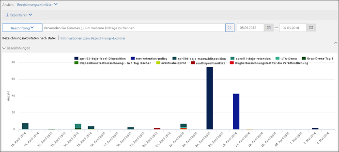
  
## <a name="using-content-search-to-find-all-content-with-a-specific-retention-label-applied-to-it"></a><span data-ttu-id="9321a-334">Verwenden der Inhaltssuche zum Suchen des gesamten Inhalts, auf den eine bestimmte Aufbewahrungsbezeichnung angewendet wurde</span><span class="sxs-lookup"><span data-stu-id="9321a-334">Using Content Search to find all content with a specific retention label applied to it</span></span>

<span data-ttu-id="9321a-335">Nachdem Aufbewahrungsbezeichnungen entweder von Benutzern Inhalten zugewiesen oder automatisch auf Inhalte angewendet wurden, können Sie die Inhaltssuche im Security &amp; Compliance Center verwenden, um alle Inhalte zu suchen, die durch eine bestimmte Aufbewahrungsbezeichnung klassifiziert wurden.</span><span class="sxs-lookup"><span data-stu-id="9321a-335">After retention labels are assigned to content, either by users or auto-applied, you can use content search in the Security &amp; Compliance Center to find all content that's classified with a specific retention label.</span></span>
  
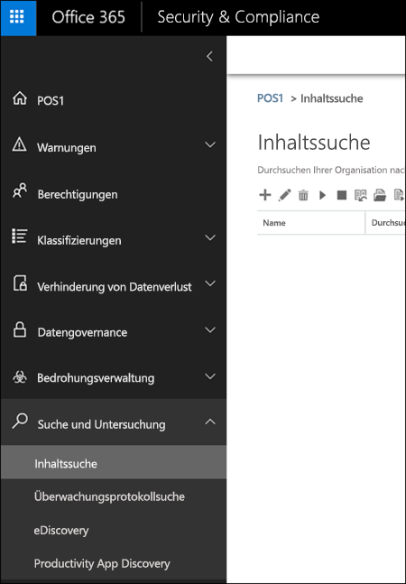
  
<span data-ttu-id="9321a-p141">Wenn Sie eine Inhaltssuche erstellen, wählen Sie die **Compliancetag**-Bedingung, und geben Sie dann den gesamten Bezeichnungsnamen oder einen Teil davon ein, und verwenden Sie ein Platzhalterzeichen. Weitere Informationen finden Sie unter [Stichwortabfragen und Suchbedingungen für die Inhaltssuche](keyword-queries-and-search-conditions.md).</span><span class="sxs-lookup"><span data-stu-id="9321a-p141">When you create a content search, choose the **Compliance Tag** condition, and then enter the complete label name or part of the label name and use a wildcard. For more information, see [Keyword queries and search conditions for Content Search](keyword-queries-and-search-conditions.md).</span></span>
  
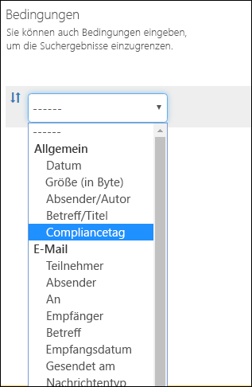
  
## <a name="the-principles-of-retention-or-what-takes-precedence"></a><span data-ttu-id="9321a-340">Die Grundsätze der Aufbewahrung, oder was hat Vorrang?</span><span class="sxs-lookup"><span data-stu-id="9321a-340">The principles of retention, or what takes precedence?</span></span>

<span data-ttu-id="9321a-p142">Es ist möglich oder sogar wahrscheinlich, dass auf Inhalte mehrere Aufbewahrungsrichtlinien angewendet werden, die jeweils mit einer anderen Aktion (aufbewahren, löschen oder beides) und einem anderen Aufbewahrungszeitraum verbunden sind. Was hat Vorrang? Ganz allgemein sei gesagt, dass Sie sich sicher sein können, dass Inhalte, die aufgrund einer Richtlinie aufbewahrt werden müssen, nicht von einer anderen Richtlinie dauerhaft gelöscht werden können.</span><span class="sxs-lookup"><span data-stu-id="9321a-p142">It's possible or even likely that content might have several retention policies applied to it, each with a different action (retain, delete, or both) and retention period. What takes precedence? At the highest level, rest assured that content being retained by one policy can't be permanently deleted by another policy.</span></span>
  

  
<span data-ttu-id="9321a-345">Um zu verstehen, wie verschiedene Bezeichnungen mit Aufbewahrungsrichtlinien auf Inhalte angewendet werden, sollten Sie diese Grundsätze der Aufbewahrung beachten:</span><span class="sxs-lookup"><span data-stu-id="9321a-345">To understand how different labels with retention actions are applied to content, keep these principles of retention in mind:</span></span>
  
1. <span data-ttu-id="9321a-p143">\*\*Aufbewahrung hat Vorrang vor Löschung. \*\* Angenommen, eine Aufbewahrungsrichtlinie gibt vor, dass Exchange-E-Mails nach drei Jahren gelöscht werden sollen, eine andere Aufbewahrungsrichtlinie jedoch besagt, dass Exchange-E-Mails fünf Jahre lang aufbewahrt und dann gelöscht werden müssen. Alle Inhalte, die drei Jahre alt sind, werden gelöscht und aus der Ansicht der Benutzer ausgeblendet, aber immer noch im Ordner "Wiederherstellbare Elemente" aufbewahrt, bis sie fünf Jahre alt sind und endgültig gelöscht werden.</span><span class="sxs-lookup"><span data-stu-id="9321a-p143">**Retention wins over deletion.** Suppose that one retention policy says to delete Exchange email after three years, but another retention policy says to retain Exchange email for five years and then delete it. Any content that reaches three years old will be deleted and hidden from the users' view, but still retained in the Recoverable Items folder until the content reaches five years old, when it will be permanently deleted.</span></span> 
    
2. <span data-ttu-id="9321a-p144">\*\*Der längste Aufbewahrungszeitraum hat Vorrang. \*\* Wenn Inhalte mehreren Aufbewahrungsrichtlinien, nach denen Inhalte aufbewahrt werden, unterliegen, werden sie bis zum Ende des längsten Aufbewahrungszeitraums aufbewahrt.</span><span class="sxs-lookup"><span data-stu-id="9321a-p144">**The longest retention period wins.** If content's subject to multiple policies that retain content, it will be retained until the end of the longest retention period.</span></span> 
    
3. <span data-ttu-id="9321a-p145">**Explizite Einbindung hat Vorrang vor impliziter Einbindung.** Dies bedeutet:</span><span class="sxs-lookup"><span data-stu-id="9321a-p145">**Explicit inclusion wins over implicit inclusion.** This means:</span></span> 
    
    1. <span data-ttu-id="9321a-p146">Wenn eine Aufbewahrungsbezeichnung mit Aufbewahrungseinstellungen von einem Benutzer manuell einem Element zugewiesen wird, z. B. einem Exchange-E-Mail- oder OneDrive-Dokument, hat diese Aufbewahrungsbezeichnung Vorrang sowohl vor einer Richtlinie, die auf Website- oder Postfachebene zugewiesen ist, als auch vor einer Standardaufbewahrungsbezeichnung, die von der Dokumentbibliothek zugewiesen wurde. Wenn z. B. die explizite Aufbewahrungsbezeichnung eine Aufbewahrung über zehn Jahr vorgibt, aber die der Website zugewiesene Richtlinie besagt, dass nur fünf Jahre aufbewahrt werden soll, hat die Aufbewahrungsbezeichnung Vorrang. Beachten Sie, dass automatisch angewendete Aufbewahrungsbezeichnungen als implizit und nicht als explizit angesehen werden, da sie von Office 365 automatisch angewendet werden.</span><span class="sxs-lookup"><span data-stu-id="9321a-p146">If a retention label with retention settings is manually assigned by a user to an item, such as an Exchange email or OneDrive document, that retention label takes precedence over both a policy assigned at the site or mailbox level and a default retention label assigned by the document library. For example, if the explicit retention label says to retain for ten years, but the retention policy assigned to the site says to retain for only five years, the retention label takes precedence. Note that auto-apply retention labels are considered implicit, not explicit, because they're applied automatically by Office 365.</span></span>
    
    2. <span data-ttu-id="9321a-356">Wenn eine Aufbewahrungsrichtlinie einen bestimmten Speicherort wie das Postfach oder OneDrive for Business-Konto eines bestimmten Benutzers umfasst, hat diese Richtlinie Vorrang vor einer anderen Aufbewahrungsrichtlinie, die für alle Postfächer oder OneDrive for Business-Konten von Benutzern gilt, aber nicht das Postfach dieses Benutzers speziell einschließt.</span><span class="sxs-lookup"><span data-stu-id="9321a-356">If a retention policy includes a specific location, such as a specific user's mailbox or OneDrive for Business account, that policy takes precedence over another retention policy that applies to all users' mailboxes or OneDrive for Business accounts but doesn't specifically include that user's mailbox.</span></span>
    
4. <span data-ttu-id="9321a-p147">\*\*Der kürzeste Löschzeitraum hat Vorrang. \*\* Ebenso gilt, dass wenn Inhalte mehreren Aufbewahrungsrichtlinien zur Löschung (ohne Aufbewahrung) unterliegen, sie am Ende des kürzesten Aufbewahrungszeitraums gelöscht werden.</span><span class="sxs-lookup"><span data-stu-id="9321a-p147">**The shortest deletion period wins.** Similarly, if content's subject to multiple policies that delete content (with no retention), it will be deleted at the end of the shortest retention period.</span></span> 
    
<span data-ttu-id="9321a-359">Beachten Sie: Wenn die Regeln, die von allen Richtlinien oder Kennzeichnungen angewendet werden, auf einer Ebene identisch sind, bewegt sich der Fluss nach unten zur nächsten Ebene, wo entschieden wird, welche Regel Vorrang hat.</span><span class="sxs-lookup"><span data-stu-id="9321a-359">Understand that the principles of retention work as a tie-breaking flow from top to bottom: If the rules applied by all policies or labels are the same at one level, the flow moves down to the next level to determine precedence for which rule is applied.</span></span>
  
<span data-ttu-id="9321a-p148">Schließlich kann keine Aufbewahrungsrichtlinie oder Kennzeichnung einen Inhalt dauerhaft löschen, der für eDiscovery gesperrt ist. Wenn die Sperre aufgehoben wird, kommt der Inhalt wieder für den oben beschriebenen Bereinigungsprozess infrage.</span><span class="sxs-lookup"><span data-stu-id="9321a-p148">Finally, a retention policy or label cannot permanently delete any content that's on hold for eDiscovery. When the hold is released, the content again becomes eligible for the cleanup process described above.</span></span>
  
## <a name="use-retention-labels-instead-of-these-features"></a><span data-ttu-id="9321a-362">Verwenden von Aufbewahrungsbezeichnungen statt dieser Features</span><span class="sxs-lookup"><span data-stu-id="9321a-362">Use retention labels instead of these features</span></span>

<span data-ttu-id="9321a-p149">Aufbewahrungsbezeichnungen können ganz einfach der gesamten Organisation und deren Inhalten in Office 365 bereitgestellt werden, einschließlich Exchange, SharePoint, OneDrive und Office 365-Gruppen. Wenn Sie Inhalte klassifizieren oder Datensätze in Office 365 verwalten müssen, empfehlen wir, dass Sie Aufbewahrungsbezeichnungen verwenden.</span><span class="sxs-lookup"><span data-stu-id="9321a-p149">Retention labels can easily be made available to an entire organization and its content across Office 365, including Exchange, SharePoint, OneDrive, and Office 365 groups. If you need to classify content or manage records anywhere in Office 365, we recommend that you use retention labels.</span></span>
  
<span data-ttu-id="9321a-p150">Es gibt mehrere andere Features, die zuvor zum Klassifizieren von Inhalten oder Verwalten von Einträgen in Office 365 verwendet wurden. Diese sind nachfolgend aufgeführt. Diese Features funktionieren weiterhin gleichberechtigt mit Aufbewahrungsbezeichnungen im Security &amp; Compliance Center. Beachten Sie, dass es vorkommen kann, dass sich die Implementierung von Aufbewahrungsbezeichnungen von früheren Features unterscheidet, und die Weiterentwicklung von Aufbewahrungsbezeichnungen treibt die Entwicklung der künftigen Datensatzverwaltung in Office 365 voran. Daher empfehlen wir Ihnen, künftig für die Data Governance Bezeichnungen anstelle dieser Features zu verwenden.</span><span class="sxs-lookup"><span data-stu-id="9321a-p150">There are several other features that have previously been used to classify content or manage records in Office 365. These are listed below. These features will continue to work side by side with retention labels created in the Security &amp; Compliance Center. Note that while there are instances where the implementation of retention labels differs from previous features, the evolution of retention labels will drive the future of records management across Office 365. Therefore, moving forward, for data governance, we recommend that you use retention labels instead of these features.</span></span>
  
### <a name="exchange-online"></a><span data-ttu-id="9321a-370">Exchange Online</span><span class="sxs-lookup"><span data-stu-id="9321a-370">Exchange Online</span></span>

- <span data-ttu-id="9321a-371">[Aufbewahrungstags und Aufbewahrungsrichtlinien](https://go.microsoft.com/fwlink/?linkid=846125), auch bekannt als [Messaging-Datensatzverwaltung](https://go.microsoft.com/fwlink/?linkid=846126) (Nur Löschen)</span><span class="sxs-lookup"><span data-stu-id="9321a-371">[Retention tags and retention policies](https://go.microsoft.com/fwlink/?linkid=846125), also known as [messaging records management (MRM)](https://go.microsoft.com/fwlink/?linkid=846126) (Deletion only)</span></span> 
    
### <a name="sharepoint-online-and-onedrive-for-business"></a><span data-ttu-id="9321a-372">SharePoint Online und OneDrive for Business</span><span class="sxs-lookup"><span data-stu-id="9321a-372">SharePoint Online and OneDrive for Business</span></span>

- <span data-ttu-id="9321a-373">[Konfiguration von Datensatzverwaltung in situ](https://support.office.com/article/7707a878-780c-4be6-9cb0-9718ecde050a) (Aufbewahrung)</span><span class="sxs-lookup"><span data-stu-id="9321a-373">[Configuring in place records management](https://support.office.com/article/7707a878-780c-4be6-9cb0-9718ecde050a) (Retention)</span></span> 
    
- <span data-ttu-id="9321a-374">[Einführung in das Datenarchiv](https://support.office.com/article/bae6ca5a-7b19-40e0-b433-e3613a747c2c) (Aufbewahrung)</span><span class="sxs-lookup"><span data-stu-id="9321a-374">[Introduction to the Records Center](https://support.office.com/article/bae6ca5a-7b19-40e0-b433-e3613a747c2c) (Retention)</span></span> 
    
- <span data-ttu-id="9321a-375">[Informationsverwaltungsrichtlinien](intro-to-info-mgmt-policies.md) (Nur Löschen)</span><span class="sxs-lookup"><span data-stu-id="9321a-375">[Information management policies](intro-to-info-mgmt-policies.md) (Deletion only)</span></span> 
    
## <a name="permissions"></a><span data-ttu-id="9321a-376">Berechtigungen</span><span class="sxs-lookup"><span data-stu-id="9321a-376">Permissions</span></span>

<span data-ttu-id="9321a-p151">Mitglieder Ihres Compliance-Teams, die Aufbewahrungsbezeichnungen erstellen sollen, benötigen Berechtigungen für das Security &amp; Compliance Center. Standardmäßig hat Ihr Mandantenadministrator Zugriff auf diesen Speicherort und kann anderen Personen den Zugriff auf das Security &amp; Compliance Center gewähren, ohne ihnen alle Berechtigungen eines Mandantenadministrators zu geben. Zu diesem Zweck wird empfohlen, dass Sie zur Seite **Berechtigungen** des Security &amp; Compliance Center gehen, die Rollengruppe **Compliance-Administrator** bearbeiten und dieser Rollengruppe Mitglieder hinzufügen.</span><span class="sxs-lookup"><span data-stu-id="9321a-p151">Members of your compliance team who will create retention labels need permissions to the Security &amp; Compliance Center. By default, your tenant admin will have access to this location and can give compliance officers and other people access to the Security &amp; Compliance Center, without giving them all of the permissions of a tenant admin. To do this, we recommend that you go to the **Permissions** page of the Security &amp; Compliance Center, edit the **Compliance Administrator** role group, and add members to that role group.</span></span> 
  
<span data-ttu-id="9321a-379">Weitere Informationen finden Sie unter [Freigeben des Benutzerzugriffs auf das Office 365 Security &amp; Compliance Center](grant-access-to-the-security-and-compliance-center.md).</span><span class="sxs-lookup"><span data-stu-id="9321a-379">For more information, see [Give users access to the Office 365 Security &amp; Compliance Center](grant-access-to-the-security-and-compliance-center.md).</span></span>
  
<span data-ttu-id="9321a-p152">Diese Berechtigungen sind nur erforderlich, um Aufbewahrungsbezeichnungen und eine Aufbewahrungsrichtlinie zu erstellen und anzuwenden. Für die Durchsetzung von Richtlinien ist kein Zugriff auf Inhalte erforderlich.</span><span class="sxs-lookup"><span data-stu-id="9321a-p152">These permissions are required only to create and apply retention labels and a label policy. Policy enforcement does not require access to the content.</span></span>
  
## <a name="find-the-powershell-cmdlets-for-labels"></a><span data-ttu-id="9321a-382">Suchen der PowerShell-Cmdlets für Bezeichnungen</span><span class="sxs-lookup"><span data-stu-id="9321a-382">Find the PowerShell cmdlets for labels</span></span>

<span data-ttu-id="9321a-383">Um die Bezeichnungs-Cmdlets verwenden zu können, müssen Sie wie folgt vorgehen:</span><span class="sxs-lookup"><span data-stu-id="9321a-383">To use the label cmdlets, you need to:</span></span>
  
1. [<span data-ttu-id="9321a-384">Eine Verbindung zum Office 365 Security &amp; Compliance Center mithilfe von Remote-PowerShell herstellen</span><span class="sxs-lookup"><span data-stu-id="9321a-384">Connect to the Office 365 Security &amp; Compliance Center using remote PowerShell</span></span>](https://docs.microsoft.com/powershell/exchange/office-365-scc/connect-to-scc-powershell/connect-to-scc-powershell?view=exchange-ps)
    
2. <span data-ttu-id="9321a-385">Diese [Office 365 Security &amp; Compliance Center-Cmdlets nutzen](http://go.microsoft.com/fwlink/?LinkID=799772&amp;clcid=0x409)</span><span class="sxs-lookup"><span data-stu-id="9321a-385">Use these [Office 365 Security &amp; Compliance Center cmdlets](http://go.microsoft.com/fwlink/?LinkID=799772&amp;clcid=0x409)</span></span>
    
## <a name="more-information"></a><span data-ttu-id="9321a-386">Weitere Informationen</span><span class="sxs-lookup"><span data-stu-id="9321a-386">More information</span></span>

- [<span data-ttu-id="9321a-387">Übersicht über Aufbewahrungsrichtlinien</span><span class="sxs-lookup"><span data-stu-id="9321a-387">Overview of retention policies</span></span>](retention-policies.md)
    

