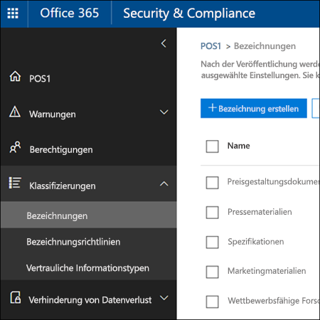

# <a name="overview-of-labels"></a>Übersicht über Bezeichnungen

In Ihrer Organisation verwenden Sie wahrscheinlich verschiedene Arten von Inhalten, für die unterschiedliche Aktionen ausgeführt werden müssen, um branchenspezifische Vorschriften und interne Richtlinien einzuhalten. Dies kann zum Beispiel die folgenden Inhalte umfassen:
  
- Steuerformulare, die für einen bestimmten Zeitraum **aufbewahrt** werden müssen. 
    
- Pressematerialien, die nach dem Erreichen eines bestimmten Alters **dauerhaft gelöscht** werden müssen. 
    
- Im Wettbewerb stehende Forschungen, die sowohl **aufbewahrt** als auch anschließend **dauerhaft gelöscht** werden müssen. 
    
- Arbeitsvisa, die **als Datensatz gekennzeichnet** werden müssen, damit sie nicht bearbeitet oder gelöscht werden. 
    
In all diesen Fällen können Bezeichnungen in Office 365 Ihnen dabei helfen, die richtigen Maßnahmen für die entsprechenden Inhalte zu treffen. Mit Bezeichnungen können Sie Daten organisationsweit für Governance klassifizieren und Aufbewahrungsregeln basierend auf dieser Klassifizierung durchsetzen.
  
Bezeichnungen bieten Ihnen die folgenden Möglichkeiten:
  
- **Sie können Personen in Ihrer Organisation ermöglichen, eine Bezeichnung manuell** auf einen Inhalt in Outlook im Web, Outlook 2010 und höher, OneDrive, SharePoint und Office 365-Gruppen anzuwenden. Benutzer wissen häufig am besten, mit welcher Art von Inhalt sie arbeiten. Sie können den Inhalt somit klassifizieren und die entsprechende Richtlinie anwenden lassen. 
    
- **Sie können Bezeichnungen automatisch** auf Inhalt anwenden, wenn er bestimmten Bedingungen entspricht: 
    
  - Der Inhalt enthält bestimmte vertrauliche Informationen.
    
  - Der Inhalt enthält bestimmte Stichwörter, die einer von Ihnen erstellten Abfrage entsprechen.
    
    Die Möglichkeit, Bezeichnungen automatisch auf Inhalte anzuwenden, ist aus den folgenden Gründen wichtig:
    
  - Sie müssen die Benutzer nicht schulen, damit sie alle Ihre Klassifizierungen kennen.
    
  - Sie müssen sich nicht darauf verlassen, dass die Benutzer alle Inhalte richtig klassifizieren.
    
  - Benutzer müssen nicht mehr über Governance-Richtlinien Bescheid wissen, sondern können sich stattdessen auf ihre Arbeit konzentrieren.
    
    Beachten Sie, dass für automatisch angewendete Bezeichnungen ein Office 365 Enterprise E5-Abonnement erforderlich ist.
    
- **Wenden Sie eine Standardbezeichnung auf eine Dokumentbibliothek** in SharePoint- und Office 365-Gruppenwebsites an, sodass alle Dokumente in dieser Bibliothek mit der Standardbezeichnung versehen werden. 
    
- **Implementieren Sie die Datensatzverwaltung im gesamten Office 365**, darunter E-Mails und Dokumente. Sie können eine Bezeichnung verwenden, um Inhalt als Datensatz zu klassifizieren. In diesem Fall kann die Bezeichnung nicht geändert oder entfernt werden, und der Inhalt kann nicht bearbeitet oder gelöscht werden. 
    
Sie erstellen und verwalten Bezeichnungen auf der Seite **Bezeichnungen** im Office 365 Security &amp; Compliance Center. 
  

 
## <a name="how-labels-work-with-label-policies"></a>Funktionsweise von Bezeichnungen bei Bezeichnungsrichtlinien

Das Bereitstellen von Bezeichnungen für Personen in Ihrer Organisation, damit sie Inhalte klassifizieren können, ist ein zweistufiger Vorgang: Zuerst erstellen Sie die Bezeichnungen, und dann veröffentlichen Sie die Bezeichnungen an den von Ihnen ausgewählten Speicherorten. Wenn Sie Bezeichnungen veröffentlichen, wird eine Bezeichnungsrichtlinie erstellt.
  

  
Bezeichnungen sind unabhängige, wiederverwendbare Bausteine, die in einer Bezeichnungsrichtlinie enthalten sind und an verschiedenen Orten veröffentlicht werden. Bezeichnungen können in vielen Richtlinien wiederverwendet werden. Der Hauptzweck der Bezeichnungsrichtlinie ist es, eine Reihe von Bezeichnungen zu gruppieren und die Speicherorte anzugeben, an denen die Bezeichnungen verfügbar sein sollen.
  

  
1. Wenn Sie Bezeichnungen veröffentlichen, sind sie in einer Bezeichnungsrichtlinie enthalten. Eine einzelne Bezeichnung kann in vielen Richtlinien enthalten sein.
    
2. Bezeichnungsrichtlinien geben die Speicherorte zum Veröffentlichen der Bezeichnungen an.
    
## <a name="only-one-label-at-a-time"></a>Jeweils nur eine Bezeichnung

Es ist wichtig zu wissen, dass ein Inhalt wie eine E-Mail-Nachricht oder ein Dokument jeweils nur über eine Bezeichnung verfügen kann:
  
- Bezeichnungen, die von den Endbenutzern manuell zugewiesen wurde, können entfernt oder geändert werden.
    
- Wenn eine Bezeichnung einem Inhalt automatisch zugewiesen wurde, kann diese automatisch zugewiesene Bezeichnung durch eine vom Endbenutzer manuell zugewiesene Bezeichnung ersetzt werden.
    
- Wenn einem Inhalt eine Bezeichnung manuell von einem Endbenutzer zugewiesen wurde, kann diese manuell zugewiesene Bezeichnung nicht durch eine automatisch zugewiesene Bezeichnung ersetzt werden.
    
- Wenn es mehrere Regeln gibt, durch die eine Bezeichnung automatisch zugewiesen wird, und ein Inhalt die Bedingungen verschiedener Regeln erfüllt, wird die Bezeichnung für die älteste Regel angewendet.
    
Manuelle Bezeichnungen werden explizit zugewiesen, automatische Bezeichnungen hingegen implizit. Eine explizite Bezeichnung hat Vorrang vor einer impliziten Bezeichnung. Weitere Informationen finden Sie weiter unten im Abschnitt [Die Grundsätze der Aufbewahrung, oder was hat Vorrang?](labels.md#principles).
  
## <a name="how-long-it-takes-for-labels-to-take-effect"></a>Wie lange es dauert, bis Bezeichnungen wirksam werden

Wenn Sie Bezeichnungen veröffentlichen oder automatisch anwenden, werden sie nicht sofort wirksam:
  
1. Zuerst einmal muss die Bezeichnungsrichtlinie über das Security &amp; Compliance Center mit den Speicherorten der Richtlinie synchronisiert werden.
    
2. Anschließend benötigt der Speicherort möglicherweise etwas Zeit, um den Endbenutzern die manuellen Bezeichnungen bereitzustellen oder die Bezeichnungen automatisch auf den Inhalt anzuwenden. Wie lange dies dauert, hängt vom Speicherort der Art der Bezeichnung ab.
    
### <a name="manual-labels"></a>Manuelle Bezeichnungen

Wenn Sie Bezeichnungen auf SharePoint oder OneDrive veröffentlichen, kann es bis zu einem Tag dauern, bevor diese Bezeichnungen den Endbenutzer angezeigt werden. Darüber hinaus kann es, wenn Sie Bezeichnungen auf Exchange veröffentlichen, bis zu sieben Tage dauern, bevor sie den Endbenutzern zur Verfügung stehen. Außerdem muss das Postfach mindestens 10 MB Daten enthalten.
  

  
### <a name="auto-apply-labels"></a>Automatisches Anwenden von Bezeichnungen

Wenn Sie Bezeichnungen automatisch auf Inhalte anwenden, die bestimmte Bedingungen erfüllen, kann es bis zu sieben Tage dauern, bevor die Bezeichnungen auf alle Inhalte angewendet werden, die diesen Kriterien entsprechen.
  

  
### <a name="how-to-check-on-the-status-of-exchange-labels"></a>So prüfen Sie den Status von Exchange-Bezeichnungen

In Exchange Online werden Bezeichnungen Endbenutzern anhand eines Prozesses bereitgestellt, die alle sieben Tage ausgeführt wird. Mit PowerShell können Sie sehen, wann dieser Prozess zuletzt ausgeführt wurde, und so ermitteln, wann er erneut ausgeführt wird.
  
1. [Stellen Sie eine Verbindung mit Exchange Online PowerShell her](https://go.microsoft.com/fwlink/?linkid=799773).
    
2. Führen Sie die folgenden Befehle aus:
    
  ```
  $logProps = Export-MailboxDiagnosticLogs <user> -ExtendedProperties
  ```

  ```
  $xmlprops = [xml]($logProps.MailboxLog)
  ```

  ```
  $xmlprops.Properties.MailboxTable.Property | ? {$_.Name -like "ELC*"}
  ```

    In den Ergebnissen zeigt die Eigenschaft `ELCLastSuccessTimeStamp` (UTC) an, wann das System Ihr Postfach das letzte Mal verarbeitet hat. Wenn dies nicht mehr geschehen ist, seit Sie die Richtlinie erstellt haben, werden die Bezeichnungen nicht angezeigt. Um die Verarbeitung zu erzwingen, führen Sie `Start-ManagedFolderAssistant -Identity <user>` aus.
    
    Wenn die Bezeichnungen nicht in Outlook im Web angezeigt werden und Sie denken, dass sie angezeigt werden sollten, müssen Sie den Cache des Browsers leeren (STRG + F5).
    
## <a name="label-policies-and-locations"></a>Bezeichnungsrichtlinien und Speicherorte

Verschiedene Arten von Bezeichnungen können an verschiedenen Speicherorten veröffentlicht werden, je nach Funktion der Bezeichnung.
  
|**Die Beschriftung wird …**|**Dann kann die Bezeichnungsrichtlinie angewendet werden auf ...**|
|:-----|:-----|
|für Endbenutzer veröffentlicht  <br/> |Gruppen in Exchange, SharePoint, OneDrive, Office 365  <br/> |
|basierend auf Typen vertraulicher Informationen automatisch angewendet  <br/> |Exchange (nur alle Postfächer), SharePoint, OneDrive  <br/> |
|basieren auf einer Abfrage automatisch angewendet  <br/> |Gruppen in Exchange, SharePoint, OneDrive, Office 365  <br/> |
   
Beachten Sie, dass automatische Bezeichnungen in Exchange (für Abfragen und Arten vertraulicher Informationen) nur auf neu gesendeten Nachrichten angewendet werden (Daten bei der Übertragung), und nicht auf alle Elemente, die sich derzeit im Postfach befinden (ruhende Daten). Außerdem werden automatische Bezeichnungen für Arten von vertraulichen Informationen immer auf alle Postfächer angewendet. Es können keine bestimmten Postfächer ausgewählt werden.
  
Beachten Sie, dass öffentliche Ordner in Exchange und Skype Bezeichnungen nicht unterstützen.
  
## <a name="how-labels-enforce-retention"></a>So erzwingen Bezeichnungen die Aufbewahrung

Bezeichnungen können genau die gleichen Aufbewahrungsaktionen erzwingen wie eine Aufbewahrungsrichtlinie. Sie können Bezeichnungen verwenden,um einen komplexen Inhaltsplan (oder Dateiplan) zu implementieren. Weitere Informationen zur Funktionsweise der Aufbewahrung finden Sie unter [Übersicht über Aufbewahrungsrichtlinien](retention-policies.md).
  
Darüber hinaus hat eine Bezeichnung zwei Aufbewahrungsoptionen, die nur für eine Bezeichnung und nicht in einer Aufbewahrungsrichtlinie verfügbar sind. Bezeichnungen bieten Ihnen die folgenden Möglichkeiten:
  
- Auslösen einer Dispositionsprüfung am Ende des Aufbewahrungszeitraums, damit SharePoint- und OneDrive-Dokumente überprüft werden müssen, bevor sie gelöscht werden können. Weitere Informationen finden Sie unter [Übersicht über Dispositionsprüfungen](disposition-reviews.md).
    
- Beginnen des Aufbewahrungszeitraums zu dem Zeitpunkt, an dem der Inhalt mit der Bezeichnung versehen wurde, und nicht ausgehend vom Alter des Inhalts oder dem Zeitpunkt, zu dem er zuletzt geändert wurde.
    

  
## <a name="where-published-labels-can-appear-to-end-users"></a>Wo veröffentlichte Bezeichnungen Endbenutzern verfügbar gemacht werden können

Wenn Endbenutzer Bezeichnungen auf Inhalte anwenden, können Sie die Bezeichnungen an den folgenden Speicherorten veröffentlichen:
  
- Outlook im Web
    
- Outlook 2010 und höher
    
- OneDrive
    
- SharePoint
    
- Office 365-Gruppen (sowohl die Gruppenwebsite als auch das Gruppenpostfach in Outlook im Web)
    
Die folgenden Abschnitte zeigen, wie Bezeichnungen den Endbenutzern in Ihrer Organisation in verschiedenen Apps angezeigt werden.
  
### <a name="outlook-on-the-web"></a>Outlook im Web

Um ein Element in Outlook im Web mit einer Bezeichnung zu versehen: Mit der rechten Maustaste auf das Element klicken \> **Richtlinie zuweisen** \> Bezeichnung auswählen. 
  

  
Nachdem die Bezeichnung zugewiesen wurde, können Sie oben im Element diese Bezeichnung anzeigen und sehen, welche Aktion sie durchführt. Wenn eine E-Mail klassifiziert ist, der ein Aufbewahrungszeitraum zugeordnet wurde, sehen Sie auf einen Blick, wann die E-Mail abläuft.
  

  
Sie können Bezeichnungen auch auf Ordner anwenden. Hierbei gilt Folgendes:
  
- Allen Elementen im Ordner wird automatisch dieselbe Bezeichnung zugewiesen, **mit Ausnahme von** Elementen, denen eine Bezeichnung explizit zugewiesen wurde. Explizit bezeichnete Elemente behalten diese Bezeichnung. Weitere Informationen finden Sie weiter unter im Abschnitt zu den Grundsätzen der Aufbewahrung. 
    
- Wenn Sie die Standardbezeichnung eines Ordners ändern oder entfernen, wird die Bezeichnung ebenfalls für alle Elemente in dem Ordner geändert oder entfernt, **mit Ausnahme von** Elementen, die über explizit zugewiesene Bezeichnungen verfügen. 
    
- Wenn Sie ein Element mit einer Standardbezeichnung von einem Ordner in einen anderen Ordner mit einer anderen Standardbezeichnung verschieben, erhält das Element die neue Standardbezeichnung.
    
- Wenn Sie ein Element mit einer Standardbezeichnung von einem Ordner in einen anderen Ordner ohne Standardbezeichnung verschieben, wird die alte Standardbezeichnung entfernt.
    
### <a name="outlook-2010-and-later"></a>Outlook 2010 und höher

Um ein Element in Outlook im Web mit einer Bezeichnung zu versehen: Mit der rechten Maustaste auf das Element klicken \> auf dem **Menüband** \> **Richtlinie zuweisen** \> Bezeichnung auswählen. 
  

  
Nachdem die Bezeichnung zugewiesen wurde, können Sie oben im Element diese Bezeichnung anzeigen und sehen, welche Aktion sie durchführt. Wenn eine E-Mail klassifiziert ist, der ein Aufbewahrungszeitraum zugeordnet wurde, sehen Sie auf einen Blick, wann die E-Mail abläuft.
  
Sie können Beschriftungen auch auf Ordner anwenden. Dies funktioniert in Outlook 2010 uns höher genauso wie in Outlook im Web – weitere Informationen finden Sie im vorherigen Abschnitt.
  
### <a name="onedrive-and-sharepoint"></a>OneDrive und SharePoint

Um ein Dokument mit einer Bezeichnung zu versehen (einschließlich OneNote-Dateien), wählen Sie in OneDrive oder SharePoint das Element \> in der oberen rechten Ecke aus, wählen Sie **Detailfenster öffnen** \> **Bezeichnung anwenden** \> Bezeichnung auswählen. 
  
Beachten Sie, dass Sie eine Bezeichnung auch auf einen Ordner- oder Dokumentensatz anwenden können. Sie können auch eine Standardbezeichnung für eine Dokumentbibliothek festlegen. Weitere Informationen finden Sie in Abschnitt weiter unten.
  

  
Nachdem eine Bezeichnung auf ein Element angewendet wurde, wird sie im Detailbereich angezeigt, wenn das Element ausgewählt wird.
  

  
Sie können auch eine Ansicht der Bibliothek erstellen, die die Spalte **Bezeichnungen** oder die Spalte **Element ist ein Datensatz** enthält. Auf diese Weise können Sie auf einen Blick alle Bezeichnungen sehen, die Elementen zugewiesen sind, und Sie können sehen, welche welche Elemente Datensätze sind. Beachten Sie jedoch, dass Sie die Ansicht nicht anhand der Spalte **Element ist ein Datensatz** filtern können. 
  

  
### <a name="office-365-groups"></a>Office 365-Gruppen

Wenn Sie Bezeichnungen in einer Office 365-Gruppe veröffentlichen, werden sie sowohl auf der Gruppenwebsite als auch im Gruppenpostfach in Outlook im Web angezeigt. Das Vorgehen zum Zuweisen einer Bezeichnung zu Inhalt ist mit der weiter oben für E-Mails und Dokumente aufgeführten Vorgang identisch.
  
## <a name="applying-a-label-automatically-based-on-conditions"></a>Automatisches Zuweisen einer Bezeichnung basierend auf Kriterien

Eines der leistungsstärksten Features von Bezeichnungen ist die Möglichkeit, sie automatisch auf Inhalte anzuwenden, die bestimmte Kriterien erfüllen. In diesem Fall müssen Personen in Ihrer Organisation die Bezeichnungen nicht selbst anwenden – Office 365 erledigt dies für sie.
  

  
Das automatische Zuweisen von Bezeichnungen ist aus den folgenden Gründen besonders leistungsstark:
  
- Sie müssen die Benutzer nicht schulen, damit sie alle Ihre Klassifizierungen kennen.
    
- Sie müssen sich nicht darauf verlassen, dass die Benutzer alle Inhalte richtig klassifizieren.
    
- Benutzer müssen nicht mehr über Governance-Richtlinien Bescheid wissen, sondern können sich stattdessen auf ihre Arbeit konzentrieren.
    
Sie können Bezeichnungen automatisch auf Inhalte anwenden, wenn dieser folgende Bedingungen erfüllt:
  
- Der Inhalt enthält bestimmte vertrauliche Informationen.
    
- Der Inhalt enthält bestimmte Stichwörter, die einer von Ihnen erstellten Abfrage entsprechen.
    

  
Beachten Sie, dass für automatisch angewendete Bezeichnungen ein Office 365 Enterprise E5-Abonnement erforderlich ist. Es kann bis zu sieben Tage dauern, bevor automatische Bezeichnungen auf alle Inhalte angewendet werden, die die Bedingungen erfüllen, wie oben beschrieben.
  
### <a name="auto-apply-labels-to-content-with-specific-types-of-sensitive-information"></a>Automatisches Anwenden von Bezeichnungen auf Inhalte mit bestimmten Typen von vertraulichen Informationen

Beim Erstellen von automatisch angewendeten Bezeichnungen für vertrauliche Informationen wird dieselbe Liste von Richtlinienvorlagen wie beim Erstellen einer Richtlinie zur Verhinderung von Datenverlust (Data Loss Prevention, DLP) angezeigt. Jede Richtlinienvorlage ist so vorkonfiguriert, dass sie nach bestimmten Arten von vertraulichen Informationen sucht. So sucht die hier dargestellte Vorlage zum Beispiel nach US-ITIN, SSN und Passnummern. Weitere Informationen zu DLP finden Sie unter [Überblick über DLP-Richtlinien](data-loss-prevention-policies.md).
  

  
Nach der Auswahl einer Richtlinienvorlage können Sie alle Arten von vertraulichen Informationen hinzufügen oder entfernen, und Sie können die Instanzenanzahl ändern und die Genauigkeit abgleichen. Im hier gezeigten Beispiel wird eine Bezeichnung nur dann automatisch angewendet, wenn Folgendes zutrifft:
  
- Der Inhalt besteht aus 1 bis 9 Instanzen einer der drei folgenden Typen von vertraulichen Informationen. Sie können den **max**-Wert löschen, sodass er sich in **any** ändert.
    
- Der Typ der vertraulichen Informationen, der erkannt wird, hat eine Übereinstimmungsgenauigkeit (oder Vertrauensstufe) von mindestens 75. Viele Typen vertraulicher Informationen werden mit mehreren Mustern definiert, wobei ein Muster mit einer höheren Übereinstimmungsgenauigkeit mehr Nachweise (z. B. Stichwörter, Datumsangaben oder Adressen) erfordert, während ein Muster mit einer niedrigeren Übereinstimmungsgenauigkeit weniger Nachweise erfordert. Einfach ausgedrückt: Je niedriger die **min**-Übereinstimmungsgenauigkeit, desto einfacher ist es für den Inhalt, die Bedingung zu erfüllen. 
    
    Wenn Sie die Übereinstimmungsgenauigkeit (oder Vertrauensstufe) ändern, sollten Sie eine der Vertrauensstufen verwenden, die in einem Muster für diese Art von vertraulichen Informationen verwendet wird. Dies ist in [Danach suchen die Typen vertraulicher Informationen](what-the-sensitive-information-types-look-for.md) definiert.
    

  
### <a name="auto-apply-labels-to-content-with-keywords-or-searchable-properties"></a>Automatisches Anwenden von Bezeichnungen auf Inhalte mit Stichwörtern oder durchsuchbare Eigenschaften

Sie können automatische Bezeichnungen auf Inhalte anwenden, die bestimmte Kriterien erfüllen. Die derzeit verfügbaren Bedingungen unterstützen das Anwenden einer Bezeichnung auf Inhalte, die bestimmte Wörter, Ausdrücke oder durchsuchbare Eigenschaften enthalten. Sie können Ihre Abfrage mithilfe von Suchoperatoren wie UND, ODER und NICHT verfeinern. 

Weitere Informationen zur Abfragesyntax finden Sie unter:

- [Syntaxreferenz für die Keyword Query Language (KQL)](https://docs.microsoft.com/de-DE/sharepoint/dev/general-development/keyword-query-language-kql-syntax-reference)

Abfragebasierte Bezeichnungen verwenden den Suchindex zum Identifizieren von Inhalten. Weitere Informationen zu gültigen durchsuchbaren Eigenschaften finden Sie unter:

- [Stichwortabfragen und Suchbedingungen für die Inhaltssuche](keyword-queries-and-search-conditions.md)
- [Übersicht über durchforstete und verwaltete Eigenschaften in SharePoint Server](https://docs.microsoft.com/de-DE/SharePoint/technical-reference/crawled-and-managed-properties-overview)
  
Beispiele für Abfragen:

- Exchange
    - Betreff: „Vierteljährliche Finanzdaten“
    - recipients:garthf<!--nolink-->@contoso.com

- SharePoint und OneDrive for Business
    - contenttype:contract
    - site:https<!--nolink-->://contoso.sharepoint.com/sites/teams/procurement AND contenttype:contract
  

  
## <a name="applying-a-default-label-to-all-content-in-a-sharepoint-library-folder-or-document-set"></a>Anwenden einer Standardbezeichnung auf alle Inhalte in einer SharePoint-Bibliothek, einem Ordner oder einer Dokumentenmappe

Sie können es Personen nicht nur ermöglichen, eine Bezeichnung auf einzelne Dokumente anzuwenden, sondern Sie können eine Standardbezeichnung auf eine SharePoint-Bibliothek, einen Ordner oder eine Dokumentenmappe anwenden, sodass alle Dokumente in diesem Speicherort diese Standardbezeichnung erhalten.
  
Bei einer Dokumentenbibliothek erfolgt dies auf der Seite **Bibliothekseinstellungen**. Wenn Sie die Standardbezeichnung auswählen, können Sie auch auswählen, dass sie auf alle vorhandenen Elemente in der Bibliothek angewendet wird. 
  
Wenn Sie zum Beispiel über ein Tag für Marketingmaterial verfügen und wissen, dass eine bestimmte Dokumentenbibliothek nur diese Art von Inhalt enthält, können Sie das Marketingmaterial-Tag als Standard für alle Dokumente in dieser Bibliothek festlegen.
  

  
Wenn Sie eine Standardbezeichnung auf vorhandene Elemente in der Bibliothek, im Ordner oder in der Dokumentenmappe anwenden:
  
- Allen Elementen in der Bibliothek, im Ordner oder in der Dokumentenmappe wird automatisch dieselbe Bezeichnung zugewiesen, **mit Ausnahme von** Elementen, denen eine Bezeichnung explizit zugewiesen wurde. Explizit bezeichnete Elemente behalten diese Bezeichnung. Weitere Informationen finden Sie weiter unter im Abschnitt zu den [Grundsätzen der Aufbewahrung,  oder was hat Vorrang?](labels.md#principles)
    
- Wenn Sie die Standardbezeichnung einer Bibliothek, eines Ordners oder einer Dokumentenmappe ändern oder entfernen, wird die Bezeichnung ebenfalls für alle Elemente in der Bibliothek, im Ordner oder in der Dokumentenmappe geändert oder entfernt, **mit Ausnahme von** Elementen, die über explizit zugewiesene Bezeichnungen verfügen. 
    
- Wenn Sie ein Element mit einer Standardbezeichnung aus einer Bibliothek, einem Ordner oder einer Dokumentenmappe in eine andere Bibliothek, einen Ordner oder eine Dokumentenmappe verschieben, behält das Element die vorhandene Standardbezeichnung auch dann, wenn der neue Speicherort eine andere Standardbezeichnung hat.
    
## <a name="applying-a-label-to-email-by-using-rules"></a>Anwenden einer Bezeichnung auf E-Mails mithilfe von Regeln

In Outlook 2010 oder höher können Sie Regeln zum Anwenden einer Bezeichnung oder Aufbewahrungsrichtlinie erstellen.
  
Sie können zum Beispiel eine Regel erstellen, die eine bestimmte Bezeichnung auf alle Nachrichten anwendet, die an eine oder von einer bestimmten Verteilergruppe gesendet werden.
  
So erstellen Sie eine Regel: Rechtsklick auf ein Element \> **Regeln** \> **Regel erstellen** \> **Erweiterte Optionen** \> **Regel-Assistent** \> **Aufbewahrungsrichtlinie anwenden**.
  

  
## <a name="classifying-content-without-applying-any-actions"></a>Klassifizieren von Inhalten ohne Anwendung von Aktionen

Wenn Sie eine Bezeichnung erstellen, müssen Sie keine Aufbewahrungsaktion oder anderen Aktionen aktivieren, wie unten dargestellt. In diesem Fall können Sie eine Bezeichnung einfach als Textbeschriftung verwenden, ohne Aktionen zu erzwingen.
  
Sie können beispielsweise die Bezeichnung „Später überprüfen“ ohne Aktionen erstellen und diese Bezeichnung dann automatisch auf Inhalte mit vertraulichen Informationen oder auf abgefragte Inhalte anwenden.
  

  
## <a name="using-labels-for-records-management"></a>Verwenden von Bezeichnungen für die Datensatzverwaltung

Im Allgemeinen bedeutet die Datensatzverwaltung Folgendes:
  
- Wichtiger Inhalt wird von Benutzern als Datensatz klassifiziert.
    
- Ein Datensatz kann nicht geändert oder gelöscht werden.
    
- Datensätze werden gelöscht, wenn die festgelegte Lebensdauer endet.
    
Sie können Bezeichnungen verwenden, um eine einheitliche Datensatzverwaltungsstrategie in Office 365 zu implementieren, während andere Funktionen für die Verwaltung von Datensätzen, z. B. das Datenarchiv, nur für SharePoint-Inhalte gelten. Darüber hinaus können Sie auch Aufbewahrungsaktionen für Datensätze erzwingen, damit sie am Ende ihres Lebenszyklus automatisch gelöscht werden.
  
Wenn Sie eine Bezeichnung erstellen, haben Sie die Möglichkeit, die Bezeichnung zum Klassifizieren des Inhalts als Datensatz zu verwenden.
  

  
Wenn ein Element als Datensatz bezeichnet wird, geschehen vier Dinge:
  
- Das Element kann nicht endgültig gelöscht werden.
    
- Das Element kann nicht bearbeitet werden.
    
- Die Bezeichnung kann nicht geändert werden.
    
- Die Bezeichnung kann nicht entfernt werden.
    
### <a name="who-can-classify-content-as-a-record"></a>Wer Inhalt als Datensatz klassifizieren kann

Bei SharePoint-Inhalten kann jeder Benutzer in der Standardgruppe „Mitglieder“ (Berechtigungsstufe „Mitwirken“) eine Datensatzbezeichnung auf Inhalte anwenden. Nur der Adminstrator der Websitesammlung kann diese Bezeichnung entfernen oder ändern, nachdem sie angewendet wurde. Darüber hinaus muss eine Bezeichnung, die Inhalt als Datensatz klassifiziert, manuell angewendet werden. Sie kann nicht automatisch angewendet werden.
  
### <a name="records-and-folders"></a>Datensätze und Ordner

Sie können eine Bezeichnung auf einen Ordner in Exchange, SharePoint oder OneDrive anwenden. Wenn Sie einen Ordner als Datensatz bezeichnen und Sie ein Element in den Ordner verschieben, wird das Element als Datensatz gekennzeichnet. Wenn Sie das Element aus dem Ordner verschieben, bleibt es weiterhin als Datensatz gekennzeichnet.
  
### <a name="records-cant-be-deleted"></a>Datensätze können nicht gelöscht werden

Wenn Sie versuchen, einen Datensatz in Exchange zu löschen, wird das Element in den Ordner „Wiederherstellbare Elemente“ verschoben, entsprechend der Beschreibung in [Funktionsweise einer Aufbewahrungsrichtlinie mit Inhalten am Speicherort](retention-policies.md#how-a-retention-policy-works-with-content-in-place).
  
Wenn Sie versuchen, einen Datensatz in SharePoint zu löschen, wird eine Fehlermeldung angezeigt, dass das Element nicht gelöscht wurde, und das Element verbleibt in der Bibliothek.
  

  
Wenn Sie versuchen, einen Datensatz in OneDrive zu löschen, wird das Element in das permanentes Dokumentarchiv verschoben, entsprechend der Beschreibung in [Funktionsweise einer Aufbewahrungsrichtlinie mit Inhalten am Speicherort](retention-policies.md#how-a-retention-policy-works-with-content-in-place).
  
## <a name="using-a-label-as-a-condition-in-a-dlp-policy"></a>Verwenden einer Bezeichnung als Bedingung in einer DLP-Richtlinie

Eine Bezeichnung kann **Aufbewahrungsaktionen** für Inhalte erzwingen. Darüber hinaus können Sie eine Bezeichnung als Bedingung in einer Richtlinie zur Verhinderung von Datenverlust (Data Loss Prevention, DLP) verwenden. Dies bedeutet, dass eine DLP-Richtlinie **Schutzaktionen** für Inhalte, die eine bestimmte Bezeichnung haben, erzwingen kann, wie zum Beispiel das Einschränken des Zugriffs. 
  
Weitere Informationen finden Sie unter [Verwenden einer Bezeichnung als Bedingung in einer DLP-Richtlinie](data-loss-prevention-policies.md#using-a-label-as-a-condition-in-a-dlp-policy)
  
## <a name="using-the-label-activity-explorer-and-the-data-governance-reports"></a>Verwenden des Bezeichnungsaktivitäten-Explorers und von Data Governance-Berichten

Wenn Sie Bezeichnungen veröffentlicht oder automatisch angewendet haben, sollten Sie überprüfen, ob sie wie gewünscht auf Inhalte angewendet werden. Zum Überwachen der Bezeichnungen können Sie den
  
- **Bezeichnungsaktivitäten-Explorer** verwenden. Mit dem Explorer (siehe unten) können Sie schnell die Bezeichnungsaktivität für alle Inhalte in SharePoint und OneDrive for Business während der letzten 30 Tage durchsuchen und sie anzeigen. Weitere Informationen finden Sie unter [Anzeigen der Bezeichnungsaktivität für Dokumente](view-label-activity-for-documents.md).
    
- **Berichte zur Data Governance**. Mit diesen Berichten können Sie schnell die Trends bei Bezeichnungen und die Aktivitäten für alle Inhalte in Exchange, SharePoint und OneDrive for Business während der letzten 90 Tage anzeigen. Weitere Informationen finden Sie unter [Anzeigen der Berichte zur Data Governance](view-the-data-governance-reports.md).
    

  
## <a name="using-content-search-to-find-all-content-with-a-specific-label-applied-to-it"></a>Verwenden der Inhaltssuche zum Suchen des gesamten Inhalts, dem eine bestimmte Bezeichnung zugewiesen ist

Nachdem Bezeichnungen entweder von Benutzern Inhalten zugewiesen oder automatisch auf Inhalte angewendet wurden, können Sie die Inhaltssuche im Security &amp; Compliance Center verwenden, um alle Inhalte zu suchen, die durch eine bestimmte Bezeichnung klassifiziert wurden.
  

  
Wenn Sie eine Inhaltssuche erstellen, wählen Sie die **Compliancetag**-Bedingung, und geben Sie dann den gesamten Bezeichnungsnamen oder einen Teil davon ein, und verwenden Sie ein Platzhalterzeichen. Weitere Informationen finden Sie unter [Stichwortabfragen und Suchbedingungen für die Inhaltssuche](keyword-queries-and-search-conditions.md).
  

  
## <a name="the-principles-of-retention-or-what-takes-precedence"></a>Die Grundsätze der Aufbewahrung, oder was hat Vorrang?

Es ist möglich oder sogar wahrscheinlich, dass auf Inhalte mehrere Aufbewahrungsrichtlinien angewendet werden, die jeweils mit einer anderen Aktion (aufbewahren, löschen oder beides) und einem anderen Aufbewahrungszeitraum verbunden sind. Was hat Vorrang? Ganz allgemein sei gesagt, dass Sie sich sicher sein können, dass Inhalte, die aufgrund einer Richtlinie aufbewahrt werden müssen, nicht von einer anderen Richtlinie dauerhaft gelöscht werden können.
  

  
Um zu verstehen, wie verschiedene Bezeichnungen mit Aufbewahrungsrichtlinien auf Inhalte angewendet werden, sollten Sie diese Grundsätze der Aufbewahrung beachten:
  
1. **Aufbewahrung hat Vorrang vor Löschung. ** Angenommen, eine Aufbewahrungsrichtlinie gibt vor, dass Exchange-E-Mails nach drei Jahren gelöscht werden sollen, eine andere Aufbewahrungsrichtlinie jedoch besagt, dass Exchange-E-Mails fünf Jahre lang aufbewahrt und dann gelöscht werden müssen. Alle Inhalte, die drei Jahre alt sind, werden gelöscht und aus der Ansicht der Benutzer ausgeblendet, aber immer noch im Ordner "Wiederherstellbare Elemente" aufbewahrt, bis sie fünf Jahre alt sind und endgültig gelöscht werden. 
    
2. **Der längste Aufbewahrungszeitraum hat Vorrang. ** Wenn Inhalte mehreren Aufbewahrungsrichtlinien, nach denen Inhalte aufbewahrt werden, unterliegen, werden sie bis zum Ende des längsten Aufbewahrungszeitraums aufbewahrt. 
    
3. **Explizite Einbindung hat Vorrang vor impliziter Einbindung.** Dies bedeutet: 
    
    1. Wenn eine Kennzeichnung mit Aufbewahrungseinstellungen von einem Benutzer manuell einem Element zugewiesen wird, z. B. einem Exchange-E-Mail- oder OneDrive-Dokument, hat diese Kennzeichnung Vorrang sowohl vor einer Richtlinie, die auf Website- oder Postfachebene zugewiesen ist, als auch vor einer Standardkennzeichnung, die von der Dokumentbibliothek zugewiesen wurde. Wenn z. B. die explizite Kennzeichnung eine Aufbewahrung über zehn Jahr vorgibt, aber die der Website zugewiesene Richtlinie besagt, dass nur fünf Jahre aufbewahrt werden soll, hat die Kennzeichnung Vorrang. Beachten Sie, dass automatisch angewendete Kennzeichnungen als implizit und nicht als explizit angesehen werden, da sie von Office 365 automatisch angewendet werden.
    
    2. Wenn eine Aufbewahrungsrichtlinie einen bestimmten Speicherort wie das Postfach oder OneDrive for Business-Konto eines bestimmten Benutzers umfasst, hat diese Richtlinie Vorrang vor einer anderen Aufbewahrungsrichtlinie, die für alle Postfächer oder OneDrive for Business-Konten von Benutzern gilt, aber nicht das Postfach dieses Benutzers speziell einschließt.
    
4. **Der kürzeste Löschzeitraum hat Vorrang. ** Ebenso gilt, dass wenn Inhalte mehreren Aufbewahrungsrichtlinien zur Löschung (ohne Aufbewahrung) unterliegen, sie am Ende des kürzesten Aufbewahrungszeitraums gelöscht werden. 
    
Beachten Sie: Wenn die Regeln, die von allen Richtlinien oder Kennzeichnungen angewendet werden, auf einer Ebene identisch sind, bewegt sich der Fluss nach unten zur nächsten Ebene, wo entschieden wird, welche Regel Vorrang hat.
  
Schließlich kann keine Aufbewahrungsrichtlinie oder Kennzeichnung einen Inhalt dauerhaft löschen, der für eDiscovery gesperrt ist. Wenn die Sperre aufgehoben wird, kommt der Inhalt wieder für den oben beschriebenen Bereinigungsprozess infrage.
  
## <a name="use-labels-instead-of-these-features"></a>Verwenden von Bezeichnungen statt dieser Features

Bezeichnungen können ganz einfach der gesamten Organisation und ihre Inhalte in Office 365 bereitgestellt werden, einschließlich Exchange, SharePoint, OneDrive und Office 365-Gruppen. Wenn Sie Inhalte klassifizieren oder Datensätze in Office 365 verwalten müssen, empfehlen wir, dass Sie Bezeichnungen verwenden.
  
Es gibt mehrere andere Features, die zuvor zum Klassifizieren von Inhalten oder Verwalten von Einträgen in Office 365 verwendet wurden. Diese sind nachfolgend aufgeführt. Diese Features funktionieren weiterhin gleichberechtigt mit Bezeichnungen im Security &amp; Compliance Center. Beachten Sie, dass es vorkommen kann, dass sich die Implementierung von Bezeichnungen von früheren Features unterscheidet, und die Weiterentwicklung von Bezeichnungen treibt die Entwicklung der künftigen Datensatzverwaltung in Office 365 voran. Daher empfehlen wir Ihnen, künftig für die Data Governance Bezeichnungen anstelle dieser Features zu verwenden.
  
### <a name="exchange-online"></a>Exchange Online

- [Aufbewahrungstags und Aufbewahrungsrichtlinien](https://go.microsoft.com/fwlink/?linkid=846125), auch bekannt als [Messaging-Datensatzverwaltung](https://go.microsoft.com/fwlink/?linkid=846126) (Nur Löschen) 
    
### <a name="sharepoint-online-and-onedrive-for-business"></a>SharePoint Online und OneDrive for Business

- [Konfiguration von Datensatzverwaltung in situ](https://support.office.com/article/7707a878-780c-4be6-9cb0-9718ecde050a) (Aufbewahrung) 
    
- [Einführung in das Datenarchiv](https://support.office.com/article/bae6ca5a-7b19-40e0-b433-e3613a747c2c) (Aufbewahrung) 
    
- [Informationsverwaltungsrichtlinien](intro-to-info-mgmt-policies.md) (Nur Löschen) 
    
## <a name="permissions"></a>Berechtigungen

Mitglieder Ihres Compliance-Teams, die Bezeichnungen erstellen sollen, benötigen Berechtigungen für das Security &amp; Compliance Center. Standardmäßig hat Ihr Mandantenadministrator Zugriff auf diesen Speicherort und kann anderen Personen den Zugriff auf das Security &amp; Compliance Center gewähren, ohne ihnen alle Berechtigungen eines Mandantenadministrators zu geben. Zu diesem Zweck wird empfohlen, dass Sie zur Seite **Berechtigungen** des Security &amp; Compliance Center gehen, die Rollengruppe **Compliance-Administrator** bearbeiten und dieser Rollengruppe Mitglieder hinzufügen. 
  
Weitere Informationen finden Sie unter [Freigeben des Benutzerzugriffs auf das Office 365 Security &amp; Compliance Center](grant-access-to-the-security-and-compliance-center.md).
  
Diese Berechtigungen sind nur erforderlich, um Bezeichnungen zu erstellen und anzuwenden. Für die Durchsetzung von Richtlinien ist kein Zugriff auf Inhalte erforderlich.
  
## <a name="find-the-powershell-cmdlets-for-labels"></a>Suchen der PowerShell-Cmdlets für Bezeichnungen

Um die Bezeichnungs-Cmdlets verwenden zu können, müssen Sie wie folgt vorgehen:
  
1. [Eine Verbindung zum Office 365 Security &amp; Compliance Center mithilfe von Remote-PowerShell herstellen](http://go.microsoft.com/fwlink/?LinkID=799771&amp;clcid=0x409)
    
2. Diese [Office 365 Security &amp; Compliance Center-Cmdlets nutzen](http://go.microsoft.com/fwlink/?LinkID=799772&amp;clcid=0x409)
    
## <a name="more-information"></a>Weitere Informationen

- [Übersicht über Aufbewahrungsrichtlinien](retention-policies.md)
    

