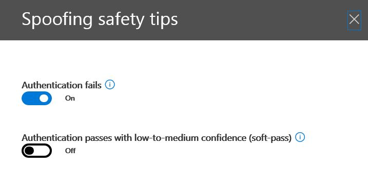

# Erfahren Sie mehr über Spoofing intelligence

Verwenden Sie in das Wertpapier Spoofing Intelligence &amp; Compliance Center auf der **Einstellungsseite Anti-Spam** an alle Absender überprüfen, die entweder Domänen, die Teil Ihrer Organisation sind spoofing sind, oder spoofing externe Domänen. Spoofing Intelligence steht als Teil von Office 365 Enterprise E5 oder separat als Teil der erweiterte Schutz. 
  
## Welche Arten von e-Mail-spoofing können überprüfen und die sollte ich Schutz vor mit Spoofing Intelligence?

Für Domänen können Sie eigene, Sie Absender überprüfen, die sind spoofing Ihrer Domäne, und klicken Sie dann auswählen, können den Absender, um fortzufahren, oder auf den Absender blockieren. Für externe Domänen können Sie die Domäne des Absenders in Kombination mit der sendenden-Infrastruktur zwar keine einzelne sendenden e-Mail-Adresse zulassen.
  
Wenn ein Absender eine e-Mail-Adresse Spoofing, werden sie zum Senden von Nachrichten im Auftrag eine oder mehrere Benutzerkonten innerhalb Ihrer Organisation Domänen oder eine externe Domäne für Ihre Organisation werden angezeigt. Erstaunlicherweise sind einige Gründe seriösen Spoofing. In diesen Fällen würde nicht Sie beispielsweise den Absender aus spoofing Ihrer Domäne blockieren:
  
- Sie müssen die Drittanbieter-Absender, die Ihre Domäne verwenden, Senden von Massen-e-Mail an Ihre eigenen Mitarbeiter für Unternehmen Umfragen.
    
- Sie haben ein externes Unternehmen zu generieren und versenden Werbung oder Produkt-Updates in Ihrem Auftrag eingestellt.
    
- Wenn ein Assistent, der zum Senden von e-Mails für eine andere Person in Ihrer Organisation regelmäßig benötigt.
    
- Eine Anwendung, die zum eigene Organisation Spoofing, um interne Benachrichtigungen senden per e-Mail konfiguriert ist.
    
Externe Domänen häufig gefälschten e-Mail senden, und viele dieser Gründe legitime sind. Hier werden beispielsweise manchmal legitime beim Senden von externer Absendern gefälschten e-Mails:
  
- Der Absender befindet sich in einer Diskussion Adressenliste und der Verteilerliste ist die e-Mails von den ursprünglichen Absender an alle Teilnehmer der Mailingliste Weiterleitung.
    
- Ein externes Unternehmen sendet e-Mails im Auftrag eines anderen Unternehmens (beispielsweise eine automatisierte Bericht oder einem Unternehmen Software-as-a-Service).
    
Sie benötigen eine Möglichkeit, um sicherzustellen, dass die legitime Spoofers gesendeten e-Mail-Nachrichten in Spam-Filter in Office 365 oder externe e-Mail-Systemen abgefangen abrufen nicht. Normalerweise wird diese e-Mail-Nachrichten mit Office 365 als Spam behandelt. Als ein Office 365-Administrator, Sie haben die Möglichkeit, dies verhindern, indem Sie Spoofing Filter in das Wertpapier einrichten &amp; Compliance Center. Wenn Sie die Domäne besitzen, können Sie SPF, DKIM und DMARC diesen Absendern zu konfigurieren.
  
Andererseits, müssen böswilligen Spoofers, diese Absender, die Ihrer Domäne oder externe Domänen, Senden von e-Mails von Spam oder Phishing, spoofing werden blockiert werden. Spoofing ist auch eine allgemeine Möglichkeit für Phishing Benutzeranmeldeinformationen abgerufen. Office 365 verfügt über integrierte Spoofing Schutz, die Ihre Organisation diese böswilligen e-Mails von Absendern abschirmen unterstützen. Spoofing-Schutz für Ihre Organisation Domänen ist immer für alle Office 365-Kunden und externen Domäne Spoofing Schutz ist standardmäßig für Kunden erweiterte Threat Protection. Wenn Sie um diesen Schutz weiter zu erhöhen, teilen Sie uns welche Absender Ihrer Organisation Domänen Spoofing und Senden von e-Mail in Ihrem Auftrag autorisiert sind, und wenn alle externen Domänen Spoofing zulässig sind. Jede von einem Absender, den Sie nicht autorisierte gesendete e-Mail wird als spam oder spoofing von Office 365 behandelt. Achten Sie auf die Absender Ihrer Domäne spoofing und helfen Sie uns, Spoofing Intelligence zu verbessern, indem Sie die Sicherheit &amp; Compliance Center.
  
## Verwalten von Spoofing Intelligence in das Wertpapier &amp; Compliance Center

Die Spoofing Intelligence Richtlinie, die Sie eingerichtet wird immer von Office 365 erzwungen. Kann nicht deaktiviert, aber Sie können auswählen, wie viel Sie aktiv sie verwalten möchten.
  
Sie können die Absender werden spoofing Ihrer Domäne oder externe Domänen, und dann entscheiden, ob für jeden Absender gestattet sein soll, mithilfe der Sicherheits dazu überprüfen &amp; Compliance Center. Für jedes gefälschten Benutzerkonto, das ein Absender aus Ihrer Domäne oder eine externe Domäne Spoofing, können Sie die Informationen in der folgenden Tabelle anzeigen.
  
|**Parameter**|**Beschreibung**|
|:-----|:-----|
|Absender    |Abkürzung für den Absender true. Dies ist in der Regel die Domäne aus der Spoofing e-Mail stammt. Office 365 bestimmt die Domäne des Zeigers (PTR) DNS-Eintrag der sendenden IP-Adresse, die Ihre Organisation spoofing ist. Wenn keine Domäne gefunden wird, zeigt der Bericht stattdessen die IP-Adresse des Absenders.    |
|Benutzer mit Spoofing stammen    |Das Benutzerkonto, das vom Absender manipuliert wird ist.    Registerkarte nur **intern** . Dieses Feld enthält eine einzelne e-Mail-Adresse, oder wenn der Absender mehrere Benutzerkonten spoofing ist, enthält **mehr als ein**.  **Externe** Registerkarte. Externe Domänen nur sendende Domäne enthalten und enthalten keine vollständige e-Mail-Adresse.  > [!TIP]> **Für erweiterte-Admins.** Der gefälschte Benutzer ist von-Adresse (5322.From) handelt es sich auch die Adresse als von-Adresse von der e-Mail-Client angezeigt. Dies ist die Adresse header.from bezeichnet. Diese Gültigkeit dieser Adresse wird durch SPF nicht überprüft.           |
|Anzahl der Nachrichten    |Die Anzahl der e-Mail-Nachrichten, die vom Absender für Ihr Unternehmen in den letzten 30 Tagen im Namen der identifizierten gefälschten Absender oder Absender gesendet.    |
|Anzahl der Benutzerbeschwerden    |Beschwerden von Benutzern für diese Absender durch Ihre Benutzer in den letzten 30 Tagen abgelegt. Beschwerden sind meist in Form von Junk-e-Übermittlung an Microsoft.    |
|Ergebnis der Authentifizierung    |Dieser Wert ist **übergeben** , wenn der Absender Exchange Online Protection (EOP) Absender Authentifizierung Überprüfungen, wie SPF oder DKIM, **konnte nicht** übergeben, wenn der Absender Fehler bei EOP Absender Authentifizierung Überprüfungen oder **Unbekannte** , wenn das Ergebnis der Kontrollen ist nicht bezeichnet.    |
|Festlegen von Entscheidung    |Zeigt an, ob Office 365-Administrator oder die Spoofing Intelligence Richtlinie bestimmt, ob der Absender den Benutzer Spoofing zulässig ist oder nicht.    |
|Zuletzt gesehen    |Das letzte Datum, an dem eine Nachricht im Auftrag dieses Benutzers mit Spoofing stammen von diesem Absender empfangen wurde.    |
|Spoofing zulässig?    | Zeigt an, ob dieser Absender senden von e-Mails im Auftrag des Benutzers gefälschten zulässig ist oder nicht. Mögliche Werte sind:  **Ja** Alle gefälschte Adressen von diesem Absender spoofing die Spoofing Ihrer Organisation zulässig.    **Nein** Gefälschte Adressen von diesem spoofing Absender wird nicht Ihrer Organisation Spoofing zulässig. In diesem Fall werden Nachrichten von diesem Absender von Office 365 als Spam markiert.  **Einige Benutzer** Wenn ein Absender mehrere Benutzer spoofing ist, einige gefälschten Adressen von diesem Absender kann Ihre Organisation Spoofing, die restlichen wird als Spam gekennzeichnet. Verwenden Sie die Registerkarte **Details** , um bestimmten Adressen finden Sie unter.  |
|Spoofing-Typ    |Dieser Wert ist **intern** aus, wenn die Domäne Ihrer Organisation bereitgestellten Domänen ist, andernfalls ist des Werts der **externen**.    |
   
 **Zum Verwalten von Absender, die mithilfe der Sicherheits Ihrer Domäne spoofing sind &amp; Compliance Center**
  
1. Wechseln Sie zu der [Sicherheit &amp; Compliance Center](https://protection.office.com).
    
2. Melden Sie sich mit Ihrem Konto arbeiten oder Schule Office 365 an. Ihr Konto muss in Ihrer Organisation Office 365-Administratoranmeldeinformationen verfügen.
    
3. In das Wertpapier &amp; Compliance Center, erweitern Sie **Threat Management** \> **Richtlinie** \> **Anti-Spam**.
  

  
4. Klicken Sie auf der Seite **Anti-Spam-Einstellungen** im rechten Bereich Wählen Sie die **benutzerdefinierte** Registerkarte, und klicken Sie dann einen Bildlauf nach unten, und erweitern Sie **Spoofing Intelligence Richtlinie**. 
  

  
5. Um die Liste der Absender spoofing Ihrer Domäne anzuzeigen, wählen Sie **neue Absender überprüfen** , und wählen Sie die ** Your Domänen ** Registerkarte. 
    
    Wenn Sie bereits Absender überprüft haben, und einige Ihrer vorherigen Auswahl ändern möchten, können Sie **meinen Absender ich bereits überprüft** stattdessen auswählen. In beiden Fällen wird im folgenden Fenster. 
  

  
Jeder Benutzer mit Spoofing stammen ist in einer separaten Zeile angezeigt, sodass Sie, ob auswählen können Sie zulassen oder Blockieren des Absenders aus jeden Benutzer einzeln spoofing.
  
Um ein Absender der Zulassungsliste für einen Benutzer hinzuzufügen, wählen Sie **Ja** aus der **zulässige Spoofing** -Spalte. Um ein Absender der Blockierliste für einen Benutzer hinzuzufügen, wählen Sie **Nein**aus.
  
Zum Festlegen der Richtlinie für Domänen Sie nicht besitzen, Ändern wählen Sie die Registerkarte **Externe Domänen** aller Absender auf **Ja in der Spalte **mit einer gefälschten zulässig** , um diesem Absender nicht authentifizierte Senden von e-Mails in Ihrer Organisation zu ermöglichen.** Alternativ, wenn Sie, dass Office 365 einen Fehler annehmen in der Absender senden von e-Mails mit Spoofing stammen zulassen vorgenommen hat, ändern Sie die **zulässige Spoofing** Spalte auf **Nein**. 
  

  
6. Wählen Sie **Speichern** , um alle Änderungen zu speichern. 
    
## Konfigurieren der Richtlinie für Anti-spoofing

Neben dem zulassen oder Blockieren von einem bestimmten Absender gefälschten e-Mails in Ihrer Organisation zu senden, können Sie auch konfigurieren wie strikt der gefiltert werden sollen, die durchzuführende Aktion beim eine spoofing Nachricht gefunden wird und ob Sie Tipps für die Sicherheit zu aktivieren Anti-spoofing.
  
Anti-spoofing Schutz gilt für e-Mail von Absendern von Domänen, die sich außerhalb Ihrer Office 365-Organisation befinden. Sie können die Richtlinie auf Empfänger anzuwenden, deren Postfächer für Office 365 Enterprise E5 oder erweiterte Threat Protection lizenziert sind. Sie können die Richtlinie Anti-spoofing zusammen mit der ATP Anti-Phishing-Einstellungen verwalten. Weitere Informationen zu ATP Anti-Phishing-Einstellungen finden Sie unter [Einrichten der Office 365 Anti-Phishing-Richtlinien](https://support.office.com/article/set-up-office-365-atp-anti-phishing-policies-5a6f2d7f-d998-4f31-b4f5-f7cbf6f38578?ui=en-US&amp;rs=en-US&amp;ad=US#phishpolicyoptions).
  
Office 365 enthält standardmäßigen Anti-spoofing Schutz, der immer ausgeführt wird. Dieses Standardschutz ist nicht sichtbar, in das Wertpapier &amp; Compliance Center oder über Windows PowerShell-Cmdlets abrufbar. Den standardmäßigen Anti-spoofing-Schutz können nicht geändert werden. Stattdessen können Sie konfigurieren, wie streng Office 365 in den einzelnen Richtlinien Anti-Phishing-Schutz Anti-spoofing erzwingt, die Sie erstellen. 
  
Obwohl die Richtlinie Anti-spoofing unter der ATP Anti-Phishing-Richtlinie in das Wertpapier angezeigt wird &amp; Compliance Center, erbt es nicht Standardverhaltens aus der vorhandenen Phishing unter der Anti-Spam-Konfiguration festlegen. Wenn Sie die Einstellungen unter **Anti-Spam** haben \> **Phishing** , die Sie für Anti-spoofing replizieren möchten, müssen eine Anti-Phishing-Richtlinie erstellen und dann ändern Sie den Abschnitt Spoofing der Anti-Phishing-Richtlinie entsprechend Einstelllungen Spoofing als Im folgenden Abschnitt, akzeptieren die Standardeinstellungen, die im Hintergrund ausgeführt, sondern in beschrieben. 
  
 **So konfigurieren Sie mithilfe der Sicherheits innerhalb einer Richtlinie Anti-Phishing-Schutz Anti-spoofing &amp; Compliance Center**
  
1. Wechseln Sie zu der [Sicherheit &amp; Compliance Center](https://protection.office.com).
    
2. Melden Sie sich mit Ihrem Konto arbeiten oder Schule Office 365 an. Ihr Konto muss in Ihrer Organisation Office 365-Administratoranmeldeinformationen verfügen.
    
3. In das Wertpapier &amp; Compliance Center, erweitern Sie **Threat Management** \> **Richtlinie** \> **ATP Anti-Phishing**. 
    
4. Wählen Sie auf der Seite **Anti-Phishing** im rechten Bereich die Anti-Phishing-Richtlinie, den, die Sie konfigurieren möchten. 
    
5. Wählen Sie **Bearbeiten**aus, auf der Seite, die in der Zeile **Spoofing** angezeigt wird. 
    
6. Auf die **Spoofing Schwellenwerte** gesendete Seite, wenn Sie die **Standardeinstellung**, wählen Sie dann alle Nachrichten, die implizit oder explizit Authentifizierung übergeben zugestellt werden, d. h., für die normale-e-Mail-Filterung. Wenn Sie **Strict**auswählen, klicken Sie dann Nachrichten, die Authentifizierung mit mittlere Confidence implizit übergeben auch eine zusammengesetzte "soft Pass"-Authentifizierung genannt, ignoriert trotzdem und als e-Mail-Nachrichten spoofing markiert. Die Einstellung Strict ist aggressive und falsch positive Ergebnisse generiert. Stellen Sie Ihrer Wahl, und wählen Sie dann **Aktionen**. 
  

  
7. Konfigurieren Sie anschließend die Aktionen an, wenn eine Nachricht als ein Cross-Domain-Spoofing erkannt wird. Das Standardverhalten wird die Nachricht in der Aufgabenliste des Empfängers junk-e-Mail-Ordner verschoben. Eine weitere Möglichkeit ist zum Senden der Nachricht in Quarantäne. Weitere Informationen zum Verwalten von Nachrichten in Quarantäne finden Sie unter [Quarantäne e-Mail-Nachrichten in Office 365](quarantine-email-messages.md).
  

  
8. Wählen Sie, ob zum Aktivieren oder Deaktivieren der Anti-spoofing Safety Tipps. Office 365 empfiehlt aktivieren Tipp Sicherheit **Authentifizierung ein Fehler auftritt** , um Benutzer zu benachrichtigen, wenn sie mit einem Absender interagiert werden, deren Identität nicht überprüft werden konnten. Office 365 empfiehlt auch die Spitze Sicherheit für eine **Authentifizierung Soft-Pass** für kleinere Gruppen von Benutzern, aktivieren, da dieser Tipp Sicherheit viele Warnungen generiert wird, kann sobald der Benutzer aus mehreren Quellen für legitime, aber nicht authentifizierte e-Mail erhält. 
  

  
Stellen Sie Ihrer Wahl, und wählen Sie dann auf **Speichern**. 
    
## Andere Möglichkeiten zum Verwalten von spoofing und Phishing mit Office 365

Werden Sie über spoofing und Phishing-Schutz sorgfältig. Hier können verwandte Arten aktivieren Sie Ihre Domäne spoofing Absender und Hilfe zu verhindern, dass Ihre Organisation beschädigen:
  
- Überprüfen Sie den Exchange Online Protection Spoofing Mail Bericht als Teil Ihrer Routine. Sie können diesen Bericht häufig zum Anzeigen und Verwalten von gefälschten Absender verwenden. Informationen finden Sie unter **Spoofing der e-Mail-Bericht** in der [e-Mail-schutzberichte in Office 365, um Daten über Schadsoftware, Spam und Regel erkannte verwenden](https://technet.microsoft.com/library/dn500744%28v=exchg.150%29.aspx).
    
- Informationen zu erweiterten Office 365-Administratoren:
    
  - Überprüfen der Konfigurations des Sender Policy Framework (SPF). Eine kurze Einführung in SPF und erhalten sie schnell konfiguriert finden Sie unter [Einrichten von SPF in Office 365, um spoofing zu verhindern](https://technet.microsoft.com/library/dn789058%28v=exchg.150%29.aspx). Ausführlichere Informationen zu der Verwendung von Office 365 SPF oder zur Problembehandlung oder nicht standardmäßigen Bereitstellungen wie hybridbereitstellungen beginnen Sie mit [wie Office 365 verwendet Sender Policy Framework (SPF), um spoofing zu verhindern](https://technet.microsoft.com/library/mt712724%28v=exchg.150%29.aspx).
    
  - Überprüfen Sie Ihre Konfiguration DomainKeys Identified Mail (DKIM). Sie sollten DKIM zusätzlich zu SPF und DMARC verwenden, um zu verhindern, Spoofers am Senden von Nachrichten, die sie von Ihrer Domäne stammen aussehen. DKIM können Sie die e-Mail-Nachrichten in der Kopfzeile der Nachricht eine digitale Signatur hinzuzufügen. Informationen finden Sie unter [DKIM verwenden, um von Ihrer Domäne in Office 365 gesendete e-Mails zu überprüfen](https://technet.microsoft.com/library/mt695945%28v=exchg.150%29.aspx).
    
  - Überprüfen Sie Ihre Nachrichtenauthentifizierung, Berichte und Konformität (DMARC) Konfiguration domänenbasierte. Implementieren von DMARC mit SPF und DKIM bietet zusätzlichen Schutz gegen spoofing und Phishing-e-Mail. Fail SPF oder DKIM prüft DMARC hilft Empfang von e-Mail-Systemen feststellen, welche Aktionen mit Nachrichten von Ihrer Domäne gesendete. Informationen finden Sie unter [Verwendung von DMARC zum Überprüfen von e-Mail in Office 365](https://technet.microsoft.com/library/mt734386%28v=exchg.150%29.aspx).
    
  - Verwenden Sie das Cmdlet [Get-PhishFilterPolicy](https://technet.microsoft.com/en-us/library/mt735158%28v=exchg.160%29.aspx) Windows PowerShell zum Sammeln detaillierter Daten zu gefälschten Absender, generieren zulassen und blockierte Kontakte, und Ihnen helfen zu bestimmen, wie generieren umfassendere SPF, DKIM und DMARC DNS-Datensätzen ohne Ihre legitimen e-Mails, jedoch in externen Spam-Filter. Weitere Informationen finden Sie unter [So funktioniert der Antispoofing Schutz in Office 365](https://blogs.msdn.microsoft.com/tzink/2016/02/23/how-antispoofing-protection-works-in-office-365/).
    

