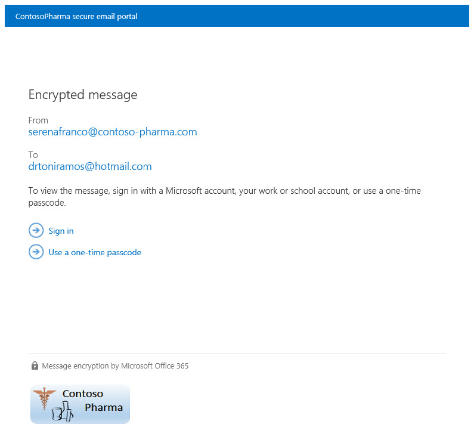

# Legacyinformationen für die Office 365-Nachrichtenverschlüsselung

Wenn Sie Ihre Office 365-Organisation noch nicht in die neuen OM-Funktionen verschoben haben, aber bereits OM bereitgestellt haben, beziehen sich die Informationen in diesem Artikel auf Ihre Organisation. Microsoft empfiehlt, einen Plan für die Umstellung auf die neuen Funktionen von OM zu erstellen, sobald es für Ihre Organisation sinnvoll ist. Anweisungen hierzu finden Sie unter [Einrichten neuer Office 365-Nachrichten Verschlüsselungsfunktionen, die auf Azure Information Protection basieren](set-up-new-message-encryption-capabilities.md). Wenn Sie mehr über die Funktionsweise der neuen Funktionen erfahren möchten, lesen Sie [Office 365-Nachrichtenverschlüsselung](ome.md). Der Rest dieses Artikels bezieht sich auf das Verhalten von OM vor der Freigabe der neuen OM-Funktionen.
  
Mit der Office 365-Nachrichtenverschlüsselung kann Ihre Organisation verschlüsselte e-Mail-Nachrichten zwischen Personen innerhalb und außerhalb Ihrer Organisation senden und empfangen. Die Office 365-Nachrichtenverschlüsselung funktioniert mit Outlook.com, Yahoo, Gmail und anderen e-Mail-Diensten. Die Verschlüsselung von e-Mail-Nachrichten trägt dazu bei, dass nur vorgesehene Empfänger Nachrichteninhalte anzeigen können.
  
Im Folgenden finden Sie einige Beispiele:
  
- Ein Bankmitarbeiter sendet Kreditkartenabrechnungen an Kunden
    
- Ein Vertreter des Versicherungsunternehmens stellt Kunden Richtliniendetails zur Verfügung.
    
- Ein Hypothekenmakler fordert Finanzinformationen eines Kunden für eine Darlehens Anwendung an
    
- Ein Leistungserbringer sendet Informationen zur Gesundheitsfürsorge an Patienten.
    
- Ein Anwalt sendet vertrauliche Informationen an einen Kunden oder einen anderen Anwalt.
    
## FunktionsWeise der Office 365-Nachrichtenverschlüsselung ohne die neuen Funktionen

Office 365 Nachrichtenverschlüsselung ist ein Onlinedienst, der auf der Microsoft Azure Rights Management (Azure RMS) basiert. Mit Azure RMS können Administratoren Nachrichtenfluss Regeln definieren, um die Bedingungen für die Verschlüsselung zu bestimmen. Eine Regel kann beispielsweise die Verschlüsselung aller Nachrichten erfordern, die an einen bestimmten Empfänger adressiert sind.
  
Sehen Sie sich dieses kurze Video an, um zu erfahren, wie Office 365-Nachrichtenverschlüsselung ohne die neuen Funktionen funktioniert.
  
> [!VIDEO https://www.microsoft.com/videoplayer/embed/c55540e7-f7f0-42f5-b254-4b2d2fbb1d63?autoplay=false]
  
Wenn jemand eine e-Mail-Nachricht in Exchange Online sendet, die einer Verschlüsselungs Regel entspricht, wird die Nachricht mit einer HTML-Anlage gesendet. Der Empfänger öffnet die HTML-Anlage und folgt Anweisungen, um die verschlüsselte Nachricht im Office 365-Nachrichten Verschlüsselungs Portal anzuzeigen. Der Empfänger kann die Nachricht anzeigen, indem er sich mit einem Microsoft-Konto oder einer mit Office 365 verknüpften Arbeits-oder Schul Firma oder mit einem einmaligen Code für die Anmeldung anmeldet. Beide Optionen stellen sicher, dass die verschlüsselte Nachricht nur vom vorgesehenen Empfänger angezeigt werden kann. Dieser Vorgang ist für die neuen OM-Funktionen sehr unterschiedlich.
  
Im folgenden Diagramm wird die Weitergabe einer E-Mail-Nachricht durch den Verschlüsselungs- und Entschlüsselungsvorgang zusammengefasst.
  

  
Weitere Informationen finden Sie unter [Service Information for Legacy Office 365 Message Encryption before the Release of the New OM Capabilities](legacy-information-for-message-encryption.md#LegacyServiceInfo).
  
## Definieren von e-Mail-Flussregeln für die Office 365-Nachrichtenverschlüsselung, die die neuen OM-Funktionen nicht verwenden

Um die Office 365-Nachrichtenverschlüsselung ohne die neuen Funktionen zu aktivieren, definieren Exchange Online-und Exchange Online Protection-Administratoren Exchange-Nachrichtenfluss Regeln. Diese Regeln bestimmen, unter welchen Bedingungen e-Mail-Nachrichten verschlüsselt werden sollen, sowie Bedingungen zum Entfernen der Nachrichtenverschlüsselung. Wenn für eine Regel eine Verschlüsselungsaktion festgelegt ist, werden alle Nachrichten, die den Regelbedingungen entsprechen, verschlüsselt, bevor Sie gesendet werden.
  
Nachrichtenfluss Regeln sind flexibel, sodass Sie Bedingungen zusammenfassen können, damit Sie bestimmte Sicherheitsanforderungen in einer einzigen Regel erfüllen. Sie können beispielsweise eine Regel zum Verschlüsseln aller Nachrichten definieren, die bestimmte Schlüsselwörter enthalten und an externe Empfänger adressiert sind. Die Office 365-Nachrichtenverschlüsselung verschlüsselt auch Antworten der Empfänger von verschlüsselten E-Mails und Sie können eine Regel erstellen, die diese Antworten bereits bequem für Ihre E-Mail-Benutzer entschlüsselt. Auf diese Weise müssen sich die Benutzer in Ihrer Organisation nicht beim Verschlüsselungs Portal anmelden, um Antworten anzuzeigen.
  
Weitere Informationen zum Erstellen von Exchange-Nachrichtenfluss Regeln finden Sie unter [define Rules for Office 365 Message Encryption](define-mail-flow-rules-to-encrypt-email.md).
  
## Senden, Anzeigen und Beantworten von verschlüsselten E-Mail-Nachrichten

Bei der Office 365-Nachrichtenverschlüsselung werden e-Mail-Nachrichten basierend auf vom Administrator definierten Regeln automatisch verschlüsselt. Eine e-Mail mit einer verschlüsselten Nachricht gelangt im Posteingang des Empfängers mit einer angefügten HTML-Datei.
  
Empfänger befolgen die Anweisungen in der Nachricht, um die Anlage zu öffnen und sich mit einem Microsoft-Konto oder einer Arbeit oder Schule zu authentifizieren, die Office 365 zugeordnet ist. Wenn die Empfänger kein Konto haben, werden Sie aufgefordert, ein Microsoft-Konto zu erstellen, mit dem Sie sich anmelden können, um die verschlüsselte Nachricht anzuzeigen. Alternativ können Empfänger einen einmaligen Code zum Anzeigen der Nachricht abrufen. Nach der Anmeldung oder einem einmaligen Code können Empfänger die entschlüsselte Nachricht anzeigen und eine verschlüsselte Antwort senden.
  
## Anpassen von verschlüsselten Nachrichten mit der Office 365-Nachrichtenverschlüsselung

Als Exchange Online-und Exchange Online Protection-Administrator können Sie Ihre verschlüsselten Nachrichten anpassen. So können Sie beispielsweise die Marke und das Logo Ihres Unternehmens hinzufügen, eine Einführung angeben und Disclaimer-Text in verschlüsselten Nachrichten und im Portal hinzufügen, in dem Empfänger Ihre verschlüsselten Nachrichten anzeigen. Mit Windows PowerShell-Cmdlets passen Sie die folgenden Aspekte im Erscheinungsbild für Epfänger von verschlüsselten E-Mails an:
  
- Einleitender Text der E-Mail, die die verschlüsselte Nachricht enthält
    
- Text des Haftungsausschlusses der E-Mail, die die verschlüsselte Nachricht enthält
    
- Portaltext, der im Meldungsanzeigeportal angezeigt wird
    
- Logo, das in der E-Mail-Nachricht und im Anzeigeportal erscheint
    
Sie können auch jederzeit zum Standardaussehen und -verhalten zurückkehren.
  
Im folgenden Beispiel wird ein benutzerdefiniertes ContosoPharma-Logo im E-Mail-Anhang gezeigt:
  

  
 **So passen Sie Verschlüsselungs-e-Mails und das Verschlüsselungs Portal mit der Marke Ihrer Organisation an**
  
1. Stellen Sie eine Verbindung mit Exchange Online mithilfe der Remote-PowerShell her, wie unter [Connect to Exchange Online using Remote PowerShell](https://docs.microsoft.com/office365/enterprise/powershell/connect-to-exchange-online-tenants-with-remote-windows-powershell-for-delegated)beschrieben.
    
2. Verwenden Sie das Cmdlet Set-OMEConfiguration, wie hier beschrieben: [Set-OMEConfiguration](http://technet.microsoft.com/en-us/3ef0aec0-ce28-411d-abe8-7236f082af1b) , oder verwenden Sie die folgende Tabelle, um Anweisungen zu erhalten. 
    
   **Anpassungsoptionen für Verschlüsselung**

|**So passen Sie dieses Verschlüsselungsfeature an**|**Verwenden Sie diese Befehle von Windows PowerShell**|
|:-----|:-----|
|Standardtext, der verschlüsselten E-Mail-Nachrichten beigefügt ist    Der Standardtext wird über den Anweisungen zum Betrachten von verschlüsselten Nachrichten angezeigt    | `Set-OMEConfiguration -Identity <OMEConfigurationIdParameter> -EmailText "<string of up to 1024 characters>"`   **Beispiel:** `Set-OMEConfiguration -Identity "OME Configuration" -EmailText "Encrypted message from ContosoPharma secure messaging system"`   |
|Haftungsausschluss in der E-Mail, die die verschlüsselte Nachricht enthält    | `Set-OMEConfiguration -Identity <OMEConfigurationIdParameter> DisclaimerText "<your disclaimer statement, string of up to 1024 characters>"`   **Beispiel:** `Set-OMEConfiguration -Identity "OME Configuration" -DisclaimerText "This message is confidential for the use of the addressee only"`   |
|Der Text wird oben im Anzeigeportal für verschlüsselte E-Mails angezeigt    | `Set-OMEConfiguration -Identity <OMEConfigurationIdParameter> -PortalText "<text for your portal, string of up to 128 characters>"`   **Beispiel:** `Set-OMEConfiguration -Identity "OME Configuration" -PortalText "ContosoPharma secure email portal"`   |
|Logo    | `Set-OMEConfiguration -Identity <OMEConfigurationIdParameter> -Image <Byte[]>`   **Beispiel:** `Set-OMEConfiguration -Identity "OME configuration" -Image (Get-Content "C:\Temp\contosologo.png" -Encoding byte)`   Unterstützte Dateiformate: .png, .jpg, .bmp oder .tiff    Optimale Größe der Logodatei: kleiner als 40 KB    Optimale Abmessungen des Logobilds: 170 x 70 Pixel    |
   
 **So entfernen Sie Marken Anpassungen aus Verschlüsselungs-e-Mails und dem Verschlüsselungs Portal**
  
1. Stellen Sie eine Verbindung mit Exchange Online mithilfe der Remote-PowerShell her, wie unter [Connect to Exchange Online using Remote PowerShell](http://technet.microsoft.com/en-us/library/jj984289%28v=exchg.150%29.aspx)beschrieben.
    
2. Verwenden Sie das Cmdlet Set-OMEConfiguration, wie hier beschrieben: [Set-OMEConfiguration](http://technet.microsoft.com/3ef0aec0-ce28-411d-abe8-7236f082af1b). Wenn Sie die Branding-Anpassungen ihrer Organisation aus den DisclaimerText-, EmailText-und Portal Text-Werten entfernen möchten, legen Sie den Wert auf `""`eine leere Zeichenfolge fest. Legen Sie für alle Bildwerte, wie beispielsweise Logo, den `"$null"`Wert auf fest.
    
   **Anpassungsoptionen für Verschlüsselung**

|**Dieses Feature der Verschlüsselungserfahrung zu Standardtext und -bild zurücksetzen**|**Verwenden Sie diese Befehle von Windows PowerShell**|
|:-----|:-----|
|Standardtext, der verschlüsselten E-Mail-Nachrichten beigefügt ist    Der Standardtext wird über den Anweisungen zum Betrachten von verschlüsselten Nachrichten angezeigt    | `Set-OMEConfiguration -Identity <OMEConfigurationIdParameter> -EmailText "<empty string>"`   **Beispiel:** `Set-OMEConfiguration -Identity "OME Configuration" -EmailText ""`   |
|Haftungsausschluss in der E-Mail, die die verschlüsselte Nachricht enthält    | `Set-OMEConfiguration -Identity <OMEConfigurationIdParameter> DisclaimerText "<empty string>"`   **Beispiel:** `Set-OMEConfiguration -Identity "OME Configuration" -DisclaimerText ""`   |
|Der Text wird oben im Anzeigeportal für verschlüsselte E-Mails angezeigt    | `Set-OMEConfiguration -Identity <OMEConfigurationIdParameter> -PortalText "<empty string>"`   **Beispiel Zurücksetzen auf Standard:**`Set-OMEConfiguration -Identity "OME Configuration" -PortalText ""`   |
|Logo    | `Set-OMEConfiguration -Identity <OMEConfigurationIdParameter> -Image <"$null">`   **Beispiel Zurücksetzen auf Standard:**`Set-OMEConfiguration -Identity "OME configuration" -Image $null`   |
   
## Dienstinformationen zu Legacy Office 365-Nachrichtenverschlüsselung vor der Freigabe der neuen OM-Funktionen

Die folgende Tabelle enthält technische Details für den Office 365-Nachrichten Verschlüsselungsdienst vor der Freigabe der neuen OM-Funktionen.
  
|**Service-Informationen**|**Beschreibung**|
|:-----|:-----|
|Anforderungen an die Client-Geräte    |Verschlüsselte Nachrichten können auf einem Client-Gerät angezeigt werden, solange der HTML-Anhang in einem modernen Browser geöffnet werden kann, der Form Post unterstützt.    |
|Verschlüsselungsalgorithmus und Compliance Federal Information Processing Standards (FIPS)    |Die Office 365 Nachrichtenverschlüsselung verwendet dieselbe Verschlüsselung wie Windows Azure Information Rights Management (IRM) und unterstützt Kryptografiemodus 2 (2K Schlüssel für RSA und 256 Bit Schlüssel für SHA-1-Systeme). Weitere Informationen zu den zugrunde liegenden IRM-kryptografischen Modi finden Sie unter [AD RMS Cryptographic Modi](http://technet.microsoft.com/library/hh867439%28WS.10%29.aspx).    |
|Unterstützte Nachrichtentypen    |Die Office 365-Nachrichtenverschlüsselung wird nur für Elemente mit der Nachrichtenklassen-ID **IPM.Note** unterstützt. Weitere Informationen finden Sie unter [Item Types and Message Classes](https://msdn.microsoft.com/library/office/ff861573.aspx).    |
|Beschränkungen der Nachrichtengröße    |Die Office 365 Nachrichtenverschlüsselung kann Nachrichten bis zu 25 MB verschlüsseln. Weitere Informationen zu Beschränkungen der Nachrichtengröße finden Sie unter [Exchange Online-Grenzwerte](http://technet.microsoft.com/library/exchange-online-limits.aspx).    |
|Exchange Online-e-Mail-Aufbewahrungsrichtlinien    |Die verschlüsselten Nachrichten werden von Exchange Online nicht gespeichert.    |
|Die Sprachunterstützung für Office 365 Nachrichtenverschlüsselung    | Office 365 Nachrichtenverschlüsselung unterstützt Office 365-Sprachen wie folgt:     Eingehende e-Mail-Nachrichten und angefügte HTML-Dateien werden basierend auf den Spracheinstellungen des Absenders lokalisiert.     Das Anzeigeportal wird basierend auf den Browsereinstellungen des Empfängers lokalisiert.     Der Nachrichtentext (Inhalt) der verschlüsselten Nachricht ist nicht lokalisiert.    |
|Datenschutzinformationen für OME-Portal und OME-Viewer-App    |Die [Office 365 Messaging Encryption Portal privacy statement](protected-message-viewer-portal-privacy-statement.md) enthalten ausführliche Informationen darüber, wofür Microsoft Ihre vertraulichen Informationen verwendet.    |
   
## Häufig gestellte Fragen zu Legacy OM

Haben Sie Fragen zur Office 365-Nachrichtenverschlüsselung? Hier finden Sie einige Antworten. Wenn Sie nicht finden können, was Sie benötigen, überprüfen Sie die Office 365-Community-Foren bei der [office 365-Community](http://community.office365.com/en-us/forums/default.aspx).
  
 **F: meine Benutzer senden verschlüsselte e-Mail-Nachrichten an Empfänger außerhalb unserer Organisation. Gibt es irgendetwas, was externe Empfänger tun müssen, um e-Mail-Nachrichten, die mit der Office 365-Nachrichtenverschlüsselung verschlüsselt sind, zu lesen und darauf zu Antworten?**
  
Empfänger außerhalb Ihrer Organisation, die verschlüsselte Office 365-Nachrichten erhalten, können diese auf eine von zwei Weisen anzeigen:
  
- Sie können sich mit einem Microsoft-Konto oder einem Geschäfts-oder Schulkonto anmelden, das Office 365 zugeordnet ist.
    
- Mit einem einmaligen Code.
    
 **F. Werden mit Office 365 verschlüsselte Nachrichten in der Cloud oder auf Microsoft-Servern gespeichert?**
  
Nein, die verschlüsselten Nachrichten werden auf dem e-Mail-System des Empfängers aufbewahrt, und wenn der Empfänger die Nachricht öffnet, wird Sie vorübergehend zur Anzeige auf Office 365-Servern bereitgestellt. Die Nachrichten werden dort nicht gespeichert.
  
 **F. Kann ich meine Marke in verschlüsselte E-Mail-Nachrichten einbinden?**
  
Ja. Sie können Windows PowerShell-Cmdlets verwenden, um den Standardtext, der oben in verschlüsselten E-Mail-Nachrichten angezeigt wird, sowie den Haftungsausschlusstext und das Logo, das Sie für E-Mail-Nachrichten und das Verschlüsselungsportal verwenden möchten, anpassen. Weitere Informationen finden Sie unter [Add branding to encrypted messages](add-your-organization-brand-to-encrypted-messages.md).
  
 **F. Ist für den Dienst eine Lizenz für jeden Benutzer in meiner Organisation erforderlich?**
  
Jeder Benutzer in der Organisation benötigt eine Lizenz, der verschlüsselte E-Mails versendet.
  
 **Q. Benötigen externe Empfänger Abonnements?**
  
Nein, externe Empfänger benötigen kein Abonnement zum Lesen oder Beantworten verschlüsselter Nachrichten. 
  
 **F. wie unterscheidet sich Office 365-Nachrichtenverschlüsselung von RMS (Rights Management Services)?**
  
RMS bietet Funktionen zum Schutz von Informationsrechten für interne e-Mails einer Organisation, indem es integrierte Vorlagen bereitstellt, wie zum Beispiel: nicht weiterleiten und vertrauliche Unternehmen. Die Nachrichtenverschlüsselung in Office 365 unterstützt die Verschlüsselung von e-Mails für Nachrichten, die an externe Empfänger sowie an interne Empfänger gesendet werden.
  
 **F. wie unterscheidet sich die Office 365-Nachrichtenverschlüsselung von S/MIME?**
  
S/MIME ist im Grunde eine clientseitige Verschlüsselungstechnologie, für die eine komplizierte Zertifikatverwaltung und Veröffentlichungsinfrastruktur erforderlich ist. Office 365 Nachrichtenverschlüsselung verwendet Nachrichtenfluss Regeln (auch als Transportregeln bezeichnet) und ist nicht von der Zertifikatsveröffentlichung abhängig.
  
 **F. Kann ich über mobile Geräte verschlüsselten Nachrichten lesen?**
  
Ja, Sie können Nachrichten unter Android und iOS anzeigen, indem Sie die OM Viewer-Apps aus dem [Google Play Store](http://go.microsoft.com/fwlink/?LinkID=525995&amp;clcid=0x409) und dem [Apple App Store](http://go.microsoft.com/fwlink/?LinkID=525996&amp;clcid=0x409)herunterladen. Öffnen Sie die HTML-Anlage in der OME Viewer-App, und befolgen Sie dann die Anweisungen, um die verschlüsselte Nachricht zu öffnen. Andere mobile Geräte können den HTML-Anhang öffnen, solange der E-Mail-Client Form Post unterstützt.
  
 **F. Sind Antworten und weitergeleitete Nachrichten verschlüsselt?**
  
Ja. Antworten werden während des gesamten Nachrichtenverlaufs weiterhin verschlüsselt.
  
 **F. stellt die Office 365-Nachrichtenverschlüsselung eine Lokalisierung bereit?**
  
Eingehende E-Mails und HTML-Inhalte werden basierend auf den E-Maileinstellungen des Absenders lokalisiert. Das Anzeigeportal wird basierend auf den Browsereinstellungen des Empfängers lokalisiert. Allerdings wird der eigentliche Text (Inhalt) der verschlüsselten Nachricht nicht lokalisiert.
  
 **F. welche Verschlüsselungsmethode wird für die Office 365-Nachrichtenverschlüsselung verwendet?**
  
Office 365 Nachrichtenverschlüsselung verwendet Rights Management Services (RMS) als Verschlüsselungsinfrastruktur. Die verwendete Verschlüsselungsmethode hängt davon ab, woher Sie die RMS-Schlüssel zum Verschlüsseln und Entschlüsseln von Nachrichten erhalten.
  
- Wenn Sie Microsoft Azure RMS zum Abrufen der Schlüssel verwenden, wird kryptographischer Modus 2 verwendet. Kryptografiemodus 2 ist eine aktualisierte und weiterentwickelte Kryptografieimplementierung für AD RMS. Er bietet Unterstützung für RSA 2048 für Signatur und Verschlüsselung sowie Unterstützung für SHA-256 für die Signatur.
    
- Wenn Sie Active Directory (AD) RMS verwenden, um die Schlüssel abzurufen, wird entweder Kryptografiemodus 1 oder 2 verwendet. Die verwendete Methode hängt von Ihrer lokalen AD RMS-Bereitstellung ab. Kryptografiemodus 1 ist die ursprüngliche Kryptografieimplementierung für AD RMS. Er bietet Unterstützung für RSA 1024 für Signatur und Verschlüsselung sowie Unterstützung für SHA-1 für die Signatur. Dieser Modus wird durch alle aktuellen Versionen von RMS weiter unterstützt.
    
Weitere Informationen finden Sie unter [AD RMS Cryptographic Modi](http://go.microsoft.com/fwlink/p/?LinkId=398616).
  
 **F: Warum wird bei einigen verschlüsselten Nachrichten angegeben, dass diese von Office365@messaging.microsoft.com stammen?**
  
Wenn eine verschlüsselte Antwort aus dem Verschlüsselungsportal oder über die OME Viewer-App gesendet wird, wird die Absender-E-Mail-Adresse auf Office365@messaging.microsoft.com festgelegt, da die verschlüsselte Nachricht über einen Microsoft-Endpunkt gesendet wird. Dadurch wird verhindert, dass verschlüsselte Nachrichten als Spam markiert werden. Der angezeigte Name in der E-Mail und die Adresse im Verschlüsselungsportal werden durch diese Bezeichnung nicht geändert. Außerdem gilt diese Bezeichnung nur für über das Portal gesendete Nachrichten und nicht für Nachrichten, die über einen anderen E-Mail-Client gesendet werden.
  
 **F: Ich bin ein Exchange Hosted Encryption (EHST)-Abonnent. Wo kann ich mehr über das Upgrade auf die Office 365-Nachrichtenverschlüsselung erfahren?**
  
Bei allen EHE-Kunden wurde ein Upgrade auf Office 365-Nachrichtenverschlüsselung durchgeführt. Weitere Informationen finden Sie im [Exchange hostEd Encryption Upgrade Center](http://go.microsoft.com/fwlink/p/?LinkID=511077).
  
 **F. muss ich URLs, IP-Adressen oder Ports in der Firewall meiner Organisation öffnen, um die Office 365-Nachrichtenverschlüsselung zu unterstützen?**
  
Ja. Sie müssen URLs für Exchange Online zur Liste "Zulassen" für Ihre Organisation hinzufügen, damit Nachrichten, die mit der Office 365-Nachrichtenverschlüsselung verschlüsselt wurden, authentifiziert werden können. Eine Liste von Exchange Online-URLs finden Sie unter [Office 365 URLs and IP Address Ranges](https://support.office.com/article/f57e35b7-0a45-42f0-855e-11aa5e7f13fd.aspx).
  
 **F: Wie vielen Empfängern kann ich eine verschlüsselte Office 365-Nachricht senden?**
  
Der Empfängergrenzwert für eine verschlüsselte Nachricht basiert auf der Anzahl der Zeichen im Feld Nachricht **an** . Nach dem Erweitern der Verteilerliste dürfen alle Empfängeradressen zusammen im Feld **An** 11.980 Zeichen nicht überschreiten. Da e-Mail-Adressen in der Zeichen Länge variieren können, gibt es keine standardmäßigen Empfänger Grenzwerte für eine einzelne verschlüsselte Nachricht. 
  
 **F: Ist es möglich, eine Nachricht an einen bestimmten Empfänger zu sperren?**
  
Nein. Sie können eine Nachricht nicht für eine bestimmte Person widerrufen, nachdem Sie gesendet wurde.
  
 **F: Kann ich einen Bericht über verschlüsselte Nachrichten anzeigen, die empfangen und gelesen wurden?**
  
Es gibt keinen Bericht, der anzeigt, ob eine verschlüsselte Nachricht angezeigt wurde, aber es stehen Office 365-Berichte zur Verfügung, die Sie nutzen können, um die Anzahl der Nachrichten zu ermitteln, die mit einer bestimmten Nachrichtenfluss Regel (auch als Transportregel bezeichnet) übereinstimmen.
  
 **F. Wofür verwendet Microsoft die von mir über das OME-Portal und die OME-Viewer-App eingegebenen Informationen?**
  
Die [Datenschutzbestimmungen für das Office 365 Messaging Encryption Portal](protected-message-viewer-portal-privacy-statement.md) bieten detaillierte Informationen darüber, was Microsoft mit ihren privaten Informationen macht und was nicht. 
  

